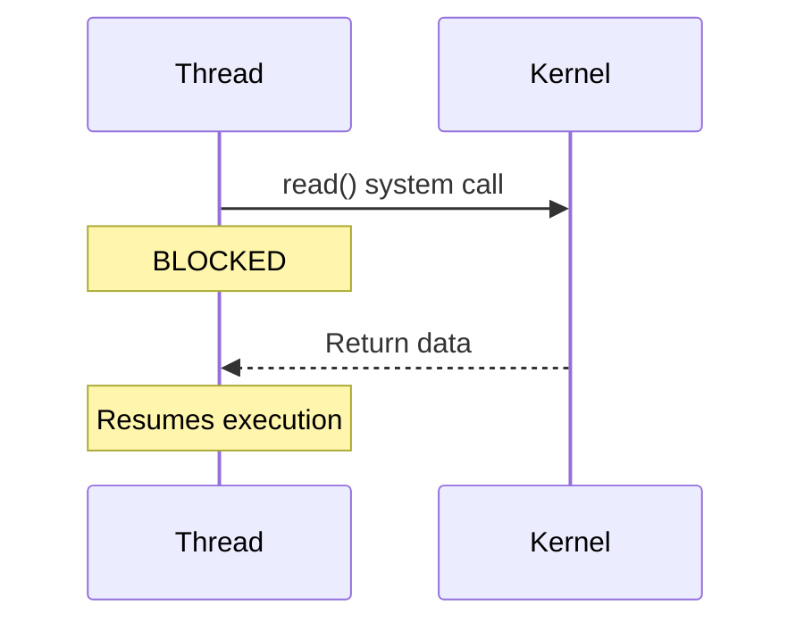
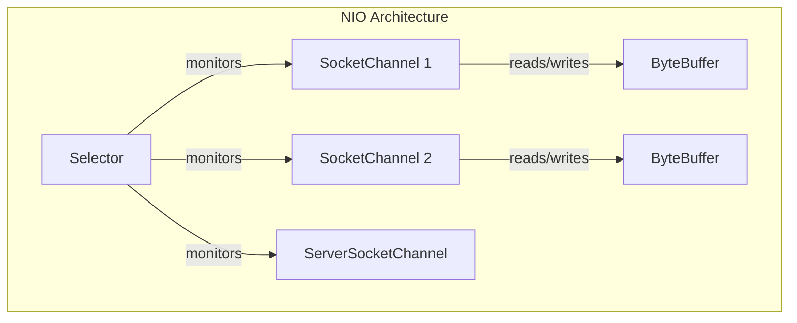
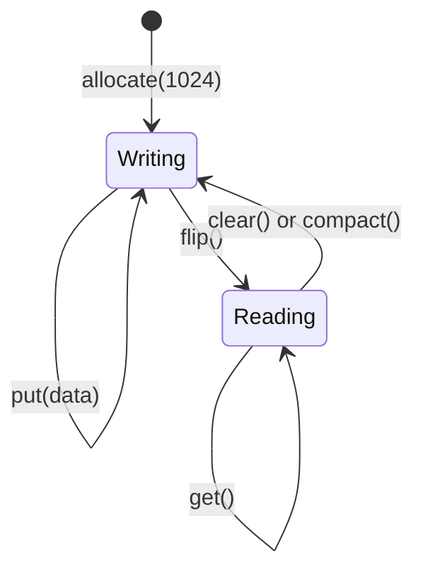
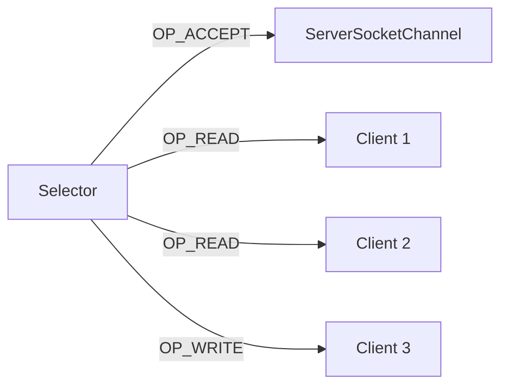
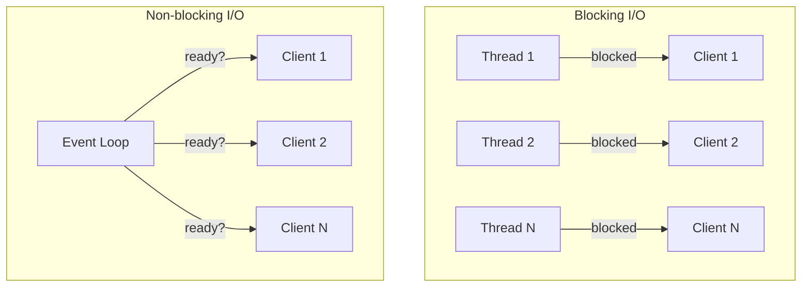
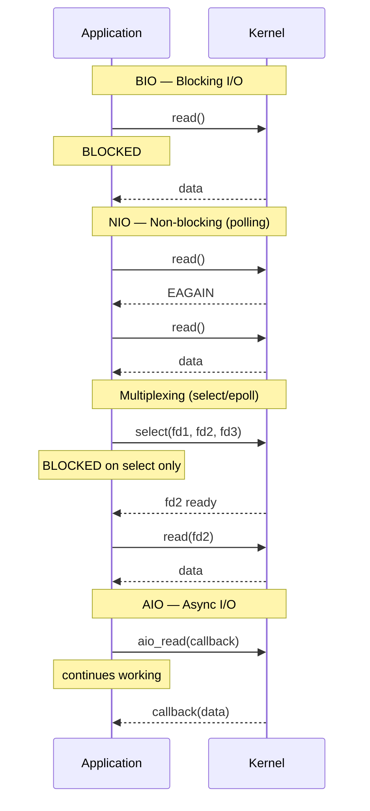
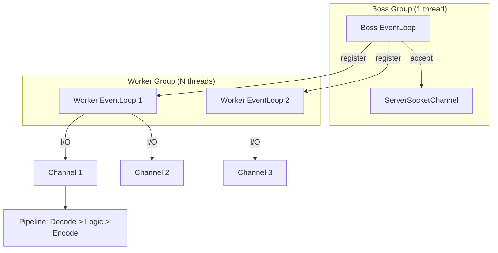
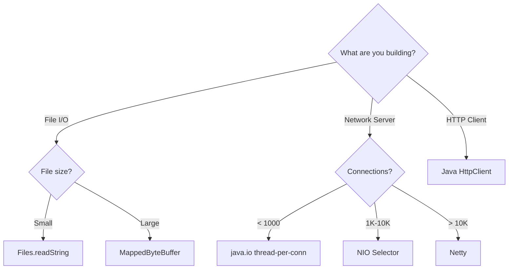

# Java I/O & NIO

!!! info "Why I/O Knowledge Matters for Backend Roles"
    Every backend system is fundamentally an I/O machine — reading requests from the network, querying databases, writing responses. Understanding blocking vs non-blocking I/O, buffer management, and multiplexing is what separates engineers who can design systems handling 10K connections from those stuck at 200. FAANG interviews test this because it underpins web servers, message brokers, and distributed systems.

---

## Traditional I/O (java.io)

The original Java I/O model is **stream-based** and **blocking**. Every read/write call blocks the thread until the operation completes.

| Abstraction | Purpose | Examples |
|---|---|---|
| `InputStream` / `OutputStream` | Byte-oriented I/O | `FileInputStream`, `BufferedOutputStream` |
| `Reader` / `Writer` | Character-oriented I/O (handles encoding) | `FileReader`, `BufferedWriter` |
| Decorator pattern | Wrap streams for functionality | `BufferedReader(new InputStreamReader(...))` |

```java
// This thread is BLOCKED until data arrives
InputStream in = socket.getInputStream();
int data = in.read();  // blocks here — for 10,000 clients you need 10,000 threads
```



**Problems:** one thread per connection (~1MB stack each), context switching overhead, no scatter/gather.

---

## NIO (java.nio) — Buffers, Channels, Selectors

Introduced in Java 1.4: **buffer-oriented**, **channel-based** I/O with optional **non-blocking** mode.



---

## Buffer (ByteBuffer)

| Property | Description |
|---|---|
| **capacity** | Max elements (fixed at creation) |
| **position** | Next index to read/write |
| **limit** | First index NOT to be read/written |
| **mark** | Saved position to return to |

**Invariant:** `0 <= mark <= position <= limit <= capacity`



```java
ByteBuffer buffer = ByteBuffer.allocate(1024);       // Heap buffer
ByteBuffer direct = ByteBuffer.allocateDirect(1024); // Off-heap, faster I/O

buffer.put((byte) 65);
channel.read(buffer);   // Channel writes INTO buffer

buffer.flip();          // limit=position, position=0 — switch to read mode

byte b = buffer.get();
channel.write(buffer);  // Channel reads FROM buffer

buffer.compact();       // Keep unread data, prepare for more writing
buffer.clear();         // Reset position=0, limit=capacity
```

| Aspect | Heap Buffer | Direct Buffer |
|---|---|---|
| Location | JVM heap | Native OS memory |
| Allocation | Fast | Slow (OS call) |
| I/O speed | Slower (kernel copies) | Faster (zero-copy possible) |
| Use case | Short-lived, small | Long-lived, heavy I/O |

---

## Channel

Bidirectional conduit — supports non-blocking mode and works with buffers directly.

| Channel | Purpose |
|---|---|
| `FileChannel` | File read/write (always blocking) |
| `SocketChannel` | TCP client |
| `ServerSocketChannel` | TCP server (accepts connections) |
| `DatagramChannel` | UDP |

```java
// FileChannel with zero-copy transfer
try (FileChannel src = FileChannel.open(Path.of("data.bin"), StandardOpenOption.READ)) {
    FileChannel dest = FileChannel.open(Path.of("copy.bin"), StandardOpenOption.WRITE);
    src.transferTo(0, src.size(), dest);  // Kernel-level zero-copy
}

// Non-blocking SocketChannel
SocketChannel channel = SocketChannel.open();
channel.configureBlocking(false);
channel.connect(new InetSocketAddress("api.example.com", 80));
while (!channel.finishConnect()) { /* do other work */ }
```

---

## Selector — Multiplexing Multiple Channels

A **single thread** monitors multiple channels for readiness events.



| Operation | Constant | Meaning |
|---|---|---|
| Accept | `SelectionKey.OP_ACCEPT` | Ready to accept connection |
| Connect | `SelectionKey.OP_CONNECT` | Connection established |
| Read | `SelectionKey.OP_READ` | Data available to read |
| Write | `SelectionKey.OP_WRITE` | Ready for writing |

```java
Selector selector = Selector.open();
ServerSocketChannel server = ServerSocketChannel.open();
server.bind(new InetSocketAddress(8080));
server.configureBlocking(false);
server.register(selector, SelectionKey.OP_ACCEPT);

while (true) {
    selector.select();  // Blocks until a channel is ready
    Iterator<SelectionKey> iter = selector.selectedKeys().iterator();
    while (iter.hasNext()) {
        SelectionKey key = iter.next();
        iter.remove();
        if (key.isAcceptable()) {
            SocketChannel client = server.accept();
            client.configureBlocking(false);
            client.register(selector, SelectionKey.OP_READ);
        } else if (key.isReadable()) {
            SocketChannel client = (SocketChannel) key.channel();
            ByteBuffer buf = ByteBuffer.allocate(256);
            if (client.read(buf) == -1) { client.close(); continue; }
            buf.flip();
            // process data...
        }
    }
}
```

---

## Blocking vs Non-blocking I/O



| Aspect | Blocking I/O | Non-blocking I/O |
|---|---|---|
| Thread model | 1 thread per connection | 1 thread handles thousands |
| Scalability | Limited by thread count | Limited by file descriptors |
| Complexity | Simple sequential code | Event-driven logic |
| CPU usage | Wasted on idle waits | Works only when data ready |
| Memory | ~1MB per thread | Minimal per connection |

---

## I/O Models Comparison



| Model | Blocking Point | Threads | OS Mechanism |
|---|---|---|---|
| BIO | Every I/O call | 1 per connection | Universal |
| NIO (polling) | None (busy wait) | 1 but wasteful | Universal |
| I/O Multiplexing | `select()`/`epoll()` | 1 for many | Linux: epoll, macOS: kqueue |
| AIO (NIO.2) | None (truly async) | 1 | Linux: io_uring, Windows: IOCP |

---

## Event Loop Pattern (Netty/Reactor)



**How Netty uses NIO:** Boss EventLoop accepts connections via Selector, Worker EventLoops each run a Selector monitoring many channels. Channel Pipeline chains handlers. Zero-copy via direct buffers and `transferTo()`.

```java
EventLoopGroup bossGroup = new NioEventLoopGroup(1);
EventLoopGroup workerGroup = new NioEventLoopGroup(); // 2 * CPU cores

new ServerBootstrap().group(bossGroup, workerGroup)
    .channel(NioServerSocketChannel.class)
    .childHandler(new ChannelInitializer<SocketChannel>() {
        protected void initChannel(SocketChannel ch) {
            ch.pipeline().addLast(new HttpServerCodec(), new MyHandler());
        }
    }).bind(8080).sync();
```

---

## File I/O with NIO

### Path & Files Utility

```java
Path path = Path.of("data", "users.json");
String content = Files.readString(Path.of("config.json"));
List<String> lines = Files.readAllLines(Path.of("data.csv"));
Files.writeString(Path.of("out.txt"), "Hello", StandardOpenOption.CREATE);
Files.copy(source, target, StandardCopyOption.REPLACE_EXISTING);

try (Stream<Path> walk = Files.walk(Path.of("/app/logs"))) {
    walk.filter(p -> p.toString().endsWith(".log")).forEach(System.out::println);
}
```

### Memory-Mapped Files (MappedByteBuffer)

```java
try (FileChannel ch = FileChannel.open(Path.of("huge.dat"), READ, WRITE)) {
    MappedByteBuffer mapped = ch.map(FileChannel.MapMode.READ_WRITE, 0, ch.size());
    int val = mapped.getInt(0);   // Direct memory access — OS handles paging
    mapped.putInt(0, val + 1);
    mapped.force();               // Flush to disk
}
```

### File Watching (WatchService)

```java
WatchService watcher = FileSystems.getDefault().newWatchService();
Path.of("/app/config").register(watcher,
    ENTRY_CREATE, ENTRY_MODIFY, ENTRY_DELETE);
while (true) {
    WatchKey key = watcher.take();  // Blocks until event
    for (WatchEvent<?> e : key.pollEvents())
        System.out.println(e.kind() + ": " + e.context());
    key.reset();
}
```

---

## Networking with NIO — Non-blocking Server

```java
public class NioEchoServer {
    public static void main(String[] args) throws IOException {
        Selector selector = Selector.open();
        ServerSocketChannel server = ServerSocketChannel.open();
        server.bind(new InetSocketAddress(9090));
        server.configureBlocking(false);
        server.register(selector, SelectionKey.OP_ACCEPT);

        while (true) {
            selector.select();
            var keys = selector.selectedKeys().iterator();
            while (keys.hasNext()) {
                SelectionKey key = keys.next(); keys.remove();
                if (key.isAcceptable()) {
                    SocketChannel client = server.accept();
                    client.configureBlocking(false);
                    client.register(selector, SelectionKey.OP_READ, ByteBuffer.allocate(256));
                } else if (key.isReadable()) {
                    SocketChannel client = (SocketChannel) key.channel();
                    ByteBuffer buf = (ByteBuffer) key.attachment();
                    if (client.read(buf) == -1) { client.close(); continue; }
                    buf.flip(); client.write(buf); buf.compact();
                }
            }
        }
    }
}
```

---

## Java HttpClient (Java 11+)

```java
HttpClient client = HttpClient.newBuilder()
    .version(HttpClient.Version.HTTP_2)
    .connectTimeout(Duration.ofSeconds(5)).build();

HttpRequest request = HttpRequest.newBuilder()
    .uri(URI.create("https://api.example.com/users/1"))
    .header("Accept", "application/json").GET().build();

// Synchronous
HttpResponse<String> resp = client.send(request, BodyHandlers.ofString());

// Asynchronous
client.sendAsync(request, BodyHandlers.ofString())
    .thenApply(HttpResponse::body)
    .thenAccept(body -> System.out.println(body));

// WebSocket
client.newWebSocketBuilder()
    .buildAsync(URI.create("wss://stream.example.com"), new WebSocket.Listener() {
        public CompletionStage<?> onText(WebSocket ws, CharSequence data, boolean last) {
            System.out.println("Received: " + data);
            return WebSocket.Listener.super.onText(ws, data, last);
        }
    }).join().sendText("Hello", true);
```

---

## When to Use What

| Scenario | Recommended | Why |
|---|---|---|
| Simple file read/write | `Files` utility | Easy, sufficient for most apps |
| High-concurrency (10K+ conns) | NIO Selector or Netty | Thread-per-connection fails |
| HTTP calls | `HttpClient` (Java 11+) | Built-in, async, HTTP/2 |
| Large file processing | `MappedByteBuffer` | Zero-copy, memory-efficient |
| Microservice framework | Netty (WebFlux, Vert.x) | Battle-tested pipeline |
| File monitoring | `WatchService` (NIO.2) | OS-native events |
| Custom binary protocols | Netty | Codec pipeline, backpressure |



---

## Interview Questions

??? question "1. Explain the difference between java.io streams and NIO channels. When would you choose one over the other?"
    Streams are unidirectional (input OR output), byte-at-a-time, and always blocking. Channels are bidirectional, buffer-oriented, and support non-blocking mode. Use streams for simple file operations or when code clarity matters. Use NIO channels when you need non-blocking network I/O, memory-mapped files, or when a single thread must handle many connections simultaneously (via Selectors).

??? question "2. What happens when you call ByteBuffer.flip()? Why is it necessary?"
    `flip()` transitions a buffer from write mode to read mode. It sets `limit = position` (marking the end of written data) and `position = 0` (reading starts from beginning). Without flip, you'd read from the current position past the data — reading garbage. It's the most common NIO bug: forgetting to flip before reading.

??? question "3. How does a Selector-based server handle 50,000 concurrent connections with just a few threads?"
    The Selector uses OS-level I/O multiplexing (epoll on Linux, kqueue on macOS). A single `select()` call blocks until ANY registered channel has a readiness event. The thread iterates only over ready channels, processes their data, and loops back. Since most connections are idle, one thread efficiently handles thousands. Netty adds a pool of EventLoops (2x CPU cores) to parallelize across cores.

??? question "4. What is the difference between direct and heap ByteBuffers? When should you use direct buffers?"
    Heap buffers live in JVM heap and are subject to GC. Direct buffers are allocated in native OS memory. For I/O, the kernel needs native memory — heap buffers require an extra copy. Direct buffers are faster for I/O but slower to allocate. Use direct buffers for long-lived buffers with heavy I/O (network servers). Use heap buffers for short-lived, small operations.

??? question "5. Explain how Netty's event loop achieves high throughput. What should you never do inside an event loop?"
    Netty assigns each channel to one EventLoop. That EventLoop runs a tight loop: select for ready events, process I/O, run tasks. Since one thread owns a channel, there's no synchronization overhead. NEVER perform blocking operations (DB calls, Thread.sleep, synchronous HTTP) inside an event loop — it blocks ALL channels on that thread. Offload blocking work to a separate pool.

??? question "6. Compare I/O multiplexing (epoll) with async I/O (io_uring). Why does Java mostly use epoll-based NIO?"
    With epoll, the app is notified when data IS READY — the `read()` still copies from kernel to user space. With async I/O (io_uring/IOCP), the kernel performs the entire operation and delivers completed data. Java's NIO.2 `AsynchronousSocketChannel` has poor Linux support (falls back to thread pools). Netty on epoll is battle-tested and sufficient. Project Loom (virtual threads) changes the equation by making blocking I/O cheap again.
