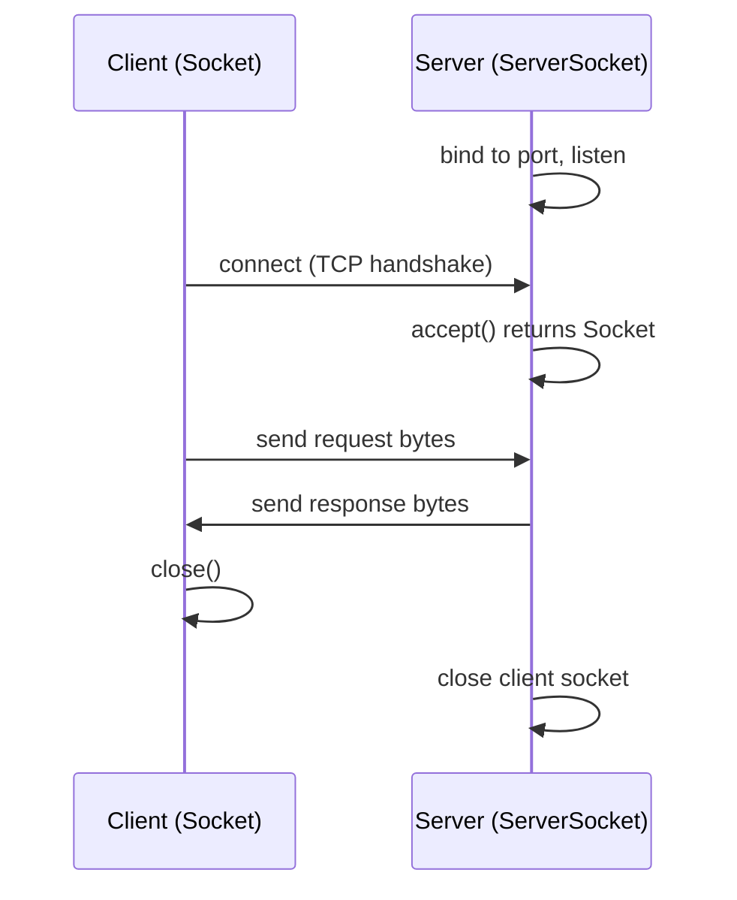

# Java Networking

Java provides a rich set of classes in `java.net` and `java.nio.channels` for building networked applications -- from simple client-server sockets to high-performance non-blocking servers. Networking is a frequent interview topic because it ties together I/O, concurrency, and protocol knowledge.

---

## Socket Programming Fundamentals

A **socket** is one endpoint of a two-way communication link between programs running on a network. Java's `Socket` (client) and `ServerSocket` (server) classes implement TCP communication.



### TCP Server

```java
try (ServerSocket server = new ServerSocket(8080)) {
    System.out.println("Listening on port 8080...");
    while (true) {
        Socket client = server.accept(); // blocks until a client connects
        try (BufferedReader in = new BufferedReader(
                 new InputStreamReader(client.getInputStream()));
             PrintWriter out = new PrintWriter(client.getOutputStream(), true)) {

            String request = in.readLine();
            System.out.println("Received: " + request);
            out.println("Echo: " + request);
        }
        client.close();
    }
}
```

### TCP Client

```java
try (Socket socket = new Socket("localhost", 8080);
     PrintWriter out = new PrintWriter(socket.getOutputStream(), true);
     BufferedReader in = new BufferedReader(
         new InputStreamReader(socket.getInputStream()))) {

    out.println("Hello, Server!");
    String response = in.readLine();
    System.out.println("Server replied: " + response);
}
```

!!! tip "Socket Timeouts"
    Always set `socket.setSoTimeout(5000)` to avoid hanging indefinitely on read operations. A `SocketTimeoutException` is thrown when the timeout expires.

---

## TCP vs UDP

| Aspect | TCP (`Socket`) | UDP (`DatagramSocket`) |
|---|---|---|
| Connection | Connection-oriented (3-way handshake) | Connectionless |
| Reliability | Guaranteed delivery, ordering | Best-effort, no ordering guarantee |
| Speed | Slower due to overhead | Faster, minimal overhead |
| Use case | HTTP, file transfer, email | DNS, video streaming, gaming |
| Java classes | `Socket`, `ServerSocket` | `DatagramSocket`, `DatagramPacket` |

### UDP Sender

```java
DatagramSocket socket = new DatagramSocket();
byte[] data = "Hello via UDP".getBytes();
InetAddress address = InetAddress.getByName("localhost");
DatagramPacket packet = new DatagramPacket(data, data.length, address, 9090);
socket.send(packet);
socket.close();
```

### UDP Receiver

```java
DatagramSocket socket = new DatagramSocket(9090);
byte[] buffer = new byte[1024];
DatagramPacket packet = new DatagramPacket(buffer, buffer.length);

socket.receive(packet); // blocks until a packet arrives
String message = new String(packet.getData(), 0, packet.getLength());
System.out.println("Received: " + message);
socket.close();
```

---

## URL and HttpURLConnection

The classic (pre-Java 11) way to make HTTP requests. Still found in legacy codebases.

```java
URL url = new URL("https://api.example.com/users/1");
HttpURLConnection conn = (HttpURLConnection) url.openConnection();
conn.setRequestMethod("GET");
conn.setConnectTimeout(5000);
conn.setReadTimeout(5000);

if (conn.getResponseCode() == 200) {
    try (var reader = new BufferedReader(new InputStreamReader(conn.getInputStream()))) {
        reader.lines().forEach(System.out::println);
    }
}
conn.disconnect();
```

!!! warning "HttpURLConnection Pitfalls"
    Not thread-safe (create one per request), does not handle HTTP-to-HTTPS redirects, and error responses require `getErrorStream()` instead of `getInputStream()`.

---

## Java HttpClient (Java 11+)

The modern replacement for `HttpURLConnection`. Supports HTTP/1.1, HTTP/2, synchronous and asynchronous calls, and WebSocket.

### Synchronous Request

```java
HttpClient client = HttpClient.newBuilder()
    .connectTimeout(Duration.ofSeconds(5))
    .followRedirects(HttpClient.Redirect.NORMAL)
    .build();

HttpRequest request = HttpRequest.newBuilder()
    .uri(URI.create("https://api.example.com/users"))
    .header("Accept", "application/json")
    .GET()
    .build();

HttpResponse<String> response = client.send(request, HttpResponse.BodyHandlers.ofString());
System.out.println("Status: " + response.statusCode());
System.out.println("Body: " + response.body());
```

### Asynchronous Request

```java
HttpClient client = HttpClient.newHttpClient();
HttpRequest request = HttpRequest.newBuilder()
    .uri(URI.create("https://api.example.com/users")).build();

client.sendAsync(request, HttpResponse.BodyHandlers.ofString())
    .thenAccept(resp -> System.out.println(resp.statusCode() + ": " + resp.body()))
    .join(); // block only if needed
```

### POST with JSON Body

```java
HttpRequest post = HttpRequest.newBuilder()
    .uri(URI.create("https://api.example.com/users"))
    .header("Content-Type", "application/json")
    .POST(HttpRequest.BodyPublishers.ofString("""
        {"name": "Vamsi", "email": "vamsi@example.com"}
        """))
    .build();
HttpResponse<String> response = client.send(post, HttpResponse.BodyHandlers.ofString());
```

---

## InetAddress and NetworkInterface

### InetAddress -- DNS Resolution

```java
InetAddress addr = InetAddress.getByName("google.com");
System.out.println("IP: " + addr.getHostAddress());       // resolve to IP
InetAddress[] all = InetAddress.getAllByName("google.com"); // all IPs (load-balanced)
boolean reachable = addr.isReachable(3000);                // ping-like check
```

### NetworkInterface -- Local Network Info

```java
NetworkInterface.getNetworkInterfaces().asIterator().forEachRemaining(ni -> {
    System.out.println("Interface: " + ni.getDisplayName());
    ni.getInetAddresses().asIterator()
      .forEachRemaining(addr -> System.out.println("  " + addr.getHostAddress()));
});
```

---

## Multi-Threaded Server

The single-threaded server above can only handle one client at a time. Production servers need concurrency.

### Thread-Per-Connection

```java
public class ThreadPerConnectionServer {
    public static void main(String[] args) throws IOException {
        ServerSocket server = new ServerSocket(8080);
        System.out.println("Server started on port 8080");

        while (true) {
            Socket client = server.accept();
            new Thread(() -> handleClient(client)).start();
        }
    }

    static void handleClient(Socket client) {
        try (BufferedReader in = new BufferedReader(
                 new InputStreamReader(client.getInputStream()));
             PrintWriter out = new PrintWriter(client.getOutputStream(), true)) {

            String msg;
            while ((msg = in.readLine()) != null) {
                out.println("Echo: " + msg);
            }
        } catch (IOException e) {
            e.printStackTrace();
        }
    }
}
```

!!! danger "Thread-Per-Connection Limitations"
    Creating an unbounded number of threads will exhaust memory. Each thread uses ~512KB-1MB of stack space. With 10,000 connections, that is 5-10 GB of stack memory alone.

### Thread Pool Server (Production Pattern)

Replace `new Thread(...).start()` with a bounded pool -- only change needed:

```java
ExecutorService pool = Executors.newFixedThreadPool(200);
ServerSocket server = new ServerSocket(8080);

while (true) {
    Socket client = server.accept();
    pool.submit(() -> handleClient(client)); // bounded concurrency
}
```

| Model | Max Connections | Memory Usage | Complexity |
|---|---|---|---|
| Single-threaded | 1 at a time | Minimal | Trivial |
| Thread-per-connection | OS thread limit | Very high | Low |
| Thread pool | Pool size | Bounded | Low |
| Non-blocking I/O (NIO) | 10,000s+ | Low | High |
| Virtual Threads (Java 21) | Millions | Low | Low |

---

## Non-Blocking I/O (NIO)

Java NIO uses **Selectors** to multiplex many channels on a single thread. One thread can manage thousands of connections.

### NIO Echo Server

```java
public class NioEchoServer {
    public static void main(String[] args) throws IOException {
        Selector selector = Selector.open();
        ServerSocketChannel serverChannel = ServerSocketChannel.open();
        serverChannel.bind(new InetSocketAddress(8080));
        serverChannel.configureBlocking(false);
        serverChannel.register(selector, SelectionKey.OP_ACCEPT);

        System.out.println("NIO server listening on port 8080");
        ByteBuffer buffer = ByteBuffer.allocate(1024);

        while (true) {
            selector.select(); // blocks until at least one channel is ready
            Iterator<SelectionKey> keys = selector.selectedKeys().iterator();

            while (keys.hasNext()) {
                SelectionKey key = keys.next();
                keys.remove();

                if (key.isAcceptable()) {
                    SocketChannel client = serverChannel.accept();
                    client.configureBlocking(false);
                    client.register(selector, SelectionKey.OP_READ);
                } else if (key.isReadable()) {
                    SocketChannel client = (SocketChannel) key.channel();
                    buffer.clear();
                    int bytesRead = client.read(buffer);
                    if (bytesRead == -1) {
                        client.close();
                        continue;
                    }
                    buffer.flip();
                    client.write(buffer); // echo back
                }
            }
        }
    }
}
```

!!! info "When to Use NIO"
    Use NIO when you need to handle **thousands of simultaneous connections** with low latency (chat servers, game servers, trading systems). For simpler use cases, blocking I/O with a thread pool is easier to reason about.

---

## SSL/TLS Sockets

Secure communication using `javax.net.ssl`.

### SSL Client

```java
SSLSocketFactory factory = (SSLSocketFactory) SSLSocketFactory.getDefault();
try (SSLSocket socket = (SSLSocket) factory.createSocket("example.com", 443)) {
    socket.setEnabledProtocols(new String[]{"TLSv1.3"});
    PrintWriter out = new PrintWriter(socket.getOutputStream(), true);
    BufferedReader in = new BufferedReader(new InputStreamReader(socket.getInputStream()));
    out.println("GET / HTTP/1.1\r\nHost: example.com\r\n\r\n");
    System.out.println(in.readLine());
}
```

### SSL Server

```java
SSLServerSocketFactory factory = (SSLServerSocketFactory) SSLServerSocketFactory.getDefault();
SSLServerSocket server = (SSLServerSocket) factory.createServerSocket(8443);
server.setEnabledProtocols(new String[]{"TLSv1.3"});
SSLSocket client = (SSLSocket) server.accept(); // read/write as normal sockets
```

!!! tip "KeyStore and TrustStore"
    - **KeyStore** holds the server's private key and certificate (identity).
    - **TrustStore** holds trusted CA certificates (who you trust).
    - Set via system properties: `-Djavax.net.ssl.keyStore=keystore.jks -Djavax.net.ssl.trustStore=truststore.jks`

---

## Multicast Sockets

One-to-many communication -- the sender transmits once, all group members receive.

```java
// Sender
MulticastSocket sender = new MulticastSocket();
InetAddress group = InetAddress.getByName("230.0.0.1");
byte[] data = "Hello, group!".getBytes();
sender.send(new DatagramPacket(data, data.length, group, 5000));

// Receiver
MulticastSocket receiver = new MulticastSocket(5000);
receiver.joinGroup(group);
byte[] buf = new byte[1024];
DatagramPacket pkt = new DatagramPacket(buf, buf.length);
receiver.receive(pkt);
System.out.println(new String(pkt.getData(), 0, pkt.getLength()));
receiver.leaveGroup(group);
```

---

## URI vs URL

| Aspect | URI | URL |
|---|---|---|
| Full name | Uniform Resource Identifier | Uniform Resource Locator |
| Purpose | Identifies a resource | Identifies **and locates** a resource |
| Example | `urn:isbn:0451450523` | `https://example.com/page` |
| Java class | `java.net.URI` | `java.net.URL` |
| Network access | No -- pure identifier | Yes -- `openConnection()` fetches data |
| Recommended | Preferred for parsing/building | Deprecated pattern for new code |

```java
URI uri = new URI("https", "example.com", "/api/users", "active=true", null);
System.out.println(uri); // https://example.com/api/users?active=true

// Convert between URI and URL
URL url = uri.toURL();
URI backToUri = url.toURI();
```

!!! note "Prefer URI"
    `URL.equals()` performs DNS resolution and blocks, making it unsuitable for use in `HashMap` keys. Always use `URI` for comparisons and storage.

---

## Proxy Configuration

### Programmatic Proxy

```java
Proxy proxy = new Proxy(Proxy.Type.HTTP, new InetSocketAddress("proxy.corp.com", 3128));

// With HttpURLConnection
URL url = new URL("https://api.example.com/data");
HttpURLConnection conn = (HttpURLConnection) url.openConnection(proxy);

// With Java HttpClient
HttpClient client = HttpClient.newBuilder()
    .proxy(ProxySelector.of(new InetSocketAddress("proxy.corp.com", 3128)))
    .build();
```

### System Properties Proxy

Set via JVM args or code: `-Dhttp.proxyHost=proxy.corp.com -Dhttp.proxyPort=3128 -Dhttps.proxyHost=proxy.corp.com -Dhttps.proxyPort=3128 -Dhttp.nonProxyHosts="localhost|127.0.0.1|*.internal.com"`

---

## Common Patterns

### Simple Chat Server

```java
public class ChatServer {
    private static final Set<PrintWriter> clients = ConcurrentHashMap.newKeySet();

    public static void main(String[] args) throws IOException {
        ExecutorService pool = Executors.newCachedThreadPool();
        ServerSocket server = new ServerSocket(9000);

        while (true) {
            Socket socket = server.accept();
            pool.submit(() -> {
                try (var in = new BufferedReader(new InputStreamReader(socket.getInputStream()));
                     var out = new PrintWriter(socket.getOutputStream(), true)) {
                    clients.add(out);
                    String msg;
                    while ((msg = in.readLine()) != null) {
                        String broadcast = msg;
                        clients.forEach(c -> c.println(broadcast));
                    }
                } catch (IOException e) { e.printStackTrace(); }
            });
        }
    }
}
```

### File Transfer

```java
public static void sendFile(Socket socket, String filePath) throws IOException {
    File file = new File(filePath);
    var dos = new DataOutputStream(socket.getOutputStream());
    dos.writeUTF(file.getName());   // send filename
    dos.writeLong(file.length());   // send size
    try (var fis = new FileInputStream(file)) {
        fis.transferTo(dos);        // Java 9+ -- efficient bulk copy
    }
    dos.flush();
}
```

### HTTP Client Utility

```java
public class HttpUtil {
    private static final HttpClient CLIENT = HttpClient.newBuilder()
        .connectTimeout(Duration.ofSeconds(10))
        .followRedirects(HttpClient.Redirect.NORMAL)
        .build();

    public static String get(String url) throws IOException, InterruptedException {
        HttpRequest request = HttpRequest.newBuilder()
            .uri(URI.create(url))
            .timeout(Duration.ofSeconds(30))
            .GET().build();

        HttpResponse<String> resp = CLIENT.send(request, HttpResponse.BodyHandlers.ofString());
        if (resp.statusCode() >= 400)
            throw new IOException("HTTP " + resp.statusCode());
        return resp.body();
    }
}
```

---

## Key Classes Reference

| Class | Purpose |
|---|---|
| `Socket` / `ServerSocket` | TCP client and server |
| `DatagramSocket` / `DatagramPacket` | UDP communication |
| `InetAddress` | IP address and DNS resolution |
| `URI` / `URL` | Resource identifier / locator |
| `HttpURLConnection` | Classic HTTP client |
| `HttpClient` (`java.net.http`) | Modern HTTP client (Java 11+) |
| `SSLSocket` / `SSLServerSocket` | TLS-encrypted sockets |
| `Selector` / `SocketChannel` | NIO multiplexing |
| `ServerSocketChannel` | NIO server channel |

---

## Interview Questions

??? question "What is the difference between TCP and UDP? When would you choose one over the other?"
    **TCP** is connection-oriented, guarantees delivery and ordering via a 3-way handshake. **UDP** is connectionless with no delivery guarantees but lower overhead.

    Choose **TCP** for file transfers, HTTP, email -- anything needing data integrity. Choose **UDP** for real-time streaming, DNS, gaming -- where speed beats occasional packet loss. Java: TCP uses `Socket`/`ServerSocket`, UDP uses `DatagramSocket`/`DatagramPacket`.

??? question "Explain the Java NIO model. Why is it more scalable than thread-per-connection?"
    Blocking I/O dedicates one thread (~1MB stack) per connection. NIO uses a **Selector** that monitors multiple **Channels** from a single thread, blocking on `select()` until channels are ready. One thread can handle tens of thousands of connections. Key classes: `Selector`, `ServerSocketChannel`, `SocketChannel`, `ByteBuffer`. The tradeoff is complexity -- frameworks like Netty abstract this.

??? question "How does the Java 11 HttpClient differ from HttpURLConnection?"
    `HttpClient` is immutable, thread-safe, supports **HTTP/2**, **async** (`sendAsync()` with `CompletableFuture`), **WebSocket**, and has a fluent builder API. One instance can be shared across threads. `HttpURLConnection` is mutable, not thread-safe, requires manual stream management, has no async support, and cannot handle HTTP/2.

??? question "What happens when you call ServerSocket.accept()?"
    `accept()` is a **blocking** call. The thread stops executing until a client initiates a TCP connection. When a connection arrives, the TCP 3-way handshake completes at the OS level, and `accept()` returns a new `Socket` object representing the connection to that specific client. The `ServerSocket` continues to listen for new connections on the same port.

    This is why multi-threaded servers immediately hand off the returned socket to a worker thread -- so the main thread can loop back to `accept()` the next connection.

??? question "What is the difference between URI and URL in Java? Why does URL.equals() cause problems?"
    A **URI** is a pure identifier (syntax only). A **URL** also specifies how to locate the resource. `URL.equals()` performs **DNS resolution** to compare hosts -- it blocks on network I/O, gives inconsistent results, and is unsuitable as a `HashMap` key. `URI.equals()` does a simple string comparison. Best practice: use `URI` for parsing/comparing/storing, convert to `URL` only to open a connection.

??? question "How would you design a multi-threaded TCP server that handles 10,000 concurrent connections?"
    1. **Thread pool**: Fixed pool of 200-500 threads. Simple but connections beyond pool size queue up.
    2. **NIO with Selector**: One selector thread dispatches ready channels to a small worker pool. Handles 10K+ connections with minimal threads. This is how Netty and Tomcat NIO work.
    3. **Virtual Threads (Java 21+)**: `Executors.newVirtualThreadPerTaskExecutor()` with blocking I/O. Each virtual thread costs ~1KB. Simplicity of thread-per-connection with NIO scalability.

    For 10K connections, NIO or virtual threads are the right choice.

??? question "How does SSL/TLS work with Java sockets? What is the role of KeyStore and TrustStore?"
    - **KeyStore**: Holds the server's private key and certificate chain (identity).
    - **TrustStore**: Holds trusted CA certificates. Java ships with a default truststore (`cacerts`).

    During the TLS handshake: client connects, server presents its certificate, client verifies it against the truststore, they negotiate a cipher suite, and establish a symmetric session key. All subsequent data is encrypted.

??? question "Explain socket options: SO_TIMEOUT, SO_REUSEADDR, TCP_NODELAY, SO_KEEPALIVE."
    - **SO_TIMEOUT**: Sets a timeout (in ms) for blocking read operations. A `SocketTimeoutException` is thrown if no data arrives in time. Essential to prevent threads from blocking forever.
    - **SO_REUSEADDR**: Allows binding to a port that is in the `TIME_WAIT` state after a previous connection closed. Critical for server restarts -- without it, you get "Address already in use" errors.
    - **TCP_NODELAY**: Disables Nagle's algorithm, which batches small packets. Setting this to `true` sends data immediately, reducing latency at the cost of more packets. Important for interactive applications (chat, gaming).
    - **SO_KEEPALIVE**: Enables periodic probe packets on idle connections to detect dead peers. The OS sends probes after ~2 hours of inactivity by default.

??? question "What is a multicast socket and when would you use it?"
    Multicast sends a single packet to a **group** of receivers. The sender transmits once, and the network infrastructure replicates the packet to all group members. This is far more efficient than unicasting the same data to each receiver individually.

    In Java, `MulticastSocket` extends `DatagramSocket`. Receivers call `joinGroup(InetAddress)` with a multicast address (224.0.0.0 - 239.255.255.255). The sender sends a `DatagramPacket` to the group address.

    Use cases: live video/audio streaming, stock ticker distribution, service discovery (e.g., mDNS), cluster membership protocols, and real-time sensor data distribution.

??? question "Compare the concurrency models: thread-per-connection, thread pool, NIO, and virtual threads."
    | Model | Threads for 10K conns | Memory | Complexity |
    |---|---|---|---|
    | Thread-per-connection | 10,000 | ~10GB | Very low |
    | Fixed thread pool | 200-500 | ~500MB | Low |
    | NIO (Selector) | 1-8 | ~50MB | High |
    | Virtual threads (Java 21) | 10,000 virtual | ~10MB | Very low |

    Thread-per-connection does not scale. Thread pools bound concurrency but queue excess connections. NIO is the most scalable but complex. Virtual threads combine blocking I/O simplicity with NIO-level scalability.
