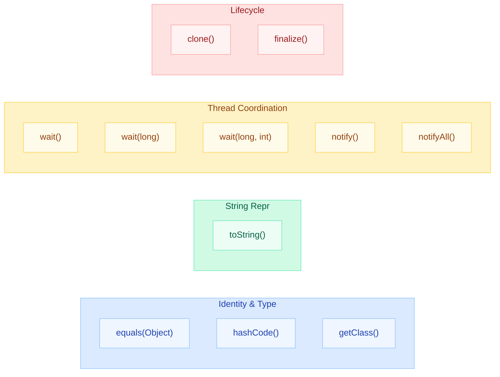
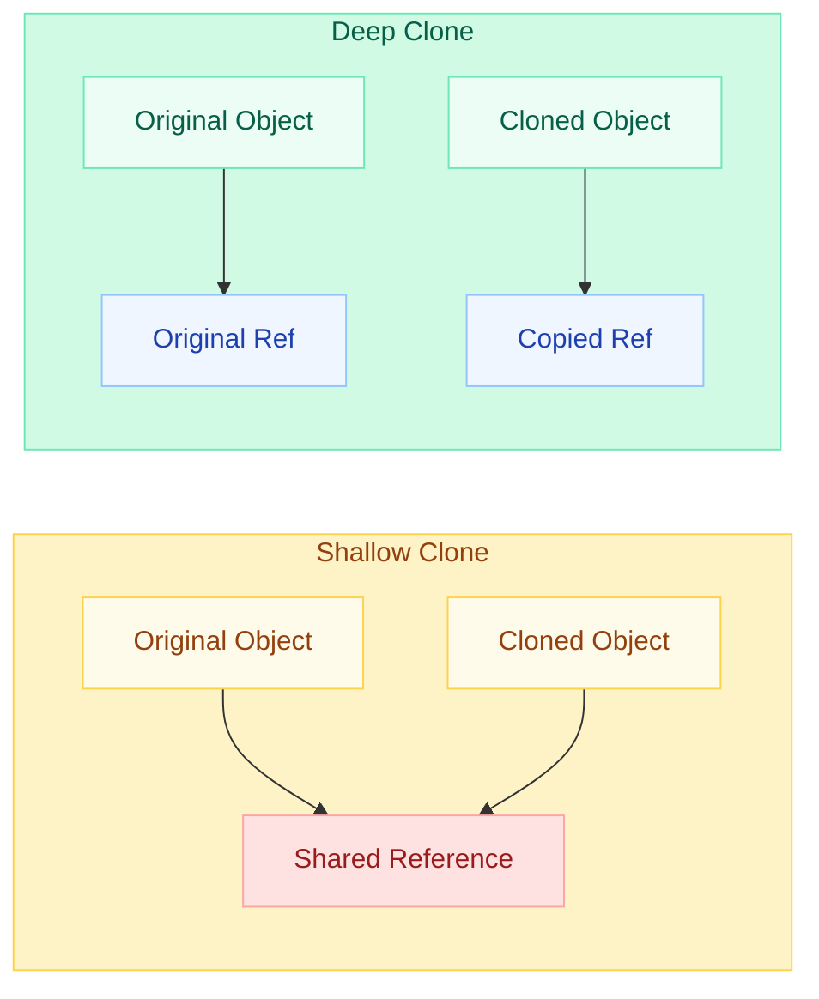
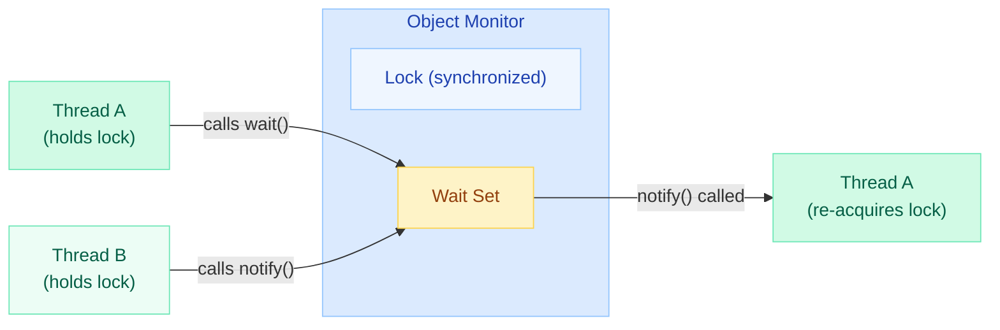

# java.lang.Object Class Methods

Every class in Java implicitly extends `Object`. Its 11 methods form the foundation of identity, synchronization, and lifecycle management in the JVM.

!!! danger "Deadlock from Improper wait/notify"
    Calling `wait()` and `notify()` on **different monitor objects** or forgetting to hold the lock causes `IllegalMonitorStateException` or permanent thread starvation. Always synchronize on the **same object** you call wait/notify on, and always use a **while-loop** guard.

---

## All 11 Methods — Category Map



---

## toString()

### Default Behavior

```java
Object obj = new Object();
System.out.println(obj.toString());
// Output: java.lang.Object@1b6d3586
// Format: getClass().getName() + "@" + Integer.toHexString(hashCode())
```

The default output is **useless for debugging** — it shows the class name and the identity hash code (memory-derived).

### Proper Override

```java
public class Employee {
    private int id;
    private String name;
    private String dept;

    @Override
    public String toString() {
        return "Employee{id=%d, name='%s', dept='%s'}".formatted(id, name, dept);
    }
}
// Output: Employee{id=42, name='Vamsi', dept='Engineering'}
```

**Best practices:**

- Include all meaningful fields
- Use a format that is human-readable and parseable in logs
- Never include sensitive data (passwords, tokens)
- Lombok: `@ToString` generates it automatically
- Records: auto-generated from all components

---

## equals()

### The Contract (from Javadoc)

| Property | Rule | Violation Example |
|---|---|---|
| **Reflexive** | `x.equals(x)` is `true` | Returning false for self-comparison |
| **Symmetric** | `x.equals(y)` implies `y.equals(x)` | Using `instanceof` across parent-child |
| **Transitive** | `x.equals(y)` and `y.equals(z)` implies `x.equals(z)` | Adding fields in subclass |
| **Consistent** | Repeated calls return same result | Using mutable or random fields |
| **Non-null** | `x.equals(null)` is `false` | Throwing NPE instead of returning false |

### Correct Template

```java
@Override
public boolean equals(Object o) {
    if (this == o) return true;                            // 1. Reference check
    if (o == null || getClass() != o.getClass()) return false; // 2. Null + type check
    Employee that = (Employee) o;                          // 3. Cast
    return id == that.id                                   // 4. Compare fields
        && Objects.equals(name, that.name)
        && Objects.equals(dept, that.dept);
}
```

### Common Mistakes

| Mistake | Why It Breaks |
|---|---|
| `equals(Employee e)` instead of `equals(Object o)` | Overloads instead of overrides — HashMap calls `equals(Object)` |
| Using `instanceof` with inheritance | Parent.equals(Child) may be true but Child.equals(Parent) false (asymmetry) |
| Including mutable fields | Object "changes identity" after being stored in a Set |
| Not overriding `hashCode()` | Contract violation — HashMap/HashSet silently fails |

---

## hashCode()

### Contract with equals()

1. **If `a.equals(b)` is `true`** then `a.hashCode() == b.hashCode()` MUST be true
2. **If `a.equals(b)` is `false`** then hashCodes MAY or MAY NOT differ (but should, for performance)
3. **Consistency**: same value across multiple calls in one execution (may differ across JVM restarts)

### Algorithm Choices

| Approach | Code | Use When |
|---|---|---|
| `Objects.hash()` | `Objects.hash(id, name)` | General use (auto-boxes primitives) |
| Manual (Joshua Bloch) | `31 * result + field.hashCode()` | Performance-critical |
| Single int field | `return id;` | Single-field identity |
| Records | Auto-generated | Java 16+ |

```java
// Manual high-performance hashCode
@Override
public int hashCode() {
    int result = Integer.hashCode(id);
    result = 31 * result + (name != null ? name.hashCode() : 0);
    result = 31 * result + (dept != null ? dept.hashCode() : 0);
    return result;
}
```

**Why 31?** It is an odd prime. The JVM optimizes `31 * i` to `(i << 5) - i`. Good distribution with minimal collisions.

---

## clone()

### Shallow vs Deep Copy



### How clone() Works

```java
public class Address implements Cloneable {
    String city;
}

public class Employee implements Cloneable {
    int id;
    String name;
    Address address;  // mutable reference

    @Override
    public Employee clone() {
        try {
            Employee copy = (Employee) super.clone();  // shallow copy
            copy.address = new Address(address.city);  // deep copy mutable fields
            return copy;
        } catch (CloneNotSupportedException e) {
            throw new AssertionError();  // should never happen
        }
    }
}
```

### Why clone() Is Broken (Effective Java, Item 13)

| Problem | Explanation |
|---|---|
| **Cloneable is a marker interface** | Has no `clone()` method — it modifies behavior of `Object.clone()` (magical) |
| **No constructor called** | `super.clone()` creates objects without calling constructors — bypasses invariants |
| **Shallow by default** | You must manually deep-copy every mutable field |
| **Covariant return fragile** | If a subclass forgets to call `super.clone()`, the chain breaks |
| **Checked exception** | `CloneNotSupportedException` is a checked exception on a method you always support |

### Alternatives to clone()

```java
// 1. Copy constructor (preferred)
public Employee(Employee other) {
    this.id = other.id;
    this.name = other.name;
    this.address = new Address(other.address.city);
}

// 2. Static factory
public static Employee copyOf(Employee other) {
    return new Employee(other.id, other.name, new Address(other.address.city));
}

// 3. Serialization-based deep copy (heavy but generic)
```

---

## finalize() — Deprecated Since Java 9

### Why finalize() Is Dangerous

| Problem | Impact |
|---|---|
| **Unpredictable timing** | GC decides when (or if) finalize runs — may never run |
| **Resurrection problem** | Object can "revive" itself by storing `this` in a static field during finalization |
| **Performance penalty** | Finalizable objects require 2 GC cycles to collect (enqueued, then swept) |
| **Thread safety** | Finalizer runs on an arbitrary GC thread — race conditions |
| **Blocks GC** | Slow finalizers back up the finalizer queue, causing `OutOfMemoryError` |
| **Inheritance hazard** | Subclass finalizer may forget to call `super.finalize()` |

### Resurrection Problem

```java
public class Zombie {
    static Zombie instance;

    @Override
    protected void finalize() {
        instance = this;  // object resurrects itself!
        // GC cannot collect it — it's reachable again
    }
}
```

### Alternatives

```java
// 1. try-with-resources (preferred for I/O)
try (var conn = dataSource.getConnection()) {
    // use connection
}  // auto-closed here

// 2. java.lang.ref.Cleaner (Java 9+)
private static final Cleaner CLEANER = Cleaner.create();

public class Resource {
    private final Cleaner.Cleanable cleanable;

    public Resource() {
        State state = new State(/* native resource */);
        this.cleanable = CLEANER.register(this, state);
    }

    // State must NOT reference the Resource (prevent leak)
    private static class State implements Runnable {
        @Override
        public void run() { /* release native resource */ }
    }

    public void close() {
        cleanable.clean();  // explicit cleanup
    }
}
```

---

## getClass()

Returns the **runtime** `Class<?>` object. Cannot be overridden (it is `final`).

```java
Object obj = "Hello";
Class<?> cls = obj.getClass();

cls.getName();         // "java.lang.String"
cls.getSimpleName();   // "String"
cls.getSuperclass();   // class java.lang.Object
cls.getInterfaces();   // [Serializable, Comparable, CharSequence, ...]
```

### Generics Erasure

```java
List<String> strings = new ArrayList<>();
List<Integer> ints = new ArrayList<>();

// Both return class java.util.ArrayList at runtime
strings.getClass() == ints.getClass();  // TRUE — generics are erased

// Cannot do: if (obj instanceof List<String>) — compiler error
// Can do:    if (obj instanceof List<?>) — wildcard only
```

### Use Cases

| Use Case | Example |
|---|---|
| Type checking in equals() | `getClass() != o.getClass()` |
| Reflection | `obj.getClass().getDeclaredFields()` |
| Logging | `logger = Logger.getLogger(getClass().getName())` |
| Factory patterns | `Class.forName("com.example.MyClass").newInstance()` |

---

## wait() / notify() / notifyAll()

### Monitor Mechanism

Every Java object has an **intrinsic lock (monitor)**. The wait/notify mechanism allows threads to coordinate using this monitor.



### Spurious Wakeups and the Proper Pattern

A thread can wake from `wait()` **without** being notified (spurious wakeup). You MUST always use a while-loop guard.

```java
// WRONG — if/single check
synchronized (lock) {
    if (!condition) {
        lock.wait();  // spurious wakeup resumes here with condition still false!
    }
    // proceed — BUG: condition might be false
}

// CORRECT — while-loop guard
synchronized (lock) {
    while (!condition) {     // re-check after every wakeup
        lock.wait();
    }
    // proceed — condition is guaranteed true
}
```

### Producer-Consumer Example

```java
public class BoundedBuffer<T> {
    private final Queue<T> queue = new LinkedList<>();
    private final int capacity;
    private final Object lock = new Object();

    public BoundedBuffer(int capacity) {
        this.capacity = capacity;
    }

    public void put(T item) throws InterruptedException {
        synchronized (lock) {
            while (queue.size() == capacity) {   // full — wait
                lock.wait();
            }
            queue.add(item);
            lock.notifyAll();                    // signal consumers
        }
    }

    public T take() throws InterruptedException {
        synchronized (lock) {
            while (queue.isEmpty()) {            // empty — wait
                lock.wait();
            }
            T item = queue.poll();
            lock.notifyAll();                    // signal producers
            return item;
        }
    }
}
```

### notify() vs notifyAll()

| Method | Wakes | Use When |
|---|---|---|
| `notify()` | One arbitrary thread from wait set | All waiters are equivalent (rare in practice) |
| `notifyAll()` | All threads in wait set | Different threads wait for different conditions |

**Rule of thumb**: Prefer `notifyAll()`. Using `notify()` risks waking a thread that cannot proceed, leaving the actual target thread still waiting.

---

## Comparison Table

| Method | Return | Final? | Throws | Override? | Key Gotcha |
|---|---|---|---|---|---|
| `toString()` | `String` | No | - | Always override | Default shows hex hash, useless |
| `equals(Object)` | `boolean` | No | - | Override with hashCode | Must satisfy 5 properties |
| `hashCode()` | `int` | No | - | Override with equals | Mutable key = lost object |
| `clone()` | `Object` | No | `CloneNotSupportedException` | Prefer copy constructor | Shallow by default, broken design |
| `finalize()` | `void` | No | `Throwable` | Never use | Deprecated, unpredictable, unsafe |
| `getClass()` | `Class<?>` | Yes | - | Cannot override | Returns runtime type (erased generics) |
| `wait()` | `void` | Yes | `InterruptedException` | Cannot override | Must hold monitor, use while-loop |
| `wait(long)` | `void` | Yes | `InterruptedException` | Cannot override | Timeout in milliseconds |
| `wait(long, int)` | `void` | Yes | `InterruptedException` | Cannot override | Nanosecond precision (theoretical) |
| `notify()` | `void` | Yes | - | Cannot override | Wakes only ONE thread |
| `notifyAll()` | `void` | Yes | - | Cannot override | Prefer over notify() |

---

## Quick Recall Mnemonics

!!! tip "Remember all 11 methods: **THE CG WwwNN F**"
    - **T** — toString()
    - **H** — hashCode()
    - **E** — equals()
    - **C** — clone()
    - **G** — getClass()
    - **W w w** — wait(), wait(long), wait(long, int)
    - **N N** — notify(), notifyAll()
    - **F** — finalize()

!!! warning "Top Interview Traps"
    1. **"What happens if you override equals but not hashCode?"** — HashMap breaks silently (objects in wrong bucket)
    2. **"Is clone() deep or shallow?"** — Shallow by default. You must deep-copy mutable fields manually.
    3. **"Why is finalize deprecated?"** — Resurrection problem, unpredictable GC, performance penalty, thread-safety issues
    4. **"Why while-loop for wait()?"** — Spurious wakeups + multiple threads competing for the same condition
    5. **"Can you call wait() without synchronized?"** — No. Throws `IllegalMonitorStateException`

---

## Interview Answer Template

!!! example "Structured Answer: Object Class Methods"
    **Opening**: "Object class has 11 methods in 4 categories — identity (equals, hashCode, getClass), display (toString), thread coordination (wait/notify/notifyAll), and lifecycle (clone, finalize)."

    **Key Points**:

    - equals/hashCode have a binding contract — override both or neither
    - clone() is fundamentally broken — prefer copy constructors
    - finalize() is deprecated since Java 9 — use try-with-resources or Cleaner
    - wait/notify require holding the monitor and a while-loop guard against spurious wakeups
    - getClass() is final and reveals runtime type (generics erased)

    **Closing**: "In modern Java (17+), records auto-generate equals/hashCode/toString. For threading, java.util.concurrent (Lock + Condition) has largely replaced raw wait/notify."
