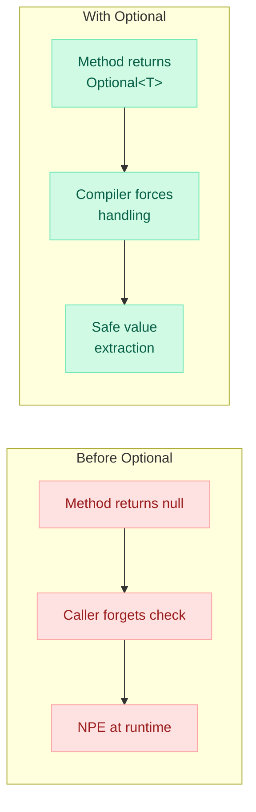
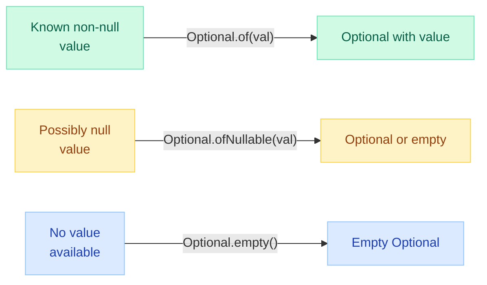
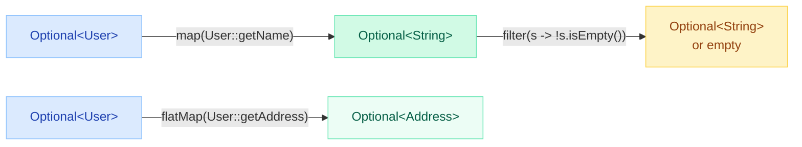
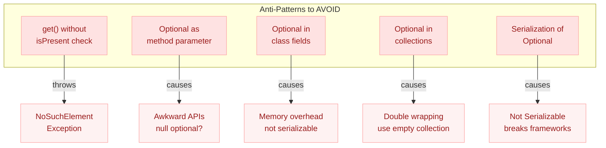
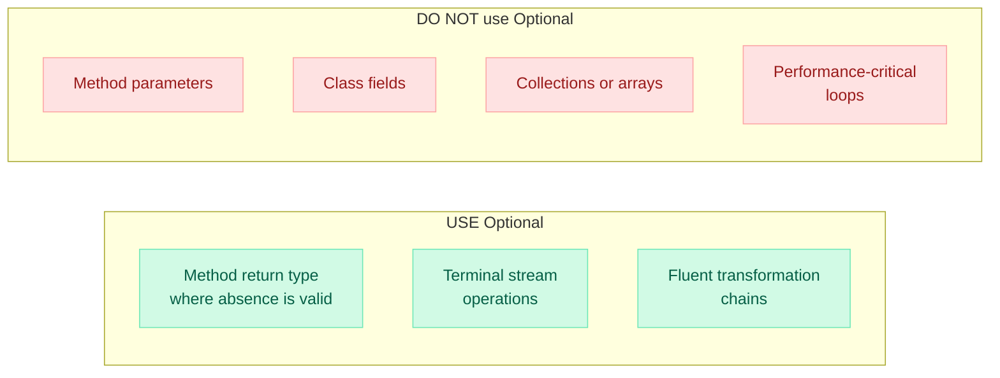

# Optional Deep Dive

!!! danger "The Billion Dollar Mistake"
    Tony Hoare, inventor of the null reference, called it his **"billion dollar mistake."** In Java, unchecked nulls cascade through call chains, producing `NullPointerException` far from the actual source of absence. Optional makes the possibility of absence **explicit in the type system**.

    ```java
    // The NPE chain — each dot is a potential bomb
    String city = order.getCustomer().getAddress().getCity(); // NPE?
    ```

---

## Why Optional Exists



**Key motivations:**

- **Eliminate null checks** — no more nested `if (x != null)` pyramids
- **Make absence explicit** — the return type tells you a value may be missing
- **Enable fluent pipelines** — chain transformations safely with `map`/`flatMap`
- **Self-documenting code** — `Optional<User>` is clearer than `@Nullable User`

---

## Creating Optionals



```java
// 1. of() — value MUST be non-null (throws NPE if null)
Optional<String> name = Optional.of("Vamsi");

// 2. ofNullable() — safely wraps a possibly-null value
Optional<String> maybeName = Optional.ofNullable(getUserName()); // could be empty

// 3. empty() — explicitly represents absence
Optional<String> absent = Optional.empty();
```

!!! warning "Common Trap"
    `Optional.of(null)` throws `NullPointerException` immediately. Always use `ofNullable()` when the value might be null.

---

## Consuming Optionals

### Value Extraction Methods

| Method | Behavior when empty | Use case |
|--------|-------------------|----------|
| `get()` | Throws `NoSuchElementException` | **Never use without `isPresent()`** |
| `orElse(default)` | Returns default value | Static/cheap defaults |
| `orElseGet(supplier)` | Invokes supplier lazily | Expensive default computation |
| `orElseThrow()` | Throws `NoSuchElementException` (Java 10+) | When absence is a bug |
| `orElseThrow(exSupplier)` | Throws custom exception | Business rule violations |

### Action Methods

| Method | Behavior when empty | Use case |
|--------|-------------------|----------|
| `ifPresent(consumer)` | Does nothing | Side effects only when present |
| `ifPresentOrElse(action, emptyAction)` | Runs emptyAction (Java 9+) | Handle both cases |

```java
// orElse vs orElseGet — critical difference
String name = optional.orElse(computeDefault());         // ALWAYS computes default
String name = optional.orElseGet(() -> computeDefault()); // computes ONLY if empty

// orElseThrow — fail fast
User user = findUser(id)
    .orElseThrow(() -> new UserNotFoundException(id));

// ifPresent — execute side effects
findUser(id).ifPresent(u -> sendWelcomeEmail(u));

// ifPresentOrElse (Java 9+) — handle both branches
findUser(id).ifPresentOrElse(
    user -> log.info("Found: {}", user),
    ()   -> log.warn("User not found")
);
```

!!! tip "orElse vs orElseGet"
    Use `orElseGet()` when the default is expensive to create (DB call, network request, object construction). `orElse()` eagerly evaluates even when the Optional has a value.

---

## Transforming Optionals



### map() — Transform the value inside

```java
// If present: applies function, wraps result in Optional
// If empty: returns empty Optional
Optional<String> upperName = optionalUser
    .map(User::getName)
    .map(String::toUpperCase);
```

### flatMap() — Unwrap nested Optionals

```java
// Use when the mapper itself returns Optional<T>
// Avoids Optional<Optional<T>>
Optional<String> city = optionalUser
    .flatMap(User::getAddress)    // User::getAddress returns Optional<Address>
    .flatMap(Address::getCity);   // Address::getCity returns Optional<String>
```

### filter() — Conditionally keep or discard

```java
// Keep only if predicate matches, otherwise empty
Optional<User> adultUser = optionalUser
    .filter(u -> u.getAge() >= 18);
```

### Key Difference: map vs flatMap

```java
// map: mapper returns T → result is Optional<T>
// flatMap: mapper returns Optional<T> → result is Optional<T> (no double wrapping)

class User {
    Optional<Address> getAddress() { ... }  // returns Optional
}

// WRONG — gives Optional<Optional<Address>>
optionalUser.map(User::getAddress);

// CORRECT — gives Optional<Address>
optionalUser.flatMap(User::getAddress);
```

---

## Chaining Optional Operations (Fluent Pipeline)

```java
// Real-world example: extract discount percentage from a deeply nested structure
double discount = Optional.ofNullable(order)
    .flatMap(Order::getCustomer)
    .flatMap(Customer::getMembership)
    .map(Membership::getDiscountPercentage)
    .filter(d -> d > 0 && d <= 50)
    .orElse(0.0);
```

```java
// Pipeline pattern — replaces nested null checks entirely
String displayCity = Optional.ofNullable(user)
    .flatMap(User::getAddress)
    .flatMap(Address::getCity)
    .map(String::toUpperCase)
    .orElse("UNKNOWN");

// Compare with the null-check equivalent:
String displayCity;
if (user != null && user.getAddress() != null 
    && user.getAddress().getCity() != null) {
    displayCity = user.getAddress().getCity().toUpperCase();
} else {
    displayCity = "UNKNOWN";
}
```

---

## Optional in Stream API (Java 9+)

Java 9 added `Optional.stream()` which returns a stream of zero or one element. This integrates cleanly with the Stream API.

```java
// Convert Optional to Stream (0 or 1 elements)
Optional<String> opt = Optional.of("hello");
Stream<String> stream = opt.stream(); // Stream containing "hello"

// Powerful pattern: filter a list of Optionals to only present values
List<Optional<String>> optionals = List.of(
    Optional.of("a"),
    Optional.empty(),
    Optional.of("c")
);

List<String> values = optionals.stream()
    .flatMap(Optional::stream)  // removes empties, unwraps values
    .toList(); // ["a", "c"]
```

```java
// Finding in a stream and working with Optional result
Optional<User> admin = users.stream()
    .filter(User::isAdmin)
    .findFirst();  // returns Optional<User>

// Chain directly
String adminEmail = users.stream()
    .filter(User::isAdmin)
    .findFirst()
    .map(User::getEmail)
    .orElse("no-admin@company.com");
```

---

## Anti-Patterns



```java
// 1. NEVER call get() without checking
optional.get(); // NoSuchElementException if empty!

// 2. NEVER use Optional as method parameter
void process(Optional<String> name) { ... } // BAD — caller might pass null Optional!

// 3. NEVER use Optional as a field
class User {
    private Optional<String> nickname; // BAD — not serializable, overhead
}

// 4. NEVER put Optional in collections
List<Optional<String>> names; // BAD — use List<String> and filter nulls

// 5. NEVER use with serialization frameworks
// Optional does NOT implement Serializable — breaks Jackson, JPA, etc.
// Use @JsonInclude(NON_ABSENT) or custom serializers instead
```

---

## Best Practices

### When to Use Optional



**Rules of Thumb:**

1. **Return types only** — Optional signals "this method might not find a result"
2. **Never as parameters** — use method overloading or `@Nullable` annotation instead
3. **Never as fields** — use plain null with getter returning Optional
4. **Never in collections** — use empty collections (`Collections.emptyList()`) for absence
5. **Avoid in tight loops** — Optional allocates an object; primitive types have `OptionalInt`, `OptionalLong`, `OptionalDouble`

```java
// GOOD: getter returns Optional, field is plain nullable
class User {
    private String nickname; // nullable field

    public Optional<String> getNickname() {
        return Optional.ofNullable(nickname); // wrap at the boundary
    }
}
```

---

## or() Method (Java 9) and isEmpty() (Java 11)

### or() — Provide alternative Optional

```java
// or() returns another Optional if the first is empty (unlike orElse which unwraps)
Optional<String> result = findInCache(key)
    .or(() -> findInDatabase(key))    // tries DB only if cache miss
    .or(() -> findInRemoteService(key)); // tries remote only if DB miss
```

!!! info "or() vs orElse()"
    - `orElse()` / `orElseGet()` — unwraps to the raw value T
    - `or()` — stays in Optional land, returns `Optional<T>`

### isEmpty() — Negation of isPresent() (Java 11)

```java
Optional<User> user = findUser(id);

// Before Java 11
if (!user.isPresent()) { ... }

// Java 11+
if (user.isEmpty()) { ... }  // cleaner, more readable
```

---

## Comparison: Optional vs Alternatives

| Approach | Null safety | Type safety | Composability | Overhead | Serializable |
|----------|:-----------:|:-----------:|:-------------:|:--------:|:------------:|
| **Java Optional** | Explicit | Compile-time hint | map/flatMap/filter | Object alloc | No |
| **Plain null** | None | None | None | Zero | N/A |
| **Kotlin nullable (`?`)** | Compiler-enforced | Full | `?.let{}`, Elvis | Zero (inlined) | N/A |
| **Result/Either pattern** | Explicit | Full (value OR error) | map/flatMap | Object alloc | Custom |
| **@Nullable annotation** | IDE/tool warnings | Partial (needs tools) | None | Zero | N/A |

```java
// Java Optional
Optional.ofNullable(name).map(String::toUpperCase).orElse("DEFAULT");

// Kotlin nullable
name?.uppercase() ?: "DEFAULT"

// Result pattern (custom or vavr)
Result.of(() -> riskyOperation())
    .map(String::toUpperCase)
    .getOrElse("DEFAULT");
```

---

## Quick Recall

| Operation | Method | Returns |
|-----------|--------|---------|
| Create from non-null | `Optional.of(v)` | `Optional<T>` |
| Create from nullable | `Optional.ofNullable(v)` | `Optional<T>` |
| Create empty | `Optional.empty()` | `Optional<T>` |
| Get or default | `orElse(def)` | `T` |
| Get or compute | `orElseGet(supplier)` | `T` |
| Get or throw | `orElseThrow(supplier)` | `T` |
| Transform | `map(fn)` | `Optional<U>` |
| Transform (nested) | `flatMap(fn)` | `Optional<U>` |
| Condition | `filter(pred)` | `Optional<T>` |
| Alt Optional (9+) | `or(supplier)` | `Optional<T>` |
| To Stream (9+) | `stream()` | `Stream<T>` |
| Absent check (11+) | `isEmpty()` | `boolean` |

---

## Interview Template

???+ example "Common Interview Questions"

    **Q: What is the purpose of Optional in Java?**
    
    > Optional is a container that may or may not contain a non-null value. It forces explicit handling of absence, reducing NullPointerExceptions. It replaces null as a return type for methods where a result may not exist.

    **Q: When should you NOT use Optional?**
    
    > Never as method parameters, class fields, collection elements, or map keys/values. Never with serialization frameworks. Avoid in performance-critical tight loops. Use only as method return types.

    **Q: Explain map() vs flatMap() in Optional.**
    
    > `map()` applies a function that returns `T` and wraps the result in Optional. `flatMap()` applies a function that itself returns `Optional<T>` and avoids double-wrapping. Use flatMap when the mapper returns Optional.

    **Q: What is the difference between orElse() and orElseGet()?**
    
    > `orElse(value)` always evaluates the default value, even when Optional is present. `orElseGet(supplier)` only invokes the supplier when the Optional is empty. Use orElseGet for expensive defaults.

    **Q: How does Optional.stream() (Java 9) help with Stream API?**
    
    > It converts Optional to a Stream of zero or one element. Combined with `flatMap`, it lets you filter out empty Optionals from a stream of `Optional<T>` values cleanly: `optionals.stream().flatMap(Optional::stream)`.

    **Q: How would you refactor nested null checks using Optional?**
    
    > Use `Optional.ofNullable()` at the root, then chain `flatMap()` for each level that returns Optional (or whose getter might return null), `map()` for transformations, and `orElse()`/`orElseThrow()` to extract the final value.

---

!!! quote "Key Takeaway"
    Optional is a **design tool for APIs**, not a general-purpose null replacement. Use it to communicate "this method might not return a value" and enable safe fluent pipelines. Keep it at method boundaries — never in fields, parameters, or collections.
