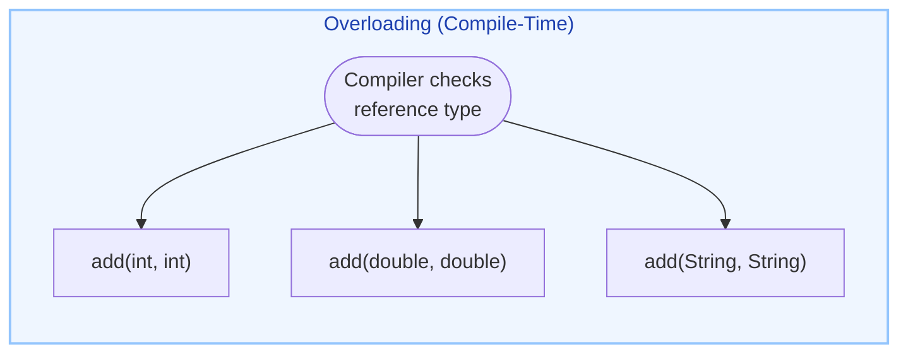
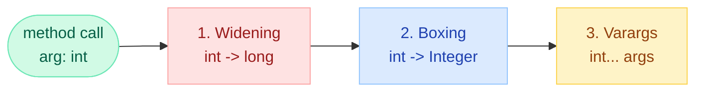
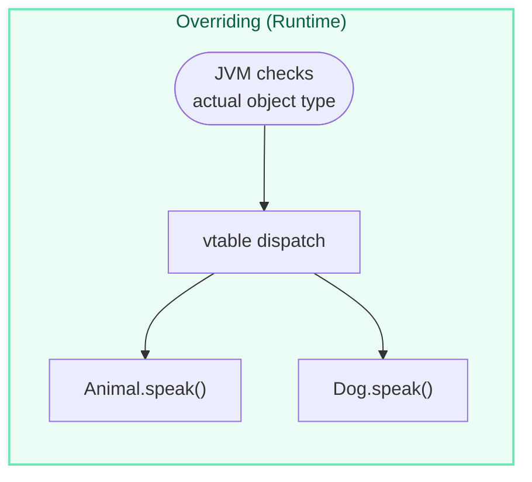
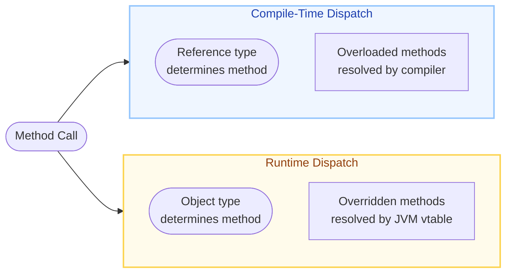
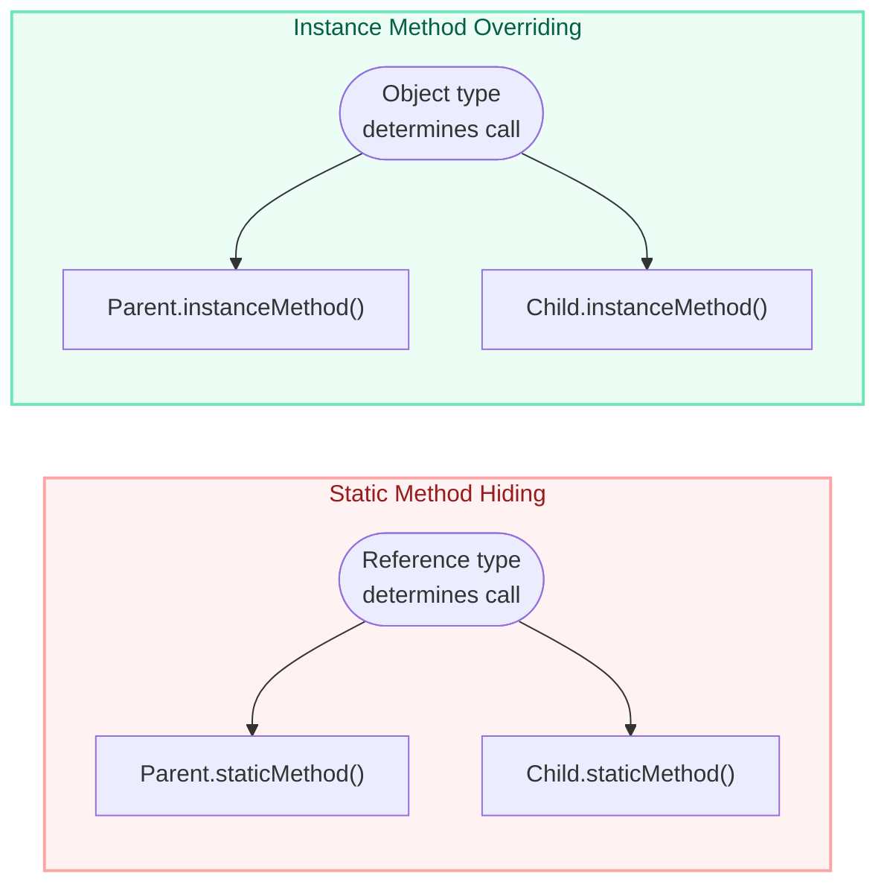

# Method Overloading vs Overriding

## The Bug That Ships to Production

!!! danger "Real-World Bug: Accidental Overload Instead of Override"

    ```java
    public class PaymentProcessor {
        public void process(Object payment) {  // base class
            log("generic processing");
        }
    }

    public class CreditCardProcessor extends PaymentProcessor {
        // BUG: This is an OVERLOAD, not an override!
        // Missing @Override — compiler stays silent.
        public void process(CreditCard payment) {  // different param type
            log("credit card processing");
        }
    }

    // At runtime:
    PaymentProcessor p = new CreditCardProcessor();
    p.process(myCreditCard);  // Calls PARENT method! (reference type = PaymentProcessor)
    ```

    **Fix**: Always use `@Override`. The compiler would have caught this immediately:

    ```java
    @Override  // COMPILE ERROR: method does not override superclass method
    public void process(CreditCard payment) { ... }
    ```

---

## Overloading (Compile-Time / Static Polymorphism)

Same method name, **different parameter lists** within the same class (or inherited).



### Rules of Overloading

| Aspect | Rule |
|--------|------|
| Method name | Must be **same** |
| Parameters | Must **differ** (type, count, or order) |
| Return type | Can be **anything** (not part of signature) |
| Access modifier | Can be **anything** |
| Exceptions | Can throw **any** exceptions |
| static methods | **Can** be overloaded |
| Resolution time | **Compile time** based on reference type |

### Widening vs Boxing vs Varargs Priority

When multiple overloads match, the compiler picks in this order:



```java
public class Priority {
    void test(long x)      { System.out.println("widening"); }   // 1st priority
    void test(Integer x)   { System.out.println("boxing"); }     // 2nd priority
    void test(int... x)    { System.out.println("varargs"); }    // 3rd priority

    public static void main(String[] args) {
        new Priority().test(5);  // prints "widening"
    }
}
```

!!! info "Key Rule"
    Widening beats boxing beats varargs. You **cannot** widen then box (`int` -> `Long` fails), but you **can** box then widen (`int` -> `Integer` -> `Number`).

### Overloading Examples

```java
public class Calculator {
    // Different number of parameters
    int add(int a, int b) { return a + b; }
    int add(int a, int b, int c) { return a + b + c; }

    // Different parameter types
    double add(double a, double b) { return a + b; }

    // Different parameter order
    String format(String name, int id) { return id + ":" + name; }
    String format(int id, String name) { return name + "#" + id; }

    // Static methods CAN be overloaded
    static void print(int x) { System.out.println("int: " + x); }
    static void print(String x) { System.out.println("str: " + x); }
}
```

!!! warning "NOT Overloading"
    Changing **only** the return type does NOT make it a valid overload — it causes a compile error:
    ```java
    int  getValue() { return 1; }
    long getValue() { return 1L; }  // COMPILE ERROR: duplicate method
    ```

---

## Overriding (Runtime / Dynamic Polymorphism)

Same method signature in a **subclass** — resolved at runtime based on the **actual object type**.



### Rules of Overriding

| Aspect | Rule |
|--------|------|
| Method name | Must be **same** |
| Parameters | Must be **exactly same** (signature match) |
| Return type | Must be **same or covariant** (subtype) |
| Access modifier | Must be **same or wider** (more visible) |
| Checked exceptions | Must be **same or narrower** (fewer/subtype) |
| Unchecked exceptions | Can throw **any** |
| Cannot override | `static`, `final`, `private` methods |
| Resolution time | **Runtime** based on actual object |
| `@Override` | Strongly recommended (compiler safety) |

### Access Modifier Widening

```java
class Parent {
    protected void show() { }
}

class Child extends Parent {
    @Override
    public void show() { }     // OK: public > protected (wider)

    // @Override
    // private void show() { } // COMPILE ERROR: cannot reduce visibility
}
```

The access hierarchy: `private` < `default` < `protected` < `public`

### Exception Narrowing (Checked Only)

```java
class Parent {
    void read() throws IOException { }
}

class Child extends Parent {
    @Override
    void read() throws FileNotFoundException { }  // OK: narrower (subtype of IOException)

    // @Override
    // void read() throws Exception { }  // COMPILE ERROR: broader checked exception
}
```

---

## Compile-Time vs Runtime Dispatch



```java
class Animal {
    void speak() { System.out.println("Animal speaks"); }
    void eat(Object food) { System.out.println("Animal eats object"); }
    void eat(String food) { System.out.println("Animal eats " + food); } // overloaded
}

class Dog extends Animal {
    @Override
    void speak() { System.out.println("Dog barks"); }  // overridden
}

public class Main {
    public static void main(String[] args) {
        Animal a = new Dog();  // Reference: Animal, Object: Dog

        // RUNTIME dispatch (overriding) — calls Dog.speak()
        a.speak();  // "Dog barks"

        // COMPILE-TIME dispatch (overloading) — compiler sees ref type Animal
        Object food = "Bone";
        a.eat(food);  // "Animal eats object" (NOT "Animal eats Bone")
        // Compiler resolves overload using reference type of 'food' which is Object
    }
}
```

!!! tip "The Golden Rule"
    **Overloading** = which method signature (resolved by compiler using reference types).  
    **Overriding** = which class's implementation (resolved by JVM using actual object).

---

## Covariant Return Types

Since Java 5, an overriding method can return a **subtype** of the parent's return type.

```java
class Animal {
    Animal create() {
        return new Animal();
    }
}

class Dog extends Animal {
    @Override
    Dog create() {     // Covariant return: Dog is subtype of Animal
        return new Dog();
    }
}

// Benefit: no casting needed
Dog d = new Dog().create();  // returns Dog directly, no cast
```

### Rules for Covariant Returns

- Only works with **reference types** (not primitives)
- The return type must be a **subtype** of the parent's return type
- `int` cannot be covariant to `long` (primitives have no inheritance)

```java
class Parent {
    Number getValue() { return 42; }
}

class Child extends Parent {
    @Override
    Integer getValue() { return 42; }  // OK: Integer extends Number
}
```

---

## Method Hiding (Static Methods)

Static methods in a subclass with the same signature **hide** (not override) the parent's static method. Dispatch is based on **reference type**, not object type.



```java
class Parent {
    static void greet() { System.out.println("Hello from Parent"); }
    void hello()        { System.out.println("Parent instance"); }
}

class Child extends Parent {
    static void greet() { System.out.println("Hello from Child"); }  // HIDING, not overriding
    @Override
    void hello()        { System.out.println("Child instance"); }    // TRUE override
}

public class Test {
    public static void main(String[] args) {
        Parent obj = new Child();

        obj.greet();  // "Hello from Parent" (static — reference type wins)
        obj.hello();  // "Child instance"    (instance — object type wins)
    }
}
```

!!! warning "Key Distinction"
    - `@Override` on a static method = **compile error**
    - Static methods belong to the **class**, not the object
    - This is **method hiding**, not polymorphism

---

## Tricky Interview Examples

### Example 1: Reference Type vs Object Type

```java
class Shape {
    void draw() { System.out.println("Drawing Shape"); }
    void draw(String color) { System.out.println("Shape in " + color); }
}

class Circle extends Shape {
    @Override
    void draw() { System.out.println("Drawing Circle"); }
    void draw(String color, int radius) { System.out.println("Circle r=" + radius); }
}

Shape s = new Circle();
s.draw();              // "Drawing Circle"  (override — object type)
s.draw("red");         // "Shape in red"    (no override in Circle for this signature)
// s.draw("red", 5);  // COMPILE ERROR: Shape has no draw(String, int)
```

### Example 2: Overloading with null

```java
class Demo {
    void test(Object o)  { System.out.println("Object"); }
    void test(String s)  { System.out.println("String"); }
    void test(Integer i) { System.out.println("Integer"); }

    public static void main(String[] args) {
        new Demo().test(null);
        // COMPILE ERROR: ambiguous — String and Integer are both subclasses of Object
        // but neither is more specific than the other

        // Fix:
        new Demo().test((String) null);  // "String"
    }
}
```

### Example 3: Widening + Overriding Combined

```java
class Animal {
    void feed(long amount) { System.out.println("Animal fed: " + amount); }
}

class Dog extends Animal {
    @Override
    void feed(long amount) { System.out.println("Dog fed: " + amount); }

    // This is an OVERLOAD, not an override!
    void feed(int amount) { System.out.println("Dog int fed: " + amount); }
}

Animal a = new Dog();
a.feed(10);    // "Dog fed: 10"  -- int widens to long, then override kicks in
// Compiler: ref type is Animal, only sees feed(long). int 10 widens to long.
// Runtime: object is Dog, so Dog.feed(long) executes.

Dog d = new Dog();
d.feed(10);    // "Dog int fed: 10" -- exact match feed(int) preferred over widening
```

### Example 4: Private Methods in Inheritance

```java
class Parent {
    private void secret() { System.out.println("Parent secret"); }

    void callSecret() { secret(); }  // calls Parent.secret() always
}

class Child extends Parent {
    // This is NOT an override — Parent.secret() is invisible to Child
    private void secret() { System.out.println("Child secret"); }
}

new Child().callSecret();  // "Parent secret" (private methods bind at compile time)
```

### Example 5: Covariant Return with Overloading

```java
class Factory {
    Object create(String type) { return new Object(); }
    Factory build() { return new Factory(); }
}

class WidgetFactory extends Factory {
    @Override
    String create(String type) { return "Widget"; }  // Covariant: String extends Object

    @Override
    WidgetFactory build() { return new WidgetFactory(); }  // Covariant return
}

Factory f = new WidgetFactory();
Object o = f.create("x");   // Returns "Widget" (runtime dispatch)
Factory b = f.build();       // Returns WidgetFactory instance (runtime dispatch)
```

---

## Comparison Table

| Dimension | Overloading | Overriding |
|-----------|------------|-----------|
| **Binding** | Compile-time (static) | Runtime (dynamic) |
| **Method name** | Same | Same |
| **Parameters** | Must differ | Must be identical |
| **Return type** | Can be anything | Same or covariant |
| **Access modifier** | Can be anything | Same or wider |
| **Checked exceptions** | Can be anything | Same or narrower |
| **Static methods** | Can be overloaded | Cannot be overridden (hiding) |
| **Final methods** | Can be overloaded | Cannot be overridden |
| **Private methods** | Can be overloaded (in same class) | Cannot be overridden (not inherited) |
| **Constructors** | Can be overloaded | Cannot be overridden |
| **Inheritance required** | No (same class) | Yes (subclass) |
| **Polymorphism type** | Ad-hoc / static | Subtype / dynamic |
| **@Override needed** | No (not applicable) | Strongly recommended |
| **Performance** | Resolved at compile time (faster) | vtable lookup at runtime |
| **Also known as** | Static polymorphism | Dynamic polymorphism |

---

## Quick Recall

!!! success "5-Second Overloading Rules"
    1. Same name, **different params**
    2. Resolved at **compile time** by **reference type**
    3. Priority: widening > boxing > varargs
    4. Return type alone does NOT create an overload
    5. Static methods CAN be overloaded

!!! success "5-Second Overriding Rules"
    1. Same name, **same params**, in a **subclass**
    2. Resolved at **runtime** by **object type** (vtable)
    3. Access: same or **wider**
    4. Checked exceptions: same or **narrower**
    5. Return: same or **covariant** (subtype)
    6. Cannot override: `static`, `final`, `private`
    7. Always use **@Override** annotation

!!! quote "Interview One-Liner"
    "Overloading is compile-time polymorphism resolved by reference type and parameter types. Overriding is runtime polymorphism resolved by the actual object's vtable. The `@Override` annotation is essential to prevent accidental overloading."

---

## Interview Answer Template

!!! example "When asked: Explain overloading vs overriding"

    **Opening** (definition + polymorphism type):
    > "Overloading is compile-time polymorphism where the compiler selects among methods with the same name but different parameter lists. Overriding is runtime polymorphism where the JVM dispatches to the subclass implementation based on the actual object type via vtable lookup."

    **Key Differences** (pick 3-4):
    > "Key differences — overloading requires different parameters and is resolved by reference type at compile time. Overriding requires the exact same signature in a subclass, with constraints: access must be same or wider, checked exceptions same or narrower, and return type same or covariant."

    **Gotchas** (show depth):
    > "A common pitfall is accidentally overloading when you meant to override — for example, changing a parameter type without realizing it. That's why @Override is critical. Also, static methods cannot be overridden — they are hidden based on reference type."

    **Close** (real-world impact):
    > "In production, this matters for framework design — Spring uses overriding extensively for template patterns, while builders use overloading for fluent APIs."
