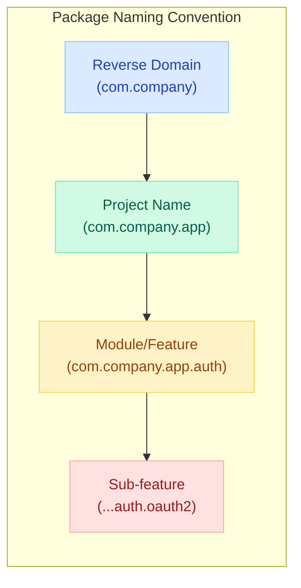
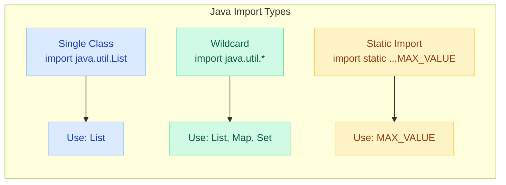
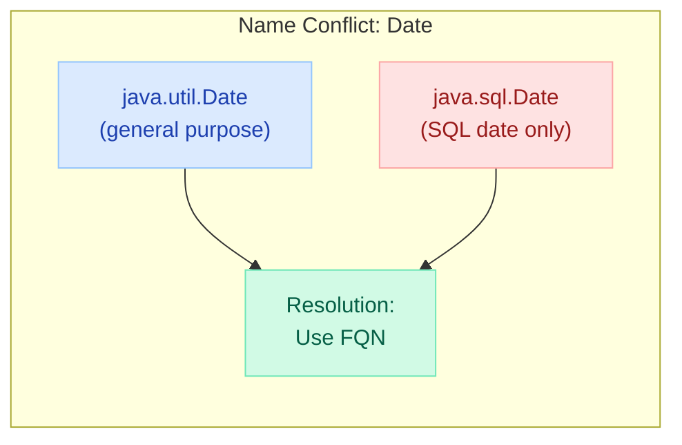
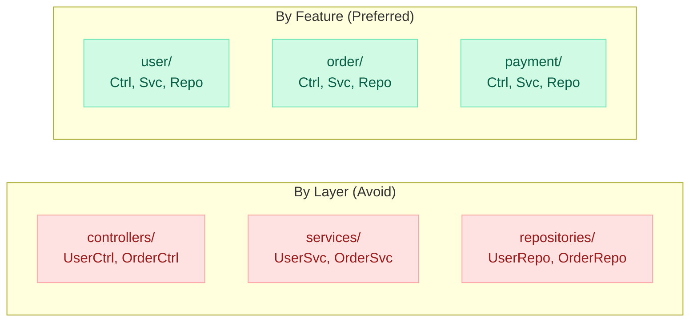
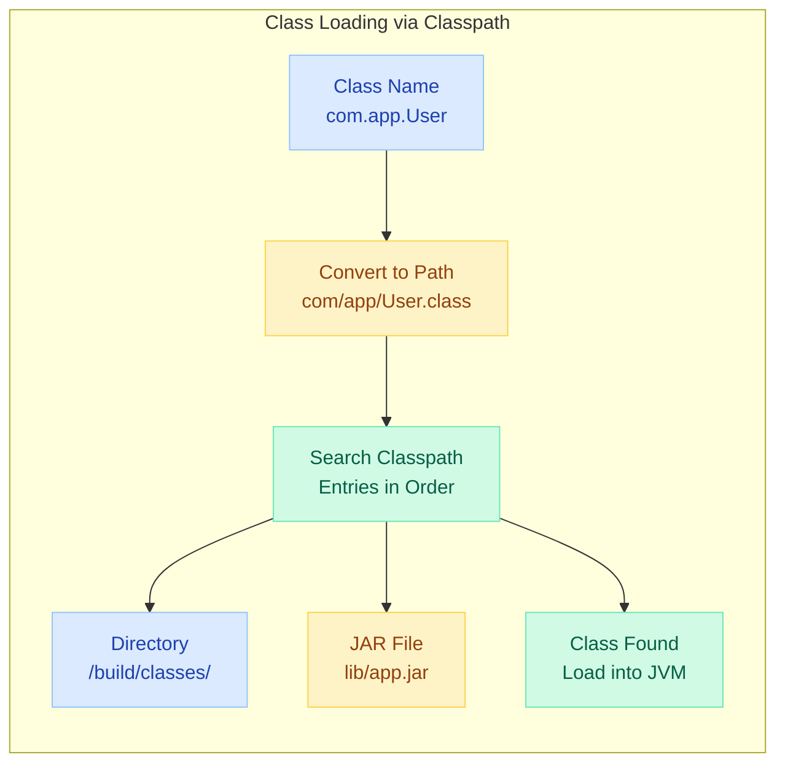
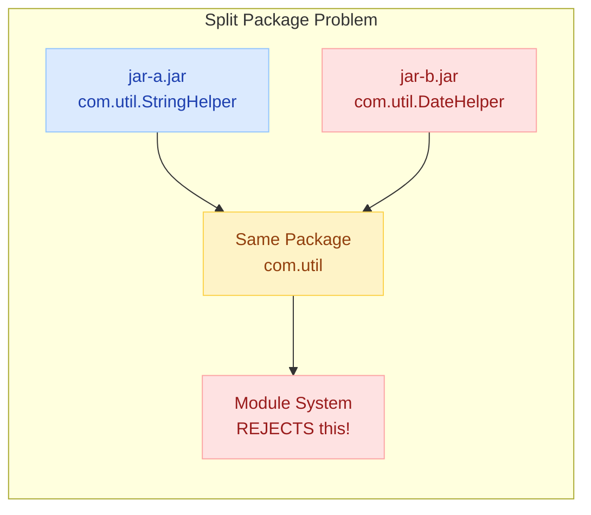

# Java Packages, Imports & Classpath

> **"A well-structured package hierarchy is the first sign of a well-designed system — get it wrong and you'll fight your own codebase for years."**

---

!!! danger "Real Incident: Split Package Hell, 2020"
    A fintech team migrated to Java 9 modules. Two JARs both declared `com.payments.util` — one from an internal library, another from legacy code. The module system refused to load either. The payment gateway was **down for 6 hours** during peak trading. Root cause: nobody enforced unique package ownership across teams. **This is what happens when package design is an afterthought.**

---

## Package Declaration & Naming Conventions



### Package Declaration Rules

```java
// MUST be the first non-comment statement in the file
package com.company.project.module;

// ❌ Wrong: uppercase letters, hyphens, starting with numbers
package com.My-Company.2Project;  // compilation error

// ✅ Correct: all lowercase, underscores for reserved words
package com.company.int_;  // "int" is reserved, use underscore
package org.example.my_module;
```

### Naming Convention Table

| Level | Convention | Example |
|---|---|---|
| Top-Level Domain | Reversed internet domain | `com`, `org`, `io` |
| Organization | Company/group name | `com.google`, `org.apache` |
| Project | Application name | `com.google.guava` |
| Module | Functional area | `com.google.guava.collect` |
| Sub-module | Specific concern | `com.google.guava.collect.immutable` |

---

## The Default Package (Why to Avoid It)

```java
// No package declaration = "default package"
// File: Calculator.java (no package statement)
public class Calculator {
    public int add(int a, int b) { return a + b; }
}
```

!!! warning "Why You Must Avoid the Default Package"
    - Cannot be imported by classes in named packages
    - Cannot be used with Java modules (JPMS)
    - No namespace protection — name collisions guaranteed at scale
    - Many frameworks (Spring, Jakarta EE) refuse to scan default package
    - Unprofessional in any codebase beyond a quick scratch file

```java
// ❌ This WILL NOT compile if Calculator is in the default package
package com.myapp.service;

import Calculator;  // ERROR: cannot import from default package

public class MathService {
    Calculator calc = new Calculator();  // ERROR
}
```

---

## Import Types



### Single Class Import

```java
import java.util.ArrayList;
import java.time.LocalDate;
import com.company.app.model.User;

// ✅ Preferred: explicit, clear, no ambiguity
// IDE auto-manages these — no reason to be lazy
```

### Wildcard Import (`*`)

```java
import java.util.*;  // imports ALL public classes from java.util

// Does NOT import sub-packages!
import java.util.*;       // gets List, Map, Set...
// does NOT get java.util.concurrent.* classes!
```

| Aspect | Single Import | Wildcard Import |
|---|---|---|
| Readability | Clear dependencies visible | Hidden dependencies |
| Compile time | Slightly faster (fewer lookups) | Slightly slower |
| Name conflicts | Caught immediately | Silent until conflict appears |
| IDE support | Auto-organized | Often converted to single |
| Best practice | Preferred (Google, Airbnb style) | Acceptable if > 5 from same package |

### Static Imports

```java
// Without static import
double area = Math.PI * Math.pow(radius, 2);
Assert.assertEquals(expected, actual);
List<String> names = Collections.unmodifiableList(list);

// With static import
import static java.lang.Math.PI;
import static java.lang.Math.pow;
import static org.junit.Assert.assertEquals;
import static java.util.Collections.unmodifiableList;

double area = PI * pow(radius, 2);
assertEquals(expected, actual);
List<String> names = unmodifiableList(list);
```

#### When Static Imports Help

```java
// ✅ Good: test assertions — everyone knows where these come from
import static org.assertj.core.api.Assertions.assertThat;
import static org.mockito.Mockito.*;

assertThat(result).isNotNull().hasSize(3);
when(repo.findById(1L)).thenReturn(Optional.of(user));

// ✅ Good: well-known constants
import static java.util.concurrent.TimeUnit.SECONDS;
import static java.net.HttpURLConnection.HTTP_OK;

executor.awaitTermination(30, SECONDS);
if (responseCode == HTTP_OK) { ... }
```

#### When Static Imports Harm Readability

```java
// ❌ Bad: Where does "of" come from? List.of? Set.of? Map.of? Optional.of?
import static java.util.List.of;
import static java.util.Map.of;  // compile error: ambiguous!

// ❌ Bad: obscure utility methods
import static com.company.util.StringHelper.*;
if (isBlank(name) && isNotEmpty(email)) { ... }  // where are these from?

// ❌ Bad: wildcard static import of non-obvious class
import static com.company.Constants.*;  // 200 constants dumped into scope
```

---

## java.lang: Auto-Imported Classes

The `java.lang` package is **automatically imported** in every Java file. You never need to write `import java.lang.*;`.

| Class | Purpose | Common Usage |
|---|---|---|
| `String` | Text handling | Everywhere |
| `Integer`, `Long`, `Double`... | Wrapper types | Autoboxing, collections |
| `Object` | Root of all classes | equals, hashCode, toString |
| `System` | System resources | `System.out`, `System.exit()` |
| `Math` | Math operations | `Math.max()`, `Math.random()` |
| `Thread`, `Runnable` | Concurrency | Thread creation |
| `Exception`, `Error` | Error hierarchy | Exception handling |
| `StringBuilder` | Mutable strings | String concatenation |
| `Class` | Runtime type info | Reflection |
| `Enum` | Enum base class | All enums extend this |
| `Record` | Record base class | All records (Java 16+) |
| `Comparable` | Natural ordering | `compareTo()` |
| `Iterable` | For-each support | Enhanced for loops |
| `AutoCloseable` | Try-with-resources | Resource management |
| `Override`, `Deprecated`... | Annotations | Code metadata |

---

## Name Conflicts and Resolution



### The Classic java.util.Date vs java.sql.Date Problem

```java
// ❌ This won't compile — ambiguous "Date"
import java.util.*;
import java.sql.*;

Date today = new Date();  // ERROR: reference to Date is ambiguous

// ✅ Solution 1: Import one, FQN the other
import java.util.Date;

Date utilDate = new Date();                          // java.util.Date
java.sql.Date sqlDate = new java.sql.Date(System.currentTimeMillis());

// ✅ Solution 2: FQN both (when both used heavily)
java.util.Date utilDate = new java.util.Date();
java.sql.Date sqlDate = new java.sql.Date(System.currentTimeMillis());

// ✅ Solution 3 (Modern): Use java.time instead!
import java.time.LocalDate;
import java.time.Instant;

LocalDate today = LocalDate.now();  // no ambiguity, better API
```

### Other Common Name Conflicts

| Conflict | Packages | Resolution |
|---|---|---|
| `List` | `java.util.List` vs `java.awt.List` | Import `java.util.List` (more common) |
| `Date` | `java.util.Date` vs `java.sql.Date` | Use `java.time.*` or FQN |
| `Element` | `javax.xml.bind` vs `org.w3c.dom` | FQN the less-used one |
| `Timer` | `java.util.Timer` vs `javax.swing.Timer` | FQN based on context |
| `Path` | `java.nio.file.Path` vs `javax.ws.rs.Path` | Import one, FQN the other |

---

## Package Access (Default/Package-Private Visibility)

```java
package com.company.billing;

// No access modifier = package-private (default)
class InternalPriceCalculator {  // only visible within com.company.billing
    
    int calculateDiscount(int amount) {  // package-private method
        return amount > 100 ? 10 : 0;
    }
}

// Public class in the same package CAN access it
public class BillingService {
    private final InternalPriceCalculator calc = new InternalPriceCalculator();  // ✅ OK
}

// Class in DIFFERENT package CANNOT access it
package com.company.orders;

// InternalPriceCalculator calc = new InternalPriceCalculator();  // ❌ ERROR
```

!!! tip "Package-Private is Underrated"
    Package-private is Java's way of saying "implementation detail — not part of the public API." Use it aggressively:

    - Internal helper classes
    - Implementation strategies (Strategy pattern internals)
    - Package-level tests can access these without reflection

---

## Package Structure: By Feature vs By Layer



| Aspect | By Layer | By Feature |
|---|---|---|
| Structure | `controller/`, `service/`, `repository/` | `user/`, `order/`, `payment/` |
| Cohesion | Low (unrelated classes grouped) | High (related classes together) |
| Navigation | Must jump between packages | Everything for a feature in one place |
| Encapsulation | Everything must be public | Can use package-private |
| Microservice extraction | Requires touching every package | Copy one package, done |
| Scalability | Packages grow unbounded | Each feature package stays small |

### Example: Feature-Based Structure

```
com.company.ecommerce/
├── user/
│   ├── User.java                  (entity)
│   ├── UserRepository.java        (data access)
│   ├── UserService.java           (business logic)
│   ├── UserController.java        (REST endpoint)
│   └── UserMapper.java            (package-private helper)
├── order/
│   ├── Order.java
│   ├── OrderItem.java             (package-private, internal detail)
│   ├── OrderRepository.java
│   ├── OrderService.java
│   └── OrderController.java
└── payment/
    ├── Payment.java
    ├── PaymentGateway.java        (interface, public)
    ├── StripeGateway.java         (package-private impl)
    └── PaymentService.java
```

---

## Classpath: How the JVM Finds Classes



### What is the Classpath?

The classpath tells the JVM **where to look** for `.class` files and resources. It is an ordered list of:

- Directories containing `.class` files
- JAR files (zipped archives of `.class` files)
- ZIP files

### Setting the Classpath

```bash
# Using -cp / -classpath flag (preferred)
java -cp "build/classes:lib/guava.jar:lib/jackson.jar" com.app.Main

# Using CLASSPATH environment variable (avoid — global, fragile)
export CLASSPATH="/app/classes:/app/lib/*"
java com.app.Main

# Wildcard: all JARs in a directory
java -cp "lib/*:build/classes" com.app.Main
# Note: lib/* includes all .jar files, NOT subdirectories

# Current directory is NOT automatically on classpath (since Java 9)
java -cp ".:lib/*" com.app.Main  # explicit "." for current dir
```

### How the JVM Resolves a Class

```java
// When JVM encounters: new com.company.billing.Invoice()
// 1. Convert package to path: com/company/billing/Invoice.class
// 2. Search each classpath entry IN ORDER:
//    - /app/build/classes/com/company/billing/Invoice.class  ← found? load it
//    - /app/lib/billing.jar!/com/company/billing/Invoice.class  ← try next JAR
// 3. First match wins (order matters!)
// 4. If not found → ClassNotFoundException at runtime
```

### Common Classpath Problems

| Problem | Symptom | Fix |
|---|---|---|
| Missing JAR | `ClassNotFoundException` | Add JAR to classpath |
| Wrong version | `NoSuchMethodError` | Check for duplicate JARs, fix version |
| Duplicate classes | Unpredictable behavior | First on classpath wins; remove duplicate |
| Package mismatch | `NoClassDefFoundError` | Ensure directory structure matches package |
| Resource not found | `NullPointerException` on `getResource()` | Put resources on classpath root |

---

## JAR Files and Package Sealing

### JAR File Basics

```bash
# Create a JAR
jar cf app.jar -C build/classes .

# Create executable JAR
jar cfe app.jar com.app.Main -C build/classes .

# List contents
jar tf app.jar

# Extract
jar xf app.jar
```

### JAR Structure

```
myapp.jar
├── META-INF/
│   └── MANIFEST.MF        (metadata: main class, sealing, versioning)
├── com/
│   └── company/
│       └── app/
│           ├── Main.class
│           ├── Service.class
│           └── util/
│               └── Helper.class
└── resources/
    └── config.properties
```

### Package Sealing

Sealing a package means **all classes in that package must come from the same JAR**. This prevents other JARs from injecting classes into your package.

```manifest
# META-INF/MANIFEST.MF
Manifest-Version: 1.0
Main-Class: com.company.app.Main
Sealed: true

Name: com/company/app/security/
Sealed: true
```

```java
// Without sealing: an attacker could create:
// evil.jar!/com/company/app/security/BackDoor.class
// and it would have PACKAGE-PRIVATE access to your security classes!

// With sealing: JVM throws SecurityException if any other JAR
// tries to define a class in com.company.app.security
```

| Sealing Scope | Effect |
|---|---|
| `Sealed: true` (top-level) | ALL packages in the JAR are sealed |
| `Name: com/pkg/` + `Sealed: true` | Only that specific package is sealed |
| No sealing | Any JAR can add classes to your packages |

---

## The Split Package Problem (Java Modules)



### What is a Split Package?

A split package occurs when **two different JARs/modules** contribute classes to the **same package**. On the classpath, this works (first JAR wins). With the module system (JPMS), it is **strictly forbidden**.

```java
// module-a/module-info.java
module com.company.modulea {
    exports com.company.shared;  // exports package "com.company.shared"
}

// module-b/module-info.java
module com.company.moduleb {
    exports com.company.shared;  // ERROR: split package!
}
// java.lang.module.ResolutionException: 
//   Modules modulea and moduleb export package com.company.shared
```

### How to Fix Split Packages

| Strategy | When to Use |
|---|---|
| Merge into one module | Packages are logically related |
| Rename one package | Packages serve different purposes |
| Create a shared module | Both modules need the shared code |
| Use `opens` instead of `exports` | Only need reflective access |

---

## Common java.* Packages Overview

| Package | Purpose | Key Classes |
|---|---|---|
| `java.lang` | Core (auto-imported) | String, Object, System, Math, Thread |
| `java.util` | Collections & utilities | List, Map, Set, Optional, Collections |
| `java.util.concurrent` | Concurrency | ExecutorService, ConcurrentHashMap, locks |
| `java.util.stream` | Stream API | Stream, Collectors, IntStream |
| `java.util.function` | Functional interfaces | Function, Predicate, Consumer, Supplier |
| `java.io` | Classic I/O (blocking) | File, InputStream, BufferedReader |
| `java.nio` | New I/O (non-blocking) | Path, Files, ByteBuffer, Channel |
| `java.net` | Networking | URL, HttpURLConnection, Socket |
| `java.net.http` | Modern HTTP client (11+) | HttpClient, HttpRequest, HttpResponse |
| `java.time` | Date/Time (Java 8+) | LocalDate, Instant, Duration, ZonedDateTime |
| `java.sql` | JDBC database access | Connection, PreparedStatement, ResultSet |
| `java.text` | Formatting & parsing | NumberFormat, DateFormat, MessageFormat |
| `java.math` | Arbitrary precision | BigDecimal, BigInteger |
| `java.security` | Cryptography & auth | MessageDigest, KeyStore, SecureRandom |
| `java.lang.reflect` | Reflection | Method, Field, Constructor, Proxy |
| `java.lang.annotation` | Annotation support | @Retention, @Target, @Inherited |

---

## Interview Questions

### Q1: What happens if you import two classes with the same name?

```java
import java.util.Date;
import java.sql.Date;  // ❌ Compile error: already defined

// Fix: import one, FQN the other
import java.util.Date;
// use java.sql.Date as fully qualified name where needed
```

### Q2: Does wildcard import affect performance?

**No.** Wildcard imports do NOT load all classes into memory. The compiler only resolves the classes you actually use. The difference is purely at **compile time** (slightly slower name resolution) and **readability** (harder to know dependencies at a glance).

### Q3: Can you import sub-packages with a wildcard?

```java
import java.util.*;  // imports java.util.List, java.util.Map, etc.
// Does NOT import java.util.concurrent.* or java.util.stream.*
// Sub-packages require separate import statements

import java.util.concurrent.*;  // must be explicit
```

### Q4: What is the classpath order problem?

```java
// If two JARs contain the same fully-qualified class:
// classpath = "old-lib.jar:new-lib.jar"
// JVM loads from old-lib.jar (first match wins)
// You get stale/buggy version → NoSuchMethodError at runtime

// Fix: Remove duplicates, use dependency management (Maven/Gradle)
```

### Q5: Difference between ClassNotFoundException and NoClassDefFoundError?

| | ClassNotFoundException | NoClassDefFoundError |
|---|---|---|
| Type | Checked exception | Error (unchecked) |
| When | `Class.forName()` / `ClassLoader.loadClass()` fails | Class was present at compile time, missing at runtime |
| Cause | Class not on classpath at all | Class was there initially, disappeared (e.g., transitive dep removed) |
| Fix | Add missing JAR to classpath | Check full dependency tree; version conflict likely |

### Q6: Why does the default package exist if we should avoid it?

It exists for **quick prototyping and learning**. The JLS defines it so that beginners can write `javac Hello.java && java Hello` without understanding packages. Production code should never use it because it cannot be imported by named packages and breaks the module system.

### Q7: What is package sealing and why does it matter?

Package sealing ensures all classes in a package come from a single JAR. Without it, an attacker (or buggy dependency) could place a class in your package and gain **package-private access** to your internals. This is a security boundary.

### Q8: Static import vs regular import — when would you use each?

- **Static import**: For constants (`MAX_VALUE`), test assertions (`assertThat`), factory methods (`of`, `empty`) from well-known classes
- **Regular import**: For everything else — class types, interfaces, enums
- **Rule of thumb**: If the reader cannot instantly identify the source, use regular import + qualified access

---

## Quick Recall

| Concept | Key Point |
|---|---|
| Package declaration | First non-comment statement; reverse domain naming |
| Default package | Avoid — cannot be imported, breaks modules |
| Single import | `import java.util.List;` — preferred, explicit |
| Wildcard import | `import java.util.*;` — does NOT include sub-packages |
| Static import | `import static Math.PI;` — use sparingly for readability |
| java.lang | Always auto-imported; String, Object, System, Math |
| Name conflicts | Import one class, FQN the other; or use `java.time` |
| Package-private | No modifier = visible only within same package |
| By-feature structure | Preferred over by-layer; enables encapsulation & extraction |
| Classpath | Ordered list of dirs/JARs; first match wins |
| ClassNotFoundException | Class not on classpath at load time |
| NoClassDefFoundError | Was present at compile time, missing at runtime |
| JAR sealing | Prevents other JARs from injecting into your package |
| Split packages | Same package in 2 modules — illegal in JPMS |
| Classpath ordering | First JAR wins; duplicates cause subtle bugs |
