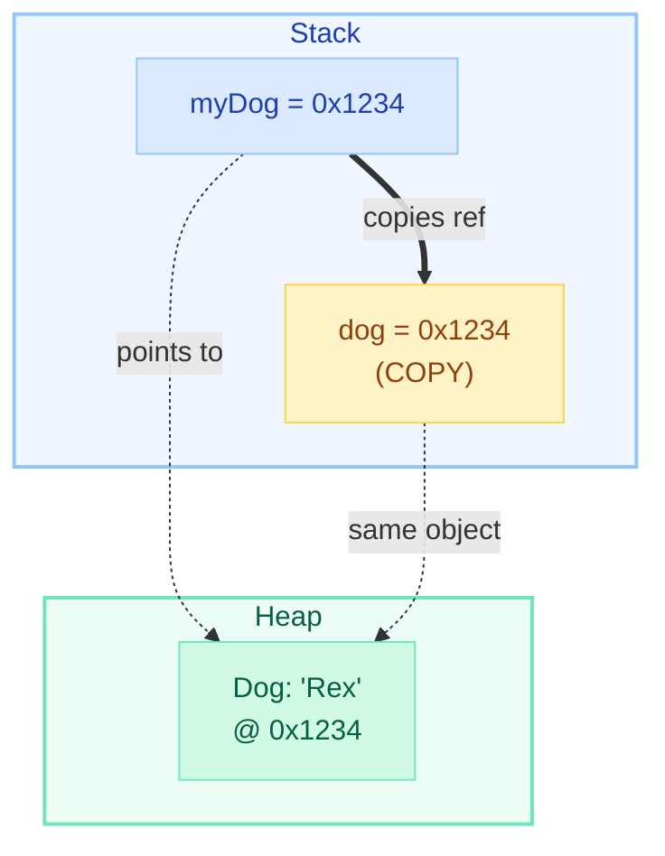
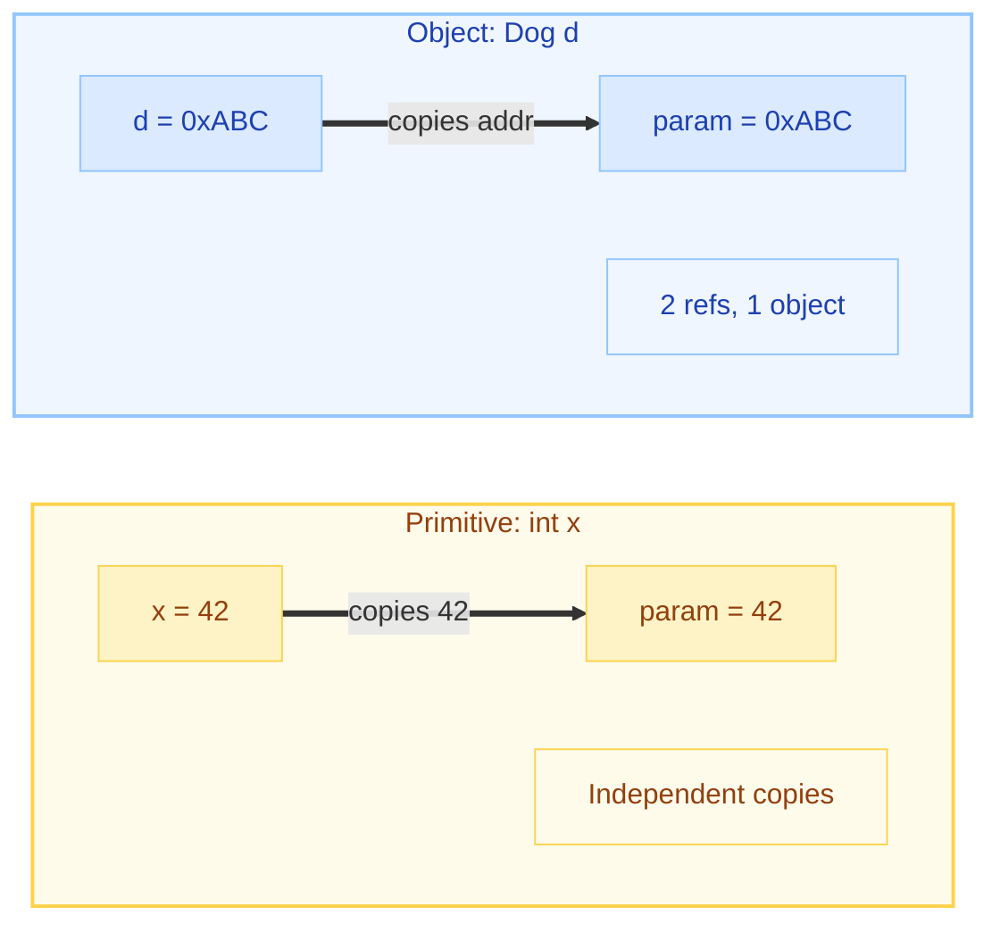
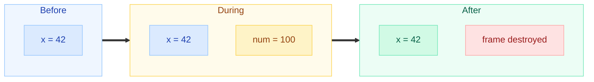
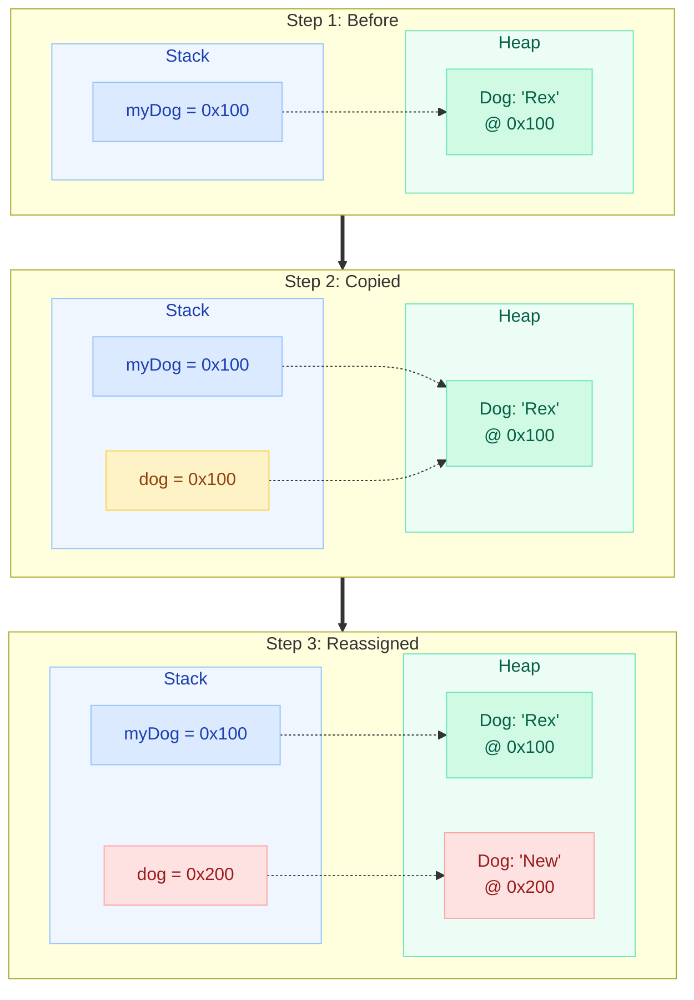
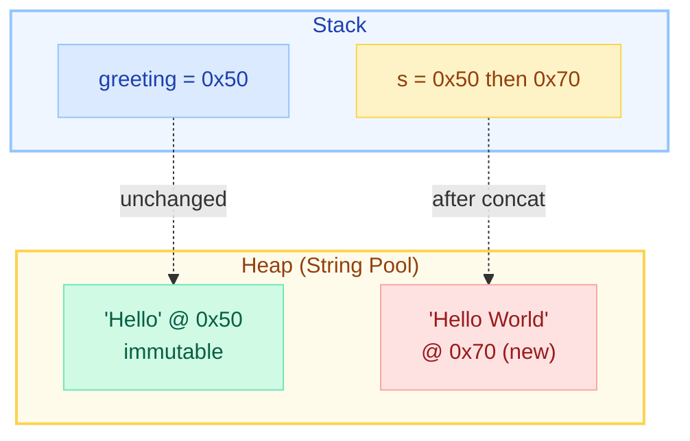
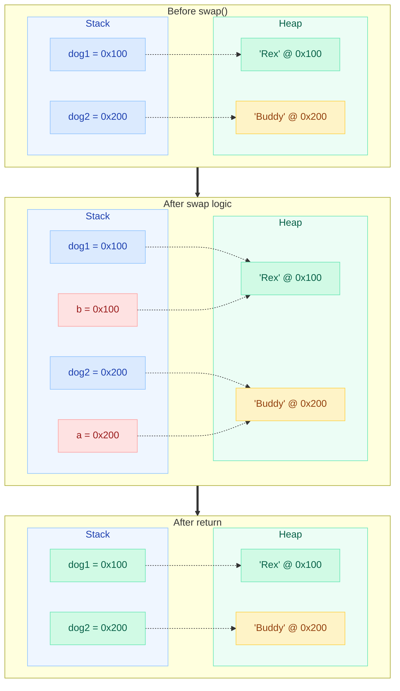
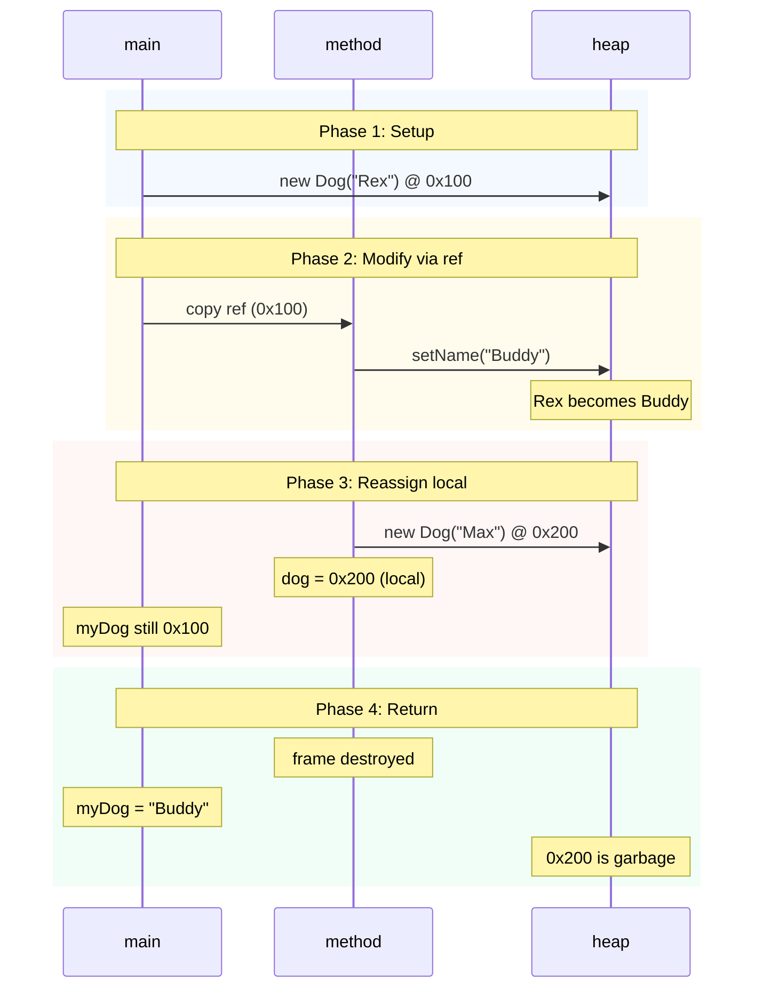
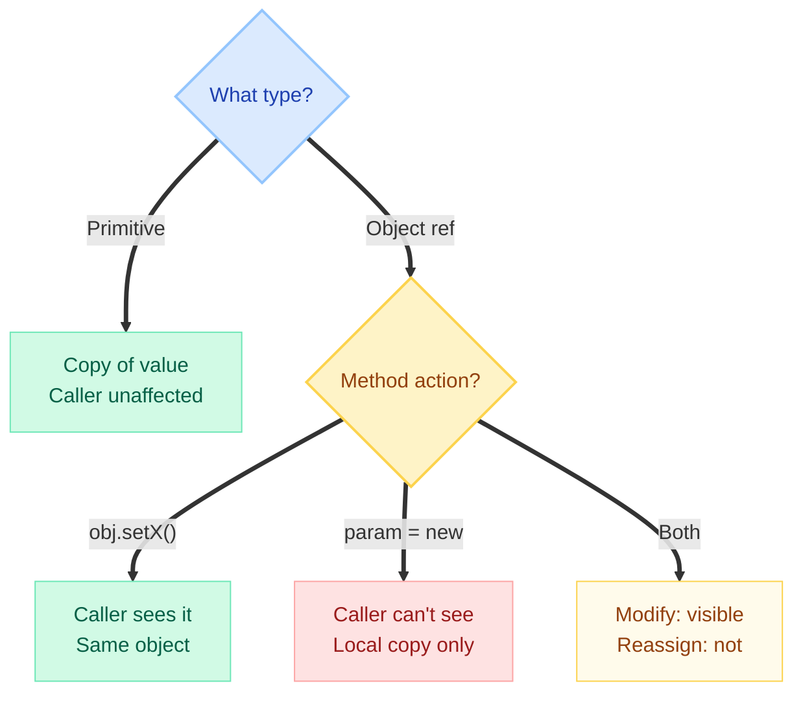

# Pass-by-Value in Java

> "Java is **ALWAYS** pass-by-value. Period. The confusion is about **WHAT** is passed."
> — James Gosling, creator of Java

---

!!! danger "Interview Trap: This Question Has Ended Interviews"
    A senior engineer candidate at a FAANG company was asked: *"Is Java pass-by-value or pass-by-reference?"* They confidently answered: "Java passes objects by reference." **Rejected.** The interviewer probed further — the candidate couldn't explain why `swap(a, b)` doesn't work in Java. This one misconception signaled a fundamental gap in understanding how Java's memory model works. Don't be that candidate.

---

## The Fundamental Truth



**Key insight:** Java copies the VALUE stored in the variable. For primitives, that value IS the data. For objects, that value is a REFERENCE (memory address) — not the object itself.

---

## The Golden Rule

!!! info "The Golden Rule of Java Parameter Passing"
    Java **always** passes a **COPY** of the value stored in the variable:

    - **Primitives** → copy of the actual data (42, 3.14, true)
    - **Object references** → copy of the memory address (pointer to the object)
    
    You NEVER get direct access to the caller's variable. You get your own local copy.



---

## Case 1: Primitives

Primitives are simple — the value is copied, modifications are completely independent.

```java
public class PrimitiveDemo {
    public static void modify(int num) {
        num = 100;  // Only modifies LOCAL copy
        System.out.println("Inside method: " + num);  // 100
    }

    public static void main(String[] args) {
        int x = 42;
        modify(x);
        System.out.println("After method: " + x);  // Still 42!
    }
}
```

**Output:**
```
Inside method: 100
After method: 42
```



---

## Case 2: Object References

This is where the confusion lives. You pass a **copy of the reference**, not a copy of the object.

### Modifying the object WORKS (both references point to same object)

```java
public class ObjectModifyDemo {
    public static void rename(Dog dog) {
        dog.setName("Buddy");  // Modifies the SHARED object
    }

    public static void main(String[] args) {
        Dog myDog = new Dog("Rex");
        rename(myDog);
        System.out.println(myDog.getName());  // "Buddy" — change IS visible!
    }
}
```

**Output:**
```
Buddy
```

### Reassigning the reference DOES NOT affect the caller

```java
public class ObjectReassignDemo {
    public static void reassign(Dog dog) {
        dog = new Dog("Completely New Dog");  // Only reassigns LOCAL copy
        System.out.println("Inside: " + dog.getName());  // "Completely New Dog"
    }

    public static void main(String[] args) {
        Dog myDog = new Dog("Rex");
        reassign(myDog);
        System.out.println("After: " + myDog.getName());  // Still "Rex"!
    }
}
```

**Output:**
```
Inside: Completely New Dog
After: Rex
```



!!! tip "The Leash Analogy"
    Think of an object reference as a **leash** attached to a dog (object). When you pass it to a method, you give them a **copy of the leash** — not the dog, and not your original leash.
    
    - They can **pull the leash** to rename the dog (modify the object) — you'll see it.
    - They can **drop their leash and grab a new one** attached to a different dog (reassign) — your leash is unaffected.

---

## Case 3: The String Special Case

Strings **appear** to be "passed by value" because they are **immutable**. Every "modification" creates a new String object.

```java
public class StringDemo {
    public static void modify(String s) {
        s = s + " World";  // Creates NEW String, reassigns local reference
        System.out.println("Inside: " + s);  // "Hello World"
    }

    public static void main(String[] args) {
        String greeting = "Hello";
        modify(greeting);
        System.out.println("After: " + greeting);  // Still "Hello"
    }
}
```

**Output:**
```
Inside: Hello World
After: Hello
```



!!! warning "Why Strings Seem Different"
    Strings are NOT a special case of parameter passing. The rules are identical to any object. The difference is that String is **immutable** — there's no `setChar()` method. Any "modification" creates a new object and reassigns the local reference. Since reassignment doesn't affect the caller, it **looks** like pass-by-value of the data.

---

## Case 4: Arrays

Arrays are objects, so the same rules apply: you pass a copy of the reference.

```java
public class ArrayDemo {
    // Modification: VISIBLE to caller
    public static void modifyElement(int[] arr) {
        arr[0] = 999;  // Modifies shared array object
    }

    // Reassignment: NOT visible to caller
    public static void reassignArray(int[] arr) {
        arr = new int[]{100, 200, 300};  // Local reassignment only
    }

    public static void main(String[] args) {
        int[] numbers = {1, 2, 3};

        modifyElement(numbers);
        System.out.println(numbers[0]);  // 999 — modification visible!

        reassignArray(numbers);
        System.out.println(numbers[0]);  // Still 999 — reassignment invisible
    }
}
```

**Output:**
```
999
999
```

---

## Case 5: The Swap Test (Classic Proof)

This is the **definitive proof** that Java is not pass-by-reference. If Java were pass-by-reference, a swap method would work.

```java
public class SwapTest {
    public static void swap(Dog a, Dog b) {
        Dog temp = a;
        a = b;       // Only reassigns LOCAL copy of reference
        b = temp;    // Only reassigns LOCAL copy of reference
    }

    public static void main(String[] args) {
        Dog dog1 = new Dog("Rex");
        Dog dog2 = new Dog("Buddy");

        swap(dog1, dog2);

        System.out.println(dog1.getName());  // "Rex"   — NOT swapped!
        System.out.println(dog2.getName());  // "Buddy" — NOT swapped!
    }
}
```

**Output:**
```
Rex
Buddy
```



!!! danger "The Swap Test is the Killer Argument"
    In C++ with true pass-by-reference (`void swap(Dog& a, Dog& b)`), the swap WORKS because `a` and `b` ARE the original variables. In Java, `a` and `b` are LOCAL COPIES of the references — swapping them only swaps the copies. The originals are untouched.

---

## Comparison with Other Languages

| Feature | Java | C++ (by reference) | C# (ref keyword) |
|---------|------|---------------------|-------------------|
| Syntax | `void foo(Dog d)` | `void foo(Dog& d)` | `void foo(ref Dog d)` |
| What is passed | Copy of reference | Alias to original variable | Alias to original variable |
| Modify object | Visible to caller | Visible to caller | Visible to caller |
| Reassign parameter | NOT visible | IS visible | IS visible |
| Swap works? | **NO** | **YES** | **YES** |
| Pass-by-value? | **Always** | No (when using &) | No (when using ref) |

### C++ True Pass-by-Reference

```cpp
// C++ — this actually swaps! Java CANNOT do this.
void swap(Dog& a, Dog& b) {  // & means a IS the original variable
    Dog temp = a;
    a = b;     // Modifies caller's variable directly
    b = temp;  // Modifies caller's variable directly
}
```

### C# ref Keyword

```csharp
// C# — explicit opt-in to pass-by-reference
void Reassign(ref Dog d) {
    d = new Dog("New");  // Caller WILL see this change
}

Dog myDog = new Dog("Rex");
Reassign(ref myDog);
Console.WriteLine(myDog.Name);  // "New" — reassignment visible!
```

Java has **no equivalent** of C++'s `&` or C#'s `ref`. You cannot make the caller's variable point to a different object from within a method. Ever.

---

## Complete Memory Walkthrough



```java
public class FullDemo {
    public static void modifyAndReassign(Dog dog) {
        // Phase 2: Modification via shared reference
        dog.setName("Buddy");      // ✅ Caller WILL see this

        // Phase 3: Reassignment of local reference
        dog = new Dog("Max");      // ❌ Caller will NOT see this
        dog.setName("Charlie");    // ❌ Modifies new object, not caller's
    }

    public static void main(String[] args) {
        Dog myDog = new Dog("Rex");         // Phase 1
        modifyAndReassign(myDog);           // Phase 2-3
        System.out.println(myDog.getName()); // Phase 4: "Buddy"
    }
}
```

**Output:**
```
Buddy
```

---

## Common Misconceptions

| Misconception | Reality |
|---|---|
| "Java passes objects by reference" | Java passes a **copy of the reference** by value |
| "Primitives are pass-by-value, objects are pass-by-reference" | **Everything** is pass-by-value. Objects are never passed at all — only references to them |
| "I can write a swap method in Java" | You cannot. The swap test is the proof that Java is pass-by-value |
| "Strings are passed by value differently" | Strings follow the exact same rules. They just appear different because they're immutable |
| "Pass-by-reference means I can modify the object" | No! That's pass-by-value of a reference. Pass-by-reference means you can change what the caller's variable points to |
| "`final` parameters prevent modification" | `final` prevents reassignment of the local reference, but you can still modify the object it points to |

---

## Quick Recall Table

| Scenario | Visible to Caller? | Why? |
|----------|:---:|------|
| `param.setX(...)` (modify object) | **YES** | Both references point to same heap object |
| `param = new Foo()` (reassign) | **NO** | Only reassigns the local copy of reference |
| `param = otherObj` (reassign) | **NO** | Same as above — local copy only |
| `primitiveParam = 99` (modify primitive) | **NO** | Primitive was copied, independent stack slot |
| `arr[i] = val` (modify array element) | **YES** | Array is an object, both refs point to it |
| `arr = new int[]{...}` (reassign array) | **NO** | Reassigns local reference only |
| `str = str + "x"` (String concat) | **NO** | Creates new immutable String, reassigns local ref |
| `sb.append("x")` (StringBuilder) | **YES** | Modifies the shared mutable object |

---

## Interview Answer Template

!!! abstract "The One-Liner Answer"
    "Java always passes by value. For objects, the value IS the reference (memory address). You get a copy of that reference, not a copy of the object."

### Full Interview Answer (30-second version)

> "Java is strictly pass-by-value — there is no pass-by-reference mechanism in the language. When you pass a primitive, a copy of the data is made. When you pass an object, a copy of the **reference** (the pointer to the heap object) is made — not a copy of the object itself.
>
> This means you CAN modify the object's state through the copied reference, because both references point to the same heap object. But you CANNOT make the caller's reference point to a different object — reassignment only affects your local copy.
>
> The definitive proof is the swap test: you cannot write a working swap method in Java because you'd need true pass-by-reference to reassign the caller's variables."

### If the interviewer pushes back

> "The confusion comes from people equating 'I can modify the object' with 'pass-by-reference.' But those are different things. Pass-by-reference means the method receives an **alias** to the caller's variable itself — like C++'s `&` or C#'s `ref`. Java never does this. Java copies the value in the variable, and for objects, that value happens to be a reference."

---

## Edge Cases for Advanced Interviews

### Wrapper classes (Integer, Boolean, etc.)

```java
public static void modify(Integer num) {
    num = 200;  // Autoboxing creates NEW Integer object, reassigns local ref
}

Integer x = 100;
modify(x);
System.out.println(x);  // Still 100 — same as String case (immutable)
```

### Collections passed to methods

```java
public static void addElement(List<String> list) {
    list.add("new");  // ✅ Modifies shared list object — visible to caller
}

public static void replaceList(List<String> list) {
    list = new ArrayList<>();  // ❌ Local reassignment — invisible to caller
}
```

### Returning objects (not parameter passing, but often confused)

```java
public static Dog createDog() {
    Dog d = new Dog("Rex");  // Created on heap
    return d;  // Returns COPY of reference — object survives method exit
}
// Works fine because the heap object outlives the stack frame
```

---

## Summary Flowchart: Decision Guide



---

!!! success "Key Takeaway"
    If someone asks "Is Java pass-by-value or pass-by-reference?" — the answer is unambiguously **pass-by-value**. The subtlety is that for objects, the "value" being passed is a reference. But it's still a COPY of that reference, which is why reassignment never propagates back to the caller.
