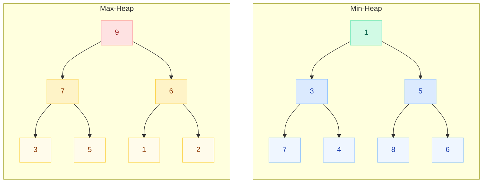
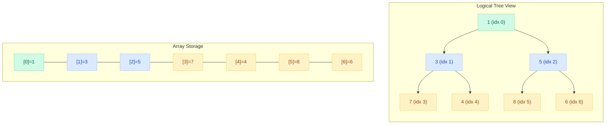
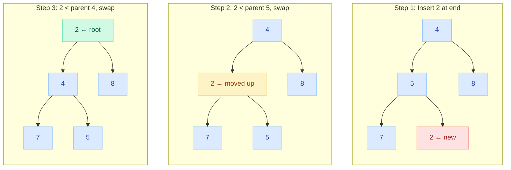
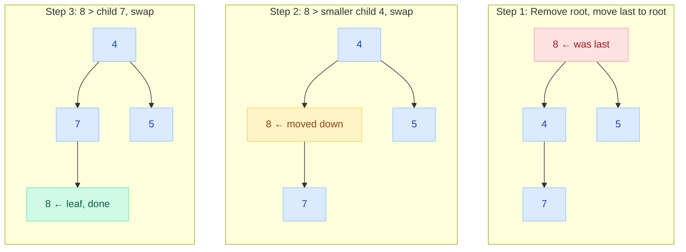
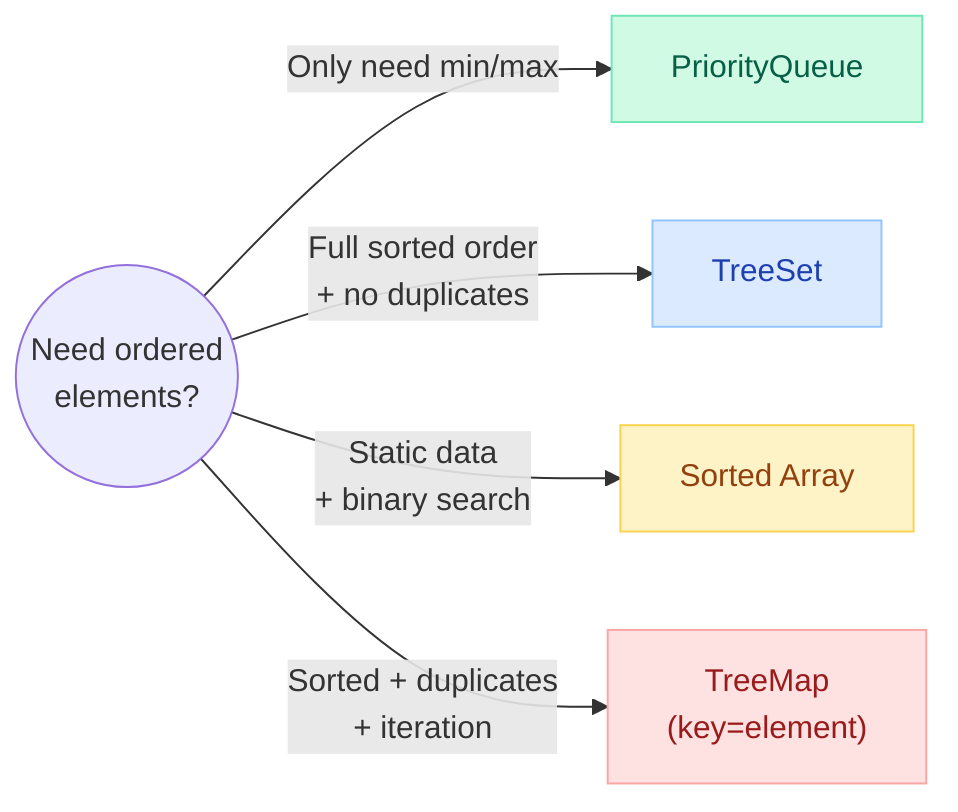

# PriorityQueue & Heap Internals

> **Using a sorted list for top-K?** That costs O(n log n). A heap gives you O(n log k) — the difference between TLE and accepted on LeetCode. PriorityQueue is Java's heap, and it shows up in Dijkstra's, merge-K-sorted, median-finder, and scheduling problems.

---

!!! tip "Why This Matters"
    PriorityQueue is the most frequently used data structure in medium/hard LeetCode problems. Mastering it gives you:
    
    - O(n log k) top-K element solutions instead of O(n log n) sorting
    - The foundation for Dijkstra's shortest path algorithm
    - Efficient merge of K sorted lists/streams
    - Running median, task schedulers, and event-driven simulations

---

## What Is a Heap?

A **heap** is a **complete binary tree** stored in an array that satisfies the **heap property**:

| Type | Property | Root Contains |
|------|----------|---------------|
| **Min-Heap** | Parent <= Children | Smallest element |
| **Max-Heap** | Parent >= Children | Largest element |

**Complete binary tree** means every level is fully filled except possibly the last, which is filled left-to-right. This guarantees O(log n) height.



---

## Array Representation

A heap is stored as an **array** with no pointers needed. The tree structure is implicit:

| Relationship | Formula |
|---|---|
| Parent of node at index `i` | `(i - 1) / 2` |
| Left child of node at index `i` | `2 * i + 1` |
| Right child of node at index `i` | `2 * i + 2` |



**Example**: Node at index 2 (value 5)

- Parent: `(2-1)/2 = 0` → value 1
- Left child: `2*2+1 = 5` → value 8
- Right child: `2*2+2 = 6` → value 6

---

## PriorityQueue in Java

`java.util.PriorityQueue` is Java's **min-heap** implementation. It does NOT guarantee sorted iteration — only that `poll()` always returns the smallest element.

```java
// Default min-heap (natural ordering)
PriorityQueue<Integer> minHeap = new PriorityQueue<>();

minHeap.offer(5);
minHeap.offer(1);
minHeap.offer(3);

minHeap.peek();  // 1 — smallest element, does NOT remove
minHeap.poll();  // 1 — removes and returns smallest
minHeap.poll();  // 3
minHeap.poll();  // 5
```

**Key characteristics:**

- Backed by a **resizable array** (default initial capacity 11)
- **Not thread-safe** — use `PriorityBlockingQueue` for concurrency
- Does **not** permit null elements
- **Not sorted** — iterator does NOT return elements in priority order
- Implements `Queue` interface

---

## Operations: offer() / poll() / peek()

| Operation | Description | Time | Triggers |
|-----------|-------------|------|----------|
| `offer(e)` / `add(e)` | Insert element | **O(log n)** | siftUp |
| `poll()` | Remove & return min | **O(log n)** | siftDown |
| `peek()` | View min without removing | **O(1)** | None |
| `remove(obj)` | Remove specific element | **O(n)** | Linear search + siftDown/siftUp |
| `contains(obj)` | Check if element exists | **O(n)** | Linear search |
| `size()` | Number of elements | **O(1)** | None |

```java
PriorityQueue<Integer> pq = new PriorityQueue<>();

// offer() — returns true if added (never fails for unbounded PQ)
pq.offer(10);  // [10]
pq.offer(4);   // [4, 10]       — 4 sifts up to root
pq.offer(15);  // [4, 10, 15]
pq.offer(1);   // [1, 4, 15, 10] — 1 sifts up to root

// peek() — O(1), just read index 0
pq.peek();     // 1

// poll() — O(log n), removes root, replaces with last, sifts down
pq.poll();     // 1 → heap becomes [4, 10, 15]
pq.poll();     // 4 → heap becomes [10, 15]
```

---

## Heapify Up (siftUp) — After Insertion

When a new element is added at the **end** of the array, it may violate the heap property. **SiftUp** bubbles it toward the root until the property is restored.



**Algorithm:**

```java
private void siftUp(int k, E x) {
    while (k > 0) {
        int parent = (k - 1) >>> 1;        // parent index
        E e = queue[parent];
        if (x.compareTo(e) >= 0) break;    // heap property satisfied
        queue[k] = e;                       // move parent down
        k = parent;                         // move up
    }
    queue[k] = x;
}
```

---

## Heapify Down (siftDown) — After Removal

When the root is removed, the **last** element takes its place. **SiftDown** pushes it toward leaves, swapping with the **smaller child** each time.



**Algorithm:**

```java
private void siftDown(int k, E x) {
    int half = size >>> 1;               // loop while non-leaf
    while (k < half) {
        int child = (k << 1) + 1;        // left child
        E c = queue[child];
        int right = child + 1;
        if (right < size && c.compareTo(queue[right]) > 0)
            c = queue[child = right];     // pick smaller child
        if (x.compareTo(c) <= 0) break;  // heap property ok
        queue[k] = c;                     // move child up
        k = child;                        // move down
    }
    queue[k] = x;
}
```

---

## Custom Comparator — Max-Heap & Beyond

Java's PriorityQueue is a **min-heap by default**. To get a max-heap or custom ordering, pass a `Comparator`:

```java
// Max-heap using reverseOrder
PriorityQueue<Integer> maxHeap = new PriorityQueue<>(Collections.reverseOrder());
maxHeap.offer(1);
maxHeap.offer(5);
maxHeap.offer(3);
maxHeap.poll();  // 5 — largest first

// Max-heap using lambda
PriorityQueue<Integer> maxHeap2 = new PriorityQueue<>((a, b) -> b - a);

// Custom object — sort by frequency, then alphabetical
PriorityQueue<int[]> pq = new PriorityQueue<>((a, b) -> {
    if (a[1] != b[1]) return b[1] - a[1];  // higher frequency first
    return a[0] - b[0];                      // lower value first (tie-break)
});

// Using Comparator.comparingInt
PriorityQueue<int[]> pq2 = new PriorityQueue<>(
    Comparator.comparingInt((int[] a) -> a[1]).reversed()
);
```

!!! warning "Avoid `(a, b) -> a - b` for large integers"
    Integer overflow can make `a - b` negative when it should be positive. Use `Integer.compare(a, b)` for production code.

---

## Common Use Cases

### 1. Top-K Elements

```java
// Find K largest elements — O(n log k) with min-heap of size k
public int[] topKLargest(int[] nums, int k) {
    PriorityQueue<Integer> minHeap = new PriorityQueue<>();
    for (int num : nums) {
        minHeap.offer(num);
        if (minHeap.size() > k) minHeap.poll();  // evict smallest
    }
    return minHeap.stream().mapToInt(i -> i).toArray();
}
```

### 2. Merge K Sorted Lists (LeetCode #23)

```java
public ListNode mergeKLists(ListNode[] lists) {
    PriorityQueue<ListNode> pq = new PriorityQueue<>(
        Comparator.comparingInt(n -> n.val));
    
    for (ListNode head : lists)
        if (head != null) pq.offer(head);
    
    ListNode dummy = new ListNode(0), curr = dummy;
    while (!pq.isEmpty()) {
        ListNode min = pq.poll();
        curr.next = min;
        curr = curr.next;
        if (min.next != null) pq.offer(min.next);
    }
    return dummy.next;
}
```

### 3. Dijkstra's Shortest Path

```java
public int[] dijkstra(int[][] graph, int src) {
    int n = graph.length;
    int[] dist = new int[n];
    Arrays.fill(dist, Integer.MAX_VALUE);
    dist[src] = 0;
    
    // [distance, node]
    PriorityQueue<int[]> pq = new PriorityQueue<>(
        Comparator.comparingInt(a -> a[0]));
    pq.offer(new int[]{0, src});
    
    while (!pq.isEmpty()) {
        int[] curr = pq.poll();
        int d = curr[0], u = curr[1];
        if (d > dist[u]) continue;  // stale entry
        for (int v = 0; v < n; v++) {
            if (graph[u][v] > 0 && dist[u] + graph[u][v] < dist[v]) {
                dist[v] = dist[u] + graph[u][v];
                pq.offer(new int[]{dist[v], v});
            }
        }
    }
    return dist;
}
```

### 4. Median Finder (LeetCode #295)

```java
class MedianFinder {
    PriorityQueue<Integer> lo = new PriorityQueue<>(Collections.reverseOrder()); // max-heap
    PriorityQueue<Integer> hi = new PriorityQueue<>();  // min-heap
    
    public void addNum(int num) {
        lo.offer(num);
        hi.offer(lo.poll());           // balance: push max of lo to hi
        if (lo.size() < hi.size())
            lo.offer(hi.poll());       // lo always >= hi in size
    }
    
    public double findMedian() {
        return lo.size() > hi.size() 
            ? lo.peek() 
            : (lo.peek() + hi.peek()) / 2.0;
    }
}
```

### 5. Task Scheduler (LeetCode #621)

```java
public int leastInterval(char[] tasks, int n) {
    int[] freq = new int[26];
    for (char c : tasks) freq[c - 'A']++;
    
    PriorityQueue<Integer> pq = new PriorityQueue<>(Collections.reverseOrder());
    for (int f : freq) if (f > 0) pq.offer(f);
    
    int time = 0;
    while (!pq.isEmpty()) {
        List<Integer> temp = new ArrayList<>();
        for (int i = 0; i <= n; i++) {
            if (!pq.isEmpty()) temp.add(pq.poll() - 1);
            time++;
            if (pq.isEmpty() && temp.stream().allMatch(x -> x == 0)) break;
        }
        for (int t : temp) if (t > 0) pq.offer(t);
    }
    return time;
}
```

---

## PriorityBlockingQueue — Concurrent Access

`PriorityBlockingQueue` is the **thread-safe**, **unbounded** variant for concurrent scenarios:

```java
PriorityBlockingQueue<Task> taskQueue = new PriorityBlockingQueue<>(
    11, Comparator.comparingInt(Task::getPriority));

// Producer thread
taskQueue.put(new Task("urgent", 1));    // never blocks (unbounded)

// Consumer thread
Task next = taskQueue.take();            // blocks if empty
```

| Feature | PriorityQueue | PriorityBlockingQueue |
|---------|--------------|----------------------|
| Thread-safe | No | Yes (ReentrantLock) |
| Blocking | No | `take()` blocks on empty |
| Bounded | No (grows) | No (unbounded) |
| Null elements | Not allowed | Not allowed |
| Fairness | N/A | Optional fair lock |
| Use case | Single-threaded | Producer-consumer |

---

## Comparison: PriorityQueue vs TreeSet vs Sorted Array

| Feature | PriorityQueue | TreeSet | Sorted Array |
|---------|--------------|---------|--------------|
| **Structure** | Binary heap (array) | Red-black tree | Sorted array |
| **Order** | Only min/max accessible | Fully sorted iteration | Fully sorted |
| **Insert** | O(log n) | O(log n) | O(n) — shift elements |
| **Get min/max** | O(1) | O(log n) | O(1) |
| **Remove min/max** | O(log n) | O(log n) | O(n) — shift |
| **Search** | O(n) | O(log n) | O(log n) — binary search |
| **Duplicates** | Allowed | Not allowed | Allowed |
| **Random access** | Not supported | Not supported | O(1) by index |
| **Memory** | Compact (array) | High (node objects) | Compact |
| **Best for** | Repeated min/max removal | Sorted range queries | Static sorted data |



---

## Time Complexity — Complete Reference

| Operation | PriorityQueue | Notes |
|-----------|:---:|---|
| `offer(e)` | O(log n) | siftUp from leaf to root |
| `poll()` | O(log n) | siftDown from root to leaf |
| `peek()` | O(1) | Read `queue[0]` |
| `remove(Object)` | O(n) | Linear scan + O(log n) sift |
| `contains(Object)` | O(n) | Linear scan |
| `size()` | O(1) | Maintained counter |
| `toArray()` | O(n) | Array copy |
| Build heap (heapify) | O(n) | Bottom-up construction |
| Heap sort | O(n log n) | n poll() operations |
| Top-K from n elements | O(n log k) | Maintain heap of size k |

!!! info "Build Heap is O(n), not O(n log n)"
    Building a heap from an unordered array using bottom-up heapify is O(n). This is because most nodes are near the leaves and sift very little. Java's `PriorityQueue(Collection)` constructor uses this.

---

## Quick Recall

!!! abstract "One-Liner Summaries"

    | Concept | Remember |
    |---------|----------|
    | Heap type | Complete binary tree with heap property |
    | PriorityQueue default | **Min-heap** — poll() returns smallest |
    | Array indexing | Parent: `(i-1)/2`, Children: `2i+1`, `2i+2` |
    | offer() | Add at end, siftUp — O(log n) |
    | poll() | Remove root, last→root, siftDown — O(log n) |
    | Max-heap trick | `Collections.reverseOrder()` or `(a,b) -> b-a` |
    | Top-K pattern | Min-heap of size K, evict when size > K |
    | Median pattern | Max-heap (low half) + Min-heap (high half) |
    | Thread-safe | `PriorityBlockingQueue` |
    | vs TreeSet | PQ allows duplicates, O(1) peek, no iteration order |

---

## Interview Template — LeetCode Patterns

### Pattern 1: Top-K / Kth Largest (Heap of size K)

```java
// Template: maintain min-heap of size K
PriorityQueue<Integer> pq = new PriorityQueue<>();  // min-heap
for (int num : nums) {
    pq.offer(num);
    if (pq.size() > k) pq.poll();  // evict smallest
}
// pq.peek() = Kth largest element
```

**Problems**: Kth Largest (#215), Top K Frequent (#347), K Closest Points (#973)

### Pattern 2: Merge K Sorted Sequences

```java
// Template: min-heap with one element per sequence
PriorityQueue<int[]> pq = new PriorityQueue<>(
    Comparator.comparingInt(a -> a[0])); // [value, listIdx, elemIdx]
// Initialize with first element from each list
// Poll min, advance that list's pointer, offer next element
```

**Problems**: Merge K Sorted Lists (#23), Smallest Range (#632), Kth Smallest in Sorted Matrix (#378)

### Pattern 3: Two-Heap (Median / Sliding Window)

```java
// Template: maxHeap for lower half, minHeap for upper half
PriorityQueue<Integer> lo = new PriorityQueue<>(Collections.reverseOrder());
PriorityQueue<Integer> hi = new PriorityQueue<>();
// Invariant: lo.size() == hi.size() or lo.size() == hi.size() + 1
```

**Problems**: Find Median (#295), Sliding Window Median (#480), IPO (#502)

### Pattern 4: Greedy + Heap (Schedule / Assign)

```java
// Template: sort by start/deadline, use heap for greedy selection
Arrays.sort(intervals, Comparator.comparingInt(a -> a[0]));
PriorityQueue<Integer> pq = new PriorityQueue<>(); // track ends
for (int[] interval : intervals) {
    if (!pq.isEmpty() && pq.peek() <= interval[0])
        pq.poll();  // reuse
    pq.offer(interval[1]);
}
// pq.size() = answer (e.g., min meeting rooms)
```

**Problems**: Meeting Rooms II (#253), Task Scheduler (#621), Reorganize String (#767)

### Pattern 5: Dijkstra / BFS with Priority

```java
// Template: [cost, node] in min-heap
PriorityQueue<int[]> pq = new PriorityQueue<>(
    Comparator.comparingInt(a -> a[0]));
pq.offer(new int[]{0, source});
// Poll cheapest, skip if visited, relax neighbors
```

**Problems**: Network Delay (#743), Cheapest Flights (#787), Swim in Rising Water (#778)

---

!!! success "Key Takeaway"
    **When you see "top K", "smallest/largest K", "merge sorted", "schedule optimally", or "shortest path" — think PriorityQueue immediately.** It is almost always the optimal approach for these patterns.
