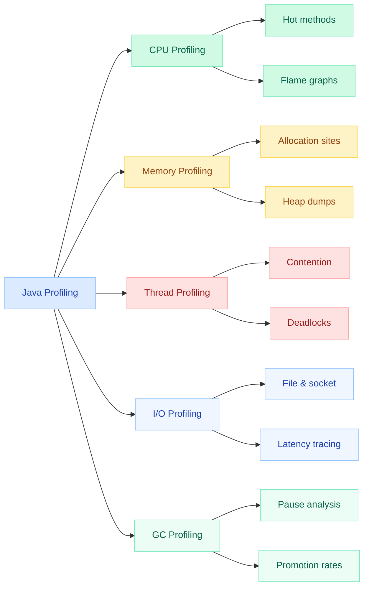
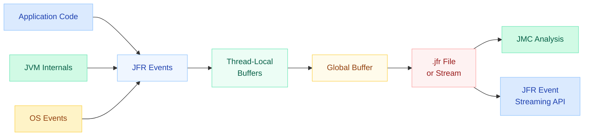
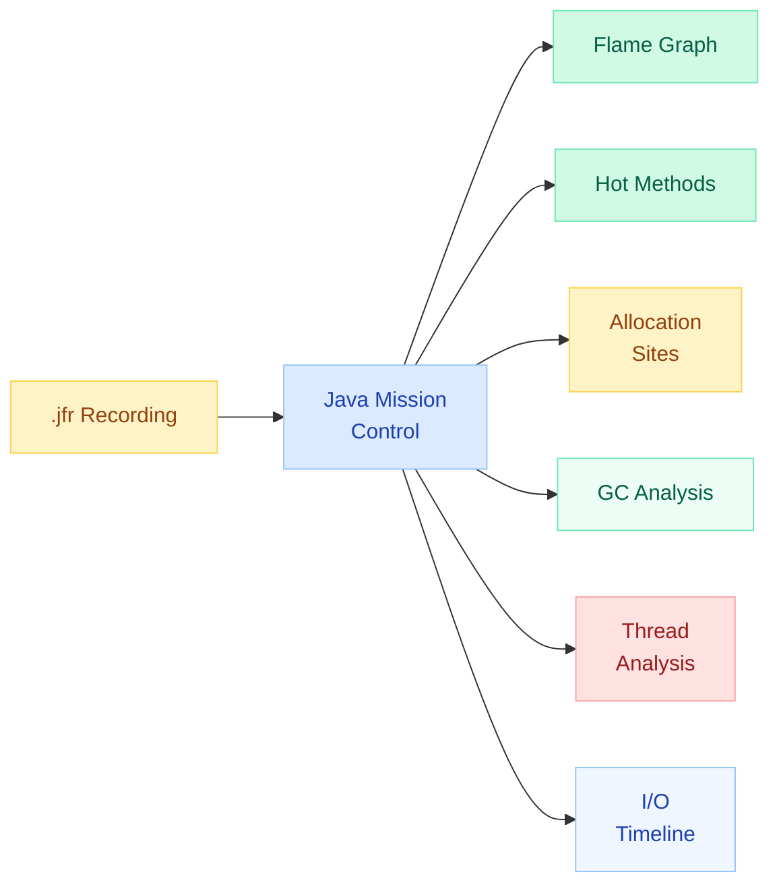
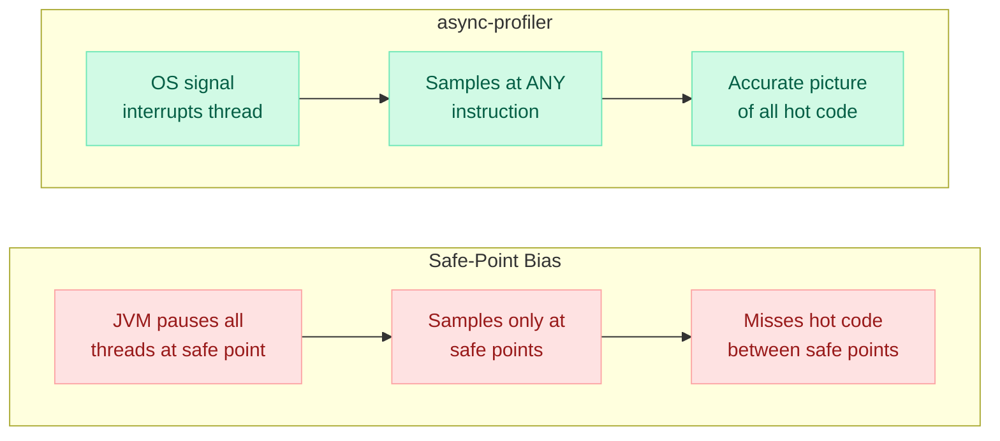
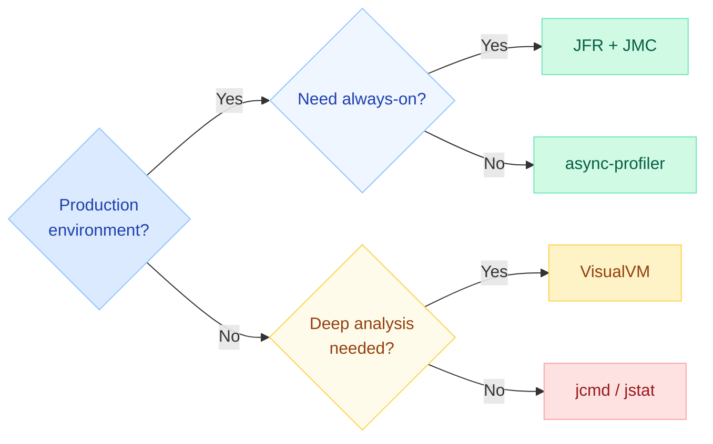
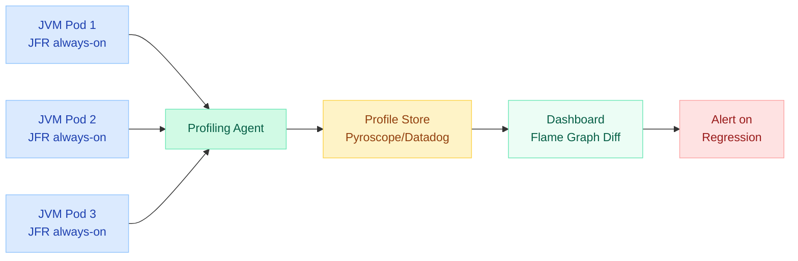

# Java Profiling Tools

!!! danger "Production War Story"
    A payment service hit 5-second latency spikes every 30 minutes. Traditional monitoring showed only "high CPU." Attaching **async-profiler** in production revealed **80% of CPU** was spent in a single regex pattern (`Pattern.compile` called inside a hot loop). One line fix — pre-compile the pattern — dropped P99 latency from 5s to 12ms.

---

## Profiling Categories



| Category | What It Reveals | Key Metrics |
|---|---|---|
| **CPU** | Hot methods, inefficient algorithms | Samples/sec, self-time, total-time |
| **Memory** | Allocation pressure, leaks | Allocation rate (MB/s), live set size |
| **Thread** | Contention, deadlocks, parking | Lock wait time, blocked thread count |
| **I/O** | Slow disk/network calls | Bytes read/written, latency per call |
| **GC** | Pause frequency, promotion rates | GC pause ms, throughput %, tenuring |

---

## Java Flight Recorder (JFR)

JFR is a **zero-overhead** event-based profiling framework built into the JVM (HotSpot). It was made free and open-source in Java 11 (backported to 8u262+). JFR is designed to be **always-on in production** with less than 1% overhead.

### Architecture



### JFR Event Categories

| Category | Example Events | Use Case |
|---|---|---|
| **CPU** | `jdk.ExecutionSample`, `jdk.CPULoad` | Find hot methods |
| **Allocation** | `jdk.ObjectAllocationInNewTLAB`, `jdk.ObjectAllocationOutsideTLAB` | Allocation profiling |
| **I/O** | `jdk.FileRead`, `jdk.FileWrite`, `jdk.SocketRead` | Identify slow I/O |
| **GC** | `jdk.GarbageCollection`, `jdk.GCPhasePause` | GC pause analysis |
| **Thread** | `jdk.ThreadPark`, `jdk.JavaMonitorWait` | Contention detection |
| **Custom** | User-defined `@Name` events | Business-specific metrics |

### Enabling JFR

=== "JVM Flags (startup)"

    ```bash
    # Start recording at JVM launch — continuous ring buffer
    java -XX:StartFlightRecording=duration=60s,filename=recording.jfr \
         -jar myapp.jar

    # Always-on with max-age ring buffer (production)
    java -XX:StartFlightRecording=disk=true,maxage=12h,maxsize=1g,\
    dumponexit=true,filename=/var/log/jfr/app.jfr \
         -jar myapp.jar
    ```

=== "jcmd (live, no restart)"

    ```bash
    # Start recording on a running JVM
    jcmd <pid> JFR.start name=profile duration=60s filename=profile.jfr

    # Dump current ring buffer without stopping
    jcmd <pid> JFR.dump name=profile filename=snapshot.jfr

    # Stop recording
    jcmd <pid> JFR.stop name=profile

    # Check active recordings
    jcmd <pid> JFR.check
    ```

=== "Programmatic (Java API)"

    ```java
    import jdk.jfr.*;

    // Start a recording programmatically
    try (Recording recording = new Recording()) {
        recording.enable("jdk.CPULoad").withPeriod(Duration.ofSeconds(1));
        recording.enable("jdk.ExecutionSample").withPeriod(Duration.ofMillis(10));
        recording.enable("jdk.ObjectAllocationInNewTLAB");
        recording.setDestination(Path.of("app-profile.jfr"));
        recording.start();

        // ... application runs ...
        Thread.sleep(Duration.ofMinutes(1));
    }
    ```

### Custom JFR Events

```java
import jdk.jfr.*;

@Name("com.myapp.OrderProcessed")
@Label("Order Processed")
@Category({"Application", "Orders"})
@StackTrace(false)
public class OrderEvent extends Event {
    @Label("Order ID")
    public String orderId;

    @Label("Processing Time (ms)")
    @Timespan(Timespan.MILLISECONDS)
    public long processingTime;

    @Label("Item Count")
    public int itemCount;
}

// Usage in application code
OrderEvent event = new OrderEvent();
event.begin();
// ... process order ...
event.orderId = order.getId();
event.processingTime = elapsed;
event.itemCount = order.getItems().size();
event.commit();  // recorded only if event is enabled
```

### JFR Event Streaming (Java 14+)

```java
import jdk.jfr.consumer.*;

// Stream events in real-time without writing to disk
try (RecordingStream rs = new RecordingStream()) {
    rs.enable("jdk.CPULoad").withPeriod(Duration.ofSeconds(1));
    rs.enable("jdk.GarbageCollection");

    rs.onEvent("jdk.CPULoad", event -> {
        float machineTotal = event.getFloat("machineTotal");
        if (machineTotal > 0.8) {
            System.out.printf("HIGH CPU: %.1f%%%n", machineTotal * 100);
        }
    });

    rs.onEvent("jdk.GarbageCollection", event -> {
        Duration pause = event.getDuration("longestPause");
        if (pause.toMillis() > 200) {
            System.out.printf("LONG GC PAUSE: %d ms%n", pause.toMillis());
        }
    });

    rs.startAsync();  // non-blocking
}
```

!!! tip "JFR Event Streaming Use Cases"
    - **Custom alerting**: Trigger PagerDuty when allocation rate exceeds threshold
    - **Live dashboards**: Stream JFR events to Prometheus/Grafana via Micrometer
    - **Adaptive tuning**: Automatically adjust thread pool size based on contention events

---

## Java Mission Control (JMC)

JMC is the **GUI analysis tool** for JFR recordings. It provides rich visualizations for identifying performance bottlenecks.

### Key Analysis Views



| View | What It Shows | Look For |
|---|---|---|
| **Flame Graph** | Call stack depth + sample counts | Wide plateaus = CPU hogs |
| **Hot Methods** | Top methods by self-time | Methods consuming >5% CPU |
| **Allocation** | Object allocation by type & site | High allocation rate = GC pressure |
| **GC** | Pause durations, causes, generations | Long pauses, frequent full GCs |
| **Threads** | Thread states over time | Blocked/waiting threads |
| **I/O** | File/socket reads/writes timeline | High latency I/O calls |

### Flame Graph Interpretation

```
┌──────────────────────────────────────────────────────────────────┐
│                         main()                                    │
├───────────────────────────────┬──────────────────────────────────┤
│      processOrders()          │       handleMetrics()            │
├──────────────────┬────────────┤                                  │
│  validateOrder() │ saveOrder()│                                  │
├──────────────────┤            │                                  │
│ REGEX MATCH (80%)│            │                                  │
└──────────────────┴────────────┴──────────────────────────────────┘
  ← wider = more CPU time →
```

!!! info "Reading Flame Graphs"
    - **X-axis**: Proportion of samples (NOT time order)
    - **Y-axis**: Call stack depth (bottom = entry point)
    - **Wide bars at top**: Self-time hogs (optimize these first)
    - **Narrow deep stacks**: Deep call chains but little CPU each

---

## VisualVM

VisualVM is a free, lightweight profiling tool that combines JConsole, jstack, jmap, and jstat in a single GUI. Good for development and staging but has **higher overhead** than JFR.

### Capabilities

| Feature | Description | Overhead |
|---|---|---|
| **CPU Sampling** | Periodic stack sampling (configurable rate) | Low-medium |
| **CPU Instrumentation** | Bytecode injection for exact call counts | High (2-10x slowdown) |
| **Memory Sampling** | Track allocations by class | Medium |
| **Heap Dump** | Full snapshot of live objects | Pause (seconds for large heaps) |
| **Thread Dump** | Snapshot of all thread stacks | Instant |
| **GC Monitoring** | Real-time heap usage & GC activity | Negligible |
| **MBean Browser** | JMX MBean inspection | Negligible |

### Usage Patterns

```bash
# Launch VisualVM (ships with JDK or download standalone)
jvisualvm

# Connect to remote JVM via JMX
# (target JVM needs these flags)
java -Dcom.sun.management.jmxremote \
     -Dcom.sun.management.jmxremote.port=9010 \
     -Dcom.sun.management.jmxremote.authenticate=false \
     -Dcom.sun.management.jmxremote.ssl=false \
     -jar myapp.jar
```

### When to Use VisualVM

- **Development**: Quick CPU/memory profiling during coding
- **Heap dump analysis**: Finding memory leaks (retained size, GC roots)
- **Thread analysis**: Diagnosing deadlocks and contention
- **Remote monitoring**: Watching JMX metrics on staging servers

!!! warning "VisualVM Limitations"
    - CPU instrumentation causes significant overhead (not for production)
    - Sampling suffers from **safe-point bias** (only samples at safe points)
    - Cannot profile native methods or JIT-compiled code accurately
    - Not recommended for production use — prefer JFR or async-profiler

---

## async-profiler

async-profiler is a **low-overhead** sampling profiler that does NOT suffer from safe-point bias. It uses Linux `perf_events` and macOS `dtrace` to collect stack traces at any point in execution, not just at JVM safe points.

### Why async-profiler Over JMC/VisualVM



### Profiling Modes

| Mode | Flag | What It Captures |
|---|---|---|
| **CPU** | `-e cpu` | On-CPU execution samples |
| **Wall-clock** | `-e wall` | All threads (including blocked/sleeping) |
| **Allocation** | `-e alloc` | Object allocation by size and site |
| **Lock** | `-e lock` | Lock contention (monitor enter) |
| **Cache misses** | `-e cache-misses` | CPU cache miss events |

### Usage

```bash
# Download and extract
wget https://github.com/async-profiler/async-profiler/releases/latest/download/async-profiler-linux-x64.tar.gz
tar xzf async-profiler-linux-x64.tar.gz

# CPU profiling for 30 seconds — output flame graph HTML
./asprof -d 30 -f flamegraph.html <pid>

# Wall-clock profiling (includes sleeping/blocked threads)
./asprof -e wall -d 30 -f wall-flamegraph.html <pid>

# Allocation profiling — find allocation hot spots
./asprof -e alloc -d 60 -f alloc-flamegraph.html <pid>

# Lock contention profiling
./asprof -e lock -d 30 -f lock-flamegraph.html <pid>

# Start/stop mode (profile a specific operation)
./asprof start -e cpu <pid>
# ... trigger the operation ...
./asprof stop -f result.html <pid>

# Profile from JVM startup (as a Java agent)
java -agentpath:/path/to/libasyncProfiler.so=start,event=cpu,file=startup.html \
     -jar myapp.jar
```

### Flame Graph Output

async-profiler generates interactive HTML flame graphs directly — no external tools needed.

!!! tip "async-profiler Best Practices"
    - Use `-e wall` for latency issues (includes time waiting on I/O, locks, sleep)
    - Use `-e cpu` for throughput issues (only on-CPU time)
    - Use `-e alloc` when GC is the bottleneck (find allocation-heavy code)
    - Combine with `--jfrsync` to correlate with JFR events
    - Safe for production: typical overhead <2%

---

## CLI Tools Quick Reference

### jcmd — Swiss Army Knife

```bash
# List all Java processes
jcmd -l

# Thread dump (better than jstack — no ptrace needed)
jcmd <pid> Thread.print

# Heap dump
jcmd <pid> GC.heap_dump /tmp/heap.hprof

# Heap histogram (top memory consumers)
jcmd <pid> GC.class_histogram | head -20

# Force garbage collection
jcmd <pid> GC.run

# Get VM flags
jcmd <pid> VM.flags

# Get system properties
jcmd <pid> VM.system_properties

# JFR operations (see JFR section above)
jcmd <pid> JFR.start name=rec duration=60s filename=out.jfr
```

### jstack — Thread Dumps

```bash
# Basic thread dump
jstack <pid>

# Force thread dump (even if JVM is hung)
jstack -F <pid>

# Include locks info
jstack -l <pid>

# Detect deadlocks
jstack <pid> | grep -A 5 "deadlock"
```

### jmap — Memory Inspection

```bash
# Heap summary
jmap -heap <pid>

# Heap histogram (live objects only)
jmap -histo:live <pid> | head -30

# Generate heap dump
jmap -dump:live,format=b,file=heap.hprof <pid>

# Class loader stats
jmap -clstats <pid>
```

### jstat — GC Statistics

```bash
# GC summary every 1 second, 10 samples
jstat -gcutil <pid> 1000 10

# Output:
#   S0     S1     E      O      M     CCS    YGC  YGCT   FGC  FGCT   CGC  CGCT    GCT
#  0.00  98.12  45.67  72.34  95.21  92.14   234  1.45     3  0.89    12  0.12    2.46

# GC capacity
jstat -gccapacity <pid> 1000 5

# New generation stats
jstat -gcnew <pid> 1000

# Compilation stats
jstat -compiler <pid>
```

| Column | Meaning |
|---|---|
| `S0`, `S1` | Survivor space 0/1 utilization (%) |
| `E` | Eden space utilization (%) |
| `O` | Old generation utilization (%) |
| `M` | Metaspace utilization (%) |
| `YGC` / `YGCT` | Young GC count / total time (s) |
| `FGC` / `FGCT` | Full GC count / total time (s) |

---

## When to Use Which Tool



| Scenario | Tool | Reason |
|---|---|---|
| **Production CPU spike** | async-profiler | Low overhead, no safe-point bias, instant flame graph |
| **Always-on monitoring** | JFR (continuous) | <1% overhead, ring buffer, event streaming |
| **Memory leak investigation** | jcmd heap dump + JMC | Full object graph, GC root analysis |
| **GC tuning** | JFR + jstat | Detailed GC event data + real-time stats |
| **Deadlock detection** | jstack / jcmd Thread.print | Instant thread state snapshot |
| **Development profiling** | VisualVM | Easy GUI, no setup, good enough for dev |
| **Allocation profiling** | async-profiler `-e alloc` | Shows exact allocation sites without bias |
| **Lock contention** | async-profiler `-e lock` | Identifies contested monitors |
| **Startup performance** | async-profiler (agent mode) | Profile from JVM bootstrap |
| **Latency debugging** | async-profiler `-e wall` | Includes waiting/blocked time |

---

## Production Profiling Best Practices

### Golden Rules

1. **Always-on JFR** — Enable JFR with ring buffer on every production JVM. Zero cost until you need it.
2. **Keep overhead < 2%** — Never use instrumentation-based profiling in production.
3. **Profile under load** — A profiler on an idle system tells you nothing useful.
4. **Compare baselines** — Save recordings from "healthy" state to diff against incidents.
5. **Automate collection** — Trigger JFR dumps automatically on high CPU or GC alerts.

### Continuous Profiling Architecture



### Production-Ready JFR Configuration

```bash
# Always-on JFR for every production JVM
java -XX:StartFlightRecording=disk=true,\
maxage=6h,maxsize=500m,\
dumponexit=true,\
filename=/var/log/jfr/app.jfr,\
settings=profile \
     -XX:FlightRecorderOptions=stackdepth=256 \
     -jar myapp.jar
```

### Incident Response Playbook

| Step | Command | Purpose |
|---|---|---|
| 1 | `jcmd <pid> JFR.dump filename=incident.jfr` | Capture current state |
| 2 | `jcmd <pid> Thread.print` | Thread dump for deadlocks |
| 3 | `jstat -gcutil <pid> 1000 5` | Check GC pressure |
| 4 | `jcmd <pid> GC.class_histogram` | Top memory consumers |
| 5 | `./asprof -d 30 -f cpu.html <pid>` | CPU flame graph |
| 6 | `./asprof -e wall -d 30 -f wall.html <pid>` | Full latency picture |

---

## Quick Recall

| Concept | Key Point |
|---|---|
| **JFR** | Built-in, <1% overhead, always-on in production, event-based |
| **JMC** | GUI for analyzing .jfr files — flame graphs, allocations, GC |
| **VisualVM** | Dev-time profiler, easy GUI, suffers from safe-point bias |
| **async-profiler** | No safe-point bias, uses OS perf_events, production-safe |
| **Safe-point bias** | JVM can only sample at safe points — misses hot code between them |
| **Wall-clock** | Profiles ALL time (CPU + waiting) — use for latency issues |
| **CPU profiling** | Profiles only on-CPU time — use for throughput issues |
| **jcmd** | Preferred over jstack/jmap — no ptrace, same JVM user |
| **Continuous profiling** | Always-on JFR + agent sends to Pyroscope/Datadog |
| **Flame graph** | X = sample proportion (not time), Y = stack depth, wide top bars = targets |

---

## Interview Template

!!! example "Sample Question: How would you diagnose a production latency spike?"

    **1. State the approach:**
    "I would follow a structured incident profiling workflow: observe, hypothesize, profile, validate."

    **2. Immediate triage:**
    ```bash
    # Check if it's CPU, GC, or I/O
    jstat -gcutil <pid> 1000 5       # GC pressure?
    jcmd <pid> Thread.print           # Threads blocked?
    jcmd <pid> JFR.dump filename=incident.jfr  # Capture state
    ```

    **3. Deep profiling:**
    "If CPU is high, I attach async-profiler with `-e cpu` for a flame graph. If latency is high but CPU is low, I use `-e wall` to capture blocked/waiting time. For memory issues, I dump the heap and analyze in JMC."

    **4. Key differentiators to mention:**
    - async-profiler has no safe-point bias (unlike VisualVM/JMC sampling)
    - JFR is always-on in production with <1% overhead
    - Wall-clock profiling reveals I/O and lock contention that CPU profiling misses
    - Continuous profiling (Pyroscope/Datadog) enables diffing healthy vs. degraded states

    **5. Resolution pattern:**
    "Once I identify the hot method or contention point, I fix the root cause (pre-compile regex, add caching, reduce lock scope, batch I/O) and validate with a before/after flame graph comparison."
