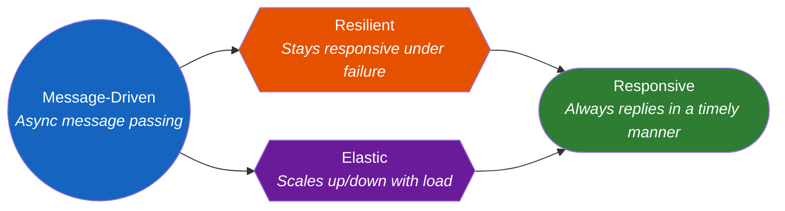
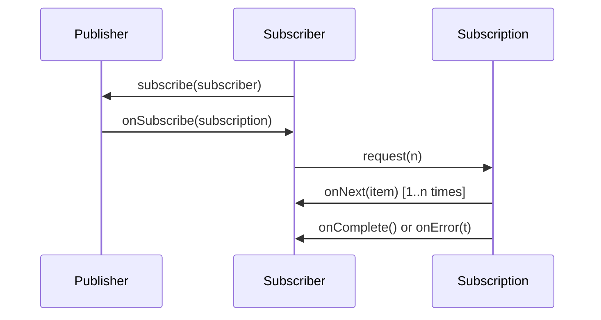
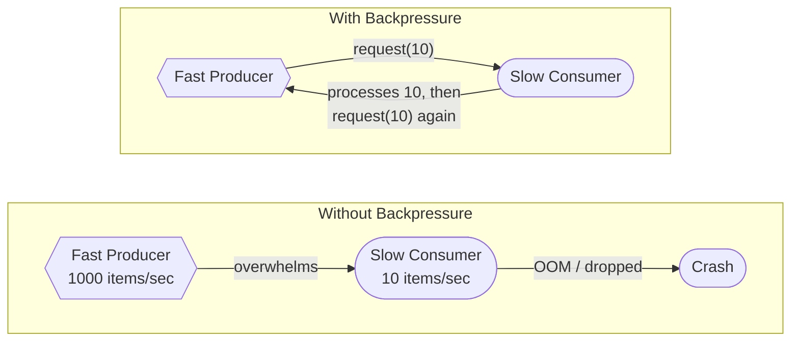
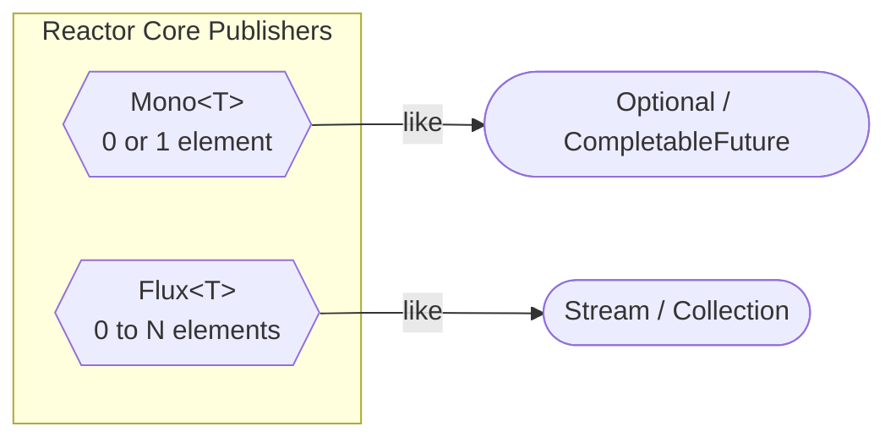

# Reactive Streams & Reactive Programming in Java

Reactive programming is a paradigm for building **non-blocking, asynchronous, event-driven** systems that can handle high concurrency with minimal threads. It has become essential for modern microservices, real-time data pipelines, and high-throughput APIs. This page covers the Reactive Manifesto, the Reactive Streams specification, Project Reactor, RxJava, and everything you need to ace reactive programming interviews.

---

## The Reactive Manifesto

The [Reactive Manifesto](https://www.reactivemanifesto.org/) defines four pillars that reactive systems must exhibit:



| Pillar | Meaning | How It Helps |
|---|---|---|
| **Responsive** | System responds in a timely manner | Users get consistent, fast responses |
| **Resilient** | System stays responsive during failures | Failures are contained via isolation, replication, delegation |
| **Elastic** | System handles varying load | Scale out under load, scale in when idle |
| **Message-Driven** | Components communicate via async messages | Loose coupling, non-blocking, back-pressure aware |

!!! tip "Interview Insight"
    The Reactive Manifesto is about **system architecture**, not a specific library. Project Reactor and RxJava are *implementations* that help build reactive systems, but simply using Flux does not make your system "reactive" unless it follows these principles end-to-end.

---

## Reactive Streams Specification

The **Reactive Streams** spec (initiated by Netflix, Lightbend, Pivotal, Red Hat) defines a standard for asynchronous stream processing with non-blocking backpressure. It consists of exactly four interfaces:



### The Four Interfaces

```java
// 1. Publisher — source of data
public interface Publisher<T> {
    void subscribe(Subscriber<? super T> subscriber);
}

// 2. Subscriber — consumer of data
public interface Subscriber<T> {
    void onSubscribe(Subscription subscription);
    void onNext(T item);
    void onError(Throwable throwable);
    void onComplete();
}

// 3. Subscription — link between Publisher and Subscriber
public interface Subscription {
    void request(long n);   // request n items (backpressure!)
    void cancel();          // cancel the subscription
}

// 4. Processor — both Publisher and Subscriber (transforms data in-flight)
public interface Processor<T, R> extends Subscriber<T>, Publisher<R> {
}
```

!!! warning "Key Rule"
    A `Subscriber` must call `request(n)` to receive data. The `Publisher` must **never** send more items than requested. This is the foundation of **backpressure**.

### Lifecycle Rules

1. `onSubscribe` is always called first, exactly once
2. `onNext` can be called 0 to N times (bounded by `request(n)`)
3. Terminal signals: `onComplete()` or `onError(t)` — exactly one, exactly once
4. After a terminal signal, no more events are emitted

---

## java.util.concurrent.Flow (Java 9+)

Java 9 added the Reactive Streams interfaces directly into the JDK under `java.util.concurrent.Flow`:

```java
// These are NESTED interfaces inside java.util.concurrent.Flow
Flow.Publisher<T>
Flow.Subscriber<T>
Flow.Subscription
Flow.Processor<T, R>
```

They are **semantically identical** to `org.reactivestreams` interfaces. Java 9 also ships `SubmissionPublisher`, a concrete implementation:

```java
import java.util.concurrent.Flow.*;
import java.util.concurrent.SubmissionPublisher;

public class FlowExample {
    public static void main(String[] args) throws InterruptedException {
        // SubmissionPublisher is a concrete Publisher
        SubmissionPublisher<String> publisher = new SubmissionPublisher<>();

        // Create a Subscriber
        Subscriber<String> subscriber = new Subscriber<>() {
            private Subscription subscription;

            @Override
            public void onSubscribe(Subscription subscription) {
                this.subscription = subscription;
                subscription.request(1); // request first item
            }

            @Override
            public void onNext(String item) {
                System.out.println("Received: " + item);
                subscription.request(1); // request next item
            }

            @Override
            public void onError(Throwable throwable) {
                System.err.println("Error: " + throwable.getMessage());
            }

            @Override
            public void onComplete() {
                System.out.println("Done!");
            }
        };

        publisher.subscribe(subscriber);
        publisher.submit("Hello");
        publisher.submit("Reactive");
        publisher.submit("World");
        publisher.close(); // sends onComplete

        Thread.sleep(1000); // wait for async processing
    }
}
```

!!! info "Why Both Exist?"
    `org.reactivestreams` came first (2014) as a library. Java 9 (2017) adopted the same interfaces into the JDK. Libraries like Reactor and RxJava provide adapters between them. Modern code should prefer `java.util.concurrent.Flow` when targeting Java 9+.

---

## Backpressure

Backpressure is the mechanism by which a **slow consumer** signals to a **fast producer** to slow down. Without it, fast producers overwhelm slow consumers, causing `OutOfMemoryError` or dropped data.



### Backpressure Strategies

| Strategy | Behavior | Use When |
|---|---|---|
| **Request (Pull)** | Consumer requests N items at a time | Default; consumer controls the pace |
| **Buffer** | Buffer excess items in memory | Bursts are short and bounded |
| **Drop** | Drop items that cannot be consumed | Latest data matters more (sensor readings) |
| **Latest** | Keep only the most recent item | UI updates, real-time dashboards |
| **Error** | Signal error when buffer overflows | Overflow is unacceptable |

In Project Reactor, backpressure strategies are applied via `onBackpressureBuffer()`, `onBackpressureDrop()`, `onBackpressureLatest()`, and `onBackpressureError()`:

```java
Flux.range(1, 1_000_000)
    .onBackpressureBuffer(256)        // buffer up to 256 items
    .publishOn(Schedulers.parallel())
    .subscribe(
        item -> {
            // slow consumer
            Thread.sleep(10);
            System.out.println(item);
        }
    );
```

---

## Project Reactor (Mono & Flux)

**Project Reactor** is the reactive library used by Spring WebFlux. It implements the Reactive Streams spec and provides two core publishers:



| Type | Emits | Analogy |
|---|---|---|
| `Mono<T>` | 0 or 1 element | A single async result (HTTP call, DB lookup) |
| `Flux<T>` | 0 to N elements | A stream of async results (event stream, query results) |

### Creating Publishers

```java
// --- Mono creation ---
Mono<String> empty = Mono.empty();
Mono<String> just = Mono.just("Hello");
Mono<String> fromCallable = Mono.fromCallable(() -> fetchFromDb());
Mono<String> fromFuture = Mono.fromFuture(completableFuture);
Mono<String> deferred = Mono.defer(() -> Mono.just(expensiveCall()));

// --- Flux creation ---
Flux<Integer> fromValues = Flux.just(1, 2, 3, 4, 5);
Flux<String> fromIterable = Flux.fromIterable(List.of("a", "b", "c"));
Flux<Integer> range = Flux.range(1, 100);
Flux<Long> interval = Flux.interval(Duration.ofSeconds(1)); // 0, 1, 2, ...

// generate — synchronous, stateful, one-by-one
Flux<String> generated = Flux.generate(
    () -> 0,                           // initial state
    (state, sink) -> {
        sink.next("Item " + state);
        if (state == 9) sink.complete();
        return state + 1;
    }
);

// create — async, multi-threaded, bridge from callback APIs
Flux<String> created = Flux.create(sink -> {
    // Bridge a callback-based API
    myEventSource.register(event -> sink.next(event));
    myEventSource.onClose(() -> sink.complete());
    myEventSource.onError(e -> sink.error(e));
});
```

!!! note "`generate` vs `create`"
    - **`generate`**: Synchronous, pull-based, emits one item per round. Best for stateful sequences.
    - **`create`**: Asynchronous, push-based, can emit 0..N items from any thread. Best for bridging callback/listener APIs.

### Core Operators

#### Transforming

```java
Flux<String> names = Flux.just("john", "jane", "bob");

// map — synchronous 1:1 transform
Flux<String> upper = names.map(String::toUpperCase);
// Output: JOHN, JANE, BOB

// flatMap — async 1:N transform (interleaved, unordered)
Flux<User> users = names.flatMap(name -> userService.findByName(name));

// concatMap — async 1:N transform (preserves order, sequential)
Flux<User> orderedUsers = names.concatMap(name -> userService.findByName(name));

// switchMap — cancels previous inner publisher on new item
Flux<SearchResult> results = searchTerms
    .switchMap(term -> searchService.search(term));
```

!!! warning "`flatMap` vs `concatMap` vs `switchMap`"
    | Operator | Ordering | Concurrency | Cancels Previous |
    |---|---|---|---|
    | `flatMap` | Interleaved (no guarantee) | Concurrent | No |
    | `concatMap` | Preserved (sequential) | One at a time | No |
    | `switchMap` | Latest only | One active | Yes |

    **Interview favorite**: "When would you use `concatMap` over `flatMap`?" Answer: When order matters and you need sequential processing (e.g., writing to a file).

#### Filtering

```java
Flux.range(1, 20)
    .filter(i -> i % 2 == 0)         // even numbers
    .take(5)                          // first 5
    .skip(1)                          // skip first
    .distinct()                       // deduplicate
    .subscribe(System.out::println);  // 4, 6, 8, 10
```

#### Combining

```java
Flux<String> flux1 = Flux.just("A", "B", "C");
Flux<Integer> flux2 = Flux.just(1, 2, 3);

// zip — combines element-by-element into tuples
Flux<String> zipped = Flux.zip(flux1, flux2, (s, i) -> s + i);
// Output: A1, B2, C3

// merge — interleaves emissions as they arrive (real-time)
Flux<String> merged = Flux.merge(flux1, flux2.map(String::valueOf));
// Output order depends on timing

// concat — appends one after another (sequential)
Flux<String> concatenated = Flux.concat(flux1, flux2.map(String::valueOf));
// Output: A, B, C, 1, 2, 3

// combineLatest — combines latest from each source
Flux<String> combined = Flux.combineLatest(flux1, flux2, (s, i) -> s + i);
```

### Error Handling

Errors in reactive streams are **terminal events** — once `onError` fires, the stream is done. Reactor provides operators to recover gracefully:

```java
Flux<Integer> withErrors = Flux.just(1, 2, 0, 4)
    .map(i -> 10 / i); // ArithmeticException at 0

// onErrorReturn — provide a fallback value
withErrors
    .onErrorReturn(-1)
    .subscribe(System.out::println); // 10, 5, -1

// onErrorResume — switch to a fallback publisher
withErrors
    .onErrorResume(e -> Flux.just(99, 100))
    .subscribe(System.out::println); // 10, 5, 99, 100

// onErrorMap — transform the error
withErrors
    .onErrorMap(ArithmeticException.class, 
                e -> new BusinessException("Division failed", e))
    .subscribe();

// retry — resubscribe on error
withErrors
    .retry(3) // retry up to 3 times
    .subscribe();

// retryWhen — advanced retry with backoff
withErrors
    .retryWhen(Retry.backoff(3, Duration.ofSeconds(1))
        .maxBackoff(Duration.ofSeconds(10))
        .jitter(0.5))
    .subscribe();

// doOnError — side effect (logging) without handling
withErrors
    .doOnError(e -> log.error("Stream failed", e))
    .onErrorReturn(-1)
    .subscribe();
```

!!! tip "Error Handling Strategy"
    In production reactive code, combine `doOnError` (for logging) with `onErrorResume` (for fallback logic) and `retryWhen` (for transient failures). Never let errors go unhandled -- an unhandled `onError` throws an `UnsupportedOperationException`.

### Schedulers

Reactor is **concurrency-agnostic** by default -- operators run on the thread that subscribes. Use `subscribeOn` and `publishOn` to control threading:

```java
Flux.range(1, 100)
    .subscribeOn(Schedulers.boundedElastic())   // upstream runs here
    .map(i -> blockingDbCall(i))                // runs on boundedElastic
    .publishOn(Schedulers.parallel())            // downstream switches here
    .map(i -> cpuIntensiveTransform(i))          // runs on parallel
    .subscribe();
```

| Scheduler | Thread Pool | Use For |
|---|---|---|
| `Schedulers.immediate()` | Current thread | Testing, debugging |
| `Schedulers.single()` | Single reusable thread | Sequential tasks |
| `Schedulers.parallel()` | Fixed pool (CPU cores) | CPU-bound work |
| `Schedulers.boundedElastic()` | Elastic, bounded pool | Blocking I/O (DB, HTTP, file) |
| `Schedulers.fromExecutor(exec)` | Custom executor | Custom thread pools |

!!! warning "`subscribeOn` vs `publishOn`"
    - **`subscribeOn`** affects the **entire chain upstream** (where the source runs). Placement does not matter -- only the first `subscribeOn` wins.
    - **`publishOn`** affects **everything downstream** from the point it appears. You can use multiple `publishOn` calls to switch threads at different stages.

    ```
    source → [subscribeOn: boundedElastic] → map → [publishOn: parallel] → map → subscribe
                  ↑ source runs here                    ↑ downstream runs here
    ```

### Hot vs Cold Publishers

This distinction is one of the most commonly asked reactive interview questions:

| Aspect | Cold Publisher | Hot Publisher |
|---|---|---|
| **Data generation** | Per subscriber (lazy) | Independent of subscribers |
| **Replay** | Each subscriber gets all data from start | Late subscribers miss past data |
| **Analogy** | Watching a movie on Netflix | Watching live TV |
| **Example** | HTTP request, DB query | Mouse events, stock ticker, WebSocket |

```java
// COLD — each subscriber triggers a new HTTP call
Mono<User> cold = webClient.get()
    .uri("/users/1")
    .retrieve()
    .bodyToMono(User.class);

cold.subscribe(u -> log.info("Sub1: {}", u)); // HTTP call #1
cold.subscribe(u -> log.info("Sub2: {}", u)); // HTTP call #2

// HOT — convert cold to hot using share()
Flux<Long> hot = Flux.interval(Duration.ofSeconds(1))
    .share(); // multicasts to all current subscribers

hot.subscribe(i -> System.out.println("Sub1: " + i));
Thread.sleep(3000);
hot.subscribe(i -> System.out.println("Sub2: " + i)); // misses first 3 items
```

**Hot publisher operators:**

| Operator | Behavior |
|---|---|
| `share()` | Multicasts; late subscribers get only new items |
| `replay(n)` | Caches last N items for late subscribers |
| `cache()` | Caches all items (equivalent to `replay().autoConnect()`) |
| `publish().autoConnect(n)` | Starts when N subscribers connect |
| `publish().refCount(n)` | Like `autoConnect` but cancels when all subscribers leave |

---

## RxJava Comparison

RxJava was the original reactive library for Java (by Netflix). While Reactor is now dominant in the Spring ecosystem, RxJava is still widely used in Android development and older backends.

| RxJava 3 Type | Reactor Equivalent | Description |
|---|---|---|
| `Observable<T>` | `Flux<T>` (no backpressure) | 0..N items, no backpressure support |
| `Flowable<T>` | `Flux<T>` | 0..N items with backpressure |
| `Single<T>` | `Mono<T>` | Exactly 1 item |
| `Maybe<T>` | `Mono<T>` | 0 or 1 item |
| `Completable` | `Mono<Void>` | No item, just completion/error |

```java
// RxJava 3
Flowable.just(1, 2, 3)
    .map(i -> i * 2)
    .filter(i -> i > 2)
    .subscribe(System.out::println);

// Project Reactor (equivalent)
Flux.just(1, 2, 3)
    .map(i -> i * 2)
    .filter(i -> i > 2)
    .subscribe(System.out::println);
```

!!! note "Which to Choose?"
    - **Project Reactor**: Spring ecosystem, WebFlux, modern backends
    - **RxJava**: Android development, legacy backends, non-Spring projects
    - Both implement Reactive Streams and are interoperable

---

## Reactive vs CompletableFuture vs Streams

This comparison is a very common interview question. Each serves a different purpose:

| Feature | `Stream<T>` | `CompletableFuture<T>` | `Mono<T>` / `Flux<T>` |
|---|---|---|---|
| **Sync/Async** | Synchronous | Asynchronous | Asynchronous |
| **Lazy?** | Yes (terminal op triggers) | No (starts immediately) | Yes (subscribe triggers) |
| **Items** | 0..N | Exactly 1 | 0..1 (Mono) / 0..N (Flux) |
| **Backpressure** | N/A (pull-based) | N/A (single value) | Yes |
| **Reusable** | No (single-use) | Yes (share result) | Yes (resubscribe) |
| **Error handling** | Exceptions (try/catch) | exceptionally/handle | onError operators |
| **Cancellation** | No | cancel() | Subscription.cancel() |
| **Push/Pull** | Pull | Push | Push (with pull backpressure) |

```java
// Stream — sync, pull-based, single use
List<String> result = users.stream()
    .filter(u -> u.isActive())
    .map(User::getName)
    .collect(Collectors.toList());

// CompletableFuture — async, single value, eager
CompletableFuture<User> future = CompletableFuture
    .supplyAsync(() -> userService.findById(1))
    .thenApply(user -> enrich(user));

// Mono — async, single value, lazy, composable
Mono<User> mono = userService.findById(1)
    .map(user -> enrich(user))
    .onErrorResume(e -> Mono.empty());
```

!!! tip "Interview Answer Template"
    "Use **Streams** for synchronous collection processing, **CompletableFuture** for single async operations without backpressure needs, and **Reactor/RxJava** when you need async stream processing with backpressure, complex operator chains, or integration with reactive frameworks like WebFlux."

---

## When to Use Reactive (and When NOT To)

### Good Fit for Reactive

- **High-concurrency I/O**: APIs handling thousands of concurrent connections (WebFlux handles 10K+ connections with few threads)
- **Streaming data**: Real-time feeds, WebSockets, Server-Sent Events
- **Microservice orchestration**: Composing multiple async service calls with operators
- **Event-driven systems**: Reacting to events from message brokers (Kafka, RabbitMQ)
- **Non-blocking pipelines**: Data processing without thread-per-request overhead

### Bad Fit for Reactive

- **Simple CRUD apps**: Servlet-based Spring MVC is simpler and performs well enough
- **CPU-bound work**: Reactive does not speed up computation -- it optimizes I/O waiting
- **JDBC-heavy apps**: Traditional JDBC is blocking (though R2DBC exists, it has limitations)
- **Small teams unfamiliar with reactive**: The learning curve is steep; debugging is harder
- **Synchronous business logic**: If your logic is inherently sequential, reactive adds complexity

!!! danger "Common Pitfall"
    Do **not** wrap blocking code in `Mono.fromCallable()` without `subscribeOn(Schedulers.boundedElastic())`. Blocking on a reactor thread (like Netty's event loop) will freeze your entire application:

    ```java
    // WRONG — blocks the event loop
    Mono.fromCallable(() -> jdbcTemplate.query(...))
        .subscribe();

    // CORRECT — offload to elastic scheduler
    Mono.fromCallable(() -> jdbcTemplate.query(...))
        .subscribeOn(Schedulers.boundedElastic())
        .subscribe();
    ```

---

## Testing Reactive Code with StepVerifier

Reactor provides `StepVerifier` (from `reactor-test`) for testing reactive streams declaratively:

```java
// Testing a Flux
@Test
void testFluxEmitsCorrectValues() {
    Flux<String> source = Flux.just("Alpha", "Beta", "Gamma");

    StepVerifier.create(source)
        .expectNext("Alpha")
        .expectNext("Beta")
        .expectNext("Gamma")
        .expectComplete()       // assert onComplete signal
        .verify();              // triggers the subscription
}

// Testing a Mono with error
@Test
void testMonoError() {
    Mono<String> errorMono = Mono.error(new RuntimeException("Oops"));

    StepVerifier.create(errorMono)
        .expectErrorMatches(e -> e instanceof RuntimeException 
                                 && e.getMessage().equals("Oops"))
        .verify();
}

// Testing with virtual time (for time-based operators)
@Test
void testIntervalWithVirtualTime() {
    StepVerifier.withVirtualTime(() -> 
            Flux.interval(Duration.ofHours(1)).take(3))
        .expectSubscription()
        .thenAwait(Duration.ofHours(3))   // advance virtual clock
        .expectNext(0L, 1L, 2L)
        .expectComplete()
        .verify();
}

// Testing backpressure
@Test
void testBackpressure() {
    Flux<Integer> source = Flux.range(1, 100);

    StepVerifier.create(source, 5)  // request only 5
        .expectNext(1, 2, 3, 4, 5)
        .thenCancel()               // cancel after receiving 5
        .verify();
}

// Testing with context
@Test
void testReactorContext() {
    Mono<String> greeting = Mono.deferContextual(ctx ->
        Mono.just("Hello, " + ctx.get("user"))
    );

    StepVerifier.create(greeting.contextWrite(ctx -> ctx.put("user", "Vamsi")))
        .expectNext("Hello, Vamsi")
        .expectComplete()
        .verify();
}
```

!!! tip "StepVerifier Best Practices"
    - Always call `.verify()` or `.verifyComplete()` -- without it, the test does nothing
    - Use `withVirtualTime` for time-based operators (`interval`, `delay`, `timeout`) to avoid slow tests
    - Use `.thenRequest(n)` to test custom backpressure behavior
    - Use `.expectNextCount(n)` when you do not care about exact values

---

## Reactive Patterns in Practice

### Pattern: Parallel Execution with Merge

```java
// Call multiple services in parallel and merge results
Mono<UserProfile> profile = userService.getProfile(userId);
Mono<List<Order>> orders = orderService.getOrders(userId);
Mono<Preferences> prefs = prefService.getPreferences(userId);

Mono<Dashboard> dashboard = Mono.zip(profile, orders, prefs)
    .map(tuple -> new Dashboard(
        tuple.getT1(),  // profile
        tuple.getT2(),  // orders
        tuple.getT3()   // preferences
    ));
```

### Pattern: Retry with Circuit Breaker Style

```java
Mono<Response> resilientCall = webClient.get()
    .uri("/external-api/data")
    .retrieve()
    .bodyToMono(Response.class)
    .timeout(Duration.ofSeconds(3))
    .retryWhen(Retry.backoff(3, Duration.ofMillis(500))
        .filter(e -> e instanceof WebClientResponseException.ServiceUnavailable)
        .onRetryExhaustedThrow((spec, signal) -> 
            new ServiceUnavailableException("External API down after retries")))
    .onErrorResume(e -> Mono.just(Response.fallback()));
```

### Pattern: Fan-Out / Fan-In

```java
// Process a list of items in parallel with controlled concurrency
Flux<Result> results = Flux.fromIterable(itemIds)
    .flatMap(
        id -> processItem(id),    // async processing per item
        16                        // concurrency limit (max 16 in parallel)
    )
    .collectList()                // fan-in: gather all results
    .flatMapMany(Flux::fromIterable);
```

---

## Interview Questions

??? question "Q1: What is the Reactive Streams specification and why was it created?"
    The Reactive Streams specification defines a standard for **asynchronous stream processing with non-blocking backpressure**. It was created because:

    - Traditional approaches (callbacks, futures) had no standard way for consumers to signal producers to slow down
    - Different libraries (RxJava, Reactor, Akka Streams) needed interoperability
    - The JDK lacked async stream abstractions

    It defines four interfaces: `Publisher`, `Subscriber`, `Subscription`, and `Processor`. The key innovation is the `Subscription.request(n)` method, which enables **pull-based backpressure** in a push-based system. Java 9 adopted these interfaces into `java.util.concurrent.Flow`.

??? question "Q2: Explain backpressure. What happens without it?"
    **Backpressure** is a flow-control mechanism where the consumer tells the producer how many items it can handle. Without it:

    - A fast producer overwhelms a slow consumer
    - Unbounded buffering causes `OutOfMemoryError`
    - Data gets lost or systems crash

    **With backpressure**: The subscriber calls `request(n)` to ask for exactly N items. The publisher must not exceed this. Strategies include buffering (bounded), dropping, keeping only the latest, or signaling an error.

    Example: A database query returning 1M rows to a service that can only process 100/sec. With backpressure, the service requests 100, processes them, then requests the next 100.

??? question "Q3: What is the difference between Mono and Flux? When do you use each?"
    - **`Mono<T>`**: Emits 0 or 1 item. Use for single-value async operations like HTTP calls, DB lookups by ID, authentication checks.
    - **`Flux<T>`**: Emits 0 to N items. Use for multi-value streams like query results, event streams, file reading.

    Both implement `Publisher<T>`. A `Mono` is to `CompletableFuture` what `Flux` is to `Stream` -- but both are lazy, backpressure-aware, and composable.

    Rule of thumb: If the result is a single object, use `Mono`. If it is a collection or stream of objects, use `Flux`.

??? question "Q4: Explain the difference between flatMap, concatMap, and switchMap."
    All three transform each element into a publisher and flatten the results, but differ in ordering and concurrency:

    - **`flatMap`**: Subscribes to all inner publishers eagerly and interleaves results. Unordered. Best for maximum throughput when order does not matter.
    - **`concatMap`**: Subscribes to inner publishers sequentially, one at a time. Preserves order. Use when order matters or downstream cannot handle concurrent writes.
    - **`switchMap`**: Cancels the previous inner publisher when a new item arrives. Only the latest matters. Use for search-as-you-type or latest-value scenarios.

    ```java
    // flatMap: A→[A1,A2], B→[B1,B2] → could be A1,B1,A2,B2
    // concatMap: always A1,A2,B1,B2
    // switchMap: if B arrives before A finishes, A is cancelled
    ```

??? question "Q5: What is the difference between subscribeOn and publishOn?"
    - **`subscribeOn(scheduler)`**: Determines which thread the **source** (upstream) runs on. Only the first `subscribeOn` in the chain takes effect. Position in the chain does not matter.
    - **`publishOn(scheduler)`**: Switches the execution thread for **downstream** operators. Position matters -- everything below it runs on the specified scheduler. Multiple `publishOn` calls are allowed.

    Common pattern:
    ```java
    dbQuery()                                     // source
        .subscribeOn(Schedulers.boundedElastic()) // source runs on elastic
        .map(this::transform)                     // still on elastic
        .publishOn(Schedulers.parallel())         // switch to parallel
        .map(this::cpuWork)                       // runs on parallel
        .subscribe();
    ```

??? question "Q6: What are hot vs cold publishers? Give examples."
    - **Cold publisher**: Data is produced per subscriber. Each subscriber gets the full sequence from the beginning. Example: an HTTP GET request wrapped in `Mono` -- each subscriber triggers a new request.
    - **Hot publisher**: Data is produced independently of subscribers. Late subscribers miss earlier data. Example: mouse click events, stock price ticker, `Flux.interval()` with `.share()`.

    You convert cold to hot using `share()`, `replay()`, `cache()`, or `publish().autoConnect()`. This is critical in scenarios where you want to avoid duplicate work (e.g., making the same HTTP call for multiple subscribers).

??? question "Q7: How do you handle errors in reactive streams?"
    Errors are terminal events in reactive streams. Key operators:

    | Operator | Purpose |
    |---|---|
    | `onErrorReturn(value)` | Emit a fallback value and complete |
    | `onErrorResume(fn)` | Switch to a fallback publisher |
    | `onErrorMap(fn)` | Transform the error to a different exception |
    | `retry(n)` | Resubscribe up to N times |
    | `retryWhen(spec)` | Retry with backoff, jitter, filters |
    | `doOnError(consumer)` | Side effect (logging) without handling |
    | `onErrorComplete()` | Swallow the error and complete normally |

    Best practice: Combine `doOnError` (logging) + `retryWhen` (transient failures) + `onErrorResume` (ultimate fallback).

??? question "Q8: Why is reactive programming harder to debug? How do you mitigate this?"
    Reactive streams break the traditional stack trace model because operations execute across different threads and operator chains. When an error occurs, the stack trace shows Reactor internals, not your business logic.

    **Mitigation strategies:**

    1. **`Hooks.onOperatorDebug()`**: Captures assembly-time stack traces (expensive; dev only)
    2. **`ReactorDebugAgent`**: Production-safe alternative using bytecode instrumentation
    3. **`checkpoint("description")`**: Adds named markers to the reactive chain for error context
    4. **`log()`**: Logs all Reactive Streams signals (onNext, onError, onComplete, request, cancel)
    5. **`doOnNext`, `doOnError`**: Add logging side effects at specific points

    ```java
    flux
        .checkpoint("after-user-lookup")
        .flatMap(this::process)
        .checkpoint("after-processing")
        .subscribe();
    ```

??? question "Q9: When should you NOT use reactive programming?"
    Reactive is not always the right choice:

    - **Simple CRUD applications**: Servlet-based Spring MVC is simpler, well-understood, and performs adequately for moderate concurrency
    - **CPU-bound workloads**: Reactive optimizes I/O waiting, not computation speed
    - **JDBC-based persistence**: Traditional JDBC is blocking; wrapping it in reactive adds complexity without true non-blocking benefits (use R2DBC for genuine reactive DB access)
    - **Small teams or rapid prototyping**: The learning curve is steep, debugging is harder, and stack traces are less intuitive
    - **Synchronous business logic**: If operations are inherently sequential, reactive adds accidental complexity

    Rule of thumb: If your service handles fewer than a few hundred concurrent connections and uses blocking I/O, stick with traditional Spring MVC.

??? question "Q10: How does StepVerifier work? Show an example of testing time-based operators."
    `StepVerifier` from `reactor-test` lets you declaratively verify reactive sequences:

    1. Create a `StepVerifier` from a publisher
    2. Assert expected signals (`expectNext`, `expectError`, `expectComplete`)
    3. Call `verify()` to trigger the subscription and run assertions

    For time-based operators, use **virtual time** to avoid waiting in real time:

    ```java
    @Test
    void testDelayedFlux() {
        StepVerifier.withVirtualTime(() ->
                Flux.interval(Duration.ofMinutes(10)).take(3))
            .expectSubscription()
            .thenAwait(Duration.ofMinutes(30))
            .expectNext(0L, 1L, 2L)
            .expectComplete()
            .verify();
    }
    ```

    Without virtual time, this test would take 30 minutes. `withVirtualTime` replaces the real clock with a virtual one that can be advanced instantly.

---

## Quick Reference Cheat Sheet

```text
Creating:      Mono.just(v)  |  Flux.just(a,b,c)  |  Flux.fromIterable(list)
               Flux.generate(sink -> ...)  |  Flux.create(sink -> ...)

Transforming:  map(fn)  |  flatMap(fn)  |  concatMap(fn)  |  switchMap(fn)

Filtering:     filter(pred)  |  take(n)  |  skip(n)  |  distinct()  |  next()

Combining:     zip(a,b)  |  merge(a,b)  |  concat(a,b)  |  combineLatest(a,b)

Errors:        onErrorReturn(v)  |  onErrorResume(fn)  |  retry(n)  |  retryWhen(spec)

Scheduling:    subscribeOn(sched)  |  publishOn(sched)

Backpressure:  onBackpressureBuffer()  |  onBackpressureDrop()  |  onBackpressureLatest()

Hot:           share()  |  replay(n)  |  cache()  |  publish().autoConnect(n)

Testing:       StepVerifier.create(pub).expectNext(v).verifyComplete()

Debug:         log()  |  checkpoint("name")  |  Hooks.onOperatorDebug()
```
