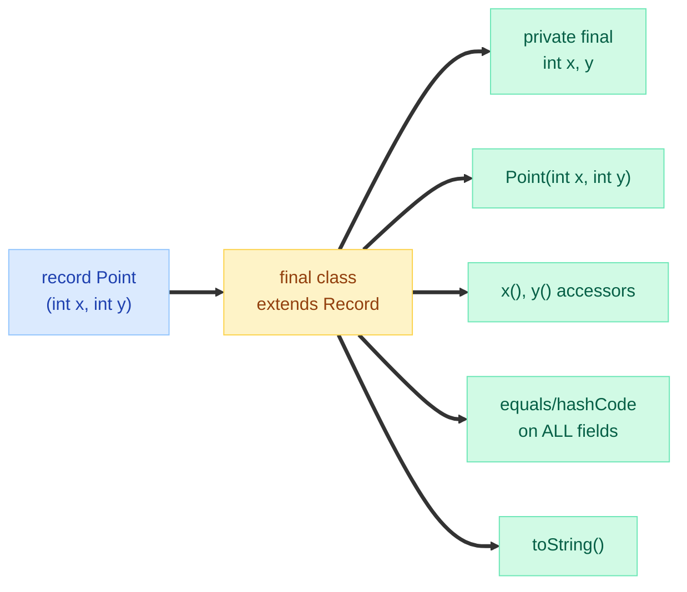
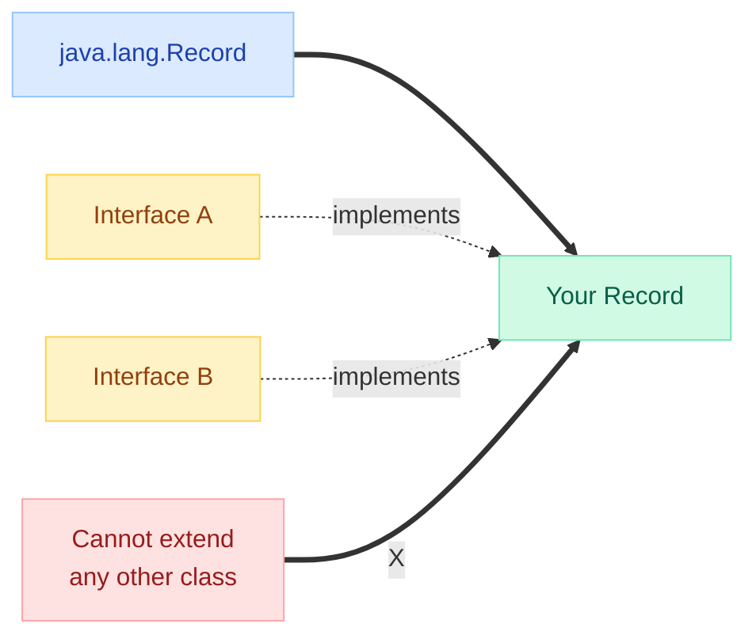
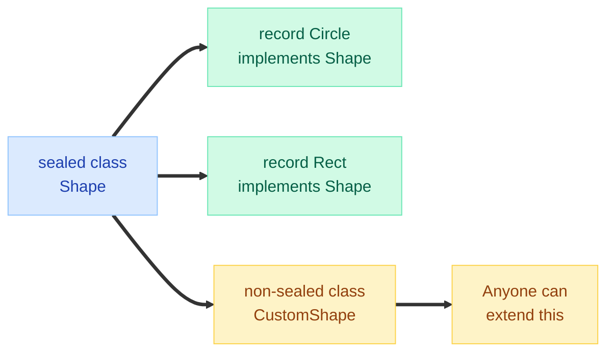
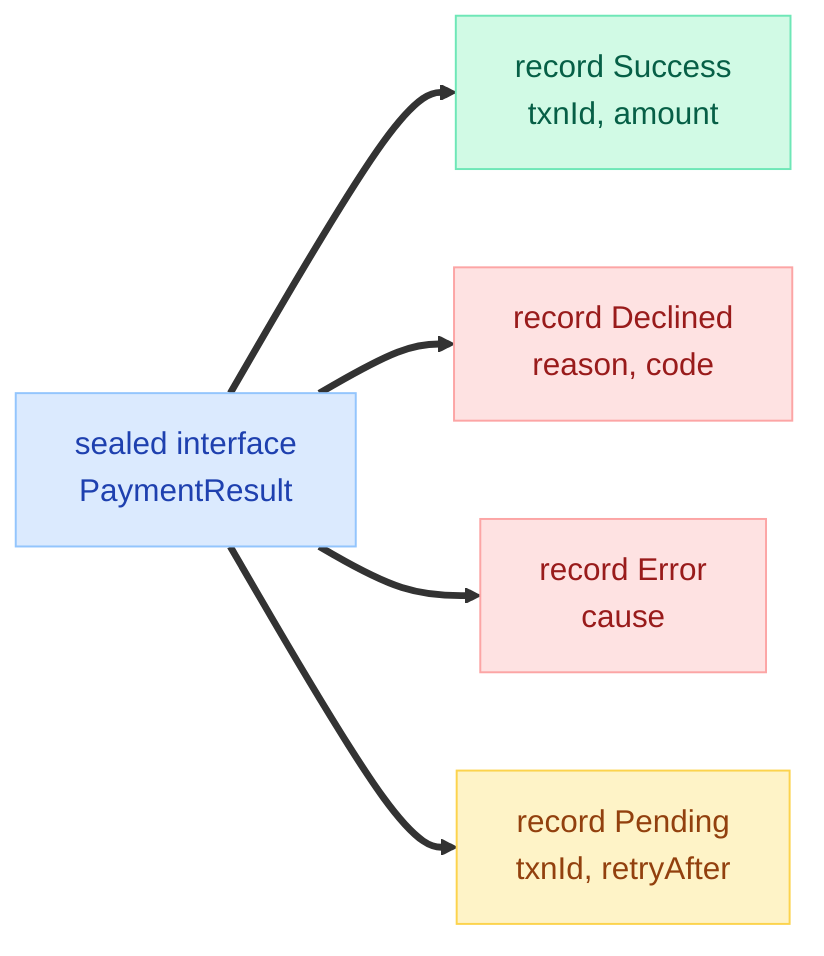
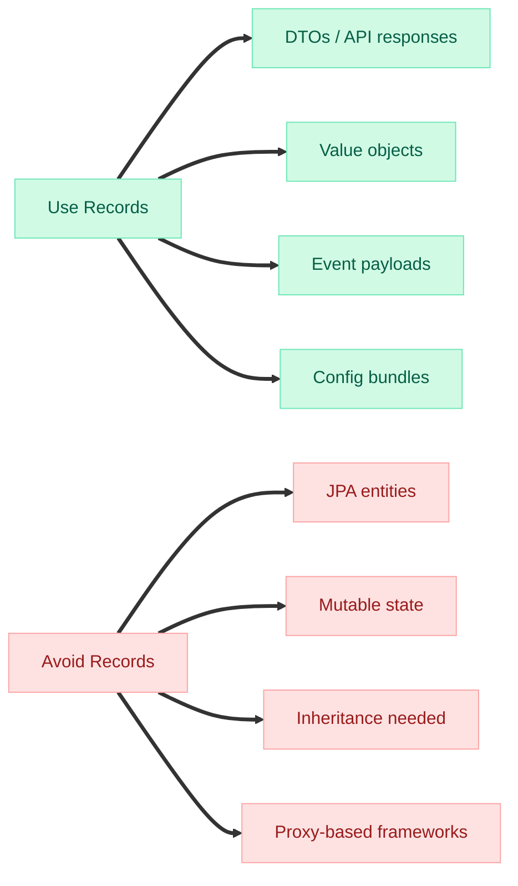
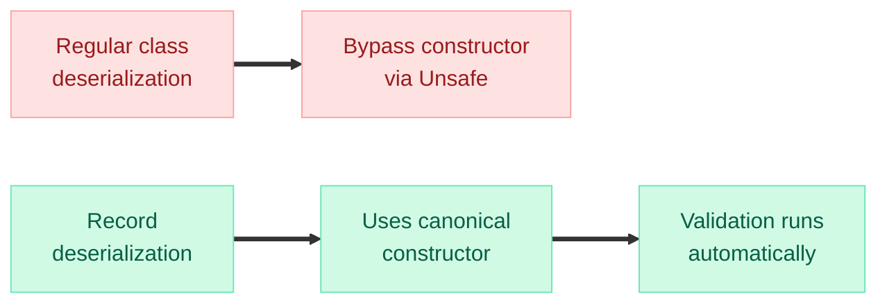
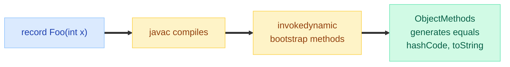

# Records & Sealed Classes

> **"Records and sealed classes together give Java what Kotlin has had for years — but with the JVM's full type safety at compile time." — Brian Goetz, Java Language Architect**

---

!!! danger "Real Incident: DTO Boilerplate Bug (2022)"
    A fintech team had 200+ POJO DTOs with hand-written `equals()`/`hashCode()`. A junior dev forgot to include the `currency` field in `equals()` for `TransactionDTO`. Two transactions with different currencies were treated as duplicates — **$4.2M in trades were silently deduplicated**. After migrating to Records, the compiler generates correct `equals()`/`hashCode()` from ALL components — this class of bug becomes impossible.

---

## Visual Overview — Records vs Traditional Classes

```mermaid
flowchart LR
    subgraph POJO["Traditional POJO"]
        direction TB
        P1["Private fields"]
        P2["Constructor"]
        P3["Getters"]
        P4["equals/hashCode"]
        P5["toString"]
        P6["~50 lines"]
    end

    subgraph RECORD["Java Record"]
        direction TB
        R1["Components"]
        R2["All generated"]
        R3["Immutable"]
        R4["1-3 lines"]
    end

    POJO ==>|"Replace with"| RECORD

    style P1 fill:#FEE2E2,stroke:#FCA5A5,color:#991B1B
    style P2 fill:#FEE2E2,stroke:#FCA5A5,color:#991B1B
    style P3 fill:#FEE2E2,stroke:#FCA5A5,color:#991B1B
    style P4 fill:#FEE2E2,stroke:#FCA5A5,color:#991B1B
    style P5 fill:#FEE2E2,stroke:#FCA5A5,color:#991B1B
    style P6 fill:#FEE2E2,stroke:#FCA5A5,color:#991B1B
    style R1 fill:#D1FAE5,stroke:#6EE7B7,color:#065F46
    style R2 fill:#D1FAE5,stroke:#6EE7B7,color:#065F46
    style R3 fill:#D1FAE5,stroke:#6EE7B7,color:#065F46
    style R4 fill:#D1FAE5,stroke:#6EE7B7,color:#065F46
```



---

## Record Syntax & What You Get for Free

```java
// One line — that's it
public record Point(int x, int y) {}
```

**The compiler generates:**

- `private final` fields for each component
- A canonical constructor `Point(int x, int y)`
- Accessor methods `x()` and `y()` (NOT `getX()`)
- `equals()` based on ALL components
- `hashCode()` based on ALL components
- `toString()` like `Point[x=3, y=7]`



---

## Compact Constructors & Validation

Records support a **compact constructor** — no parameter list, no explicit assignments:

```java
public record Email(String address) {
    // Compact constructor — validation only
    public Email {
        if (address == null || !address.contains("@")) {
            throw new IllegalArgumentException("Invalid email: " + address);
        }
        address = address.toLowerCase().strip(); // reassignment allowed here
    }
}
```

**Key rules:**

- No explicit `this.address = address` — the compiler adds it **after** your compact constructor body
- You CAN reassign the parameter (normalization) — the final field gets the modified value
- You CANNOT read `this.address` inside the compact constructor (not yet assigned)

```java
// Custom canonical constructor (full form)
public record Range(int lo, int hi) {
    public Range(int lo, int hi) {
        if (lo > hi) throw new IllegalArgumentException("lo > hi");
        this.lo = lo;   // explicit assignment required in full form
        this.hi = hi;
    }
}
```

!!! tip "Interview Gold"
    The compact constructor is syntactic sugar. It runs BEFORE field assignment. This makes Records perfect for **validated, normalized value objects** — no need for builder patterns or static factory methods for simple validation.

---

## Records vs Lombok vs POJOs

| Feature | POJO | Lombok `@Value` | Java Record |
|---|---|---|---|
| **Lines for 5-field DTO** | ~80 | ~5 | ~1 |
| **Immutability** | Manual | Automatic | **Built-in** |
| **equals/hashCode** | Manual/IDE-generated | Automatic | **Compiler-generated** |
| **Compile-time safety** | N/A | Annotation processor | **Language-level** |
| **Serialization** | Works | Works | Works (special support) |
| **Inheritance** | Full | No (final) | **No** (implicitly final) |
| **Mutable fields** | Yes | No | **No** |
| **Custom accessors** | getX()/isX() | getX()/isX() | **x()** (no get prefix) |
| **Builder pattern** | Manual | @Builder | **Not built-in** |
| **Deconstruction** | No | No | **Yes** (pattern matching) |
| **JPA/Hibernate** | Full support | Full support | **Limited** (no no-arg ctor) |
| **Dependency** | None | Lombok lib | **None** (JDK 14+) |
| **IDE support** | Always | Needs plugin | **Always** (language feature) |

!!! tip "Interview Gold"
    Records are NOT a Lombok replacement for everything. They are **transparent carriers of immutable data**. If you need builders, mutable state, or JPA entity semantics — Lombok or POJOs are still appropriate.

---

## Records with Generics

```java
public record Pair<A, B>(A first, B second) {}

public record ApiResponse<T>(T data, int statusCode, String message) {
    public boolean isSuccess() {
        return statusCode >= 200 && statusCode < 300;
    }
}

// Usage
var response = new ApiResponse<>(List.of("item1", "item2"), 200, "OK");
```

---

## Records Implementing Interfaces

```java
public interface Validatable {
    boolean isValid();
}

public record Temperature(double celsius) implements Validatable {
    public Temperature {
        if (celsius < -273.15) {
            throw new IllegalArgumentException("Below absolute zero");
        }
    }

    @Override
    public boolean isValid() {
        return celsius >= -273.15 && celsius <= 1_000_000;
    }
}
```

Records can implement **multiple interfaces** but cannot extend any class (they implicitly extend `java.lang.Record`).



---

## Sealed Classes — Controlling the Hierarchy



**Sealed classes** restrict which classes can extend them:

```java
public sealed interface Shape
    permits Circle, Rectangle, Triangle {}

public record Circle(double radius) implements Shape {}
public record Rectangle(double width, double height) implements Shape {}
public record Triangle(double a, double b, double c) implements Shape {}
```

**Three options for permitted subclasses:**

| Modifier | Meaning |
|---|---|
| `final` | No further extension |
| `sealed` | Further restricted subclasses |
| `non-sealed` | Open for extension (escape hatch) |

Records are implicitly `final`, so they satisfy the sealed requirement automatically.

---

## Sealed + Records = Algebraic Data Types

This is the real power — modeling domain types that the compiler can verify exhaustively:

```java
// Payment domain — all possible states
public sealed interface PaymentResult
    permits PaymentResult.Success, PaymentResult.Declined,
            PaymentResult.Error, PaymentResult.Pending {

    record Success(String txnId, BigDecimal amount) implements PaymentResult {}
    record Declined(String reason, String code) implements PaymentResult {}
    record Error(Exception cause) implements PaymentResult {}
    record Pending(String txnId, Instant retryAfter) implements PaymentResult {}
}
```



!!! tip "Interview Gold"
    This pattern replaces the "enum + switch with casting" anti-pattern AND the Visitor pattern. The compiler guarantees you handle all cases. Adding a new record to the sealed interface forces all switch expressions to update — **compile-time exhaustiveness checking**.

---

## Exhaustive Switch with Sealed Hierarchies

```java
public String describe(Shape shape) {
    return switch (shape) {
        case Circle c    -> "Circle with radius " + c.radius();
        case Rectangle r -> "Rect %sx%s".formatted(r.width(), r.height());
        case Triangle t  -> "Triangle with sides " + t.a() + "," + t.b() + "," + t.c();
        // No default needed — compiler knows all cases are covered!
    };
}
```

**Why this matters:**


Without sealed classes, a `default` branch silently swallows new subtypes. With sealed classes, the compiler **refuses to compile** until you handle the new case.

---

## Pattern Matching with Sealed Records (Java 21+)

```java
// Deconstruction patterns — extract components directly
public double area(Shape shape) {
    return switch (shape) {
        case Circle(var r)          -> Math.PI * r * r;
        case Rectangle(var w, var h) -> w * h;
        case Triangle(var a, var b, var c) -> {
            double s = (a + b + c) / 2;
            yield Math.sqrt(s * (s-a) * (s-b) * (s-c));
        }
    };
}
```

**Guarded patterns:**

```java
public String classify(Shape shape) {
    return switch (shape) {
        case Circle(var r) when r > 100   -> "Large circle";
        case Circle(var r) when r > 10    -> "Medium circle";
        case Circle(var r)                -> "Small circle";
        case Rectangle(var w, var h) when w == h -> "Square!";
        case Rectangle r                  -> "Rectangle";
        case Triangle t                   -> "Triangle";
    };
}
```

**Nested deconstruction:**

```java
record Point(int x, int y) {}
record Line(Point start, Point end) {}

// Deconstruct through nested records
static String describeLine(Line line) {
    return switch (line) {
        case Line(Point(var x1, var y1), Point(var x2, var y2))
            when x1 == x2 -> "Vertical line at x=" + x1;
        case Line(Point(var x1, var y1), Point(var x2, var y2))
            when y1 == y2 -> "Horizontal line at y=" + y1;
        case Line(Point(var x1, var y1), Point(var x2, var y2))
            -> "Diagonal from (%d,%d) to (%d,%d)".formatted(x1, y1, x2, y2);
    };
}
```

---

## When NOT to Use Records



| Scenario | Why Records Don't Work |
|---|---|
| **JPA Entities** | Need no-arg constructor, mutable setters, proxy subclassing |
| **Spring beans** | Often require mutability, CGLIB proxying |
| **Builder pattern** | Records are all-or-nothing construction |
| **Large field count (10+)** | Constructor becomes unwieldy — use Builder pattern |
| **Lazy initialization** | Fields are final — no deferred computation |
| **Identity-based objects** | Records use value-based equals, not reference identity |

!!! warning "JPA Trap"
    Hibernate requires: (1) no-arg constructor, (2) mutable fields via setters, (3) ability to create proxy subclasses. Records violate ALL THREE. Use records for **projections/DTOs returned from queries**, not for entities themselves.

---

## Real-World Examples

### DTOs & API Responses

```java
// Clean API response hierarchy
public sealed interface ApiResult<T>
    permits ApiResult.Ok, ApiResult.Err {

    record Ok<T>(T body, Map<String, String> headers) implements ApiResult<T> {}
    record Err<T>(int code, String message, List<String> details) implements ApiResult<T> {}
}

// Controller usage
public ApiResult<UserDTO> getUser(long id) {
    return userRepo.findById(id)
        .map(u -> new ApiResult.Ok<>(toDTO(u), Map.of()))
        .orElse(new ApiResult.Err<>(404, "Not found", List.of()));
}
```

### Domain Events

```java
public sealed interface OrderEvent
    permits OrderEvent.Created, OrderEvent.Shipped,
            OrderEvent.Delivered, OrderEvent.Cancelled {

    Instant occurredAt();  // shared method across all events

    record Created(String orderId, BigDecimal total, Instant occurredAt)
        implements OrderEvent {}
    record Shipped(String orderId, String trackingId, Instant occurredAt)
        implements OrderEvent {}
    record Delivered(String orderId, Instant occurredAt)
        implements OrderEvent {}
    record Cancelled(String orderId, String reason, Instant occurredAt)
        implements OrderEvent {}
}

// Event handler — exhaustive, compiler-verified
public void handle(OrderEvent event) {
    switch (event) {
        case OrderEvent.Created e   -> notifyWarehouse(e);
        case OrderEvent.Shipped e   -> notifyCustomer(e.trackingId());
        case OrderEvent.Delivered e -> updateInventory(e.orderId());
        case OrderEvent.Cancelled e -> processRefund(e.orderId(), e.reason());
    }
}
```

### Configuration Objects

```java
public record DatabaseConfig(
    String host,
    int port,
    String database,
    String username,
    Duration connectionTimeout,
    int maxPoolSize
) {
    public DatabaseConfig {
        if (port < 1 || port > 65535)
            throw new IllegalArgumentException("Invalid port: " + port);
        if (maxPoolSize < 1)
            throw new IllegalArgumentException("Pool size must be >= 1");
        if (connectionTimeout.isNegative())
            throw new IllegalArgumentException("Timeout must be positive");
    }

    public String jdbcUrl() {
        return "jdbc:postgresql://%s:%d/%s".formatted(host, port, database);
    }
}
```

---

## Records & Serialization

Records have **special serialization support** since Java 16:

```java
public record UserEvent(String userId, String action, Instant timestamp)
    implements Serializable {}
```

**Key differences from regular serialization:**

- Deserialization uses the **canonical constructor** (not reflection hacks)
- Compact constructor validation runs during deserialization
- No `readObject()`/`writeObject()` customization needed
- Immune to many classic serialization attacks



!!! tip "Interview Gold"
    Records are inherently safer for serialization because deserialization MUST go through the canonical constructor. This means your validation logic in compact constructors is NEVER bypassed — unlike regular classes where `ObjectInputStream` uses `Unsafe.allocateInstance()` to skip constructors entirely.

---

## Sealed Classes — Advanced Patterns

### Multi-Level Sealing

```java
public sealed interface Expr
    permits Expr.Literal, Expr.BinaryOp, Expr.UnaryOp {

    record Literal(double value) implements Expr {}

    sealed interface BinaryOp extends Expr
        permits BinaryOp.Add, BinaryOp.Sub, BinaryOp.Mul, BinaryOp.Div {
        Expr left();
        Expr right();

        record Add(Expr left, Expr right) implements BinaryOp {}
        record Sub(Expr left, Expr right) implements BinaryOp {}
        record Mul(Expr left, Expr right) implements BinaryOp {}
        record Div(Expr left, Expr right) implements BinaryOp {}
    }

    sealed interface UnaryOp extends Expr
        permits UnaryOp.Neg, UnaryOp.Abs {
        Expr operand();

        record Neg(Expr operand) implements UnaryOp {}
        record Abs(Expr operand) implements UnaryOp {}
    }
}
```

### Sealed + non-sealed Escape Hatch

```java
public sealed interface Notification
    permits Email, SMS, PushNotification, CustomNotification {

    record Email(String to, String subject, String body) implements Notification {}
    record SMS(String phone, String text) implements Notification {}
    record PushNotification(String deviceToken, String payload) implements Notification {}

    // Escape hatch — third parties can extend this
    non-sealed interface CustomNotification extends Notification {}
}

// Third-party code can now do:
public record SlackNotification(String channel, String msg)
    implements CustomNotification {}
```

---

## Records Under the Hood



- `equals()`/`hashCode()`/`toString()` use **`invokedynamic`** — not generated bytecode
- `ObjectMethods.bootstrap()` creates the implementation at first call
- Performance is comparable to hand-written code (JIT inlines it)
- You CAN override any of these methods if you need custom behavior

---

## Quick Recall

| Question | Answer |
|---|---|
| What JDK version for Records? | **14** (preview), **16** (final) |
| What JDK version for Sealed? | **15** (preview), **17** (final) |
| Can Records extend a class? | **No** — implicitly extend `java.lang.Record` |
| Can Records implement interfaces? | **Yes** — multiple interfaces |
| Are Record fields mutable? | **No** — always `private final` |
| Accessor naming convention? | `x()` not `getX()` |
| What does compact constructor skip? | Parameter list and field assignments |
| When does compact constructor run? | **Before** field assignment |
| Can you add methods to Records? | **Yes** — instance and static methods |
| Can Records have additional fields? | **No** — only component fields |
| How does Record equals work? | Compares ALL components via their `equals()` |
| Three modifiers for sealed subtypes? | `final`, `sealed`, `non-sealed` |
| What guarantees exhaustive switch? | Sealed type — compiler knows all subtypes |
| What happens if you add a new subtype? | **Compiler error** in all non-exhaustive switches |
| Records + JPA entities? | **Don't** — use for DTOs/projections only |
| Record serialization advantage? | Deserialization uses canonical constructor (safe) |
| Pattern deconstruction syntax? | `case Circle(var r) -> ...` |
| Guarded pattern syntax? | `case Circle(var r) when r > 10 -> ...` |
| Record + sealed = ? | **Algebraic Data Type** (sum type) |
| Why no Lombok needed for DTOs? | Records provide same features at language level |

---

## Interview Answer Template

!!! abstract "How to answer 'Explain Java Records and when to use them'"

    **Step 1 — What they are:** "Records are immutable data carriers introduced in Java 16. You declare components, and the compiler generates the constructor, accessors, equals, hashCode, and toString."

    **Step 2 — Compact constructor:** "Validation happens in a compact constructor — no parameter list, no explicit field assignment. The compiler assigns fields after your validation/normalization code runs."

    **Step 3 — Restrictions:** "Records are implicitly final, cannot extend classes (only implement interfaces), and all fields are private final. They're transparent — their API IS their state."

    **Step 4 — When to use:** "DTOs, API responses, event payloads, value objects, configuration bundles — anywhere you need an immutable data carrier with correct equals/hashCode."

    **Step 5 — When NOT to use:** "JPA entities (need no-arg ctor + mutability), Spring beans needing proxying, objects requiring identity semantics, or anything with mutable state."

!!! abstract "How to answer 'Explain Sealed Classes and pattern matching'"

    **Step 1 — Problem:** "Before sealed classes, you couldn't restrict who extends your class. Abstract classes and interfaces were either open to everyone or package-private. You had no exhaustiveness checking in switch."

    **Step 2 — Solution:** "Sealed classes/interfaces declare a fixed set of permitted subtypes with `permits`. Subtypes must be `final`, `sealed`, or `non-sealed`."

    **Step 3 — Pattern matching:** "Combined with switch expressions (Java 21), the compiler guarantees exhaustive handling. No default branch needed — if you add a new subtype, all switches fail to compile until updated."

    **Step 4 — Algebraic data types:** "Sealed interfaces with record implementations give Java true sum types — like Rust enums or Kotlin sealed classes. Each variant carries its own typed data."

    **Step 5 — Real impact:** "This eliminates the Visitor pattern, instanceof chains, and enum-with-data hacks. The compiler enforces completeness, catching missing cases at compile time instead of runtime."
