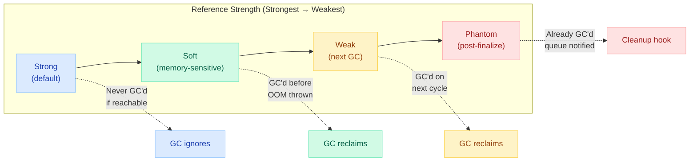
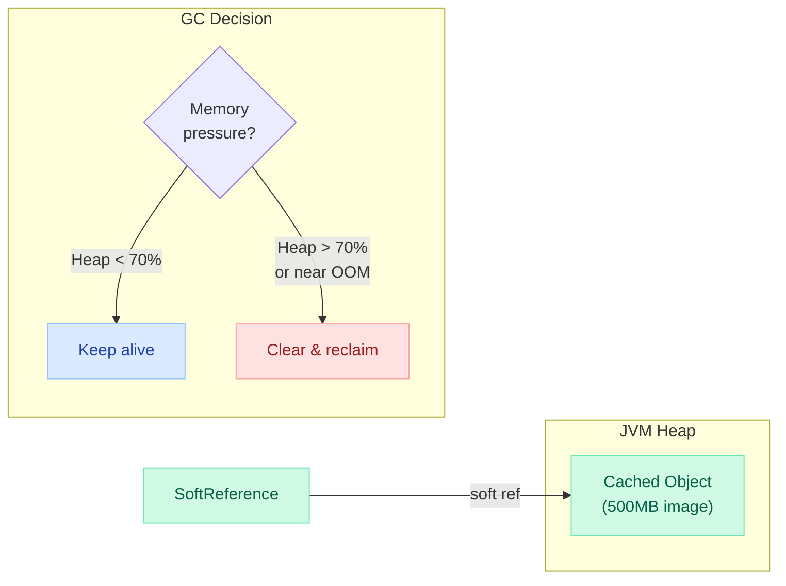
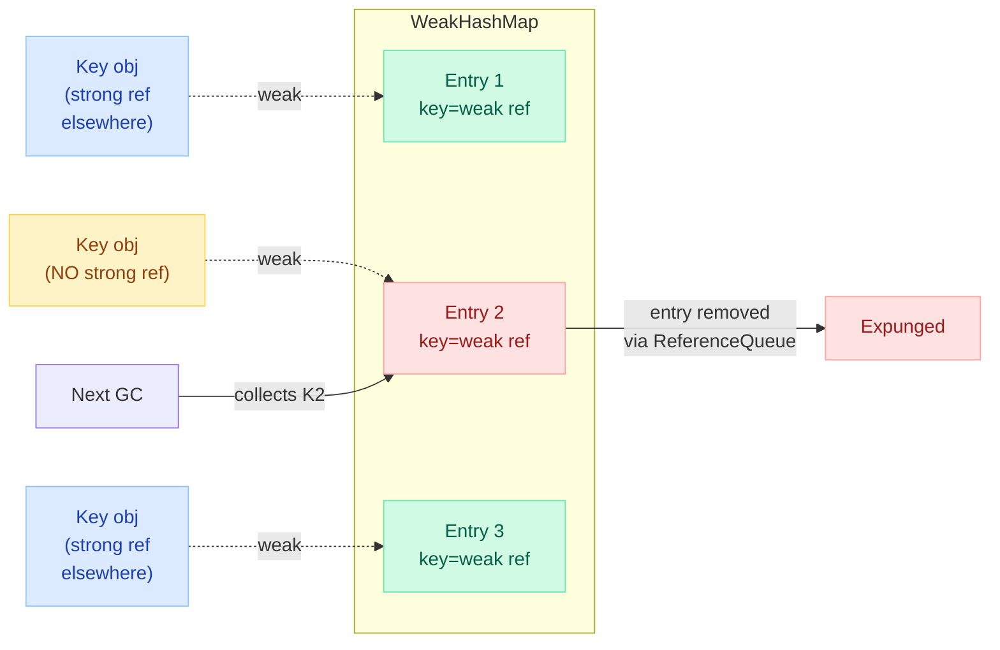
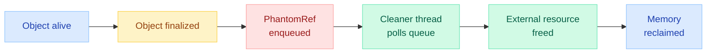
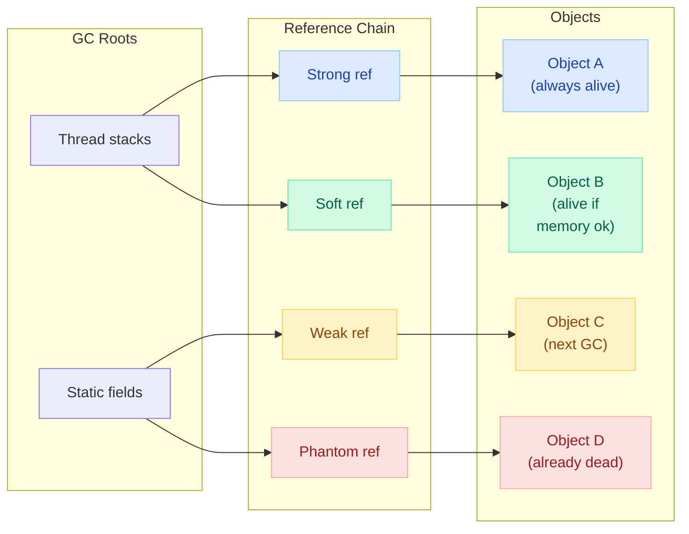

# Java Reference Types (Strong, Soft, Weak, Phantom)

> **Understanding reference types is the difference between an app that gracefully handles memory pressure and one that OOMs in production at 3 AM.**

---

!!! danger "Real Incident: ClassLoader Leak, 2018"
    A production Tomcat server redeploys an application 4 times in a week. Each redeployment leaks **200MB** because old ClassLoaders are held by strong references in a static cache. After the 4th deploy: `OutOfMemoryError: Metaspace`. Root cause: a `static HashMap<Class<?>, Object>` that was never cleared. Fix: replace with `WeakHashMap<Class<?>, Object>` — old ClassLoaders get GC'd on redeploy.

---

## The 30-Second Explanation

Java's GC doesn't just ask "is this object reachable?" — it asks **"HOW is it reachable?"** The reference type determines the object's survival priority under memory pressure.



---

## Strong References (Default)

Every normal variable you create is a strong reference. As long as a strong reference chain exists from a GC root to the object, it will **never** be garbage collected.

```java
// ✅ Strong reference — object lives as long as 'user' is reachable
User user = new User("Alice");

// ❌ Memory leak — list grows forever, strong refs prevent GC
public class EventBus {
    private static final List<EventListener> listeners = new ArrayList<>();
    
    public void register(EventListener listener) {
        listeners.add(listener);  // strong ref — never GC'd even if caller is done
    }
    // Forgot unregister()? Leak!
}
```

**When is it collected?** Never, while reachable from a GC root.

**GC Roots include:**

- Local variables on thread stacks
- Static fields
- Active threads
- JNI references

---

## SoftReference — Memory-Sensitive Caches

A soft reference says: "Keep this object **as long as memory allows**, but reclaim it before throwing OOM."

```java
import java.lang.ref.SoftReference;

// Memory-sensitive image cache
public class ImageCache {
    private final Map<String, SoftReference<BufferedImage>> cache = new HashMap<>();

    public BufferedImage get(String path) {
        SoftReference<BufferedImage> ref = cache.get(path);
        if (ref != null) {
            BufferedImage img = ref.get();  // may return null if GC'd
            if (img != null) return img;
        }
        // Cache miss or GC'd — reload
        BufferedImage img = loadFromDisk(path);
        cache.put(path, new SoftReference<>(img));
        return img;
    }
}
```

### SoftReference GC Behavior



!!! tip "JVM Flag"
    `-XX:SoftRefLRUPolicyMSPerMB=1000` controls how aggressively soft refs are cleared. Value = milliseconds of idle time per MB of free heap before GC reclaims. Lower value = more aggressive.

### When to Use SoftReference

| Good Use Case | Why |
|---|---|
| Image/resource caches | Auto-evicts under memory pressure |
| Parsed config objects | Expensive to recreate, ok to reload |
| Database metadata cache | Soft degradation under load |

---

## WeakReference — Ephemeral Associations

A weak reference says: "I'm interested in this object **only if someone else is keeping it alive**." The GC collects weakly-reachable objects on the **next collection cycle**, regardless of memory pressure.

```java
import java.lang.ref.WeakReference;

// Canonical use: associate metadata with objects you don't own
public class ThreadLocalTooltip {
    private final WeakReference<JComponent> componentRef;
    
    public ThreadLocalTooltip(JComponent component) {
        this.componentRef = new WeakReference<>(component);
    }
    
    public void showTooltip() {
        JComponent comp = componentRef.get();
        if (comp == null) return;  // component was GC'd, nothing to do
        // ... show tooltip
    }
}
```

### WeakHashMap Internals

`WeakHashMap<K, V>` uses **weak references for keys**. When a key becomes weakly reachable (no strong refs), the entry is automatically removed.



```java
// WeakHashMap in action — ClassLoader leak prevention
WeakHashMap<ClassLoader, Map<String, Class<?>>> classCache = new WeakHashMap<>();

// When a ClassLoader is unloaded (no strong refs), 
// its entire cache entry is automatically GC'd
```

!!! warning "WeakHashMap Gotcha"
    String literals and boxed integers from the constant pool are **never** GC'd (they're held by strong refs in the JVM). Using them as keys in WeakHashMap means entries are never removed!
    ```java
    WeakHashMap<String, Object> map = new WeakHashMap<>();
    map.put("literal", value);      // ❌ NEVER removed — string pool holds strong ref
    map.put(new String("key"), v);  // ✅ Will be removed when no other refs exist
    ```

### WeakHashMap Use Cases

| Use Case | Pattern |
|---|---|
| **Listener registry** | Key = listener, value = metadata. Listener GC'd → entry removed |
| **ClassLoader caches** | Key = ClassLoader, value = loaded classes. Prevents leak on redeploy |
| **Thread-local cleanup** | Key = Thread, value = thread-local data |
| **Canonicalization maps** | Deduplicate objects without preventing GC |

---

## PhantomReference — Post-Mortem Cleanup

A phantom reference says: "Notify me **after** the object is finalized and about to be reclaimed, so I can do external cleanup." You can **never** retrieve the referent — `get()` always returns `null`.

```java
import java.lang.ref.PhantomReference;
import java.lang.ref.ReferenceQueue;

public class NativeMemoryCleaner {
    private static final ReferenceQueue<NativeBuffer> queue = new ReferenceQueue<>();
    private static final Set<CleanupRef> refs = new HashSet<>();  // prevent phantom refs from being GC'd
    
    static class CleanupRef extends PhantomReference<NativeBuffer> {
        private final long nativePointer;  // store cleanup info OUTSIDE the referent
        
        CleanupRef(NativeBuffer buf, ReferenceQueue<NativeBuffer> q) {
            super(buf, q);
            this.nativePointer = buf.getPointer();
        }
        
        void cleanup() {
            freeNativeMemory(nativePointer);  // release off-heap memory
        }
    }
    
    // Background thread polls the queue
    static {
        Thread cleanerThread = new Thread(() -> {
            while (true) {
                try {
                    CleanupRef ref = (CleanupRef) queue.remove();  // blocks
                    ref.cleanup();
                    refs.remove(ref);
                } catch (InterruptedException e) { break; }
            }
        });
        cleanerThread.setDaemon(true);
        cleanerThread.start();
    }
    
    public static NativeBuffer allocate(int size) {
        NativeBuffer buf = new NativeBuffer(size);
        refs.add(new CleanupRef(buf, queue));
        return buf;
    }
}
```

### PhantomReference Lifecycle



---

## Finalization vs PhantomReference vs Cleaner (Java 9+)

| Approach | Era | Problems | Recommendation |
|---|---|---|---|
| `finalize()` | Java 1.0 | Unpredictable timing, resurrects objects, slows GC, deprecated (Java 9), removed for removal (Java 18) | **Never use** |
| `PhantomReference` + `ReferenceQueue` | Java 2 | Manual queue polling, boilerplate | Use for libraries/frameworks |
| `java.lang.ref.Cleaner` | Java 9+ | None — wraps PhantomReference elegantly | **Preferred approach** |

### Cleaner (Java 9+) — The Modern Way

```java
import java.lang.ref.Cleaner;

public class NativeBuffer implements AutoCloseable {
    private static final Cleaner CLEANER = Cleaner.create();
    
    // Cleaning action — MUST NOT reference the NativeBuffer instance!
    private static class DeallocAction implements Runnable {
        private long pointer;
        DeallocAction(long pointer) { this.pointer = pointer; }
        
        @Override
        public void run() {
            if (pointer != 0) {
                freeNativeMemory(pointer);
                pointer = 0;
            }
        }
    }
    
    private long pointer;
    private final Cleaner.Cleanable cleanable;
    
    public NativeBuffer(int size) {
        this.pointer = allocateNativeMemory(size);
        this.cleanable = CLEANER.register(this, new DeallocAction(pointer));
    }
    
    @Override
    public void close() {
        cleanable.clean();  // explicit cleanup (idempotent)
    }
    // If close() not called → Cleaner handles it when object is phantom-reachable
}
```

!!! warning "Critical Rule"
    The cleaning action (Runnable) must **NEVER** hold a reference to the object being cleaned. If it does, the object becomes strongly reachable from the cleaner, creating a memory leak. Always use a static inner class or lambda that captures only the resource handle.

---

## How GC Interacts With Each Reference Type



### GC Collection Order

1. **Mark Phase**: GC traces from roots through strong → soft → weak → phantom refs
2. **Strong**: Always survives (if reachable)
3. **Soft**: Cleared only if GC decides memory is low (LRU-based)
4. **Weak**: Cleared on every GC cycle (regardless of memory)
5. **Phantom**: Object already finalized; phantom ref enqueued for notification only

---

## Memory Leak Prevention Patterns

### Pattern 1: Listener Deregistration with WeakReference

```java
// ❌ Leak: listeners hold strong refs to subscribers
public class EventBus {
    private final List<EventListener> listeners = new ArrayList<>();
    public void subscribe(EventListener l) { listeners.add(l); }
}

// ✅ Fixed: weak refs allow subscriber GC
public class EventBus {
    private final List<WeakReference<EventListener>> listeners = new CopyOnWriteArrayList<>();
    
    public void subscribe(EventListener l) {
        listeners.add(new WeakReference<>(l));
    }
    
    public void publish(Event e) {
        listeners.removeIf(ref -> {
            EventListener l = ref.get();
            if (l == null) return true;  // GC'd, remove entry
            l.onEvent(e);
            return false;
        });
    }
}
```

### Pattern 2: ThreadLocal Cleanup

```java
// ❌ Leak: ThreadLocal value holds ref to ClassLoader
private static final ThreadLocal<HeavyObject> TL = ThreadLocal.withInitial(HeavyObject::new);

// ✅ Fixed: explicit removal in finally block
try {
    TL.set(new HeavyObject());
    // ... use it
} finally {
    TL.remove();  // ALWAYS remove in servlet/thread-pool environments
}
```

### Pattern 3: Static Collection Bounded by Weak Keys

```java
// ❌ Leak: unbounded static map
private static final Map<Session, UserData> sessionData = new HashMap<>();

// ✅ Fixed: entries auto-removed when Session is GC'd
private static final Map<Session, UserData> sessionData = 
    Collections.synchronizedMap(new WeakHashMap<>());
```

---

## Real-World Examples

### Guava Cache (Soft/Weak References)

```java
import com.google.common.cache.CacheBuilder;
import com.google.common.cache.Cache;

// Soft values — GC'd under memory pressure
Cache<String, DatabaseResult> softCache = CacheBuilder.newBuilder()
    .maximumSize(10_000)
    .softValues()       // values held by SoftReference
    .build();

// Weak keys — entries removed when key has no strong refs
Cache<Connection, Metadata> weakCache = CacheBuilder.newBuilder()
    .weakKeys()         // keys held by WeakReference
    .build();

// Weak values — entries removed when value has no strong refs
Cache<String, Widget> widgetCache = CacheBuilder.newBuilder()
    .weakValues()       // values held by WeakReference
    .build();
```

!!! tip "Guava vs Caffeine"
    Modern projects should prefer **Caffeine** over Guava Cache. Caffeine uses size-based eviction (W-TinyLFU) which outperforms soft/weak reference caching in most scenarios — no GC pauses from clearing references.

### Hibernate Session Cache (Soft References)

```java
// Hibernate's 2nd-level cache can use soft references for entities
// ehcache.xml
<cache name="com.example.User"
       maxEntriesLocalHeap="10000"
       memoryStoreEvictionPolicy="LRU"
       overflowToDisk="false"
       eternal="false"
       timeToLiveSeconds="300"/>

// Under memory pressure, soft-referenced cached entities are evicted
// before OOM — app gracefully degrades (cache miss → DB query)
```

### ClassLoader Leak Prevention

```java
// Problem: framework caches Class objects with strong refs
// On redeploy, old ClassLoader can't be GC'd

// ❌ Causes ClassLoader leak
static Map<String, Class<?>> classCache = new HashMap<>();

// ✅ WeakReference to Class allows ClassLoader GC
static Map<String, WeakReference<Class<?>>> classCache = new ConcurrentHashMap<>();

// ✅ Better: WeakHashMap keyed by ClassLoader
static WeakHashMap<ClassLoader, Map<String, Class<?>>> perLoaderCache = new WeakHashMap<>();
```

---

## Comparison Table

| Property | Strong | Soft | Weak | Phantom |
|---|---|---|---|---|
| **Class** | (default) | `SoftReference<T>` | `WeakReference<T>` | `PhantomReference<T>` |
| **Collected when** | Never (while reachable) | Before OOM | Next GC cycle | After finalization |
| **`get()` returns** | Object | Object or null | Object or null | **Always null** |
| **Requires ReferenceQueue** | No | Optional | Optional | **Yes (mandatory)** |
| **Typical use** | Normal variables | Caches (memory-sensitive) | Associations, canonicalization | External resource cleanup |
| **Survives minor GC** | Yes | Usually | No | N/A |
| **Survives major GC** | Yes | Maybe (depends on memory) | No | N/A |
| **Real-world example** | All normal code | Guava softValues() | WeakHashMap, ThreadLocal | DirectByteBuffer cleanup, Cleaner |

---

## ReferenceQueue — The Notification Mechanism

```java
ReferenceQueue<MyObject> queue = new ReferenceQueue<>();
WeakReference<MyObject> weakRef = new WeakReference<>(new MyObject(), queue);

// After GC collects the object:
Reference<? extends MyObject> ref = queue.poll();  // non-blocking
// or
Reference<? extends MyObject> ref = queue.remove(); // blocking

if (ref != null) {
    // Object was collected — do cleanup
    System.out.println("Object was garbage collected");
}
```

**How the JDK uses ReferenceQueue internally:**

- `WeakHashMap`: expunges stale entries by polling its internal queue
- `ThreadLocal`: cleans up entries for dead threads via weak keys
- `Cleaner`: polls a queue on a daemon thread for phantom refs

---

## Common Interview Questions

!!! tip "Interview Questions"

    **Q: What are the four types of references in Java?**
    Strong (default), Soft (cleared before OOM), Weak (cleared on next GC), Phantom (notification after finalization, get() always null).

    **Q: When would you use SoftReference vs WeakReference?**
    SoftReference for caches where you want data to survive as long as memory allows. WeakReference when you don't want your reference to prevent GC at all (e.g., canonical maps, listener registries).

    **Q: How does WeakHashMap work? What's the gotcha?**
    Keys are held via WeakReferences. When a key loses all strong refs, the entry is expunged. Gotcha: String literals and small Integer/Long constants are interned and never GC'd — entries with these keys persist forever.

    **Q: Why was finalize() deprecated? What replaced it?**
    finalize() is unpredictable (may never run), causes objects to survive an extra GC cycle (resurrection risk), and serializes GC. Replaced by `Cleaner` (Java 9+) which uses PhantomReference + ReferenceQueue internally.

    **Q: Can you access the referent of a PhantomReference?**
    No. `get()` always returns null. You can only be *notified* via the ReferenceQueue that the object was collected. This prevents resurrection — the key design difference from finalize().

    **Q: How would you prevent a ClassLoader leak?**
    1. Use `WeakHashMap<ClassLoader, ...>` for class caches. 2. Avoid storing Class/ClassLoader refs in static fields. 3. Deregister JDBC drivers in `contextDestroyed()`. 4. Clear ThreadLocals in servlet filters.

    **Q: What's the difference between Cleaner and PhantomReference?**
    Cleaner wraps PhantomReference with a managed daemon thread that polls the queue for you. Less boilerplate, same mechanism. Cleaner is the standard API since Java 9.

---

## Quick Recall

| Reference Type | Mnemonic | Collected | Use Case |
|---|---|---|---|
| **Strong** | "Concrete pillar" | Never (if reachable) | Default — all normal variables |
| **Soft** | "Memory cushion" | Before OOM | Caches that auto-shrink |
| **Weak** | "Sticky note" | Next GC, always | WeakHashMap, listeners, canonicalization |
| **Phantom** | "Death certificate" | Already dead | Native cleanup, resource deallocation |

---

!!! abstract "Key Takeaways"
    1. **Strong** = default. If you hold it, GC can't touch it.
    2. **Soft** = "keep if you can." Perfect for caches. Cleared LRU-style before OOM.
    3. **Weak** = "I don't own this." Cleared immediately on next GC. Powers WeakHashMap.
    4. **Phantom** = "tell me when it's dead." get() returns null. For external cleanup only.
    5. **Modern cleanup** = use `Cleaner` (Java 9+). Never override `finalize()`.
    6. **Memory leaks** = almost always caused by unintended strong references in static collections, listeners, or ThreadLocals.
