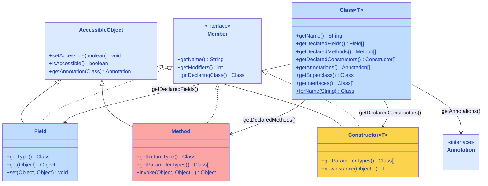
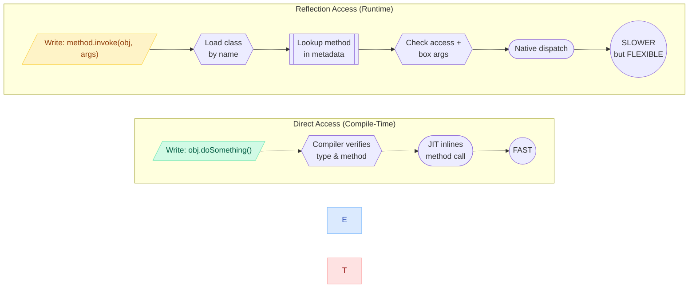
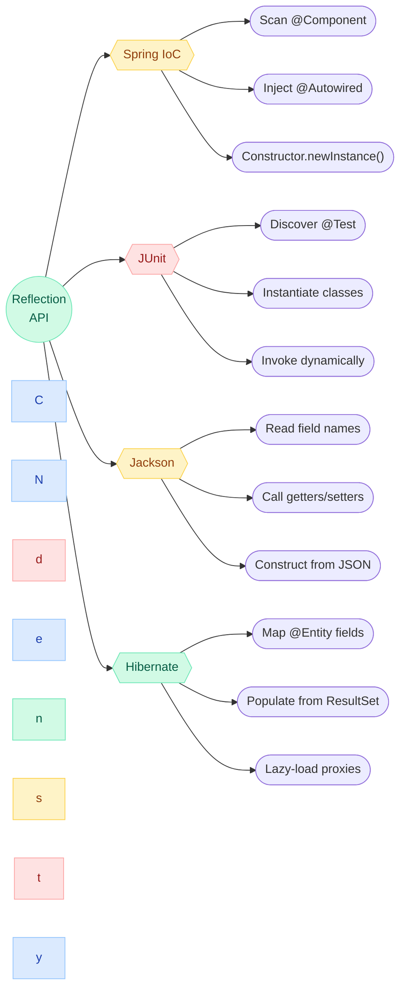

# Reflection in Java

Reflection allows you to **inspect and manipulate classes, methods, fields, and constructors at runtime**. It's the engine behind Spring's dependency injection, JPA's entity mapping, and JUnit's test discovery.

---

## Reflection API Class Hierarchy



---

## Reflection Call Flow

```mermaid
sequenceDiagram
    participant App as Application
    participant CL as ClassLoader
    participant Cls as Class&lt;MyClass&gt;
    participant M as Method
    participant Inst as Instance

    rect rgb(230, 245, 255)
        Note over App,Inst: Runtime Resolution (No Compile-Time Binding)
        App->>CL: Class.forName("com.example.MyClass")
        CL->>CL: Search classpath & load bytecode
        CL-->>App: Returns Class&lt;?&gt; object
    end

    rect rgb(255, 240, 230)
        Note over App,M: Method Discovery
        App->>Cls: getMethod("doSomething", String.class)
        Cls->>Cls: Search method table by name + params
        Cls-->>App: Returns Method object
    end

    rect rgb(230, 255, 230)
        Note over App,Inst: Dynamic Invocation
        App->>M: method.invoke(instance, "hello")
        M->>M: Access check + arg validation
        M->>Inst: Reflective dispatch to doSomething("hello")
        Inst-->>M: Return value
        M-->>App: Result (as Object)
    end
```

---

## Normal vs Reflection Access



---

## Where Reflection is Used



---

## What Reflection Can Do

| Capability | Example |
|---|---|
| Inspect class metadata | Get class name, superclass, interfaces, annotations |
| Access private fields | Read/write private fields without a getter/setter |
| Invoke methods dynamically | Call methods by name at runtime |
| Create instances | Instantiate objects without `new` keyword |
| Examine annotations | Read `@Service`, `@Transactional`, custom annotations |

---

## Getting a Class Object

Everything in reflection starts with a `Class<?>` object.

```java
// Three ways to get a Class object
Class<?> c1 = String.class;                         // from type
Class<?> c2 = "Hello".getClass();                    // from instance
Class<?> c3 = Class.forName("java.lang.String");     // from fully qualified name
```

---

## Inspecting a Class

```java
Class<?> clazz = Employee.class;

// Basic info
clazz.getName();           // "com.example.Employee"
clazz.getSimpleName();     // "Employee"
clazz.getSuperclass();     // class java.lang.Object
clazz.getInterfaces();     // [Serializable, Comparable]
clazz.getModifiers();      // Modifier.isPublic(), isFinal(), etc.

// Fields
Field[] fields = clazz.getDeclaredFields();       // all fields (including private)
Field[] publicFields = clazz.getFields();          // only public fields

// Methods
Method[] methods = clazz.getDeclaredMethods();     // all methods
Method[] publicMethods = clazz.getMethods();       // public + inherited

// Constructors
Constructor<?>[] constructors = clazz.getDeclaredConstructors();

// Annotations
Annotation[] annotations = clazz.getAnnotations();
boolean isEntity = clazz.isAnnotationPresent(Entity.class);
```

---

## Accessing Private Fields

```java
public class User {
    private String password = "secret123";
}

User user = new User();
Field field = User.class.getDeclaredField("password");
field.setAccessible(true);  // bypass private access check

String password = (String) field.get(user);  // "secret123"
field.set(user, "newPassword");              // modifies private field
```

---

## Invoking Methods Dynamically

```java
public class Calculator {
    public int add(int a, int b) { return a + b; }
    private int multiply(int a, int b) { return a * b; }
}

Calculator calc = new Calculator();

// Invoke public method
Method addMethod = Calculator.class.getMethod("add", int.class, int.class);
int result = (int) addMethod.invoke(calc, 10, 20);  // 30

// Invoke private method
Method multiplyMethod = Calculator.class.getDeclaredMethod("multiply", int.class, int.class);
multiplyMethod.setAccessible(true);
int product = (int) multiplyMethod.invoke(calc, 5, 6);  // 30
```

---

## Creating Instances Dynamically

```java
// Using no-arg constructor
Class<?> clazz = Class.forName("com.example.Employee");
Object obj = clazz.getDeclaredConstructor().newInstance();

// Using parameterized constructor
Constructor<?> constructor = clazz.getDeclaredConstructor(String.class, int.class);
Object emp = constructor.newInstance("Vamsi", 27);
```

---

## How Frameworks Use Reflection

### Spring — Dependency Injection

```java
// When Spring sees @Autowired, it uses reflection to:
// 1. Find the field type
// 2. Look up a matching bean in the container
// 3. Set the field value using field.setAccessible(true) + field.set()

@Service
public class OrderService {
    @Autowired
    private OrderRepository repository;  // Spring injects via reflection
}
```

### JPA / Hibernate — Entity Mapping

```java
// Hibernate uses reflection to:
// 1. Read @Entity, @Table, @Column annotations
// 2. Map fields to database columns
// 3. Create instances and populate fields from query results

@Entity
@Table(name = "employees")
public class Employee {
    @Id
    private Long id;

    @Column(name = "full_name")
    private String name;  // Hibernate reads/writes via reflection
}
```

### JUnit — Test Discovery

```java
// JUnit uses reflection to:
// 1. Scan classes for methods annotated with @Test
// 2. Create test class instances
// 3. Invoke test methods

public class CalculatorTest {
    @Test  // JUnit finds this via reflection
    void testAdd() {
        assertEquals(4, calculator.add(2, 2));
    }
}
```

### Jackson — JSON Serialization

```java
// Jackson uses reflection to:
// 1. Inspect fields and getters
// 2. Map JSON keys to Java fields
// 3. Create instances and set values

ObjectMapper mapper = new ObjectMapper();
String json = mapper.writeValueAsString(employee);  // reflection reads fields
Employee emp = mapper.readValue(json, Employee.class);  // reflection sets fields
```

---

## Performance Considerations

| Operation | Relative speed |
|---|---|
| Direct method call | 1x (baseline) |
| Reflection method call | ~5-50x slower |
| Reflection with `setAccessible(true)` cached | ~2-5x slower |

Reflection is slow because it bypasses compile-time optimizations (inlining, JIT). But frameworks mitigate this:

- **Caching**: Spring caches reflection metadata at startup
- **Code generation**: Hibernate generates bytecode instead of using reflection at runtime
- **MethodHandles** (Java 7+): Faster alternative to reflection for repeated calls

---

## Reflection vs MethodHandles

| Feature | Reflection | MethodHandles (Java 7+) |
|---|---|---|
| Speed | Slower | Near-direct-call speed |
| Access checks | Every invocation (unless cached) | Once at creation |
| JIT optimization | Limited | Can be inlined by JIT |
| Use case | Framework internals, tools | Performance-critical dynamic dispatch |

---

## Interview Questions

??? question "1. How does Spring use reflection for dependency injection?"
    Spring scans classes for annotations like `@Autowired`, `@Service`, `@Component`. For each, it: (1) uses `Class.getDeclaredFields()` to find injection points, (2) resolves the matching bean from the application context, (3) calls `field.setAccessible(true)` to bypass private access, (4) calls `field.set(bean, dependency)` to inject the value. This all happens at startup; at runtime, beans are pre-wired.

??? question "2. Can reflection break Singleton?"
    **Yes.** You can use `constructor.setAccessible(true)` to access a private constructor and create a new instance, bypassing the Singleton pattern. This is why **enum Singleton** is preferred — the JVM prevents reflective instantiation of enum types.

??? question "3. Why is reflection slow?"
    Reflection bypasses compile-time type checks and JIT optimizations. Each reflective call involves: (1) security/access checks, (2) method resolution by name (not direct pointer), (3) boxing/unboxing of arguments, (4) inability for JIT to inline. Caching `Method`/`Field` objects and calling `setAccessible(true)` reduces overhead significantly.

??? question "4. What is the difference between `getFields()` and `getDeclaredFields()`?"
    `getFields()` returns only **public** fields, including inherited ones. `getDeclaredFields()` returns **all fields** (private, protected, default, public) declared in **that specific class** (not inherited). To access all fields including inherited private ones, you need to walk up the class hierarchy with `getSuperclass()`.
