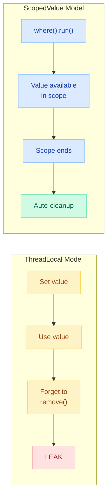
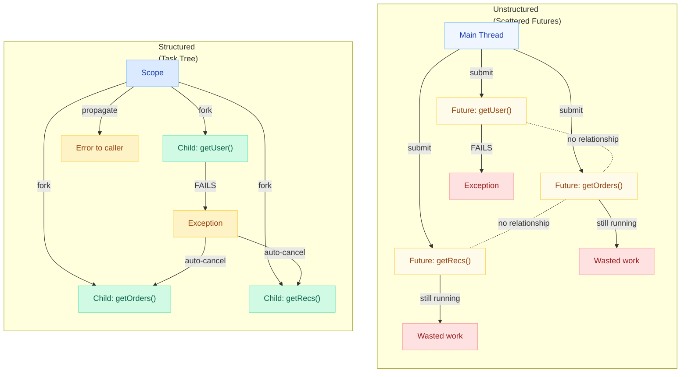
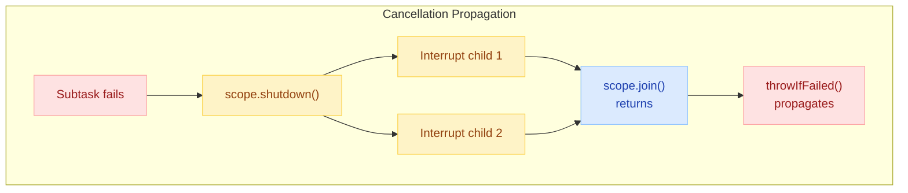
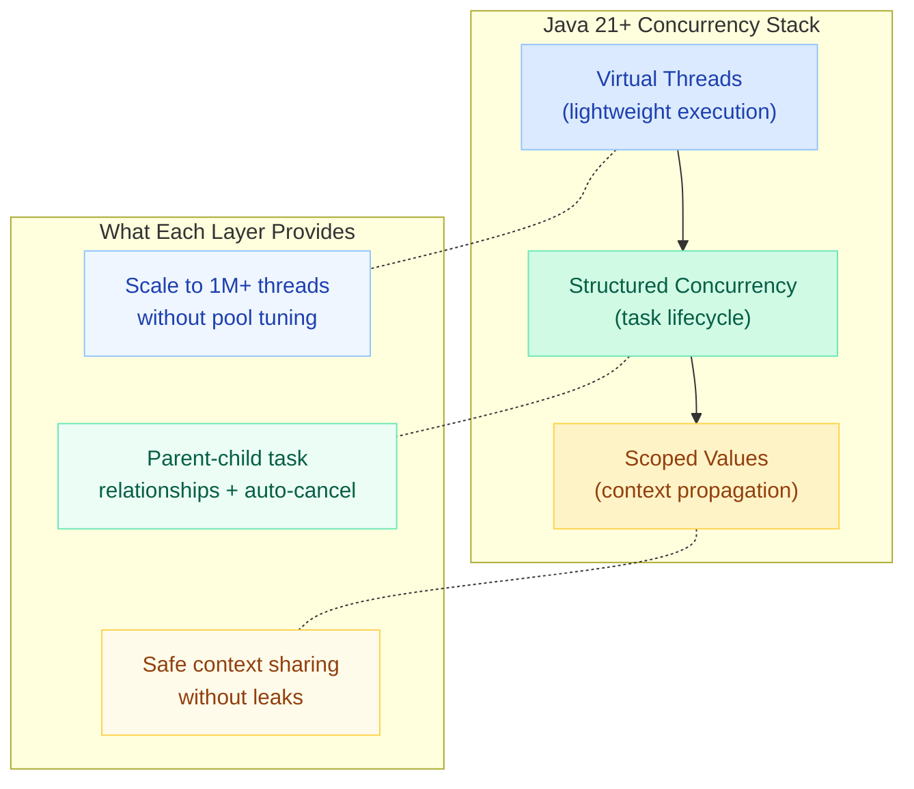

# Scoped Values & Structured Concurrency (Java 21+)

> **ThreadLocal leaks with virtual threads — 1M virtual threads x 1 ThreadLocal = OOM.** Scoped Values and Structured Concurrency are the modern replacements designed for the virtual thread era.

---

!!! danger "The ThreadLocal Problem at Scale"
    With platform threads (capped at ~200), ThreadLocal was manageable. With virtual threads, you can spawn **1,000,000+ threads**. Each ThreadLocal instance holds a reference per thread. That's 1M objects that never get cleaned up until the thread dies — causing **memory leaks, stale data, and OutOfMemoryErrors**.

    ```java
    // ❌ DANGEROUS with virtual threads
    private static final ThreadLocal<RequestContext> CTX = new ThreadLocal<>();

    // 1M virtual threads × 1 ThreadLocal value = 1M objects retained
    // ThreadLocal.remove() is often forgotten → MEMORY LEAK
    // Child threads don't inherit unless using InheritableThreadLocal → inconsistent state
    ```

---

## Scoped Values (JEP 464 — Java 23, Preview since Java 20)

### What Are Scoped Values?

Scoped Values are **immutable, bounded-lifetime, implicitly-inherited** values that replace ThreadLocal for virtual thread workloads.



### ScopedValue.where().run() Pattern

```java
// Declare (static final, like ThreadLocal)
private static final ScopedValue<UserContext> USER = ScopedValue.newInstance();

// Bind and run — value only exists within the lambda
ScopedValue.where(USER, new UserContext("user-123", Set.of("ADMIN")))
    .run(() -> {
        handleRequest();  // USER.get() returns the bound value
    });
// After run() completes → value is GONE, no cleanup needed

// Reading the scoped value
void handleRequest() {
    UserContext ctx = USER.get();  // returns bound value
    if (USER.isBound()) {         // check if currently bound
        processOrder(ctx.userId());
    }
}
```

### Returning Values from Scoped Computations

```java
// Use .call() instead of .run() to return a value
OrderResult result = ScopedValue.where(USER, userCtx)
    .call(() -> {
        Order order = orderService.create(request);
        return new OrderResult(order.id(), "SUCCESS");
    });
```

### Rebinding (Nested Scopes)

```java
ScopedValue.where(USER, adminContext).run(() -> {
    // USER.get() → adminContext
    
    ScopedValue.where(USER, restrictedContext).run(() -> {
        // USER.get() → restrictedContext (inner binding wins)
    });
    
    // USER.get() → adminContext (restored)
});
```

### Inheritance by Child Tasks

```java
ScopedValue.where(USER, userCtx).run(() -> {
    try (var scope = new StructuredTaskScope.ShutdownOnFailure()) {
        // Child tasks automatically inherit the scoped value!
        scope.fork(() -> {
            UserContext ctx = USER.get();  // ✅ same userCtx
            return fetchOrders(ctx.userId());
        });
        scope.fork(() -> {
            UserContext ctx = USER.get();  // ✅ same userCtx
            return fetchRecommendations(ctx.userId());
        });
        scope.join();
        scope.throwIfFailed();
    }
});
```

---

### ThreadLocal vs ScopedValue Comparison

| Aspect | ThreadLocal | ScopedValue |
|--------|-------------|-------------|
| **Mutability** | Mutable (`set()` anytime) | Immutable once bound |
| **Lifetime** | Unbounded (lives until `remove()`) | Bounded (scope of `run()`/`call()`) |
| **Cleanup** | Manual (`remove()` — often forgotten) | Automatic (scope exit) |
| **Inheritance** | `InheritableThreadLocal` (copies value) | Automatic with StructuredTaskScope |
| **Virtual thread safe** | No (memory leak risk) | Yes (designed for millions of threads) |
| **Memory overhead** | O(threads x ThreadLocals) | O(scope depth) — shared, not copied |
| **Performance** | Hash lookup per access | Optimized for fast read (single array slot) |
| **Rebinding** | `set()` mutates in place | Nested `where().run()` (stack-like) |

!!! tip "Migration Rule of Thumb"
    If your ThreadLocal is **set once and never mutated** during a request → replace with ScopedValue. If you need to **mutate mid-request** → consider restructuring or keep ThreadLocal (but add `remove()` in a `finally` block).

---

## Structured Concurrency (JEP 480 — Java 23, Preview since Java 21)

### The Problem: Unstructured Concurrency

```java
// ❌ Unstructured — tasks have no parent-child relationship
ExecutorService executor = Executors.newVirtualThreadPerTaskExecutor();

Future<User> userFuture = executor.submit(() -> getUser(id));
Future<List<Order>> ordersFuture = executor.submit(() -> getOrders(id));
Future<Recommendations> recsFuture = executor.submit(() -> getRecs(id));

// Problems:
// 1. If getUser() fails, ordersFuture and recsFuture keep running (wasteful)
// 2. If this method throws, submitted tasks are orphaned (leak)
// 3. Thread dumps show no relationship between parent and children
// 4. Cancellation requires manual tracking of every future
```

### The Solution: StructuredTaskScope

**Concept:** Tasks are children of a scope, structured like code blocks. A scope cannot complete until all its children complete. If the scope is cancelled, all children are cancelled.



---

### ShutdownOnFailure — Cancel Remaining if One Fails

The most common policy: all tasks must succeed, or the entire operation fails.

```java
record UserProfile(User user, List<Order> orders, Recommendations recs) {}

UserProfile fetchProfile(String userId) throws Exception {
    try (var scope = new StructuredTaskScope.ShutdownOnFailure()) {
        
        Subtask<User> user = scope.fork(() -> userService.getUser(userId));
        Subtask<List<Order>> orders = scope.fork(() -> orderService.getOrders(userId));
        Subtask<Recommendations> recs = scope.fork(() -> recService.getRecs(userId));

        scope.join();            // Block until ALL complete or one fails
        scope.throwIfFailed();   // Throws if any subtask failed

        // All succeeded — safe to call .get()
        return new UserProfile(user.get(), orders.get(), recs.get());
    }
    // Scope closes → any incomplete tasks are cancelled
}
```

**Behavior:**
- If `getUser()` throws → `getOrders()` and `getRecs()` are **interrupted immediately**
- The first exception is propagated; others are suppressed
- Thread dump shows: `fetchProfile` → `getUser`, `getOrders`, `getRecs` (parent-child)

---

### ShutdownOnSuccess — Return First Success, Cancel Others

Race multiple strategies and take the fastest result.

```java
// Try multiple data sources — use whichever responds first
String fetchData(String key) throws Exception {
    try (var scope = new StructuredTaskScope.ShutdownOnSuccess<String>()) {
        
        scope.fork(() -> redis.get(key));         // fastest (usually)
        scope.fork(() -> database.query(key));    // fallback
        scope.fork(() -> remoteApi.fetch(key));   // slowest

        scope.join();  // Block until first success

        return scope.result();  // Returns first successful result
    }
    // Remaining tasks cancelled automatically
}
```

**Behavior:**
- First subtask to complete **successfully** → result is captured
- All other subtasks are **interrupted immediately** (no wasted work)
- If ALL fail → throws `ExecutionException` with the last failure

---

### Custom Policies

Build your own shutdown policy by extending `StructuredTaskScope`:

```java
// Custom policy: succeed if at least 2 of 3 replicas respond
class QuorumScope<T> extends StructuredTaskScope<T> {
    private final int quorum;
    private final List<T> results = new CopyOnWriteArrayList<>();
    private final List<Throwable> failures = new CopyOnWriteArrayList<>();

    QuorumScope(int quorum) {
        this.quorum = quorum;
    }

    @Override
    protected void handleComplete(Subtask<? extends T> subtask) {
        switch (subtask.state()) {
            case SUCCESS -> {
                results.add(subtask.get());
                if (results.size() >= quorum) {
                    shutdown();  // Got enough — cancel remaining
                }
            }
            case FAILED -> failures.add(subtask.exception());
            default -> { }
        }
    }

    public List<T> results() throws Exception {
        if (results.size() < quorum) {
            throw new QuorumNotReachedException(failures);
        }
        return List.copyOf(results);
    }
}

// Usage
try (var scope = new QuorumScope<String>(2)) {
    scope.fork(() -> replica1.read(key));
    scope.fork(() -> replica2.read(key));
    scope.fork(() -> replica3.read(key));
    
    scope.join();
    List<String> quorumResults = scope.results();  // At least 2 responses
}
```

---

### Error Handling and Cancellation Propagation

```java
try (var scope = new StructuredTaskScope.ShutdownOnFailure()) {
    Subtask<User> user = scope.fork(() -> getUser(id));
    Subtask<List<Order>> orders = scope.fork(() -> getOrders(id));

    scope.join();

    try {
        scope.throwIfFailed(e -> new ServiceException("Profile fetch failed", e));
    } catch (ServiceException ex) {
        // Wrap and rethrow with context
        log.error("Failed for user {}: {}", id, ex.getMessage());
        throw ex;
    }

    return new Profile(user.get(), orders.get());
}
```

**Cancellation flow:**



**Key rules:**
1. `scope.join()` must be called before accessing results
2. Subtasks that are interrupted receive `InterruptedException`
3. The scope owner thread is NOT interrupted — it just observes the failure
4. Nested scopes propagate cancellation upward naturally

---

## Integration with Virtual Threads

Structured Concurrency and Scoped Values are designed to work **together** with virtual threads:

```java
private static final ScopedValue<RequestContext> REQUEST = ScopedValue.newInstance();

void handleHttpRequest(HttpRequest req) {
    RequestContext ctx = new RequestContext(req.traceId(), req.userId(), Instant.now());

    ScopedValue.where(REQUEST, ctx).run(() -> {
        // This runs on a virtual thread (Spring Boot 3.2+ with virtual threads enabled)
        
        try (var scope = new StructuredTaskScope.ShutdownOnFailure()) {
            // Each fork creates a new virtual thread
            // Each child virtual thread inherits REQUEST scoped value
            Subtask<UserData> userData = scope.fork(() -> {
                // REQUEST.get().traceId() → same trace ID for distributed tracing!
                return userService.fetch(REQUEST.get().userId());
            });
            
            Subtask<Preferences> prefs = scope.fork(() -> {
                return prefService.fetch(REQUEST.get().userId());
            });

            scope.join();
            scope.throwIfFailed();

            respond(userData.get(), prefs.get());
        }
    });
}
```

### The Complete Stack



---

## Quick Recall

| Concept | One-liner |
|---------|-----------|
| **ScopedValue** | Immutable, bounded-lifetime replacement for ThreadLocal |
| **ScopedValue.where().run()** | Bind a value for exactly the duration of a lambda |
| **Inheritance** | Child tasks in StructuredTaskScope auto-inherit scoped values |
| **StructuredTaskScope** | Tasks as children of a scope — structured like code blocks |
| **ShutdownOnFailure** | All-or-nothing: one fails, cancel the rest |
| **ShutdownOnSuccess** | Race: first success wins, cancel the rest |
| **Custom policy** | Override `handleComplete()` for quorum, timeout, etc. |
| **Pinning risk** | Use ReentrantLock (not synchronized) inside virtual threads |
| **ThreadLocal danger** | 1M threads x 1 ThreadLocal = OOM; use ScopedValue instead |

---

## Interview Template

??? question "Why can't you use ThreadLocal with virtual threads?"
    **Answer:** ThreadLocal stores one value per thread with unbounded lifetime. With platform threads (200-500), memory impact is minimal. But virtual threads can scale to millions — each holding a ThreadLocal reference that's never cleaned up (developers forget `remove()`). This causes OOM. Additionally, `InheritableThreadLocal` copies values to child threads, which is expensive at scale. ScopedValue solves this: immutable, auto-cleaned when scope exits, zero-copy inheritance through StructuredTaskScope.

??? question "What is Structured Concurrency and why does it matter?"
    **Answer:** Structured Concurrency ensures concurrent tasks follow the same structure as sequential code — tasks are "children" of a scope and cannot outlive their parent. This gives us: (1) automatic cancellation — if one subtask fails, siblings are interrupted; (2) observability — thread dumps show parent-child relationships; (3) no leaked tasks — the scope blocks until all children finish; (4) clean error handling — exceptions propagate to the scope owner. It's the concurrent equivalent of structured programming (loops/if replacing goto).

??? question "Explain ShutdownOnFailure vs ShutdownOnSuccess."
    **Answer:** **ShutdownOnFailure** is all-or-nothing: fork N tasks, wait for all to succeed, and if ANY fails, immediately cancel the rest and propagate the failure. Use for assembling a response from multiple required services. **ShutdownOnSuccess** is a race: fork N alternatives, return the FIRST successful result, and cancel the rest. Use for hedged requests (try multiple replicas, use fastest response) or fallback patterns (try cache, then DB, then remote).

??? question "How do ScopedValues get inherited by child tasks?"
    **Answer:** When you fork a subtask inside a StructuredTaskScope, the child virtual thread automatically inherits all ScopedValues bound in the parent's scope. This is zero-copy (the child reads the same binding, not a clone). This makes distributed tracing, auth context, and request metadata propagation trivial — bind once at the request entry point, and every child task can read it without explicit parameter passing.

??? question "How would you implement a custom StructuredTaskScope policy?"
    **Answer:** Extend `StructuredTaskScope<T>` and override `handleComplete(Subtask<? extends T>)`. This method is called when each subtask finishes. Check `subtask.state()` (SUCCESS, FAILED, UNAVAILABLE) and accumulate results or errors. Call `shutdown()` when your policy is satisfied (e.g., quorum reached, timeout exceeded). Provide a result-accessor method for the caller. Example: a quorum policy that succeeds when 2-of-3 replicas respond.
