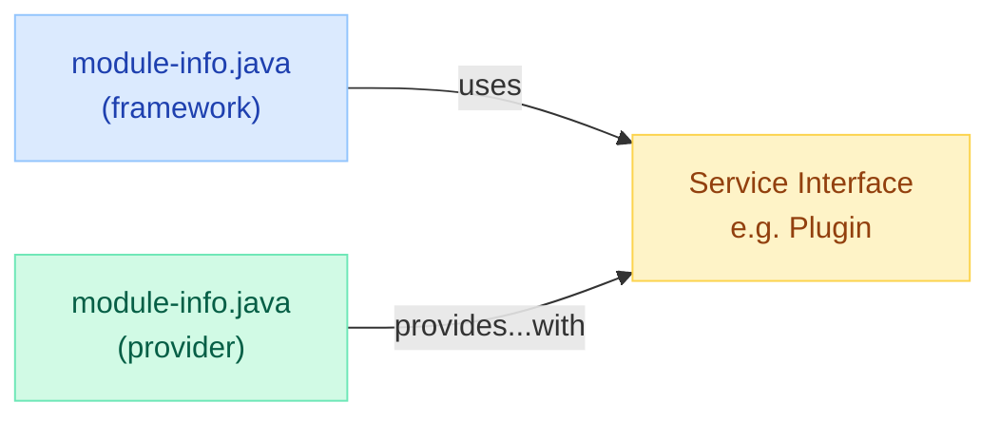
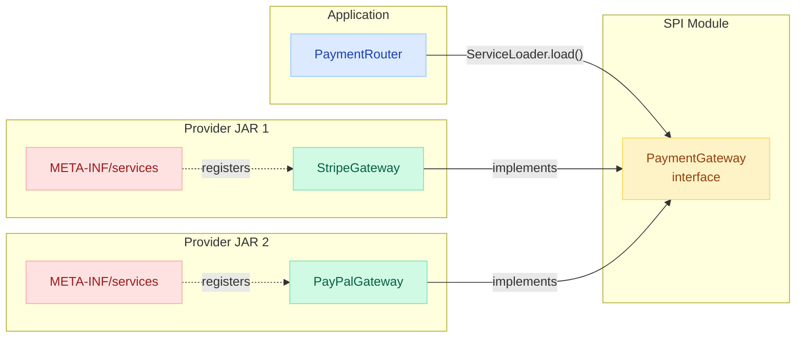
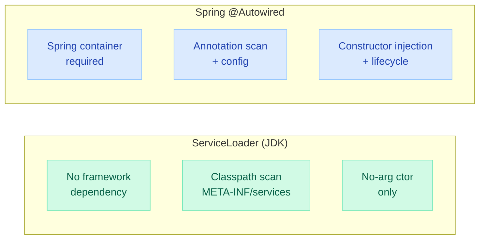
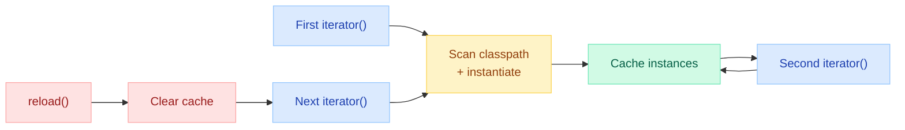

# Java Service Provider Interface (SPI) & ServiceLoader

> **"Make the framework extensible without modifying the framework."** — Joshua Bloch, *Effective Java*

!!! danger "Real Incident: SLF4J Binding Conflict, 2018"
    A production microservice bundled two SLF4J bindings (logback AND log4j-over-slf4j) on the classpath. `ServiceLoader` discovered both, picked one non-deterministically. In staging, logback won — logs appeared fine. In production, the classloader order changed. Log4j binding won, but with no appender config. **Zero logs for 6 hours during a payment outage.** The team couldn't diagnose the root cause because there were no logs to diagnose anything. SPI discovery order is NOT guaranteed — you must control your classpath.

---

## The 30-Second Explanation

**SPI (Service Provider Interface) = a pattern where a framework defines an interface, and third parties provide implementations that are discovered at runtime — with zero compile-time coupling.**

<div style="display: grid; grid-template-columns: 1fr 1fr; gap: 1.5rem; margin: 2rem 0;">
<div style="background: linear-gradient(135deg, #dbeafe, #eff6ff); border: 2px solid #60a5fa; border-radius: 12px; padding: 1.5rem; text-align: center;">
<h4 style="margin: 0 0 0.5rem; color: #1e40af;">API (Application Programming Interface)</h4>
<p style="margin: 0; font-size: 0.9rem; color: #1e40af;">Called BY the application developer. <br/><code>List.of()</code>, <code>Connection.prepareStatement()</code></p>
</div>
<div style="background: linear-gradient(135deg, #d1fae5, #ecfdf5); border: 2px solid #6ee7b7; border-radius: 12px; padding: 1.5rem; text-align: center;">
<h4 style="margin: 0 0 0.5rem; color: #065f46;">SPI (Service Provider Interface)</h4>
<p style="margin: 0; font-size: 0.9rem; color: #065f46;">Implemented BY the plugin author. <br/><code>Driver</code>, <code>FileSystemProvider</code>, <code>Charset</code></p>
</div>
</div>

> **The key insight:** SPI inverts the dependency. The framework depends on the interface, and concrete implementations are loaded at runtime from the classpath — the framework never imports the implementation class.

---

## How ServiceLoader Works


---

## META-INF/services Mechanism

The classic (pre-module-system) approach. Drop a file on the classpath and you're discovered.

### File Structure

```
my-provider.jar
├── com/
│   └── example/
│       └── MyDatabaseDriver.class
└── META-INF/
    └── services/
        └── java.sql.Driver          ← file name = interface FQCN
```

### File Contents

```
# META-INF/services/java.sql.Driver
com.example.MyDatabaseDriver
```

That's it. One line per implementation class. Comments with `#` are allowed.

### Discovery Code

```java
// Framework code — loads ALL providers on the classpath
ServiceLoader<Driver> loader = ServiceLoader.load(Driver.class);

for (Driver driver : loader) {
    // Each iteration lazily instantiates the next provider
    System.out.println("Found driver: " + driver.getClass().getName());
}
```

---

## ServiceLoader API Deep Dive

```java
public final class ServiceLoader<S> implements Iterable<S> {

    // Primary factory methods
    static <S> ServiceLoader<S> load(Class<S> service);
    static <S> ServiceLoader<S> load(Class<S> service, ClassLoader loader);
    static <S> ServiceLoader<S> loadInstalled(Class<S> service);

    // Iteration (lazy)
    Iterator<S> iterator();
    Stream<Provider<S>> stream();     // Java 9+ — doesn't instantiate until get()

    // Cache management
    void reload();                     // clears cache, re-scans

    // Java 9+ Provider interface
    interface Provider<S> extends Supplier<S> {
        Class<? extends S> type();     // inspect without instantiating
        S get();                        // instantiate
    }
}
```

### Lazy Iteration — Critical for Performance

```java
// Java 9+ stream() — inspect types WITHOUT instantiating
ServiceLoader<Plugin> loader = ServiceLoader.load(Plugin.class);

Optional<Plugin> jsonPlugin = loader.stream()
    .filter(p -> p.type().getSimpleName().equals("JsonPlugin"))
    .map(ServiceLoader.Provider::get)   // instantiate only the match
    .findFirst();
```

!!! tip "Interview Gold"
    "ServiceLoader.stream() returns Provider objects that expose the class type WITHOUT creating an instance. This lets you filter providers by annotation, name, or metadata before paying the cost of instantiation — critical when you have 50 plugins and only need one."

---

## Module System Integration (Java 9+)



### Framework Module

```java
// module-info.java of the framework
module com.framework.core {
    exports com.framework.api;       // export the SPI interface
    uses com.framework.api.Plugin;   // declares: "I consume this SPI"
}
```

### Provider Module

```java
// module-info.java of a provider
module com.acme.jsonplugin {
    requires com.framework.core;
    provides com.framework.api.Plugin
        with com.acme.json.JsonPlugin;   // declares: "I supply this impl"
}
```

!!! warning "Module System Enforcement"
    In the module system, `META-INF/services` files still work for unnamed modules, but named modules MUST use `provides...with`. If you forget the `uses` clause in the consuming module, `ServiceLoader.load()` returns an empty iterator silently — no error, no warning, just nothing.

---

## Step-by-Step: Building a Plugin System

### Step 1: Define the SPI (Interface)

```java
package com.myapp.spi;

public interface PaymentGateway {
    String name();
    boolean supports(String currency);
    PaymentResult charge(PaymentRequest request);
}
```

### Step 2: Create Provider Implementations

```java
package com.stripe.gateway;

public class StripeGateway implements PaymentGateway {
    // MUST have a public no-arg constructor
    public StripeGateway() {}

    @Override public String name() { return "Stripe"; }
    @Override public boolean supports(String currency) {
        return Set.of("USD", "EUR", "GBP").contains(currency);
    }
    @Override public PaymentResult charge(PaymentRequest req) {
        // Stripe-specific implementation
    }
}
```

### Step 3: Register the Provider

**Classpath approach:**
```
# META-INF/services/com.myapp.spi.PaymentGateway
com.stripe.gateway.StripeGateway
com.paypal.gateway.PayPalGateway
```

**Module approach:**
```java
module com.stripe.gateway {
    requires com.myapp.spi;
    provides com.myapp.spi.PaymentGateway
        with com.stripe.gateway.StripeGateway;
}
```

### Step 4: Discover and Use

```java
public class PaymentRouter {
    private final Map<String, PaymentGateway> gateways;

    public PaymentRouter() {
        this.gateways = ServiceLoader.load(PaymentGateway.class)
            .stream()
            .map(ServiceLoader.Provider::get)
            .collect(Collectors.toMap(PaymentGateway::name, Function.identity()));
    }

    public PaymentResult route(PaymentRequest req) {
        return gateways.values().stream()
            .filter(g -> g.supports(req.currency()))
            .findFirst()
            .orElseThrow(() -> new UnsupportedOperationException(
                "No gateway for " + req.currency()))
            .charge(req);
    }
}
```

---

## Architecture: Plugin Discovery Flow



---

## Real-World SPI Examples

| Framework | SPI Interface | What Providers Do |
|---|---|---|
| **JDBC** | `java.sql.Driver` | MySQL, PostgreSQL, Oracle each register a driver |
| **SLF4J** | `org.slf4j.spi.SLF4JServiceProvider` | Logback, Log4j2 provide logging backends |
| **Servlet Containers** | `javax.servlet.ServletContainerInitializer` | Spring registers `SpringServletContainerInitializer` |
| **Java Cryptography** | `java.security.Provider` | BouncyCastle, SunJCE provide crypto algorithms |
| **Java NIO** | `java.nio.file.spi.FileSystemProvider` | ZIP FS, Google Cloud Storage FS |
| **JAXB** | `jakarta.xml.bind.JAXBContextFactory` | EclipseLink MOXy, GlassFish reference impl |
| **Image I/O** | `javax.imageio.spi.ImageReaderSpi` | JPEG, PNG, TIFF readers |

### JDBC — The Most Famous SPI

```java
// You write this:
Connection conn = DriverManager.getConnection("jdbc:postgresql://localhost/mydb");

// Behind the scenes (since JDBC 4.0):
// 1. ServiceLoader.load(java.sql.Driver.class)
// 2. Finds META-INF/services/java.sql.Driver in postgresql-42.x.jar
// 3. Instantiates org.postgresql.Driver
// 4. Calls driver.acceptsURL("jdbc:postgresql://...")
// 5. Returns connection from the matching driver

// Before JDBC 4.0 (manual, ugly):
Class.forName("org.postgresql.Driver");  // no longer needed!
```

---

## ServiceLoader vs Spring DI / @Autowired



| Aspect | ServiceLoader | Spring DI (@Autowired) |
|---|---|---|
| **Dependency** | Zero — JDK only | Requires Spring framework |
| **Discovery** | META-INF/services or module-info | Component scanning + @Configuration |
| **Instantiation** | Public no-arg constructor only | Constructor injection, @PostConstruct, etc. |
| **Lifecycle** | None — no init/destroy callbacks | Full lifecycle (init, destroy, scope) |
| **Scoping** | New instance per iteration (unless cached) | Singleton, prototype, request, session |
| **Wiring** | No dependency injection into providers | Full DI (other beans injected) |
| **Configuration** | None (provider must self-configure) | @Value, @ConfigurationProperties |
| **Use Case** | Library/framework extension points | Application-level wiring |
| **Performance** | Minimal overhead | Container startup cost |
| **When to use** | Building libraries consumed by others | Building applications |

!!! tip "Interview Gold"
    "ServiceLoader is for framework authors who can't know their consumers at compile time — like JDBC drivers. Spring DI is for application developers who control the full dependency graph. They solve different problems at different layers."

---

## ServiceLoader Caching and reload()

```java
ServiceLoader<Plugin> loader = ServiceLoader.load(Plugin.class);

// First iteration: providers are instantiated and CACHED
for (Plugin p : loader) { /* uses cache after first pass */ }

// Second iteration: returns SAME instances from cache
for (Plugin p : loader) { /* no re-instantiation */ }

// After adding a new JAR to classpath at runtime:
loader.reload();  // clears cache, next iteration re-scans

// CAUTION: old references to provider instances still exist
// reload() does NOT invalidate objects you already hold
```

### Caching Behavior



---

## Error Handling: ServiceConfigurationError

`ServiceLoader` throws `ServiceConfigurationError` (unchecked) when things go wrong:

| Cause | Example |
|---|---|
| Provider class not found | Typo in META-INF/services file |
| No public no-arg constructor | Constructor is private or takes params |
| Provider doesn't implement interface | Class listed doesn't implement the SPI |
| Class fails to initialize | Static initializer throws exception |
| Circular dependency | Provider A loads Provider B which loads A |

### Defensive Loading

```java
ServiceLoader<Plugin> loader = ServiceLoader.load(Plugin.class);

List<Plugin> plugins = new ArrayList<>();
for (Iterator<Plugin> it = loader.iterator(); it.hasNext(); ) {
    try {
        plugins.add(it.next());
    } catch (ServiceConfigurationError e) {
        // Log and skip broken providers — don't crash the whole app
        logger.error("Failed to load plugin: {}", e.getMessage());
    }
}
```

!!! warning "Common Pitfall"
    The for-each loop (`for (Plugin p : loader)`) will throw `ServiceConfigurationError` and abort iteration if ANY provider fails. Use the explicit iterator pattern above to be resilient to individual provider failures.

---

## Best Practices: Designing an SPI

| Practice | Rationale |
|---|---|
| **Keep the interface small** | Fewer methods = easier for providers to implement |
| **Provide a default/no-op implementation** | Providers can extend it, override what they need |
| **Use abstract class if state is needed** | Interfaces can't carry state; abstract classes can |
| **Version your SPI** | Add `int version()` method; reject incompatible providers |
| **Document the contract precisely** | What's the threading model? Who manages resources? |
| **Never expose ServiceLoader to end users** | Wrap it in a registry/factory pattern |
| **Make the SPI interface a separate module/JAR** | Providers depend only on the API JAR, not your full framework |
| **Prefer `stream()` over `iterator()`** | Inspect types before instantiation (Java 9+) |

### SPI Interface Design Pattern

```java
public interface ImageCodec {
    // Discovery metadata — lets framework filter without instantiating
    String formatName();
    Set<String> supportedMimeTypes();
    int priority();  // higher = preferred when multiple match

    // Actual functionality
    BufferedImage decode(InputStream in) throws IOException;
    void encode(BufferedImage img, OutputStream out) throws IOException;
}
```

---

## Security Considerations

| Threat | Mitigation |
|---|---|
| **Malicious provider on classpath** | Untrusted JARs can register arbitrary providers. Validate classpath sources. |
| **Code execution at scan time** | Provider constructors run during iteration. Limit classpath to trusted code. |
| **Classpath poisoning** | Attacker adds JAR with META-INF/services entry. Use Security Manager (deprecated) or module system encapsulation. |
| **Information leakage** | Providers can observe other providers via ServiceLoader. Use separate classloaders for isolation. |
| **Denial of service** | Provider with infinite loop in constructor blocks ServiceLoader. Use timeouts + watchdog. |

!!! warning "Module System Is Your Friend"
    The Java module system (JPMS) restricts which modules can provide implementations. A provider module must explicitly declare `provides...with` — rogue JARs on the module path can't silently register providers into strongly-encapsulated modules.

---

## Advanced: Custom ServiceLoader Patterns

### Priority-Based Selection

```java
public interface PriorityPlugin extends Comparable<PriorityPlugin> {
    int priority();  // higher = preferred

    @Override
    default int compareTo(PriorityPlugin other) {
        return Integer.compare(other.priority(), this.priority()); // descending
    }
}

// Usage: pick highest-priority provider
Plugin best = ServiceLoader.load(Plugin.class).stream()
    .map(ServiceLoader.Provider::get)
    .sorted()
    .findFirst()
    .orElseThrow();
```

### Provider with Factory Method (Java 9+)

```java
// Instead of no-arg constructor, use a static provider method
public class HeavyPlugin implements Plugin {
    // No public no-arg constructor!

    public static Plugin provider() {
        // Complex initialization logic
        return new HeavyPlugin(loadConfig(), connectToDb());
    }
}
```

In `module-info.java`:
```java
provides Plugin with HeavyPlugin;  // ServiceLoader calls HeavyPlugin.provider()
```

!!! tip "Interview Gold"
    "Since Java 9, ServiceLoader supports a static `provider()` factory method as an alternative to the no-arg constructor. This lets providers do complex initialization — like reading config files or establishing connections — without forcing an empty constructor pattern."

---

## Interview Questions

### Conceptual

| Question | Key Points |
|---|---|
| What is SPI vs API? | API is called by users; SPI is implemented by providers. They're opposite sides of the contract. |
| How does JDBC find drivers without Class.forName()? | ServiceLoader scans META-INF/services/java.sql.Driver in all JARs on classpath (since JDBC 4.0). |
| Why does ServiceLoader require a no-arg constructor? | It needs to instantiate classes it discovers by name. No way to know what constructor args to pass. (Java 9+ adds static `provider()` alternative.) |
| What happens if two providers are on classpath? | Both are returned by the iterator. Framework code must choose (first-wins, priority-based, etc.). Order is NOT guaranteed. |
| ServiceLoader vs reflection? | ServiceLoader IS reflection under the hood, but with a discovery contract (META-INF/services). Raw reflection requires knowing the class name ahead of time. |

### Scenario-Based

| Scenario | Expected Answer |
|---|---|
| Design a plugin system for a text editor | Define `EditorPlugin` SPI with `name()`, `onDocumentOpen()`, `onSave()`. Ship API JAR separately. Third parties implement + register via META-INF/services. Use priority for ordering. |
| Your ServiceLoader returns empty | Check: (1) META-INF/services file name matches FQCN exactly, (2) provider class is on classpath, (3) provider has public no-arg ctor, (4) in modules: `uses` clause present. |
| How to hot-reload plugins? | Call `reload()` after adding new JARs. Use a child classloader for isolation. Old plugin instances must be explicitly cleaned up. |
| Why not just use Spring for plugins? | Library code shouldn't force a framework on consumers. ServiceLoader is JDK-standard, zero dependencies, works everywhere. Spring is appropriate for application wiring, not library extension points. |

---

## The 3 Mistakes That Get You Rejected

!!! danger "Don't Say These"
    1. **"SPI is just dependency injection"** — No. SPI is runtime service DISCOVERY. DI frameworks like Spring do discovery + wiring + lifecycle + scoping. SPI is only the discovery part with no-arg instantiation.
    2. **"ServiceLoader is slow because it scans the whole classpath"** — It's lazy. Providers are only instantiated when you iterate. With `stream()` you can even inspect types without instantiation. The real cost is I/O to read META-INF/services files, which is negligible.
    3. **"I'd use ServiceLoader for everything"** — ServiceLoader is for EXTENSION POINTS where you don't know providers at compile time. If you control both sides of the interface, just use normal DI. Over-using SPI makes code harder to debug (no compile-time safety, no IDE navigation to impls).

---

## Quick Recall Card

| Question | Answer |
|---|---|
| What file path registers an SPI provider? | `META-INF/services/<interface.FQCN>` containing implementation class name |
| What does `ServiceLoader.load()` return? | An `Iterable<S>` with lazy instantiation |
| How to avoid instantiating all providers? | Use `stream()` + `Provider.type()` to filter by class before calling `get()` |
| Module system equivalent of META-INF/services? | `provides InterfaceName with ImplClass;` in module-info.java |
| Module system consumer declaration? | `uses InterfaceName;` in module-info.java |
| What exception does ServiceLoader throw? | `ServiceConfigurationError` (unchecked) |
| How to refresh after classpath changes? | `loader.reload()` — clears cached instances |
| Constructor requirement (classpath)? | Public no-arg constructor |
| Constructor alternative (Java 9+ modules)? | Public static `provider()` factory method |
| Most famous SPI in Java? | `java.sql.Driver` (JDBC driver discovery) |
| ServiceLoader thread safety? | NOT thread-safe — synchronize externally or use one loader per thread |
| Why not Spring for library SPIs? | Libraries shouldn't force framework dependencies on consumers |
