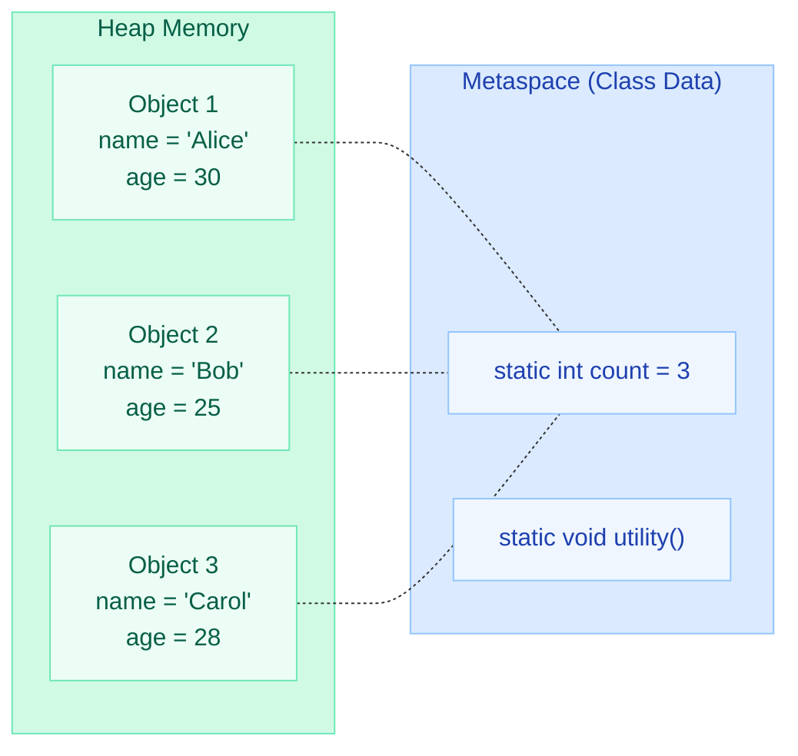
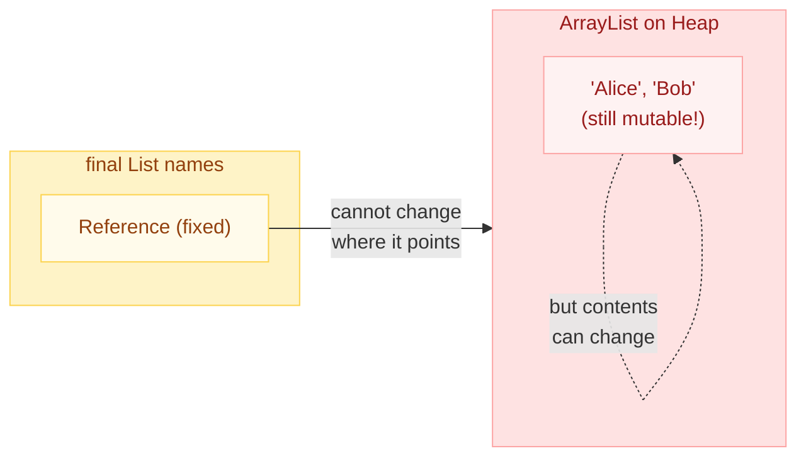

# Static & Final Keywords in Java

Understanding `static` and `final` is fundamental to writing correct, performant, and thread-safe Java. Misusing these keywords is one of the most common sources of subtle production bugs.

---

!!! danger "Real-World Bug: Static Mutable Field Leaking Data Between Requests"

    A Spring Boot web server stored user session data in a `static HashMap`. Since static fields are shared across **all threads and requests**, User A's sensitive data leaked into User B's response. In a servlet container with thread pooling, mutable static state is a ticking time bomb.

    ```java
    // NEVER DO THIS in a web application
    public class UserService {
        // Shared across ALL requests — data leak between users!
        private static Map<String, String> currentUserData = new HashMap<>();

        public void processRequest(String userId) {
            currentUserData.put("userId", userId); // Race condition + data leak
        }
    }
    ```

---

## The `static` Keyword

`static` means **"belongs to the class, not to any instance."** A static member exists once in memory regardless of how many objects you create.

---

### Static Variables (Class Variables)

```java
public class Employee {
    private static int totalCount = 0;  // One copy shared by ALL Employee objects
    private String name;                 // One copy PER Employee object

    public Employee(String name) {
        this.name = name;
        totalCount++;  // Every constructor call increments the SAME counter
    }
}
```

| Property | Static Variable | Instance Variable |
|---|---|---|
| **Storage** | Metaspace (class metadata area) | Heap (inside object) |
| **Lifetime** | Class load to class unload | Object creation to GC |
| **Copies** | Exactly one per ClassLoader | One per object instance |
| **Access** | `ClassName.variable` (preferred) or `obj.variable` | `obj.variable` only |
| **Default** | Same defaults as instance (0, null, false) | Same |

---

### Static Methods

Static methods can only access other static members directly. They cannot use `this` or `super`.

```java
public class MathUtils {
    // Utility method — no instance state needed
    public static int max(int a, int b) {
        return (a > b) ? a : b;
    }

    // COMPILE ERROR — can't access instance members from static context
    // private String label = "utils";
    // public static void print() { System.out.println(label); }
}
```

**Utility class pattern** (private constructor + static methods):

```java
public final class StringUtils {
    private StringUtils() {} // Prevent instantiation

    public static boolean isEmpty(String s) {
        return s == null || s.isEmpty();
    }

    public static String capitalize(String s) {
        if (isEmpty(s)) return s;
        return Character.toUpperCase(s.charAt(0)) + s.substring(1);
    }
}
```

**When to use static methods:**

- Pure utility functions (no state)
- Factory methods (`Integer.valueOf()`, `List.of()`)
- When behaviour does not depend on instance fields

---

### Static Blocks (Static Initializers)

Static blocks run **once** when the class is first loaded, in the order they appear.

```java
public class Config {
    private static final Map<String, String> SETTINGS;

    static {
        // Complex initialization that can't be done in a one-liner
        Map<String, String> map = new HashMap<>();
        map.put("timeout", "5000");
        map.put("retries", "3");
        SETTINGS = Collections.unmodifiableMap(map);
        System.out.println("Config loaded!");  // Prints once on class load
    }

    static {
        // Multiple static blocks are allowed — executed in order
        System.out.println("Second static block");
    }
}
```

**Key rules:**

- Executed exactly once per ClassLoader
- Run in textual order (top to bottom)
- Cannot throw checked exceptions (must be caught inside)
- Run before any constructor or instance block

---

### Static Nested Classes

A static nested class does **not** hold a reference to its enclosing outer instance.

```java
public class LinkedList<T> {
    private Node<T> head;

    // Static nested class — no implicit reference to LinkedList instance
    private static class Node<T> {
        T data;
        Node<T> next;

        Node(T data) {
            this.data = data;
        }
    }
}
```

| Feature | Static Nested Class | Inner Class (non-static) |
|---|---|---|
| **Outer reference** | No | Yes (implicit `Outer.this`) |
| **Memory** | Less (no outer ref) | More (holds outer ref) |
| **Can access outer instance members** | No | Yes |
| **Instantiation** | `new Outer.Nested()` | `outer.new Inner()` |
| **Common use** | Builder, Node, Entry | Event handlers, iterators |

---

### Static Imports

```java
import static java.lang.Math.PI;
import static java.lang.Math.sqrt;
import static java.util.Collections.unmodifiableList;

public class Circle {
    public double area(double radius) {
        return PI * radius * radius;  // Instead of Math.PI
    }

    public double diagonal(double a, double b) {
        return sqrt(a * a + b * b);   // Instead of Math.sqrt(...)
    }
}
```

**Best practice:** Use sparingly. Overuse makes code harder to read because you lose the context of where a method comes from.

---

### Memory Diagram: Static vs Instance Members



All three objects share the **same** `count` variable stored in Metaspace. Each object has its **own** copy of `name` and `age` on the heap.

---

## The `final` Keyword

`final` means **"cannot be changed after assignment"** for variables, **"cannot be overridden"** for methods, and **"cannot be extended"** for classes.

---

### Final Variables (Constants)

```java
public class Constants {
    // Compile-time constant (static + final + literal)
    public static final double PI = 3.14159265358979;

    // Blank final — must be assigned exactly once (in constructor)
    private final String id;

    public Constants(String id) {
        this.id = id;  // Blank final assigned here — OK
    }

    public void tryChange() {
        // this.id = "new";  // COMPILE ERROR — final variable already assigned
    }
}
```

**Blank finals** are `final` variables declared without an initializer. They must be assigned exactly once:

- Instance blank finals: in every constructor
- Static blank finals: in a static block

```java
public class Connection {
    private final String url;            // Blank final
    private static final int TIMEOUT;    // Static blank final

    static {
        TIMEOUT = Integer.parseInt(System.getenv("TIMEOUT"));
    }

    public Connection(String url) {
        this.url = url;  // Must assign here
    }
}
```

---

### Final Methods (Cannot Override)

```java
public class BaseTransaction {
    // Subclasses CANNOT override this — ensures consistent audit logging
    public final void execute(BigDecimal amount) {
        validate(amount);
        process(amount);
        audit(amount);
    }

    protected void validate(BigDecimal amount) { /* overridable */ }
    protected void process(BigDecimal amount) { /* overridable */ }

    private void audit(BigDecimal amount) {
        System.out.println("Audited: " + amount);
    }
}
```

**Why use `final` methods?**

- Prevent subclasses from breaking critical logic (Template Method pattern)
- JVM can **inline** final methods (devirtualization) for better performance
- Security: prevent malicious subclasses from bypassing validation

---

### Final Classes (Cannot Extend)

```java
public final class String { ... }      // java.lang.String
public final class Integer { ... }     // java.lang.Integer
public final class Math { ... }        // java.lang.Math
public final class LocalDate { ... }   // java.time.LocalDate
```

**When to make a class final:**

- Immutable value objects (prevents subclass from adding mutable state)
- Security-sensitive classes (prevents override attacks)
- Utility classes (no reason to extend)

```java
// Your own final class
public final class Money {
    private final BigDecimal amount;
    private final Currency currency;

    public Money(BigDecimal amount, Currency currency) {
        this.amount = amount;
        this.currency = currency;
    }
    // No setters — immutable + final = fully locked down
}
```

---

### Final Parameters

```java
public void transfer(final Account from, final Account to, final BigDecimal amount) {
    // from = new Account();  // COMPILE ERROR — can't reassign final parameter
    from.debit(amount);       // OK — calling methods on the object is fine!
    to.credit(amount);
}
```

Final parameters prevent accidental reassignment inside the method. They do **not** prevent mutation of the object itself.

---

### Effectively Final (Java 8+)

A local variable is **effectively final** if it is never reassigned after initialization. Lambdas and anonymous classes can only capture effectively final variables.

```java
public void process(List<String> items) {
    String prefix = "ITEM:";  // Effectively final (never reassigned)
    // prefix = "X";          // If uncommented, lambda below won't compile

    items.forEach(item -> System.out.println(prefix + item));  // OK
}

// Anonymous class example
public Runnable createTask(int count) {
    // count is effectively final (parameter never reassigned)
    return new Runnable() {
        @Override
        public void run() {
            System.out.println("Count: " + count);  // OK — effectively final
        }
    };
}
```

---

### Final vs Immutability

!!! warning "Critical Distinction: `final` reference does NOT mean immutable object"

    `final` only prevents **reassignment of the reference**. The object the reference points to can still be mutated.

```java
public class FinalVsImmutable {
    public static void main(String[] args) {
        final List<String> names = new ArrayList<>();

        // names = new ArrayList<>();  // COMPILE ERROR — can't reassign
        names.add("Alice");            // OK — mutating the list object!
        names.add("Bob");             // OK — final doesn't prevent this!
        names.clear();                 // OK — still mutating freely

        // For TRUE immutability, use:
        final List<String> immutable = List.of("Alice", "Bob");
        // immutable.add("Carol");    // UnsupportedOperationException at runtime
    }
}
```



**To achieve true immutability:**

1. Make the class `final`
2. Make all fields `private final`
3. No setters
4. Return defensive copies of mutable fields
5. Use immutable collections (`List.of()`, `Map.of()`, `Collections.unmodifiable*()`)

---

## Initialization Order

When a class is loaded and an object is created, Java follows a strict initialization order.


**Complete example demonstrating the order:**

```java
public class InitOrder {
    // 1. Static field
    private static String staticField = log("1. Static field initialized");

    // 2. Static block
    static {
        System.out.println("2. Static block executed");
    }

    // 3. Instance field
    private String instanceField = log("3. Instance field initialized");

    // 4. Instance block
    {
        System.out.println("4. Instance block executed");
    }

    // 5. Constructor
    public InitOrder() {
        System.out.println("5. Constructor executed");
    }

    private static String log(String msg) {
        System.out.println(msg);
        return msg;
    }

    public static void main(String[] args) {
        System.out.println("--- Creating first object ---");
        new InitOrder();
        System.out.println("--- Creating second object ---");
        new InitOrder();
    }
}
```

**Output:**
```
1. Static field initialized
2. Static block executed
--- Creating first object ---
3. Instance field initialized
4. Instance block executed
5. Constructor executed
--- Creating second object ---
3. Instance field initialized
4. Instance block executed
5. Constructor executed
```

Notice: static initialization happens **once**. Instance initialization happens **every time** you create a new object.

---

## Comparison Table

| Feature | `static` | `final` | `static final` |
|---|---|---|---|
| **Meaning** | Belongs to class | Cannot change | Class-level constant |
| **Variables** | Shared across instances | Assigned once | True compile-time constant |
| **Methods** | Called without instance | Cannot override | Utility method, no override |
| **Classes** | Only for nested classes | Cannot extend | Final nested class |
| **Memory** | Metaspace | Heap (instance) or Metaspace (static) | Metaspace |
| **Thread safety** | Needs synchronization if mutable | Safe if object is also immutable | Safe (immutable by definition) |

---

## Common Pitfalls

!!! failure "Pitfall 1: Static mutable state in multi-threaded apps"

    ```java
    // BUG: Race condition — multiple threads modify simultaneously
    public class Counter {
        private static int count = 0;
        public static void increment() { count++; }  // NOT thread-safe!
    }

    // FIX: Use AtomicInteger or synchronization
    public class Counter {
        private static final AtomicInteger count = new AtomicInteger(0);
        public static void increment() { count.incrementAndGet(); }
    }
    ```

!!! failure "Pitfall 2: Assuming final means immutable"

    ```java
    final Map<String, String> config = new HashMap<>();
    config.put("key", "value");  // COMPILES — object is mutable!
    // Fix: final Map<String, String> config = Map.of("key", "value");
    ```

!!! failure "Pitfall 3: Static field holding object references (memory leak)"

    ```java
    public class Cache {
        // This map NEVER gets garbage collected — grows forever!
        private static final Map<String, byte[]> cache = new HashMap<>();

        public static void store(String key, byte[] data) {
            cache.put(key, data);  // Memory leak if never evicted
        }
    }
    // Fix: Use WeakHashMap, Caffeine cache, or explicit eviction
    ```

!!! failure "Pitfall 4: Static method cannot be overridden (method hiding)"

    ```java
    class Parent {
        public static void greet() { System.out.println("Parent"); }
    }
    class Child extends Parent {
        public static void greet() { System.out.println("Child"); }  // HIDES, not overrides
    }

    Parent ref = new Child();
    ref.greet();  // Prints "Parent" — resolved at compile time, not runtime!
    ```

!!! failure "Pitfall 5: Initialization order dependency"

    ```java
    public class Broken {
        private static int x = getValue();  // Called before y is initialized!
        private static int y = 10;

        private static int getValue() { return y; }  // Returns 0, not 10!
    }
    ```

---

## Quick Recall

| Question | Answer |
|---|---|
| Where are static variables stored? | Metaspace (since Java 8; previously PermGen) |
| Can a static method access instance variables? | No (no `this` reference) |
| When do static blocks execute? | Once, when the class is first loaded |
| Can you override a static method? | No (you can only **hide** it) |
| What does `final` on a variable mean? | Cannot be reassigned after initialization |
| What does `final` on a method mean? | Cannot be overridden by subclasses |
| What does `final` on a class mean? | Cannot be extended (no subclasses) |
| Is `final` the same as immutable? | No. `final` prevents reassignment; object contents can still change |
| What is "effectively final"? | A variable never reassigned after init (needed for lambdas) |
| What is a blank final? | A `final` variable declared without initializer, assigned in constructor |
| Initialization order? | Static fields/blocks (once) then instance fields/blocks then constructor |
| Can a final class have non-final methods? | Yes (methods are implicitly "final" in effect since class can't be extended) |

---

## Interview Answer Template

!!! tip "When asked about static or final in interviews"

    **Structure your answer:**

    1. **Define** the keyword and what it restricts
    2. **Where it applies** (variable, method, class, block)
    3. **Memory impact** (Metaspace vs Heap, shared vs per-instance)
    4. **Thread-safety implications**
    5. **Common mistakes** (static mutable state, final != immutable)
    6. **Real-world example** from your experience

    **Example answer for "Explain static":**

    > "The `static` keyword makes a member belong to the class rather than any instance. A static variable exists once in Metaspace and is shared by all objects. Static methods can be called without creating an instance but cannot access instance state. In practice, I use static for utility methods and constants, but I'm cautious about mutable static fields because they create shared state that's dangerous in concurrent applications like web servers."

---

## Best Practices Summary

1. **Prefer `static final` for constants** — makes intent clear, enables JVM optimizations
2. **Avoid mutable static fields** — they create hidden shared state and thread-safety issues
3. **Make utility classes `final`** with private constructor — prevents misuse via inheritance
4. **Use `final` on local variables** when possible — communicates intent, catches reassignment bugs
5. **Remember: `final` + immutable collections = true immutability** — `final` alone is not enough
6. **Static nested classes over inner classes** when you don't need the outer reference — saves memory
7. **Declare method parameters `final`** in critical code paths — prevents accidental reassignment
