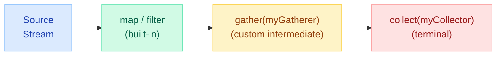
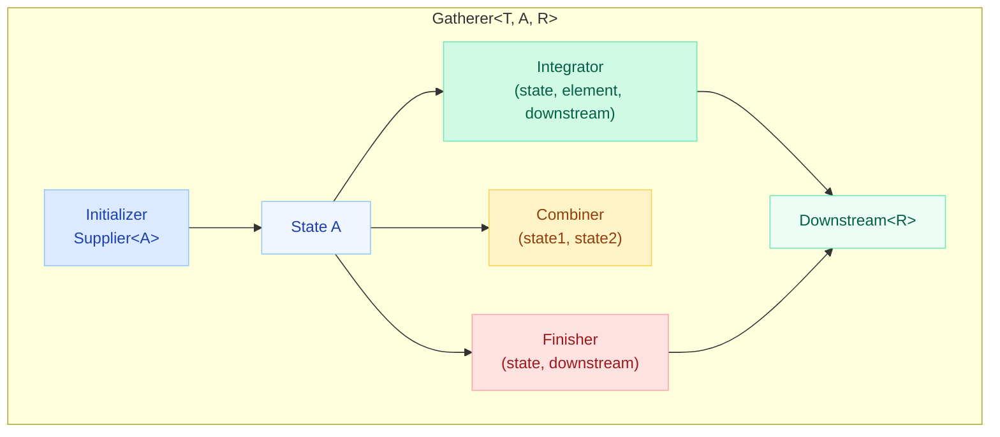
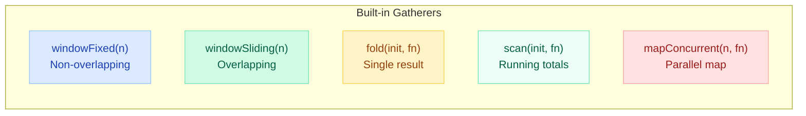
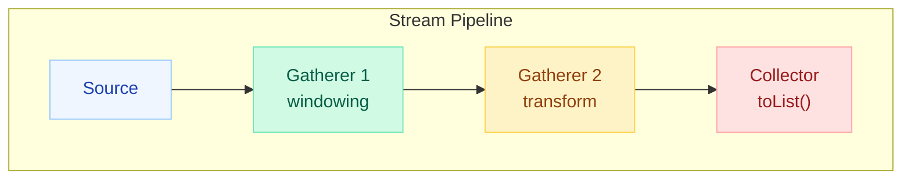
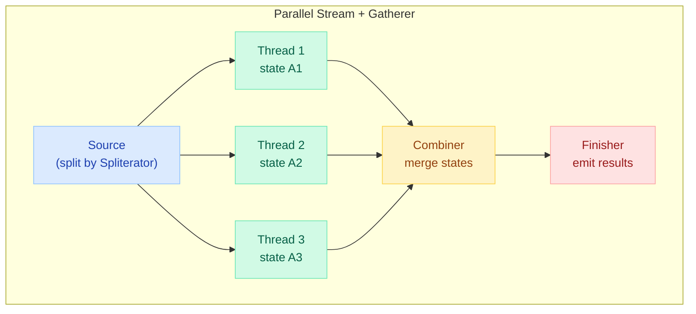

# Java 22+ Stream Gatherers

!!! tip "Why This Matters"
    Before Gatherers, creating **custom intermediate stream operations** required hacking `Spliterator` or writing fragile `flatMap` workarounds. Stream Gatherers (finalized in Java 24, preview in 22-23) give you a first-class API for composable, stateful, short-circuiting intermediate operations — the missing counterpart to `Collector`.

---

## What Are Stream Gatherers?

A **Gatherer** is a custom intermediate operation for streams, just as a `Collector` is a custom terminal operation. Gatherers let you transform, filter, window, or reorganize stream elements in ways that the built-in `map`/`filter`/`flatMap` cannot express.



```java
// Using a Gatherer as an intermediate operation
List<List<Integer>> windows = Stream.of(1, 2, 3, 4, 5)
    .gather(Gatherers.windowFixed(3))
    .toList();
// [[1, 2, 3], [4, 5]]
```

---

## The Gatherer Interface

A `Gatherer<T, A, R>` has four components, mirroring the structure of `Collector`:

| Component | Signature | Purpose |
|---|---|---|
| **Initializer** | `Supplier<A>` | Creates mutable private state |
| **Integrator** | `Gatherer.Integrator<A, T, R>` | Processes each element, may emit downstream |
| **Combiner** | `BinaryOperator<A>` | Merges states for parallel execution |
| **Finisher** | `BiConsumer<A, Downstream<R>>` | Emits final elements when upstream completes |



```java
// Anatomy of a Gatherer
Gatherer<T, A, R> gatherer = Gatherer.of(
    initializer,   // () -> new State()
    integrator,    // (state, element, downstream) -> boolean
    combiner,      // (state1, state2) -> mergedState
    finisher       // (state, downstream) -> void
);
```

The **integrator** returns a `boolean`: returning `false` short-circuits the stream (no more elements consumed).

---

## Built-in Gatherers

Java provides several ready-to-use gatherers in `java.util.stream.Gatherers`:

### windowFixed(int size)

Collects elements into fixed-size, non-overlapping windows.

```java
Stream.of(1, 2, 3, 4, 5, 6, 7)
    .gather(Gatherers.windowFixed(3))
    .toList();
// [[1, 2, 3], [4, 5, 6], [7]]
```

### windowSliding(int size)

Creates overlapping windows that slide by one element.

```java
Stream.of(1, 2, 3, 4, 5)
    .gather(Gatherers.windowSliding(3))
    .toList();
// [[1, 2, 3], [2, 3, 4], [3, 4, 5]]
```

### fold(Supplier, BiFunction)

Accumulates elements into a single result emitted at the end (like `reduce`, but as an intermediate operation).

```java
Stream.of(1, 2, 3, 4, 5)
    .gather(Gatherers.fold(() -> 0, Integer::sum))
    .toList();
// [15]
```

### scan(Supplier, BiFunction)

Like `fold`, but emits the running accumulation after each element.

```java
Stream.of(1, 2, 3, 4, 5)
    .gather(Gatherers.scan(() -> 0, Integer::sum))
    .toList();
// [1, 3, 6, 10, 15]
```

### mapConcurrent(int maxConcurrency, Function)

Maps elements concurrently with bounded parallelism (requires virtual threads).

```java
Stream.of("url1", "url2", "url3", "url4")
    .gather(Gatherers.mapConcurrent(4, this::fetchFromNetwork))
    .toList();
// Results in encounter order, fetched concurrently (max 4 at a time)
```



---

## Custom Gatherer Examples

### distinctBy — Deduplicate by Key

```java
public static <T, K> Gatherer<T, ?, T> distinctBy(Function<T, K> keyExtractor) {
    return Gatherer.ofSequential(
        HashSet<K>::new,  // initializer: track seen keys
        (seen, element, downstream) -> {
            K key = keyExtractor.apply(element);
            if (seen.add(key)) {
                downstream.push(element);  // emit only first occurrence
            }
            return true;  // continue processing
        }
    );
}

// Usage
Stream.of("apple", "avocado", "banana", "blueberry", "cherry")
    .gather(distinctBy(s -> s.charAt(0)))
    .toList();
// ["apple", "banana", "cherry"]
```

### takeWhileWithCount — Take First N Matching

```java
public static <T> Gatherer<T, ?, T> takeWhileWithCount(
        Predicate<T> predicate, int maxCount) {
    return Gatherer.ofSequential(
        () -> new AtomicInteger(0),
        (counter, element, downstream) -> {
            if (predicate.test(element) && counter.get() < maxCount) {
                counter.incrementAndGet();
                downstream.push(element);
                return true;
            }
            return false;  // short-circuit
        }
    );
}

// Usage: take at most 3 even numbers
Stream.of(2, 4, 6, 8, 10, 1, 3)
    .gather(takeWhileWithCount(n -> n % 2 == 0, 3))
    .toList();
// [2, 4, 6]
```

### batching — Group With Custom Boundary

```java
public static <T> Gatherer<T, ?, List<T>> batching(Predicate<T> isBoundary) {
    return Gatherer.ofSequential(
        ArrayList<T>::new,
        (batch, element, downstream) -> {
            if (isBoundary.test(element) && !batch.isEmpty()) {
                downstream.push(new ArrayList<>(batch));
                batch.clear();
            }
            batch.add(element);
            return true;
        },
        (batch, downstream) -> {
            if (!batch.isEmpty()) {
                downstream.push(batch);
            }
        }
    );
}

// Usage: split on null delimiters
Stream.of("a", "b", null, "c", "d", "e", null, "f")
    .gather(batching(Objects::isNull))
    .toList();
// [["a", "b"], [null, "c", "d", "e"], [null, "f"]]
```

---

## Gatherer vs Collector Comparison

| Aspect | Gatherer | Collector |
|---|---|---|
| **Position** | Intermediate operation | Terminal operation |
| **Output** | 0..N elements per input | Single result |
| **Short-circuit** | Yes (integrator returns `false`) | No |
| **Composable** | `g1.andThen(g2)` | Must nest/chain streams |
| **API method** | `.gather(g)` | `.collect(c)` |
| **State visibility** | Per-element processing | Accumulates all |
| **Use case** | Transform/window/filter | Aggregate/reduce |



### Composition with andThen

Gatherers compose naturally:

```java
Gatherer<Integer, ?, List<Integer>> windowAndSort =
    Gatherers.<Integer>windowFixed(4)
        .andThen(Gatherer.ofSequential(
            (Void) null,
            (_, window, downstream) -> {
                Collections.sort(window);
                downstream.push(window);
                return true;
            }
        ));

Stream.of(4, 2, 7, 1, 9, 3, 8, 5)
    .gather(windowAndSort)
    .toList();
// [[1, 2, 4, 7], [1, 3, 5, 8, 9]]  -- each window sorted
```

---

## Integration with Parallel Streams

Gatherers support parallel execution when a **combiner** is provided:



| Factory Method | Parallelizable? | Notes |
|---|---|---|
| `Gatherer.ofSequential(...)` | No | Single-threaded only |
| `Gatherer.of(init, integrator, combiner, finisher)` | Yes | Requires combiner |
| Built-in `windowFixed` / `windowSliding` | No | Order-dependent |
| Built-in `mapConcurrent` | No | Uses virtual threads internally |
| Built-in `fold` / `scan` | No | Sequential by nature |

!!! warning "Parallel Gatherer Pitfalls"
    - Window-based gatherers are inherently sequential (element order matters)
    - Ensure your combiner is **associative** — `combine(combine(a, b), c) == combine(a, combine(b, c))`
    - `mapConcurrent` already provides concurrency — do NOT combine with `.parallel()`

---

## Real-World Use Cases

### Sliding Window Metrics

Calculate rolling average response times:

```java
public static Gatherer<Double, ?, Double> rollingAverage(int windowSize) {
    return Gatherers.<Double>windowSliding(windowSize)
        .andThen(Gatherer.ofSequential(
            (Void) null,
            (_, window, downstream) -> {
                double avg = window.stream()
                    .mapToDouble(Double::doubleValue)
                    .average()
                    .orElse(0.0);
                downstream.push(avg);
                return true;
            }
        ));
}

// Monitor service latency (last 5 requests)
Stream.of(120.0, 85.0, 200.0, 95.0, 110.0, 300.0, 75.0)
    .gather(rollingAverage(5))
    .forEach(avg -> System.out.printf("Rolling avg: %.1f ms%n", avg));
// Rolling avg: 122.0 ms
// Rolling avg: 158.0 ms
// Rolling avg: 156.0 ms
```

### Rate-Limiting Stream Processing

Process elements with a delay between batches:

```java
public static <T> Gatherer<T, ?, List<T>> rateLimited(
        int batchSize, Duration delay) {
    return Gatherer.ofSequential(
        ArrayList<T>::new,
        (batch, element, downstream) -> {
            batch.add(element);
            if (batch.size() >= batchSize) {
                downstream.push(new ArrayList<>(batch));
                batch.clear();
                try { Thread.sleep(delay); } 
                catch (InterruptedException e) { 
                    Thread.currentThread().interrupt();
                    return false; 
                }
            }
            return true;
        },
        (batch, downstream) -> {
            if (!batch.isEmpty()) {
                downstream.push(batch);
            }
        }
    );
}

// Send API requests in batches of 10, with 1s delay
requestStream
    .gather(rateLimited(10, Duration.ofSeconds(1)))
    .forEach(batch -> apiClient.sendBatch(batch));
```

### Deduplication Window (Time-Based Duplicate Suppression)

```java
public static <T, K> Gatherer<T, ?, T> deduplicateWithin(
        Function<T, K> keyExtractor, Duration window) {
    return Gatherer.ofSequential(
        () -> new HashMap<K, Instant>(),
        (seen, element, downstream) -> {
            K key = keyExtractor.apply(element);
            Instant now = Instant.now();
            Instant lastSeen = seen.get(key);
            if (lastSeen == null || Duration.between(lastSeen, now).compareTo(window) > 0) {
                seen.put(key, now);
                downstream.push(element);
            }
            return true;
        }
    );
}

// Suppress duplicate events within 5-second windows
eventStream
    .gather(deduplicateWithin(Event::id, Duration.ofSeconds(5)))
    .forEach(this::processEvent);
```

---

## Quick Recall

| Question | Answer |
|---|---|
| What problem do Gatherers solve? | Custom intermediate stream operations without Spliterator hacks |
| What are the 4 components? | Initializer, Integrator, Combiner, Finisher |
| How to short-circuit? | Return `false` from the integrator |
| How to compose? | `gatherer1.andThen(gatherer2)` |
| Sequential vs parallel? | Use `ofSequential` for order-dependent; provide combiner for parallel |
| `mapConcurrent` requires? | Virtual threads (Java 21+), bounded concurrency |
| `windowFixed` vs `windowSliding`? | Non-overlapping vs overlapping-by-one |
| `fold` vs `scan`? | Final-only vs running accumulation |

---

## Interview Template

???+ example "Explain Stream Gatherers and when you'd use them"

    **Opening (30s):** Stream Gatherers, finalized in Java 24, are custom intermediate operations. They fill the gap between built-in operations like `map`/`filter` and terminal `Collector` — letting you write stateful, short-circuiting, composable transformations.

    **Structure (Gatherer interface):**

    - **Initializer** creates private mutable state
    - **Integrator** processes each element, can emit 0..N outputs, can short-circuit by returning `false`
    - **Combiner** merges states for parallel streams
    - **Finisher** emits remaining elements when upstream ends

    **Built-ins:** `windowFixed`, `windowSliding`, `fold`, `scan`, `mapConcurrent`

    **When to use:**

    - Sliding window analytics (rolling averages, anomaly detection)
    - Rate-limited batch processing
    - Custom deduplication strategies
    - Stateful transformations that need to "look back" at previous elements

    **Key insight:** Gatherers compose via `.andThen()` — you can build complex pipelines from simple, reusable pieces without breaking the stream chain.

    **Trade-off:** For simple stateless transforms, stick with `map`/`filter`. Reach for Gatherers when you need **state**, **short-circuiting**, or **multi-element emission** in intermediate positions.
