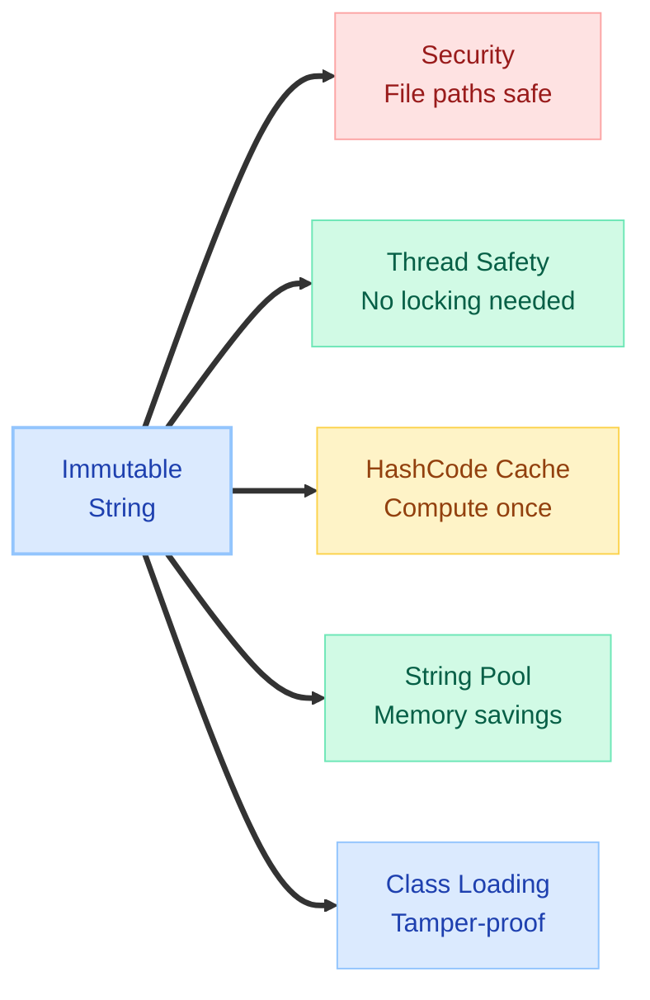
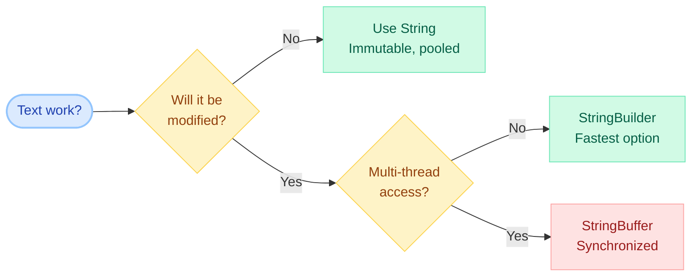
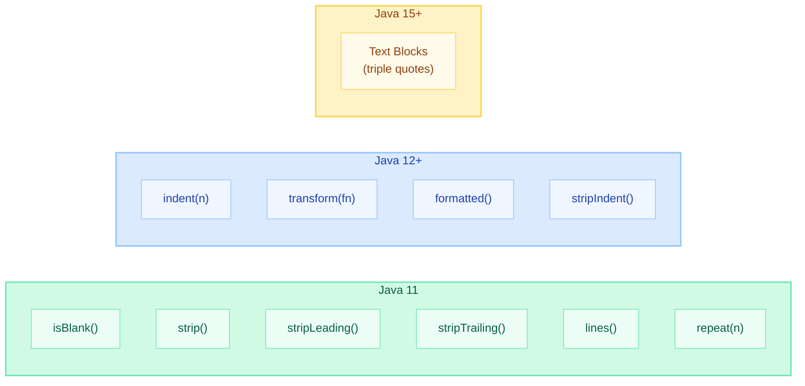
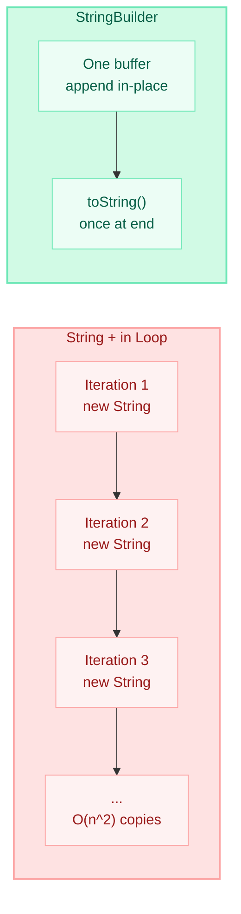
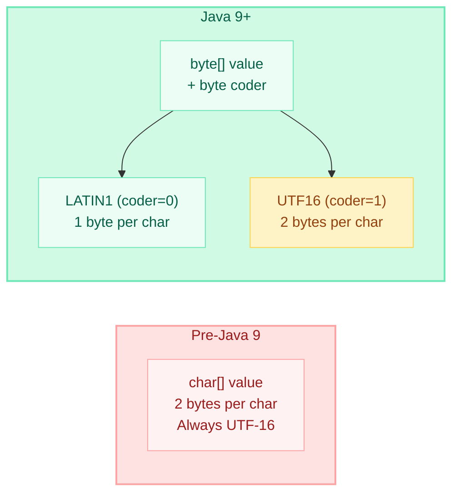

# String Methods & Manipulation

> **"A string is not just a sequence of characters — it's one of the most optimized, security-critical, and interview-heavy classes in the entire JDK." — Effective Java, Joshua Bloch**

---

!!! danger "Real Incident: replaceAll() Regex Catastrophe"
    A payment service used `input.replaceAll("\\$", "")` to strip dollar signs from transaction amounts. A malicious input with nested quantifiers `$$$...(256 chars)` triggered **catastrophic backtracking** in the regex engine, pinning a CPU core at 100% for 38 minutes. The thread pool starved, causing cascading timeouts across 12 downstream services. Fix: switched to `input.replace("$", "")` (literal, not regex) — response time dropped from timeout to 0.2ms.

---

## String Immutability Recap



Every method on `String` returns a **new** String object — the original is never modified:

```java
String original = "Hello";
String upper = original.toUpperCase(); // new object "HELLO"
System.out.println(original);          // still "Hello" — unchanged!
```

!!! tip "Why It Matters for Interviews"
    If an interviewer asks "What happens when you call `s.concat(" world")`?" — the answer is: `s` is unchanged. A **new** String is returned. If you don't assign it, the result is lost.

---

## String vs StringBuilder vs StringBuffer

| Feature | String | StringBuilder | StringBuffer |
|---------|--------|---------------|--------------|
| **Mutability** | Immutable | Mutable | Mutable |
| **Thread Safety** | Yes (immutable) | No | Yes (synchronized) |
| **Performance** | Slow for concat | Fastest | Slower (sync overhead) |
| **Storage** | String Pool eligible | Heap only | Heap only |
| **Since** | JDK 1.0 | JDK 1.5 | JDK 1.0 |
| **Use When** | Constants, keys | Single-thread building | Multi-thread building |
| **Default Capacity** | N/A | 16 chars | 16 chars |
| **Growth Strategy** | N/A | `(old * 2) + 2` | `(old * 2) + 2` |



---

## String Concatenation Approaches

### The + Operator

```java
// Compiler converts to StringBuilder (for simple expressions)
String result = "Hello" + " " + "World"; // compile-time constant → "Hello World"

// In a loop — DANGEROUS (pre-JDK 9)
String s = "";
for (int i = 0; i < 10000; i++) {
    s += i; // Creates a new String EVERY iteration → O(n^2)
}
```

### concat()

```java
String s = "Hello".concat(" World"); // Returns new String "Hello World"
// Slightly faster than + for single concat, but no advantage in loops
// Throws NullPointerException if argument is null!
```

### StringBuilder (Best for loops)

```java
StringBuilder sb = new StringBuilder(1024); // pre-size to avoid resizing
for (int i = 0; i < 10000; i++) {
    sb.append(i);
}
String result = sb.toString(); // Single String created at the end
```

### String.join() (Java 8+)

```java
String csv = String.join(", ", "apple", "banana", "cherry");
// "apple, banana, cherry"

List<String> items = List.of("one", "two", "three");
String joined = String.join(" | ", items);
// "one | two | three"
```

### StringJoiner (Java 8+)

```java
StringJoiner sj = new StringJoiner(", ", "[", "]"); // delimiter, prefix, suffix
sj.add("red").add("green").add("blue");
System.out.println(sj.toString()); // [red, green, blue]

// Empty value
StringJoiner empty = new StringJoiner(", ", "[", "]");
empty.setEmptyValue("NONE");
System.out.println(empty.toString()); // NONE
```

---

## Modern String Methods (Java 11-17)



### isBlank() vs isEmpty() (Java 11)

```java
"".isEmpty();        // true — zero length
"".isBlank();        // true — zero length

"   ".isEmpty();     // false — has 3 chars
"   ".isBlank();     // true — only whitespace (Unicode-aware!)

"\t\n".isEmpty();    // false
"\t\n".isBlank();    // true — tabs and newlines are whitespace
```

### strip() vs trim() (Java 11)

```java
String s = "  Hello  "; // Unicode thin space

s.trim();   // "  Hello  " — trim() only removes ASCII <= 32
s.strip();  // "Hello" — strip() removes ALL Unicode whitespace!

s.stripLeading();  // "Hello  "
s.stripTrailing(); // "  Hello"
```

!!! warning "Always prefer `strip()` over `trim()` in modern Java"
    `trim()` only handles ASCII whitespace (chars <= ` `). `strip()` handles all Unicode whitespace categories including non-breaking space, thin space, zero-width space, etc.

### repeat(int) (Java 11)

```java
"ha".repeat(3);      // "hahaha"
"-".repeat(40);      // "----------------------------------------"
"abc".repeat(0);     // ""

// Useful for padding
String padded = " ".repeat(Math.max(0, 10 - name.length())) + name;
```

### lines() (Java 11)

```java
String multiline = "line1\nline2\r\nline3\rline4";

multiline.lines()           // Stream<String>
    .filter(l -> !l.isBlank())
    .map(String::strip)
    .forEach(System.out::println);
// line1, line2, line3, line4 — handles ALL line terminators
```

### indent(int) and stripIndent() (Java 12)

```java
String code = "public class Hello {\n    void main() {}\n}";

code.indent(4);
// "    public class Hello {\n        void main() {}\n    }\n"

// stripIndent() removes common leading whitespace (text block behavior)
String indented = "    Hello\n    World";
indented.stripIndent(); // "Hello\nWorld"
```

### transform(Function) (Java 12)

```java
// Chain transformations functionally
String result = " Hello World "
    .transform(String::strip)
    .transform(String::toLowerCase)
    .transform(s -> s.replace(" ", "-"));
// "hello-world"

// Useful for pipeline-style processing
int length = "Hello".transform(String::length); // 5
```

### formatted() (Java 15)

```java
// Instance method equivalent of String.format()
String msg = "Hello %s, you are %d years old".formatted("Alice", 30);
// "Hello Alice, you are 30 years old"

// Cleaner than static method when chaining
String json = """
    {
        "name": "%s",
        "age": %d
    }
    """.formatted(name, age);
```

---

## Searching Methods

| Method | Returns | Description |
|--------|---------|-------------|
| `indexOf(String s)` | `int` | First occurrence index, or -1 |
| `indexOf(String s, int from)` | `int` | First occurrence from index |
| `lastIndexOf(String s)` | `int` | Last occurrence index, or -1 |
| `contains(CharSequence s)` | `boolean` | True if substring exists |
| `startsWith(String prefix)` | `boolean` | True if starts with prefix |
| `endsWith(String suffix)` | `boolean` | True if ends with suffix |
| `matches(String regex)` | `boolean` | True if ENTIRE string matches regex |

```java
String s = "Hello World Hello";

s.indexOf("Hello");          // 0
s.indexOf("Hello", 1);      // 12 (search from index 1)
s.lastIndexOf("Hello");     // 12
s.contains("World");        // true
s.startsWith("Hello");      // true
s.endsWith("Hello");        // true

// matches() checks ENTIRE string against regex
"12345".matches("\\d+");    // true
"abc123".matches("\\d+");   // false (not entirely digits)
"abc123".matches(".*\\d+"); // true
```

!!! warning "Performance Trap: matches() in a Loop"
    `matches()` compiles the regex Pattern every call. For repeated use, compile once:
    ```java
    Pattern p = Pattern.compile("\\d+");
    for (String s : list) {
        if (p.matcher(s).matches()) { /* ... */ }
    }
    ```

---

## Extraction Methods

### substring()

```java
String s = "Hello World";

s.substring(6);       // "World" — from index 6 to end
s.substring(0, 5);   // "Hello" — from 0 (inclusive) to 5 (exclusive)

// Java 7u6+: substring() creates a NEW backing array (no memory leak)
// Pre-7u6: shared the original char[] — could cause memory leaks!
```

### charAt() and toCharArray()

```java
String s = "Hello";

s.charAt(0);         // 'H'
s.charAt(4);         // 'o'
// s.charAt(5);      // StringIndexOutOfBoundsException!

char[] chars = s.toCharArray(); // ['H','e','l','l','o'] — new array copy
chars[0] = 'J';                 // modifying array does NOT affect original String
```

### chars() Stream (Java 9+)

```java
"Hello".chars()                  // IntStream of char values
    .mapToObj(c -> (char) c)     // Stream<Character>
    .forEach(System.out::println);

// Count vowels
long vowels = "Hello World".chars()
    .filter(c -> "aeiouAEIOU".indexOf(c) >= 0)
    .count(); // 3

// Collect to String
String upper = "hello".chars()
    .map(Character::toUpperCase)
    .collect(StringBuilder::new, StringBuilder::appendCodePoint, StringBuilder::append)
    .toString(); // "HELLO"
```

### codePoints() (Unicode-safe)

```java
// For strings with emoji/surrogate pairs, use codePoints() not chars()
String emoji = "Hello 🌍";  // earth emoji is 2 chars (surrogate pair)

emoji.chars().count();       // 8 (counts surrogates separately!)
emoji.codePoints().count();  // 7 (correct — counts emoji as 1)
```

---

## Transformation Methods

### replace() — Literal Replacement

```java
String s = "aabbcc";

s.replace('a', 'x');          // "xxbbcc" — replaces ALL occurrences of char
s.replace("bb", "B");         // "aaBcc" — replaces ALL occurrences of CharSequence
```

### replaceAll() — Regex Replacement

```java
String s = "Hello   World   Java";

s.replaceAll("\\s+", " ");    // "Hello World Java" — regex: one or more whitespace
s.replaceAll("[aeiou]", "*"); // "H*ll*   W*rld   J*v*"

// Backreferences
"2024-01-15".replaceAll("(\\d{4})-(\\d{2})-(\\d{2})", "$2/$3/$1");
// "01/15/2024"
```

### replaceFirst() — First Match Only

```java
"aaa bbb aaa".replaceFirst("aaa", "XXX"); // "XXX bbb aaa"
```

!!! tip "replace() vs replaceAll()"
    - `replace(CharSequence, CharSequence)` — literal replacement, no regex
    - `replaceAll(String regex, String replacement)` — regex-powered
    - If you don't need regex, **always use `replace()`** — safer and faster

---

## Splitting and Joining

### split()

```java
String csv = "apple,banana,,cherry";

csv.split(",");       // ["apple", "banana", "", "cherry"] — keeps empty strings
csv.split(",", 3);   // ["apple", "banana", ",cherry"] — limit to 3 parts
csv.split(",", -1);  // ["apple", "banana", "", "cherry"] — keeps trailing empties

// Regex gotcha — dot and pipe need escaping
"a.b.c".split("\\.");        // ["a", "b", "c"]
"a|b|c".split("\\|");       // ["a", "b", "c"]

// Split on multiple delimiters
"a,b;c:d".split("[,;:]");   // ["a", "b", "c", "d"]
```

### String.join() and StringJoiner

```java
// Static join
String result = String.join("-", "2024", "01", "15"); // "2024-01-15"

// With collection
List<String> parts = List.of("usr", "local", "bin");
String path = String.join("/", parts); // "usr/local/bin"

// StringJoiner with prefix/suffix
StringJoiner sj = new StringJoiner(", ", "SELECT ", " FROM users");
sj.add("name").add("email").add("age");
// "SELECT name, email, age FROM users"
```

### Collectors.joining() (Streams)

```java
String result = List.of("alpha", "beta", "gamma")
    .stream()
    .collect(Collectors.joining(", ", "[", "]"));
// "[alpha, beta, gamma]"
```

---

## Comparison Methods

| Method | Behavior |
|--------|----------|
| `equals(Object)` | Content equality, case-sensitive |
| `equalsIgnoreCase(String)` | Content equality, case-insensitive |
| `compareTo(String)` | Lexicographic order, returns int |
| `compareToIgnoreCase(String)` | Lexicographic, case-insensitive |
| `contentEquals(CharSequence)` | Compares with StringBuilder/StringBuffer |
| `regionMatches(...)` | Compares subregions of two strings |

```java
String s1 = "Hello";
String s2 = "hello";

s1.equals(s2);               // false
s1.equalsIgnoreCase(s2);     // true
s1.compareTo(s2);            // negative (H < h in ASCII)
s1.compareToIgnoreCase(s2);  // 0 (equal ignoring case)

// contentEquals — compare String with StringBuilder
StringBuilder sb = new StringBuilder("Hello");
s1.contentEquals(sb);        // true

// regionMatches — compare substring regions
"Hello World".regionMatches(6, "World Cup", 0, 5); // true ("World" == "World")
"Hello World".regionMatches(true, 6, "WORLD Cup", 0, 5); // true (ignore case)
```

!!! tip "Interview Tip: equals() vs =="
    - `==` compares **references** (memory addresses)
    - `.equals()` compares **content** (characters)
    - ALWAYS use `.equals()` for String comparison in production code
    - Exception: comparing with `null` — use `"constant".equals(variable)` to avoid NPE

---

## String Formatting

### String.format()

```java
// Common format specifiers
String.format("%s is %d years old", "Alice", 30);   // "Alice is 30 years old"
String.format("%10s", "hi");                         // "        hi" (right-aligned)
String.format("%-10s", "hi");                        // "hi        " (left-aligned)
String.format("%05d", 42);                           // "00042" (zero-padded)
String.format("%.2f", 3.14159);                      // "3.14"
String.format("%,d", 1000000);                       // "1,000,000"
String.format("%x", 255);                            // "ff" (hex)
String.format("%n");                                 // platform line separator
```

### Format Specifier Reference

| Specifier | Type | Example | Output |
|-----------|------|---------|--------|
| `%s` | String | `format("%s", "hi")` | `hi` |
| `%d` | Integer | `format("%d", 42)` | `42` |
| `%f` | Float | `format("%.2f", 3.14)` | `3.14` |
| `%e` | Scientific | `format("%e", 12345.6)` | `1.234560e+04` |
| `%b` | Boolean | `format("%b", null)` | `false` |
| `%c` | Char | `format("%c", 65)` | `A` |
| `%x` | Hex | `format("%x", 255)` | `ff` |
| `%o` | Octal | `format("%o", 8)` | `10` |
| `%t` | Date/Time | `format("%tF", new Date())` | `2024-01-15` |
| `%n` | Newline | platform-specific | `\n` or `\r\n` |

### formatted() (Java 15+)

```java
// Instance method — cleaner for text blocks
String template = "Name: %s, Age: %d";
String result = template.formatted("Bob", 25); // "Name: Bob, Age: 25"
```

---

## Performance: Concatenation in Loops



### JEP 280: Indify String Concatenation (Java 9+)

Before Java 9, `javac` compiled `+` into `StringBuilder.append()` chains. Since Java 9, it uses `invokedynamic` (indify) which lets the JVM pick the optimal strategy at runtime:

```java
// Source code
String result = "Hello " + name + ", age " + age;

// Pre-Java 9 bytecode: fixed StringBuilder strategy
new StringBuilder().append("Hello ").append(name).append(", age ").append(age).toString();

// Java 9+ bytecode: invokedynamic — JVM chooses optimal strategy
// JVM may use: byte[] concatenation, StringBuilder, or even intrinsics
// depending on runtime profiling!
```

### Benchmark Comparison

| Approach | 10K iterations | 100K iterations |
|----------|---------------|-----------------|
| `String +=` | ~150ms | ~15,000ms (O(n^2)) |
| `StringBuilder` | ~1ms | ~5ms (O(n)) |
| `StringBuffer` | ~2ms | ~8ms (sync overhead) |
| `String.join()` | ~1ms | ~6ms (for collections) |

!!! abstract "Rule of Thumb"
    - Single concatenation (`a + b + c`): use `+` operator (compiler optimizes it)
    - Loop concatenation: **always** use `StringBuilder`
    - Joining collections: use `String.join()` or `Collectors.joining()`

---

## Compact Strings (Java 9+)



**How it works:**

- If ALL characters fit in ISO-8859-1 (Latin-1, values 0-255), the String uses a `byte[]` with **1 byte per character** (coder = LATIN1)
- If ANY character requires more (e.g., Chinese, emoji), it falls back to **2 bytes per character** (coder = UTF16)
- Most English text uses LATIN1 encoding, saving ~50% heap for String storage

```java
// Internal representation (simplified)
public final class String {
    private final byte[] value;  // actual character data
    private final byte coder;    // 0=LATIN1, 1=UTF16
    
    // "Hello" → byte[5] {72,101,108,108,111}, coder=0 (LATIN1, 5 bytes)
    // "Hello 🌍" → byte[16] (UTF16 encoding, 16 bytes for 7 code points)
}
```

!!! info "Compact Strings are enabled by default"
    Disable with `-XX:-CompactStrings` (rarely needed). In typical enterprise apps, compact strings reduce heap usage by **10-15%** just from the String optimization alone.

---

## Common Interview Coding Problems

### Reverse a String

```java
// Method 1: StringBuilder (simplest)
public String reverse(String s) {
    return new StringBuilder(s).reverse().toString();
}

// Method 2: Two-pointer (manual, shows understanding)
public String reverse(String s) {
    char[] chars = s.toCharArray();
    int left = 0, right = chars.length - 1;
    while (left < right) {
        char temp = chars[left];
        chars[left++] = chars[right];
        chars[right--] = temp;
    }
    return new String(chars);
}
```

### Check Palindrome

```java
public boolean isPalindrome(String s) {
    // Clean: remove non-alphanumeric, lowercase
    String clean = s.replaceAll("[^a-zA-Z0-9]", "").toLowerCase();
    int left = 0, right = clean.length() - 1;
    while (left < right) {
        if (clean.charAt(left++) != clean.charAt(right--)) return false;
    }
    return true;
}

// One-liner (less efficient but concise)
public boolean isPalindrome(String s) {
    String clean = s.replaceAll("[^a-zA-Z0-9]", "").toLowerCase();
    return clean.equals(new StringBuilder(clean).reverse().toString());
}
```

### Check Anagram

```java
// Method 1: Sorting — O(n log n)
public boolean isAnagram(String s, String t) {
    if (s.length() != t.length()) return false;
    char[] a = s.toCharArray(), b = t.toCharArray();
    Arrays.sort(a);
    Arrays.sort(b);
    return Arrays.equals(a, b);
}

// Method 2: Frequency count — O(n) time, O(1) space (fixed 26 chars)
public boolean isAnagram(String s, String t) {
    if (s.length() != t.length()) return false;
    int[] freq = new int[26];
    for (int i = 0; i < s.length(); i++) {
        freq[s.charAt(i) - 'a']++;
        freq[t.charAt(i) - 'a']--;
    }
    for (int count : freq) {
        if (count != 0) return false;
    }
    return true;
}
```

### String Permutations

```java
public List<String> permutations(String s) {
    List<String> result = new ArrayList<>();
    backtrack(s.toCharArray(), 0, result);
    return result;
}

private void backtrack(char[] chars, int start, List<String> result) {
    if (start == chars.length) {
        result.add(new String(chars));
        return;
    }
    for (int i = start; i < chars.length; i++) {
        swap(chars, start, i);
        backtrack(chars, start + 1, result);
        swap(chars, start, i); // backtrack
    }
}

private void swap(char[] chars, int i, int j) {
    char tmp = chars[i];
    chars[i] = chars[j];
    chars[j] = tmp;
}
```

### First Non-Repeating Character

```java
public char firstNonRepeating(String s) {
    // LinkedHashMap preserves insertion order
    Map<Character, Integer> freq = new LinkedHashMap<>();
    for (char c : s.toCharArray()) {
        freq.merge(c, 1, Integer::sum);
    }
    for (Map.Entry<Character, Integer> e : freq.entrySet()) {
        if (e.getValue() == 1) return e.getKey();
    }
    return '\0'; // not found
}

// Java 8+ stream approach
public char firstNonRepeating(String s) {
    return s.chars()
        .mapToObj(c -> (char) c)
        .collect(Collectors.groupingBy(c -> c, LinkedHashMap::new, Collectors.counting()))
        .entrySet().stream()
        .filter(e -> e.getValue() == 1)
        .map(Map.Entry::getKey)
        .findFirst()
        .orElse('\0');
}
```

### Longest Substring Without Repeating Characters

```java
// Sliding window — O(n)
public int lengthOfLongestSubstring(String s) {
    Map<Character, Integer> lastSeen = new HashMap<>();
    int maxLen = 0, start = 0;
    
    for (int end = 0; end < s.length(); end++) {
        char c = s.charAt(end);
        if (lastSeen.containsKey(c) && lastSeen.get(c) >= start) {
            start = lastSeen.get(c) + 1;
        }
        lastSeen.put(c, end);
        maxLen = Math.max(maxLen, end - start + 1);
    }
    return maxLen;
}
```

---

## Interview Questions

??? question "What is the difference between replace() and replaceAll()?"

    **Answer:**
    
    - `replace(char, char)` and `replace(CharSequence, CharSequence)` perform **literal** replacement — no regex involved
    - `replaceAll(String regex, String replacement)` treats the first argument as a **regular expression**
    - `replaceFirst(String regex, String replacement)` replaces only the first match
    
    ```java
    "a.b.c".replace(".", "-");      // "a-b-c" (literal dot)
    "a.b.c".replaceAll(".", "-");   // "-----" (regex . = any char!)
    "a.b.c".replaceAll("\\.", "-"); // "a-b-c" (escaped regex dot)
    ```
    
    **Performance**: `replace()` is faster because it avoids regex compilation. Always use `replace()` unless you need pattern matching.

??? question "Why is String immutable in Java?"

    **Answer:** Five reasons (memorize this order):
    
    1. **Security** — Strings are used in class loading, network connections, file paths. Mutable strings would allow tampering after security checks pass.
    2. **HashCode caching** — Since the value never changes, hashCode is computed once and cached. Critical for HashMap/HashSet performance.
    3. **Thread safety** — Immutable objects are inherently thread-safe with no synchronization needed.
    4. **String Pool** — Sharing is only safe because strings cannot be modified. If one reference could change the value, all other references would see the change.
    5. **Class loading** — Class names are strings. Mutable strings would break the classloader security model.

??? question "How does String concatenation work internally in Java 9+?"

    **Answer:** Java 9 introduced **JEP 280: Indify String Concatenation**:
    
    - The compiler emits an `invokedynamic` call instead of hardcoded `StringBuilder` chains
    - At first execution, the JVM's `StringConcatFactory` generates an optimal strategy (bootstrap method)
    - The JVM can choose: direct byte-array concatenation, StringBuilder, or JIT-intrinsified paths
    - This allows the JVM to improve concatenation performance **without recompiling** source code
    - Result: ~2x faster than the old StringBuilder approach for simple concatenations

??? question "What is the difference between String.strip() and String.trim()?"

    **Answer:**
    
    - `trim()` (since Java 1.0): removes characters with codepoint <= `U+0020` (space) — only ASCII whitespace
    - `strip()` (since Java 11): removes characters identified by `Character.isWhitespace()` — **all Unicode whitespace**
    
    This matters for: non-breaking space (` `), ideographic space (`　`), thin space (` `), etc.
    
    ```java
    " Hello ".trim().length();   // 7 — didn't remove non-breaking spaces
    " Hello ".strip().length();  // 5 — removed them correctly
    ```

??? question "How would you efficiently count character frequency in a String?"

    **Answer:** Three approaches from most to least efficient:
    
    ```java
    // 1. int array — fastest for ASCII, O(n) time, O(1) space
    int[] freq = new int[128]; // ASCII
    for (char c : s.toCharArray()) freq[c]++;
    
    // 2. HashMap — handles full Unicode, O(n)
    Map<Character, Integer> map = new HashMap<>();
    for (char c : s.toCharArray()) map.merge(c, 1, Integer::sum);
    
    // 3. Stream — most readable, slightly slower
    Map<Character, Long> freq = s.chars()
        .mapToObj(c -> (char) c)
        .collect(Collectors.groupingBy(c -> c, Collectors.counting()));
    ```
    
    In interviews, use approach #1 for ASCII and #2 for Unicode. Mention #3 to show modern Java knowledge.

??? question "What are Compact Strings and how do they save memory?"

    **Answer:** Since Java 9 (JEP 254):
    
    - Previously, `String` stored characters in `char[]` (2 bytes per character, always UTF-16)
    - Now, `String` stores in `byte[]` with a `coder` flag
    - If all characters are Latin-1 (code points 0-255): uses 1 byte per character (LATIN1 encoding)
    - Otherwise: uses 2 bytes per character (UTF16 encoding)
    - Since most strings in Western applications are pure ASCII/Latin-1, this saves ~40-50% heap for string data
    - Enabled by default; disable with `-XX:-CompactStrings`

---

## Quick Recall Table

| Category | Method | Key Detail |
|----------|--------|------------|
| **Create** | `"literal"` | Goes to String Pool |
| **Create** | `new String()` | Always heap object |
| **Length** | `length()` | Number of char units (not code points!) |
| **Empty** | `isEmpty()` | True if length == 0 |
| **Blank** | `isBlank()` | True if empty or only whitespace (Java 11) |
| **Compare** | `equals()` | Content comparison (always use this!) |
| **Compare** | `==` | Reference comparison (avoid for strings) |
| **Compare** | `compareTo()` | Lexicographic ordering |
| **Search** | `indexOf()` / `lastIndexOf()` | Returns -1 if not found |
| **Search** | `contains()` | Boolean existence check |
| **Extract** | `substring(begin, end)` | end is exclusive |
| **Extract** | `charAt(i)` | Throws IndexOutOfBounds |
| **Transform** | `toUpperCase()` / `toLowerCase()` | Locale-sensitive |
| **Transform** | `replace()` | Literal replacement |
| **Transform** | `replaceAll()` | Regex replacement |
| **Trim** | `strip()` | Unicode-aware (Java 11, prefer over trim) |
| **Split** | `split(regex)` | Returns String array |
| **Join** | `String.join(delim, ...)` | Static method (Java 8) |
| **Repeat** | `repeat(n)` | Repeat n times (Java 11) |
| **Stream** | `chars()` | IntStream of char values |
| **Stream** | `lines()` | Stream of lines (Java 11) |
| **Format** | `formatted(args)` | Instance format (Java 15) |
| **Format** | `String.format()` | Static printf-style |
| **Convert** | `valueOf()` | Any type to String |
| **Intern** | `intern()` | Add/get from String Pool |
| **Builder** | `StringBuilder` | Mutable, not thread-safe, fast |
| **Buffer** | `StringBuffer` | Mutable, thread-safe, slower |
