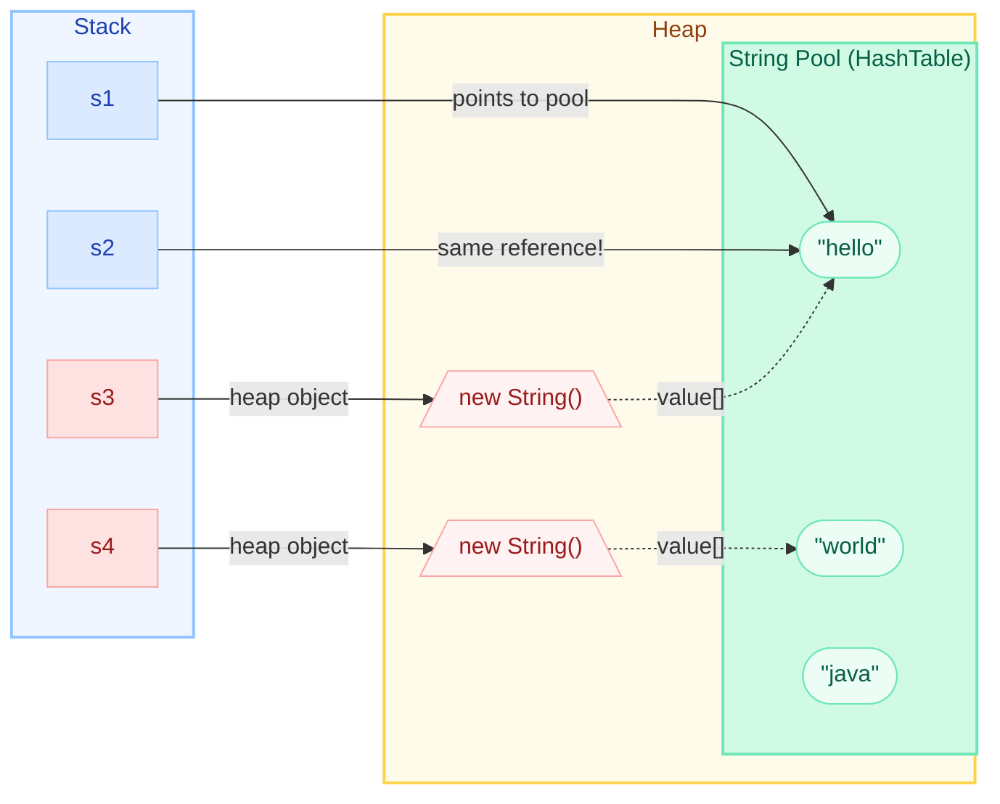
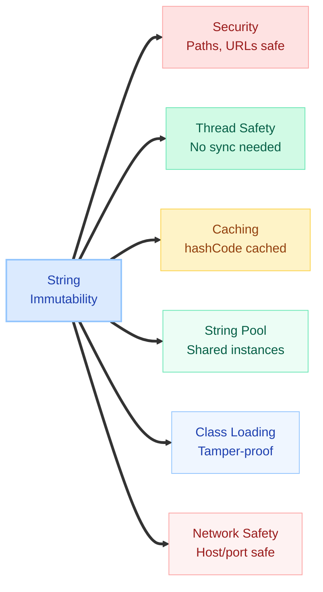
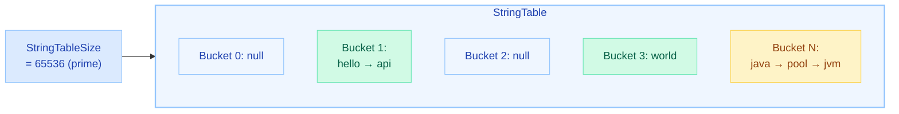
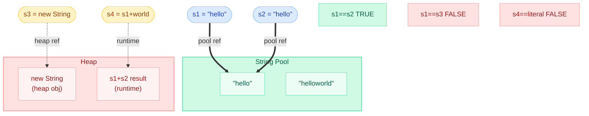
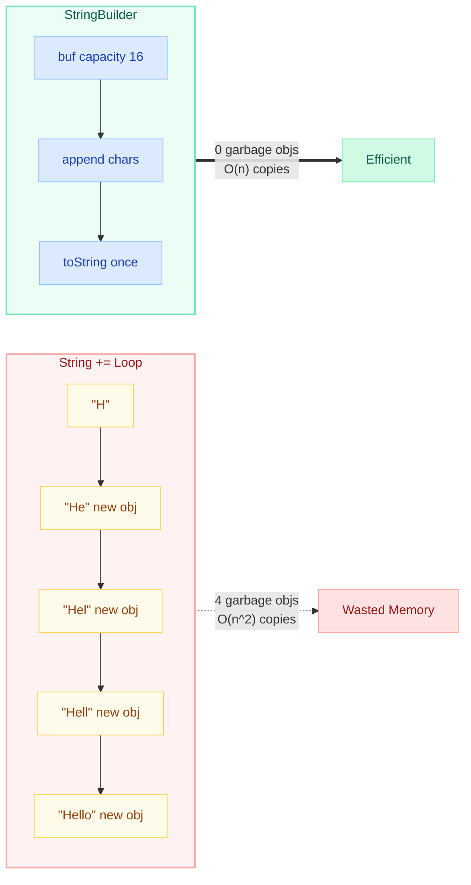
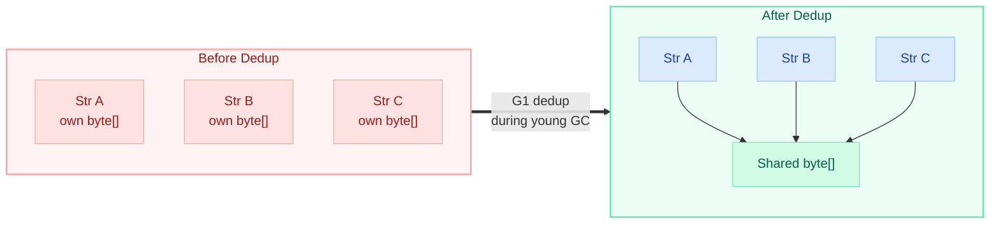
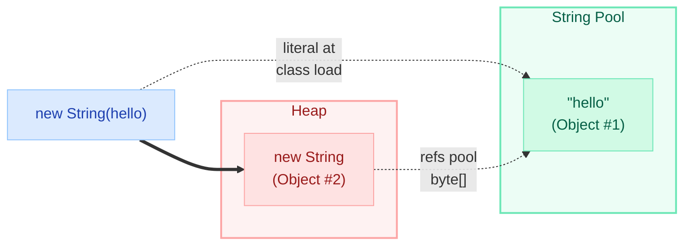
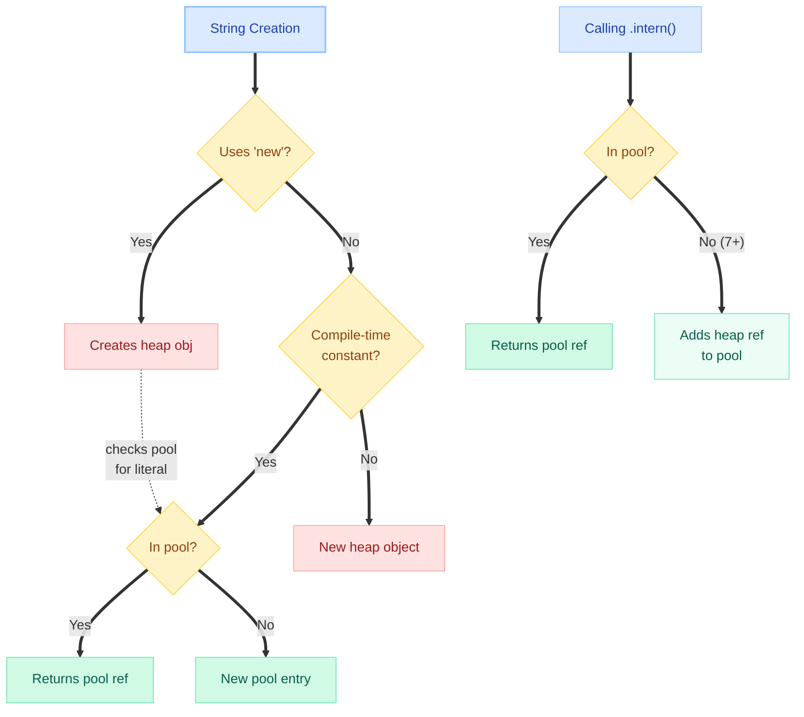

# String Pool & String Internals

> **"Strings account for 25-40% of heap in typical Java applications. Understanding their internals is not optional — it's survival." — JVM Performance Engineers**

---

!!! danger "Real Incident: OOM from String Concatenation in a Loop"
    A production billing service was building CSV reports using `String += line` inside a loop with 2 million records. Each `+=` created a **new String object**, resulting in ~2 million intermediate objects and **4GB of garbage** generated per report. The GC couldn't keep up, triggering a cascading OOM across the cluster. Fix: replacing with `StringBuilder` reduced memory from 4GB to 12MB and report generation time from 45 minutes to 8 seconds.

    **Bonus bug**: A separate team spent 3 days debugging why their cache lookups failed. Root cause: comparing user IDs with `==` instead of `.equals()` — worked in tests (small strings auto-interned by JIT) but failed in production with strings from database/network.

---

## String Memory Architecture



```java
String s1 = "hello";           // → Pool (auto-interned)
String s2 = "hello";           // → SAME pool object as s1
String s3 = new String("hello"); // → NEW heap object, value[] → pool
String s4 = new String("world"); // → NEW heap object, value[] → pool

s1 == s2;  // true  (same pool reference)
s1 == s3;  // FALSE (different objects!)
s1.equals(s3); // true (same content)
```

!!! abstract "The Visual Story"
    **Green nodes** (pool) = shared, reused, memory-efficient. **Red nodes** (heap) = wasteful duplicates. Every `new String()` creates a red node even when the content already exists in green. That's why you almost never write `new String("...")`.

**Key takeaway**: String literals go into the pool (shared). `new String()` always creates a separate heap object, even if the content already exists in the pool.

---

## Why Strings Are Immutable

Java's `String` class is `final` with a `private final` backing array. Once created, a String's value **never changes**. Here's why this was a deliberate design choice:



```java
// hashCode caching — computed once, reused forever
public final class String {
    private final byte[] value;   // Java 9+: byte[] (was char[] pre-9)
    private final byte coder;     // Java 9+: LATIN1=0, UTF16=1
    private int hash;             // cached hashCode (default 0 = not computed)
    
    @Override
    public int hashCode() {
        int h = hash;
        if (h == 0 && value.length > 0) {
            h = /* compute */;
            hash = h;  // cache it — safe because String is immutable
        }
        return h;
    }
}
```

!!! tip "Interview Gold"
    When asked "Why are Strings immutable?", lead with **security** (parameters to class loaders, network connections, file I/O), then mention **hashCode caching** (critical for HashMap keys), then **thread safety** and **String pool viability**.

---

## String Pool (String Intern Pool)

### Where It Lives

| Java Version | Pool Location | GC Eligible? | Implication |
|---|---|---|---|
| Java 6 and earlier | **PermGen** (fixed size) | No | Pool overflow = `OutOfMemoryError: PermGen space` |
| Java 7+ | **Heap** (main area) | Yes | Pool can grow; strings eligible for GC if unreferenced |
| Java 8+ | **Heap** (PermGen removed entirely) | Yes | Metaspace for class metadata only |

### How Literals Are Auto-Interned

```java
String s1 = "hello";  // JVM checks pool → not found → creates in pool → returns ref
String s2 = "hello";  // JVM checks pool → found! → returns same ref
System.out.println(s1 == s2);  // true — same reference from pool
```

### String.intern() Method

```java
String s1 = new String("hello");  // Creates object on heap (+ pool entry for literal)
String s2 = s1.intern();          // Returns reference to pool's "hello"
String s3 = "hello";             // Also returns pool reference

System.out.println(s1 == s2);    // false — s1 is heap object, s2 is pool ref
System.out.println(s2 == s3);    // true — both point to pool
System.out.println(s1 == s3);    // false — heap vs pool
```

### Pool Implementation (Native StringTable)



**Tuning tip**: If your app interns many strings, increase the table size to reduce collisions:
```bash
java -XX:StringTableSize=1000003 -XX:+PrintStringTableStatistics MyApp
```

---

## == vs .equals() Deep Dive

### Memory Diagram: When == Works vs Fails



### Compile-Time Constants vs Runtime Values

```java
// COMPILE-TIME CONSTANTS — resolved at compile time, go to pool
final String a = "hello";
final String b = "world";
String c = a + b;               // Compiler sees: two final literals → optimizes to "helloworld"
System.out.println(c == "helloworld");  // TRUE — compile-time constant

// RUNTIME VALUES — not resolved at compile time, creates new object
String x = "hello";            // Not final
String y = "world";            // Not final  
String z = x + y;             // Compiler can't fold → runtime concatenation → new heap object
System.out.println(z == "helloworld");  // FALSE — different object!

// THE FIX
System.out.println(z.equals("helloworld"));  // TRUE — content comparison
System.out.println(z.intern() == "helloworld");  // TRUE — intern returns pool ref
```

!!! warning "The `final` Keyword Trap"
    Adding `final` to a String variable makes it a **compile-time constant** (if assigned from a literal). The compiler substitutes the value inline, so concatenation of `final` strings happens at compile time and the result is interned.

### Complete Reference Table: == Behavior

| Expression | Result | Reason |
|---|---|---|
| `"abc" == "abc"` | `true` | Same pool reference |
| `new String("abc") == "abc"` | `false` | Heap object vs pool ref |
| `new String("abc") == new String("abc")` | `false` | Two different heap objects |
| `"ab" + "c" == "abc"` | `true` | Compile-time constant folding |
| `str1 + "c" == "abc"` (str1 = "ab", non-final) | `false` | Runtime concat = new object |
| `final str1 + "c" == "abc"` (final str1 = "ab") | `true` | Compile-time constant |
| `new String("abc").intern() == "abc"` | `true` | intern() returns pool ref |

---

## String, StringBuilder, StringBuffer

### The Immutability Cost



### Comparison Table

| Feature | String | StringBuilder | StringBuffer |
|---|---|---|---|
| **Mutability** | Immutable | Mutable | Mutable |
| **Thread Safety** | Yes (immutable) | No | Yes (synchronized methods) |
| **Performance** | Slow for modification | Fastest for single-thread | Slower due to synchronization |
| **Storage** | String Pool eligible | Heap only | Heap only |
| **Since** | JDK 1.0 | JDK 1.5 | JDK 1.0 |
| **Default Capacity** | N/A | 16 characters | 16 characters |
| **Resizing** | N/A (new object) | (oldCap * 2) + 2 | (oldCap * 2) + 2 |
| **hashCode cached** | Yes | No | No |
| **Use Case** | Constants, keys, literals | Loops, building strings | Shared mutable buffer (rare) |

### When the Compiler Optimizes + to StringBuilder

```java
// Simple case — compiler MAY optimize (Java 5-8)
String result = a + b + c;
// Compiled to: new StringBuilder().append(a).append(b).append(c).toString()

// Loop case — compiler CANNOT optimize (still creates per-iteration)
String result = "";
for (String s : list) {
    result += s;  // new StringBuilder EACH iteration! Still O(n^2)
}

// Correct approach
StringBuilder sb = new StringBuilder(estimatedSize);
for (String s : list) {
    sb.append(s);  // O(n) total
}
String result = sb.toString();
```

!!! tip "Capacity Hint"
    If you know the approximate final size, use `new StringBuilder(capacity)` to avoid internal array resizing. Each resize copies the entire buffer.

---

## Compact Strings (Java 9+)

Before Java 9, every `String` stored characters in a `char[]` (2 bytes per character). Since most strings in typical apps are ASCII/Latin-1, this wasted 50% of the memory.

### How Compact Strings Work

```mermaid
flowchart LR
    subgraph PRE9["Pre-Java 9"]
        direction TB
        OLD["char[] value\n2 bytes/char"]
        EX1["Hello = 10 bytes"]
        EX2["CJK = 6 bytes"]
    end

    subgraph POST9["Java 9+"]
        direction TB
        NEW["byte[] + coder"]
        LATIN["LATIN1: 1 byte"]
        UTF["UTF16: 2 bytes"]
        EX3["Hello = 5 bytes"]
        EX4["CJK = 6 bytes"]
    end

    PRE9 ==>|"~50% savings\nfor ASCII"| POST9

    style PRE9 fill:#FEF2F2,stroke:#FCA5A5,stroke-width:2px,color:#991B1B
    style POST9 fill:#ECFDF5,stroke:#6EE7B7,stroke-width:2px,color:#065F46
    style OLD fill:#FEE2E2,stroke:#FCA5A5,color:#991B1B
    style NEW fill:#D1FAE5,stroke:#6EE7B7,color:#065F46
    style LATIN fill:#DBEAFE,stroke:#93C5FD,color:#1E40AF
    style UTF fill:#FEF3C7,stroke:#FCD34D,color:#92400E
    style EX1 fill:#FFFBEB,stroke:#FCD34D,color:#92400E
    style EX2 fill:#FFFBEB,stroke:#FCD34D,color:#92400E
    style EX3 fill:#ECFDF5,stroke:#6EE7B7,color:#065F46
    style EX4 fill:#ECFDF5,stroke:#6EE7B7,color:#065F46
```



```java
// Java 9+ internal representation
public final class String {
    @Stable
    private final byte[] value;  // Changed from char[] to byte[]
    
    private final byte coder;    // 0 = LATIN1, 1 = UTF16
    
    // LATIN1: "Hello" stored as [72, 101, 108, 108, 111] — 5 bytes
    // UTF16:  "日本語" stored as UTF-16 encoded bytes — 6 bytes
}
```

**Impact**: Applications with predominantly English/ASCII text see ~40-50% reduction in String memory usage — often translating to 10-15% total heap reduction.

**Disable if needed** (rarely): `-XX:-CompactStrings`

---

## String Concatenation Evolution

### Java 5-8: StringBuilder Approach

```java
// Source code
String msg = "Hello " + name + "! You are " + age + " years old.";

// Compiler generates (javap -c):
new StringBuilder()
    .append("Hello ")
    .append(name)
    .append("! You are ")
    .append(age)
    .append(" years old.")
    .toString();
```

**Problem**: The compiler generates the *same* bytecode regardless of context. No runtime optimization possible.

### Java 9+: invokedynamic (StringConcatFactory)

```java
// Same source code, but bytecode now uses:
invokedynamic makeConcatWithConstants("Hello ! You are  years old.", name, age)
// Bootstrap method: java.lang.invoke.StringConcatFactory
```

**Why it's better**:

| Aspect | StringBuilder (Java 5-8) | invokedynamic (Java 9+) |
|---|---|---|
| Strategy selection | Fixed at compile time | JVM picks best at runtime |
| Buffer sizing | Guesses (may resize) | Can pre-calculate exact size |
| Object allocation | Always creates StringBuilder | May avoid intermediate objects |
| Future optimization | Requires recompilation | JVM can improve transparently |
| Performance | Baseline | ~2x faster, less garbage |

**Available strategies** (via `-Djava.lang.invoke.stringConcat`):

- `MH_SB_SIZED` — MethodHandle-based StringBuilder with sizing
- `MH_SB_SIZED_EXACT` — Exact sizing (avoids resize)
- `MH_INLINE_SIZED_EXACT` — Direct byte[] writing (default, fastest)

---

## String Deduplication (G1 GC)

When many String objects contain the **same char[]/byte[]** content but are separate instances (e.g., parsing CSV files, deserializing JSON), G1 can deduplicate their backing arrays.



```bash
# Enable String Deduplication (G1 GC only, default OFF)
java -XX:+UseG1GC -XX:+UseStringDeduplication MyApp

# Monitor deduplication stats
java -XX:+UseG1GC -XX:+UseStringDeduplication -XX:+PrintStringDeduplicationStatistics MyApp
```

**Key points**:

- Works with **G1 GC only** (Java 8u20+)
- Deduplicates the `byte[]`/`char[]` array, not the String object itself
- Happens during young GC (minor pause increase)
- Targets strings that survived at least `StringDeduplicationAgeThreshold` (default: 3) GC cycles
- Different from `intern()` — objects remain separate, only backing arrays shared

!!! tip "When to Use"
    Enable when profiling shows many duplicate String contents (common in data processing, JSON/XML parsing, log analysis). Check with `jmap -histo` for String/byte[] dominance.

---

## Text Blocks (Java 13+, Finalized Java 15)

```java
// Old way — painful escaping and concatenation
String json = "{\n" +
    "  \"name\": \"John\",\n" +
    "  \"age\": 30\n" +
    "}";

// Text Block — clean, readable
String json = """
        {
          "name": "John",
          "age": 30
        }
        """;

// Key behaviors:
// 1. Incidental whitespace (leading spaces up to closing """) is STRIPPED
// 2. Line terminators normalized to \n
// 3. Result is interned (goes to String pool) — same as regular literals
// 4. Can use \s (space that prevents trailing whitespace stripping)
```

**Indentation stripping algorithm**:

1. Find the minimum leading whitespace across all content lines and the closing `"""`
2. Strip that many leading spaces from every line
3. Result: only *intentional* indentation remains

---

## Common Interview Traps

### Trap 1: How Many Objects Does `new String("hello")` Create?

```java
String s = new String("hello");
```

**Answer**: **Up to 2 objects**:

1. The string literal `"hello"` in the **String Pool** (created at class loading time, if not already there)
2. A **new String object** on the heap (created by `new`)



!!! warning "Nuance"
    If `"hello"` was already in the pool from a previous statement, then only **1 new object** is created (the heap object). The pool entry is reused.

### Trap 2: String Pool with Concatenation

```java
String s1 = "hello";
String s2 = "hel" + "lo";          // Compile-time constant → pool
String s3 = "hel";
String s4 = s3 + "lo";             // Runtime concat → heap object

System.out.println(s1 == s2);       // true  — both point to pool "hello"
System.out.println(s1 == s4);       // false — s4 is new heap object
System.out.println(s1 == s4.intern()); // true — intern() returns pool ref
```

### Trap 3: intern() Behavior Difference (Java 6 vs 7+)

```java
String s1 = new String("a") + new String("b");  // "ab" on heap, NOT in pool
String s2 = s1.intern();

// Java 7+: pool stores REFERENCE to s1's heap object (no copy!)
System.out.println(s1 == s2);  // TRUE in Java 7+ (same object!)
System.out.println(s1 == "ab"); // TRUE in Java 7+

// Java 6: pool makes a COPY in PermGen
// s1 == s2 would be FALSE in Java 6 (different objects)
```

**Why the difference**: In Java 7+, the pool is in the heap, so it can just store a reference to the existing heap object. In Java 6, the pool was in PermGen (separate memory), so it had to copy.

### Trap 4: The Empty String

```java
String s1 = "";
String s2 = "";
String s3 = new String("");

System.out.println(s1 == s2);   // true — same pool entry
System.out.println(s1 == s3);   // false — heap object
System.out.println(s1.isEmpty()); // true
System.out.println(s1.length()); // 0
```

### Trap 5: String with Special Characters

```java
String s1 = "hello" + '' + "world";
String s2 = "helloworld";
System.out.println(s1 == s2);         // true — compile-time constant
System.out.println(s1.length());       // 11 (null char counts!)
System.out.println(s1.equals("hello")); // false
```

---

## Object Creation Flowchart



---

## Performance Tips

!!! tip "String Performance Checklist"
    1. **Never** use `+=` in loops — use `StringBuilder` with initial capacity
    2. **Always** use `.equals()` for content comparison, never `==`
    3. Use `String.valueOf()` instead of `"" + number` for conversion
    4. Pre-size `StringBuilder`: `new StringBuilder(expectedLength)`
    5. Avoid `intern()` blindly — the native StringTable has lock contention
    6. For Java 11+: use `String.isBlank()` instead of `trim().isEmpty()`
    7. For repeated regex: compile `Pattern` once, reuse it
    8. Use `String.join()` or `StringJoiner` for delimiter-separated building

---

## Quick Recall Table

| # | Question | Answer |
|---|---|---|
| 1 | Where does the String Pool live (Java 7+)? | **Heap** (moved from PermGen in Java 7) |
| 2 | Is `String` thread-safe? | Yes — immutable objects are inherently thread-safe |
| 3 | What does `==` check for Strings? | Reference equality (same object in memory) |
| 4 | What does `.equals()` check? | Content equality (same character sequence) |
| 5 | How many objects: `new String("abc")`? | Up to 2: one in pool (literal) + one on heap |
| 6 | Does `"a" + "b" == "ab"` return true? | Yes — compile-time constants fold into pool |
| 7 | Is `StringBuilder` thread-safe? | No — use `StringBuffer` for thread safety |
| 8 | Default capacity of StringBuilder? | 16 characters |
| 9 | What does `intern()` do? | Returns the pool reference (adds to pool if absent) |
| 10 | What changed in Java 9 for String storage? | `char[]` replaced by `byte[]` + coder (Compact Strings) |
| 11 | When does G1 String Deduplication help? | Many String objects with identical content (data processing) |
| 12 | What's `invokedynamic` concat (Java 9+)? | JVM-optimized concatenation via StringConcatFactory |
| 13 | Why is hashCode cached in String? | Immutability guarantees value won't change — compute once |
| 14 | Can you modify a String via reflection? | Technically yes (Field.setAccessible) but breaks JVM guarantees |
| 15 | What's `-XX:StringTableSize`? | Size of native hashtable for interned strings (should be prime) |
| 16 | Text blocks — are they interned? | Yes — they're compile-time constants, stored in pool |
| 17 | `String.strip()` vs `String.trim()`? | `strip()` (Java 11) handles Unicode whitespace; `trim()` only ASCII |
| 18 | Substring memory leak (Java 6)? | Old `substring()` shared char[] backing array — fixed in Java 7 |

---

## Interview Answer Template

!!! example "When Asked: 'Explain String Pool and String immutability'"
    **Opening** (10 sec): "Strings in Java are immutable and stored in a special memory region called the String Pool. This design enables memory efficiency, thread safety, and security."

    **Core Explanation** (60 sec):

    1. "String literals are automatically **interned** — the JVM checks the pool, and if the value exists, returns the existing reference. This is why `==` works for literals."
    2. "Using `new String()` always creates a **separate heap object**, bypassing the pool for the object itself — though the literal argument still enters the pool."
    3. "The pool moved from **PermGen to Heap** in Java 7, making interned strings eligible for garbage collection and removing the fixed-size limitation."
    4. "Immutability is crucial because Strings are used as **HashMap keys** (hashCode must be stable), **class loader parameters** (security), and **shared across threads** (no synchronization needed)."

    **Production Angle** (20 sec): "In production, the key concern is concatenation in loops — each `+=` creates garbage. We use StringBuilder for building strings, and Java 9+ further optimizes simple concatenation via invokedynamic."

    **Close** (10 sec): "I've dealt with this in practice — we once had an OOM from string concatenation in a batch job that was creating millions of intermediate objects per run."

---

## Related Topics

- [Strings in Java](Strings.md) — Basics, methods, and common operations
- [HashMap Internals](HashMapInternals.md) — Why String's cached hashCode matters for HashMap keys
- [Immutable Classes](ImmutableClasses.md) — How to design your own immutable classes
- [Java Memory Model](JavaMemoryModel.md) — Understanding heap, stack, and memory visibility
- [Garbage Collection](GarbageCollection.md) — How GC interacts with String pool and deduplication
- [JVM Tuning](JVMTuning.md) — StringTableSize and other relevant JVM flags
