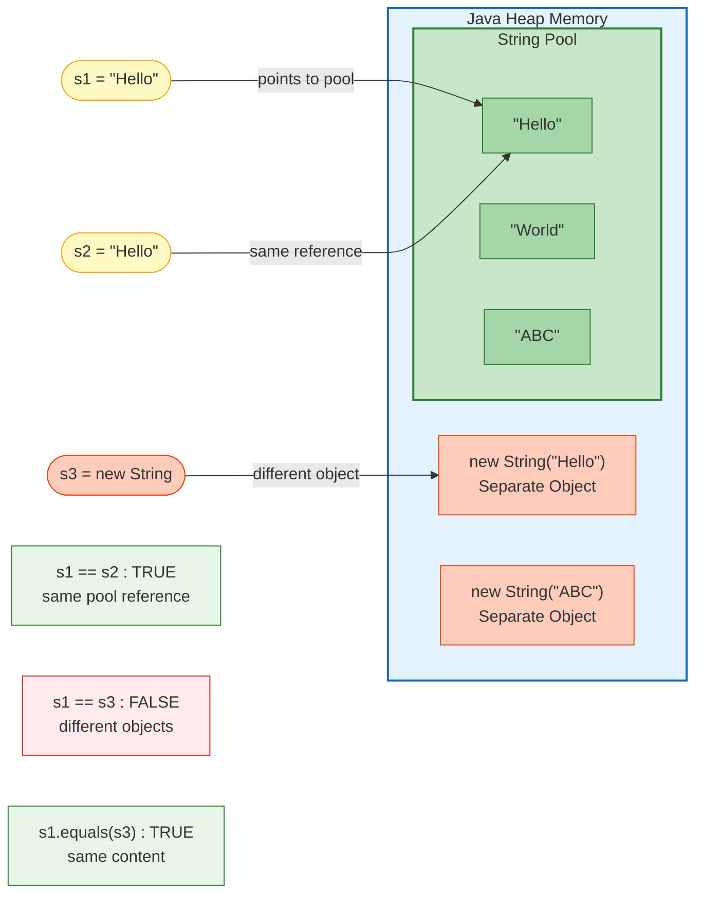

# Strings in Java

Strings are the most used data type in Java. Understanding how they work internally — immutability, String Pool, and comparison — is critical for interviews and writing efficient code.

---

## String Pool Diagram



## String vs StringBuilder vs StringBuffer — Decision Flowchart

```mermaid
flowchart TD
    START([Need to work with text?]) --> Q1{Will the string<br/>be modified?}

    Q1 -->|No - value is constant| STR[Use String<br/>Immutable, cached, safe]
    Q1 -->|Yes - building/modifying| Q2{Multiple threads<br/>accessing it?}

    Q2 -->|No - single thread| SB[Use StringBuilder<br/>Fastest, no sync overhead]
    Q2 -->|Yes - shared across threads| SBF[Use StringBuffer<br/>Synchronized, thread-safe]

    STR --> TIP1["Tip: String Pool saves memory<br/>hashCode is cached for HashMap keys"]
    SB --> TIP2["Tip: Use for loops, concatenation<br/>O(n) vs O(n squared) with String +"]
    SBF --> TIP3["Tip: Consider StringBuilder +<br/>external sync for better control"]

    style START fill:#4a148c,stroke:#4a148c,color:#ffffff
    style Q1 fill:#fff9c4,stroke:#f9a825
    style Q2 fill:#fff9c4,stroke:#f9a825
    style STR fill:#e3f2fd,stroke:#1565c0
    style SB fill:#e8f5e9,stroke:#2e7d32
    style SBF fill:#fff3e0,stroke:#e65100
    style TIP1 fill:#bbdefb,stroke:#1976d2
    style TIP2 fill:#c8e6c9,stroke:#388e3c
    style TIP3 fill:#ffe0b2,stroke:#f57c00
```



---

## Creating Strings — Two Ways

```java
String s1 = "Hello";             // String literal → goes to String Pool
String s2 = new String("Hello"); // new keyword → goes to Heap (separate object)
```

```
    String Pool (inside Heap)              Heap
    ─────────────────────────              ────
    ┌─────────┐
    │ "Hello" │ ◄─── s1 points here
    └─────────┘
                                    ┌──────────────┐
                                    │ String obj   │ ◄─── s2 points here
                                    │ value="Hello"│      (different object!)
                                    └──────────────┘
```

---

## Why Strings Are Immutable

Once a `String` is created, its value **cannot be changed**. Any modification creates a **new String object**.

```java
String s1 = "ABC";
s1 = "XYZ";  // s1 now points to a NEW object "XYZ"
              // "ABC" still exists in the pool (unchanged)
```

```
    Before:  s1 ──────► "ABC"
    After:   s1 ──────► "XYZ"   (new object)
                        "ABC"   (still in pool, no reference)
```

### Why Java made Strings immutable

| Reason | Explanation |
|---|---|
| **String Pool sharing** | Multiple variables can point to the same String safely |
| **Thread safety** | Immutable objects are inherently thread-safe |
| **Security** | Class names, URLs, file paths, passwords can't be tampered with |
| **hashCode caching** | hashCode is calculated once and cached — perfect for HashMap keys |
| **Class loading** | JVM loads classes by name (Strings) — mutation could break classloading |

---

## `==` vs `.equals()`

| Operator | Compares | Use for |
|---|---|---|
| `==` | **References** (memory addresses) | Checking if two variables point to the same object |
| `.equals()` | **Values** (character content) | Checking if two strings have the same text |

```java
String s1 = "ABC";
String s2 = "ABC";
String s3 = new String("ABC");

s1 == s2        // true  (same pool object)
s1 == s3        // false (different objects)
s1.equals(s3)   // true  (same value)
s1.equals(s2)   // true  (same value)
```

**Rule**: Always use `.equals()` to compare String values. Never use `==`.

---

## String Pool (intern())

The String Pool is a special memory area where Java stores **one copy of each unique literal**. This saves memory when the same string appears many times.

```java
String s1 = "Hello";
String s2 = "Hello";
// s1 == s2 → true (both point to the same pool entry)

String s3 = new String("Hello");
String s4 = s3.intern();  // adds to pool or returns existing entry
// s1 == s4 → true (intern() returns the pool reference)
```

---

## String vs StringBuilder vs StringBuffer

| Feature | String | StringBuilder | StringBuffer |
|---|---|---|---|
| Mutability | Immutable | Mutable | Mutable |
| Thread-safe | Yes (immutable) | No | Yes (synchronized) |
| Performance | Slow for concatenation | Fastest | Slower than StringBuilder |
| Use when | Value won't change | Single-threaded string building | Multi-threaded string building |

### Why StringBuilder matters

```java
// BAD — creates a new String object every iteration (O(n²) memory)
String result = "";
for (int i = 0; i < 10000; i++) {
    result += i + ", ";  // new String created each time!
}

// GOOD — modifies the same buffer (O(n) memory)
StringBuilder sb = new StringBuilder();
for (int i = 0; i < 10000; i++) {
    sb.append(i).append(", ");
}
String result = sb.toString();
```

The bad version creates ~10,000 intermediate String objects. The good version uses **one buffer**.

---

## Essential String Methods

```java
String s = "Hello, World!";

s.length()                    // 13
s.charAt(0)                   // 'H'
s.substring(0, 5)             // "Hello"
s.indexOf("World")            // 7
s.contains("World")           // true
s.toUpperCase()               // "HELLO, WORLD!"
s.toLowerCase()               // "hello, world!"
s.trim()                      // removes leading/trailing whitespace
s.strip()                     // Unicode-aware trim (Java 11+)
s.replace("World", "Java")   // "Hello, Java!"
s.split(", ")                 // ["Hello", "World!"]
s.startsWith("Hello")         // true
s.endsWith("!")               // true
s.isEmpty()                   // false
s.isBlank()                   // false (Java 11+)
s.toCharArray()               // char[] {'H','e','l','l','o',...}

String.valueOf(42)            // "42" (int to String)
String.join(", ", "a", "b")  // "a, b"
```

---

## Why `char[]` Is Preferred for Passwords

`String` stays in memory until GC collects it — you can't erase it. `char[]` can be **zeroed out manually**.

```java
char[] password = {'s', 'e', 'c', 'r', 'e', 't'};

// authenticate with password...

// Immediately clear from memory
Arrays.fill(password, '\0');
```

With `String`, the password sits in the String Pool (potentially for the entire JVM lifetime) and can be extracted from heap dumps.

---

## Creating an Immutable Class

If String is immutable because of its design, you can apply the same pattern to your own classes:

```java
public final class Money {
    private final String currency;
    private final double amount;
    private final List<String> tags;

    public Money(String currency, double amount, List<String> tags) {
        this.currency = currency;
        this.amount = amount;
        this.tags = new ArrayList<>(tags);  // defensive copy IN
    }

    public String getCurrency() { return currency; }
    public double getAmount() { return amount; }

    public List<String> getTags() {
        return Collections.unmodifiableList(tags);  // defensive copy OUT
    }
}
```

**Rules**: `final` class, `private final` fields, no setters, defensive copies for mutable objects (in constructor and getters).

---

## Interview Questions

??? question "1. How many String objects are created by `String s = new String(\"Hello\")`?"
    **Two** (if "Hello" doesn't already exist in the pool). One in the **String Pool** (for the literal "Hello") and one in the **Heap** (for the `new` keyword). If "Hello" is already in the pool, then only one new object is created on the heap.

??? question "2. What is the output?"
    ```java
    String s1 = "Hello";
    String s2 = "Hel" + "lo";
    System.out.println(s1 == s2);
    ```
    **Output**: `true`. The compiler performs **constant folding** — it evaluates `"Hel" + "lo"` at compile time to `"Hello"`. So both `s1` and `s2` point to the same pool entry. But if one part is a variable (e.g., `String a = "Hel"; String s2 = a + "lo";`), the result is `false` because concatenation with a variable happens at runtime.

??? question "3. Why is String a popular HashMap key?"
    Because String is **immutable**, its `hashCode()` is calculated once and **cached**. This makes HashMap lookups O(1) with minimal overhead. If String were mutable, changing a key after insertion would break the HashMap because it would be in the wrong bucket.

??? question "4. What happens when you call `intern()` on a String?"
    `intern()` checks the String Pool. If an equal string exists, it returns the pool reference. If not, it adds the string to the pool and returns that reference. This is useful for reducing memory when you have many duplicate strings (e.g., parsing a CSV where "USA" appears 1 million times).

??? question "5. Your application creates millions of small Strings in a loop and runs out of memory. How do you fix it?"
    Use `StringBuilder` to avoid creating intermediate String objects. If strings are duplicated, use `intern()` or a `HashSet` to deduplicate. For very large-scale string processing, consider `byte[]` instead of `String` to reduce memory (a `String` has ~40 bytes of overhead per instance). Profile with a heap dump and Eclipse MAT to identify the actual leak.
