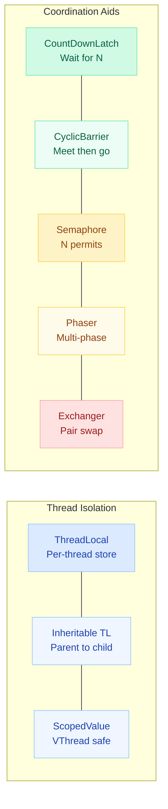
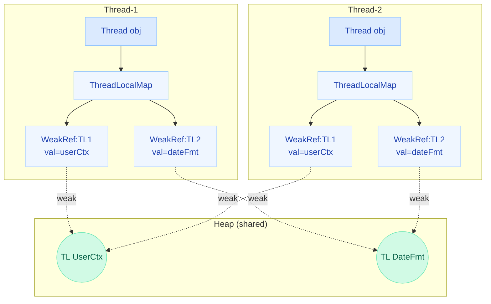
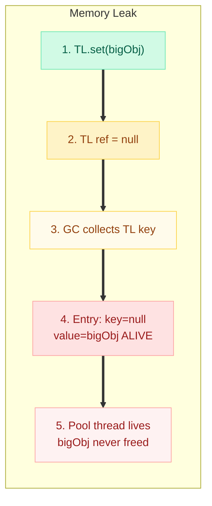
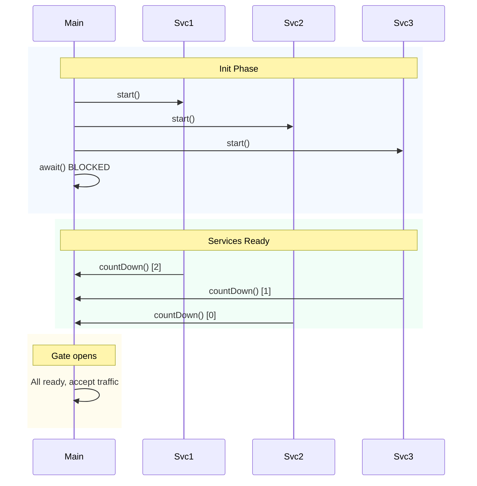
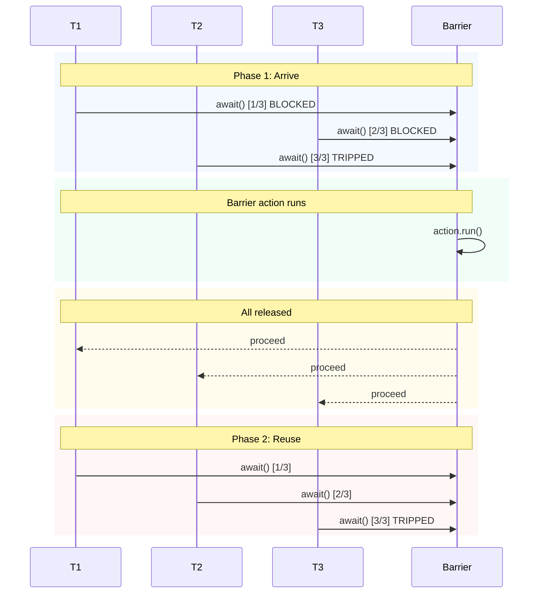
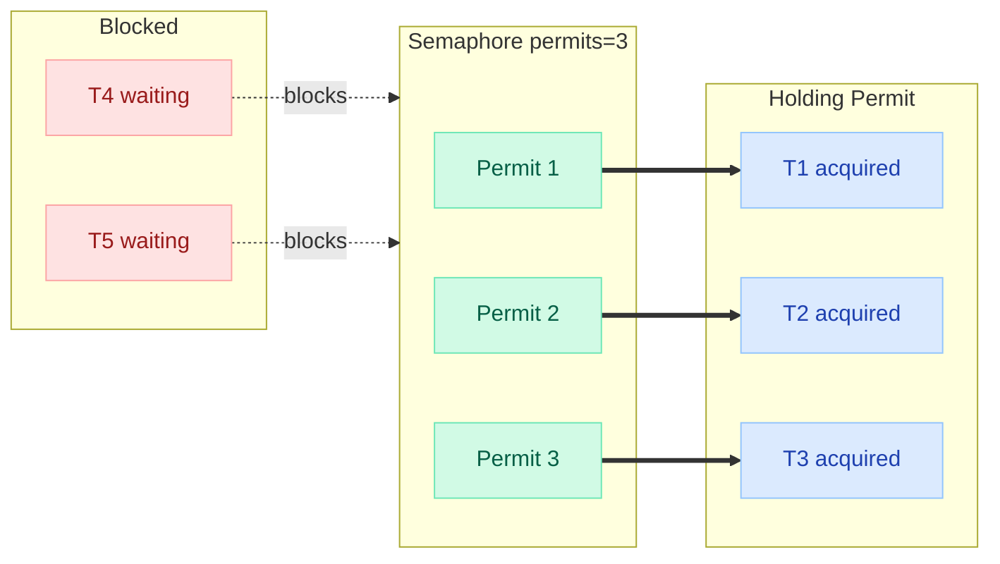
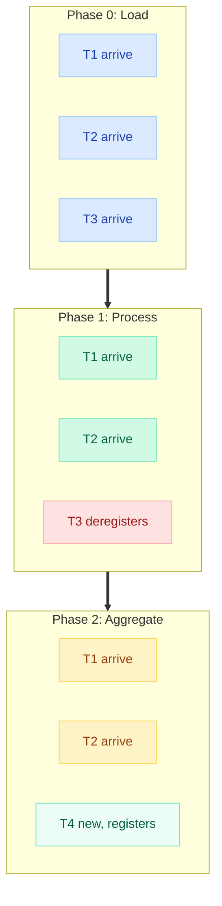
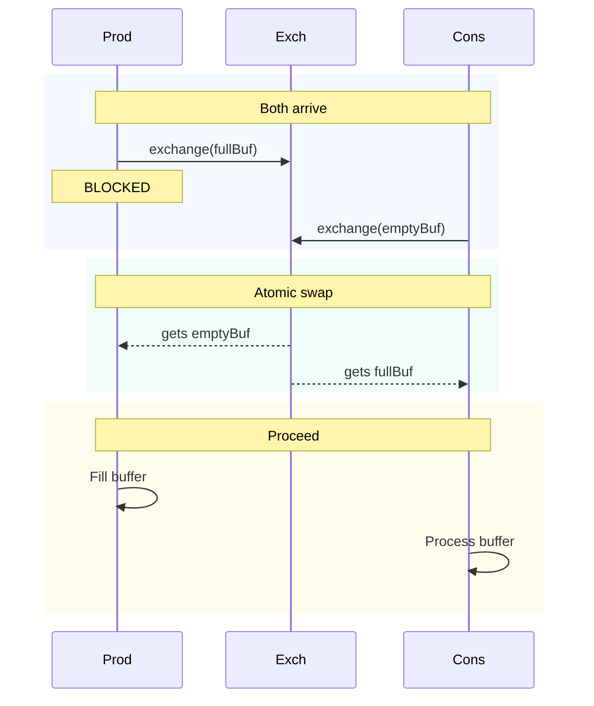

# ThreadLocal & Synchronization Aids

> "Shared mutable state is the root of all evil in concurrent programming. ThreadLocal eliminates sharing; synchronization aids coordinate it."

---

!!! danger "Production Incident: ThreadLocal Leak Crashes Payment Service"
    **Company:** A fintech startup processing 2M transactions/day  
    **What happened:** Developers stored `UserContext` in a ThreadLocal for request-scoped auth. In the Tomcat thread pool, threads are **reused** across requests. A developer forgot to call `.remove()` in one code path. Over 72 hours, each pooled thread accumulated stale `UserContext` objects (holding database connections, session data, and audit logs). The JVM heap grew from 2GB to 8GB. GC pauses exceeded 30 seconds. The payment service went OOM during peak traffic on Black Friday.  
    **Root cause:** ThreadLocal values are never GC'd while the thread is alive -- and in a pool, threads live **forever**.  
    **Fix:** Added a Servlet Filter that calls `ThreadLocal.remove()` in a `finally` block for every request.

---

## Overview: The Synchronization Toolkit



---

## ThreadLocal — Per-Thread Isolated Storage

### What Is It?

`ThreadLocal<T>` gives each thread its own **independent copy** of a variable. No synchronization needed because there is no sharing.

```java
// Each thread gets its own SimpleDateFormat -- no sharing, no race condition
private static final ThreadLocal<SimpleDateFormat> formatter =
    ThreadLocal.withInitial(() -> new SimpleDateFormat("yyyy-MM-dd"));

// Usage in any thread:
String date = formatter.get().format(new Date()); // thread-safe!
```

---

### Internal Mechanism: How ThreadLocal Actually Works



**Key insight:** The `ThreadLocalMap` is stored **inside** each `Thread` object. When you call `threadLocal.get()`, Java does:

```java
// Simplified pseudocode of ThreadLocal.get()
public T get() {
    Thread t = Thread.currentThread();
    ThreadLocalMap map = t.threadLocals;       // each thread has its own map
    Entry e = map.getEntry(this);              // 'this' = the ThreadLocal key
    return (T) e.value;
}
```

---

### Common Use Cases

| Use Case | Why ThreadLocal? |
|---|---|
| **SimpleDateFormat** | Not thread-safe; creating per-call is expensive |
| **Database Connections** | One connection per thread in a connection pool |
| **User/Request Context** | Spring Security stores `SecurityContext` in ThreadLocal |
| **Transaction Context** | Spring `@Transactional` binds connection to ThreadLocal |
| **MDC Logging** | SLF4J MDC stores correlation IDs per thread |
| **Random number generators** | `ThreadLocalRandom` avoids contention on shared seed |

---

### The Memory Leak Problem



**Why does this happen?**

- `ThreadLocalMap.Entry` extends `WeakReference<ThreadLocal<?>>` -- so the **key** is weak
- But the **value** is a strong reference!
- When the ThreadLocal object is GC'd, the key becomes `null`, but the value remains
- The Entry is never removed because nothing triggers cleanup
- In a thread pool, the thread (and its `ThreadLocalMap`) lives indefinitely

---

### The Fix: Always Call remove()

```java
// CORRECT pattern -- always clean up
private static final ThreadLocal<UserContext> userContext = new ThreadLocal<>();

public void handleRequest(HttpServletRequest request) {
    try {
        userContext.set(extractUser(request));
        // ... process request ...
        processBusinessLogic();
    } finally {
        userContext.remove();  // CRITICAL: prevents memory leak
    }
}
```

!!! warning "Rule of Thumb"
    If you `.set()` a ThreadLocal, you **must** `.remove()` it in a `finally` block. No exceptions. Treat it like closing a resource.

---

### InheritableThreadLocal

When a parent thread spawns a child thread, `InheritableThreadLocal` **copies** the parent's value to the child.

```java
private static final InheritableThreadLocal<String> requestId =
    new InheritableThreadLocal<>();

public void parentMethod() {
    requestId.set("REQ-12345");

    new Thread(() -> {
        System.out.println(requestId.get()); // "REQ-12345" -- inherited!
    }).start();
}
```

**Limitation:** Only works at child thread **creation** time. If the parent changes the value later, the child won't see the update.

---

### ThreadLocal vs Virtual Threads (Project Loom)

!!! danger "ThreadLocal is Problematic with Virtual Threads"
    Virtual threads are designed to be **millions** in number. If each virtual thread stores data in a ThreadLocal, you have millions of copies. The per-thread-instance model that worked with 200 platform threads breaks catastrophically with 2,000,000 virtual threads.

| Concern | Platform Threads | Virtual Threads |
|---|---|---|
| Thread count | ~200-500 | Millions |
| ThreadLocal memory | Manageable (200 copies) | Catastrophic (millions of copies) |
| Thread pooling | Common (reuse threads) | Unnecessary (cheap to create) |
| InheritableThreadLocal | Works (few children) | Breaks (structured concurrency) |

---

### ScopedValue (Java 21+ Preview)

`ScopedValue` is the replacement for ThreadLocal in virtual thread contexts:

```java
// Java 21+ (Preview)
private static final ScopedValue<UserContext> CURRENT_USER = ScopedValue.newInstance();

public void handleRequest(HttpServletRequest request) {
    UserContext user = extractUser(request);

    ScopedValue.runWhere(CURRENT_USER, user, () -> {
        // Any code here (and its callees) can read CURRENT_USER.get()
        processBusinessLogic();
        // Automatically unbound when lambda completes -- no leak possible!
    });
}
```

**Advantages over ThreadLocal:**

- Immutable within scope (cannot be changed by callees)
- Automatically cleaned up (no `.remove()` needed)
- Efficient with virtual threads (inherited via structured concurrency)
- No memory leak possible by design

---

## CountDownLatch — Wait for N Events

### Concept

A one-shot gate: one or more threads **wait** until a counter reaches zero. Other threads **count down**.



### Code Example

```java
public class ServiceInitializer {

    public static void main(String[] args) throws InterruptedException {
        int serviceCount = 3;
        CountDownLatch latch = new CountDownLatch(serviceCount);

        // Start services in parallel
        for (String svc : List.of("Database", "Cache", "MessageQueue")) {
            new Thread(() -> {
                try {
                    initializeService(svc);
                    System.out.println(svc + " ready!");
                } finally {
                    latch.countDown();  // signal completion
                }
            }).start();
        }

        latch.await();  // blocks until count == 0
        System.out.println("All services ready. Starting application...");
    }
}
```

!!! tip "Interview Key Points"
    - **One-shot only** -- once count reaches 0, it stays at 0 forever. Cannot be reset.
    - `countDown()` does NOT block -- only `await()` blocks.
    - Count can exceed number of threads (one thread can count down multiple times).
    - `await(timeout, unit)` variant avoids infinite blocking.

---

## CyclicBarrier — All Meet, Then Go

### Concept

N threads arrive at a barrier point and **all wait** until the last one arrives. Then all are released simultaneously. Unlike CountDownLatch, it is **reusable**.



### Code Example

```java
public class ParallelMatrixMultiply {

    public static void main(String[] args) {
        int workers = 4;
        CyclicBarrier barrier = new CyclicBarrier(workers, () -> {
            // This runs after ALL threads arrive (barrier action)
            System.out.println("--- Phase complete. Merging results. ---");
        });

        for (int i = 0; i < workers; i++) {
            final int workerId = i;
            new Thread(() -> {
                try {
                    // Phase 1: compute partial result
                    computePartialResult(workerId);
                    barrier.await();  // wait for all workers

                    // Phase 2: read merged results, compute next phase
                    computeNextPhase(workerId);
                    barrier.await();  // barrier reused!

                } catch (InterruptedException | BrokenBarrierException e) {
                    Thread.currentThread().interrupt();
                }
            }).start();
        }
    }
}
```

### CountDownLatch vs CyclicBarrier

| Feature | CountDownLatch | CyclicBarrier |
|---|---|---|
| **Reusable?** | No (one-shot) | Yes (resets after tripping) |
| **Who waits?** | Any thread calls `await()` | The participating threads themselves |
| **Who counts?** | Any thread calls `countDown()` | Each participating thread calls `await()` |
| **Barrier action?** | No | Yes (Runnable on trip) |
| **Typical use** | "Wait for N events to happen" | "N threads synchronize at a point" |
| **Broken state?** | No | Yes (`BrokenBarrierException`) |

---

## Semaphore — Permit Pool

### Concept

A semaphore maintains a set of **permits**. Threads `acquire()` a permit before accessing a resource, and `release()` it when done. If no permits are available, `acquire()` blocks.



### Code Example

```java
public class ConnectionPool {
    private final Semaphore semaphore;
    private final BlockingQueue<Connection> pool;

    public ConnectionPool(int maxConnections) {
        this.semaphore = new Semaphore(maxConnections, true); // fair=true
        this.pool = new LinkedBlockingQueue<>();
        for (int i = 0; i < maxConnections; i++) {
            pool.add(createConnection());
        }
    }

    public Connection acquire() throws InterruptedException {
        semaphore.acquire();        // blocks if no permits available
        return pool.poll();         // safe -- permit guarantees availability
    }

    public void release(Connection conn) {
        pool.offer(conn);
        semaphore.release();        // return permit
    }
}
```

### Use Cases

| Use Case | Permits | Purpose |
|---|---|---|
| **Connection pool** | N connections | Limit concurrent DB connections |
| **Rate limiter** | N per window | Throttle API calls |
| **Resource limiting** | N workers | Cap parallel file downloads |
| **Binary semaphore** | 1 | Mutual exclusion (like a lock) |

### Binary Semaphore vs Mutex (Lock)

| Feature | Binary Semaphore (permits=1) | ReentrantLock (Mutex) |
|---|---|---|
| **Owner** | No ownership -- any thread can release | Only the owner thread can unlock |
| **Reentrant** | No -- acquiring twice deadlocks | Yes -- same thread can lock multiple times |
| **Use case** | Signaling between threads | Protecting critical sections |
| **Release by other thread?** | Yes (dangerous but valid) | No (IllegalMonitorStateException) |

!!! tip "Interview Insight"
    "Can a thread release a semaphore it didn't acquire?" -- **Yes!** This is a key difference from locks. It makes semaphores suitable for **signaling** (one thread signals another to proceed) but dangerous if misused.

---

## Phaser — Dynamic Multi-Phase Synchronization

### Concept

A `Phaser` is like a `CyclicBarrier` on steroids:

- Supports **dynamic registration/deregistration** of parties
- Supports **multiple phases** (numbered 0, 1, 2, ...)
- Parties can arrive and **choose** to advance or deregister



### Code Example

```java
public class PhasedComputation {

    public static void main(String[] args) {
        Phaser phaser = new Phaser(1); // register self (main thread)

        for (int i = 0; i < 3; i++) {
            phaser.register();  // dynamically add party
            final int id = i;
            new Thread(() -> {
                // Phase 0
                System.out.println("Worker-" + id + " loading data");
                phaser.arriveAndAwaitAdvance(); // wait for all

                // Phase 1
                System.out.println("Worker-" + id + " processing");
                phaser.arriveAndAwaitAdvance();

                // Phase 2 -- Worker-2 drops out
                if (id == 2) {
                    phaser.arriveAndDeregister(); // leave gracefully
                    return;
                }
                System.out.println("Worker-" + id + " aggregating");
                phaser.arriveAndAwaitAdvance();
            }).start();
        }

        // Main thread coordinates
        phaser.arriveAndAwaitAdvance(); // Phase 0
        phaser.arriveAndAwaitAdvance(); // Phase 1
        phaser.arriveAndDeregister();   // Main leaves
    }
}
```

### Phaser vs CyclicBarrier

| Feature | CyclicBarrier | Phaser |
|---|---|---|
| **Fixed parties** | Yes (set at construction) | No (dynamic register/deregister) |
| **Phase count** | Unlimited (auto-reset) | Unlimited (numbered phases) |
| **Dynamic join/leave** | No | Yes (`register()` / `arriveAndDeregister()`) |
| **Tiered/tree structure** | No | Yes (parent phasers for scalability) |
| **Termination** | No built-in | `isTerminated()` when parties reach 0 |

---

## Exchanger — Two-Thread Rendezvous

### Concept

An `Exchanger` allows exactly **two threads** to swap objects at a synchronization point. Each thread presents an object and receives the other thread's object.



### Code Example

```java
public class PipelineWithExchanger {

    public static void main(String[] args) {
        Exchanger<List<String>> exchanger = new Exchanger<>();

        // Producer: fills buffer, swaps for empty one
        new Thread(() -> {
            List<String> buffer = new ArrayList<>();
            while (true) {
                buffer.add(generateData());
                if (buffer.size() == 100) {
                    try {
                        buffer = exchanger.exchange(buffer); // swap full for empty
                        buffer.clear(); // reuse received empty buffer
                    } catch (InterruptedException e) {
                        Thread.currentThread().interrupt();
                        break;
                    }
                }
            }
        }).start();

        // Consumer: processes buffer, swaps empty one back
        new Thread(() -> {
            List<String> buffer = new ArrayList<>();
            while (true) {
                try {
                    buffer = exchanger.exchange(buffer); // swap empty for full
                    buffer.forEach(PipelineWithExchanger::process);
                    buffer.clear();
                } catch (InterruptedException e) {
                    Thread.currentThread().interrupt();
                    break;
                }
            }
        }).start();
    }
}
```

!!! tip "When to Use Exchanger"
    - Double-buffering (producer fills one buffer while consumer drains the other)
    - Genetic algorithms (two threads swap chromosomes for crossover)
    - Pipeline stages that need to swap work batches

---

## Comparison Table: All Synchronization Aids

| Aid | Reusable? | Parties | Blocks Who? | One-Liner |
|---|---|---|---|---|
| **CountDownLatch** | No | Fixed N | `await()` caller | "Wait until N events happen" |
| **CyclicBarrier** | Yes | Fixed N | All N parties | "N threads meet at a point, then all go" |
| **Semaphore** | Yes | N permits | `acquire()` when empty | "At most N threads access resource" |
| **Phaser** | Yes | Dynamic | `arriveAndAwaitAdvance()` | "Multi-phase barrier with dynamic parties" |
| **Exchanger** | Yes | Exactly 2 | `exchange()` caller | "Two threads swap objects" |

---

## Quick Recall Table

| Concept | Key Point | Danger |
|---|---|---|
| **ThreadLocal** | Per-thread storage, no sync needed | Memory leak if not `.remove()`'d in pools |
| **WeakReference key** | ThreadLocal key is weak in Entry | Value is strong -- leaked when key GC'd |
| **InheritableThreadLocal** | Copy parent value to child thread | Only at creation time; millions of copies with virtual threads |
| **ScopedValue** | Immutable, auto-cleanup, virtual-thread safe | Preview API (Java 21+) |
| **CountDownLatch** | One-shot; `countDown()` + `await()` | Cannot reset -- create new one |
| **CyclicBarrier** | Reusable; all parties call `await()` | `BrokenBarrierException` if one thread fails |
| **Semaphore** | Permit pool; `acquire()`/`release()` | Any thread can release (no ownership) |
| **Phaser** | Dynamic parties; numbered phases | More complex API, use only when needed |
| **Exchanger** | Exactly 2 threads swap objects | Deadlock if partner never arrives |

---

## Interview Answer Template

!!! success "When asked: 'What is ThreadLocal and when would you use it?'"
    **Opening:** "ThreadLocal provides thread-confined storage -- each thread gets its own independent copy of a variable, eliminating the need for synchronization."

    **Mechanism:** "Internally, each Thread holds a ThreadLocalMap where the ThreadLocal instance is the key (stored as a WeakReference) and the value is the per-thread data."

    **Use cases:** "Common uses include SimpleDateFormat (which isn't thread-safe), request-scoped context in web apps (Spring Security uses this), MDC for logging correlation IDs, and transaction management."

    **Danger:** "The critical pitfall is memory leaks in thread pools. Since pool threads live indefinitely, ThreadLocal values are never GC'd. You must always call .remove() in a finally block."

    **Modern alternative:** "In Java 21+ with virtual threads, ScopedValue replaces ThreadLocal -- it's immutable within its scope, auto-cleaned, and efficient with millions of virtual threads."

!!! success "When asked: 'Explain the difference between CountDownLatch and CyclicBarrier'"
    **Opening:** "Both coordinate multiple threads, but they solve different problems."

    **CountDownLatch:** "It's a one-shot gate. One or more threads wait (await) for N events (countDown). The waiting threads and counting threads can be different. Cannot be reused."

    **CyclicBarrier:** "It's a reusable meeting point. N threads all call await(), and ALL block until the last one arrives. Then all are released together. It can also run a barrier action when tripped."

    **Key difference:** "CountDownLatch separates 'waiters' from 'signalers'. CyclicBarrier requires all parties to be both -- every thread is a participant that waits."

!!! success "When asked: 'How does Semaphore differ from a lock?'"
    **Opening:** "A semaphore manages a pool of permits; a lock provides mutual exclusion with ownership."

    **Key differences:** "A semaphore has no concept of ownership -- any thread can release a permit, even one it didn't acquire. Locks are reentrant (same thread can lock twice); binary semaphores are not. Semaphores are for resource limiting and signaling; locks are for protecting critical sections."

    **Example:** "Use a semaphore with 10 permits to limit concurrent database connections. Use a lock to protect a shared data structure from concurrent modification."

---

## Common Interview Questions

??? question "Can ThreadLocal cause memory leaks? How?"
    Yes. In thread pools, the thread lives forever. ThreadLocalMap entries have a WeakReference to the key (ThreadLocal), but a **strong reference** to the value. If the ThreadLocal is GC'd, the key becomes null but the value is still reachable through the living thread's map. Solution: always call `remove()` in `finally`.

??? question "Why is ThreadLocal problematic with virtual threads?"
    Virtual threads are meant to be cheap and plentiful (millions). ThreadLocal creates per-thread copies -- with millions of threads, that means millions of copies of whatever you store. Additionally, virtual threads are not pooled, so the "cleanup in finally" pattern is less about leaks and more about memory consumption. `ScopedValue` solves this by being inherited via structured concurrency without copying.

??? question "Can you reset a CountDownLatch?"
    No. Once it reaches zero, it stays at zero. If you need a resettable latch, use `CyclicBarrier` or `Phaser`.

??? question "What happens if a CyclicBarrier party throws an exception?"
    All other waiting threads receive a `BrokenBarrierException`. The barrier enters a **broken** state and cannot be used again until `reset()` is called.

??? question "Can you implement a CountDownLatch using a Semaphore?"
    Yes! Initialize a semaphore with 0 permits. Waiting threads call `acquire(N)`. Signaling threads call `release()` N times. When N permits become available, the waiter proceeds.
