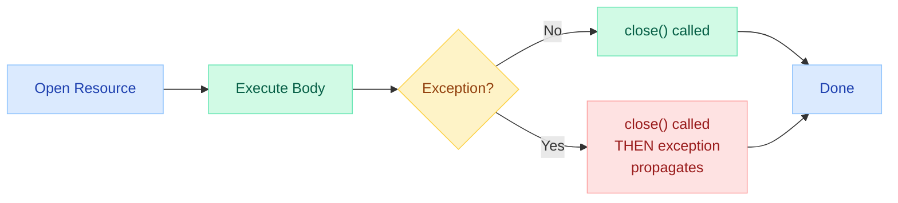
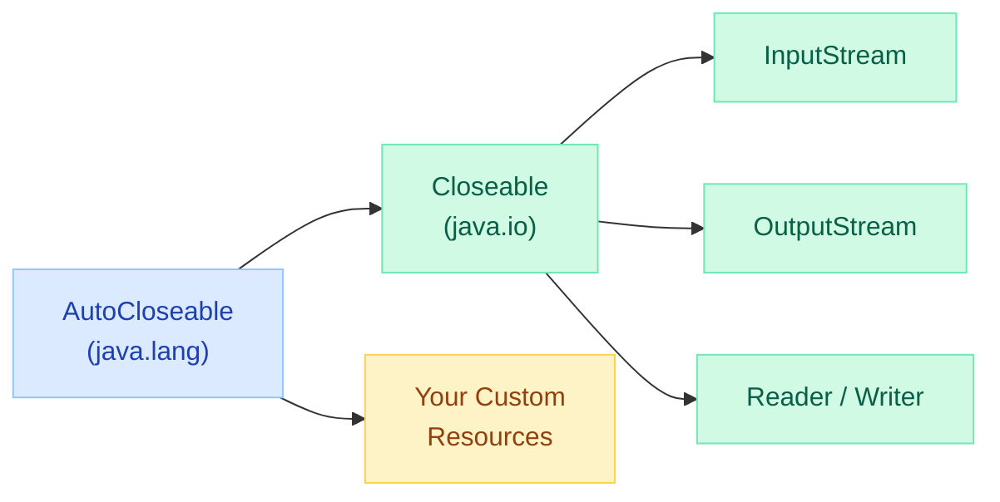
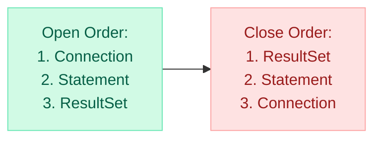
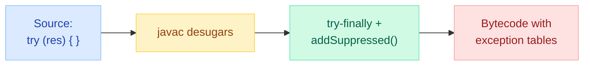

# Try-With-Resources & AutoCloseable — Deep Dive

> **"The most dangerous line of code is the one you forgot to write — and in Java, that's usually `resource.close()`."**

!!! danger "Real Incident: Connection Pool Exhaustion at Scale"
    A production microservice handling 5,000 req/s started returning HTTP 503 errors after 2 hours. Root cause: a single code path acquired a JDBC `Connection` but threw an exception before reaching the `finally` block that called `close()`. The connection pool (HikariCP, max 50) was exhausted in under 2 hours. Fix: wrapping the connection in `try-with-resources` — a one-line change that would have prevented a 45-minute outage.

    ```java
    // THE BUG — exception on line 3 skips close()
    Connection conn = dataSource.getConnection();
    PreparedStatement ps = conn.prepareStatement(sql);
    validate(params);  // throws IllegalArgumentException — conn leaked!
    // ... conn.close() never reached
    ```

---

## Before Try-With-Resources (Java 6 Pattern)

The old way required verbose `finally` blocks with null checks and nested try-catch:

```java
// Java 6 — verbose and error-prone
InputStream in = null;
OutputStream out = null;
try {
    in = new FileInputStream("source.txt");
    out = new FileOutputStream("dest.txt");
    byte[] buf = new byte[8192];
    int len;
    while ((len = in.read(buf)) != -1) {
        out.write(buf, 0, len);
    }
} catch (IOException e) {
    log.error("Copy failed", e);
} finally {
    // Ugly, error-prone cleanup
    if (out != null) {
        try {
            out.close();  // can throw — might mask original exception!
        } catch (IOException e) {
            log.warn("Failed to close output", e);
        }
    }
    if (in != null) {
        try {
            in.close();
        } catch (IOException e) {
            log.warn("Failed to close input", e);
        }
    }
}
```

**Problems with this approach:**

| Problem | Impact |
|---|---|
| Close exception masks original exception | Debugging nightmare — you see the wrong error |
| Forgot one close in a multi-resource block | Resource leak, pool exhaustion |
| Null checks add noise | Easy to introduce bugs |
| Close order matters but not enforced | Subtle bugs in complex chains |

---

## Try-With-Resources Syntax (Java 7+)



```java
// Java 7+ — clean, safe, guaranteed close
try (InputStream in = new FileInputStream("source.txt");
     OutputStream out = new FileOutputStream("dest.txt")) {

    byte[] buf = new byte[8192];
    int len;
    while ((len = in.read(buf)) != -1) {
        out.write(buf, 0, len);
    }

} catch (IOException e) {
    log.error("Copy failed", e);
}
// Both streams GUARANTEED closed, even if body throws
// Close order: out first, then in (reverse declaration order)
```

**Key guarantees:**

- Resources are closed in **reverse declaration order**
- `close()` is called even if the body throws
- If `close()` throws, it does NOT mask the original exception (suppressed instead)
- Null resources: if constructor throws, partially-opened resources are still closed

---

## AutoCloseable vs Closeable



| Feature | `AutoCloseable` | `Closeable` |
|---|---|---|
| Package | `java.lang` | `java.io` |
| Since | Java 7 | Java 5 (retrofitted in 7) |
| `close()` throws | `Exception` (any checked) | `IOException` only |
| Idempotent requirement | No (but recommended) | Yes (`close()` must be idempotent) |
| Use when | Custom resources (DB connections, locks, HTTP clients) | I/O streams, readers, writers |
| Relationship | **Parent** interface | **Extends** `AutoCloseable` |

```java
// AutoCloseable — more general, allows any exception
public interface AutoCloseable {
    void close() throws Exception;
}

// Closeable — I/O specific, idempotent requirement
public interface Closeable extends AutoCloseable {
    void close() throws IOException;
}
```

!!! tip "Which to implement?"
    - If your resource involves I/O and `close()` can only throw `IOException` → implement `Closeable`
    - If your resource is non-I/O (lock, transaction, scope) → implement `AutoCloseable`
    - Both work with try-with-resources

---

## Suppressed Exceptions Mechanism

When the try body AND `close()` both throw, Java attaches the close exception as a **suppressed** exception on the primary exception. This prevents exception masking.


```java
public class SuppressedExceptionDemo {

    static class FaultyResource implements AutoCloseable {
        void doWork() {
            throw new RuntimeException("Primary: work failed");
        }

        @Override
        public void close() {
            throw new RuntimeException("Secondary: close failed");
        }
    }

    public static void main(String[] args) {
        try (FaultyResource res = new FaultyResource()) {
            res.doWork();  // throws primary
        } catch (RuntimeException e) {
            System.out.println(e.getMessage());
            // Output: "Primary: work failed"

            Throwable[] suppressed = e.getSuppressed();
            for (Throwable t : suppressed) {
                System.out.println("  Suppressed: " + t.getMessage());
                // Output: "  Suppressed: Secondary: close failed"
            }
        }
    }
}
```

**Contrast with Java 6 behavior** — the old `finally` pattern would have LOST the primary exception entirely if `close()` threw.

---

## Effectively-Final Variables (Java 9+)

Java 9 allows pre-existing, effectively-final variables in the try header — you no longer need to declare them inline.

```java
// Java 7-8: MUST declare resources in try()
try (BufferedReader br = new BufferedReader(new FileReader("data.txt"))) {
    // ...
}

// Java 9+: can reference effectively-final variables
BufferedReader br = new BufferedReader(new FileReader("data.txt"));
// br is effectively final (never reassigned)
try (br) {
    return br.readLine();
}
// br.close() still called automatically
```

**Use case**: when you receive a resource from a method parameter or factory.

```java
// Java 9+ — useful for resources passed into methods
public void processStream(InputStream input) {
    // input is effectively final (method parameter)
    try (input) {
        byte[] data = input.readAllBytes();
        process(data);
    } catch (IOException e) {
        throw new UncheckedIOException(e);
    }
}
```

!!! warning "Pitfall"
    If you reassign the variable, it is no longer effectively-final and the compiler rejects it:
    ```java
    InputStream in = new FileInputStream("a.txt");
    in = new FileInputStream("b.txt");  // reassigned!
    try (in) { }  // COMPILE ERROR: variable 'in' is not effectively final
    ```

---

## Multiple Resources — Close Order is Reverse

Resources are closed in **reverse declaration order** — the last declared is closed first.



```java
// Resources closed in reverse: rs -> ps -> conn
try (Connection conn = dataSource.getConnection();
     PreparedStatement ps = conn.prepareStatement("SELECT * FROM users WHERE id = ?");
     ResultSet rs = executePrepared(ps, userId)) {

    while (rs.next()) {
        users.add(mapRow(rs));
    }
}
// Close order: rs.close() → ps.close() → conn.close()
// This is correct! Inner resources closed before outer ones.

private ResultSet executePrepared(PreparedStatement ps, long id) throws SQLException {
    ps.setLong(1, id);
    return ps.executeQuery();
}
```

**Why reverse order matters**: Inner resources (ResultSet) depend on outer ones (Connection). Closing Connection first would invalidate the ResultSet, potentially causing errors during ResultSet.close().

---

## Custom AutoCloseable Implementation

```java
/**
 * A distributed lock that auto-releases when try block exits.
 */
public class DistributedLock implements AutoCloseable {

    private final RedisCommands<String, String> redis;
    private final String lockKey;
    private final String lockValue;
    private volatile boolean released = false;

    private DistributedLock(RedisCommands<String, String> redis, String key, String value) {
        this.redis = redis;
        this.lockKey = key;
        this.lockValue = value;
    }

    public static DistributedLock acquire(RedisCommands<String, String> redis,
                                          String key, Duration timeout) {
        String value = UUID.randomUUID().toString();
        boolean acquired = redis.set(key, value, SetArgs.Builder.nx().ex(timeout));
        if (!acquired) {
            throw new LockAcquisitionException("Could not acquire lock: " + key);
        }
        return new DistributedLock(redis, key, value);
    }

    @Override
    public void close() {
        if (!released) {
            released = true;
            // Lua script for atomic check-and-delete
            String script = "if redis.call('get',KEYS[1]) == ARGV[1] then " +
                            "return redis.call('del',KEYS[1]) else return 0 end";
            redis.eval(script, ScriptOutputType.INTEGER,
                       new String[]{lockKey}, lockValue);
        }
    }
}

// Usage — lock auto-released even if exception occurs
try (DistributedLock lock = DistributedLock.acquire(redis, "order:123", Duration.ofSeconds(30))) {
    processOrder("123");
}  // lock.close() called automatically
```

---

## Connection Pool Close Patterns

```java
// HikariCP — DataSource itself is AutoCloseable
HikariDataSource ds = new HikariDataSource(config);

// Application shutdown hook
Runtime.getRuntime().addShutdownHook(new Thread(() -> {
    if (ds != null && !ds.isClosed()) {
        ds.close();  // waits for active connections to return, then closes pool
    }
}));

// Spring Boot — DataSource is managed by the container, closed on context shutdown
// No manual close needed in Spring apps

// Per-request pattern — connection returned to pool on close()
public List<User> findAll() {
    try (Connection conn = dataSource.getConnection();
         Statement stmt = conn.createStatement();
         ResultSet rs = stmt.executeQuery("SELECT * FROM users")) {

        List<User> users = new ArrayList<>();
        while (rs.next()) {
            users.add(mapRow(rs));
        }
        return users;
    } catch (SQLException e) {
        throw new DataAccessException("Query failed", e);
    }
    // conn.close() returns connection to pool (NOT actual TCP close)
}
```

!!! info "Pool vs Physical Close"
    When you call `close()` on a pooled connection, it does NOT close the TCP socket. It **returns** the connection to the pool. The pool wrapper implements `AutoCloseable` and overrides `close()` to mean "return to pool."

---

## Common Pitfalls

### Pitfall 1: Closing a Null Resource

```java
// Safe — if constructor throws, no resource to close
try (Connection conn = getConnection()) {  // returns null!
    conn.prepareStatement(sql);  // NullPointerException
}
// conn is null → close() is NOT called (spec says: skip if null)
// But NPE in the body is the real bug
```

!!! warning "Null from factory methods"
    Try-with-resources handles null safely (no NPE on close), but your code inside the try body will still NPE. Always validate or use `Optional`.

### Pitfall 2: Double Close

```java
// BAD — manually closing AND try-with-resources closes it
try (InputStream in = new FileInputStream("data.txt")) {
    process(in);
    in.close();  // WRONG — will be closed again at end of try block
}
// in.close() called TWICE — safe for Closeable (idempotent), but
// NOT guaranteed safe for all AutoCloseable implementations!
```

**Rule**: Never manually call `close()` inside a try-with-resources block.

### Pitfall 3: Resource Declared Outside try (Java 7/8)

```java
// COMPILE ERROR in Java 7/8
BufferedReader br = new BufferedReader(new FileReader("f.txt"));
try (br) { }  // Error: resource must be declared in try header
// Fixed in Java 9+ (effectively-final variables)
```

### Pitfall 4: Wrapping Constructors

```java
// DANGER — if BufferedInputStream constructor throws, fis is leaked
try (BufferedInputStream bis = new BufferedInputStream(new FileInputStream("x.txt"))) {
    // ...
}
// If BufferedInputStream constructor throws (e.g., invalid arg),
// FileInputStream was already opened but won't be closed!

// SAFE — declare each resource separately
try (FileInputStream fis = new FileInputStream("x.txt");
     BufferedInputStream bis = new BufferedInputStream(fis)) {
    // ...
}
// fis is closed even if BufferedInputStream constructor fails
```

---

## How the Compiler Desugars Try-With-Resources

The compiler transforms try-with-resources into equivalent `try-finally` code with proper suppressed exception handling.

**Source code:**

```java
try (Resource res = new Resource()) {
    res.doWork();
}
```

**Compiler-generated equivalent (bytecode view):**

```java
Resource res = new Resource();
Throwable primaryEx = null;
try {
    res.doWork();
} catch (Throwable t) {
    primaryEx = t;
    throw t;
} finally {
    if (res != null) {
        if (primaryEx != null) {
            try {
                res.close();
            } catch (Throwable suppressed) {
                primaryEx.addSuppressed(suppressed);  // attach, don't mask!
            }
        } else {
            res.close();  // no primary exception — close normally
        }
    }
}
```



You can verify this with `javap -c YourClass.class` — look for the exception table entries and `addSuppressed` invocations.

---

## Real-World Usage Patterns

### JDBC

```java
public Optional<User> findById(long id) {
    String sql = "SELECT id, name, email FROM users WHERE id = ?";
    try (Connection conn = dataSource.getConnection();
         PreparedStatement ps = conn.prepareStatement(sql)) {

        ps.setLong(1, id);
        try (ResultSet rs = ps.executeQuery()) {
            if (rs.next()) {
                return Optional.of(new User(rs.getLong("id"),
                                            rs.getString("name"),
                                            rs.getString("email")));
            }
        }
        return Optional.empty();

    } catch (SQLException e) {
        throw new DataAccessException("findById failed for id=" + id, e);
    }
}
```

### File I/O with NIO

```java
// Reading all lines (small files)
try (Stream<String> lines = Files.lines(Path.of("server.log"))) {
    long errorCount = lines.filter(l -> l.contains("ERROR")).count();
    log.info("Found {} errors", errorCount);
}
// Stream<String> implements AutoCloseable — closes underlying file handle

// Writing with BufferedWriter
try (BufferedWriter writer = Files.newBufferedWriter(
        Path.of("output.csv"), StandardCharsets.UTF_8,
        StandardOpenOption.CREATE, StandardOpenOption.TRUNCATE_EXISTING)) {

    writer.write("id,name,email");
    writer.newLine();
    for (User u : users) {
        writer.write(u.toCsv());
        writer.newLine();
    }
}
```

### HTTP Clients (Java 11+ HttpClient)

```java
// HttpClient itself is NOT AutoCloseable (shared, long-lived)
// But InputStream from response body IS
HttpClient client = HttpClient.newHttpClient();
HttpRequest request = HttpRequest.newBuilder()
        .uri(URI.create("https://api.example.com/data"))
        .build();

HttpResponse<InputStream> response = client.send(request,
        HttpResponse.BodyHandlers.ofInputStream());

try (InputStream body = response.body()) {
    JsonNode json = objectMapper.readTree(body);
    return json.get("result").asText();
}
```

### Locks as AutoCloseable

```java
public class CloseableLock implements AutoCloseable {
    private final Lock lock;

    public CloseableLock(Lock lock) {
        this.lock = lock;
        this.lock.lock();  // acquire on construction
    }

    @Override
    public void close() {
        lock.unlock();  // release on close
    }

    public static CloseableLock acquire(Lock lock) {
        return new CloseableLock(lock);
    }
}

// Usage — no more try-finally for lock/unlock
private final Lock lock = new ReentrantLock();

public void transferFunds(Account from, Account to, BigDecimal amount) {
    try (CloseableLock l = CloseableLock.acquire(lock)) {
        from.debit(amount);
        to.credit(amount);
    }  // lock.unlock() guaranteed
}
```

### Spring JdbcTemplate (Framework-Managed)

```java
// Spring manages connections internally — you never see try-with-resources
// But under the hood, JdbcTemplate does exactly this pattern
@Repository
public class UserRepository {
    private final JdbcTemplate jdbc;

    public List<User> findActive() {
        return jdbc.query("SELECT * FROM users WHERE active = true",
            (rs, rowNum) -> new User(rs.getLong("id"), rs.getString("name")));
        // JdbcTemplate handles: getConnection → prepareStatement → executeQuery
        //                       → close ResultSet → close Statement → close Connection
    }
}
```

---

## Interview Questions

???+ example "What happens if both the try body and close() throw exceptions?"
    "The exception from the try body is the **primary** exception that propagates. The exception from `close()` is **suppressed** — it's attached to the primary via `addSuppressed()`. You can retrieve it with `primaryException.getSuppressed()`. This prevents the old Java 6 problem where a close exception would mask the real error. The compiler generates code equivalent to a try-finally with `addSuppressed()` calls."

???+ example "What is the difference between AutoCloseable and Closeable?"
    "Closeable extends AutoCloseable. The key differences: Closeable restricts `close()` to throw only `IOException` and **requires** idempotency (calling close twice must be safe). AutoCloseable allows `close()` to throw any `Exception` and does not mandate idempotency (though it's strongly recommended). Use Closeable for I/O resources, AutoCloseable for general resources like locks, connections, or scoped contexts."

???+ example "In what order are multiple resources closed?"
    "Resources are closed in **reverse declaration order**. If you declare Connection, then PreparedStatement, then ResultSet — they close as ResultSet, PreparedStatement, Connection. This matches the natural dependency order: inner/dependent resources should be released before outer ones. The compiler generates nested try-finally blocks to ensure this."

???+ example "Can you use try-with-resources with a resource you didn't create in the try header?"
    "Yes, since Java 9. The variable must be **effectively final** — meaning it's never reassigned after initialization. This is useful when a resource is passed as a method parameter or returned from a factory method. In Java 7/8, you had to declare the resource in the try parentheses."

???+ example "How would you implement a custom AutoCloseable?"
    "I'd implement `AutoCloseable` and override `close()` to release whatever underlying resource my class wraps. Key design decisions: (1) make `close()` idempotent with a boolean flag, (2) make the class work with try-with-resources by ensuring the constructor fully initializes the resource, (3) consider thread safety if the resource might be shared. Example: a DistributedLock that acquires on construction and releases atomically in `close()`."

???+ example "What happens if the resource is null in try-with-resources?"
    "If the resource reference is null, `close()` is simply not called — no NullPointerException on close. The JLS specifies that the generated finally block includes a null check before calling close. However, if you try to USE the null resource inside the try body, you'll still get an NPE from your own code."

---

## Quick Recall

| Topic | Key Point |
|---|---|
| Java 6 problem | `finally` close can mask original exception; verbose null checks |
| try-with-resources since | Java 7 |
| Interface required | `AutoCloseable` (or its subtype `Closeable`) |
| Close order | **Reverse** declaration order |
| Suppressed exceptions | Close exception attached via `addSuppressed()`, primary propagates |
| `getSuppressed()` | Returns `Throwable[]` of all suppressed exceptions |
| Effectively-final in try | Java 9+ feature |
| AutoCloseable vs Closeable | Closeable is for I/O, requires idempotent close, throws only IOException |
| Null resource | `close()` is NOT called (null check in generated code) |
| Double close safety | Guaranteed for `Closeable`; NOT guaranteed for `AutoCloseable` |
| Compiler desugaring | Generates try-finally + `addSuppressed()` |
| Pooled connections | `close()` returns to pool, not physical TCP close |
| Best practice | Declare each resource separately to avoid constructor leak |
| Never do | Manually call `close()` inside a try-with-resources block |
