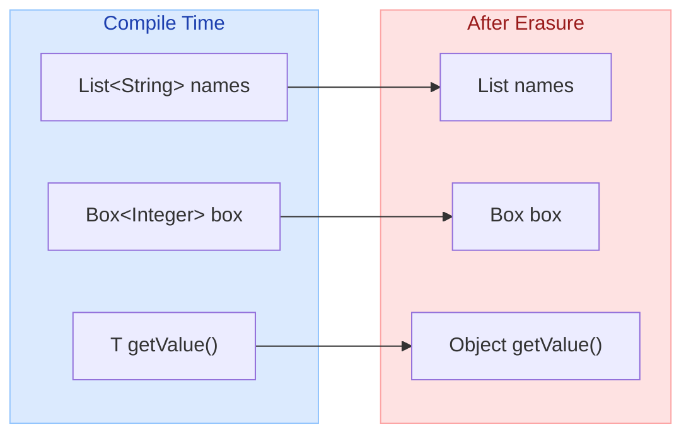
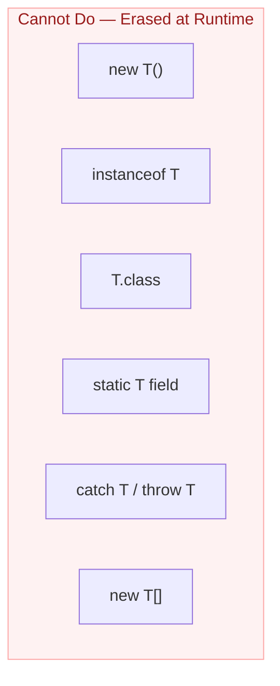
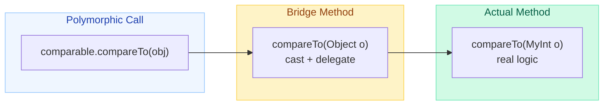
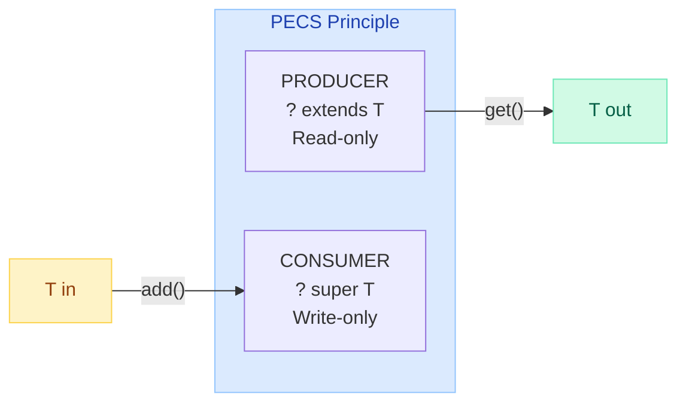
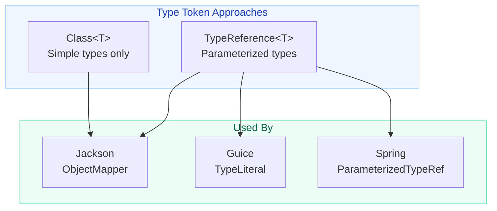

# Type Erasure & Generics Pitfalls

!!! danger "The Silent Killer"
    Your code compiles with **zero warnings**. At runtime, you get a `ClassCastException`. How? Raw types bypass generics entirely — the compiler inserts casts that fail because type erasure has already stripped the generic information from bytecode.

    ```java
    List rawList = new ArrayList<String>();
    rawList.add(42);                         // no warning with raw type
    String s = (String) rawList.get(0);      // ClassCastException at runtime!
    ```

---

## What is Type Erasure?

Type erasure is the process by which the Java compiler **removes all generic type information** at compile time and inserts explicit casts where needed. At the bytecode level, generics do not exist.

**Why?** Backward compatibility. Generics were added in Java 5 but had to interoperate with pre-generics code (erasure-based implementation avoids breaking the JVM).

| Phase | What Happens |
|-------|-------------|
| **Compile time** | Compiler checks type safety, resolves generics |
| **Erasure** | Replaces type parameters with bounds (or `Object`), inserts casts |
| **Runtime** | JVM sees only raw types — no `<T>` anywhere |

---

## Before / After Erasure



### Erasure Rules

| Source Code | Erased To |
|-------------|-----------|
| `T` (unbounded) | `Object` |
| `T extends Comparable` | `Comparable` |
| `T extends Number & Serializable` | `Number` (leftmost bound) |
| `List<String>` | `List` |
| `Map<K, V>` | `Map` |

```java
// What you write
public class Box<T extends Number> {
    private T value;
    public T getValue() { return value; }
}

// What the compiler produces (after erasure)
public class Box {
    private Number value;
    public Number getValue() { return value; }
}
```

---

## What You CANNOT Do with Generics

These restrictions exist because type information is erased at runtime:



| Restriction | Why It Fails | Workaround |
|-------------|-------------|------------|
| `new T()` | JVM doesn't know what T is | Pass `Supplier<T>` or `Class<T>` |
| `instanceof T` | No type info at runtime | Pass `Class<T>` and use `clazz.isInstance()` |
| `T.class` | T is not a reifiable type | Pass class token explicitly |
| `static T field` | T belongs to instance, not class | Use non-static or raw bounds |
| `catch (T e)` | Exception dispatch needs exact type | Catch concrete exception types |
| `new T[10]` | Arrays are reified, generics are not | Use `Array.newInstance(clazz, size)` |

```java
// WRONG: Cannot instantiate T
public <T> T create() {
    return new T();  // COMPILE ERROR
}

// CORRECT: Use Class token
public <T> T create(Class<T> clazz) throws Exception {
    return clazz.getDeclaredConstructor().newInstance();
}

// CORRECT: Use Supplier (Java 8+)
public <T> T create(Supplier<T> factory) {
    return factory.get();
}
```

---

## Bridge Methods

When a generic class is extended with a concrete type, the compiler generates **bridge methods** to preserve polymorphism after erasure.

```java
// Generic interface
public interface Comparable<T> {
    int compareTo(T o);
}

// Concrete implementation
public class MyInt implements Comparable<MyInt> {
    private int value;
    
    @Override
    public int compareTo(MyInt other) {   // actual method
        return Integer.compare(this.value, other.value);
    }
}
```

After erasure, `Comparable` has `compareTo(Object)`. But `MyInt` defines `compareTo(MyInt)`. The compiler generates a **bridge method**:

```java
// Compiler-generated bridge method (synthetic)
public int compareTo(Object o) {       // matches erased signature
    return compareTo((MyInt) o);       // delegates to real method with cast
}
```



!!! info "How to See Bridge Methods"
    Use `javap -c -p MyInt.class` to see the synthetic bridge method with the `ACC_BRIDGE` flag.

---

## Wildcards Deep Dive

### Upper Bounded: `? extends T` (Producer / Covariant)

You can **read** from it (produces T), but **cannot write** to it (compiler doesn't know the exact subtype).

```java
// PRODUCER — reads items out
public double sum(List<? extends Number> numbers) {
    double total = 0;
    for (Number n : numbers) {   // safe: everything IS-A Number
        total += n.doubleValue();
    }
    // numbers.add(42);  // COMPILE ERROR — cannot add
    return total;
}

sum(List.of(1, 2, 3));           // List<Integer> OK
sum(List.of(1.5, 2.5));          // List<Double> OK
```

### Lower Bounded: `? super T` (Consumer / Contravariant)

You can **write** T into it, but reading gives you only `Object`.

```java
// CONSUMER — puts items in
public void addIntegers(List<? super Integer> dest) {
    dest.add(1);        // safe: dest accepts Integer or any supertype
    dest.add(2);
    // Integer i = dest.get(0);  // COMPILE ERROR — might be Object
}

addIntegers(new ArrayList<Number>());   // OK
addIntegers(new ArrayList<Object>());   // OK
```

### PECS: Producer Extends, Consumer Super



```java
// Classic example: Collections.copy uses PECS
public static <T> void copy(List<? super T> dest,     // consumer (super)
                             List<? extends T> src) {  // producer (extends)
    for (int i = 0; i < src.size(); i++) {
        dest.set(i, src.get(i));
    }
}
```

!!! tip "Memory Aid"
    **PE**ts **C**ome **S**econd: **P**roducer **E**xtends, **C**onsumer **S**uper. If you both read AND write, use exact type `<T>` (no wildcard).

---

## Unbounded Wildcards (`?`) vs Raw Types

They look similar but are fundamentally different:

| Feature | `List<?>` | `List` (raw) |
|---------|-----------|--------------|
| Type safety | Yes — cannot add (except null) | No — anything goes |
| Compiler warnings | None | "unchecked" warnings |
| Use case | "I don't care about element type" | Legacy pre-generics code |
| Read as | `Object` | `Object` |
| Write | Only `null` | Anything (unsafe) |

```java
// SAFE: unbounded wildcard
public void printAll(List<?> items) {
    for (Object item : items) {
        System.out.println(item);
    }
    // items.add("test");  // COMPILE ERROR (good!)
}

// UNSAFE: raw type
public void printAll(List items) {
    items.add(42);   // no error — but corrupts the list
}
```

!!! warning "Never Use Raw Types in New Code"
    Raw types exist only for backward compatibility. Always use `<?>` when the type is unknown.

---

## Reifiable vs Non-Reifiable Types

A **reifiable type** retains its full type information at runtime. A **non-reifiable type** has some information erased.

| Reifiable (full info at runtime) | Non-Reifiable (erased) |
|----------------------------------|------------------------|
| `int`, `String`, `Integer` | `List<String>` |
| `List<?>` (unbounded wildcard) | `Map<K, V>` |
| `String[]` | `T` |
| Raw types (`List`) | `List<? extends Number>` |

### Arrays are Reifiable — Generics are Not

Arrays carry their element type at runtime. Generics do not. This mismatch causes problems:

```java
// Arrays: runtime type checking
Object[] objArray = new String[10];
objArray[0] = 42;        // ArrayStoreException at RUNTIME (caught!)

// Generics: NO runtime checking
List<Object> objList = (List) new ArrayList<String>();
objList.add(42);          // NO exception — heap pollution!
```

```java
// This is why generic array creation is illegal:
T[] array = new T[10];              // COMPILE ERROR
List<String>[] array = new List[10]; // unchecked warning — dangerous

// Safe alternative: use List<List<String>> or Array.newInstance
@SuppressWarnings("unchecked")
T[] array = (T[]) Array.newInstance(clazz, size);
```

---

## Heap Pollution

Heap pollution occurs when a variable of a parameterized type refers to an object that is NOT of that type. Common with **varargs + generics**.

```java
// DANGEROUS: varargs creates Object[] internally
static <T> List<T> toList(T... elements) {
    // 'elements' is actually Object[] at runtime — heap pollution possible
    return Arrays.asList(elements);
}

// The real danger: storing into the varargs array
static <T> T[] dangerous(T... args) {
    Object[] objArray = args;      // valid: T[] erased to Object[]
    objArray[0] = "string";        // pollutes if T != String
    return args;                   // ClassCastException when caller uses T
}

Integer[] result = dangerous(1, 2, 3);  // ClassCastException!
```

### @SafeVarargs

Use `@SafeVarargs` on methods that do NOT store into the varargs array:

```java
@SafeVarargs  // safe: only reads from 'elements', never writes
static <T> List<T> toList(T... elements) {
    List<T> list = new ArrayList<>();
    for (T e : elements) {
        list.add(e);
    }
    return list;
}
```

!!! warning "@SafeVarargs Rules"
    - Only allowed on `final`, `static`, or `private` methods (and constructors)
    - The method must NOT store into the varargs array
    - The method must NOT expose the varargs array to untrusted code

---

## Type Tokens & Super Type Tokens

Since generic types are erased, you sometimes need to pass type information explicitly.

### Simple Type Token

```java
// Pass Class<T> to retain type info at runtime
public <T> T deserialize(String json, Class<T> type) {
    return objectMapper.readValue(json, type);
}

// Usage
User user = deserialize(jsonStr, User.class);
```

**Problem:** `Class<T>` cannot represent parameterized types like `List<String>`.

### Super Type Token (TypeReference Pattern)

Captures full generic type through anonymous class inheritance:

```java
// Abstract class that captures generic type via reflection
public abstract class TypeReference<T> {
    private final Type type;
    
    protected TypeReference() {
        // Anonymous subclass preserves generic info in class metadata
        Type superclass = getClass().getGenericSuperclass();
        this.type = ((ParameterizedType) superclass).getActualTypeArguments()[0];
    }
    
    public Type getType() { return type; }
}

// Usage — anonymous class preserves List<String> in bytecode
TypeReference<List<String>> ref = new TypeReference<List<String>>() {};
Type type = ref.getType();  // java.util.List<java.lang.String>
```



!!! info "How It Works"
    The JVM erases `T` inside generic classes, but it **preserves** the generic superclass signature in class metadata. An anonymous class `new TypeReference<List<String>>() {}` bakes `List<String>` into its class file, making it available via `getGenericSuperclass()`.

---

## Common Pitfalls

| Pitfall | What Happens | Fix |
|---------|-------------|-----|
| Using raw types | Unchecked warnings, ClassCastException | Always parameterize: `List<String>` |
| `List<Integer>` is NOT `List<Number>` | Generics are invariant | Use `List<? extends Number>` |
| Comparing `Class` of generic types | `List<String>.class == List<Integer>.class` (both are `List.class`) | Use TypeReference for full type |
| Overloading with generics | `void foo(List<String>)` and `void foo(List<Integer>)` have same erasure | Rename methods or use different arity |
| Catching generic exceptions | `catch (T e)` is illegal | Catch concrete types |
| Creating generic arrays | `new T[10]` is illegal | Use `Array.newInstance()` or `List<T>` |
| Varargs + generics | Heap pollution via `Object[]` | Use `@SafeVarargs` or `List<T>` param |
| Static generic fields | `static T instance` is illegal — T is per-instance | Use bounded static methods instead |

---

## Quick Recall

| Concept | One-Liner |
|---------|-----------|
| Type Erasure | Compiler removes `<T>`, inserts casts — JVM sees only raw types |
| Bridge Methods | Synthetic methods that cast and delegate to maintain polymorphism |
| PECS | **P**roducer **E**xtends, **C**onsumer **S**uper |
| `? extends T` | Upper bound — can read T, cannot write |
| `? super T` | Lower bound — can write T, read gives Object |
| `<?>` vs raw | `<?>` is type-safe (no writes), raw is unsafe legacy |
| Reifiable | Type with full runtime info (primitives, arrays, unbounded wildcards) |
| Heap Pollution | Parameterized variable pointing to wrong type — varargs + generics |
| @SafeVarargs | Promise that method doesn't store into varargs array |
| Type Token | `Class<T>` for simple types, `TypeReference<T>` for parameterized |
| Generic arrays | Illegal due to reification mismatch — use List or Array.newInstance |

---

## Interview Template

???+ example "Type Erasure & Generics — Interview Answer Framework"

    **Opening (15 sec):**
    > "Type erasure is the Java compiler's mechanism of removing generic type parameters at compile time, replacing them with their bounds or Object, and inserting necessary casts. This ensures backward compatibility with pre-Java 5 code but introduces several limitations."

    **Key Points to Cover:**

    1. **Erasure mechanics** — `T` becomes `Object` (or leftmost bound), casts inserted automatically
    2. **What you can't do** — `new T()`, `instanceof T`, `T.class`, generic arrays
    3. **Bridge methods** — compiler generates synthetic methods to maintain polymorphism
    4. **PECS** — Producer Extends (read), Consumer Super (write) — invariance workaround
    5. **Heap pollution** — varargs + generics, `@SafeVarargs` annotation
    6. **Type tokens** — `Class<T>` and `TypeReference<T>` for runtime type retention

    **Closing (situational):**
    > "In practice, type erasure means you design APIs around class tokens or TypeReferences when you need runtime type info — frameworks like Jackson, Spring, and Guice all use this pattern."
