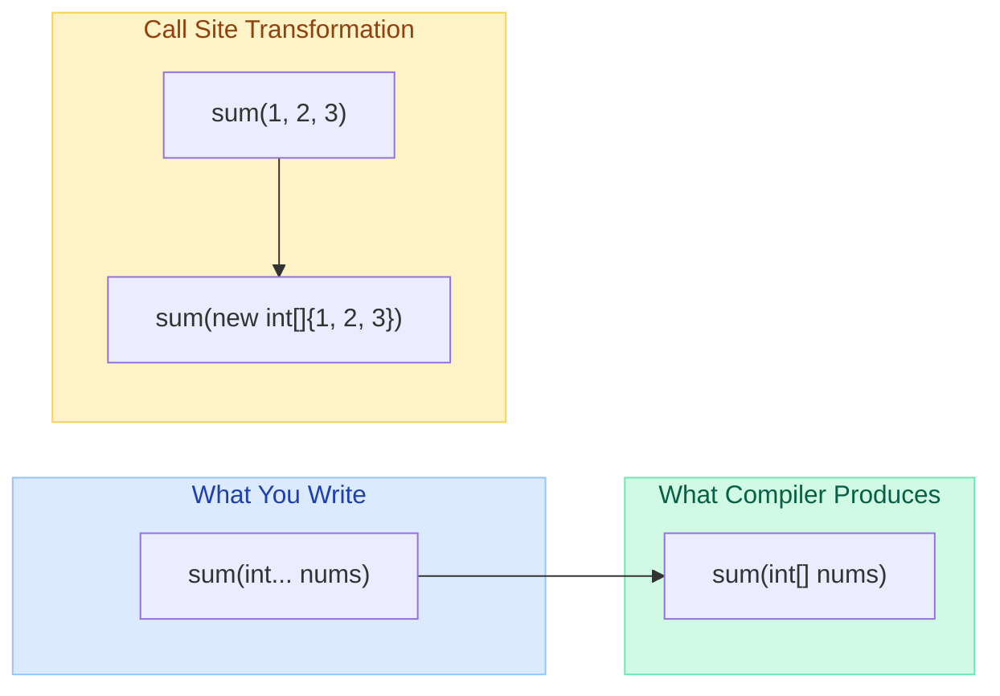
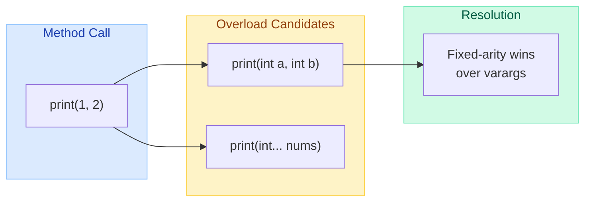
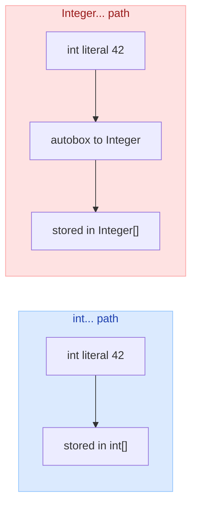
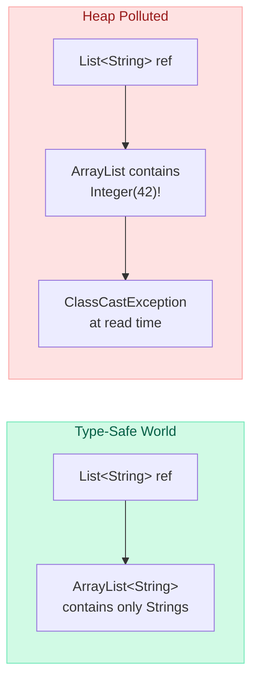
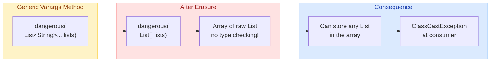
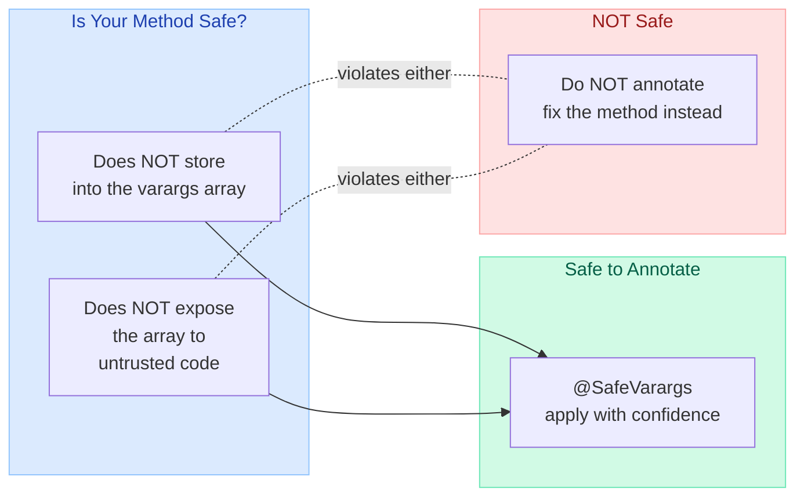
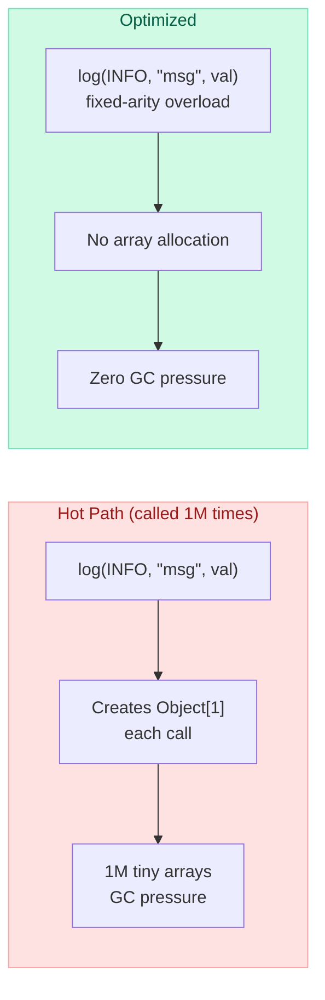
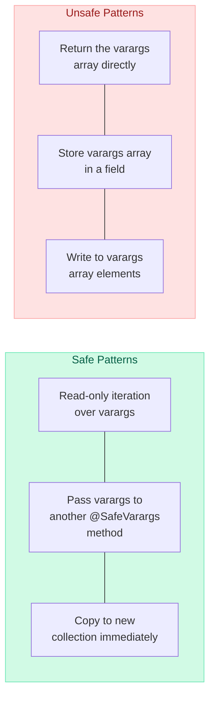

# Varargs & Heap Pollution

> **"Varargs and generics do not interact well — this is a fundamental consequence of type erasure." — Joshua Bloch, Effective Java, Item 32**

---

!!! danger "Real Incident: Apache Commons Collections (CVE-2015-7501)"
    A seemingly harmless varargs utility method accepting `Object...` was exploited to inject a malicious deserialization payload. The method's type-unsafe signature allowed arbitrary objects to pass through unchecked, ultimately enabling remote code execution on thousands of production servers including WebLogic, JBoss, and Jenkins. The root cause? A varargs method that erased generic safety, enabling heap pollution that went undetected until attackers weaponized it.

---

## What Are Varargs?

Variable arguments (varargs) allow a method to accept **zero or more arguments** of a specified type. Introduced in Java 5, varargs is syntactic sugar for array parameters.



```java
// Varargs declaration
public static int sum(int... numbers) {
    int total = 0;
    for (int n : numbers) {
        total += n;
    }
    return total;
}

// All valid calls:
sum();             // empty array: int[0]
sum(1);            // int[]{1}
sum(1, 2, 3);     // int[]{1, 2, 3}
sum(new int[]{1, 2, 3}); // explicit array also works
```

### Bytecode Proof

```bash
$ javap -c VarargDemo.class
```
```
  public static int sum(int[]);  // varargs is just int[] in bytecode
    descriptor: ([I)I
```

---

## Varargs Rules

| Rule | Explanation | Example |
|------|-------------|---------|
| **Only last parameter** | Varargs must be the final parameter | `void log(String msg, Object... args)` |
| **Only one per method** | Cannot have two varargs params | `void bad(int... a, String... b)` -- COMPILE ERROR |
| **Zero args allowed** | Varargs can receive no arguments | `sum()` creates `int[0]` |
| **Array is accepted** | An existing array can be passed directly | `sum(new int[]{1,2})` |
| **null is valid** | Passing `null` gives a null array reference | `sum(null)` -- NPE risk! |

```java
// VALID: varargs as last parameter
public void log(Level level, String pattern, Object... args) { }

// INVALID: varargs not last
public void broken(String... names, int count) { }  // COMPILE ERROR

// INVALID: two varargs
public void broken(int... a, String... b) { }       // COMPILE ERROR
```

---

## Varargs & Method Overloading

Varargs introduces subtle ambiguity in method resolution.



### Resolution Priority (JLS 15.12.2)

| Phase | Description | Varargs Considered? |
|-------|-------------|---------------------|
| **Phase 1** | Exact match without boxing or varargs | No |
| **Phase 2** | Allow boxing/unboxing, no varargs | No |
| **Phase 3** | Allow boxing AND varargs | Yes |

```java
public class Overloading {
    static void print(int a, int b)   { System.out.println("fixed"); }
    static void print(int... nums)    { System.out.println("varargs"); }

    public static void main(String[] args) {
        print(1, 2);    // "fixed" — Phase 1 exact match wins
        print(1);       // "varargs" — no fixed-arity match
        print();        // "varargs" — no fixed-arity match
    }
}
```

### Ambiguity Trap

```java
static void process(int... nums)    { }
static void process(long... nums)   { }

process(1, 2);  // COMPILE ERROR: ambiguous!
// Both are Phase 3 candidates — neither is more specific
```

```java
static void foo(Object... args)  { }
static void foo(Integer... args) { }

foo(1, 2);  // Integer... wins (more specific than Object...)
foo(1, "x"); // Object... wins (Integer... cannot accept String)
```

---

## Autoboxing with Varargs

The interaction between primitive varargs and wrapper varargs creates surprises.



```java
static void show(int... nums) {
    System.out.println("int varargs: " + Arrays.toString(nums));
}

static void show(Integer... nums) {
    System.out.println("Integer varargs: " + Arrays.toString(nums));
}

show(1, 2, 3);  // COMPILE ERROR: ambiguous!

// Fix: be explicit
show(new int[]{1, 2, 3});       // calls int... version
show(new Integer[]{1, 2, 3});   // calls Integer... version
```

### Key Behavior: Arrays.asList() Trap

```java
int[] primitives = {1, 2, 3};
List<int[]> wrong = Arrays.asList(primitives);  // List of ONE element (the array itself!)
// asList(T... a) — T cannot be int, so T = int[], creating a single-element list

Integer[] boxed = {1, 2, 3};
List<Integer> correct = Arrays.asList(boxed);   // List of THREE elements
```

---

## Heap Pollution

Heap pollution occurs when a variable of a parameterized type refers to an object that is **not of that parameterized type**. This happens because generics are erased at runtime.



### When Does Heap Pollution Occur?

| Scenario | Example |
|----------|---------|
| **Raw type assignment** | `List raw = new ArrayList<Integer>(); List<String> s = raw;` |
| **Unchecked cast** | `(List<String>)(Object) integerList` |
| **Generic varargs** | `void danger(List<String>... lists)` |
| **Reflection** | `field.set(obj, wrongTypeValue)` |

### Classic Example

```java
// Heap pollution via raw types
List<String> strings = new ArrayList<>();
List rawList = strings;          // unchecked assignment — warning
rawList.add(42);                 // puts Integer into List<String> — pollution!
String s = strings.get(0);       // ClassCastException! String expected, got Integer
```

---

## Generics + Varargs = Danger Zone

This is the most common source of heap pollution in real codebases.



### Why It Happens

```java
// The compiler generates this:
@SuppressWarnings("unchecked")
static <T> void dangerous(T... elements) {
    // At runtime: T... becomes Object[]
    Object[] array = elements;           // legal! T[] IS-A Object[]
    array[0] = "sneaky string";          // pollution if T != String
    T first = elements[0];              // ClassCastException if T was Integer
}
```

### The Problematic Pattern

```java
static void faultyMethod(List<String>... stringLists) {
    // After erasure: List[] stringLists (raw array)
    Object[] array = stringLists;        // List[] IS-A Object[]
    
    List<Integer> intList = List.of(42);
    array[0] = intList;                  // ArrayStoreException? NO! 
    // Both are List at runtime — type erasure removes the generic info
    
    String s = stringLists[0].get(0);    // ClassCastException!
    // Expected String, got Integer
}
```

!!! warning "Why No ArrayStoreException?"
    With `String[] arr = new String[1]; arr[0] = 42;` you get `ArrayStoreException` because the JVM checks component types for reified arrays. But `List<String>[]` erases to `List[]` — the JVM only checks that you're storing a `List`, not what the `List` contains.

---

## @SafeVarargs

`@SafeVarargs` suppresses heap pollution warnings when you guarantee the method is safe.



### Requirements for @SafeVarargs

| Requirement | Reason |
|-------------|--------|
| Method is `static`, `final`, `private`, or a constructor | Must not be overridable (since Java 9: private allowed) |
| Method does NOT write to the varargs array | Writing could introduce wrong types |
| Method does NOT let the array escape | Callers could pollute it |

### Safe Example

```java
@SafeVarargs
static <T> List<T> listOf(T... elements) {
    // SAFE: only reads from elements, never writes to the array
    List<T> result = new ArrayList<>(elements.length);
    for (T element : elements) {
        result.add(element);
    }
    return result;
}
```

### Unsafe Example (DO NOT annotate)

```java
// UNSAFE: returns the varargs array directly — exposes it!
static <T> T[] toArray(T... args) {
    return args;  // DANGER: caller gets Object[] disguised as T[]
}

// This causes ClassCastException:
String[] strings = toArray("a", "b");  // Object[] cannot be cast to String[]
```

### @SafeVarargs in the JDK

```java
// java.util.Collections
@SafeVarargs
public static <T> boolean addAll(Collection<? super T> c, T... elements)

// java.util.List (Java 9+)
@SafeVarargs
static <E> List<E> of(E... elements)

// java.util.EnumSet
@SafeVarargs
public static <E extends Enum<E>> EnumSet<E> of(E first, E... rest)
```

---

## @SuppressWarnings("unchecked") Alternative

When you cannot use `@SafeVarargs` (e.g., the method is overridable), suppress warnings at the **narrowest scope**.

```java
// Cannot use @SafeVarargs on non-final instance method
public <T> void process(T... items) {
    @SuppressWarnings("unchecked")
    T[] localRef = items;  // suppress only here
    
    for (T item : localRef) {
        // safe read-only usage
        handle(item);
    }
}
```

| Annotation | Scope | When to Use |
|------------|-------|-------------|
| `@SafeVarargs` | Entire method + callers | Method is final/static/private and provably safe |
| `@SuppressWarnings("unchecked")` | Local variable/statement | Cannot use @SafeVarargs; suppress at narrowest scope |

---

## Arrays.asList() and List.of() — Varargs in the JDK

### Why They Use Varargs

```java
// java.util.Arrays
@SafeVarargs
public static <T> List<T> asList(T... a) {
    return new ArrayList<>(a);  // wraps the varargs array directly!
}

// java.util.List (Java 9+)
@SafeVarargs
static <E> List<E> of(E... elements) {
    // defensive copy — does NOT retain the array
}
```

### Arrays.asList() vs List.of()

| Feature | `Arrays.asList(T...)` | `List.of(E...)` |
|---------|----------------------|-----------------|
| Null elements | Allowed | Throws NPE |
| Mutability | Fixed-size, elements mutable | Fully immutable |
| Backed by array? | Yes (changes reflect) | No (defensive copy) |
| Primitives | Wraps primitive array as single element | Same trap (use boxed) |
| Java version | 1.2+ | 9+ |

```java
// List.of() overloads to avoid varargs array allocation for small sizes:
static <E> List<E> of()                           // 0 elements
static <E> List<E> of(E e1)                       // 1 element
static <E> List<E> of(E e1, E e2)                 // 2 elements
// ... up to 10 fixed-arity overloads
static <E> List<E> of(E... elements)              // 11+ elements (varargs)
```

!!! info "Performance Optimization in List.of()"
    The JDK provides fixed-arity overloads for 0-10 elements to avoid the overhead of creating a varargs array. Only when you pass 11+ elements does it fall through to the actual varargs method.

---

## Performance Implications

**Every varargs call creates a new array on the heap.** This matters in hot paths.



### Benchmarks

```java
// SLOW: varargs allocates array every call
public static int sum(int... numbers) { /* ... */ }

// Calling sum(a, b) creates new int[]{a, b} each time

// FAST: fixed-arity overloads for common cases
public static int sum(int a, int b) { return a + b; }
public static int sum(int a, int b, int c) { return a + b + c; }
public static int sum(int... numbers) { /* fallback for 4+ args */ }
```

| Approach | Allocation per Call | GC Impact |
|----------|-------------------|-----------|
| Varargs | 1 array object (16+ bytes) | High in hot loops |
| Fixed-arity overload | None | Zero |
| Cached array | None (reuse) | Minimal (but thread-unsafe if mutable) |

### Real-World Optimization: SLF4J Logging

```java
// SLF4J provides fixed-arity overloads to avoid varargs:
void info(String format, Object arg);          // 1 arg — no array
void info(String format, Object arg1, Object arg2); // 2 args — no array  
void info(String format, Object... arguments); // 3+ args — varargs fallback
```

---

## Common Patterns

### Pattern 1: Printf-Style Formatting

```java
public static String format(String pattern, Object... args) {
    // Safe: only reads args, never writes to array
    StringBuilder sb = new StringBuilder();
    int argIndex = 0;
    for (int i = 0; i < pattern.length(); i++) {
        if (pattern.charAt(i) == '{' && i + 1 < pattern.length() 
            && pattern.charAt(i + 1) == '}') {
            sb.append(argIndex < args.length ? args[argIndex++] : "{}");
            i++; // skip '}'
        } else {
            sb.append(pattern.charAt(i));
        }
    }
    return sb.toString();
}

format("Hello {}, you have {} messages", "Alice", 5);
// → "Hello Alice, you have 5 messages"
```

### Pattern 2: Builder/Factory Methods

```java
@SafeVarargs
public static <T> Set<T> setOf(T... elements) {
    Set<T> set = new LinkedHashSet<>(elements.length * 4 / 3 + 1);
    Collections.addAll(set, elements);
    return Collections.unmodifiableSet(set);
}

@SafeVarargs
public static <T> Stream<T> concat(Stream<T>... streams) {
    return Arrays.stream(streams).flatMap(Function.identity());
}
```

### Pattern 3: Assertion Helpers

```java
public static void requireNonNull(String message, Object... values) {
    for (int i = 0; i < values.length; i++) {
        if (values[i] == null) {
            throw new NullPointerException(message + " [index=" + i + "]");
        }
    }
}

requireNonNull("Constructor args", name, email, address);
```

### Pattern 4: Enum Utilities

```java
@SafeVarargs
public static <E extends Enum<E>> EnumSet<E> enumSetOf(E first, E... rest) {
    EnumSet<E> set = EnumSet.of(first, rest);
    return set;
}
```

---

## Varargs in Frameworks

### Spring Framework

```java
// ApplicationContext — load multiple config locations
ApplicationContext ctx = new ClassPathXmlApplicationContext(
    "applicationContext.xml", "services.xml", "dao.xml"  // varargs
);

// JdbcTemplate — query with varargs parameters
List<User> users = jdbcTemplate.query(
    "SELECT * FROM users WHERE age > ? AND city = ?",
    new UserRowMapper(),
    25, "NYC"  // Object... args bound to PreparedStatement
);

// Spring's Assert utility
Assert.notNull(value, "Value must not be null");
Assert.isTrue(count > 0, "Count must be positive");
```

### JUnit 5 Assertions

```java
// assertAll — varargs of Executable lambdas
assertAll("user validation",
    () -> assertEquals("Alice", user.getName()),
    () -> assertEquals(30, user.getAge()),
    () -> assertNotNull(user.getEmail())
);

// assertEquals with message supplier
assertEquals(expected, actual, () -> "Failed for input: " + input);

// assertThrows does NOT use varargs — single Executable
assertThrows(IllegalArgumentException.class, () -> parse("bad"));
```

### Mockito

```java
// verify with varargs matchers
verify(service).process(any(), anyString(), anyInt());

// Stubbing methods that accept varargs
when(formatter.format(anyString(), any(Object[].class)))
    .thenReturn("mocked");

// ArgumentCaptor for varargs
@Captor ArgumentCaptor<Object[]> argsCaptor;
verify(logger).info(eq("pattern"), argsCaptor.capture());
```

---

## The Varargs + Generics Safe Patterns



```java
// SAFE: iterate and collect
@SafeVarargs
static <T> List<T> immutableListOf(T... elements) {
    return List.copyOf(Arrays.asList(elements));
}

// SAFE: pass to another safe method
@SafeVarargs
static <T> Set<T> unionOf(Set<T>... sets) {
    Set<T> result = new HashSet<>();
    for (Set<T> s : sets) {
        result.addAll(s);
    }
    return result;
}

// UNSAFE: never do this!
static <T> T[] dangerous(T... args) {
    return args;  // leaks Object[] as T[] — ClassCastException
}

// UNSAFE: storing array reference
class Holder<T> {
    T[] data;
    @SafeVarargs // WRONG! This is not safe
    final void set(T... args) {
        this.data = args;  // stores array — someone else might corrupt it
    }
}
```

---

## Interview Questions

### Q1: Why does this code throw ClassCastException?

```java
static <T> T[] toArray(T... args) {
    return args;
}

static <T> T[] duplicate(T a, T b) {
    return toArray(a, b);
}

public static void main(String[] args) {
    String[] result = duplicate("hello", "world");  // ClassCastException!
}
```

**Answer:** `toArray(a, b)` creates an `Object[]` at runtime (because T erases to Object). Returning it as `T[]` produces `Object[]`. When `main` assigns it to `String[]`, the cast inserted by the compiler fails: `Object[]` cannot be cast to `String[]`.

---

### Q2: Is this method safe to annotate with @SafeVarargs?

```java
static <T> void addToList(List<T> list, T... elements) {
    for (T e : elements) {
        list.add(e);
    }
}
```

**Answer:** Yes, it is safe. The method only reads from the varargs array (iterates and reads elements). It never writes to the array, never returns it, and never stores it. `@SafeVarargs` is appropriate here.

---

### Q3: What is the output?

```java
static void count(int... nums)     { System.out.println("int varargs"); }
static void count(int a, int b)    { System.out.println("fixed arity"); }

count(1, 2);
```

**Answer:** `"fixed arity"` — the compiler prefers fixed-arity methods over varargs in method resolution Phase 1.

---

### Q4: Why does Arrays.asList(int[]) return List<int[]>?

```java
int[] arr = {1, 2, 3};
var list = Arrays.asList(arr);
System.out.println(list.size());  // 1, not 3!
```

**Answer:** `asList(T... a)` requires T to be a reference type (generics don't support primitives). An `int[]` is itself a reference type, so T is inferred as `int[]`, creating a `List<int[]>` with a single element. Use `Integer[]` or `IntStream.of(arr).boxed().toList()`.

---

### Q5: Can you use @SafeVarargs on a non-final instance method?

**Answer:** No. Prior to Java 9, `@SafeVarargs` required `static` or `final`. Java 9 added `private` to the list. A non-final, non-private instance method can be overridden, and the subclass might violate the safety guarantee — so the compiler rejects the annotation.

---

### Q6: What happens here?

```java
List<String> a = new ArrayList<>(List.of("hello"));
List<String> b = new ArrayList<>(List.of("world"));
List<String>[] array = new List[]{a, b};  // unchecked warning

faultyMethod(array);

static void faultyMethod(List<String>... lists) {
    Object[] objs = lists;
    objs[0] = List.of(42);       // no ArrayStoreException!
    String s = lists[0].get(0);  // ClassCastException: Integer -> String
}
```

**Answer:** `List<String>[]` erases to `List[]` at runtime. The JVM only checks that `objs[0]` receives a `List` (which `List.of(42)` is). It cannot check the generic parameter, so pollution goes undetected until `get(0)` triggers a cast to String.

---

## Quick Recall

| Topic | Key Point |
|-------|-----------|
| Varargs syntax | `type... name` — sugar for `type[] name`; only one, must be last param |
| Compilation | Caller site wraps args in `new type[]{}` — explicit array also accepted |
| Overload resolution | Fixed-arity always wins over varargs (Phase 1 before Phase 3) |
| Ambiguity | Two varargs methods with compatible types cause compile error |
| Autoboxing trap | `int...` vs `Integer...` are ambiguous for literal args |
| Heap pollution | Parameterized type variable holding wrong type due to erasure |
| Root cause | Generic varargs erases to raw array — `List<String>...` becomes `List[]` |
| ArrayStoreException | Does NOT fire for erased generics — JVM only checks raw type |
| @SafeVarargs | Asserts method is safe; requires static/final/private/constructor |
| Safety rules | Never write to varargs array, never return it, never store it |
| @SuppressWarnings | Alternative when @SafeVarargs inapplicable; use narrowest scope |
| Arrays.asList(int[]) | Returns `List<int[]>` (size 1) — primitives are not autoboxed as elements |
| List.of() overloads | 0-10 fixed-arity overloads avoid array allocation; 11+ uses varargs |
| Performance | Every varargs call allocates a new array — use overloads in hot paths |
| SLF4J pattern | Fixed-arity for 1-2 args, varargs fallback for 3+ |
| Spring usage | JdbcTemplate params, config locations, Assert utilities |
| JUnit usage | assertAll(Executable...), multiple assertions in one test |
| Returning varargs | NEVER return the varargs array — it's Object[] at runtime |
| Best practice | Copy to collection immediately; treat varargs as read-only input |
