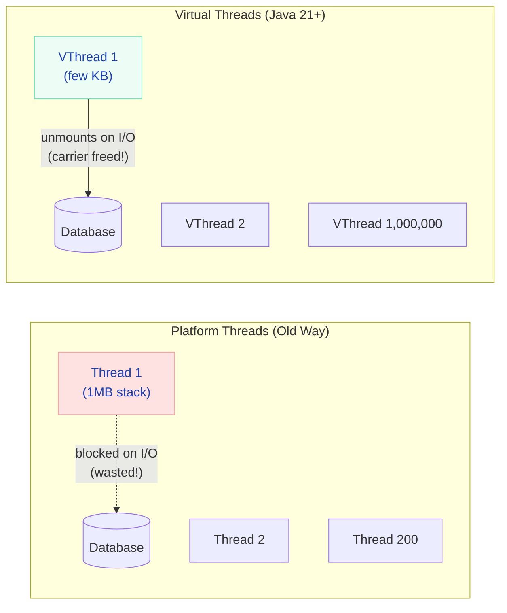
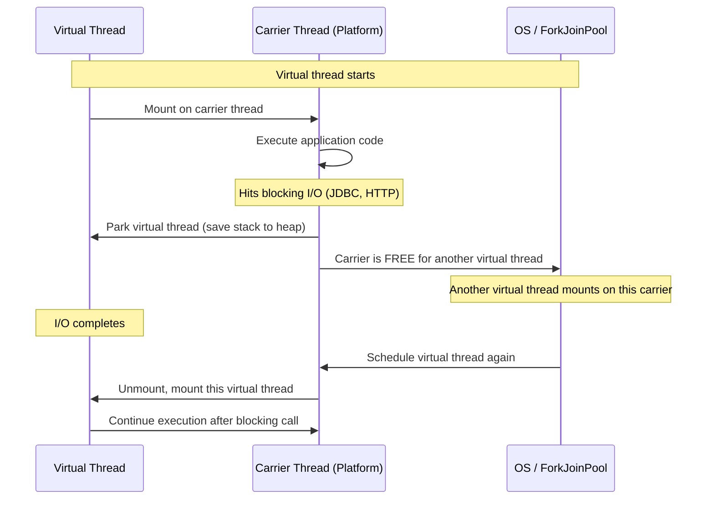

# Virtual Threads & Structured Concurrency (Java 21+)

> **Write simple blocking code that scales like reactive — one million concurrent threads with zero thread pool tuning.**

---

!!! abstract "Real-World Analogy"
    Platform threads are like **hiring full-time employees** — expensive, limited in number, and wasteful when idle (waiting for a response). Virtual threads are like **hiring gig workers on-demand** — millions available instantly, cost almost nothing when waiting, and you never run out. You don't manage a "pool" of gig workers — you just create one whenever you need work done.



---

## The Problem Virtual Threads Solve

### Traditional Thread Model

```java
// ❌ Old way: limited by thread pool size
ExecutorService executor = Executors.newFixedThreadPool(200);  // can't create millions

// Each thread costs ~1MB stack space
// 200 threads = 200MB just for stacks
// If all threads are blocked on I/O → server is at capacity even though CPU is idle
```

With 200 platform threads and each request taking 500ms (mostly waiting on DB/network):
- **Max throughput**: 400 requests/second
- **CPU utilization**: ~5% (95% idle, threads just waiting!)

### Virtual Thread Model

```java
// ✅ New way: unlimited virtual threads
ExecutorService executor = Executors.newVirtualThreadPerTaskExecutor();

// Each virtual thread costs ~few KB
// 1,000,000 virtual threads = a few GB (not terabytes)
// When a virtual thread blocks on I/O → it unmounts from carrier, carrier serves another
```

Same workload with virtual threads:
- **Max throughput**: limited by downstream (DB connections, not thread count)
- **CPU utilization**: much higher (threads never "waste" a carrier while blocking)

---

## Creating Virtual Threads

### Basic Usage

```java
// Method 1: Thread.ofVirtual()
Thread vThread = Thread.ofVirtual()
    .name("worker-", 0)  // worker-0, worker-1, ...
    .start(() -> {
        String result = callExternalApi();  // blocks, but cheaply!
        processResult(result);
    });

// Method 2: ExecutorService (recommended for most use cases)
try (var executor = Executors.newVirtualThreadPerTaskExecutor()) {
    IntStream.range(0, 100_000).forEach(i ->
        executor.submit(() -> {
            Thread.sleep(Duration.ofSeconds(1));  // 100K threads sleeping = no problem
            return fetchData(i);
        })
    );
}  // auto-shutdown on close

// Method 3: Thread.startVirtualThread (fire and forget)
Thread.startVirtualThread(() -> sendNotification(userId));
```

### Spring Boot 3.2+ Integration

```yaml
# ONE LINE — replaces Tomcat thread pool with virtual threads
spring:
  threads:
    virtual:
      enabled: true
```

That's it. Every HTTP request now runs on a virtual thread. No thread pool sizing. No reactive gymnastics.

```java
// This simple blocking code NOW scales to thousands of concurrent requests
@GetMapping("/orders/{id}")
public OrderResponse getOrder(@PathVariable String id) {
    Order order = orderRepository.findById(id).orElseThrow();    // blocks (DB call)
    Payment payment = paymentClient.getPayment(order.getPaymentId()); // blocks (HTTP)
    Inventory stock = inventoryClient.getStock(order.getItemId());     // blocks (HTTP)
    return new OrderResponse(order, payment, stock);
}
// Each request uses 3 blocking calls, but virtual threads make this scale beautifully
```

---

## How Virtual Threads Work Internally



### Key Mechanics

| Concept | Explanation |
|---------|-------------|
| **Carrier thread** | The real OS thread that runs virtual threads (from ForkJoinPool) |
| **Mounting** | Virtual thread gets assigned to a carrier |
| **Unmounting** | Virtual thread yields carrier when it blocks on I/O |
| **Parking** | Virtual thread's stack moved to heap (cheap!) |
| **Continuation** | The mechanism that saves/restores execution state |
| **ForkJoinPool** | Default carrier pool (size = CPU cores) |

!!! warning "Pinning — When Virtual Threads Can't Unmount"
    Virtual threads get **pinned** to their carrier (can't unmount) when:
    
    1. **Inside a `synchronized` block** during a blocking call
    2. **Inside native code (JNI)** during a blocking call
    
    Pinning wastes the carrier thread — exactly what we're trying to avoid.
    
    ```java
    // ❌ BAD — pins the carrier thread during DB call
    synchronized (lock) {
        connection.executeQuery(sql);  // PINNED! carrier blocked
    }
    
    // ✅ GOOD — use ReentrantLock instead
    lock.lock();
    try {
        connection.executeQuery(sql);  // virtual thread unmounts properly
    } finally {
        lock.unlock();
    }
    ```

---

## Structured Concurrency (Preview - Java 21+)

Run multiple concurrent tasks as a unit — if one fails, cancel the others automatically.

```java
// ❌ Old way: manual CompletableFuture orchestration
CompletableFuture<User> userFuture = CompletableFuture.supplyAsync(() -> getUser(id));
CompletableFuture<List<Order>> ordersFuture = CompletableFuture.supplyAsync(() -> getOrders(id));
CompletableFuture<Recommendations> recsFuture = CompletableFuture.supplyAsync(() -> getRecs(id));
// If getUser() fails, orders and recs keep running wastefully
// Error handling is scattered and complex

// ✅ New way: Structured Concurrency
try (var scope = new StructuredTaskScope.ShutdownOnFailure()) {
    Subtask<User> user = scope.fork(() -> getUser(id));
    Subtask<List<Order>> orders = scope.fork(() -> getOrders(id));
    Subtask<Recommendations> recs = scope.fork(() -> getRecs(id));

    scope.join();           // wait for all
    scope.throwIfFailed();  // propagate first failure

    // All succeeded — safe to use results
    return new UserProfile(user.get(), orders.get(), recs.get());
}
// If ANY subtask fails → all others are cancelled immediately
// Thread dumps show parent-child relationship clearly
```

### Scoped Values (Replaces ThreadLocal)

```java
// ❌ ThreadLocal — leaks in virtual threads, manual cleanup needed
private static final ThreadLocal<UserContext> CONTEXT = new ThreadLocal<>();

// ✅ ScopedValue — automatically scoped, no cleanup, immutable
private static final ScopedValue<UserContext> CONTEXT = ScopedValue.newInstance();

// Bind for a scope — automatically cleaned up
ScopedValue.runWhere(CONTEXT, new UserContext(userId, roles), () -> {
    orderService.processOrder(request);  // can read CONTEXT.get()
    // child virtual threads inherit the scoped value!
});
```

---

## When to Use (and When NOT to)

| Workload | Virtual Threads? | Why |
|----------|-----------------|-----|
| REST API with DB calls | **Yes** | I/O-bound, blocking scales with VTs |
| HTTP calls to external APIs | **Yes** | Network I/O, each call blocks |
| File I/O operations | **Yes** | Disk I/O, blocking |
| CPU-intensive computation | **No** | CPU-bound — VTs don't help |
| Tight loops / number crunching | **No** | No I/O to unmount on |
| Already using WebFlux/reactive | **Maybe not** | VTs solve the same problem with simpler code |

!!! tip "Virtual Threads vs Reactive (WebFlux)"
    Both solve the same problem (scalable I/O). Virtual threads win on **simplicity** (imperative code, easy debugging, familiar stack traces). Reactive wins on **backpressure** and **streaming**. For most CRUD APIs, virtual threads are the simpler choice.

---

## Migration Checklist

- [ ] Replace `synchronized` blocks with `ReentrantLock` (avoid pinning)
- [ ] Replace `ThreadLocal` with `ScopedValue` where possible
- [ ] Remove thread pool sizing logic (no longer needed)
- [ ] Set `spring.threads.virtual.enabled=true`
- [ ] Monitor with `-Djdk.tracePinnedThreads=short` to detect pinning
- [ ] Update connection pools — DB connections are now the bottleneck, not threads

---

## Interview Questions

??? question "How do virtual threads differ from platform threads?"

    **Answer:** Platform threads are thin wrappers around OS threads — expensive (1MB stack), limited (thousands), and wasteful when blocked. Virtual threads are JVM-managed, ultra-lightweight (few KB), and millions can exist. When a virtual thread blocks on I/O, it unmounts from its carrier thread, freeing it for other work. The programming model is identical — same Thread API, same blocking calls — but the scalability characteristics are fundamentally different.

??? question "What is thread pinning and why does it matter?"

    **Answer:** Pinning occurs when a virtual thread can't unmount from its carrier during a blocking operation — specifically inside `synchronized` blocks or native code. The carrier thread stays blocked, defeating the purpose of virtual threads. Fix by replacing `synchronized` with `ReentrantLock`, which supports cooperative unmounting.

??? question "Do virtual threads make reactive programming obsolete?"

    **Answer:** For most request-response APIs, yes — virtual threads give you the scalability of reactive with the simplicity of imperative code. But reactive still has advantages: backpressure (controlling data flow rates), streaming (SSE, WebSocket data streams), and functional composition. If you're building a streaming data pipeline, reactive still makes sense. If you're building a REST API, virtual threads are simpler.
