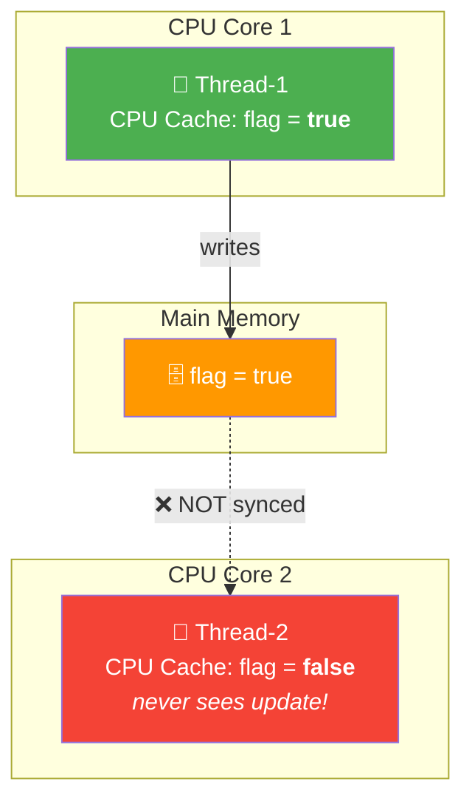
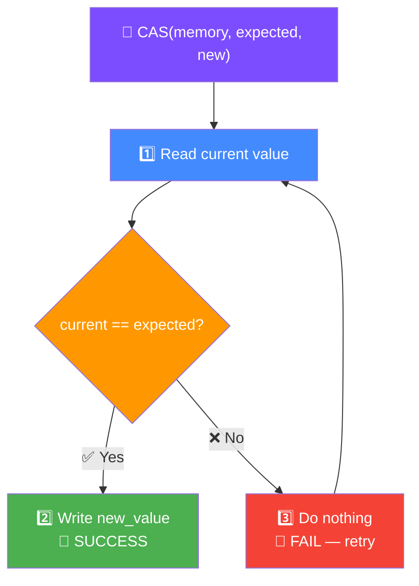

# volatile, Atomic Classes & CAS in Java

These are the **low-level building blocks** of thread-safe code. Understanding them separates senior engineers from juniors in concurrency interviews.

---

## The Visibility Problem

Without `volatile`, one thread's changes to a variable may **never be seen** by another thread.



```java
// BUG — Thread-2 may loop forever
class Worker {
    private boolean running = true;  // no volatile

    public void stop() { running = false; }  // Thread-1

    public void run() {
        while (running) {  // Thread-2 may never see false (cached value)
            doWork();
        }
    }
}
```

---

## `volatile` Keyword

`volatile` guarantees **visibility** — every read comes from main memory, every write goes to main memory.

```java
class Worker {
    private volatile boolean running = true;  // volatile fixes visibility

    public void stop() { running = false; }  // Thread-1 writes to main memory

    public void run() {
        while (running) {  // Thread-2 always reads from main memory
            doWork();
        }
    }
}
```

### What `volatile` guarantees

| Guarantees | Does NOT guarantee |
|---|---|
| **Visibility** — changes visible across threads | **Atomicity** — `count++` is NOT atomic even with volatile |
| **Ordering** — prevents instruction reordering | **Mutual exclusion** — multiple threads can still interleave |

### Why `volatile` doesn't fix `count++`

```java
private volatile int count = 0;

// Thread-1 and Thread-2 both do:
count++;  // NOT atomic! This is: read → increment → write (3 steps)

// Possible interleaving:
// Thread-1 reads count = 5
// Thread-2 reads count = 5
// Thread-1 writes count = 6
// Thread-2 writes count = 6  ← lost update! should be 7
```

---

## Atomic Classes — Lock-Free Thread Safety

Atomic classes use **CAS (Compare-And-Swap)** to perform atomic operations without locks.

### AtomicInteger / AtomicLong

```java
private AtomicInteger count = new AtomicInteger(0);

count.incrementAndGet();     // atomic count++ → returns new value
count.decrementAndGet();     // atomic count--
count.addAndGet(5);          // atomic count += 5
count.get();                 // read current value
count.compareAndSet(10, 20); // if count == 10, set to 20 (returns boolean)
```

### AtomicReference

```java
AtomicReference<User> currentUser = new AtomicReference<>(null);

User newUser = new User("Vamsi");
currentUser.set(newUser);

// Compare-and-swap
User expected = currentUser.get();
User updated = new User("Krishna");
currentUser.compareAndSet(expected, updated);  // only updates if still 'expected'
```

### AtomicBoolean

```java
AtomicBoolean initialized = new AtomicBoolean(false);

// Ensure initialization runs exactly once across threads
if (initialized.compareAndSet(false, true)) {
    performInitialization();  // only one thread enters here
}
```

---

## CAS — Compare-And-Swap

CAS is the CPU instruction that makes Atomic classes work. It's **lock-free** — no thread ever blocks.



```java
// How AtomicInteger.incrementAndGet() works internally (simplified)
public int incrementAndGet() {
    while (true) {  // spin loop
        int current = get();
        int next = current + 1;
        if (compareAndSet(current, next)) {
            return next;  // success — no other thread changed it
        }
        // another thread changed it — retry with new value
    }
}
```

### CAS vs Locks

| Feature | CAS (Atomic) | Lock (synchronized/ReentrantLock) |
|---|---|---|
| Blocking | No — spins and retries | Yes — thread waits |
| Performance (low contention) | Faster | Slower (lock overhead) |
| Performance (high contention) | Degrades (spinning wastes CPU) | Better (threads sleep) |
| Deadlock possible | No | Yes |
| Complexity | Simple for single variables | Handles complex multi-variable operations |

**Rule of thumb**: Use Atomic classes for **single-variable** atomic operations. Use locks for **multi-variable** or complex critical sections.

---

## LongAdder — High-Contention Counter

When many threads update a counter concurrently, `AtomicLong` becomes a bottleneck (all threads CAS on the same memory location). `LongAdder` distributes updates across **multiple cells**.

```java
// High contention — AtomicLong is slow
AtomicLong counter = new AtomicLong();
counter.incrementAndGet();  // all threads fight over one memory location

// High contention — LongAdder is much faster
LongAdder counter = new LongAdder();
counter.increment();        // threads update different cells
long total = counter.sum(); // reads combine all cells
```

| Scenario | Use |
|---|---|
| Single counter, low contention | `AtomicLong` |
| Single counter, high contention (metrics, page views) | `LongAdder` |
| Need exact real-time value | `AtomicLong` |
| Need approximate/eventual count | `LongAdder` (sum is not atomic) |

---

## Happens-Before Relationship

The Java Memory Model defines **happens-before** rules that guarantee visibility:

| Rule | Meaning |
|---|---|
| **volatile write → volatile read** | A write to volatile is visible to any subsequent read of that volatile |
| **synchronized unlock → lock** | Everything before `unlock` is visible to the next thread that `lock`s |
| **Thread start** | Everything before `thread.start()` is visible to the started thread |
| **Thread join** | Everything the joined thread did is visible after `join()` returns |

```java
// volatile establishes happens-before
volatile boolean ready = false;
int data = 0;

// Thread-1
data = 42;          // write data
ready = true;       // volatile write — flushes data to main memory too

// Thread-2
if (ready) {        // volatile read — sees data = 42 guaranteed
    print(data);    // guaranteed to print 42
}
```

---

## When to Use What

| Need | Solution |
|---|---|
| Simple flag (stop/start) | `volatile boolean` |
| Counter | `AtomicInteger` / `AtomicLong` |
| High-throughput counter | `LongAdder` |
| Reference swap | `AtomicReference` |
| Protect multiple variables together | `synchronized` or `ReentrantLock` |
| Read-heavy, rare writes | `ReadWriteLock` or `StampedLock` |

---

## Interview Questions

??? question "1. What is the difference between volatile and synchronized?"
    `volatile` guarantees **visibility** only — changes are flushed to main memory. `synchronized` guarantees both **visibility** and **atomicity** — only one thread enters the block at a time. Use `volatile` for simple flags/booleans. Use `synchronized` when you need to do read-modify-write atomically (like `count++`).

??? question "2. Why is `count++` not thread-safe even with volatile?"
    `count++` is three operations: read, increment, write. `volatile` ensures each individual read/write is visible across threads, but it doesn't make the three steps **atomic**. Two threads can read the same value, increment it, and both write the same result — losing one update. Use `AtomicInteger.incrementAndGet()` instead.

??? question "3. What is the ABA problem with CAS?"
    Thread-1 reads value A, gets preempted. Thread-2 changes A → B → A. Thread-1 wakes up, sees A (same as expected), and CAS succeeds — but the value was changed and reverted. This can cause bugs with linked data structures. Fix: use `AtomicStampedReference` which tracks a version stamp alongside the value.

??? question "4. When would you use `LongAdder` over `AtomicLong`?"
    When you have **high contention** — many threads updating the same counter frequently (e.g., request counters, metrics). `LongAdder` distributes updates across internal cells, so threads don't all fight over one memory location. The tradeoff: `sum()` is not atomic (it reads cells sequentially), so the result may be slightly stale under concurrent updates.
