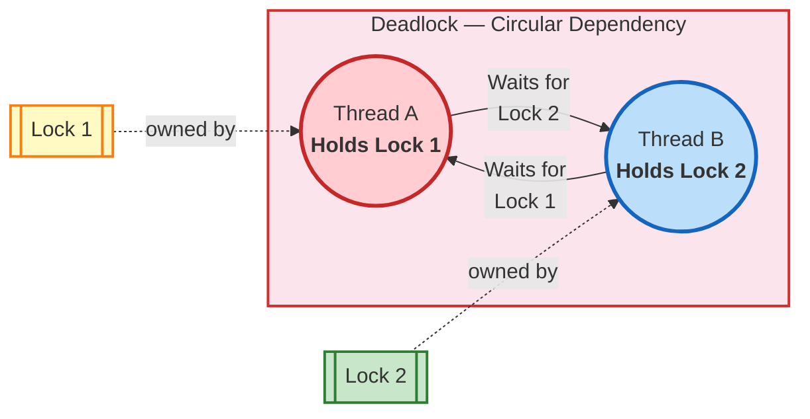
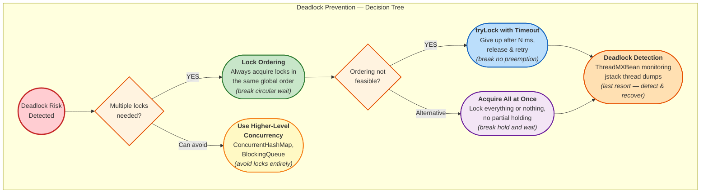

# Deadlocks in Java

A deadlock occurs when **two or more threads are blocked forever**, each waiting for the other to release a lock.

---

## How Deadlocks Happen



```
    Thread-1                          Thread-2
    ────────                          ────────
    1. Acquires Lock-A                1. Acquires Lock-B
    2. Waits for Lock-B ──────────►   2. Waits for Lock-A
           ▲                                   │
           └───────────── DEADLOCK ────────────┘
           (both waiting forever)
```

---

## Classic Deadlock Example

```java
public class DeadlockDemo {
    private static final Object lockA = new Object();
    private static final Object lockB = new Object();

    public static void main(String[] args) {

        Thread thread1 = new Thread(() -> {
            synchronized (lockA) {
                System.out.println("Thread-1: Holding Lock-A");
                try { Thread.sleep(50); } catch (InterruptedException e) {}

                System.out.println("Thread-1: Waiting for Lock-B...");
                synchronized (lockB) {
                    System.out.println("Thread-1: Holding Lock-A and Lock-B");
                }
            }
        });

        Thread thread2 = new Thread(() -> {
            synchronized (lockB) {
                System.out.println("Thread-2: Holding Lock-B");
                try { Thread.sleep(50); } catch (InterruptedException e) {}

                System.out.println("Thread-2: Waiting for Lock-A...");
                synchronized (lockA) {
                    System.out.println("Thread-2: Holding Lock-B and Lock-A");
                }
            }
        });

        thread1.start();
        thread2.start();
    }
}
```

**Output** (program hangs):
```
Thread-1: Holding Lock-A
Thread-2: Holding Lock-B
Thread-1: Waiting for Lock-B...
Thread-2: Waiting for Lock-A...
(DEADLOCK — program never finishes)
```

---

## Four Coffman Conditions

A deadlock can ONLY occur when **all four** conditions are true simultaneously:

| Condition | Meaning | How to break it |
|---|---|---|
| **Mutual Exclusion** | Resource can be held by only one thread | Use concurrent data structures instead of locks |
| **Hold and Wait** | Thread holds one lock and waits for another | Acquire all locks at once or release before requesting |
| **No Preemption** | Locks can't be forcibly taken away | Use `tryLock()` with timeout |
| **Circular Wait** | Thread-1 waits for Thread-2, Thread-2 waits for Thread-1 | Always acquire locks in the same order |

Break **any one** condition and deadlocks become impossible.

---

## Prevention Strategies



### 1. Lock Ordering (Break Circular Wait)

Always acquire locks in the **same global order**, regardless of which thread.

```java
// BEFORE: Deadlock-prone — different order in each thread
// Thread-1: lockA → lockB
// Thread-2: lockB → lockA

// AFTER: Safe — same order everywhere
// Thread-1: lockA → lockB
// Thread-2: lockA → lockB (same order!)

public void transfer(Account from, Account to, double amount) {
    Account first = from.getId() < to.getId() ? from : to;
    Account second = from.getId() < to.getId() ? to : from;

    synchronized (first) {
        synchronized (second) {
            from.debit(amount);
            to.credit(amount);
        }
    }
}
```

### 2. `tryLock()` with Timeout (Break No Preemption)

```java
private static final ReentrantLock lockA = new ReentrantLock();
private static final ReentrantLock lockB = new ReentrantLock();

public void safeMethod() {
    boolean gotBothLocks = false;
    while (!gotBothLocks) {
        boolean gotA = false;
        boolean gotB = false;
        try {
            gotA = lockA.tryLock(100, TimeUnit.MILLISECONDS);
            gotB = lockB.tryLock(100, TimeUnit.MILLISECONDS);
        } catch (InterruptedException e) {
            Thread.currentThread().interrupt();
        } finally {
            if (gotA && gotB) {
                gotBothLocks = true;
                try {
                    // do work
                } finally {
                    lockA.unlock();
                    lockB.unlock();
                }
            } else {
                if (gotA) lockA.unlock();
                if (gotB) lockB.unlock();
                // back off and retry
            }
        }
    }
}
```

### 3. Acquire All Locks at Once (Break Hold and Wait)

```java
public class MultiLock {
    public static void lockAll(Lock... locks) {
        while (true) {
            boolean allAcquired = true;
            for (Lock lock : locks) {
                if (!lock.tryLock()) {
                    allAcquired = false;
                    break;
                }
            }
            if (allAcquired) return;
            // release any acquired locks and retry
            for (Lock lock : locks) {
                try { lock.unlock(); } catch (IllegalMonitorStateException ignored) {}
            }
        }
    }
}
```

### 4. Use Higher-Level Concurrency (Avoid Locks Entirely)

```java
// Instead of manual synchronization, use concurrent collections
ConcurrentHashMap<String, Integer> map = new ConcurrentHashMap<>();
map.compute("key", (k, v) -> (v == null) ? 1 : v + 1);  // atomic

// Instead of shared mutable state, use message passing
BlockingQueue<Task> queue = new LinkedBlockingQueue<>();
queue.put(task);      // producer
Task t = queue.take(); // consumer
```

---

## Detecting Deadlocks

### Using `jstack` (Production)

```bash
# Find Java process ID
jps

# Generate thread dump
jstack <pid>
```

`jstack` output for a deadlock:
```
Found one Java-level deadlock:
=============================
"Thread-1":
  waiting to lock monitor 0x00007f... (object 0x0000..., a java.lang.Object),
  which is held by "Thread-2"
"Thread-2":
  waiting to lock monitor 0x00007f... (object 0x0000..., a java.lang.Object),
  which is held by "Thread-1"
```

### Using ThreadMXBean (Programmatic)

```java
ThreadMXBean bean = ManagementFactory.getThreadMXBean();
long[] deadlockedThreads = bean.findDeadlockedThreads();

if (deadlockedThreads != null) {
    ThreadInfo[] infos = bean.getThreadInfo(deadlockedThreads);
    for (ThreadInfo info : infos) {
        System.out.println("Deadlocked thread: " + info.getThreadName());
        System.out.println("Waiting for lock: " + info.getLockName());
        System.out.println("Held by: " + info.getLockOwnerName());
    }
}
```

---

## Deadlock vs Livelock vs Starvation

| Problem | What happens | Threads blocked? |
|---|---|---|
| **Deadlock** | Threads wait for each other's locks forever | Yes — completely stuck |
| **Livelock** | Threads keep retrying but make no progress (like two people dodging in a hallway) | No — running but useless |
| **Starvation** | One thread never gets CPU time because others have higher priority | Partially — can theoretically run |

---

## Interview Questions

??? question "1. How would you detect a deadlock in a production Java application?"
    Use `jstack <pid>` to generate a thread dump — it explicitly reports deadlocks. For proactive detection, use `ThreadMXBean.findDeadlockedThreads()` on a scheduled timer and alert if deadlocks are found. Tools like VisualVM and JConsole can also detect deadlocks in real-time.

??? question "2. Can a deadlock happen with a single thread?"
    **No** in standard Java. A single thread can't wait for itself using `synchronized` because Java's intrinsic locks are **reentrant** — the same thread can re-acquire a lock it already holds. However, with `Semaphore(1)`, a single thread CAN deadlock if it tries to acquire twice without releasing.

??? question "3. How does `ReentrantLock` help prevent deadlocks compared to `synchronized`?"
    `ReentrantLock` offers `tryLock(timeout)` which returns `false` instead of blocking forever. It also supports `lockInterruptibly()` which allows a waiting thread to be interrupted. With `synchronized`, once a thread starts waiting for a lock, it waits forever and can't be interrupted.

??? question "4. Your bank transfer service deadlocks when two users transfer money to each other simultaneously. How do you fix it?"
    Use **lock ordering** — always lock accounts in a deterministic order (e.g., by account ID). If transferring from Account 5 → Account 3, lock Account 3 first (lower ID), then Account 5. Both concurrent transfers will lock in the same order, preventing circular wait.
