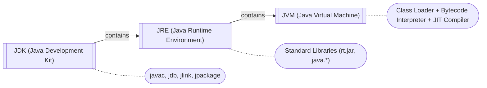
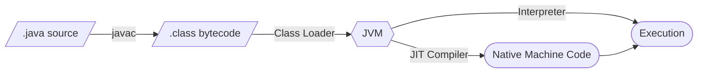

# Java Ecosystem & Platform Overview

Java remains one of the most widely used programming languages in enterprise software, powering everything from Android apps to large-scale distributed systems. Its "write once, run anywhere" philosophy, mature ecosystem, and strong backward compatibility make it a dominant force in backend development, financial services, and cloud-native applications.

---

## Java Platform Editions

| Edition | Purpose | Examples |
|---|---|---|
| **Java SE** (Standard Edition) | Core language, libraries, and JVM. Foundation for all Java development. | Desktop apps, CLI tools, base for other editions |
| **Jakarta EE** (formerly Java EE) | Enterprise specs: servlets, JPA, CDI, JMS, JAX-RS. Runs on app servers. | Enterprise web apps, microservices on WildFly/Payara |
| **Java ME** (Micro Edition) | Subset of SE for constrained devices. Largely obsolete today. | Embedded systems, legacy IoT |

---

## JDK vs JRE vs JVM



- **JVM** — Executes bytecode, handles memory management and GC. Platform-specific.
- **JRE** — JVM + standard class libraries. Enough to *run* Java programs.
- **JDK** — JRE + development tools (compiler, debugger, profiler). Required to *build* Java programs.

> Since Java 11, Oracle no longer ships a standalone JRE. The JDK is the standard distribution.

---

## Compilation & Execution Flow



The JIT (Just-In-Time) compiler identifies hot paths at runtime and compiles them to native code, giving Java performance close to C/C++ for long-running applications.

---

## Key Java Features

| Feature | Why It Matters |
|---|---|
| **Platform Independence** | Bytecode runs on any JVM — Windows, Linux, macOS |
| **Strong Static Typing** | Catches errors at compile time, enables powerful IDE support |
| **Object-Oriented** | Encapsulation, inheritance, polymorphism as first-class concepts |
| **Garbage Collection** | Automatic memory management (G1, ZGC, Shenandoah) |
| **Multithreading** | Built-in concurrency primitives; Virtual Threads since Java 21 |
| **Backward Compatibility** | Code compiled on Java 8 still runs on Java 21 |

---

## Release Cadence & LTS Versions

Since Java 10 (2018), Oracle ships a **new release every 6 months** (March and September).

| Version | Type | Key Features |
|---|---|---|
| Java 11 | LTS | HTTP Client, `var` in lambdas, removal of Java EE modules |
| Java 17 | LTS | Sealed classes, pattern matching for `instanceof`, records |
| Java 21 | LTS | Virtual Threads, pattern matching in switch, sequenced collections |
| Java 25 | LTS (upcoming) | Value classes, structured concurrency (preview) |

> **Production rule of thumb**: Run the latest LTS version unless you have a specific reason to use a feature release.

---

## Ecosystem Landscape

| Category | Tools | What They Do |
|---|---|---|
| **Build Tools** | Maven, Gradle | Dependency management, build lifecycle, multi-module projects |
| **Frameworks** | Spring Boot, Quarkus, Micronaut | Dependency injection, web servers, cloud-native features |
| **Testing** | JUnit 5, Mockito, Testcontainers | Unit/integration tests, mocking, disposable Docker containers |
| **ORM** | Hibernate (JPA) | Object-relational mapping, query generation, caching |
| **Libraries** | Lombok, Jackson, Guava | Boilerplate reduction, JSON processing, utility collections |
| **Resilience** | Resilience4j, Failsafe | Circuit breakers, retries, rate limiting |
| **DB Migration** | Flyway, Liquibase | Version-controlled schema changes |

---

## Installation via SDKMAN

```bash
$ curl -s "https://get.sdkman.io" | bash
$ source "$HOME/.sdkman/bin/sdkman-init.sh"
$ sdk version
$ sdk list java
$ sdk install java 21.0.2-tem
```

SDKMAN lets you install and switch between multiple JDK versions and vendors (Temurin, GraalVM, Amazon Corretto) with ease.

---

## IDEs

| IDE | Notes |
|---|---|
| **IntelliJ IDEA** | Industry standard for Java. Superior refactoring, debugging, and Spring support. |
| **VS Code** | Lightweight option with Extension Pack for Java. Good for polyglot developers. |
| **Eclipse** | Free, plugin-rich. Still common in large enterprises. |

---

??? question "What is the difference between JDK, JRE, and JVM?"

    **JVM** is the virtual machine that executes bytecode. **JRE** is JVM plus standard libraries — enough to run programs. **JDK** is JRE plus development tools (javac, jdb) — required to compile programs. Since Java 11, only the JDK is distributed.

??? question "Why is Java called platform-independent?"

    Java source compiles to bytecode (.class files), not native machine code. The JVM — which is platform-specific — interprets or JIT-compiles this bytecode on any OS. The bytecode itself is portable across all platforms that have a JVM.

??? question "What are Virtual Threads and why do they matter?"

    Introduced in Java 21, Virtual Threads are lightweight threads managed by the JVM rather than the OS. They allow millions of concurrent tasks without the memory overhead of platform threads, making high-throughput I/O-bound applications (web servers, microservices) much simpler to write.

??? question "What is the difference between Maven and Gradle?"

    Maven uses declarative XML (`pom.xml`) with a fixed lifecycle — convention over configuration. Gradle uses a Groovy/Kotlin DSL (`build.gradle`) with a flexible task graph — more powerful but more complex. Gradle is faster for large projects due to incremental builds and build caching.
