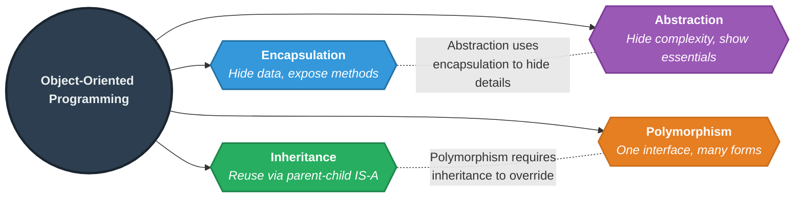
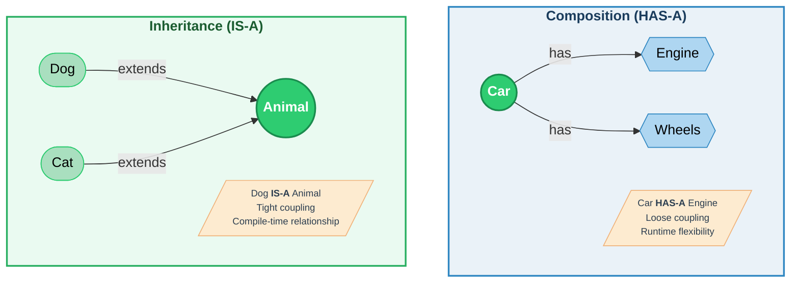

# Object-Oriented Programming (OOP) in Java

## What is OOP?

Object-Oriented Programming is a way of writing code by modeling real-world things as **objects**. Instead of writing one giant program, you break it into small, reusable pieces.

Think of it like LEGO blocks — each block (object) has its own shape and purpose, and you combine them to build something complex.

### The 4 Pillars of OOP


```mermaid
flowchart LR
    OOP(("<b>Object-Oriented Programming</b>")):::center

    OOP --> E{{"<b>Encapsulation</b><br/><i>Hide data, expose methods</i>"}}:::encap
    OOP --> A{{"<b>Abstraction</b><br/><i>Hide complexity, show essentials</i>"}}:::abstr
    OOP --> I{{"<b>Inheritance</b><br/><i>Reuse via parent-child IS-A</i>"}}:::inher
    OOP --> P{{"<b>Polymorphism</b><br/><i>One interface, many forms</i>"}}:::poly

    %% Connections between pillars
    E -.-|"Abstraction uses<br/>encapsulation to hide details"| A
    I -.-|"Polymorphism requires<br/>inheritance to override"| P

    classDef center fill:#2c3e50,stroke:#1a252f,stroke-width:3px,color:#ecf0f1,font-size:16px
    classDef encap fill:#3498db,stroke:#2471a3,stroke-width:2px,color:#fff
    classDef abstr fill:#9b59b6,stroke:#7d3c98,stroke-width:2px,color:#fff
    classDef inher fill:#27ae60,stroke:#1e8449,stroke-width:2px,color:#fff
    classDef poly fill:#e67e22,stroke:#ca6f1e,stroke-width:2px,color:#fff
```

### Inheritance vs Composition


```mermaid
flowchart LR
    subgraph ISA["<b>Inheritance (IS-A)</b>"]
        direction LR
        Animal(("Animal")):::parent
        Dog(["Dog"]):::child
        Cat(["Cat"]):::child
        Dog -->|"extends"| Animal
        Cat -->|"extends"| Animal
        note1[/"Dog <b>IS-A</b> Animal<br/>Tight coupling<br/>Compile-time relationship"/]:::note
    end

    subgraph HASA["<b>Composition (HAS-A)</b>"]
        direction LR
        Car(("Car")):::parent
        Engine{{"Engine"}}:::component
        Wheels{{"Wheels"}}:::component
        Car -->|"has"| Engine
        Car -->|"has"| Wheels
        note2[/"Car <b>HAS-A</b> Engine<br/>Loose coupling<br/>Runtime flexibility"/]:::note
    end

    ISA ~~~ HASA

    classDef parent fill:#2ecc71,stroke:#1a8c4e,stroke-width:2px,color:#fff,font-weight:bold
    classDef child fill:#a9dfbf,stroke:#2ecc71,stroke-width:1px,color:#000
    classDef component fill:#aed6f1,stroke:#2e86c1,stroke-width:1px,color:#000
    classDef note fill:#fdebd0,stroke:#f0b27a,stroke-width:1px,color:#2c3e50,font-size:11px

    style ISA fill:#eafaf1,stroke:#27ae60,stroke-width:2px,color:#1a5c30
    style HASA fill:#eaf2f8,stroke:#2e86c1,stroke-width:2px,color:#1a3c5c
```

---

## 1. Encapsulation

**Simple definition**: Wrapping data (variables) and the code that works on that data (methods) into a single unit (class), and **restricting direct access** to the data.

**Real-world analogy**: Think of a **capsule medicine**. The medicine (data) is inside the capsule (class). You don't touch the medicine directly — you just swallow the capsule (use methods).

### How to achieve Encapsulation

1. Make variables `private`
2. Provide `public` getter and setter methods

```java
public class BankAccount {
    private double balance;  // hidden from outside

    public double getBalance() {
        return balance;
    }

    public void deposit(double amount) {
        if (amount > 0) {
            balance += amount;
        }
    }

    public void withdraw(double amount) {
        if (amount > 0 && amount <= balance) {
            balance -= amount;
        }
    }
}
```

Notice you **cannot** do `account.balance = -1000`. The class protects its own data.

### Why Encapsulation matters

- **Data protection** — prevents invalid states
- **Flexibility** — you can change internal implementation without breaking external code
- **Maintainability** — changes are localized to one class

---

## 2. Abstraction

**Simple definition**: Hiding the **complex implementation details** and showing only the **essential features** to the user.

**Real-world analogy**: When you drive a **car**, you use the steering wheel, accelerator, and brake. You don't need to know how the engine combustion works internally. The car *abstracts* the complexity away.

### How to achieve Abstraction

**1. Abstract Classes** — partially implemented classes

```java
abstract class Shape {
    String color;

    abstract double area();  // no body — subclasses MUST implement this

    void displayColor() {    // concrete method — has a body
        System.out.println("Color: " + color);
    }
}

class Circle extends Shape {
    double radius;

    Circle(double radius, String color) {
        this.radius = radius;
        this.color = color;
    }

    @Override
    double area() {
        return Math.PI * radius * radius;
    }
}

class Rectangle extends Shape {
    double length, width;

    Rectangle(double length, double width, String color) {
        this.length = length;
        this.width = width;
        this.color = color;
    }

    @Override
    double area() {
        return length * width;
    }
}
```

**2. Interfaces** — 100% abstract contract (before Java 8)

```java
interface Flyable {
    void fly();  // implicitly public and abstract
}

interface Swimmable {
    void swim();
}

class Duck implements Flyable, Swimmable {
    @Override
    public void fly() {
        System.out.println("Duck is flying");
    }

    @Override
    public void swim() {
        System.out.println("Duck is swimming");
    }
}
```

### Abstract Class vs Interface

| Feature | Abstract Class | Interface |
|---|---|---|
| Methods | Abstract + concrete | Abstract (+ default/static since Java 8) |
| Variables | Any type | Only `public static final` |
| Constructor | Yes | No |
| Inheritance | Single (`extends`) | Multiple (`implements`) |
| When to use | Related classes share common code | Unrelated classes share a capability |

!!! tip "Rule of thumb"
    Use an **abstract class** when classes are closely related (Car → ElectricCar).
    Use an **interface** when unrelated classes share a behavior (Bird and Airplane both `Flyable`).

---

## 3. Inheritance

**Simple definition**: A class (child) **acquires the properties and methods** of another class (parent). It represents an **IS-A relationship**.

**Real-world analogy**: A **Dog** IS-A **Animal**. The Dog inherits properties like `name`, `age`, and behaviors like `eat()`, `sleep()` from Animal, but adds its own like `bark()`.

```java
class Animal {
    String name;

    void eat() {
        System.out.println(name + " is eating");
    }

    void sleep() {
        System.out.println(name + " is sleeping");
    }
}

class Dog extends Animal {
    String breed;

    void bark() {
        System.out.println(name + " says: Woof!");
    }
}

class Cat extends Animal {
    void meow() {
        System.out.println(name + " says: Meow!");
    }
}
```

```java
Dog d = new Dog();
d.name = "Buddy";    // inherited from Animal
d.breed = "Labrador"; // Dog's own field
d.eat();              // inherited method → "Buddy is eating"
d.bark();             // Dog's own method → "Buddy says: Woof!"
```

### Types of Inheritance

```
1. Single             2. Multilevel          3. Hierarchical
   A                     A                      A
   │                     │                     / \
   B                     B                    B   C
                         │
                         C

4. Multiple (via interfaces only in Java)
   A     B
    \   /
      C
```

| Type | Description | Java Support |
|---|---|---|
| **Single** | One parent, one child | Yes |
| **Multilevel** | Chain: A → B → C | Yes |
| **Hierarchical** | One parent, many children | Yes |
| **Multiple** | Multiple parents | Only via interfaces |
| **Hybrid** | Mix of above | Only via interfaces |

!!! warning "Why Java doesn't support multiple class inheritance"
    If class C extends both A and B, and both A and B have a method `show()`, which one does C inherit? This is the **Diamond Problem**. Java avoids it by allowing multiple inheritance only through interfaces.

### The `super` keyword

```java
class Animal {
    String name;

    Animal(String name) {
        this.name = name;
    }

    void sound() {
        System.out.println("Some generic sound");
    }
}

class Dog extends Animal {
    String breed;

    Dog(String name, String breed) {
        super(name);  // calls Animal's constructor
        this.breed = breed;
    }

    @Override
    void sound() {
        super.sound();  // calls Animal's sound()
        System.out.println(name + " barks!");
    }
}
```

---

## 4. Polymorphism

**Simple definition**: One thing, **many forms**. The same method name behaves differently depending on context.

**Real-world analogy**: The `+` button on a **calculator** adds numbers. The `+` on a **media player** increases volume. Same symbol, different behavior based on context.

### Compile-Time Polymorphism (Method Overloading)

Same method name, **different parameters** — decided at compile time.

```java
class Calculator {
    int add(int a, int b) {
        return a + b;
    }

    double add(double a, double b) {
        return a + b;
    }

    int add(int a, int b, int c) {
        return a + b + c;
    }
}

Calculator calc = new Calculator();
calc.add(2, 3);        // calls int version → 5
calc.add(2.5, 3.5);    // calls double version → 6.0
calc.add(1, 2, 3);     // calls 3-param version → 6
```

**Rules for overloading:**

- Method name must be the **same**
- Parameter list must be **different** (number, type, or order)
- Return type alone is **not** enough to overload

### Runtime Polymorphism (Method Overriding)

Child class provides its **own version** of a parent's method — decided at runtime.

```java
class Animal {
    void sound() {
        System.out.println("Some sound");
    }
}

class Dog extends Animal {
    @Override
    void sound() {
        System.out.println("Bark!");
    }
}

class Cat extends Animal {
    @Override
    void sound() {
        System.out.println("Meow!");
    }
}
```

```java
Animal a;

a = new Dog();
a.sound();  // "Bark!"  — calls Dog's version at RUNTIME

a = new Cat();
a.sound();  // "Meow!"  — calls Cat's version at RUNTIME
```

This is the magic of polymorphism — the **reference type** is `Animal`, but the **actual object** decides which method runs.

### Overloading vs Overriding

| Feature | Overloading | Overriding |
|---|---|---|
| When resolved | Compile time | Runtime |
| Where | Same class | Parent-child classes |
| Parameters | Must differ | Must be same |
| Return type | Can differ | Must be same (or covariant) |
| `@Override` | Not used | Used |
| Also called | Static polymorphism | Dynamic polymorphism |

---

## 5. Association, Aggregation & Composition

These describe **relationships between objects**.

### Association (HAS-A)

A general relationship — one object uses another.

```java
class Driver {
    String name;
}

class Car {
    String model;
    Driver driver;  // Car HAS-A Driver
}
```

### Aggregation (Weak HAS-A)

The child **can exist independently** of the parent.

**Analogy**: A **Department** has **Professors**, but if the department shuts down, professors still exist — they can join another department.

```java
class Professor {
    String name;
    Professor(String name) { this.name = name; }
}

class Department {
    String name;
    List<Professor> professors;  // professors exist independently

    Department(String name, List<Professor> professors) {
        this.name = name;
        this.professors = professors;
    }
}
```

### Composition (Strong HAS-A)

The child **cannot exist** without the parent.

**Analogy**: A **House** has **Rooms**. If the house is demolished, the rooms cease to exist.

```java
class Room {
    String type;
    Room(String type) { this.type = type; }
}

class House {
    private List<Room> rooms;

    House() {
        rooms = new ArrayList<>();
        rooms.add(new Room("Bedroom"));   // created INSIDE House
        rooms.add(new Room("Kitchen"));
    }
}
// If House object is destroyed, Room objects are destroyed too
```

### Quick Comparison

| Relationship | Strength | Lifecycle | Example |
|---|---|---|---|
| Association | General | Independent | Teacher ↔ Student |
| Aggregation | Weak | Child survives | Department → Professor |
| Composition | Strong | Child dies with parent | House → Room |

---

## 6. Other Important Concepts

### `static` keyword

Belongs to the **class**, not to any specific object.

```java
class Counter {
    static int count = 0;  // shared by ALL objects

    Counter() {
        count++;
    }
}

new Counter();  // count = 1
new Counter();  // count = 2
new Counter();  // count = 3
System.out.println(Counter.count);  // 3
```

### `final` keyword

| Usage | Meaning |
|---|---|
| `final` variable | Cannot be reassigned (constant) |
| `final` method | Cannot be overridden |
| `final` class | Cannot be extended (e.g., `String`) |

### `this` keyword

Refers to the **current object**.

```java
class Student {
    String name;

    Student(String name) {
        this.name = name;  // this.name = instance variable, name = parameter
    }
}
```

---

## Interview Questions (Product Company Level)

### Output-Based / Tricky Questions

**Q1: What is the output?**

```java
class Parent {
    void greet() { System.out.println("Hello from Parent"); }
}

class Child extends Parent {
    void greet() { System.out.println("Hello from Child"); }
}

public class Test {
    public static void main(String[] args) {
        Parent obj = new Child();
        obj.greet();
    }
}
```

??? note "Answer"
    **Output**: `Hello from Child`

    The reference type is `Parent`, but the actual object is `Child`. At runtime, JVM uses **dynamic method dispatch** — it looks at the actual object's class, finds the overridden `greet()` in `Child`, and calls it. This is runtime polymorphism.

---

**Q2: What is the output?**

```java
class A {
    int x = 10;
    void show() { System.out.println("A: " + x); }
}

class B extends A {
    int x = 20;
    void show() { System.out.println("B: " + x); }
}

public class Test {
    public static void main(String[] args) {
        A obj = new B();
        System.out.println(obj.x);
        obj.show();
    }
}
```

??? note "Answer"
    **Output**:
    ```
    10
    B: 20
    ```

    **Variables are resolved at compile time** based on reference type → `obj.x` gives `A`'s `x` = 10. **Methods are resolved at runtime** based on actual object → `obj.show()` calls `B`'s `show()` which prints `B`'s `x` = 20. Fields are never polymorphic in Java — only methods are.

---

**Q3: What is the output?**

```java
class Base {
    Base() { System.out.println("Base constructor"); }
}

class Derived extends Base {
    Derived() {
        System.out.println("Derived constructor");
    }
}

class SubDerived extends Derived {
    SubDerived() {
        System.out.println("SubDerived constructor");
    }
}

public class Test {
    public static void main(String[] args) {
        SubDerived obj = new SubDerived();
    }
}
```

??? note "Answer"
    **Output**:
    ```
    Base constructor
    Derived constructor
    SubDerived constructor
    ```

    Constructors execute **top-down** in the inheritance chain. Even though `SubDerived` is being created, Java implicitly calls `super()` at the start of each constructor, so `Base` → `Derived` → `SubDerived`.

---

**Q4: Does this compile? If yes, what's the output?**

```java
class Animal {
    static void speak() { System.out.println("Animal speaks"); }
}

class Dog extends Animal {
    static void speak() { System.out.println("Dog barks"); }
}

public class Test {
    public static void main(String[] args) {
        Animal a = new Dog();
        a.speak();
    }
}
```

??? note "Answer"
    **Output**: `Animal speaks`

    This compiles, but `speak()` is **static**. Static methods are resolved at **compile time** by the reference type, not the object type. Since `a` is of type `Animal`, it calls `Animal.speak()`. This is **method hiding**, not overriding.

---

**Q5: What is the output?**

```java
class Parent {
    int value = 10;

    Parent() {
        display();
    }

    void display() {
        System.out.println("Parent: " + value);
    }
}

class Child extends Parent {
    int value = 20;

    Child() {
        display();
    }

    @Override
    void display() {
        System.out.println("Child: " + value);
    }
}

public class Test {
    public static void main(String[] args) {
        new Child();
    }
}
```

??? note "Answer"
    **Output**:
    ```
    Child: 0
    Child: 20
    ```

    This is a classic trap. When `new Child()` is called, `Parent()` constructor runs first. Inside `Parent()`, `display()` is called — but because the actual object is a `Child`, Java calls `Child.display()` (runtime polymorphism). At this point `Child`'s `value` field **hasn't been initialized yet** (it's still default `0`). Then `Child()` runs, initializes `value = 20`, and calls `display()` again → `Child: 20`. **Never call overridable methods from a constructor.**

---

### Design & System Thinking Questions

**Q6: You're building a payment system at Amazon. You have UPI, CreditCard, NetBanking, and Wallet. How would you design the class hierarchy?**

??? note "Answer"
    Use the **Strategy pattern** with an interface:

    ```java
    interface PaymentMethod {
        void pay(double amount);
        boolean validate();
    }

    class UpiPayment implements PaymentMethod { ... }
    class CreditCardPayment implements PaymentMethod { ... }
    class NetBankingPayment implements PaymentMethod { ... }
    class WalletPayment implements PaymentMethod { ... }

    class PaymentService {
        private PaymentMethod method;

        PaymentService(PaymentMethod method) {
            this.method = method;  // inject at runtime
        }

        void processPayment(double amount) {
            if (method.validate()) {
                method.pay(amount);
            }
        }
    }
    ```

    Use an **interface** (not abstract class) because UPI, CreditCard, etc. are unrelated implementations sharing a common contract. This follows the **Open/Closed Principle** — adding a new payment method (say Crypto) requires zero changes to `PaymentService`.

---

**Q7: At Netflix, you need to send notifications via Email, SMS, Push, and Slack. A user can have multiple preferences. Design this using OOP.**

??? note "Answer"
    ```java
    interface NotificationChannel {
        void send(String userId, String message);
    }

    class EmailNotification implements NotificationChannel { ... }
    class SmsNotification implements NotificationChannel { ... }
    class PushNotification implements NotificationChannel { ... }
    class SlackNotification implements NotificationChannel { ... }

    class NotificationService {
        private List<NotificationChannel> channels;

        NotificationService(List<NotificationChannel> channels) {
            this.channels = channels;
        }

        void notifyUser(String userId, String message) {
            for (NotificationChannel ch : channels) {
                ch.send(userId, message);
            }
        }
    }
    ```

    This is **composition + polymorphism**. The `NotificationService` doesn't care about the concrete type — it just calls `send()`. New channels can be added without modifying existing code. The list of channels can be configured per user.

---

**Q8: `HashMap` uses `equals()` and `hashCode()`. What happens if you override `equals()` but not `hashCode()`? Explain with an example.**

??? note "Answer"
    You break the `HashMap` contract.

    ```java
    class Employee {
        String id;
        Employee(String id) { this.id = id; }

        @Override
        public boolean equals(Object o) {
            if (o instanceof Employee) return this.id.equals(((Employee) o).id);
            return false;
        }
        // hashCode NOT overridden
    }

    Map<Employee, String> map = new HashMap<>();
    map.put(new Employee("E1"), "Vamsi");

    System.out.println(map.get(new Employee("E1"))); // null!
    ```

    Even though `equals()` says the two `Employee("E1")` objects are equal, they have **different `hashCode()`** values (from `Object`, based on memory address). `HashMap` first checks `hashCode()` to find the bucket — since the hash is different, it looks in the wrong bucket and never finds the entry. **Rule**: If you override `equals()`, you **must** override `hashCode()`.

---

**Q9: You're designing a Flipkart product catalog. A product can be a `Phone`, `Laptop`, or `Clothing`. Each has shared fields (name, price, rating) and specific fields (RAM for Phone, size for Clothing). How do you model this? Abstract class or interface?**

??? note "Answer"
    **Abstract class** — because the products share common state and behavior:

    ```java
    abstract class Product {
        String name;
        double price;
        double rating;

        Product(String name, double price) {
            this.name = name;
            this.price = price;
        }

        abstract String getCategory();

        double getDiscountedPrice(double pct) {
            return price * (1 - pct / 100);
        }
    }

    class Phone extends Product {
        int ram;
        String getCategory() { return "Electronics"; }
    }

    class Clothing extends Product {
        String size;
        String getCategory() { return "Fashion"; }
    }
    ```

    Use an abstract class here because all products **share state** (name, price, rating) and **share behavior** (`getDiscountedPrice`). An interface can't hold instance state. If some products are also `Returnable` or `Subscribable`, those behaviors should be interfaces.

---

**Q10: Is the following code correct? What design principle does it violate?**

```java
class Rectangle {
    int width, height;

    void setWidth(int w) { width = w; }
    void setHeight(int h) { height = h; }
    int area() { return width * height; }
}

class Square extends Rectangle {
    @Override
    void setWidth(int w) { width = w; height = w; }

    @Override
    void setHeight(int h) { height = h; width = h; }
}
```

??? note "Answer"
    This violates the **Liskov Substitution Principle (LSP)**.

    ```java
    Rectangle r = new Square();
    r.setWidth(5);
    r.setHeight(10);
    System.out.println(r.area()); // expects 50, gets 100!
    ```

    Code written for `Rectangle` breaks when given a `Square`. A `Square` should NOT extend `Rectangle` even though "a square IS-A rectangle" in math. In code, they have different behaviors for `setWidth`/`setHeight`. The fix: don't use inheritance here — use composition or separate classes with a shared `Shape` interface.

---

### Rapid-Fire (commonly asked at Google, Amazon, Microsoft)

**Q11: Can an abstract class have a constructor? Why?**

> Yes. It's called by subclasses via `super()`. Used to initialize common fields. You just can't do `new AbstractClass()`.

**Q12: Can an interface have `private` methods? Since when?**

> Yes, since **Java 9**. Used to share logic between `default` methods within the same interface without exposing it.

**Q13: What is the difference between `final`, `finally`, and `finalize()`?**

> `final` = constant/no-override/no-extend. `finally` = block that always runs after try/catch. `finalize()` = deprecated method called by GC before object destruction (never rely on it).

**Q14: Can you make an immutable class in Java? How?**

> Yes: make the class `final`, all fields `private final`, no setters, only getters that return copies of mutable fields, initialize everything in the constructor. Example: `String` is immutable.

**Q15: What happens when you call a method on a `null` reference?**

> You get a `NullPointerException` at runtime. **Exception**: calling a `static` method on a null reference works because static methods are resolved by the reference type at compile time, not the object.

```java
Animal a = null;
a.staticMethod();  // works (compiler resolves by type)
a.instanceMethod(); // NullPointerException
```

**Q16: Why does Java not support operator overloading?**

> By design — to keep the language simple and readable. In C++, `+` could mean anything depending on context, making code harder to reason about. Java only overloads `+` for String concatenation internally.

**Q17: In a real codebase, when would you prefer composition over inheritance?**

> Almost always. Inheritance creates tight coupling — changes to the parent ripple into all children. Composition lets you swap behaviors at runtime (via dependency injection). Use inheritance only for genuine IS-A relationships where the child truly specializes the parent. The Gang of Four says: "Favor composition over inheritance."

**Q18: If `A extends B` and both have a `static` block, an instance block, and a constructor, what is the execution order when you do `new A()`?**

??? note "Answer"
    ```
    1. B static block     (parent static — runs once, on class load)
    2. A static block     (child static — runs once, on class load)
    3. B instance block   (parent instance)
    4. B constructor      (parent constructor)
    5. A instance block   (child instance)
    6. A constructor      (child constructor)
    ```

    Static blocks run **once** in top-down order when the class is loaded. Then instance blocks and constructors run top-down for each `new` call.
