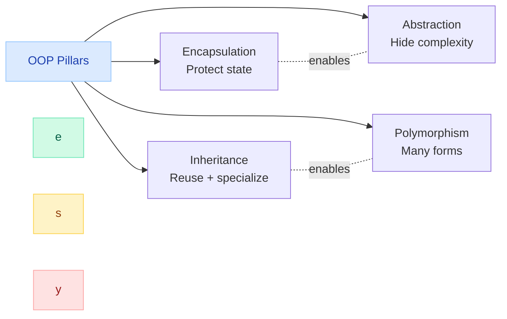
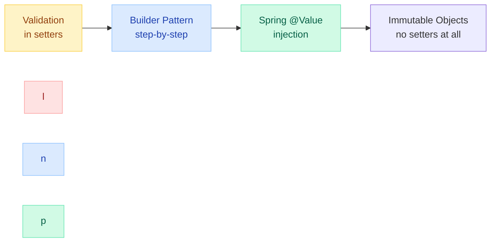
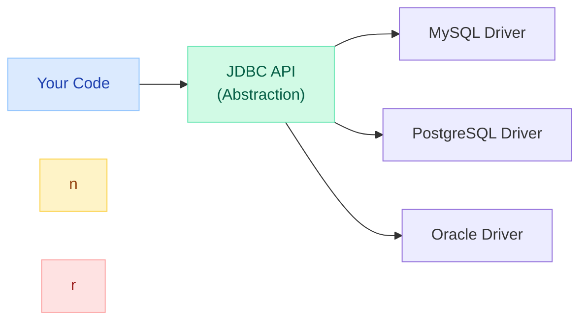
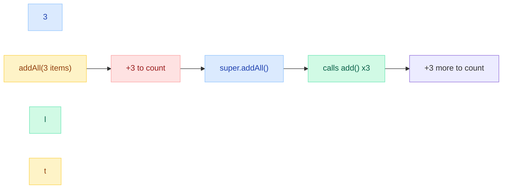
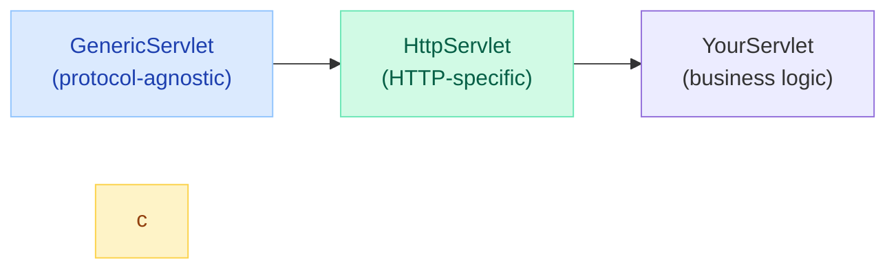
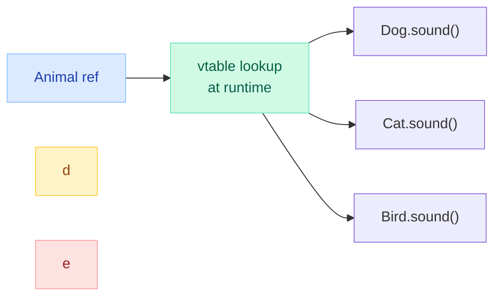
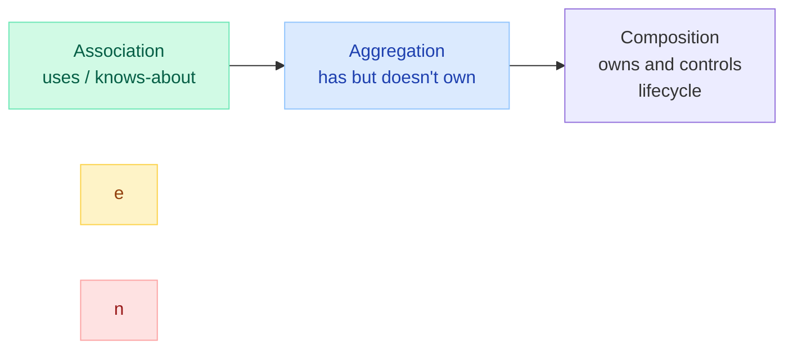
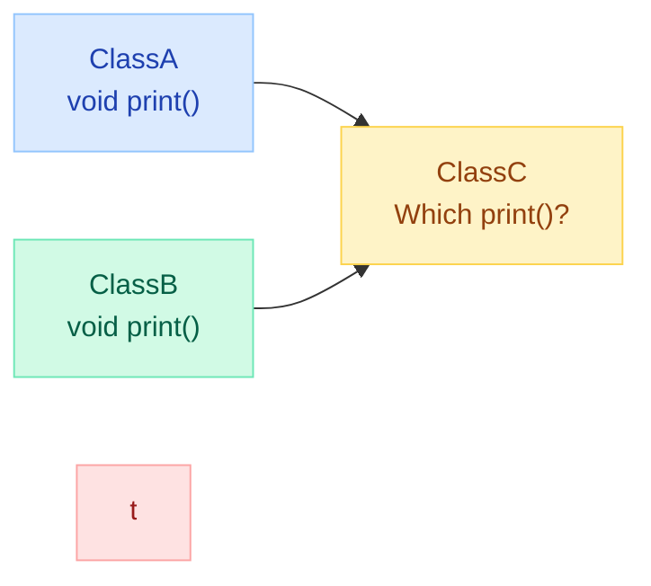
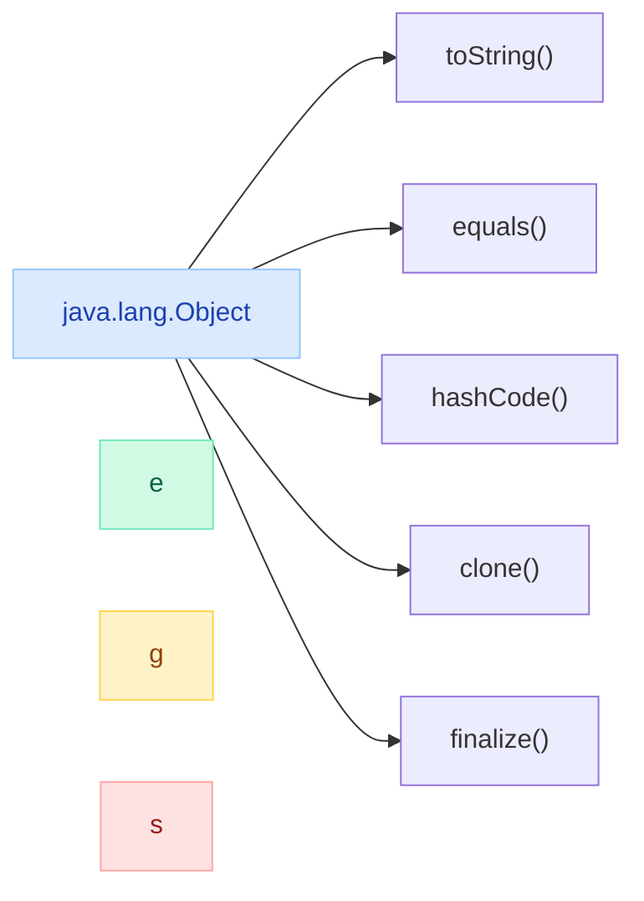

# Object-Oriented Programming in Java

> "Bad OOP doesn't just make code ugly — it makes systems fail at 2 AM on Black Friday."
> — Every on-call engineer who inherited a God class

!!! danger "Real Incident: The Payment Gateway That Couldn't Scale"
    A fintech startup modeled all payment types (UPI, card, wallet, BNPL) inside a single `PaymentProcessor` class with a 47-branch `switch` statement. When they added crypto payments, a developer accidentally broke the UPI validation path. Result: **$2.3M in duplicate charges** over 4 hours before rollback. Root cause: zero encapsulation, no polymorphism, and a God class that violated every OOP principle. The fix took 3 sprints to refactor into a proper Strategy pattern.

---

## Why OOP Exists — The Problem It Solves

Before OOP, large programs were written as collections of functions operating on shared global data. This worked fine for small programs, but at scale (10+ developers, 100K+ lines), it fell apart:

- **Any function could modify any data** — a billing function could accidentally corrupt user session state
- **Changes cascaded unpredictably** — modifying one data structure broke 47 functions across 12 files
- **No way to model real-world entities** — a "Customer" was scattered across 30 different arrays and maps
- **Testing was nearly impossible** — you couldn't isolate a piece of logic without setting up the entire global state

OOP solves this by bundling **data + behavior into objects** with controlled access. Each object protects its own state, exposes only what's necessary, and can be tested in isolation. The four pillars below are the mechanisms that make this possible.

---

## The Four Pillars at a Glance


```mermaid
flowchart LR
    OOP["OOP Pillars"] --> E["Encapsulation<br/>Protect state"]
    OOP --> A["Abstraction<br/>Hide complexity"]
    OOP --> I["Inheritance<br/>Reuse + specialize"]
    OOP --> P["Polymorphism<br/>Many forms"]

    E -.-|"enables"| A
    I -.-|"enables"| P

    style OOP fill:#DBEAFE,stroke:#93C5FD,color:#1E40AF
    style e fill:#D1FAE5,stroke:#6EE7B7,color:#065F46
    style s fill:#FEF3C7,stroke:#FCD34D,color:#92400E
    style y fill:#FEE2E2,stroke:#FCA5A5,color:#991B1B
```

---

## 1. Encapsulation

Most developers think encapsulation means "private fields + getters/setters." That is the *mechanism*, not the *purpose*. The real goal is **protecting invariants** — ensuring your object can never exist in an invalid state.

### Production Scenario: Account Balance in a Concurrent System

At a neobank, two threads simultaneously attempt to debit an account. Without encapsulation, raw field access causes a race condition:

```java
// BAD: No encapsulation — anyone can mutate balance
public class UnsafeAccount {
    public double balance; // exposed!
}

// Thread A reads balance = 1000, decides to withdraw 800
// Thread B reads balance = 1000, decides to withdraw 600
// Both succeed → balance = -400 (impossible state)
```

The encapsulated version forces all mutations through a synchronized, validated method:

```java
public class BankAccount {
    private double balance;
    private final ReentrantLock lock = new ReentrantLock();

    public BankAccount(double initialBalance) {
        if (initialBalance < 0) throw new IllegalArgumentException("Negative initial balance");
        this.balance = initialBalance;
    }

    public boolean withdraw(double amount) {
        if (amount <= 0) throw new IllegalArgumentException("Amount must be positive");
        lock.lock();
        try {
            if (amount > balance) return false;
            balance -= amount;
            return true;
        } finally {
            lock.unlock();
        }
    }

    public double getBalance() {
        return balance; // read-only access — no setter exists
    }
}
```

There is **no** `setBalance()`. The class controls every transition, making invalid states unrepresentable.

### Encapsulation Beyond Getters/Setters


```mermaid
flowchart LR
    V["Validation<br/>in setters"] --> B["Builder Pattern<br/>step-by-step"]
    B --> DI["Spring @Value<br/>injection"]
    DI --> IM["Immutable Objects<br/>no setters at all"]

    style B fill:#DBEAFE,stroke:#93C5FD,color:#1E40AF
    style DI fill:#D1FAE5,stroke:#6EE7B7,color:#065F46
    style V fill:#FEF3C7,stroke:#FCD34D,color:#92400E
    style l fill:#FEE2E2,stroke:#FCA5A5,color:#991B1B
    style n fill:#DBEAFE,stroke:#93C5FD,color:#1E40AF
    style p fill:#D1FAE5,stroke:#6EE7B7,color:#065F46
```

**Builder pattern as encapsulation**: The Builder ensures you cannot construct an `Order` without mandatory fields (userId, items), while optional fields (couponCode, giftWrap) default safely.

```java
public class Order {
    private final String userId;    // mandatory
    private final List<Item> items; // mandatory
    private final String couponCode;
    private final boolean giftWrap;

    private Order(Builder b) {
        this.userId = Objects.requireNonNull(b.userId);
        this.items = List.copyOf(b.items); // defensive copy!
        this.couponCode = b.couponCode;
        this.giftWrap = b.giftWrap;
    }

    public static class Builder {
        private String userId;
        private List<Item> items;
        private String couponCode;
        private boolean giftWrap = false;

        public Builder userId(String id) { this.userId = id; return this; }
        public Builder items(List<Item> items) { this.items = items; return this; }
        public Builder couponCode(String code) { this.couponCode = code; return this; }
        public Builder giftWrap(boolean wrap) { this.giftWrap = wrap; return this; }

        public Order build() {
            if (userId == null || items == null || items.isEmpty())
                throw new IllegalStateException("userId and items are required");
            return new Order(this);
        }
    }
}
```

**Spring `@Value` as encapsulation**: Configuration values are injected and validated at startup — the class never exposes them.

```java
@Component
public class PaymentConfig {
    @Value("${payment.retry.max:3}")
    private int maxRetries;

    @Value("${payment.timeout.ms:5000}")
    private int timeoutMs;

    // No setters. Only behavior exposed:
    public RetryPolicy getRetryPolicy() {
        return new RetryPolicy(maxRetries, timeoutMs);
    }
}
```

### What Breaks Without Encapsulation

| Scenario | Without Encapsulation | With Encapsulation |
|---|---|---|
| Negative balance | `account.balance = -9999` compiles fine | Impossible — `withdraw()` rejects it |
| Invalid email | `user.email = "not-an-email"` | Setter validates regex |
| Concurrent writes | Race conditions, corrupted state | Synchronized methods + atomic fields |
| API versioning | All callers break when field renamed | Internal rename, getter stays stable |

!!! tip "Interview Trap"
    "Are getters/setters always good encapsulation?" **No.** If your setter does `this.x = x` with no validation, you have *syntactic* encapsulation but *semantic* exposure. A true encapsulated class exposes **behaviors** (deposit, withdraw) not **data** (setBalance).

---

## 2. Abstraction

Abstraction is not "hiding complexity" as a vague concept — it is providing a **stable contract** that decouples callers from implementation details, so you can swap implementations without changing a single line of client code.

### Production Scenario: JDBC — Swap MySQL for PostgreSQL

Your application uses JDBC. The same code works across MySQL, PostgreSQL, Oracle, and H2:

```java
// Caller never knows which DB it's talking to
Connection conn = dataSource.getConnection();
PreparedStatement ps = conn.prepareStatement("SELECT * FROM orders WHERE user_id = ?");
ps.setString(1, userId);
ResultSet rs = ps.executeQuery();
```

The `Connection`, `PreparedStatement`, `ResultSet` are all **interfaces** (abstractions). Each database vendor provides its own implementation. You switch from MySQL to PostgreSQL by changing one line in `application.yml` — zero Java code changes.


```mermaid
flowchart LR
    APP["Your Code"] --> JDBC["JDBC API<br/>(Abstraction)"]
    JDBC --> MySQL["MySQL Driver"]
    JDBC --> PG["PostgreSQL Driver"]
    JDBC --> Oracle["Oracle Driver"]

    style APP fill:#DBEAFE,stroke:#93C5FD,color:#1E40AF
    style JDBC fill:#D1FAE5,stroke:#6EE7B7,color:#065F46
    style n fill:#FEF3C7,stroke:#FCD34D,color:#92400E
    style r fill:#FEE2E2,stroke:#FCA5A5,color:#991B1B
```

### Spring's `@Transactional` — Hiding Commit/Rollback

Without abstraction, you write this in every service method:

```java
// WITHOUT abstraction: manual transaction management
public void transferMoney(String from, String to, double amount) {
    Connection conn = null;
    try {
        conn = dataSource.getConnection();
        conn.setAutoCommit(false);
        debit(conn, from, amount);
        credit(conn, to, amount);
        conn.commit();
    } catch (Exception e) {
        conn.rollback();
        throw e;
    } finally {
        conn.close();
    }
}
```

With Spring's `@Transactional` abstraction:

```java
// WITH abstraction: one annotation hides all the plumbing
@Transactional
public void transferMoney(String from, String to, double amount) {
    debit(from, amount);
    credit(to, amount);
}
```

Same behavior. Zero boilerplate. The abstraction layer (Spring AOP proxy) handles begin, commit, rollback, and connection cleanup.

### Payment Gateway Abstraction

```java
public interface PaymentGateway {
    PaymentResult charge(Money amount, PaymentInstrument instrument);
    PaymentResult refund(String transactionId, Money amount);
    PaymentStatus checkStatus(String transactionId);
}

// Stripe implementation
@Service("stripeGateway")
public class StripePaymentGateway implements PaymentGateway {
    @Override
    public PaymentResult charge(Money amount, PaymentInstrument instrument) {
        // Stripe-specific API calls, retry logic, error mapping
    }
}

// Razorpay implementation
@Service("razorpayGateway")
public class RazorpayPaymentGateway implements PaymentGateway {
    @Override
    public PaymentResult charge(Money amount, PaymentInstrument instrument) {
        // Razorpay-specific API calls
    }
}
```

The `OrderService` depends only on `PaymentGateway` — never on Stripe or Razorpay directly. You can A/B test gateways, failover between them, or add a new one without touching order logic.

### Abstract Class vs Interface — Decision Matrix

| Criteria | Abstract Class | Interface |
|---|---|---|
| Shared state (fields) | Yes | No (only constants) |
| Constructor logic | Yes | No |
| Multiple inheritance | No (single extends) | Yes (multiple implements) |
| Default methods | Always had concrete methods | Since Java 8 |
| Private methods | Always | Since Java 9 |
| **Use when** | Classes share **identity** (IS-A) | Classes share **capability** (CAN-DO) |

**Template Method Pattern** — the best use of abstract classes:

```java
public abstract class OrderProcessor {
    // Template method — defines the skeleton
    public final OrderResult process(Order order) {
        validate(order);
        Money total = calculateTotal(order);
        PaymentResult payment = chargePayment(order, total);
        if (payment.isSuccess()) {
            fulfill(order);
        }
        return buildResult(order, payment);
    }

    protected abstract void validate(Order order);
    protected abstract Money calculateTotal(Order order);
    protected abstract void fulfill(Order order);

    // Concrete shared logic
    private PaymentResult chargePayment(Order order, Money total) {
        return gateway.charge(total, order.getPaymentInstrument());
    }
}

public class DigitalOrderProcessor extends OrderProcessor {
    @Override protected void validate(Order o) { /* check download limits */ }
    @Override protected Money calculateTotal(Order o) { /* no shipping */ }
    @Override protected void fulfill(Order o) { /* send download link */ }
}

public class PhysicalOrderProcessor extends OrderProcessor {
    @Override protected void validate(Order o) { /* check address, stock */ }
    @Override protected Money calculateTotal(Order o) { /* + shipping + tax */ }
    @Override protected void fulfill(Order o) { /* create shipment */ }
}
```

---

## 3. Inheritance

Inheritance is the most **misused** OOP concept. It is powerful when applied correctly (genuine IS-A specialization) and catastrophic when forced (Square extends Rectangle, Stack extends Vector).

### Constructor Chaining — The Hidden `super()`

Every constructor in Java implicitly calls `super()` as its first statement if you do not explicitly write one:

```java
class Entity {
    protected final String id;
    Entity() {
        this.id = UUID.randomUUID().toString();
        System.out.println("Entity created: " + id);
    }
}

class User extends Entity {
    private String email;
    User(String email) {
        // super() is implicitly inserted here
        this.email = email;
        System.out.println("User created: " + email);
    }
}

class AdminUser extends User {
    AdminUser(String email) {
        super(email); // explicitly calling User(email)
        System.out.println("Admin created");
    }
}

new AdminUser("admin@corp.com");
// Output:
// Entity created: <uuid>
// User created: admin@corp.com
// Admin created
```

Constructors chain **top-down**: parent first, child last. Destruction (GC) is the reverse.

### The Fragile Base Class Problem

This is why Effective Java says "prefer composition over inheritance":

```java
// Library code — v1.0
public class InstrumentedHashSet<E> extends HashSet<E> {
    private int addCount = 0;

    @Override
    public boolean add(E e) {
        addCount++;
        return super.add(e);
    }

    @Override
    public boolean addAll(Collection<? extends E> c) {
        addCount += c.size();
        return super.addAll(c);
    }

    public int getAddCount() { return addCount; }
}
```

```java
InstrumentedHashSet<String> s = new InstrumentedHashSet<>();
s.addAll(List.of("a", "b", "c"));
System.out.println(s.getAddCount()); // Expected 3, actual 6!
```

**Why?** `HashSet.addAll()` internally calls `add()` for each element. Our overridden `addAll()` increments by 3, then calls `super.addAll()`, which calls our overridden `add()` three more times. Total: 6. The base class's internal implementation leaked through inheritance.


```mermaid
flowchart LR
    CALL["addAll(3 items)"] --> INC["+3 to count"]
    INC --> SUPER["super.addAll()"]
    SUPER --> ADD1["calls add() x3"]
    ADD1 --> INC2["+3 more to count"]

    style 3 fill:#DBEAFE,stroke:#93C5FD,color:#1E40AF
    style ADD1 fill:#D1FAE5,stroke:#6EE7B7,color:#065F46
    style CALL fill:#FEF3C7,stroke:#FCD34D,color:#92400E
    style INC fill:#FEE2E2,stroke:#FCA5A5,color:#991B1B
    style SUPER fill:#DBEAFE,stroke:#93C5FD,color:#1E40AF
    style l fill:#D1FAE5,stroke:#6EE7B7,color:#065F46
    style t fill:#FEF3C7,stroke:#FCD34D,color:#92400E
```

**The fix — composition (wrapper/decorator):**

```java
public class InstrumentedSet<E> implements Set<E> {
    private final Set<E> delegate; // composition
    private int addCount = 0;

    public InstrumentedSet(Set<E> delegate) { this.delegate = delegate; }

    @Override
    public boolean add(E e) {
        addCount++;
        return delegate.add(e);
    }

    @Override
    public boolean addAll(Collection<? extends E> c) {
        addCount += c.size();
        return delegate.addAll(c); // delegate's addAll won't call OUR add
    }
    // ... delegate all other Set methods
}
```

### Servlet Hierarchy — Inheritance Done Right


```mermaid
flowchart LR
    GS["GenericServlet<br/>(protocol-agnostic)"] --> HS["HttpServlet<br/>(HTTP-specific)"]
    HS --> YOUR["YourServlet<br/>(business logic)"]

    style GS fill:#DBEAFE,stroke:#93C5FD,color:#1E40AF
    style HS fill:#D1FAE5,stroke:#6EE7B7,color:#065F46
    style c fill:#FEF3C7,stroke:#FCD34D,color:#92400E
```

This works because each level adds genuinely new, stable functionality:

- `GenericServlet` — lifecycle (`init`, `destroy`)
- `HttpServlet` — routes `service()` to `doGet()`, `doPost()`, etc.
- `YourServlet` — you override only the HTTP methods you need

### When Inheritance Goes Wrong

| Violation | Why It Fails | Fix |
|---|---|---|
| `Stack extends Vector` | Stack IS-NOT-A Vector — you can insert at any index | Composition (delegate to internal list) |
| `Square extends Rectangle` | Square breaks `setWidth`/`setHeight` postconditions (LSP) | Separate classes + shared Shape interface |
| `Properties extends Hashtable` | Properties is for String/String, but inherits `put(Object, Object)` | Should have used composition |

!!! warning "Interview Trap: Can you override a private method?"
    No. Private methods are not visible to subclasses. If you define a method with the same signature in the child, it is a **completely new method**, not an override. The `@Override` annotation would cause a compile error.

---

## 4. Polymorphism

Polymorphism is what makes large systems maintainable. Without it, every new feature requires modifying existing code (violating Open/Closed). With it, you extend behavior by adding new classes.

### Compile-Time (Static) Polymorphism — Method Overloading

The compiler resolves which method to call based on parameter types at compile time:

```java
public class JsonSerializer {
    public String serialize(Order order) {
        return objectMapper.writeValueAsString(order);
    }

    public String serialize(List<Order> orders) {
        return objectMapper.writeValueAsString(orders);
    }

    public String serialize(Order order, boolean prettyPrint) {
        ObjectWriter writer = prettyPrint
            ? objectMapper.writerWithDefaultPrettyPrinter()
            : objectMapper.writer();
        return writer.writeValueAsString(order);
    }
}
```

**Overloading rules:**

- Same method name
- Different parameter list (number, type, or order)
- Return type alone is NOT sufficient to overload
- `static` methods can be overloaded

### Runtime (Dynamic) Polymorphism — Method Overriding

The JVM resolves which method to call based on the actual object at runtime. This is the backbone of the Strategy pattern, plugin systems, and Spring's entire DI framework.

**Payment processing with Strategy pattern:**

```java
public interface PaymentStrategy {
    PaymentResult execute(PaymentRequest request);
    boolean supports(PaymentMethod method);
}

@Component
public class CreditCardStrategy implements PaymentStrategy {
    @Override
    public PaymentResult execute(PaymentRequest request) {
        // tokenize card, call acquirer, handle 3DS
        return acquirer.charge(request.getAmount(), request.getCardToken());
    }

    @Override
    public boolean supports(PaymentMethod method) {
        return method == PaymentMethod.CREDIT_CARD;
    }
}

@Component
public class UpiStrategy implements PaymentStrategy {
    @Override
    public PaymentResult execute(PaymentRequest request) {
        // generate UPI intent, call PSP
        return psp.collectPayment(request.getVpa(), request.getAmount());
    }

    @Override
    public boolean supports(PaymentMethod method) {
        return method == PaymentMethod.UPI;
    }
}

@Service
public class PaymentService {
    private final List<PaymentStrategy> strategies; // Spring injects ALL implementations

    public PaymentService(List<PaymentStrategy> strategies) {
        this.strategies = strategies;
    }

    public PaymentResult processPayment(PaymentRequest request) {
        return strategies.stream()
            .filter(s -> s.supports(request.getMethod()))
            .findFirst()
            .orElseThrow(() -> new UnsupportedPaymentException(request.getMethod()))
            .execute(request);
    }
}
```

Adding a new payment method (say crypto) requires **zero changes** to `PaymentService` — just add a new `@Component` class.

### How the JVM Dispatches Methods (vtable)


```mermaid
flowchart LR
    REF["Animal ref"] --> VT["vtable lookup<br/>at runtime"]
    VT --> DOG["Dog.sound()"]
    VT --> CAT["Cat.sound()"]
    VT --> BIRD["Bird.sound()"]

    style REF fill:#DBEAFE,stroke:#93C5FD,color:#1E40AF
    style VT fill:#D1FAE5,stroke:#6EE7B7,color:#065F46
    style d fill:#FEF3C7,stroke:#FCD34D,color:#92400E
    style e fill:#FEE2E2,stroke:#FCA5A5,color:#991B1B
```

Every class has a **vtable** (virtual method table) — an array of method pointers. When you call `animal.sound()`:

1. JVM looks at the actual object's class (not the reference type)
2. Finds the vtable for that class
3. Looks up the method at the correct offset
4. Jumps to that implementation

This is why `final` methods are faster — the JVM can inline them (no vtable lookup needed).

### Overloading vs Overriding — Complete Comparison

| Aspect | Overloading (Static) | Overriding (Dynamic) |
|---|---|---|
| Resolved at | Compile time | Runtime |
| Binding | Early binding | Late binding |
| Where | Same class or parent/child | Parent → child |
| Parameters | Must differ | Must be identical |
| Return type | Can differ | Same or covariant |
| Access modifier | Can differ | Cannot be more restrictive |
| Exceptions | Can throw any | Cannot throw broader checked |
| `static` methods | Can overload | Cannot override (method hiding) |
| `final` methods | Can overload | Cannot override |
| `private` methods | Can overload | Not visible to child |
| Performance | Slightly faster (static dispatch) | vtable lookup (JIT optimizes) |

### Covariant Return Types

A lesser-known feature that trips up interview candidates:

```java
class AnimalFactory {
    Animal create() { return new Animal(); }
}

class DogFactory extends AnimalFactory {
    @Override
    Dog create() { return new Dog(); } // Dog is a subtype of Animal — valid!
}
```

The overriding method can return a **subtype** of the parent's return type. This is covariant return.

---

## 5. Association, Aggregation, and Composition

These three describe the **strength of the HAS-A relationship** between objects.


```mermaid
flowchart LR
    ASSOC["Association<br/>uses / knows-about"] --> AGG["Aggregation<br/>has but doesn't own"]
    AGG --> COMP["Composition<br/>owns and controls<br/>lifecycle"]

    style AGG fill:#DBEAFE,stroke:#93C5FD,color:#1E40AF
    style ASSOC fill:#D1FAE5,stroke:#6EE7B7,color:#065F46
    style e fill:#FEF3C7,stroke:#FCD34D,color:#92400E
    style n fill:#FEE2E2,stroke:#FCA5A5,color:#991B1B
```

### Composition — Spring Dependency Injection

In Spring, when a bean creates or exclusively owns another bean, that is composition:

```java
@Service
public class OrderService {
    private final OrderRepository repository;     // composition — lifecycle managed by Spring
    private final PaymentGateway paymentGateway;  // composition
    private final EventPublisher eventPublisher;  // composition

    // Constructor injection — Spring wires these; OrderService "owns" them logically
    public OrderService(OrderRepository repository,
                        PaymentGateway paymentGateway,
                        EventPublisher eventPublisher) {
        this.repository = repository;
        this.paymentGateway = paymentGateway;
        this.eventPublisher = eventPublisher;
    }

    @Transactional
    public OrderResult placeOrder(OrderRequest request) {
        Order order = repository.save(Order.from(request));
        PaymentResult payment = paymentGateway.charge(order.getTotal(), request.getInstrument());
        eventPublisher.publish(new OrderPlacedEvent(order.getId()));
        return OrderResult.success(order, payment);
    }
}
```

If `OrderService` is destroyed, none of these dependencies make sense in isolation (for this service's purpose). That is composition.

### Aggregation — Department Has Employees

```java
public class Employee {
    private String name;
    private String employeeId;
    // Employee exists independently — can transfer departments
}

public class Department {
    private String name;
    private List<Employee> employees; // aggregation — employees outlive the department

    public Department(String name) {
        this.name = name;
        this.employees = new ArrayList<>();
    }

    public void addEmployee(Employee e) { employees.add(e); }
    public void removeEmployee(Employee e) { employees.remove(e); }
    // If department is dissolved, employees still exist
}
```

### Production Comparison

| Relationship | UML Arrow | Lifecycle | Real Example | Spring Analog |
|---|---|---|---|---|
| Association | `→` | Independent | `Logger` used by any class | `@Autowired` utility |
| Aggregation | `◇→` | Child survives parent | `Department` has `Employee` | Shared bean (prototype) |
| Composition | `◆→` | Child dies with parent | `Order` has `OrderLineItem` | Private inner component |

---

## 6. SOLID Violations in the Wild

Each principle below is shown as a real production mistake.

### S — Single Responsibility Violation

```java
// GOD CLASS: UserService handles auth, profile, notifications, and billing
public class UserService {
    public User login(String email, String password) { /* auth logic */ }
    public void updateProfile(User user, ProfileDTO dto) { /* profile logic */ }
    public void sendWelcomeEmail(User user) { /* notification logic */ }
    public Invoice generateInvoice(User user) { /* billing logic */ }
}
// Bug: developer fixing billing breaks auth. 12 test files coupled to this class.
```

**Fix**: Split into `AuthService`, `ProfileService`, `NotificationService`, `BillingService`.

### O — Open/Closed Violation

```java
// Every new report type requires modifying this method
public class ReportGenerator {
    public byte[] generate(String type, Data data) {
        if (type.equals("PDF")) { /* PDF logic */ }
        else if (type.equals("CSV")) { /* CSV logic */ }
        else if (type.equals("EXCEL")) { /* Excel logic */ }
        // Adding XML? Must modify this class. Violates OCP.
    }
}
```

**Fix**: `ReportGenerator` interface with `PdfReportGenerator`, `CsvReportGenerator`, etc.

### L — Liskov Substitution Violation

```java
class Rectangle {
    protected int width, height;
    public void setWidth(int w) { this.width = w; }
    public void setHeight(int h) { this.height = h; }
    public int area() { return width * height; }
}

class Square extends Rectangle {
    @Override public void setWidth(int w) { width = w; height = w; }
    @Override public void setHeight(int h) { width = h; height = h; }
}

// Client code:
Rectangle r = new Square();
r.setWidth(5);
r.setHeight(10);
assert r.area() == 50; // FAILS! area() returns 100
```

**Fix**: Don't make Square extend Rectangle. Use a `Shape` interface.

### I — Interface Segregation Violation

```java
interface Worker {
    void code();
    void attendMeeting();
    void writeDocumentation();
    void fixBugs();
    void doCodeReview();
}

// Intern is forced to implement code review — which they can't do
class Intern implements Worker {
    public void doCodeReview() { throw new UnsupportedOperationException(); } // ISP violation
}
```

**Fix**: Split into `Coder`, `Reviewer`, `Documenter` interfaces.

### D — Dependency Inversion Violation

```java
// High-level module directly depends on low-level module
public class NotificationService {
    private final SmtpEmailSender sender = new SmtpEmailSender(); // concrete!

    public void notify(User user, String msg) {
        sender.send(user.getEmail(), msg); // can't switch to SES, can't unit test
    }
}
```

**Fix**: Depend on `EmailSender` interface; inject implementation.

---

## 7. The Diamond Problem

### Why Java Chose Single Class Inheritance


```mermaid
flowchart LR
    A["ClassA<br/>void print()"] --> C["ClassC<br/>Which print()?"]
    B["ClassB<br/>void print()"] --> C

    style A fill:#DBEAFE,stroke:#93C5FD,color:#1E40AF
    style B fill:#D1FAE5,stroke:#6EE7B7,color:#065F46
    style C fill:#FEF3C7,stroke:#FCD34D,color:#92400E
    style t fill:#FEE2E2,stroke:#FCA5A5,color:#991B1B
```

If `ClassC extends ClassA, ClassB` and both have `print()`, which one does C inherit? C++ solves this with virtual inheritance (complex). Java avoids it entirely: **single class inheritance only**.

### Default Methods Brought It Back (Java 8+)

```java
interface Loggable {
    default void log(String msg) {
        System.out.println("[LOG] " + msg);
    }
}

interface Auditable {
    default void log(String msg) {
        System.out.println("[AUDIT] " + msg);
    }
}

class TransactionService implements Loggable, Auditable {
    // COMPILE ERROR: class inherits unrelated defaults for log(String)
    // MUST override to resolve:
    @Override
    public void log(String msg) {
        Loggable.super.log(msg); // explicitly choose
    }
}
```

### Resolution Rules (Interview Gold)

1. **Class always wins** — a concrete method in a class beats any default method
2. **Most specific interface wins** — if B extends A, and both have `default void m()`, B's version wins
3. **If ambiguous, compiler forces you to override** — you must explicitly resolve

```java
interface A { default void hello() { System.out.println("A"); } }
interface B extends A { default void hello() { System.out.println("B"); } }

class C implements A, B {} // Rule 2: B is more specific → B's hello() wins

class D implements A, B {
    @Override
    public void hello() { A.super.hello(); } // explicit resolution
}
```

---

## 8. The Object Class Contract

Every class in Java extends `Object`. The contract between `toString`, `equals`, `hashCode`, `clone`, and `finalize` is the most commonly tested topic in FAANG interviews.

### The Big Five


```mermaid
flowchart LR
    OBJ["java.lang.Object"] --> TS["toString()"]
    OBJ --> EQ["equals()"]
    OBJ --> HC["hashCode()"]
    OBJ --> CL["clone()"]
    OBJ --> FN["finalize()"]

    style OBJ fill:#DBEAFE,stroke:#93C5FD,color:#1E40AF
    style e fill:#D1FAE5,stroke:#6EE7B7,color:#065F46
    style g fill:#FEF3C7,stroke:#FCD34D,color:#92400E
    style s fill:#FEE2E2,stroke:#FCA5A5,color:#991B1B
```

### `equals()` and `hashCode()` — The Contract

**Rule**: If `a.equals(b)` is `true`, then `a.hashCode() == b.hashCode()` MUST be `true`.

Breaking this contract breaks every hash-based collection:

```java
public class Employee {
    private final String id;
    private final String name;

    @Override
    public boolean equals(Object o) {
        if (this == o) return true;
        if (!(o instanceof Employee e)) return false;
        return Objects.equals(id, e.id);
    }

    @Override
    public int hashCode() {
        return Objects.hash(id); // MUST be consistent with equals
    }
}
```

**What happens if you override `equals()` but not `hashCode()`:**

```java
Map<Employee, String> map = new HashMap<>();
Employee e1 = new Employee("E001", "Vamsi");
map.put(e1, "Engineering");

Employee e2 = new Employee("E001", "Vamsi"); // same logical identity
System.out.println(map.get(e2)); // null! Different hashCode → wrong bucket
```

### `toString()` — Production Logging

Default `toString()` gives `ClassName@hexHashCode` — useless in logs. Override it:

```java
@Override
public String toString() {
    return "Order{id=%s, status=%s, total=%s, userId=%s}"
        .formatted(id, status, total, userId);
}
```

### `clone()` — Why It's Broken

The `Cloneable` interface is a **marker interface** with no methods. `clone()` is on `Object`. Problems:

1. Shallow copy by default — mutable fields are shared
2. No constructor is called — violates initialization invariants
3. Covariant return requires casting

**Prefer copy constructors or factory methods:**

```java
// Instead of clone():
public class Order {
    public Order(Order original) {
        this.id = UUID.randomUUID().toString(); // new ID
        this.items = new ArrayList<>(original.items); // deep copy
        this.status = OrderStatus.DRAFT; // reset state
    }
}
```

### `finalize()` — Deprecated and Dangerous

- Called by GC *sometime* before collection (non-deterministic)
- May never be called at all
- Causes GC pauses and resurrection bugs
- **Removed in Java 18** (deprecated since Java 9)

**Use `AutoCloseable` + try-with-resources instead:**

```java
public class DatabaseConnection implements AutoCloseable {
    @Override
    public void close() {
        // deterministic cleanup
        connection.close();
    }
}
```

---

## 9. FAANG Interview Questions

### Output-Based Questions

**Q1: Dynamic dispatch with fields vs methods**

```java
class A {
    int x = 10;
    void show() { System.out.println("A: " + x); }
}

class B extends A {
    int x = 20;
    void show() { System.out.println("B: " + x); }
}

public class Test {
    public static void main(String[] args) {
        A obj = new B();
        System.out.println(obj.x);
        obj.show();
    }
}
```

??? note "Answer"
    **Output:**
    ```
    10
    B: 20
    ```
    **Fields are resolved at compile time** (reference type `A` → `A.x = 10`). **Methods are resolved at runtime** (actual object `B` → `B.show()`). Fields are NEVER polymorphic in Java.

---

**Q2: Constructor calling overridden method**

```java
class Parent {
    int value = 10;
    Parent() { display(); }
    void display() { System.out.println("Parent: " + value); }
}

class Child extends Parent {
    int value = 20;
    Child() { display(); }
    @Override
    void display() { System.out.println("Child: " + value); }
}

public class Test {
    public static void main(String[] args) { new Child(); }
}
```

??? note "Answer"
    **Output:**
    ```
    Child: 0
    Child: 20
    ```
    When `Parent()` calls `display()`, the object is actually a `Child`, so `Child.display()` runs. But `Child.value` has not been initialized yet (still default `0`). After `Parent()` completes, `Child.value = 20` is assigned, then `Child()` calls `display()` again → `Child: 20`. **Never call overridable methods from constructors.**

---

**Q3: Static method hiding**

```java
class Base {
    static void greet() { System.out.println("Base"); }
}

class Derived extends Base {
    static void greet() { System.out.println("Derived"); }
}

public class Test {
    public static void main(String[] args) {
        Base obj = new Derived();
        obj.greet();
    }
}
```

??? note "Answer"
    **Output:** `Base`

    Static methods use **early binding** (compile-time). The reference type is `Base`, so `Base.greet()` is called. This is **method hiding**, not overriding. `@Override` on a static method causes a compile error.

---

**Q4: Constructor chaining order**

```java
class A {
    static { System.out.println("A static"); }
    { System.out.println("A instance"); }
    A() { System.out.println("A constructor"); }
}

class B extends A {
    static { System.out.println("B static"); }
    { System.out.println("B instance"); }
    B() { System.out.println("B constructor"); }
}

public class Test {
    public static void main(String[] args) { new B(); }
}
```

??? note "Answer"
    **Output:**
    ```
    A static
    B static
    A instance
    A constructor
    B instance
    B constructor
    ```
    Order: parent static → child static (class loading, once) → parent instance block → parent constructor → child instance block → child constructor (per object creation).

---

**Q5: Covariant return + overriding**

```java
class Animal {
    Animal create() {
        System.out.println("Animal created");
        return new Animal();
    }
}

class Dog extends Animal {
    @Override
    Dog create() { // covariant return — valid!
        System.out.println("Dog created");
        return new Dog();
    }
}

public class Test {
    public static void main(String[] args) {
        Animal a = new Dog();
        a.create();
    }
}
```

??? note "Answer"
    **Output:** `Dog created`

    Runtime polymorphism — `a` is actually a `Dog`, so `Dog.create()` is called. The covariant return (`Dog` instead of `Animal`) is allowed because `Dog IS-A Animal`.

---

**Q6: Tricky overloading vs overriding**

```java
class Parent {
    void process(int x) { System.out.println("Parent int: " + x); }
}

class Child extends Parent {
    void process(long x) { System.out.println("Child long: " + x); }
}

public class Test {
    public static void main(String[] args) {
        Child c = new Child();
        c.process(10);
    }
}
```

??? note "Answer"
    **Output:** `Parent int: 10`

    `10` is an `int` literal. The compiler finds `process(int)` inherited from `Parent` as an exact match. `process(long)` in `Child` would require widening — exact match wins. This is **overloading** (different parameter types), not overriding.

---

**Q7: equals() symmetry trap**

```java
class Point {
    int x, y;
    Point(int x, int y) { this.x = x; this.y = y; }

    @Override
    public boolean equals(Object o) {
        if (o instanceof Point p) return x == p.x && y == p.y;
        return false;
    }
}

class ColorPoint extends Point {
    String color;
    ColorPoint(int x, int y, String color) { super(x, y); this.color = color; }

    @Override
    public boolean equals(Object o) {
        if (o instanceof ColorPoint cp) return super.equals(cp) && color.equals(cp.color);
        if (o instanceof Point) return super.equals(o); // asymmetric!
        return false;
    }
}

public class Test {
    public static void main(String[] args) {
        Point p = new Point(1, 2);
        ColorPoint cp = new ColorPoint(1, 2, "RED");
        System.out.println(p.equals(cp));  // true (Point ignores color)
        System.out.println(cp.equals(p));  // true (ColorPoint falls through to super)

        ColorPoint cp2 = new ColorPoint(1, 2, "BLUE");
        System.out.println(cp.equals(cp2)); // false (different color)
        System.out.println(p.equals(cp));   // true
        System.out.println(p.equals(cp2));  // true
        // Transitivity violated: cp.equals(p) && p.equals(cp2) but !cp.equals(cp2)
    }
}
```

??? note "Answer"
    This violates the **transitivity** contract of `equals()`. `cp.equals(p)` is true, `p.equals(cp2)` is true, but `cp.equals(cp2)` is false. There is no way to extend an instantiable class and add a value component while preserving the equals contract. **Solution**: use composition instead of inheritance, or use `getClass()` instead of `instanceof` (but this breaks LSP).

---

### Design Questions

**Q8: Design a notification system where users configure multiple channels (Email, SMS, Push, Slack).**

??? note "Answer"
    ```java
    public interface NotificationChannel {
        void send(String userId, String message);
        boolean isEnabled(UserPreferences prefs);
    }

    @Component
    public class EmailChannel implements NotificationChannel {
        private final EmailClient emailClient;
        public void send(String userId, String msg) { /* send email */ }
        public boolean isEnabled(UserPreferences p) { return p.isEmailEnabled(); }
    }

    @Component
    public class SmsChannel implements NotificationChannel { /* ... */ }

    @Service
    public class NotificationService {
        private final List<NotificationChannel> channels;

        public NotificationService(List<NotificationChannel> channels) {
            this.channels = channels;
        }

        public void notify(String userId, String message) {
            UserPreferences prefs = prefsRepo.findByUserId(userId);
            channels.stream()
                .filter(ch -> ch.isEnabled(prefs))
                .forEach(ch -> ch.send(userId, message));
        }
    }
    ```
    Uses: polymorphism (runtime dispatch), composition (service owns channels via DI), OCP (add Slack without touching NotificationService).

---

**Q9: Explain why `java.util.Stack extends Vector` is considered a design mistake.**

??? note "Answer"
    A Stack IS-NOT-A Vector. A stack only supports push/pop/peek (LIFO). But because it extends Vector, you can call `add(index, element)`, `remove(index)`, and `set(index, value)` — all of which violate the LIFO contract. It also inherits thread-safety overhead from Vector even when single-threaded. The fix (in modern Java): use `Deque<E> stack = new ArrayDeque<>()` — composition via an interface.

---

**Q10: What is the output and why?**

```java
interface Printable {
    default void print() { System.out.println("Printable"); }
}

interface Showable extends Printable {
    default void print() { System.out.println("Showable"); }
}

class Document implements Printable, Showable {}

public class Test {
    public static void main(String[] args) {
        new Document().print();
    }
}
```

??? note "Answer"
    **Output:** `Showable`

    Diamond problem resolution: **most specific interface wins**. `Showable extends Printable`, so `Showable.print()` is more specific. No compile error because the ambiguity is resolved by the specificity rule.

---

**Q11: How does Spring's `DispatcherServlet` use polymorphism?**

??? note "Answer"
    `DispatcherServlet` maintains a list of `HandlerMapping` implementations. When a request arrives, it iterates through mappings (RequestMappingHandlerMapping, BeanNameUrlHandlerMapping, etc.) until one returns a handler. The handler is executed through `HandlerAdapter` (another polymorphic interface). This is pure runtime polymorphism — the servlet never knows the concrete types. Adding a new mapping type (say WebSocket) requires zero changes to DispatcherServlet.

---

**Q12: Can an abstract class have a constructor? When is it called?**

??? note "Answer"
    Yes. Abstract class constructors are called via `super()` from the concrete subclass constructor. They initialize shared state. You cannot call `new AbstractClass()` directly — but the constructor runs every time a concrete subclass is instantiated. Common use: validating mandatory fields that all subclasses share.

---

**Q13: What is the difference between method hiding and method overriding?**

??? note "Answer"
    | Aspect | Hiding (static) | Overriding (instance) |
    |---|---|---|
    | Applies to | `static` methods | Instance methods |
    | Dispatch | Compile-time (reference type) | Runtime (object type) |
    | `@Override` | Cannot use (compile error) | Should use |
    | Polymorphism | None | Yes |

    ```java
    class Parent { static void foo() {} void bar() {} }
    class Child extends Parent { static void foo() {} void bar() {} }
    Parent p = new Child();
    p.foo(); // Parent.foo() — hiding
    p.bar(); // Child.bar() — overriding
    ```

---

**Q14: Explain `instanceOf` behavior with inheritance.**

```java
class Vehicle {}
class Car extends Vehicle {}
class ElectricCar extends Car {}

ElectricCar ec = new ElectricCar();
System.out.println(ec instanceof Vehicle);     // ?
System.out.println(ec instanceof Car);         // ?
System.out.println(ec instanceof ElectricCar); // ?
System.out.println(ec instanceof Object);      // ?

Vehicle v = null;
System.out.println(v instanceof Vehicle);      // ?
```

??? note "Answer"
    All are `true` except the last one (`false`). `instanceof` checks the actual object against the type hierarchy. A `null` reference always returns `false` for any `instanceof` check — it does not throw NPE.

---

**Q15: Why does this fail at runtime?**

```java
List<String> strings = new ArrayList<>();
strings.add("hello");
List rawList = strings;         // raw type — no compile error
rawList.add(42);                // no compile error (raw type bypass)
String s = strings.get(1);     // ClassCastException at runtime!
```

??? note "Answer"
    Type erasure: at runtime, `List<String>` is just `List`. The raw type reference bypasses compile-time generics checking. When you retrieve the `Integer` 42 and try to cast it to `String`, you get `ClassCastException`. This is why raw types are dangerous and why you should never suppress unchecked warnings without understanding the implications.

---

**Q16: Design an immutable class for a configuration object.**

??? note "Answer"
    ```java
    public final class AppConfig { // final — cannot extend
        private final String dbUrl;
        private final int maxConnections;
        private final List<String> allowedOrigins;

        public AppConfig(String dbUrl, int maxConnections, List<String> allowedOrigins) {
            this.dbUrl = Objects.requireNonNull(dbUrl);
            this.maxConnections = maxConnections;
            this.allowedOrigins = List.copyOf(allowedOrigins); // defensive copy + unmodifiable
        }

        public String getDbUrl() { return dbUrl; }
        public int getMaxConnections() { return maxConnections; }
        public List<String> getAllowedOrigins() { return allowedOrigins; } // already unmodifiable

        // Or use Java 16+ record:
        // public record AppConfig(String dbUrl, int maxConnections, List<String> allowedOrigins) {}
    }
    ```
    Rules: class `final`, fields `private final`, no setters, defensive copies of mutable arguments, return unmodifiable collections.

---

**Q17: What happens when you call `super()` and `this()` in the same constructor?**

??? note "Answer"
    **Compile error.** Both `super()` and `this()` must be the first statement in a constructor. You cannot have both. If you use `this()` to chain to another constructor in the same class, that other constructor will eventually call `super()`.

---

## Quick Recall Table

| Concept | One-Line Definition | Key Benefit | Interview Pitfall |
|---|---|---|---|
| Encapsulation | Protect state via access control | Prevents invalid state | Getters/setters without validation is not real encapsulation |
| Abstraction | Stable contract hiding implementation | Swap implementations freely | Abstract class vs interface choice |
| Inheritance | IS-A specialization of parent | Code reuse | Fragile base class, constructor call order |
| Polymorphism | Same reference, different behavior | Open/Closed principle | Fields are NOT polymorphic, static methods are NOT overridden |
| Composition | Strong HAS-A, owns lifecycle | Loose coupling, flexibility | Prefer over inheritance (GoF rule) |
| Aggregation | Weak HAS-A, independent lifecycle | Models real-world "contains" | Child outlives parent |
| SOLID - S | One reason to change | Smaller, testable classes | God class anti-pattern |
| SOLID - O | Open for extension, closed for modification | Add features without breaking | Strategy/Plugin pattern |
| SOLID - L | Subtypes must be substitutable | Safe polymorphism | Square/Rectangle, Stack/Vector |
| SOLID - I | No unused method dependencies | Focused interfaces | Marker interface abuse |
| SOLID - D | Depend on abstractions | Testable, swappable | Constructor injection over `new` |
| Diamond Problem | Ambiguous multiple inheritance | Java prevents via single extends | Default method resolution rules |
| equals/hashCode | Contract for hash-based collections | HashMap correctness | Override both or neither |
| clone() | Broken by design | Use copy constructor | Shallow vs deep copy |
| finalize() | Deprecated, non-deterministic | Use AutoCloseable | Never rely on GC timing |

---

## Key Takeaways for System Design Interviews

1. **Use interfaces for capability contracts** — `Cacheable`, `Retryable`, `Auditable`
2. **Use abstract classes for shared state + template method** — `AbstractOrderProcessor`
3. **Prefer composition for HAS-A** — inject dependencies, swap at runtime
4. **Use inheritance only for genuine IS-A** where the child is truly a specialization
5. **Polymorphism enables Open/Closed** — new behavior without modifying existing code
6. **Encapsulation is about invariants**, not just access modifiers
7. **The equals/hashCode contract** is the #1 source of subtle HashMap bugs in production
