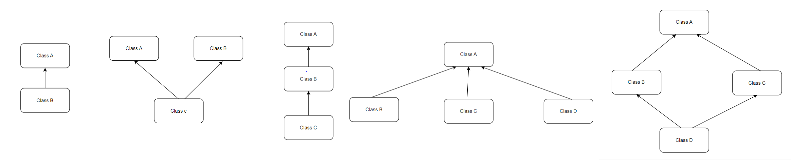

## OOPS

Abstraction

Encapsulation

Inheritance

Polymorphism

Abstraction: The process of hiding unwanted data and showing only the required functionality is known as Abstraction.

Encapsulation: The process of wrapping of data into a single unit is known as Encapsulation.

Inheritance : Acquiring the properties of Parent class to Child class

Polymorphism: A method can exist in different format within the same class or Super and Sub Classes for doing same action in different ways or doing different action.

**Method Overloading**

*  

**Method Overriding**

* Overriding is used to modify and provide a new implementation of the method inherited from a base class.

Inheritance:

There are 4 types of inheritance

1.Single Inheritance 2. Multiple Inheritance 3. Multi Level 4.Hierarchial Inheritance 5.Hybrid Inheritance

## Association, Composition and Aggregation

Association: The relationship between two or more classes. It tell about has-a relationship.

Composition: Strong relationship

Aggregation: Weak Relationship