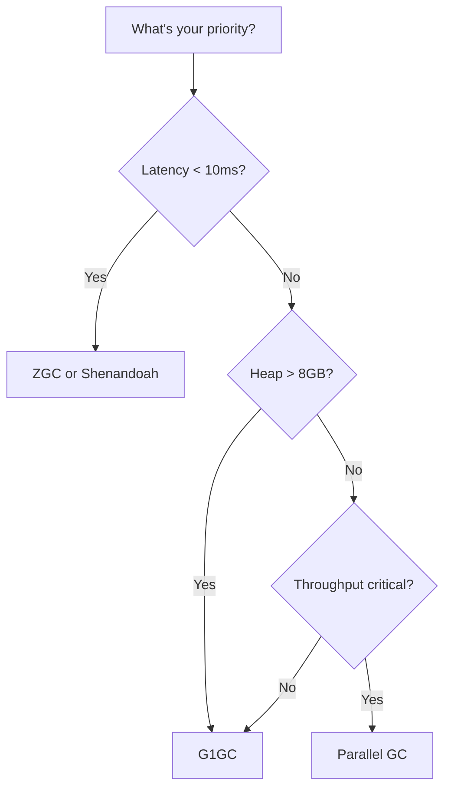
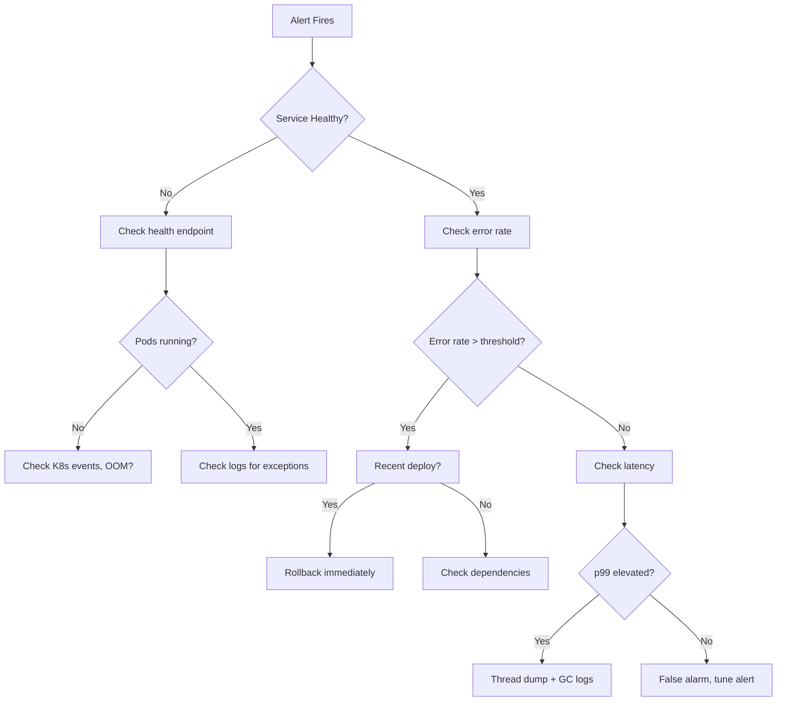

# Performance & Production Engineering — Java

> Senior interviews test whether you can keep systems alive under pressure. This guide covers what happens AFTER deployment — the knowledge that separates senior engineers from everyone else.

---

## Low Latency Java Patterns

### Object Pooling & Garbage-Free Programming

Every object allocation is future GC work. In latency-critical paths:

```java
// BAD: allocates a new byte array per request
public byte[] serialize(Order order) {
    byte[] buffer = new byte[4096];
    // ... serialize into buffer
    return buffer;
}

// GOOD: reuse buffers via ThreadLocal pool
private static final ThreadLocal<byte[]> BUFFER_POOL =
    ThreadLocal.withInitial(() -> new byte[4096]);

public byte[] serialize(Order order) {
    byte[] buffer = BUFFER_POOL.get();
    // ... serialize into buffer, return copy of used portion
    return Arrays.copyOf(buffer, actualLength);
}
```

### Off-Heap Memory

```java
// Direct ByteBuffer — allocated outside JVM heap, no GC pressure
ByteBuffer buffer = ByteBuffer.allocateDirect(1024 * 1024);
buffer.putLong(timestamp);
buffer.putDouble(price);
buffer.flip();

// Read back
long ts = buffer.getLong();
double px = buffer.getDouble();
```

**When to use off-heap:**

- Large caches that would cause GC pauses
- Memory-mapped files for IPC
- Network I/O buffers
- Data that outlives request scope

### Lock-Free Data Structures

```java
// CAS-based counter — no locks, no blocking
private final AtomicLong counter = new AtomicLong(0);

public long increment() {
    return counter.incrementAndGet();
}

// CAS loop for complex operations
public boolean compareAndSwap(AtomicReference<Node> head, Node expected, Node newNode) {
    return head.compareAndSet(expected, newNode);
}
```

### Mechanical Sympathy

| Concept | Impact | Java Implication |
|---------|--------|------------------|
| CPU Cache Lines | 64 bytes, false sharing causes 100x slowdown | Pad fields with `@Contended` or manual padding |
| Branch Prediction | Misprediction costs ~15 cycles | Sort data before processing, avoid unpredictable branches |
| Memory Prefetching | Sequential access 10x faster than random | Use arrays over linked structures |
| NUMA | Remote memory access 3x slower | Pin threads to cores with affinity |

```java
// False sharing example — two threads updating adjacent fields
// BAD: fields share a cache line
class SharedState {
    volatile long counter1; // Thread 1 writes
    volatile long counter2; // Thread 2 writes — same cache line!
}

// GOOD: pad to separate cache lines
class SharedState {
    volatile long counter1;
    long p1, p2, p3, p4, p5, p6, p7; // padding (7 * 8 = 56 bytes)
    volatile long counter2;
}
```

### Primitive Collections

Standard Java collections box primitives (int → Integer = 16 bytes overhead per element):

```java
// Standard — 50M entries = ~800MB with Integer boxing
Map<Integer, Integer> map = new HashMap<>();

// Eclipse Collections — 50M entries = ~200MB, no boxing
IntIntHashMap map = new IntIntHashMap();
map.put(42, 100);
int value = map.get(42); // no unboxing
```

---

## JVM Tuning Scenarios

### Scenario 1: High GC Pause Times

**Symptoms:** p99 latency spikes every 30-60 seconds, 200-500ms pauses

**Diagnosis:**

```bash
# Enable GC logging
java -Xlog:gc*:file=gc.log:time,uptime,level,tags -jar app.jar

# Key lines to look for:
# [gc] GC(42) Pause Full (Ergonomics) 2048M->1856M(4096M) 450.123ms
# ^^ Full GC with 450ms pause = problem
```

**Root causes and fixes:**

| Cause | Evidence in GC Log | Fix |
|-------|-------------------|-----|
| Heap too small | Frequent GC, high % time in GC | Increase `-Xmx` |
| Too many long-lived objects | Old Gen always near full | Review caches, reduce retention |
| Humongous allocations (G1) | "Humongous Allocation" messages | Increase `-XX:G1HeapRegionSize` |
| Wrong collector | Consistent long pauses | Switch to ZGC or Shenandoah |

**Collector selection guide:**



**ZGC tuning (Java 21+):**

```bash
java -XX:+UseZGC -XX:+ZGenerational \
     -Xmx16g -Xms16g \
     -XX:SoftMaxHeapSize=12g \
     -jar app.jar
# Typical result: max pause < 1ms regardless of heap size
```

### Scenario 2: Memory Leak in Production

**Symptoms:** Memory grows linearly over hours/days, eventually OOM

**Step-by-step diagnosis:**

```bash
# 1. Confirm the leak (monitor over time)
jcmd <pid> GC.heap_info

# 2. Trigger GC to confirm it's a leak (not just delayed collection)
jcmd <pid> GC.run

# 3. Take heap dump (WARNING: pauses app briefly)
jcmd <pid> GC.heap_dump /tmp/heap.hprof

# 4. Analyze with Eclipse MAT
# Look for: Leak Suspects report → Dominator Tree → largest retained objects
```

**Most common leak patterns:**

```java
// LEAK 1: Static collection growing forever
public class MetricsCollector {
    private static final List<Metric> allMetrics = new ArrayList<>();
    
    public void record(Metric m) {
        allMetrics.add(m); // never removed!
    }
}

// LEAK 2: Listeners never unregistered
public class OrderService {
    public void processOrder(Order order) {
        eventBus.register(new OrderListener(order)); // never unregistered
    }
}

// LEAK 3: ThreadLocal not cleaned in thread pools
public class RequestContext {
    private static final ThreadLocal<UserSession> session = new ThreadLocal<>();
    
    public void handle(Request req) {
        session.set(new UserSession(req));
        process(req);
        // Missing: session.remove() — thread returns to pool with session attached
    }
}

// LEAK 4: Unbounded cache
private final Map<String, byte[]> cache = new ConcurrentHashMap<>();
// Fix: Use Caffeine with maxSize or expireAfterWrite
```

### Scenario 3: Thread Starvation

**Symptoms:** Requests timing out, thread pool shows all threads BLOCKED/WAITING

```bash
# Take thread dump
jcmd <pid> Thread.print > threads.txt

# Or kill -3 for SIGQUIT thread dump
kill -3 <pid>
```

**What to look for in thread dumps:**

```
"http-nio-8080-exec-42" #142 daemon prio=5
   java.lang.Thread.State: BLOCKED (on object monitor)
    at com.app.service.PaymentService.charge(PaymentService.java:45)
    - waiting to lock <0x00000007b5a23c10> (a java.lang.Object)
    - locked by "http-nio-8080-exec-7"
```

**Common causes:**

| Pattern | Thread Dump Signal | Fix |
|---------|-------------------|-----|
| Lock contention | Many threads BLOCKED on same monitor | Reduce critical section, use concurrent structures |
| Connection pool exhaustion | All threads WAITING on pool.getConnection() | Increase pool size or fix slow queries |
| Deadlock | Two threads each waiting on locks held by the other | Lock ordering, timeout-based acquisition |
| Slow external call | Threads TIMED_WAITING in HttpClient.execute() | Add timeouts, circuit breaker |

### Scenario 4: CPU Spikes

**Diagnosis with async-profiler:**

```bash
# Attach to running process, profile CPU for 30 seconds
./asprof -d 30 -f flamegraph.html <pid>

# Profile specific events
./asprof -e cpu -d 30 -f cpu.html <pid>      # CPU time
./asprof -e alloc -d 30 -f alloc.html <pid>  # Allocations
./asprof -e lock -d 30 -f lock.html <pid>    # Lock contention
```

**Reading a flame graph:**

```
┌──────────────────────────────────────────┐
│ main()                                    │ ← Bottom: entry point
├────────────────────┬─────────────────────┤
│ handleRequest()    │ scheduledTask()      │ ← Width = time spent
├──────┬─────────────┤                     │
│parse │ serialize() │                     │ ← Top: hot methods
│JSON  │  ← 60% CPU │                     │
└──────┴─────────────┴─────────────────────┘
```

**Wider bars = more CPU time.** Look for:

- Unexpected methods taking large percentage
- Deep stacks (potential recursion)
- Framework methods you can't control (possible misconfiguration)

---

## Profiling Tools Comparison

| Tool | Overhead | Best For | Production Safe? |
|------|----------|----------|-----------------|
| JFR (Flight Recorder) | <1% | Continuous monitoring, all events | Yes |
| async-profiler | <2% | CPU, allocation, lock profiling | Yes |
| VisualVM | 3-5% | Quick inspection, heap analysis | Dev/staging only |
| JMC (Mission Control) | <1% | Analyzing JFR recordings | Yes (analysis tool) |
| Arthas | 2-3% | Live debugging, method tracing | Carefully |
| YourKit | 5-10% | Deep profiling, memory analysis | Dev only |

### JFR Quick Setup

```bash
# Start recording (continuous, low overhead)
java -XX:+FlightRecorder \
     -XX:StartFlightRecording=duration=60s,filename=recording.jfr \
     -jar app.jar

# Or attach to running process
jcmd <pid> JFR.start duration=60s filename=recording.jfr
```

---

## Performance Anti-Patterns

### 1. Synchronized on String Literal

```java
// TERRIBLE: all threads block on the same interned String object
public void process(String key) {
    synchronized (key.intern()) { // ALL "order" strings are the same object!
        // ...
    }
}

// Fix: Use ConcurrentHashMap.computeIfAbsent or Striped locks
```

### 2. Autoboxing in Hot Loops

```java
// BAD: creates millions of Integer objects
long sum = 0L;
for (Integer value : map.values()) { // unboxing
    sum += value; // more unboxing
}

// GOOD: use primitive streams
long sum = map.values().stream().mapToLong(Integer::intValue).sum();
```

### 3. Regex Compilation in Loops

```java
// BAD: compiles regex 1M times
for (String line : lines) {
    if (line.matches("\\d{4}-\\d{2}-\\d{2}")) { // compiles Pattern each call!
        process(line);
    }
}

// GOOD: compile once
private static final Pattern DATE_PATTERN = Pattern.compile("\\d{4}-\\d{2}-\\d{2}");

for (String line : lines) {
    if (DATE_PATTERN.matcher(line).matches()) {
        process(line);
    }
}
```

### 4. N+1 Queries with Hibernate

```java
// BAD: 1 query for orders + N queries for items
List<Order> orders = orderRepository.findAll();
for (Order order : orders) {
    order.getItems().size(); // triggers lazy load per order!
}

// GOOD: fetch join
@Query("SELECT o FROM Order o JOIN FETCH o.items")
List<Order> findAllWithItems();
```

### 5. Exception-Driven Flow Control

```java
// BAD: exceptions are 100-1000x slower than conditionals
public int parseOrDefault(String s, int defaultValue) {
    try {
        return Integer.parseInt(s);
    } catch (NumberFormatException e) {
        return defaultValue; // using exception for normal flow!
    }
}

// GOOD: check first
public int parseOrDefault(String s, int defaultValue) {
    if (s == null || !s.matches("-?\\d+")) return defaultValue;
    return Integer.parseInt(s);
}
```

### 6. Unbounded Queue Growth

```java
// BAD: if consumer is slower than producer, memory grows forever
BlockingQueue<Event> queue = new LinkedBlockingQueue<>(); // unbounded!

// GOOD: bounded with backpressure
BlockingQueue<Event> queue = new ArrayBlockingQueue<>(10_000);
// producer blocks when full, creating natural backpressure
```

---

## Benchmarking with JMH

```java
@BenchmarkMode(Mode.AverageTime)
@OutputTimeUnit(TimeUnit.NANOSECONDS)
@Warmup(iterations = 5, time = 1)
@Measurement(iterations = 10, time = 1)
@Fork(2)
@State(Scope.Benchmark)
public class MapBenchmark {

    private Map<String, Integer> hashMap;
    private Map<String, Integer> concurrentMap;
    private String[] keys;

    @Setup
    public void setup() {
        hashMap = new HashMap<>();
        concurrentMap = new ConcurrentHashMap<>();
        keys = new String[1000];
        for (int i = 0; i < 1000; i++) {
            keys[i] = "key-" + i;
            hashMap.put(keys[i], i);
            concurrentMap.put(keys[i], i);
        }
    }

    @Benchmark
    public Integer hashMapGet() {
        return hashMap.get(keys[ThreadLocalRandom.current().nextInt(1000)]);
    }

    @Benchmark
    public Integer concurrentMapGet() {
        return concurrentMap.get(keys[ThreadLocalRandom.current().nextInt(1000)]);
    }
}
```

**Common JMH pitfalls:**

| Pitfall | Symptom | Fix |
|---------|---------|-----|
| Dead code elimination | Unrealistically fast results | Return the result from benchmark method |
| Constant folding | JIT precomputes result | Use `@State` fields, not literals |
| Loop optimization | JIT eliminates repeated work | Use `Blackhole.consume()` |
| Warmup too short | Inconsistent results | Increase warmup iterations |

---

## Production Incident Response



### The First 5 Minutes

1. **Acknowledge** — "I'm looking at this"
2. **Assess severity** — users affected? data at risk?
3. **Mitigate** — rollback, scale up, or feature-flag off
4. **Investigate** — only after bleeding is stopped
5. **Communicate** — update status page, notify stakeholders

---

## Key Metrics to Monitor

| Metric | What It Tells You | Alert When |
|--------|-------------------|------------|
| Request rate (QPS) | Traffic volume | >2x normal (possible attack) or <50% normal (routing issue) |
| Error rate (5xx) | Service failures | >1% of requests |
| p50 latency | Typical user experience | >200ms |
| p99 latency | Worst-case experience | >2 seconds |
| Heap usage | Memory pressure | >80% after GC |
| GC pause time | Stop-the-world impact | >100ms |
| Thread count | Thread leaks | >2x baseline |
| Connection pool usage | DB saturation | >80% capacity |
| CPU usage | Compute saturation | >80% sustained |
| Disk I/O | Storage bottleneck | >90% utilization |

---

## Real-World Interview Questions

### "Your service's p99 jumped from 5ms to 500ms after a deploy. Walk me through debugging."

**Structured answer:**

1. **Confirm it's the deploy** — check if rollback fixes it (fastest mitigation)
2. **Check what changed** — diff the deploy, look for new dependencies or config changes
3. **Examine GC logs** — did allocation rate increase?
4. **Take thread dump** — are threads blocked on something new?
5. **Check downstream** — did a dependency get slower?
6. **Profile with async-profiler** — find the hot path

### "Memory grows 1GB/hour. How do you find the leak?"

1. **Confirm it's a leak** — does a forced GC reclaim memory? If not, it's a leak
2. **Take two heap dumps** — 30 minutes apart
3. **Compare in Eclipse MAT** — "Leak Suspects" report
4. **Identify the dominator** — what object retains the most memory?
5. **Trace to root** — find the GC root that prevents collection
6. **Common culprits** — static collections, ThreadLocal, event listeners, caches without eviction

### "One pod uses 100% CPU while others are idle."

1. **Check load balancer** — is traffic distributed evenly?
2. **Check for hot keys** — one partition getting all traffic?
3. **Thread dump** — is it a busy loop or infinite recursion?
4. **Flame graph** — identify which method consumes CPU
5. **Check JIT** — deoptimization can cause CPU spikes (look for `-XX:+PrintCompilation`)
