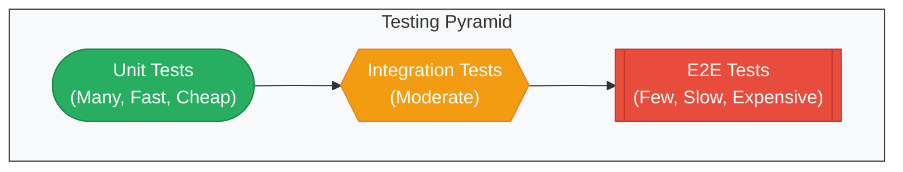
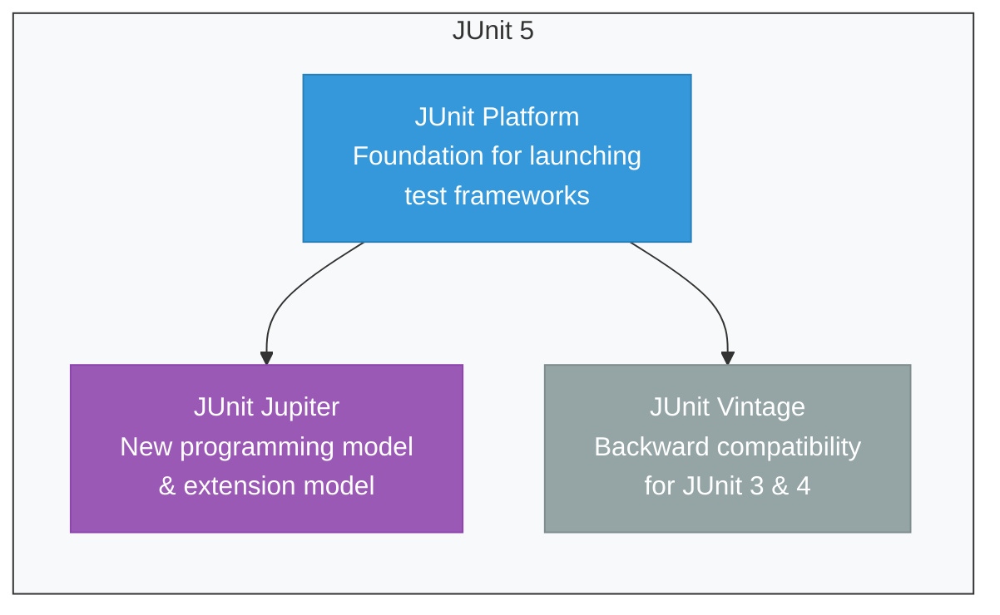
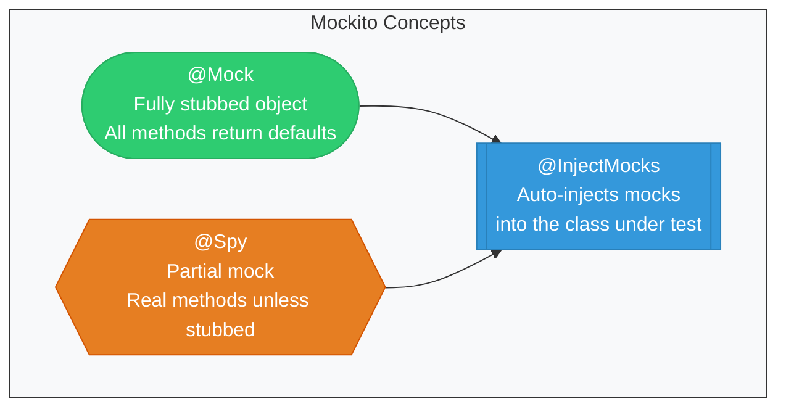
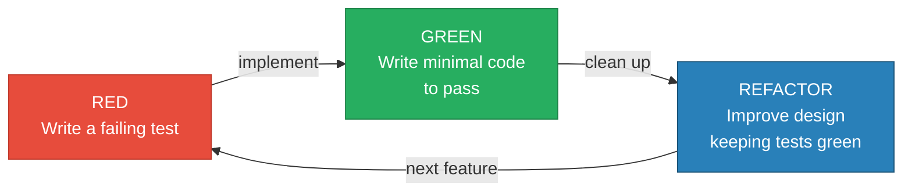

# Testing in Java — JUnit 5, Mockito & TDD

!!! tip "Why Testing Knowledge Matters for Senior Roles"
    At FAANG companies, engineers are expected to write production-grade tests as part of every feature delivery. Interview panels assess your ability to design testable code, write meaningful assertions, and understand test architecture. Demonstrating fluency in JUnit 5 and Mockito signals engineering maturity and a commitment to software quality.

---

## The Testing Pyramid

The testing pyramid guides how to distribute test effort across different levels. Unit tests form the base — they are fast, isolated, and numerous. Integration tests verify component interactions. End-to-end tests are slow and expensive but validate full user journeys.



| Level | Scope | Speed | Tools |
|-------|-------|-------|-------|
| Unit | Single class/method | Milliseconds | JUnit 5, Mockito |
| Integration | Multiple components | Seconds | @SpringBootTest, Testcontainers |
| E2E | Full system | Minutes | Selenium, Cypress |

---

## JUnit 5 Architecture

JUnit 5 is composed of three sub-projects that separate concerns cleanly:



- **JUnit Platform** — Foundation for launching testing frameworks on the JVM. Defines the TestEngine API.
- **JUnit Jupiter** — Provides new annotations (@Test, @ParameterizedTest, etc.) and the extension model.
- **JUnit Vintage** — Enables running JUnit 3 and JUnit 4 tests on the JUnit 5 platform.

---

## Core Annotations with Examples

### Lifecycle Annotations

```java
import org.junit.jupiter.api.*;

class OrderServiceTest {

    @BeforeAll
    static void setupAll() {
        // Runs ONCE before all tests — e.g., start embedded DB
        System.out.println("Initializing test suite...");
    }

    @AfterAll
    static void teardownAll() {
        // Runs ONCE after all tests — e.g., cleanup resources
        System.out.println("Cleaning up test suite...");
    }

    @BeforeEach
    void setup() {
        // Runs before EACH test — e.g., reset state
    }

    @AfterEach
    void teardown() {
        // Runs after EACH test — e.g., clear mocks
    }

    @Test
    @DisplayName("Should calculate total with tax")
    void shouldCalculateTotalWithTax() {
        // Arrange
        OrderService service = new OrderService();
        // Act
        double total = service.calculateTotal(100.0, 0.08);
        // Assert
        Assertions.assertEquals(108.0, total);
    }
}
```

### @Nested — Grouping Related Tests

```java
@DisplayName("UserService Tests")
class UserServiceTest {

    @Nested
    @DisplayName("When user exists")
    class WhenUserExists {

        @Test
        @DisplayName("should return user profile")
        void shouldReturnUserProfile() {
            // test logic
        }

        @Test
        @DisplayName("should update user email")
        void shouldUpdateUserEmail() {
            // test logic
        }
    }

    @Nested
    @DisplayName("When user does not exist")
    class WhenUserDoesNotExist {

        @Test
        @DisplayName("should throw UserNotFoundException")
        void shouldThrowUserNotFoundException() {
            // test logic
        }
    }
}
```

### @Tag — Filtering Tests

```java
@Tag("fast")
@Test
void unitTest() { }

@Tag("slow")
@Test
void integrationTest() { }
```

Run only fast tests: `mvn test -Dgroups="fast"`

### @ParameterizedTest

```java
import org.junit.jupiter.params.ParameterizedTest;
import org.junit.jupiter.params.provider.*;

class StringUtilsTest {

    // ValueSource — single argument per invocation
    @ParameterizedTest
    @ValueSource(strings = {"racecar", "level", "madam"})
    void shouldDetectPalindrome(String word) {
        assertTrue(StringUtils.isPalindrome(word));
    }

    // CsvSource — multiple arguments per invocation
    @ParameterizedTest
    @CsvSource({
        "hello, 5",
        "world, 5",
        "JUnit, 5"
    })
    void shouldReturnCorrectLength(String input, int expectedLength) {
        assertEquals(expectedLength, input.length());
    }

    // MethodSource — complex objects from a factory method
    @ParameterizedTest
    @MethodSource("provideStringsForTrim")
    void shouldTrimWhitespace(String input, String expected) {
        assertEquals(expected, input.trim());
    }

    static Stream<Arguments> provideStringsForTrim() {
        return Stream.of(
            Arguments.of("  hello  ", "hello"),
            Arguments.of("  JUnit ", "JUnit"),
            Arguments.of("no-trim", "no-trim")
        );
    }
}
```

### @RepeatedTest and @Timeout

```java
@RepeatedTest(5)
@DisplayName("Should handle concurrent access")
void shouldHandleConcurrentAccess(RepetitionInfo info) {
    System.out.println("Repetition " + info.getCurrentRepetition());
    // flaky test detection
}

@Test
@Timeout(value = 500, unit = TimeUnit.MILLISECONDS)
void shouldRespondWithinSLA() {
    // test that must complete in < 500ms
    service.processRequest();
}
```

---

## Assertions

```java
import static org.junit.jupiter.api.Assertions.*;

class AssertionExamplesTest {

    @Test
    void basicAssertions() {
        assertEquals(4, Calculator.add(2, 2));
        assertNotEquals(5, Calculator.add(2, 2));
        assertTrue(Calculator.isPositive(1));
        assertNull(repository.findById(999L));
    }

    @Test
    void assertThrowsExample() {
        IllegalArgumentException ex = assertThrows(
            IllegalArgumentException.class,
            () -> service.withdraw(-100)
        );
        assertEquals("Amount must be positive", ex.getMessage());
    }

    @Test
    void assertAllExample() {
        User user = userService.createUser("John", "john@test.com");

        // Groups assertions — ALL are evaluated even if one fails
        assertAll("user properties",
            () -> assertEquals("John", user.getName()),
            () -> assertEquals("john@test.com", user.getEmail()),
            () -> assertNotNull(user.getId()),
            () -> assertTrue(user.isActive())
        );
    }

    @Test
    void assertTimeoutExample() {
        String result = assertTimeout(Duration.ofSeconds(2), () -> {
            return externalService.fetchData();
        });
        assertNotNull(result);
    }
}
```

---

## Mockito

### Core Concepts



### @Mock, @InjectMocks, @Spy

```java
@ExtendWith(MockitoExtension.class)
class PaymentServiceTest {

    @Mock
    private PaymentGateway paymentGateway;

    @Mock
    private NotificationService notificationService;

    @Spy
    private AuditLogger auditLogger = new AuditLogger();

    @InjectMocks
    private PaymentService paymentService;

    @Test
    void shouldProcessPaymentSuccessfully() {
        // Arrange — stub the mock behavior
        when(paymentGateway.charge(anyDouble()))
            .thenReturn(new PaymentResult(true, "TXN-123"));

        // Act
        PaymentResult result = paymentService.processPayment(99.99);

        // Assert
        assertTrue(result.isSuccess());
        assertEquals("TXN-123", result.getTransactionId());

        // Verify interactions
        verify(paymentGateway).charge(99.99);
        verify(notificationService).sendReceipt(anyString());
        verify(auditLogger).log(contains("payment"));
    }
}
```

### Argument Captors

```java
@Test
void shouldCaptureEmailContent() {
    ArgumentCaptor<Email> emailCaptor = ArgumentCaptor.forClass(Email.class);

    orderService.placeOrder(new Order("item-1", 2));

    verify(emailService).send(emailCaptor.capture());

    Email sentEmail = emailCaptor.getValue();
    assertEquals("Order Confirmation", sentEmail.getSubject());
    assertTrue(sentEmail.getBody().contains("item-1"));
}
```

### BDD Style (given/when/then)

```java
import static org.mockito.BDDMockito.*;

@Test
void shouldReturnDiscountedPrice() {
    // Given
    given(discountService.getDiscount("SUMMER20"))
        .willReturn(0.20);

    // When
    double price = pricingService.calculatePrice(100.0, "SUMMER20");

    // Then
    then(discountService).should().getDiscount("SUMMER20");
    assertThat(price).isEqualTo(80.0);
}
```

---

## Integration Testing with @SpringBootTest

```java
@SpringBootTest(webEnvironment = SpringBootTest.WebEnvironment.RANDOM_PORT)
@AutoConfigureMockMvc
class UserControllerIntegrationTest {

    @Autowired
    private MockMvc mockMvc;

    @Autowired
    private UserRepository userRepository;

    @BeforeEach
    void setup() {
        userRepository.deleteAll();
    }

    @Test
    void shouldCreateUserAndReturnCreatedStatus() throws Exception {
        String requestBody = """
            {
                "name": "Alice",
                "email": "alice@example.com"
            }
            """;

        mockMvc.perform(post("/api/users")
                .contentType(MediaType.APPLICATION_JSON)
                .content(requestBody))
            .andExpect(status().isCreated())
            .andExpect(jsonPath("$.name").value("Alice"))
            .andExpect(jsonPath("$.id").exists());
    }

    @Test
    void shouldReturn404ForNonExistentUser() throws Exception {
        mockMvc.perform(get("/api/users/999"))
            .andExpect(status().isNotFound());
    }
}
```

!!! note "Slicing Tests for Speed"
    Use `@WebMvcTest` for controller-only tests, `@DataJpaTest` for repository tests, and `@MockBean` to replace specific beans. Full `@SpringBootTest` loads the entire context and is slower.

---

## TDD Cycle — Red, Green, Refactor



**The TDD Workflow:**

1. **RED** — Write a test that describes the desired behavior. Run it. It must fail.
2. **GREEN** — Write the simplest production code to make the test pass. No more.
3. **REFACTOR** — Remove duplication, improve naming, extract methods. All tests must still pass.

```java
// Step 1: RED — test first
@Test
void shouldReturnFizzForMultiplesOfThree() {
    assertEquals("Fizz", FizzBuzz.convert(3));
    assertEquals("Fizz", FizzBuzz.convert(6));
}

// Step 2: GREEN — minimal implementation
class FizzBuzz {
    static String convert(int number) {
        if (number % 3 == 0) return "Fizz";
        return String.valueOf(number);
    }
}

// Step 3: REFACTOR — improve as needed while tests stay green
```

---

## Best Practices

### The AAA Pattern

Every test should follow **Arrange-Act-Assert**:

```java
@Test
void shouldApplyDiscount() {
    // Arrange — set up test data and dependencies
    Cart cart = new Cart();
    cart.addItem(new Item("Laptop", 1000.0));
    DiscountService discountService = new DiscountService();

    // Act — invoke the behavior under test
    double total = discountService.applyDiscount(cart, 0.10);

    // Assert — verify the outcome
    assertEquals(900.0, total, 0.01);
}
```

### Test Naming Conventions

| Convention | Example |
|-----------|---------|
| should_When | `shouldThrowException_WhenAmountIsNegative` |
| givenWhenThen | `givenInvalidInput_whenValidate_thenReturnErrors` |
| methodName_state_expected | `withdraw_insufficientFunds_throwsException` |

### What NOT to Test

- **Trivial getters/setters** — no logic, no value
- **Framework code** — Spring, Hibernate internals
- **Private methods directly** — test via the public API
- **Third-party libraries** — trust they have their own tests
- **Random/time-dependent logic** — abstract behind interfaces, then test

---

## Code Coverage and Mutation Testing

### Code Coverage

Code coverage measures which lines/branches your tests exercise. Tools: **JaCoCo** (most common in Java).

```xml
<!-- Maven JaCoCo plugin configuration -->
<plugin>
    <groupId>org.jacoco</groupId>
    <artifactId>jacoco-maven-plugin</artifactId>
    <version>0.8.11</version>
    <executions>
        <execution>
            <goals><goal>prepare-agent</goal></goals>
        </execution>
        <execution>
            <id>report</id>
            <phase>test</phase>
            <goals><goal>report</goal></goals>
        </execution>
    </executions>
</plugin>
```

!!! warning "Coverage is Not Quality"
    80% line coverage does not mean your tests are good. You can have 100% coverage with zero meaningful assertions. Coverage tells you what is NOT tested; it does not tell you if what IS tested is tested well.

### Mutation Testing

**Mutation testing** changes your production code (introduces "mutants") and checks if your tests catch the change. If a mutant survives, your tests are weak. Tool: **PIT (pitest)**.

```xml
<!-- PIT Mutation Testing plugin -->
<plugin>
    <groupId>org.pitest</groupId>
    <artifactId>pitest-maven</artifactId>
    <version>1.15.3</version>
    <configuration>
        <targetClasses>
            <param>com.example.service.*</param>
        </targetClasses>
        <targetTests>
            <param>com.example.service.*Test</param>
        </targetTests>
    </configuration>
</plugin>
```

| Metric | Good Target | Meaning |
|--------|-------------|---------|
| Line Coverage | > 80% | Percentage of lines executed by tests |
| Branch Coverage | > 75% | Percentage of if/else branches tested |
| Mutation Score | > 70% | Percentage of mutants killed by tests |

---

## Interview Questions

??? question "What is the difference between @Mock and @Spy in Mockito?"
    `@Mock` creates a fully stubbed object where all methods return default values (null, 0, false) unless explicitly stubbed with `when().thenReturn()`. `@Spy` wraps a real object — real methods are called unless you explicitly stub them. Use `@Spy` when you want partial mocking, meaning most methods behave normally but you override one or two.

??? question "How does assertAll differ from multiple individual assertions?"
    `assertAll` groups multiple assertions and evaluates ALL of them, even if earlier ones fail. With individual assertions, the test stops at the first failure. `assertAll` gives you a complete picture of all failures in one test run, which is valuable for diagnosing issues in complex objects.

??? question "Explain the Testing Pyramid and why it matters."
    The testing pyramid recommends having many fast unit tests at the base, fewer integration tests in the middle, and very few slow E2E tests at the top. This distribution optimizes for fast feedback, low maintenance cost, and reliable CI pipelines. An inverted pyramid (many E2E, few unit) leads to slow, flaky builds.

??? question "What is the difference between @SpringBootTest and @WebMvcTest?"
    `@SpringBootTest` loads the full application context, making it suitable for integration tests that need all beans. `@WebMvcTest` only loads the web layer (controllers, filters, advice) and is faster because it skips service/repository beans. Use `@MockBean` with `@WebMvcTest` to stub dependencies.

??? question "How would you test a method that calls an external REST API?"
    Mock the HTTP client or use `@MockBean` to replace the service that makes the call. For integration tests, use WireMock to stub the external API locally. Never call real external services in automated tests — they introduce flakiness, latency, and cost.

??? question "What is mutation testing and why is code coverage alone insufficient?"
    Code coverage only tells you which lines were executed, not whether your assertions are meaningful. Mutation testing modifies production code (e.g., changes `>` to `>=`, removes a method call) and verifies your tests detect the change. If a mutant survives, it means your test suite has a blind spot even though coverage might be 100%.

??? question "Describe the TDD Red-Green-Refactor cycle and its benefits."
    RED: Write a failing test that defines desired behavior. GREEN: Write the minimum code to pass. REFACTOR: Clean up while keeping tests green. Benefits include better design (code is written to be testable), living documentation, fewer bugs, and confidence to refactor. TDD forces you to think about requirements before implementation.

??? question "When would you use @ParameterizedTest instead of separate test methods?"
    Use `@ParameterizedTest` when multiple inputs should produce predictable outputs following the same logic path. It reduces code duplication and makes it easy to add new test cases. Use separate methods when the setup, assertions, or error messages differ significantly between cases — clarity matters more than brevity.
