# Apache Kafka

> **The de-facto standard for event streaming in distributed systems. If you're interviewing for any backend role at a top tech company, you will be asked about Kafka.**

---

!!! abstract "Why Kafka in Interviews"
    System design questions like "Design a notification system," "Design an order pipeline," or "How would you handle 1M events/sec?" almost always involve Kafka. You need to explain partitions, consumer groups, ordering guarantees, and exactly-once semantics fluently.

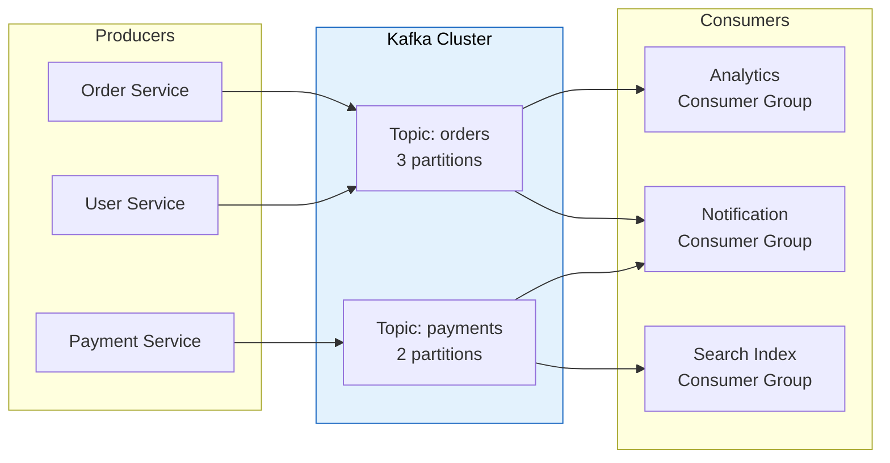

---

## Core Concepts

### Events (Messages/Records)

The fundamental unit of data in Kafka. An event represents "something happened."

| Field | Description |
|---|---|
| **Key** | Determines partition assignment (messages with same key → same partition) |
| **Value** | The actual payload (JSON, Avro, Protobuf) |
| **Timestamp** | Event time or ingestion time |
| **Headers** | Optional metadata (tracing IDs, content-type) |
| **Offset** | Unique sequential ID within a partition |

### Topics & Partitions

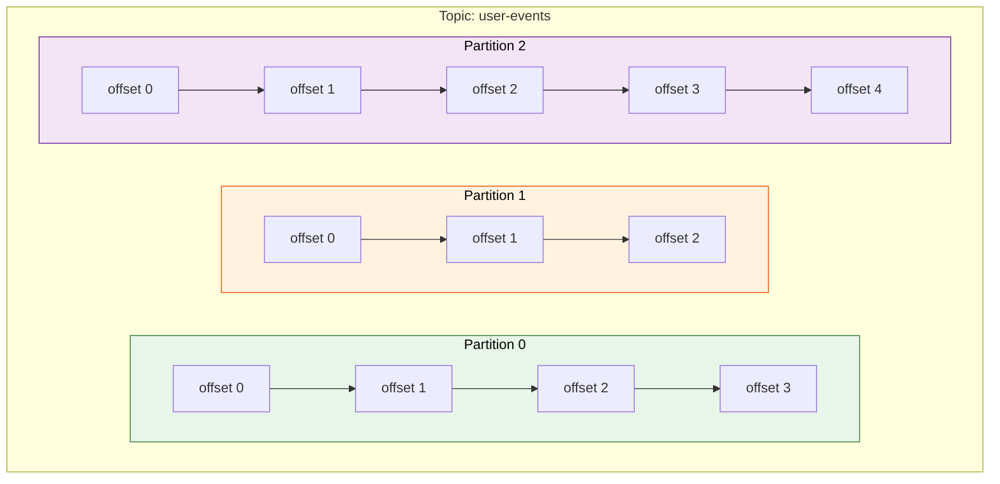

- **Topic** = logical channel for a category of events (like a database table)
- **Partition** = ordered, immutable append-only log
- **Ordering guarantee**: Only within a single partition (not across partitions)
- **Parallelism**: More partitions = more consumers can read in parallel

!!! tip "Partition Count Rule of Thumb"
    Start with **number of partitions = max expected consumer instances**. You can increase partitions later but **never decrease** them.

### Brokers & Cluster

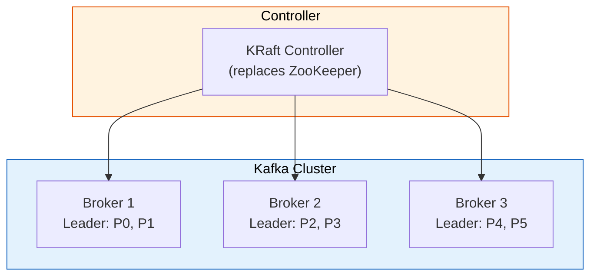

- **Broker** = a single Kafka server that stores data and serves clients
- **Cluster** = group of brokers working together
- **Controller** = manages partition leadership, broker membership (KRaft since Kafka 3.3+, replacing ZooKeeper)

### Replication

Each partition has one **leader** and N-1 **followers** (replicas).

| Term | Meaning |
|---|---|
| **Replication Factor** | Total copies of each partition (typically 3) |
| **Leader** | Handles all reads and writes for a partition |
| **Follower** | Replicates from leader, takes over if leader fails |
| **ISR (In-Sync Replicas)** | Followers that are caught up with the leader |
| **min.insync.replicas** | Minimum ISR count required to accept writes |

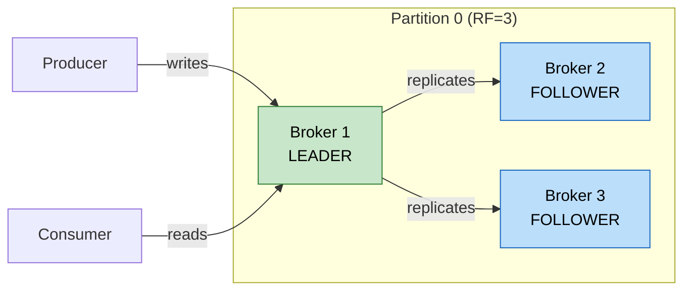

---

## Producers

### How Producers Work

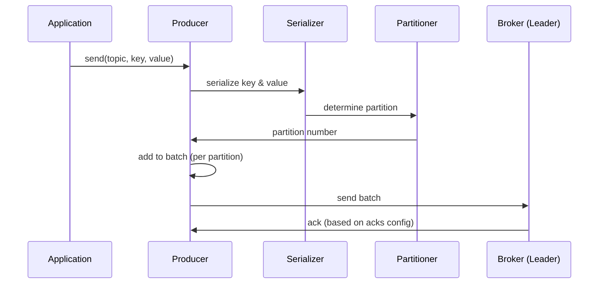

### Key Configuration

| Config | Values | Trade-off |
|---|---|---|
| `acks` | `0` = fire & forget | Fastest, can lose data |
| | `1` = leader ack | Good balance, can lose if leader dies before replication |
| | `all` (-1) = all ISR ack | Strongest durability, higher latency |
| `batch.size` | bytes (default 16KB) | Larger = better throughput, higher latency |
| `linger.ms` | milliseconds (default 0) | Wait time to fill batch before sending |
| `compression.type` | none, gzip, snappy, lz4, zstd | zstd gives best ratio; snappy for speed |
| `retries` | integer (default MAX_INT) | Combined with `delivery.timeout.ms` |
| `enable.idempotence` | true/false | Prevents duplicates on retry (default true since 3.0) |

### Partitioning Strategy

```java
// Default: hash(key) % numPartitions
// Same key always goes to same partition → ordering guarantee

producer.send(new ProducerRecord<>("orders", customerId, orderJson));
// All orders for customerId "C123" go to the same partition
```

| Strategy | When |
|---|---|
| **Key-based (default)** | Need ordering per entity (customer, order, device) |
| **Round-robin** | No key provided, maximize distribution |
| **Custom partitioner** | Business logic (VIP customers → dedicated partition) |

---

## Consumers & Consumer Groups

### Consumer Group Model

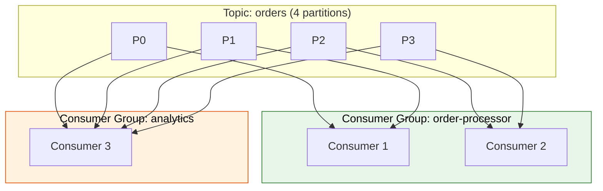

**Rules:**

1. Each partition is consumed by **exactly one consumer** in a group
2. A consumer can read from **multiple partitions**
3. If consumers > partitions → some consumers sit idle
4. Different consumer groups get their **own independent copy** of all messages

### Offset Management

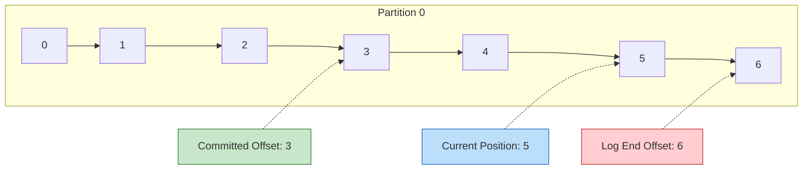

| Term | Meaning |
|---|---|
| **Committed Offset** | Last offset confirmed as processed (stored in `__consumer_offsets` topic) |
| **Current Position** | Where the consumer is currently reading |
| **Log End Offset (LEO)** | Latest message in the partition |
| **Lag** | LEO - Committed Offset (how far behind the consumer is) |

### Consumer Configuration

| Config | Description |
|---|---|
| `group.id` | Consumer group identifier |
| `auto.offset.reset` | `earliest` (from beginning) or `latest` (new messages only) |
| `enable.auto.commit` | If true, offsets committed periodically (default 5s) |
| `max.poll.records` | Max records returned per poll (default 500) |
| `session.timeout.ms` | Time before consumer considered dead (default 45s) |
| `max.poll.interval.ms` | Max time between polls before rebalance (default 5min) |

---

## Delivery Semantics

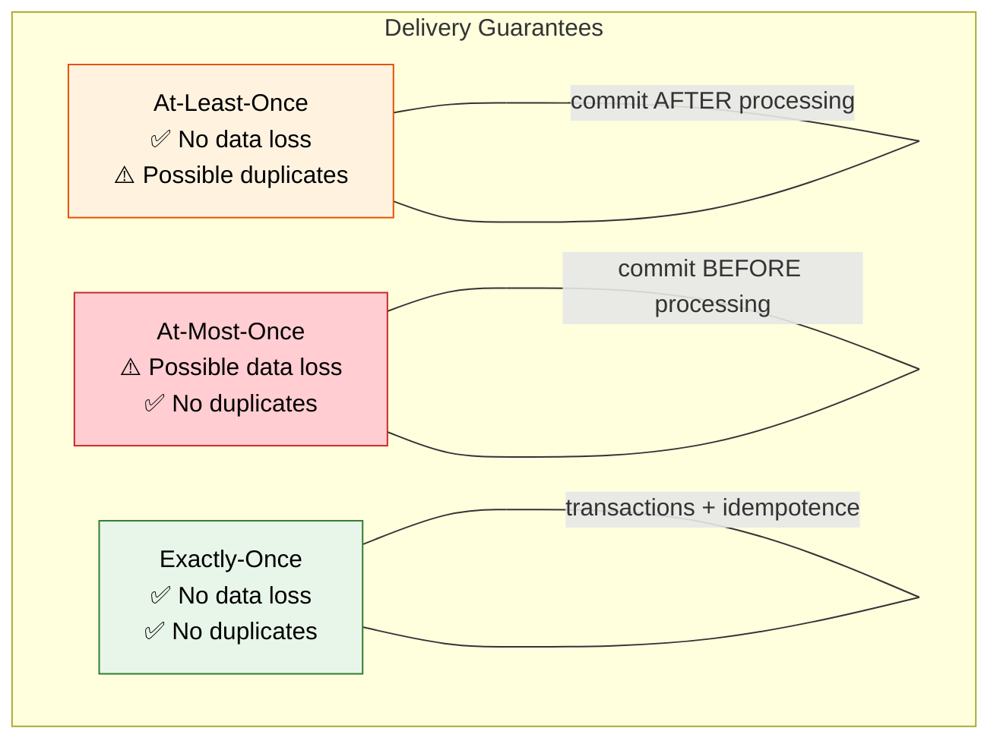

### At-Least-Once (Most Common)

```java
while (true) {
    ConsumerRecords<String, String> records = consumer.poll(Duration.ofMillis(100));
    for (ConsumerRecord<String, String> record : records) {
        processRecord(record);  // process first
    }
    consumer.commitSync();  // then commit
}
// If crash after process but before commit → message reprocessed (duplicate)
```

### Exactly-Once Semantics (EOS)

Achieved through **idempotent producers + transactions**:

```java
// Producer side
props.put("enable.idempotence", "true");
props.put("transactional.id", "order-processor-1");

producer.initTransactions();
producer.beginTransaction();
try {
    producer.send(new ProducerRecord<>("output-topic", key, value));
    // Commit consumer offsets as part of the transaction
    producer.sendOffsetsToTransaction(offsets, consumerGroupId);
    producer.commitTransaction();
} catch (Exception e) {
    producer.abortTransaction();
}
```

!!! warning "EOS Limitations"
    Exactly-once only works **within Kafka** (produce + consume in same cluster). For external systems (databases, APIs), you still need idempotent consumers or the Outbox pattern.

---

## Kafka Connect

Pre-built connectors for integrating Kafka with external systems without writing code.

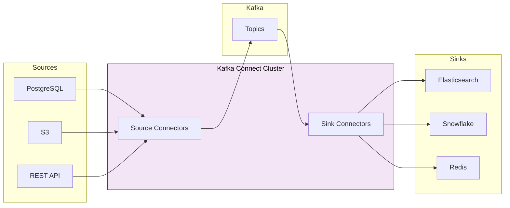

| Connector Type | Direction | Examples |
|---|---|---|
| **Source** | External → Kafka | Debezium (CDC), JDBC, S3, MongoDB |
| **Sink** | Kafka → External | Elasticsearch, S3, JDBC, Redis |

### Debezium (Change Data Capture)

Captures row-level changes from databases and streams them to Kafka topics.

```json
{
  "name": "postgres-source",
  "config": {
    "connector.class": "io.debezium.connector.postgresql.PostgresConnector",
    "database.hostname": "db.example.com",
    "database.port": "5432",
    "database.user": "debezium",
    "database.dbname": "orders",
    "table.include.list": "public.orders,public.payments",
    "topic.prefix": "cdc",
    "plugin.name": "pgoutput"
  }
}
```

---

## Kafka Streams

Client library for building stream processing applications. No separate cluster needed — runs in your application.

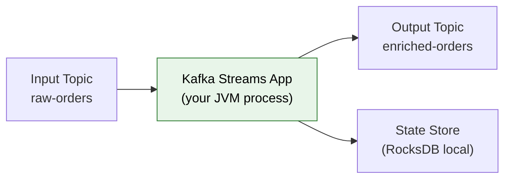

```java
StreamsBuilder builder = new StreamsBuilder();

KStream<String, Order> orders = builder.stream("raw-orders");

KTable<String, Customer> customers = builder.table("customers");

// Enrich orders with customer data
KStream<String, EnrichedOrder> enriched = orders.join(
    customers,
    (order, customer) -> new EnrichedOrder(order, customer)
);

// Filter high-value orders
enriched
    .filter((key, order) -> order.getTotal() > 1000)
    .to("high-value-orders");

// Aggregate order counts per customer (windowed)
orders
    .groupByKey()
    .windowedBy(TimeWindows.ofSizeWithNoGrace(Duration.ofHours(1)))
    .count()
    .toStream()
    .to("order-counts-per-hour");
```

---

## Performance & Tuning

### Why Kafka is Fast

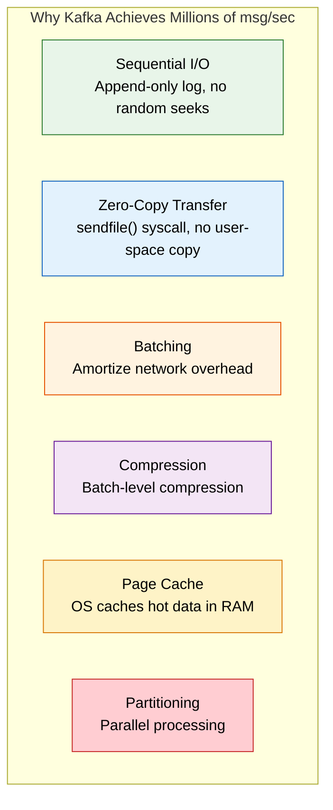

### Key Metrics to Monitor

| Metric | Healthy Value | Action if Unhealthy |
|---|---|---|
| **Consumer Lag** | Close to 0 | Scale consumers, check processing time |
| **Under-replicated Partitions** | 0 | Check broker health, disk I/O |
| **Request Latency (p99)** | < 100ms | Tune batch size, check network |
| **ISR Shrinks/sec** | 0 | Check slow brokers, network partitions |
| **Disk Usage** | < 80% | Adjust retention, add brokers |

### Retention Configuration

```properties
# Time-based retention (default 7 days)
log.retention.hours=168

# Size-based retention (per partition)
log.retention.bytes=1073741824

# Compaction (keep latest value per key — infinite retention)
log.cleanup.policy=compact

# Compaction + deletion (compact, then delete after time)
log.cleanup.policy=compact,delete
```

!!! tip "Log Compaction"
    Use compaction for topics that represent **current state** (user profiles, configuration). Kafka keeps the latest value for each key and removes older entries. Think of it as a distributed key-value store that also gives you a change log.

---

## Common Patterns

### Event Sourcing with Kafka

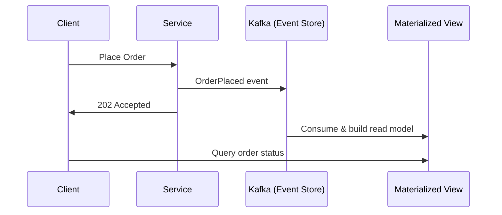

### CQRS with Kafka

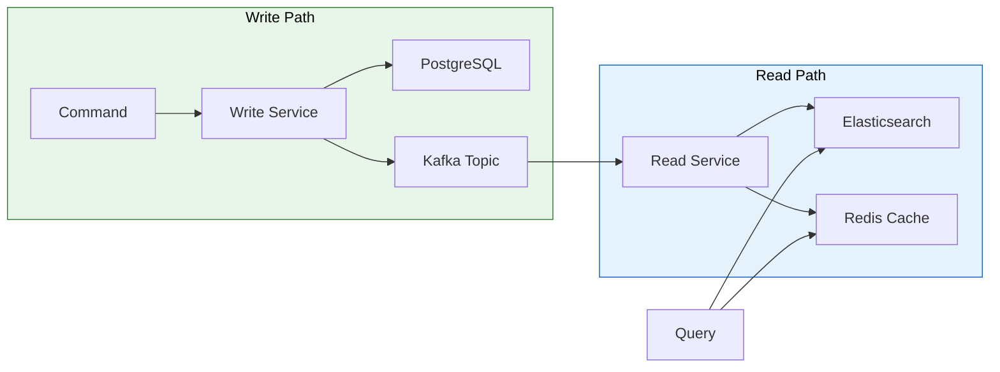

### Dead Letter Queue (DLQ) Pattern

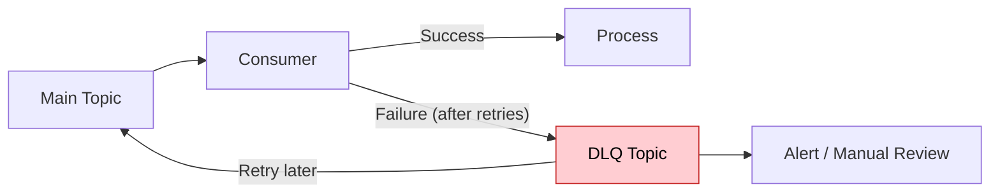

---

## Schema Management

### Schema Registry (Confluent)

Centralized schema store that ensures producers and consumers agree on data format.

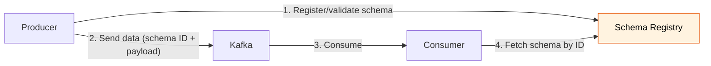

**Compatibility Modes:**

| Mode | Rule |
|---|---|
| **BACKWARD** | New schema can read old data (can remove fields, add optional fields) |
| **FORWARD** | Old schema can read new data (can add fields, remove optional fields) |
| **FULL** | Both backward and forward compatible |
| **NONE** | No compatibility check |

---

## Kafka vs Alternatives

| Feature | Kafka | RabbitMQ | AWS SQS | Pulsar |
|---|---|---|---|---|
| Model | Log (pull) | Queue (push) | Queue (pull) | Log (pull) |
| Ordering | Per partition | Per queue | FIFO queues only | Per partition |
| Retention | Configurable (days/forever) | Until consumed | 14 days max | Tiered (hot/cold) |
| Replay | Yes (seek to offset) | No | No | Yes |
| Throughput | Millions msg/sec | ~50K msg/sec | ~3K msg/sec (FIFO) | Millions msg/sec |
| Multi-tenancy | Topics + ACLs | Vhosts | Queues + IAM | Tenants native |
| Ops Complexity | High (or use managed) | Medium | Zero (managed) | High |

!!! note "When NOT to Use Kafka"
    - Simple task queues with few messages → use SQS or RabbitMQ
    - Request-reply pattern → use HTTP or gRPC
    - Small team, low volume → overhead not justified
    - Need message-level routing/filtering → RabbitMQ exchanges are better

---

## Spring Boot Integration

### Producer

```java
@Configuration
public class KafkaProducerConfig {
    @Bean
    public ProducerFactory<String, OrderEvent> producerFactory() {
        Map<String, Object> config = Map.of(
            ProducerConfig.BOOTSTRAP_SERVERS_CONFIG, "localhost:9092",
            ProducerConfig.KEY_SERIALIZER_CLASS_CONFIG, StringSerializer.class,
            ProducerConfig.VALUE_SERIALIZER_CLASS_CONFIG, JsonSerializer.class,
            ProducerConfig.ACKS_CONFIG, "all",
            ProducerConfig.ENABLE_IDEMPOTENCE_CONFIG, true
        );
        return new DefaultKafkaProducerFactory<>(config);
    }

    @Bean
    public KafkaTemplate<String, OrderEvent> kafkaTemplate() {
        return new KafkaTemplate<>(producerFactory());
    }
}

@Service
public class OrderEventPublisher {
    private final KafkaTemplate<String, OrderEvent> kafka;

    public void publishOrderCreated(Order order) {
        OrderEvent event = new OrderEvent("ORDER_CREATED", order);
        kafka.send("order-events", order.getCustomerId(), event)
             .whenComplete((result, ex) -> {
                 if (ex != null) log.error("Failed to publish", ex);
             });
    }
}
```

### Consumer

```java
@Component
public class OrderEventConsumer {

    @KafkaListener(
        topics = "order-events",
        groupId = "notification-service",
        concurrency = "3"
    )
    public void handleOrderEvent(
            @Payload OrderEvent event,
            @Header(KafkaHeaders.RECEIVED_PARTITION) int partition,
            @Header(KafkaHeaders.OFFSET) long offset) {

        log.info("Received {} from partition {} at offset {}",
                 event.getType(), partition, offset);

        switch (event.getType()) {
            case "ORDER_CREATED" -> sendConfirmationEmail(event);
            case "ORDER_SHIPPED" -> sendShippingNotification(event);
            case "ORDER_DELIVERED" -> sendDeliveryNotification(event);
        }
    }

    @KafkaListener(topics = "order-events-dlq", groupId = "dlq-handler")
    public void handleDlq(ConsumerRecord<String, OrderEvent> record) {
        log.warn("DLQ message: key={}, value={}", record.key(), record.value());
        // Alert, store for manual review, or retry
    }
}
```

### Error Handling & Retry

```java
@Bean
public DefaultErrorHandler errorHandler(KafkaTemplate<String, OrderEvent> template) {
    // Retry 3 times with backoff, then send to DLQ
    DeadLetterPublishingRecoverer recoverer =
        new DeadLetterPublishingRecoverer(template);

    BackOff backOff = new ExponentialBackOff(1000L, 2.0);  // 1s, 2s, 4s

    DefaultErrorHandler handler = new DefaultErrorHandler(recoverer, backOff);
    // Don't retry these — they'll never succeed
    handler.addNotRetryableExceptions(
        DeserializationException.class,
        ValidationException.class
    );
    return handler;
}
```

---

## Common Interview Questions

??? question "1. How does Kafka guarantee message ordering?"
    Ordering is guaranteed **only within a single partition**. Messages with the same key go to the same partition (via hash). So if you need ordered processing per customer, use `customerId` as the key. You **cannot** get global ordering across partitions without using a single partition (which kills parallelism).

??? question "2. What happens when a consumer in a group crashes?"
    A **rebalance** is triggered. The partitions assigned to the dead consumer are redistributed among the remaining consumers in the group. During rebalance, consumption pauses briefly. With **cooperative sticky assignor**, only affected partitions are reassigned (minimizing disruption).

??? question "3. How do you handle duplicate messages?"
    Make consumers **idempotent**: (1) Use a deduplication table with message ID. (2) Use database upserts instead of inserts. (3) Design operations to be naturally idempotent (SET balance=100 vs ADD 10). For Kafka-to-Kafka, use exactly-once transactions.

??? question "4. How would you scale a Kafka consumer that's falling behind?"
    (1) Add more consumers to the group (up to partition count). (2) If at partition limit, increase partitions (requires rebalancing). (3) Optimize processing logic. (4) Increase `max.poll.records`. (5) Use batch processing. (6) Check for slow external calls and make them async.

??? question "5. Kafka vs SQS — when do you choose which?"
    **Kafka**: Need message replay, multiple independent consumers, event sourcing, stream processing, high throughput (100K+ msg/sec), ordering guarantees. **SQS**: Simple task queue, low ops overhead, per-message pricing works better at low volume, don't need replay or multiple consumers reading same data.

??? question "6. What is consumer lag and why does it matter?"
    Consumer lag = Log End Offset - Consumer's Committed Offset. It tells you how far behind a consumer is from the latest messages. High lag means consumers can't keep up with producers. Monitor with `kafka-consumer-groups.sh --describe` or tools like Burrow. Alert if lag grows continuously.

??? question "7. Explain log compaction."
    Compacted topics keep the **latest value for each key** and remove older records. Unlike time-based retention (delete everything after 7 days), compaction retains at least the last message per key forever. Use case: user profiles, configuration, state snapshots. Set `cleanup.policy=compact`.

??? question "8. How does Kafka achieve high throughput?"
    (1) **Sequential I/O** — append-only log avoids random disk seeks. (2) **Zero-copy** — data goes from disk to network without copying to user space. (3) **Batching** — messages batched at producer and broker level. (4) **Compression** — batch-level compression (LZ4/zstd). (5) **Page cache** — leverages OS file cache. (6) **Partitioning** — horizontal parallelism.

---

!!! abstract "Key Takeaways"
    - Kafka is a **distributed commit log** — not a traditional message queue
    - Ordering only within a partition — use meaningful keys
    - Consumer groups enable independent, parallel consumption
    - `acks=all` + `min.insync.replicas=2` + replication factor 3 = strong durability
    - Exactly-once within Kafka via idempotent producers + transactions
    - For external systems, make consumers idempotent (don't rely on Kafka EOS)
    - Monitor consumer lag — it's the #1 operational metric
