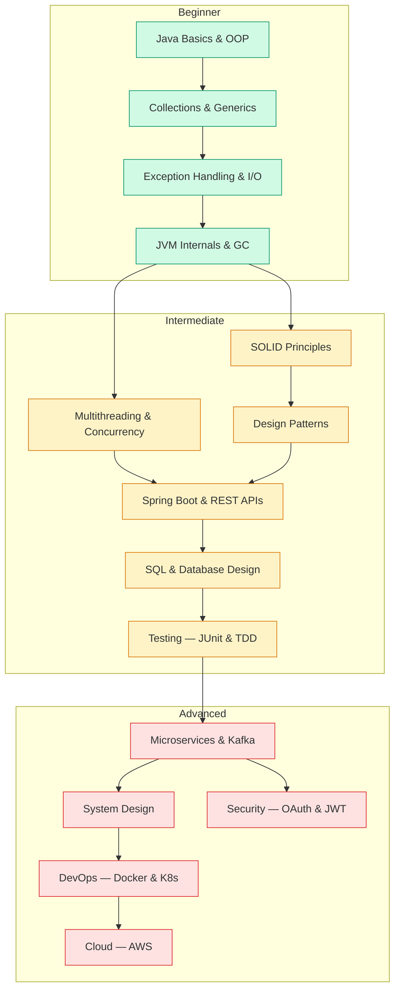

# Learning Path

## Steps to Learn a Programming Language

1. **Introduction** — History, philosophy, use cases
2. **Installation** — Set up toolchain and IDE
3. **Basics** — Variables, types, control flow, functions
4. **Data Structures** — Arrays, lists, maps, sets
5. **File I/O** — Reading, writing, streaming files
6. **Exception Handling** — Error types, try/catch, recovery
7. **Data Formats** — XML, JSON, YAML processing
8. **Database Access** — SQL, ORMs, connection pooling
9. **Web Development** — HTTP, REST APIs, frameworks
10. **Testing** — Unit tests, integration tests, TDD

## Recommended Resources

### General Programming

| Resource | Type |
|---|---|
| [Structure and Interpretation of Computer Programs](http://web.mit.edu/alexmv/6.037/sicp.pdf) | Book (PDF) |
| [The Pragmatic Programmer](https://pragprog.com/titles/tpp20/) | Book |
| [Clean Code by Robert C. Martin](https://www.goodreads.com/book/show/3735293-clean-code) | Book |
| [Designing Data-Intensive Applications](https://dataintensive.net/) | Book |

### Algorithms & Data Structures

| Resource | Type |
|---|---|
| [Algorithmic Thinking — Peak Finding](https://www.youtube.com/watch?v=HtSuA80QTyo) | Video |
| [NeetCode](https://neetcode.io/) | Interactive |
| [LeetCode](https://leetcode.com/) | Practice |
| [Visualgo](https://visualgo.net/) | Visualization |

### System Design

| Resource | Type |
|---|---|
| [System Design Primer](https://github.com/donnemartin/system-design-primer) | GitHub |
| [ByteByteGo](https://bytebytego.com/) | Newsletter / Course |
| [Grokking System Design](https://www.educative.io/courses/grokking-modern-system-design-interview-for-engineers-managers) | Course |

### Java & Spring Boot

| Resource | Type |
|---|---|
| [Baeldung](https://www.baeldung.com/) | Tutorials |
| [Spring Guides](https://spring.io/guides) | Official |
| [Java Brains](https://www.youtube.com/c/JavaBrains) | YouTube |
| [Marco Behler](https://www.marcobehler.com/) | Blog |

### DevOps

| Resource | Type |
|---|---|
| [Docker Docs](https://docs.docker.com/) | Official |
| [Kubernetes Docs](https://kubernetes.io/docs/) | Official |
| [The DevOps Handbook](https://itrevolution.com/product/the-devops-handbook-second-edition/) | Book |

## Learning Roadmap

!!! info "Difficulty Legend"
    - :green_circle: **Green** — Beginner (start here)
    - :yellow_circle: **Yellow** — Intermediate (core skills)
    - :red_circle: **Red** — Advanced (senior-level topics)

!!! tip "Learning Strategy"
    Build projects at each stage. Theory without practice doesn't stick. Aim for one small project per topic.
