# Learning Path

A structured roadmap for Java backend engineers targeting FAANG-level roles. Follow the phases sequentially — each builds on the previous.

---

## Roadmap Overview

```mermaid
flowchart LR
    subgraph "Phase 1 — Foundations (Months 1-2)"
        A(["Java Basics & OOP"]) --> B[["Collections & Generics"]]
        B --> C[/"Exception Handling & I/O"/]
        C --> D{{"JVM Internals & GC"}}
    end

    subgraph "Phase 2 — Core Engineering (Months 3-4)"
        D --> E(["Multithreading & Concurrency"])
        D --> F(["SOLID Principles & Design Patterns"])
        F --> G{{"Spring Boot & REST APIs"}}
        E --> G
        G --> H[["SQL & Database Design"]]
        H --> I[/"Testing — JUnit, Mockito, Testcontainers"/]
    end

    subgraph "Phase 3 — Distributed Systems (Months 5-6)"
        I --> J{{"Microservices Architecture"}}
        J --> K(["Kafka & Event-Driven Systems"])
        K --> L(("System Design"))
        L --> M[/"DevOps — Docker, K8s, CI/CD"/]
        M --> N[["Cloud — AWS / GCP"]]
        J --> O[/"Security — OAuth, JWT, mTLS"/]
    end

    subgraph "Phase 4 — Interview Ready (Months 7-8)"
        L --> P(["DSA — 200 Problems by Pattern"])
        P --> Q{{"Mock Interviews & Timed Practice"}}
        Q --> R[["Behavioral Prep — STAR Stories"]]
    end

    style A fill:#d1fae5,stroke:#059669
    style B fill:#d1fae5,stroke:#059669
    style C fill:#d1fae5,stroke:#059669
    style D fill:#d1fae5,stroke:#059669
    style E fill:#fef3c7,stroke:#d97706
    style F fill:#fef3c7,stroke:#d97706
    style G fill:#fef3c7,stroke:#d97706
    style H fill:#fef3c7,stroke:#d97706
    style I fill:#fef3c7,stroke:#d97706
    style J fill:#fee2e2,stroke:#dc2626
    style K fill:#fee2e2,stroke:#dc2626
    style L fill:#fee2e2,stroke:#dc2626
    style M fill:#fee2e2,stroke:#dc2626
    style N fill:#fee2e2,stroke:#dc2626
    style O fill:#fee2e2,stroke:#dc2626
    style P fill:#ede9fe,stroke:#7c3aed
    style Q fill:#ede9fe,stroke:#7c3aed
    style R fill:#ede9fe,stroke:#7c3aed
```

!!! info "Difficulty Legend"
    - **Green** — Foundations (start here, 2 months)
    - **Yellow** — Core engineering skills (2 months)
    - **Red** — Distributed systems & architecture (2 months)
    - **Purple** — Interview-specific preparation (2 months)

---

## Phase 1: Java Foundations

| Week | Topic | What to Master | Practice |
|---|---|---|---|
| 1 | Java Basics | Primitives, operators, control flow, methods | Write 10 small programs |
| 2 | OOP | Classes, inheritance, polymorphism, interfaces, abstract | Model 3 real-world systems |
| 3 | Collections | ArrayList, HashMap, TreeMap, HashSet, LinkedList | Implement a custom HashMap |
| 4 | Generics & Streams | Type parameters, wildcards, Stream API, lambdas | Refactor loops to streams |
| 5 | Exception Handling | Checked vs unchecked, try-with-resources, custom exceptions | Build error handling strategy |
| 6 | I/O & NIO | File operations, BufferedReader, Path, Files, channels | Build a log file parser |
| 7-8 | JVM & GC | Memory model, class loading, G1/ZGC, JIT compilation | Profile a sample app with VisualVM |

**Milestone:** Build a CLI application that reads CSV files, processes data using streams, and outputs results — handling all edge cases gracefully.

---

## Phase 2: Core Engineering

| Week | Topic | What to Master | Practice |
|---|---|---|---|
| 9 | SOLID Principles | SRP, OCP, LSP, ISP, DIP with real examples | Refactor a messy codebase |
| 10 | Design Patterns | Factory, Strategy, Observer, Builder, Decorator | Implement each in a mini-project |
| 11 | Multithreading | Thread lifecycle, synchronized, volatile, happens-before | Build a producer-consumer system |
| 12 | Concurrency | ExecutorService, CompletableFuture, ConcurrentHashMap, locks | Build a parallel web crawler |
| 13-14 | Spring Boot | IoC/DI, annotations, REST controllers, JPA, profiles | Build a complete CRUD API |
| 15 | Database | Normalization, indexes, joins, transactions, query optimization | Design schema for e-commerce |
| 16 | Testing | JUnit 5, Mockito, integration tests, Testcontainers | Achieve 80%+ coverage on your API |

**Milestone:** Build a Spring Boot REST API with JPA, proper layered architecture, comprehensive tests, and Docker deployment.

---

## Phase 3: Distributed Systems

| Week | Topic | What to Master | Practice |
|---|---|---|---|
| 17-18 | Microservices | Service decomposition, API gateway, service discovery | Split monolith into 3 services |
| 19 | Kafka | Producers, consumers, partitioning, exactly-once semantics | Build event-driven pipeline |
| 20 | Resilience | Circuit breakers, retries, bulkheads, rate limiting | Add resilience to your services |
| 21-22 | System Design | CAP, consistent hashing, sharding, replication | Design 2 systems per week |
| 23 | Docker & K8s | Containers, pods, services, deployments, config maps | Containerize and deploy your app |
| 24 | CI/CD & Cloud | GitHub Actions, AWS (EC2, RDS, S3, SQS, Lambda) | Set up full pipeline |

**Milestone:** Deploy a 3-service microservices system with Kafka, Docker Compose, monitoring (Prometheus + Grafana), and a CI/CD pipeline.

---

## Phase 4: Interview Preparation

| Week | Focus | Daily Target |
|---|---|---|
| 25-26 | DSA: Arrays, Strings, HashMaps, Two Pointers | 3 problems/day |
| 27-28 | DSA: Trees, Graphs, BFS/DFS | 2-3 problems/day |
| 29-30 | DSA: DP, Backtracking, Greedy | 2 problems/day |
| 31 | System Design deep practice | 1 full design/day |
| 32 | Mock interviews + behavioral | 1 mock + review/day |

**Milestone:** Solve 150+ LeetCode problems across all patterns, design 15 systems end-to-end, and complete 5 mock interviews.

---

## Recommended Resources

### Books (Priority Order)

| Book | Why It Matters | When to Read |
|---|---|---|
| Effective Java (Bloch) | Java best practices, idiomatic code | Phase 1-2 |
| Clean Code (Martin) | Writing maintainable code | Phase 2 |
| Java Concurrency in Practice (Goetz) | Deep concurrency understanding | Phase 2 |
| Designing Data-Intensive Applications (Kleppmann) | Distributed systems fundamentals | Phase 3 |
| System Design Interview (Alex Xu) | Structured approach to design problems | Phase 3-4 |
| Cracking the Coding Interview (McDowell) | DSA patterns and behavioral prep | Phase 4 |

### Online Platforms

| Platform | Best For |
|---|---|
| [LeetCode](https://leetcode.com/) | DSA practice (sort by company/frequency) |
| [NeetCode](https://neetcode.io/) | Curated problem lists with video explanations |
| [System Design Primer](https://github.com/donnemartin/system-design-primer) | System design concepts and examples |
| [ByteByteGo](https://bytebytego.com/) | Visual system design explanations |
| [Baeldung](https://www.baeldung.com/) | Java and Spring Boot tutorials |
| [Spring Guides](https://spring.io/guides) | Official Spring Boot guides |
| [Visualgo](https://visualgo.net/) | Algorithm visualization |

### Video Resources

| Channel | Focus |
|---|---|
| Java Brains | Spring Boot, microservices |
| Tech Dummies (Gaurav Sen) | System design |
| Abdul Bari | Algorithms |
| NeetCode | DSA problem walkthroughs |
| Hussein Nasser | Backend engineering, protocols |

---

## Study Principles

!!! tip "Consistency Over Intensity"
    2 hours daily for 8 months beats 10 hours on weekends. Build the habit first, then increase intensity.

!!! tip "Build Projects at Every Stage"
    Theory without practice doesn't stick. Each phase should produce a working project you can show in interviews.

!!! tip "Teach to Learn"
    Explain concepts to a rubber duck, a blog post, or a colleague. If you can't explain it simply, you don't understand it deeply enough.

!!! tip "Track Your Progress"
    Maintain a spreadsheet of problems solved, systems designed, and concepts mastered. Review weak areas weekly.

---

## Weekly Schedule Template

| Day | Focus (2-3 hours) |
|---|---|
| Monday | DSA problems (current phase topic) |
| Tuesday | Theory (read book chapter or watch lecture) |
| Wednesday | DSA problems + review yesterday's theory |
| Thursday | Project work (build something with current concepts) |
| Friday | DSA problems (mix of new + revisit hard ones) |
| Saturday | System design OR mock interview |
| Sunday | Review week's progress, plan next week |
