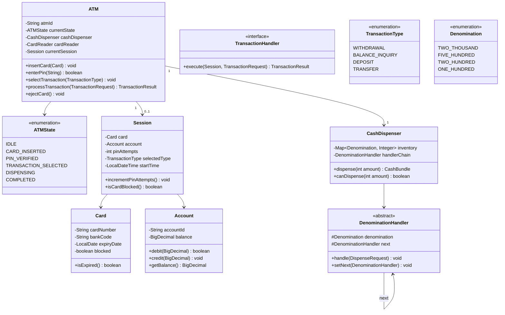

# Design an ATM System

!!! tip "Interview Context"
    **Asked at:** Google, Amazon, Microsoft, Goldman Sachs | **Level:** L4-L6 | **Time:** 45 minutes | **Type:** LLD/OOP Design (Hard — State Machine + Chain of Responsibility)

---

## Requirements

### Functional

- Support operations: Withdrawal, Balance Inquiry, Deposit, Transfer
- Validate card (expiry, blocked status) and authenticate via PIN
- Block card after 3 consecutive failed PIN attempts
- Dispense cash using available denominations (₹2000, ₹500, ₹200, ₹100)
- Maintain cash inventory per denomination; reject if insufficient
- Print transaction receipt with details

### Non-Functional

- Only one user per ATM at any time (single-session concurrency)
- State transitions must be atomic (no partial state corruption)
- Transaction timeout: auto-return to IDLE after 30 seconds of inactivity
- Audit log for every transaction (regulatory compliance)

---

## Class Diagram



---

## Key Design Decisions

| Decision | Choice | Why |
|---|---|---|
| ATM flow control | State Machine | Enforces valid transitions, prevents illegal operations (e.g., withdraw before PIN) |
| Cash dispensing | Chain of Responsibility | Each denomination handler processes what it can, passes remainder to next |
| Transaction types | Strategy Pattern | Withdrawal, Deposit, Transfer are interchangeable handlers |
| Session management | Session object per interaction | Encapsulates card, account, attempts — garbage collected on eject |
| Concurrency | Single session lock | Physical constraint: one user at a time, no complex locking needed |

---

## Java Implementation

=== "Core Models"

    ```java
    public enum ATMState {
        IDLE, CARD_INSERTED, PIN_VERIFIED, TRANSACTION_SELECTED, DISPENSING, COMPLETED
    }

    public enum Denomination {
        TWO_THOUSAND(2000), FIVE_HUNDRED(500), TWO_HUNDRED(200), ONE_HUNDRED(100);
        private final int value;
        Denomination(int value) { this.value = value; }
        public int getValue() { return value; }
    }

    public enum TransactionType { WITHDRAWAL, BALANCE_INQUIRY, DEPOSIT, TRANSFER }

    public class Card {
        private final String cardNumber;
        private final String bankCode;
        private final LocalDate expiryDate;
        private boolean blocked;

        public boolean isExpired() { return LocalDate.now().isAfter(expiryDate); }
        public boolean isBlocked() { return blocked; }
        public void block() { this.blocked = true; }
    }

    public class Account {
        private final String accountId;
        private BigDecimal balance;

        public synchronized boolean debit(BigDecimal amount) {
            if (balance.compareTo(amount) < 0) return false;
            balance = balance.subtract(amount);
            return true;
        }

        public synchronized void credit(BigDecimal amount) {
            balance = balance.add(amount);
        }

        public BigDecimal getBalance() { return balance; }
    }

    public class Session {
        private final Card card;
        private final Account account;
        private int pinAttempts;
        private TransactionType selectedType;
        private final LocalDateTime startTime = LocalDateTime.now();

        private static final int MAX_PIN_ATTEMPTS = 3;

        public void incrementPinAttempts() { pinAttempts++; }

        public boolean isCardBlocked() {
            if (pinAttempts >= MAX_PIN_ATTEMPTS) {
                card.block();
                return true;
            }
            return false;
        }
    }
    ```

=== "ATM State Machine"

    ```java
    public class ATM {
        private final String atmId;
        private ATMState state = ATMState.IDLE;
        private final CashDispenser cashDispenser;
        private final BankService bankService; // external API
        private Session currentSession;
        private final ReentrantLock sessionLock = new ReentrantLock();

        public void insertCard(Card card) {
            if (state != ATMState.IDLE) throw new IllegalStateException("ATM busy");
            sessionLock.lock();
            try {
                if (card.isExpired()) throw new CardExpiredException();
                if (card.isBlocked()) throw new CardBlockedException();
                Account account = bankService.lookupAccount(card);
                currentSession = new Session(card, account);
                transition(ATMState.CARD_INSERTED);
            } catch (Exception e) {
                sessionLock.unlock();
                throw e;
            }
        }

        public boolean enterPin(String pin) {
            requireState(ATMState.CARD_INSERTED);
            boolean valid = bankService.validatePin(currentSession.getCard(), pin);
            if (valid) {
                transition(ATMState.PIN_VERIFIED);
                return true;
            }
            currentSession.incrementPinAttempts();
            if (currentSession.isCardBlocked()) {
                ejectCard();
                throw new CardBlockedException("3 failed attempts — card blocked");
            }
            return false;
        }

        public void selectTransaction(TransactionType type) {
            requireState(ATMState.PIN_VERIFIED);
            currentSession.setSelectedType(type);
            transition(ATMState.TRANSACTION_SELECTED);
        }

        public TransactionResult processTransaction(TransactionRequest request) {
            requireState(ATMState.TRANSACTION_SELECTED);
            TransactionHandler handler = TransactionHandlerFactory.create(
                currentSession.getSelectedType(), cashDispenser, bankService
            );
            TransactionResult result = handler.execute(currentSession, request);
            transition(result.isSuccess() ? ATMState.DISPENSING : ATMState.COMPLETED);
            return result;
        }

        public void ejectCard() {
            currentSession = null;
            transition(ATMState.IDLE);
            sessionLock.unlock();
        }

        private void transition(ATMState newState) {
            this.state = newState;
            AuditLog.log(atmId, state, newState);
        }

        private void requireState(ATMState expected) {
            if (state != expected)
                throw new IllegalStateException("Expected " + expected + " but was " + state);
        }
    }
    ```

=== "Cash Dispenser (Chain of Responsibility)"

    ```java
    public class CashDispenser {
        private final Map<Denomination, Integer> inventory = new EnumMap<>(Denomination.class);
        private DenominationHandler handlerChain;

        public CashDispenser(Map<Denomination, Integer> initialInventory) {
            this.inventory.putAll(initialInventory);
            buildChain();
        }

        private void buildChain() {
            // Chain: ₹2000 → ₹500 → ₹200 → ₹100 (greedy, largest first)
            DenominationHandler h2000 = new DenominationHandler(Denomination.TWO_THOUSAND, inventory);
            DenominationHandler h500 = new DenominationHandler(Denomination.FIVE_HUNDRED, inventory);
            DenominationHandler h200 = new DenominationHandler(Denomination.TWO_HUNDRED, inventory);
            DenominationHandler h100 = new DenominationHandler(Denomination.ONE_HUNDRED, inventory);
            h2000.setNext(h500);
            h500.setNext(h200);
            h200.setNext(h100);
            this.handlerChain = h2000;
        }

        public boolean canDispense(int amount) {
            if (amount % 100 != 0) return false;
            // Simulate without modifying inventory
            return simulateDispense(amount);
        }

        public CashBundle dispense(int amount) {
            if (!canDispense(amount)) throw new InsufficientCashException();
            DispenseRequest request = new DispenseRequest(amount);
            handlerChain.handle(request);
            return request.getResult();
        }

        public int getTotalCash() {
            return inventory.entrySet().stream()
                .mapToInt(e -> e.getKey().getValue() * e.getValue())
                .sum();
        }
    }

    public class DenominationHandler {
        private final Denomination denomination;
        private final Map<Denomination, Integer> inventory;
        private DenominationHandler next;

        public DenominationHandler(Denomination denomination, Map<Denomination, Integer> inventory) {
            this.denomination = denomination;
            this.inventory = inventory;
        }

        public void setNext(DenominationHandler next) { this.next = next; }

        public void handle(DispenseRequest request) {
            int remaining = request.getRemainingAmount();
            int notesNeeded = remaining / denomination.getValue();
            int notesAvailable = inventory.getOrDefault(denomination, 0);
            int notesToDispense = Math.min(notesNeeded, notesAvailable);

            if (notesToDispense > 0) {
                inventory.put(denomination, notesAvailable - notesToDispense);
                request.addNotes(denomination, notesToDispense);
            }

            if (request.getRemainingAmount() > 0 && next != null) {
                next.handle(request);
            }
        }
    }

    public class DispenseRequest {
        private int remainingAmount;
        private final Map<Denomination, Integer> dispensed = new EnumMap<>(Denomination.class);

        public DispenseRequest(int amount) { this.remainingAmount = amount; }

        public void addNotes(Denomination denom, int count) {
            dispensed.put(denom, count);
            remainingAmount -= denom.getValue() * count;
        }

        public int getRemainingAmount() { return remainingAmount; }
        public CashBundle getResult() { return new CashBundle(dispensed); }
    }
    ```

=== "Transaction Handlers"

    ```java
    public interface TransactionHandler {
        TransactionResult execute(Session session, TransactionRequest request);
    }

    public class WithdrawalHandler implements TransactionHandler {
        private final CashDispenser cashDispenser;
        private final BankService bankService;

        @Override
        public TransactionResult execute(Session session, TransactionRequest request) {
            int amount = request.getAmount();

            // Step 1: Check ATM has enough cash
            if (!cashDispenser.canDispense(amount)) {
                return TransactionResult.failure("ATM has insufficient cash");
            }

            // Step 2: Debit account
            if (!session.getAccount().debit(BigDecimal.valueOf(amount))) {
                return TransactionResult.failure("Insufficient account balance");
            }

            // Step 3: Dispense cash
            CashBundle bundle = cashDispenser.dispense(amount);
            return TransactionResult.success(bundle);
        }
    }

    public class BalanceInquiryHandler implements TransactionHandler {
        @Override
        public TransactionResult execute(Session session, TransactionRequest request) {
            BigDecimal balance = session.getAccount().getBalance();
            return TransactionResult.success("Balance: " + balance);
        }
    }

    public class TransferHandler implements TransactionHandler {
        private final BankService bankService;

        @Override
        public TransactionResult execute(Session session, TransactionRequest request) {
            Account source = session.getAccount();
            Account target = bankService.lookupAccount(request.getTargetAccountId());
            if (!source.debit(request.getAmountAsBigDecimal())) {
                return TransactionResult.failure("Insufficient balance");
            }
            target.credit(request.getAmountAsBigDecimal());
            return TransactionResult.success("Transferred " + request.getAmount());
        }
    }

    public class TransactionHandlerFactory {
        public static TransactionHandler create(TransactionType type,
                CashDispenser dispenser, BankService bankService) {
            return switch (type) {
                case WITHDRAWAL -> new WithdrawalHandler(dispenser, bankService);
                case BALANCE_INQUIRY -> new BalanceInquiryHandler();
                case DEPOSIT -> new DepositHandler(bankService);
                case TRANSFER -> new TransferHandler(bankService);
            };
        }
    }
    ```

---

## SOLID Principles Applied

| Principle | How Applied |
|---|---|
| **S** — Single Responsibility | `ATM` manages state flow; `CashDispenser` manages inventory; `TransactionHandler` executes business logic |
| **O** — Open/Closed | New transaction types (e.g., bill payment) added as new `TransactionHandler` — no existing code modified |
| **L** — Liskov Substitution | Any `TransactionHandler` implementation works in `processTransaction()` without caller changes |
| **I** — Interface Segregation | `TransactionHandler` has one method; `DenominationHandler` has one concern (its denomination) |
| **D** — Dependency Inversion | `ATM` depends on `TransactionHandler` interface and `BankService` interface, not concrete classes |

---

## Scaling Considerations (If Interviewer Asks)

| "What if..." | Answer |
|---|---|
| Bank network is slow/down | Timeout + retry with circuit breaker; offline mode for balance cached locally |
| Multiple denominations per country | Make `Denomination` configurable; Chain of Responsibility adapts to any set of notes |
| ATM network (1000 machines) | Central inventory service pushes replenishment alerts when cash < threshold |
| Fraud detection | Event stream from audit log → rules engine flags anomalies (rapid withdrawals, odd hours) |
| Card-less withdrawal (UPI/QR) | Add `AuthenticationStrategy` interface — card auth and QR auth are interchangeable |
| Daily withdrawal limits | Add `LimitChecker` as a decorator around `WithdrawalHandler` |

---

## Common Interview Mistakes

| Mistake | Why It's Wrong |
|---|---|
| Skipping the state machine | Without states, you can't prevent "withdraw before PIN" — instant reject from interviewer |
| Hardcoding denominations | Violates OCP — what about ₹50 notes or USD $20? Chain of Responsibility solves this |
| Ignoring PIN retry logic | 3-attempt lockout is a core ATM security requirement |
| No separation between ATM cash and account balance | ATM can have ₹0 cash while your account has ₹1M — two independent checks |
| Using `double` for money | Floating-point errors in financial systems — always use `BigDecimal` |
| Over-engineering concurrency | One user per ATM at a time — a simple lock is sufficient, no need for CAS or STM |

---

## Interview Walkthrough (45 minutes)

| Time | What to Do |
|---|---|
| 0-5 min | Clarify: transaction types, denominations, PIN rules, card validation, receipt? |
| 5-12 min | Draw state machine diagram (IDLE → ... → COMPLETED) and explain transitions |
| 12-20 min | Draw class diagram: ATM, Session, CashDispenser, TransactionHandler |
| 20-30 min | Code: ATM state machine + Chain of Responsibility for cash dispensing |
| 30-38 min | Code: WithdrawalHandler showing account debit + dispense coordination |
| 38-45 min | Discuss: SOLID mapping, PIN lockout edge case, what-if extensions |
