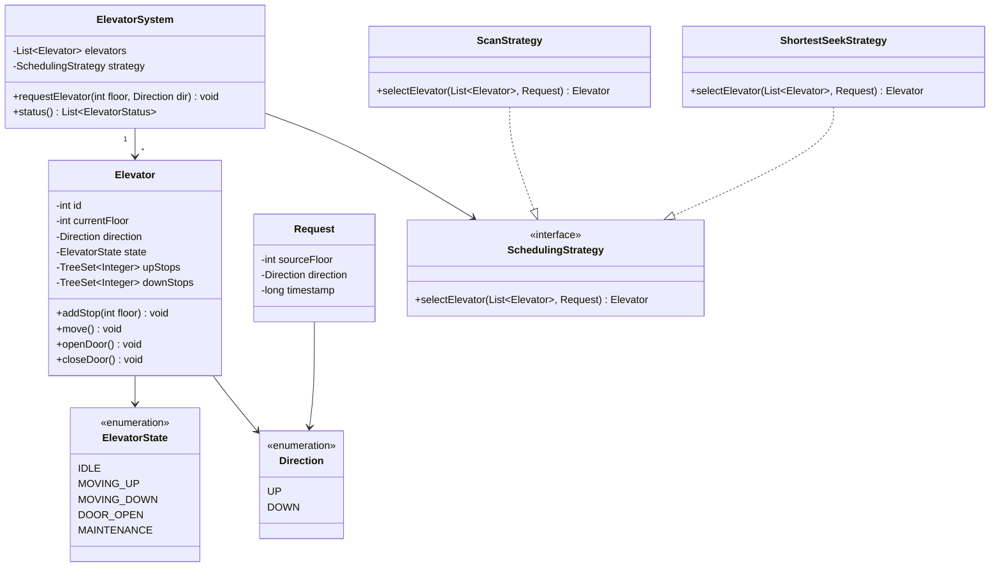

# Design an Elevator System

!!! tip "Interview Context"
    **Asked at:** Google, Amazon, Microsoft, Apple | **Level:** L4-L6 | **Time:** 45 minutes | **Type:** LLD/OOP Design

---

## Requirements

### Functional

- Building with N floors and M elevators
- Passengers request elevators from any floor (up/down button)
- Passengers select destination floor inside the elevator
- Elevator moves efficiently using scheduling algorithm (SCAN/LOOK)
- Display current floor and direction on each floor
- Handle door open/close with timeout

### Non-Functional

- Minimize average passenger wait time
- No starvation — every request eventually served
- Handle concurrent requests from multiple floors
- Graceful degradation if one elevator goes out of service

---

## Class Diagram



---

## Key Design Decisions

| Decision | Choice | Why |
|---|---|---|
| Scheduling | Strategy Pattern | SCAN, LOOK, Shortest Seek are interchangeable |
| Elevator movement | State Machine | Clear transitions: IDLE → MOVING → DOOR_OPEN → MOVING |
| Stop management | Two TreeSets (up/down) | O(log n) insert, natural ordering for SCAN |
| Floor displays | Observer Pattern | Elevators notify displays on state change |
| Concurrency | Synchronized stop sets | Multiple floor requests arrive simultaneously |

---

## Java Implementation

=== "Core Models"

    ```java
    public enum Direction { UP, DOWN }
    public enum ElevatorState { IDLE, MOVING_UP, MOVING_DOWN, DOOR_OPEN, MAINTENANCE }

    public class Request {
        private final int sourceFloor;
        private final Direction direction;
        private final long timestamp;

        public Request(int sourceFloor, Direction direction) {
            this.sourceFloor = sourceFloor;
            this.direction = direction;
            this.timestamp = System.currentTimeMillis();
        }
        // getters
    }

    public class Elevator {
        private final int id;
        private int currentFloor;
        private Direction direction;
        private ElevatorState state;
        private final TreeSet<Integer> upStops = new TreeSet<>();
        private final TreeSet<Integer> downStops = new TreeSet<>();

        public Elevator(int id) {
            this.id = id;
            this.currentFloor = 0;
            this.state = ElevatorState.IDLE;
        }

        public synchronized void addStop(int floor) {
            if (floor > currentFloor) upStops.add(floor);
            else if (floor < currentFloor) downStops.add(floor);
            else openDoor(); // already at requested floor
        }

        public void move() {
            if (state == ElevatorState.MOVING_UP) {
                Integer next = upStops.ceiling(currentFloor);
                if (next != null) {
                    currentFloor = next;
                    upStops.remove(next);
                    openDoor();
                } else {
                    // Reverse direction (SCAN behavior)
                    direction = Direction.DOWN;
                    state = downStops.isEmpty() ? ElevatorState.IDLE : ElevatorState.MOVING_DOWN;
                }
            } else if (state == ElevatorState.MOVING_DOWN) {
                Integer next = downStops.floor(currentFloor);
                if (next != null) {
                    currentFloor = next;
                    downStops.remove(next);
                    openDoor();
                } else {
                    direction = Direction.UP;
                    state = upStops.isEmpty() ? ElevatorState.IDLE : ElevatorState.MOVING_UP;
                }
            }
        }

        public void openDoor() { state = ElevatorState.DOOR_OPEN; }
        public void closeDoor() {
            state = upStops.isEmpty() && downStops.isEmpty()
                ? ElevatorState.IDLE
                : (direction == Direction.UP ? ElevatorState.MOVING_UP : ElevatorState.MOVING_DOWN);
        }
    }
    ```

=== "Scheduling Strategies"

    ```java
    public interface SchedulingStrategy {
        Elevator selectElevator(List<Elevator> elevators, Request request);
    }

    // SCAN: pick elevator already moving toward the floor in the same direction
    public class ScanStrategy implements SchedulingStrategy {
        @Override
        public Elevator selectElevator(List<Elevator> elevators, Request request) {
            Elevator best = null;
            int minCost = Integer.MAX_VALUE;

            for (Elevator e : elevators) {
                if (e.getState() == ElevatorState.MAINTENANCE) continue;
                int cost = calculateCost(e, request);
                if (cost < minCost) {
                    minCost = cost;
                    best = e;
                }
            }
            return best;
        }

        private int calculateCost(Elevator e, Request req) {
            int distance = Math.abs(e.getCurrentFloor() - req.getSourceFloor());
            // Prefer elevators moving toward the request in same direction
            if (e.getState() == ElevatorState.IDLE) return distance;
            if (e.getDirection() == req.getDirection()) {
                boolean onTheWay = (req.getDirection() == Direction.UP)
                    ? e.getCurrentFloor() <= req.getSourceFloor()
                    : e.getCurrentFloor() >= req.getSourceFloor();
                return onTheWay ? distance : distance + 20; // penalty for wrong side
            }
            return distance + 10; // moving opposite direction
        }
    }

    // Shortest Seek First: pick closest idle or nearest elevator
    public class ShortestSeekStrategy implements SchedulingStrategy {
        @Override
        public Elevator selectElevator(List<Elevator> elevators, Request request) {
            return elevators.stream()
                .filter(e -> e.getState() != ElevatorState.MAINTENANCE)
                .min(Comparator.comparingInt(
                    e -> Math.abs(e.getCurrentFloor() - request.getSourceFloor())))
                .orElse(null);
        }
    }
    ```

=== "Elevator System Controller"

    ```java
    public class ElevatorSystem {
        private final List<Elevator> elevators;
        private final SchedulingStrategy strategy;

        public ElevatorSystem(int numElevators, SchedulingStrategy strategy) {
            this.strategy = strategy;
            this.elevators = IntStream.range(0, numElevators)
                .mapToObj(Elevator::new)
                .collect(Collectors.toList());
        }

        public void requestElevator(int floor, Direction direction) {
            Request request = new Request(floor, direction);
            Elevator selected = strategy.selectElevator(elevators, request);
            if (selected == null) throw new NoAvailableElevatorException();
            selected.addStop(floor);
        }

        public void selectFloor(int elevatorId, int destinationFloor) {
            Elevator elevator = elevators.get(elevatorId);
            elevator.addStop(destinationFloor);
        }

        // Called by timer thread — drives all elevators forward one step
        public void step() {
            elevators.stream()
                .filter(e -> e.getState() != ElevatorState.IDLE)
                .forEach(Elevator::move);
        }
    }
    ```

---

## SOLID Principles Applied

| Principle | How Applied |
|---|---|
| **S** — Single Responsibility | `Elevator` manages its own state; `SchedulingStrategy` handles assignment logic |
| **O** — Open/Closed | New scheduling algorithms added without modifying `ElevatorSystem` |
| **L** — Liskov Substitution | `ScanStrategy` and `ShortestSeekStrategy` are interchangeable |
| **I** — Interface Segregation | `SchedulingStrategy` has one method — focused interface |
| **D** — Dependency Inversion | `ElevatorSystem` depends on `SchedulingStrategy` interface, not concrete impl |

---

## Interview Walkthrough (45 minutes)

| Time | What to Do |
|---|---|
| 0-5 min | Clarify: # floors, # elevators, single vs. multi-building, peak hours |
| 5-15 min | Draw class diagram — Elevator, Request, SchedulingStrategy, State Machine |
| 15-25 min | Explain SCAN algorithm, show TreeSet-based stop management |
| 25-35 min | Code: Elevator.move(), ScanStrategy.selectElevator() |
| 35-45 min | Discuss: edge cases (all elevators full), starvation prevention, VIP elevators |
