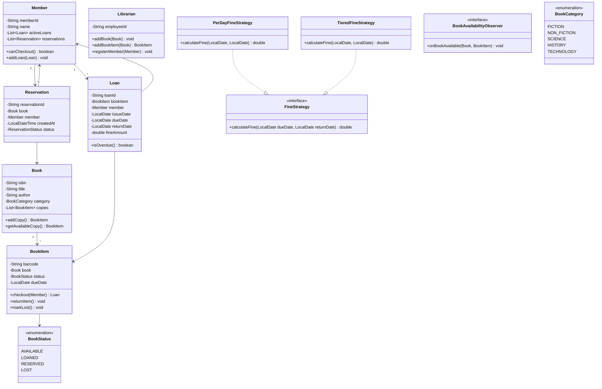

# Design a Library Management System

!!! tip "Interview Context"
    **Asked at:** Amazon, Microsoft, Walmart, Intuit | **Level:** L4-L5 | **Time:** 45 minutes | **Type:** LLD/OOP Design | **Difficulty:** Medium

---

## Requirements

### Functional

- Manage books and physical copies (one book title can have multiple copies)
- Members can search books by title, author, ISBN, or category
- Members can checkout books (max 5 at a time) with a 14-day loan period
- Members can reserve a book if all copies are currently loaned out
- System notifies next member in reservation queue when a copy is returned
- Librarians can add/remove books and manage member accounts
- Calculate fines for overdue returns

### Non-Functional

- Handle concurrent checkouts (no double-assignment of the same copy)
- Search results in < 200ms (indexing on title, author, ISBN)
- Accurate fine calculation with auditable history
- Support multiple fine strategies without code changes

---

## Class Diagram



---

## Key Design Decisions

| Decision | Choice | Why |
|---|---|---|
| Book vs BookItem | Separate classes | One ISBN maps to many physical copies — normalize metadata |
| Fine calculation | Strategy Pattern | Per-day, tiered, category-based — swap without modifying loan logic |
| Reservation notification | Observer Pattern | Decouples return flow from notification channel (email, SMS, push) |
| Checkout concurrency | Synchronized on BookItem | Prevents two members checking out the same copy |
| Search | Index maps (title, author, ISBN) | O(1) lookup by ISBN, prefix search by title/author |
| Reservation queue | FIFO per Book | Fair ordering; LinkedList queue per ISBN |

---

## Java Implementation

=== "Core Models"

    ```java
    public enum BookStatus { AVAILABLE, LOANED, RESERVED, LOST }
    public enum BookCategory { FICTION, NON_FICTION, SCIENCE, HISTORY, TECHNOLOGY }

    public class Book {
        private final String isbn;
        private final String title;
        private final String author;
        private final BookCategory category;
        private final List<BookItem> copies = new ArrayList<>();

        public Book(String isbn, String title, String author, BookCategory category) {
            this.isbn = isbn;
            this.title = title;
            this.author = author;
            this.category = category;
        }

        public BookItem addCopy(String barcode) {
            BookItem item = new BookItem(barcode, this);
            copies.add(item);
            return item;
        }

        public Optional<BookItem> getAvailableCopy() {
            return copies.stream()
                .filter(c -> c.getStatus() == BookStatus.AVAILABLE)
                .findFirst();
        }

        // getters omitted for brevity
    }

    public class BookItem {
        private final String barcode;
        private final Book book;
        private BookStatus status;
        private LocalDate dueDate;

        public BookItem(String barcode, Book book) {
            this.barcode = barcode;
            this.book = book;
            this.status = BookStatus.AVAILABLE;
        }

        public synchronized boolean checkout(Member member) {
            if (status != BookStatus.AVAILABLE) return false;
            this.status = BookStatus.LOANED;
            this.dueDate = LocalDate.now().plusDays(14);
            return true;
        }

        public synchronized void returnItem() {
            this.status = BookStatus.AVAILABLE;
            this.dueDate = null;
        }

        public void markLost() { this.status = BookStatus.LOST; }
        // getters omitted
    }

    public class Member {
        private final String memberId;
        private final String name;
        private final List<Loan> activeLoans = new ArrayList<>();
        private static final int MAX_LOANS = 5;

        public boolean canCheckout() { return activeLoans.size() < MAX_LOANS; }
        public void addLoan(Loan loan) { activeLoans.add(loan); }
        public void removeLoan(Loan loan) { activeLoans.remove(loan); }
    }
    ```

=== "Library Service"

    ```java
    public class LibraryService {
        private final Map<String, Book> booksByIsbn = new ConcurrentHashMap<>();
        private final Map<String, Loan> activeLoans = new ConcurrentHashMap<>();
        private final FineStrategy fineStrategy;
        private final ReservationService reservationService;

        public LibraryService(FineStrategy fineStrategy, ReservationService reservationService) {
            this.fineStrategy = fineStrategy;
            this.reservationService = reservationService;
        }

        public Loan checkout(Member member, String isbn) {
            if (!member.canCheckout()) {
                throw new LoanLimitExceededException("Max 5 books allowed");
            }

            Book book = booksByIsbn.get(isbn);
            if (book == null) throw new BookNotFoundException(isbn);

            BookItem item = book.getAvailableCopy()
                .orElseThrow(() -> new NoAvailableCopyException(isbn));

            if (!item.checkout(member)) {
                throw new ConcurrentCheckoutException("Copy taken by another member");
            }

            Loan loan = new Loan(UUID.randomUUID().toString(), item, member,
                LocalDate.now(), LocalDate.now().plusDays(14));
            member.addLoan(loan);
            activeLoans.put(loan.getLoanId(), loan);
            return loan;
        }

        public double returnBook(String loanId) {
            Loan loan = activeLoans.remove(loanId);
            if (loan == null) throw new InvalidLoanException(loanId);

            loan.setReturnDate(LocalDate.now());
            loan.getBookItem().returnItem();
            loan.getMember().removeLoan(loan);

            // Calculate fine if overdue
            double fine = 0.0;
            if (loan.isOverdue()) {
                fine = fineStrategy.calculateFine(loan.getDueDate(), LocalDate.now());
                loan.setFineAmount(fine);
            }

            // Notify reservation queue
            reservationService.notifyNextInQueue(loan.getBookItem().getBook());
            return fine;
        }
    }
    ```

=== "Search / Catalog"

    ```java
    public class CatalogService {
        private final Map<String, Book> isbnIndex = new HashMap<>();
        private final Map<String, List<Book>> titleIndex = new HashMap<>();
        private final Map<String, List<Book>> authorIndex = new HashMap<>();
        private final Map<BookCategory, List<Book>> categoryIndex = new HashMap<>();

        public void addBook(Book book) {
            isbnIndex.put(book.getIsbn(), book);
            titleIndex.computeIfAbsent(
                book.getTitle().toLowerCase(), k -> new ArrayList<>()).add(book);
            authorIndex.computeIfAbsent(
                book.getAuthor().toLowerCase(), k -> new ArrayList<>()).add(book);
            categoryIndex.computeIfAbsent(
                book.getCategory(), k -> new ArrayList<>()).add(book);
        }

        public Book searchByIsbn(String isbn) {
            return isbnIndex.get(isbn);
        }

        public List<Book> searchByTitle(String title) {
            return titleIndex.entrySet().stream()
                .filter(e -> e.getKey().contains(title.toLowerCase()))
                .flatMap(e -> e.getValue().stream())
                .toList();
        }

        public List<Book> searchByAuthor(String author) {
            return authorIndex.entrySet().stream()
                .filter(e -> e.getKey().contains(author.toLowerCase()))
                .flatMap(e -> e.getValue().stream())
                .toList();
        }

        public List<Book> searchByCategory(BookCategory category) {
            return categoryIndex.getOrDefault(category, List.of());
        }
    }
    ```

=== "Reservation System"

    ```java
    public class ReservationService {
        private final Map<String, Queue<Reservation>> reservationQueues = new ConcurrentHashMap<>();
        private final List<BookAvailabilityObserver> observers = new ArrayList<>();

        public Reservation reserve(Member member, Book book) {
            if (book.getAvailableCopy().isPresent()) {
                throw new BookAvailableException("Book has available copies — checkout instead");
            }

            Reservation reservation = new Reservation(
                UUID.randomUUID().toString(), book, member, LocalDateTime.now()
            );

            reservationQueues.computeIfAbsent(book.getIsbn(), k -> new LinkedList<>())
                .add(reservation);
            return reservation;
        }

        public void notifyNextInQueue(Book book) {
            Queue<Reservation> queue = reservationQueues.get(book.getIsbn());
            if (queue == null || queue.isEmpty()) return;

            Reservation next = queue.poll();
            next.setStatus(ReservationStatus.READY);

            // Observer pattern: notify through all channels
            for (BookAvailabilityObserver observer : observers) {
                observer.onBookAvailable(book, book.getAvailableCopy().orElse(null));
            }
        }

        public void addObserver(BookAvailabilityObserver observer) {
            observers.add(observer);
        }
    }

    // Observer implementations
    public interface BookAvailabilityObserver {
        void onBookAvailable(Book book, BookItem item);
    }

    public class EmailNotificationObserver implements BookAvailabilityObserver {
        @Override
        public void onBookAvailable(Book book, BookItem item) {
            // Send email: "Your reserved book is now available"
        }
    }

    public class SMSNotificationObserver implements BookAvailabilityObserver {
        @Override
        public void onBookAvailable(Book book, BookItem item) {
            // Send SMS notification
        }
    }
    ```

=== "Fine Calculator"

    ```java
    public interface FineStrategy {
        double calculateFine(LocalDate dueDate, LocalDate returnDate);
    }

    // Strategy 1: Flat per-day fine
    public class PerDayFineStrategy implements FineStrategy {
        private static final double RATE_PER_DAY = 1.0;

        @Override
        public double calculateFine(LocalDate dueDate, LocalDate returnDate) {
            long daysLate = ChronoUnit.DAYS.between(dueDate, returnDate);
            return daysLate > 0 ? daysLate * RATE_PER_DAY : 0.0;
        }
    }

    // Strategy 2: Tiered fines (increases with delay)
    public class TieredFineStrategy implements FineStrategy {
        @Override
        public double calculateFine(LocalDate dueDate, LocalDate returnDate) {
            long daysLate = ChronoUnit.DAYS.between(dueDate, returnDate);
            if (daysLate <= 0) return 0.0;
            if (daysLate <= 7) return daysLate * 1.0;    // $1/day first week
            if (daysLate <= 14) return 7.0 + (daysLate - 7) * 2.0;  // $2/day second week
            return 7.0 + 14.0 + (daysLate - 14) * 5.0;  // $5/day after that
        }
    }

    // Strategy 3: Category-based fines
    public class CategoryFineStrategy implements FineStrategy {
        private final Map<BookCategory, Double> categoryRates = Map.of(
            BookCategory.FICTION, 0.5,
            BookCategory.TECHNOLOGY, 2.0,
            BookCategory.SCIENCE, 1.5
        );

        public double calculateFine(LocalDate dueDate, LocalDate returnDate, BookCategory category) {
            long daysLate = ChronoUnit.DAYS.between(dueDate, returnDate);
            double rate = categoryRates.getOrDefault(category, 1.0);
            return daysLate > 0 ? daysLate * rate : 0.0;
        }

        @Override
        public double calculateFine(LocalDate dueDate, LocalDate returnDate) {
            // Default rate when category unknown
            long daysLate = ChronoUnit.DAYS.between(dueDate, returnDate);
            return daysLate > 0 ? daysLate * 1.0 : 0.0;
        }
    }
    ```

---

## SOLID Principles Applied

| Principle | How Applied |
|---|---|
| **S** — Single Responsibility | `CatalogService` handles search; `LibraryService` handles loans; `ReservationService` handles queuing; `FineStrategy` handles fines |
| **O** — Open/Closed | New fine strategies (weekend, holiday) added without modifying `LibraryService` |
| **L** — Liskov Substitution | Any `FineStrategy` implementation works transparently in the return flow |
| **I** — Interface Segregation | `FineStrategy` has one method; `BookAvailabilityObserver` has one method — no fat interfaces |
| **D** — Dependency Inversion | `LibraryService` depends on `FineStrategy` interface, not `PerDayFineStrategy` concrete class |

---

## Scaling Considerations (If Interviewer Asks)

| "What if..." | Answer |
|---|---|
| Millions of books | Shard catalog by ISBN prefix; add Elasticsearch for full-text search |
| Multiple branches | Each branch is a `Library` instance; inter-branch transfers via event bus |
| High concurrent checkouts | Optimistic locking on BookItem with retry; or DB-level `SELECT FOR UPDATE` |
| Recommendation engine | Track loan history per member; collaborative filtering on category/author |
| Digital books (e-books) | Add `BookFormat` enum; digital copies have no LOANED limit per item |

---

## Common Interview Mistakes

| Mistake | Why It's Wrong |
|---|---|
| No Book vs BookItem distinction | Cannot track individual copies, due dates, or lost items |
| Hardcoding fine calculation | Violates Open/Closed — libraries change policies seasonally |
| Forgetting reservation queue | The interviewer WILL ask "what if no copies are available?" |
| No concurrency on checkout | Two members clicking checkout on the last copy = data corruption |
| Skipping the return flow | Fine calculation and notification logic is half the design |
| Over-engineering with microservices | A single library is NOT a distributed system — keep it in-process |

---

## Interview Walkthrough (45 minutes)

| Time | What to Do |
|---|---|
| 0-5 min | Clarify: max loans, loan period, fine model, reservation rules, member types |
| 5-15 min | Draw class diagram — emphasize Book vs BookItem, Loan, Reservation entities |
| 15-25 min | Core flows: checkout (with availability check), return (with fine + notification) |
| 25-35 min | Code: BookItem state machine, LibraryService, FineStrategy, ReservationService |
| 35-40 min | Design patterns: Strategy (fines), Observer (notifications), State (BookItem) |
| 40-45 min | Discuss: SOLID adherence, concurrency edge cases, scaling if asked |
