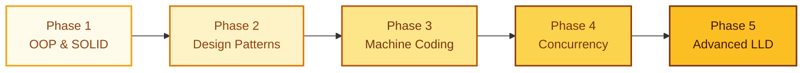
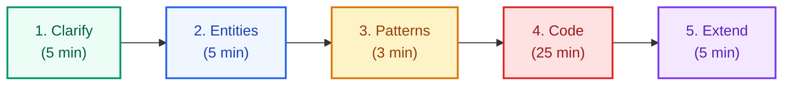

# Low-Level Design — Complete Roadmap

Roadmap
<h1 style="font-size: 2.2rem !important;">LLD Mastery Path</h1>

A structured 3–4 month journey from OOP basics to cracking machine coding rounds at FAANG companies.

5Phases

18+Problems

3–4Months

---

## The Roadmap

---

### :material-numeric-1-circle: Phase 1 — OOP & Design Foundations

!!! abstract "Duration: 2–3 weeks"
    Build the vocabulary and principles that every design decision rests on.

| Topic | What to Master |
|-------|---------------|
| **OOP Pillars** | Encapsulation, Inheritance, Polymorphism, Abstraction |
| **SOLID Principles** | SRP, OCP, LSP, ISP, DIP — with real Java examples |
| **Clean Code Axioms** | DRY, KISS, YAGNI — know when rules conflict |
| **UML Diagrams** | Class diagrams, Sequence diagrams, State diagrams |
| **Java Specifics** | Interfaces vs Abstract classes, composition vs inheritance |

??? tip "How to practice"
    Take any existing codebase you've written. Identify 3 violations of SOLID. Refactor them. Draw before/after class diagrams.

---

### :material-numeric-2-circle: Phase 2 — Design Patterns

!!! abstract "Duration: 3–4 weeks"
    Learn 23 GoF patterns. You need to know ~12 deeply for interviews.

!!! tip "Practice Repository"
    Java implementations of all patterns: [:fontawesome-brands-github: lld-Design-Patterns](https://github.com/saivamsikaruturi/lld-Design-Patterns)

=== "Creational (5)"

    | Pattern | Core Idea | Java SDK Example |
    |---------|-----------|-----------------|
    | **Singleton** | One instance globally, thread-safe | `Runtime.getRuntime()` |
    | **Factory Method** | Defer instantiation to subclasses | `Calendar.getInstance()` |
    | **Abstract Factory** | Family of related objects | `DocumentBuilderFactory` |
    | **Builder** | Step-by-step complex construction | `StringBuilder`, Lombok `@Builder` |
    | **Prototype** | Clone existing objects | `Object.clone()` |

=== "Structural (7)"

    | Pattern | Core Idea | Java SDK Example |
    |---------|-----------|-----------------|
    | **Adapter** | Make incompatible interfaces work together | `Arrays.asList()` |
    | **Decorator** | Add behavior dynamically | `BufferedReader(FileReader)` |
    | **Proxy** | Control access to an object | `java.lang.reflect.Proxy` |
    | **Facade** | Simplify complex subsystems | `javax.faces.context.FacesContext` |
    | **Composite** | Tree structures uniformly | `java.awt.Container` |
    | **Flyweight** | Share fine-grained objects | `Integer.valueOf()` cache |
    | **Bridge** | Decouple abstraction from implementation | JDBC `DriverManager` + drivers |

=== "Behavioral (11)"

    | Pattern | Core Idea | Java SDK Example |
    |---------|-----------|-----------------|
    | **Strategy** | Swap algorithms at runtime | `Comparator` |
    | **Observer** | Notify dependents of changes | `PropertyChangeListener` |
    | **Command** | Encapsulate request as object | `Runnable` |
    | **State** | Object behaves differently by state | TCP connection states |
    | **Chain of Resp.** | Pass request along a chain | Servlet Filters |
    | **Template Method** | Define skeleton, defer steps | `HttpServlet.doGet()` |
    | **Iterator** | Sequential access without exposing internals | `java.util.Iterator` |
    | **Mediator** | Centralize complex communications | `java.util.Timer` |
    | **Memento** | Capture/restore object state | Undo functionality |
    | **Visitor** | Add operations without modifying classes | `FileVisitor` |
    | **Interpreter** | Evaluate language grammar | `java.util.regex.Pattern` |

??? tip "The practice rule"
    For each pattern: (1) understand the **problem** it solves, (2) draw a class diagram, (3) code it from scratch in Java, (4) find it in a framework you use daily.

---

### :material-numeric-3-circle: Phase 3 — Machine Coding Problems

!!! abstract "Duration: 4–5 weeks"
    This is where interviews are won or lost. Practice under 45-minute time pressure.

!!! tip "Practice Repository"
    All problems below have full Java implementations: [:fontawesome-brands-github: machine-coding-feedback](https://github.com/saivamsikaruturi/machine-coding-feedback)

| # | Problem | Patterns Used | Difficulty | Code |
|---|---------|--------------|-----------|------|
| 1 | **Parking Lot System** | Strategy, State, Singleton, Factory | Medium | [:material-github: Solution](https://github.com/saivamsikaruturi/machine-coding-feedback/tree/master/parkingLot) |
| 2 | **LRU Cache** | HashMap + Doubly Linked List | Medium | [:material-github: Solution](https://github.com/saivamsikaruturi/machine-coding-feedback/tree/master/cache) |
| 3 | **Movie Ticket Booking (BookMyShow)** | Concurrency, Facade, Observer | Hard | [:material-github: Solution](https://github.com/saivamsikaruturi/machine-coding-feedback/tree/master/bookmyshow) |
| 4 | **Snake & Ladder** | State, Strategy, Factory | Medium | [:material-github: Solution](https://github.com/saivamsikaruturi/machine-coding-feedback/tree/master/snakeandladder) |
| 5 | **ATM System** | State Machine, Chain of Responsibility | Medium | [:material-github: Solution](https://github.com/saivamsikaruturi/machine-coding-feedback/tree/master/atm) |
| 6 | **Coffee Machine** | State, Builder | Medium | [:material-github: Solution](https://github.com/saivamsikaruturi/machine-coding-feedback/tree/master/coffeeMachine) |
| 7 | **Elevator System** | State, Strategy, Scheduler | Hard | [:material-github: Solution](https://github.com/saivamsikaruturi/machine-coding-feedback/tree/master/elevatorSystem) |
| 8 | **Splitwise** | Graph, Strategy, Settlement Algos | Hard | [:material-github: Solution](https://github.com/saivamsikaruturi/machine-coding-feedback/tree/master/splitwise) |
| 9 | **Logging Framework** | Singleton, Chain of Responsibility, Builder | Medium | [:material-github: Solution](https://github.com/saivamsikaruturi/machine-coding-feedback/tree/master/logger) |
| 10 | **Cricbuzz (Cricket Scoring)** | Observer, Strategy, State | Hard | [:material-github: Solution](https://github.com/saivamsikaruturi/machine-coding-feedback/tree/master/cricbuzz) |
| 11 | **Library Management** | Factory, Singleton, Observer | Medium | [:material-github: Solution](https://github.com/saivamsikaruturi/machine-coding-feedback/tree/master/librarymanagement) |
| 12 | **Meeting Room Scheduler** | Strategy, Priority Queue, Concurrency | Medium | [:material-github: Solution](https://github.com/saivamsikaruturi/machine-coding-feedback/tree/master/meetingroom) |
| 13 | **News Feed System** | Observer, Builder, Pagination | Medium | [:material-github: Solution](https://github.com/saivamsikaruturi/machine-coding-feedback/tree/master/newsFeed) |
| 14 | **Flight Booking System** | Builder, Strategy, State | Hard | [:material-github: Solution](https://github.com/saivamsikaruturi/machine-coding-feedback/tree/master/flighbookingsystem) |
| 15 | **Deck of Cards** | Factory, Strategy | Easy | [:material-github: Solution](https://github.com/saivamsikaruturi/machine-coding-feedback/tree/master/DeckOfCards) |
| 16 | **Thread-Safe File System** | Composite, Concurrency, Tree Structure | Hard | [:material-github: Solution](https://github.com/saivamsikaruturi/machine-coding-feedback/tree/master/ThreadSafeInMemoryFileSystem) |
| 17 | **Rate Limiter** | Strategy (Token Bucket / Sliding Window) | Medium | — |
| 18 | **Shopping Cart** | Strategy, Decorator, Builder | Medium | — |

---

### :material-numeric-4-circle: Phase 4 — Concurrency & Thread Safety

!!! abstract "Duration: 2–3 weeks"
    The differentiator between mid-level and senior candidates.

!!! tip "Practice Repository"
    Java concurrency and interview code: [:fontawesome-brands-github: Java-Practice](https://github.com/saivamsikaruturi/Java-Practice)

| Topic | Key Constructs |
|-------|---------------|
| **Thread-safe Singleton** | Double-checked locking, Enum singleton |
| **Producer-Consumer** | `BlockingQueue`, `wait()/notify()` |
| **Thread Pools** | `ThreadPoolExecutor`, `ScheduledExecutorService` |
| **Concurrent Collections** | `ConcurrentHashMap`, `CopyOnWriteArrayList` |
| **Synchronization** | `ReentrantLock`, `Semaphore`, `CountDownLatch`, `CyclicBarrier` |
| **Deadlock** | Detection, avoidance, lock ordering, `tryLock()` |
| **Immutability** | Immutable value objects as a concurrency strategy |

---

### :material-numeric-5-circle: Phase 5 — Advanced & Real-World LLD

!!! abstract "Duration: 2–3 weeks"
    Architecture-level thinking that signals staff-level design ability.

| Topic | Why It Matters |
|-------|---------------|
| **Event-driven design** | Observer vs EventBus vs in-process pub/sub |
| **Plugin architectures** | Extensibility without modification (real OCP) |
| **Rate limiting internals** | Token Bucket, Leaky Bucket, Sliding Window — from scratch |
| **Caching patterns** | LRU, LFU — implement the data structure yourself |
| **Repository & DAO** | Clean separation of business logic from persistence |
| **API/Interface design** | Design the contract before the implementation |
| **Refactoring for SOLID** | Take bad code → make it clean (real interview scenario) |

---

## Interview Execution Framework

!!! tip "Follow this every time — it's your 45-minute structure"

| Step | Action | Time |
|------|--------|------|
| **1. Clarify** | Ask scope, actors, core flows, edge cases. Don't jump to code. | 5 min |
| **2. Entities** | List nouns (classes) and verbs (methods). Draw a rough class diagram. | 5 min |
| **3. Patterns** | Identify where patterns fit naturally. Don't force them. | 3 min |
| **4. Code** | Get the happy path working first. Handle edge cases after. | 25 min |
| **5. Extend** | Tell the interviewer how your design handles new requirements. This is the seniority signal. | 5 min |

---

## Common Mistakes

!!! danger "Red flags that cost offers"
    - Starting to code before clarifying requirements
    - Using inheritance where composition fits better
    - Over-engineering with patterns that aren't needed
    - Missing thread safety when the problem clearly needs it
    - Not separating interfaces from implementations (violates DIP)
    - Writing God classes — one class doing everything
    - Forgetting to ask about extensibility requirements

---

## Interview Questions Bank

??? question "Design Principles & Patterns (click to expand)"
    | # | Question | Key Concepts |
    |---|----------|--------------|
    | 1 | Explain SOLID with a real example from your code | All 5 SOLID principles |
    | 2 | When would you use Strategy vs State pattern? | Pattern trade-offs |
    | 3 | How would you make Singleton thread-safe in Java? | DCL, Enum Singleton |
    | 4 | How does Decorator differ from Inheritance? | Composition vs Inheritance |
    | 5 | When should you use Factory vs Abstract Factory? | Creational patterns |
    | 6 | Explain Observer with a real-world scenario | Loose coupling, event-driven |
    | 7 | How would you refactor a God class for SRP? | Decomposition, SRP |
    | 8 | When is it okay to break Open/Closed Principle? | OCP pragmatics |
    | 9 | Difference between Proxy and Decorator? | Structural pattern distinction |
    | 10 | How to design an extensible payment gateway? | Strategy, OCP, interfaces |

??? question "Java Concurrency LLD (click to expand)"
    | # | Question | Key Concepts |
    |---|----------|--------------|
    | 1 | Design a thread-safe Bounded Blocking Queue | `ReentrantLock`, `Condition` |
    | 2 | Implement a thread-safe LRU Cache | `ConcurrentHashMap`, `LinkedHashMap` |
    | 3 | Design a Producer-Consumer system | `BlockingQueue`, `ExecutorService` |
    | 4 | Handle concurrent seat booking | Optimistic locking, Redis |
    | 5 | Design a connection pool from scratch | `Semaphore`, object pooling |
    | 6 | Explain deadlock with example and prevention | Lock ordering, `tryLock` |
    | 7 | Design an in-process pub/sub event bus | Observer, `ConcurrentHashMap` |

---

**Need a mock LLD interview or code review?**

[Book a 1:1 on Topmate](https://topmate.io/vamsi_krishna13){ .md-button .md-button--primary }

100+ sessions | 90%+ placement rate | Ex-Walmart, now Salesforce

