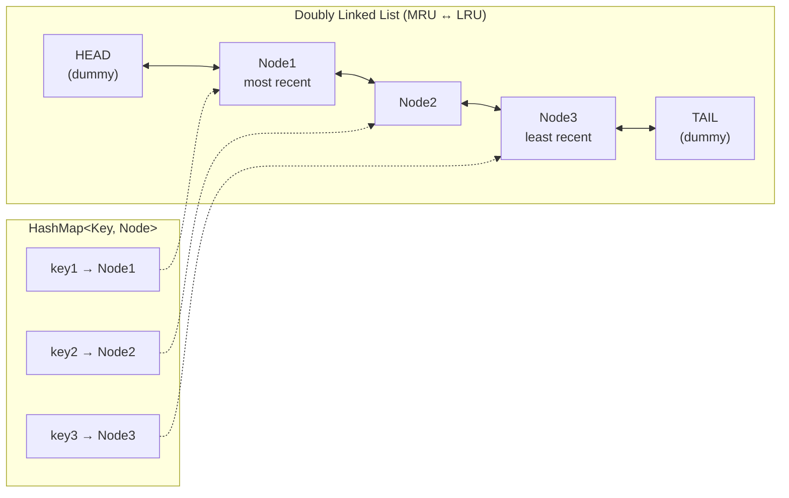
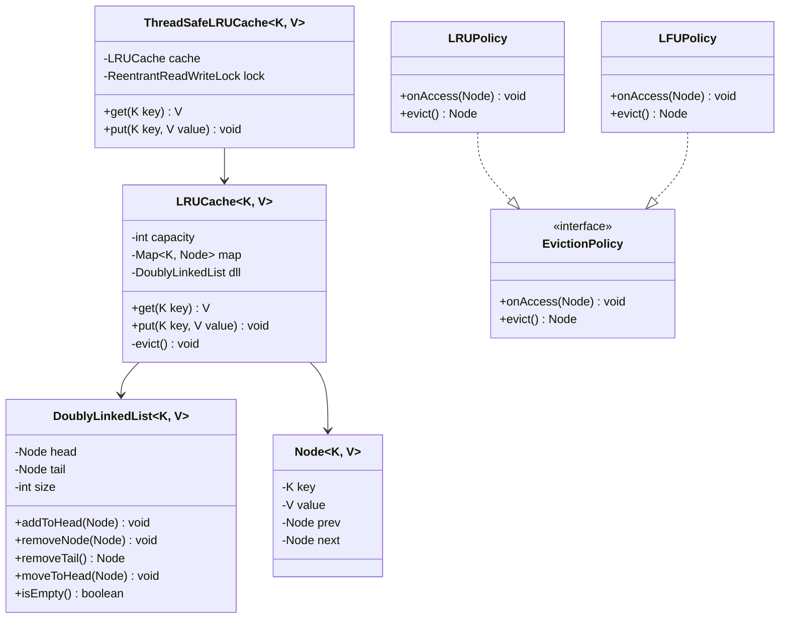
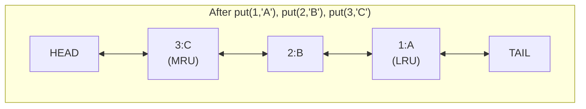
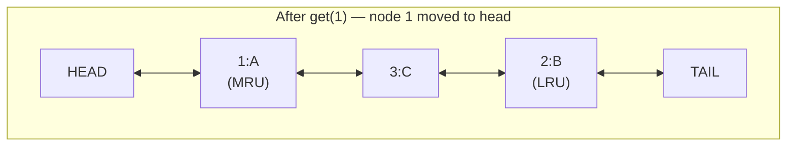
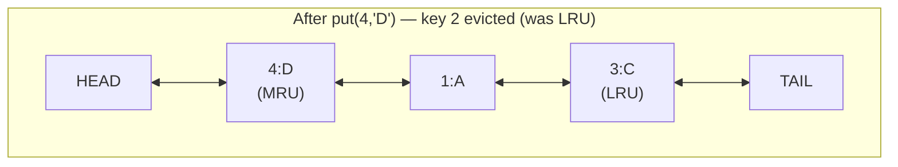

# Design an LRU Cache

!!! tip "Interview Context"
    **Asked at:** Meta, Amazon, Google, Netflix, Apple | **Level:** L4-L6 | **Time:** 45 minutes | **Type:** LLD / Data Structure Design | **Difficulty:** Medium-Hard

    This is arguably the **most commonly asked LLD problem** across all top tech companies. It tests your understanding of data structures, time complexity trade-offs, and concurrency.

---

## Requirements

### Functional

- `get(key)` — Return the value if key exists, mark as most recently used
- `put(key, value)` — Insert or update key-value pair, mark as most recently used
- Evict the **least recently used** entry when cache reaches capacity
- Fixed capacity set at initialization

### Non-Functional

- O(1) time for both `get` and `put` operations
- Thread-safe for concurrent readers and writers
- Memory-efficient (no unbounded auxiliary structures)
- Support generic key-value types

---

## Data Structure Diagram



**Why this combination?**

| Requirement | HashMap alone | Linked List alone | HashMap + DLL |
|---|---|---|---|
| O(1) lookup by key | Yes | No (O(n)) | Yes |
| O(1) move to front | No (no ordering) | Yes (with node ref) | Yes |
| O(1) eviction of LRU | No | Yes (remove tail) | Yes |
| Track access order | No | Yes | Yes |

---

## Class Diagram



---

## Key Design Decisions

| Decision | Choice | Why |
|---|---|---|
| Core data structure | HashMap + Doubly Linked List | O(1) for all three operations: lookup, reorder, evict |
| Dummy head/tail nodes | Sentinel nodes | Eliminates null checks on boundary operations |
| Eviction target | Tail of DLL (before sentinel) | Tail = least recently used, O(1) removal |
| Key stored in Node | Yes | Needed to remove map entry during eviction |
| Thread safety | ReentrantReadWriteLock | Readers don't block each other; only writers acquire exclusive lock |
| Generic types | `<K, V>` | Reusable for any key-value combination |

---

## Java Implementation

=== "Node & Doubly Linked List"

    ```java
    public class Node<K, V> {
        K key;
        V value;
        Node<K, V> prev;
        Node<K, V> next;

        public Node(K key, V value) {
            this.key = key;
            this.value = value;
        }
    }

    public class DoublyLinkedList<K, V> {
        private final Node<K, V> head; // dummy
        private final Node<K, V> tail; // dummy
        private int size;

        public DoublyLinkedList() {
            head = new Node<>(null, null);
            tail = new Node<>(null, null);
            head.next = tail;
            tail.prev = head;
            size = 0;
        }

        /** Add node right after head (most recently used position) */
        public void addToHead(Node<K, V> node) {
            node.prev = head;
            node.next = head.next;
            head.next.prev = node;
            head.next = node;
            size++;
        }

        /** Remove a specific node from anywhere in the list — O(1) */
        public void removeNode(Node<K, V> node) {
            node.prev.next = node.next;
            node.next.prev = node.prev;
            node.prev = null;
            node.next = null;
            size--;
        }

        /** Move existing node to head (mark as most recently used) */
        public void moveToHead(Node<K, V> node) {
            removeNode(node);
            addToHead(node);
        }

        /** Remove and return the tail node (least recently used) */
        public Node<K, V> removeTail() {
            if (isEmpty()) return null;
            Node<K, V> lru = tail.prev;
            removeNode(lru);
            return lru;
        }

        public boolean isEmpty() {
            return size == 0;
        }

        public int size() {
            return size;
        }
    }
    ```

=== "LRU Cache"

    ```java
    public class LRUCache<K, V> {
        private final int capacity;
        private final Map<K, Node<K, V>> map;
        private final DoublyLinkedList<K, V> dll;

        public LRUCache(int capacity) {
            if (capacity <= 0) throw new IllegalArgumentException("Capacity must be positive");
            this.capacity = capacity;
            this.map = new HashMap<>(capacity, 0.75f);
            this.dll = new DoublyLinkedList<>();
        }

        /** O(1) — Returns value or null if not found */
        public V get(K key) {
            Node<K, V> node = map.get(key);
            if (node == null) return null;
            // Mark as most recently used
            dll.moveToHead(node);
            return node.value;
        }

        /** O(1) — Inserts or updates, evicts LRU if at capacity */
        public void put(K key, V value) {
            Node<K, V> existing = map.get(key);

            if (existing != null) {
                // Update existing: change value, move to head
                existing.value = value;
                dll.moveToHead(existing);
            } else {
                // Evict if at capacity
                if (map.size() == capacity) {
                    evict();
                }
                // Insert new node
                Node<K, V> newNode = new Node<>(key, value);
                dll.addToHead(newNode);
                map.put(key, newNode);
            }
        }

        private void evict() {
            Node<K, V> lru = dll.removeTail();
            if (lru != null) {
                map.remove(lru.key); // This is why Node stores key
            }
        }

        public int size() {
            return map.size();
        }
    }
    ```

=== "Thread-Safe LRU Cache"

    ```java
    import java.util.concurrent.locks.ReentrantReadWriteLock;

    /**
     * Thread-safe wrapper using ReentrantReadWriteLock.
     * - Multiple readers can call get() concurrently (read lock)
     * - Writers acquire exclusive lock for put() and eviction
     *
     * Note: get() needs WRITE lock because it modifies DLL order.
     * For true read concurrency, use the segmented approach below.
     */
    public class ThreadSafeLRUCache<K, V> {
        private final LRUCache<K, V> cache;
        private final ReentrantReadWriteLock rwLock = new ReentrantReadWriteLock();

        public ThreadSafeLRUCache(int capacity) {
            this.cache = new LRUCache<>(capacity);
        }

        public V get(K key) {
            // get() mutates DLL order → needs write lock
            rwLock.writeLock().lock();
            try {
                return cache.get(key);
            } finally {
                rwLock.writeLock().unlock();
            }
        }

        public void put(K key, V value) {
            rwLock.writeLock().lock();
            try {
                cache.put(key, value);
            } finally {
                rwLock.writeLock().unlock();
            }
        }

        /**
         * Peek without updating access order — true read-only.
         * Multiple threads can call this concurrently.
         */
        public V peek(K key) {
            rwLock.readLock().lock();
            try {
                Node<K, V> node = cache.map.get(key);
                return node != null ? node.value : null;
            } finally {
                rwLock.readLock().unlock();
            }
        }
    }

    /**
     * High-throughput alternative: Segmented LRU Cache (Caffeine-style)
     * Partition keyspace into N segments, each with its own lock.
     */
    public class SegmentedLRUCache<K, V> {
        private final int segmentCount;
        private final LRUCache<K, V>[] segments;
        private final ReentrantReadWriteLock[] locks;

        @SuppressWarnings("unchecked")
        public SegmentedLRUCache(int totalCapacity, int segmentCount) {
            this.segmentCount = segmentCount;
            int perSegment = totalCapacity / segmentCount;
            segments = new LRUCache[segmentCount];
            locks = new ReentrantReadWriteLock[segmentCount];
            for (int i = 0; i < segmentCount; i++) {
                segments[i] = new LRUCache<>(perSegment);
                locks[i] = new ReentrantReadWriteLock();
            }
        }

        private int segmentFor(K key) {
            return (key.hashCode() & 0x7FFFFFFF) % segmentCount;
        }

        public V get(K key) {
            int seg = segmentFor(key);
            locks[seg].writeLock().lock();
            try {
                return segments[seg].get(key);
            } finally {
                locks[seg].writeLock().unlock();
            }
        }

        public void put(K key, V value) {
            int seg = segmentFor(key);
            locks[seg].writeLock().lock();
            try {
                segments[seg].put(key, value);
            } finally {
                locks[seg].writeLock().unlock();
            }
        }
    }
    ```

=== "LFU Cache Variant"

    ```java
    /**
     * LFU (Least Frequently Used) Cache
     * - Evicts the entry with lowest access frequency
     * - On tie: evicts the least recently used among lowest-frequency entries
     *
     * Structure: HashMap + frequency-to-DLL map
     */
    public class LFUCache<K, V> {
        private final int capacity;
        private int minFreq;
        private final Map<K, Node<K, V>> keyMap;
        private final Map<K, Integer> freqMap;               // key → frequency
        private final Map<Integer, DoublyLinkedList<K, V>> freqBuckets; // freq → DLL

        public LFUCache(int capacity) {
            this.capacity = capacity;
            this.minFreq = 0;
            this.keyMap = new HashMap<>();
            this.freqMap = new HashMap<>();
            this.freqBuckets = new HashMap<>();
        }

        public V get(K key) {
            if (!keyMap.containsKey(key)) return null;
            Node<K, V> node = keyMap.get(key);
            incrementFrequency(key, node);
            return node.value;
        }

        public void put(K key, V value) {
            if (capacity <= 0) return;

            if (keyMap.containsKey(key)) {
                Node<K, V> node = keyMap.get(key);
                node.value = value;
                incrementFrequency(key, node);
                return;
            }

            if (keyMap.size() == capacity) {
                // Evict from min-frequency bucket (tail = LRU within that freq)
                DoublyLinkedList<K, V> minList = freqBuckets.get(minFreq);
                Node<K, V> evicted = minList.removeTail();
                keyMap.remove(evicted.key);
                freqMap.remove(evicted.key);
            }

            // Insert new entry at frequency 1
            Node<K, V> newNode = new Node<>(key, value);
            keyMap.put(key, newNode);
            freqMap.put(key, 1);
            freqBuckets.computeIfAbsent(1, k -> new DoublyLinkedList<>()).addToHead(newNode);
            minFreq = 1;
        }

        private void incrementFrequency(K key, Node<K, V> node) {
            int oldFreq = freqMap.get(key);
            int newFreq = oldFreq + 1;
            freqMap.put(key, newFreq);

            // Remove from old frequency bucket
            freqBuckets.get(oldFreq).removeNode(node);
            if (freqBuckets.get(oldFreq).isEmpty()) {
                freqBuckets.remove(oldFreq);
                if (minFreq == oldFreq) minFreq++;
            }

            // Add to new frequency bucket
            freqBuckets.computeIfAbsent(newFreq, k -> new DoublyLinkedList<>()).addToHead(node);
        }
    }
    ```

---

## Step-by-Step Visual Walkthrough

### Operation: `put(1, "A")`, `put(2, "B")`, `put(3, "C")` (capacity = 3)



### Operation: `get(1)` — Access key 1, moves it to head



### Operation: `put(4, "D")` — Eviction triggered (capacity = 3)



**Eviction steps:**

1. Cache full (size 3 == capacity 3)
2. Remove tail node from DLL → Node(key=2, value="B")
3. Remove key=2 from HashMap
4. Insert Node(key=4, value="D") at head of DLL
5. Add key=4 → Node to HashMap

---

## DLL Operations Visualized

### `addToHead(node)`

```
Before: HEAD <-> X <-> ... <-> TAIL
After:  HEAD <-> node <-> X <-> ... <-> TAIL

Steps:
  node.prev = head
  node.next = head.next
  head.next.prev = node
  head.next = node
```

### `removeNode(node)`

```
Before: ... <-> A <-> node <-> B <-> ...
After:  ... <-> A <-> B <-> ...

Steps:
  node.prev.next = node.next
  node.next.prev = node.prev
```

### `moveToHead(node)` = `removeNode(node)` + `addToHead(node)`

### `removeTail()` = `removeNode(tail.prev)`

---

## SOLID Principles Applied

| Principle | How Applied |
|---|---|
| **S** — Single Responsibility | `Node` holds data, `DoublyLinkedList` manages ordering, `LRUCache` orchestrates eviction policy |
| **O** — Open/Closed | Swap `LRUPolicy` for `LFUPolicy` without modifying cache core via `EvictionPolicy` interface |
| **L** — Liskov Substitution | `ThreadSafeLRUCache` can replace `LRUCache` anywhere a cache is expected |
| **I** — Interface Segregation | `EvictionPolicy` has only `onAccess()` and `evict()` — no bloated interface |
| **D** — Dependency Inversion | Cache depends on `EvictionPolicy` abstraction, not on concrete LRU/LFU logic |

---

## Common Interview Mistakes

| Mistake | Why It's Wrong |
|---|---|
| Using only a HashMap | No ordering — cannot identify LRU in O(1) |
| Using only a LinkedList | O(n) lookup — defeats the purpose of a cache |
| Forgetting to store key in Node | Cannot remove the map entry during eviction without the key |
| No sentinel (dummy) nodes | Leads to verbose null checks on every boundary operation |
| Using `synchronized` on every method | Readers block each other unnecessarily; use RWLock or segments |
| Not handling `put` on existing key | Must update value AND move to head — not just update |
| Single global lock at high scale | Becomes bottleneck; use segmented/striped locks (Caffeine approach) |
| Confusing LRU with LFU | LRU = least recently used (time), LFU = least frequently used (count) |

---

## LRU vs LFU vs FIFO Comparison

| Aspect | LRU | LFU | FIFO |
|---|---|---|---|
| Eviction criteria | Least recently accessed | Least frequently accessed | Oldest inserted |
| Data structure | HashMap + DLL | HashMap + Freq map + DLL per freq | HashMap + Queue |
| Time complexity | O(1) all ops | O(1) all ops | O(1) all ops |
| Space overhead | 1 DLL + 1 map | N DLLs + 2 maps | 1 queue + 1 map |
| Best for | General workloads, temporal locality | Workloads with stable hot keys | Simple TTL caches |
| Weakness | Scan pollution (one-time access floods cache) | Stale popular items never evict | Ignores access patterns entirely |
| Real-world use | Redis, Memcached, Linux page cache | CDN edge caches, database buffer pools | Message queues, bounded buffers |
| Interview frequency | Very High | Medium | Low |

---

## Interview Walkthrough (45 minutes)

| Time | What to Do |
|---|---|
| 0-3 min | Clarify: capacity fixed? types? thread-safe? what returns on miss? |
| 3-8 min | Explain approach: "HashMap for O(1) lookup + DLL for O(1) reordering" |
| 8-12 min | Draw the data structure diagram (HashMap pointing into DLL nodes) |
| 12-20 min | Code `Node` class and `DoublyLinkedList` with `addToHead`, `removeNode`, `removeTail` |
| 20-30 min | Code `LRUCache` with `get()` and `put()` — walk through eviction logic |
| 30-38 min | Discuss thread safety: RWLock, segmented approach, ConcurrentHashMap trade-offs |
| 38-45 min | Edge cases, testing strategy, LFU variant if time permits |

!!! warning "Key Insight to Mention"
    "The reason we need to store the **key** inside the Node is for eviction — when we remove the tail from the DLL, we need the key to also delete the entry from the HashMap. This is the detail most candidates miss."
