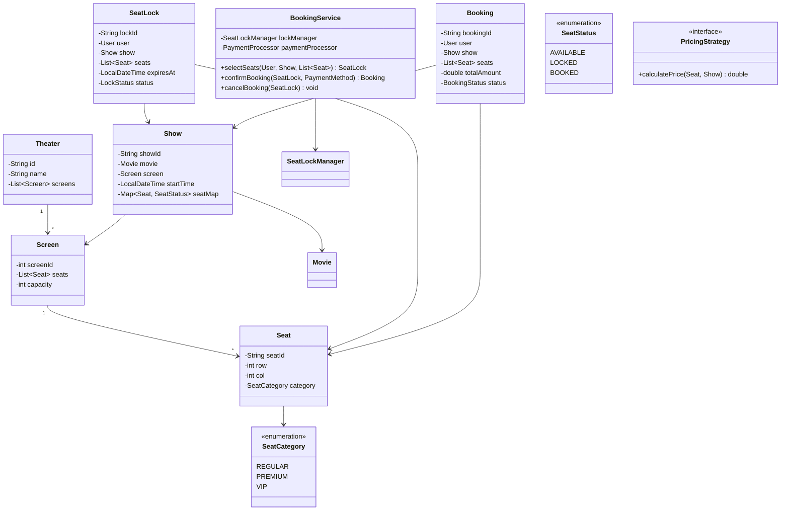

# Design a Movie Ticket Booking System

!!! tip "Interview Context"
    **Asked at:** Amazon, Microsoft, Walmart, Uber | **Level:** L4-L6 | **Time:** 45 minutes | **Type:** LLD/OOP Design

---

## Requirements

### Functional

- Browse movies, theaters, and showtimes
- View seat map with real-time availability (available/locked/booked)
- Select seats — temporarily lock them for the user (5 min timeout)
- Complete payment within timeout to confirm booking
- Release locked seats automatically on timeout or cancellation
- Different pricing for seat categories (regular, premium, VIP)

### Non-Functional

- No double-booking (two users cannot book the same seat)
- Handle concurrent seat selection (optimistic locking)
- Payment timeout releases seats back to available pool
- Support 1000+ concurrent users per show

---

## Class Diagram



---

## Key Design Decisions

| Decision | Choice | Why |
|---|---|---|
| Seat locking | Temporary lock with TTL | Prevents double-booking during payment |
| Concurrency | CAS on seat status | Multiple users selecting same seats simultaneously |
| Lock expiry | Scheduled cleanup thread | Releases abandoned locks automatically |
| Pricing | Strategy Pattern | Dynamic pricing, category-based, time-of-day |
| Seat state | State Machine | AVAILABLE → LOCKED → BOOKED (or back to AVAILABLE) |

---

## Java Implementation

=== "Seat Lock Manager"

    ```java
    public class SeatLockManager {
        private final ConcurrentHashMap<String, SeatLock> activeLocks = new ConcurrentHashMap<>();
        private final Duration lockTimeout;
        private final ScheduledExecutorService scheduler;

        public SeatLockManager(Duration lockTimeout) {
            this.lockTimeout = lockTimeout;
            this.scheduler = Executors.newScheduledThreadPool(1);
            // Periodic cleanup of expired locks
            scheduler.scheduleAtFixedRate(this::cleanupExpired, 30, 30, TimeUnit.SECONDS);
        }

        public SeatLock lockSeats(User user, Show show, List<Seat> seats) {
            // Attempt atomic lock on all seats
            synchronized (show) {
                for (Seat seat : seats) {
                    SeatStatus status = show.getSeatStatus(seat);
                    if (status != SeatStatus.AVAILABLE) {
                        throw new SeatUnavailableException(seat);
                    }
                }
                // All available — lock them atomically
                seats.forEach(s -> show.setSeatStatus(s, SeatStatus.LOCKED));
            }

            SeatLock lock = new SeatLock(
                UUID.randomUUID().toString(), user, show, seats,
                LocalDateTime.now().plus(lockTimeout)
            );
            activeLocks.put(lock.getLockId(), lock);
            return lock;
        }

        public void releaseLock(SeatLock lock) {
            synchronized (lock.getShow()) {
                lock.getSeats().forEach(s -> lock.getShow().setSeatStatus(s, SeatStatus.AVAILABLE));
            }
            lock.setStatus(LockStatus.EXPIRED);
            activeLocks.remove(lock.getLockId());
        }

        private void cleanupExpired() {
            LocalDateTime now = LocalDateTime.now();
            activeLocks.values().stream()
                .filter(lock -> lock.getExpiresAt().isBefore(now))
                .forEach(this::releaseLock);
        }
    }
    ```

=== "Booking Service"

    ```java
    public class BookingService {
        private final SeatLockManager lockManager;
        private final PaymentProcessor paymentProcessor;
        private final PricingStrategy pricingStrategy;
        private final Map<String, Booking> bookings = new ConcurrentHashMap<>();

        public SeatLock selectSeats(User user, Show show, List<Seat> seats) {
            return lockManager.lockSeats(user, show, seats);
        }

        public Booking confirmBooking(SeatLock lock, PaymentMethod method) {
            // Verify lock still valid
            if (lock.isExpired()) {
                throw new LockExpiredException("Seat lock expired. Please re-select seats.");
            }

            // Calculate total
            double total = lock.getSeats().stream()
                .mapToDouble(seat -> pricingStrategy.calculatePrice(seat, lock.getShow()))
                .sum();

            // Process payment
            PaymentResult result = paymentProcessor.process(total, method);
            if (!result.isSuccess()) {
                lockManager.releaseLock(lock);
                throw new PaymentFailedException(result.getReason());
            }

            // Confirm booking — transition seats to BOOKED
            synchronized (lock.getShow()) {
                lock.getSeats().forEach(s -> lock.getShow().setSeatStatus(s, SeatStatus.BOOKED));
            }
            lock.setStatus(LockStatus.CONFIRMED);

            Booking booking = new Booking(
                UUID.randomUUID().toString(), lock.getUser(), lock.getShow(),
                lock.getSeats(), total, BookingStatus.CONFIRMED
            );
            bookings.put(booking.getBookingId(), booking);
            return booking;
        }

        public void cancelBooking(String bookingId) {
            Booking booking = bookings.get(bookingId);
            if (booking == null) throw new BookingNotFoundException(bookingId);

            synchronized (booking.getShow()) {
                booking.getSeats().forEach(s -> booking.getShow().setSeatStatus(s, SeatStatus.AVAILABLE));
            }
            booking.setStatus(BookingStatus.CANCELLED);
            // Trigger refund asynchronously
            paymentProcessor.refundAsync(booking);
        }
    }
    ```

=== "Pricing Strategy"

    ```java
    public interface PricingStrategy {
        double calculatePrice(Seat seat, Show show);
    }

    public class CategoryBasedPricing implements PricingStrategy {
        private static final Map<SeatCategory, Double> BASE_PRICES = Map.of(
            SeatCategory.REGULAR, 10.0,
            SeatCategory.PREMIUM, 18.0,
            SeatCategory.VIP, 30.0
        );

        @Override
        public double calculatePrice(Seat seat, Show show) {
            double base = BASE_PRICES.get(seat.getCategory());
            // Weekend surcharge
            DayOfWeek day = show.getStartTime().getDayOfWeek();
            if (day == DayOfWeek.SATURDAY || day == DayOfWeek.SUNDAY) {
                base *= 1.25;
            }
            // Prime time surcharge (6PM-9PM)
            int hour = show.getStartTime().getHour();
            if (hour >= 18 && hour <= 21) {
                base *= 1.15;
            }
            return base;
        }
    }

    public class DemandBasedPricing implements PricingStrategy {
        @Override
        public double calculatePrice(Seat seat, Show show) {
            double base = new CategoryBasedPricing().calculatePrice(seat, show);
            double occupancy = show.getOccupancyRatio();
            if (occupancy > 0.75) base *= 1.3; // high demand
            return base;
        }
    }
    ```

---

## SOLID Principles Applied

| Principle | How Applied |
|---|---|
| **S** — Single Responsibility | `SeatLockManager` handles locking/expiry; `BookingService` orchestrates flow |
| **O** — Open/Closed | New pricing strategies added without modifying booking logic |
| **L** — Liskov Substitution | `CategoryBasedPricing` and `DemandBasedPricing` are interchangeable |
| **I** — Interface Segregation | `PricingStrategy` has one method; `PaymentProcessor` is separate |
| **D** — Dependency Inversion | `BookingService` depends on interfaces for pricing and payment |

---

## Interview Walkthrough (45 minutes)

| Time | What to Do |
|---|---|
| 0-5 min | Clarify: single theater vs. chain, seat categories, lock duration, payment modes |
| 5-15 min | Draw class diagram — Show, Seat (state machine), SeatLock, Booking, PricingStrategy |
| 15-25 min | Explain seat locking: temporary lock, TTL expiry, concurrent selection handling |
| 25-35 min | Code: SeatLockManager.lockSeats(), BookingService.confirmBooking() |
| 35-45 min | Discuss: bulk booking, waitlist, refund policy, notifications on lock expiry |
