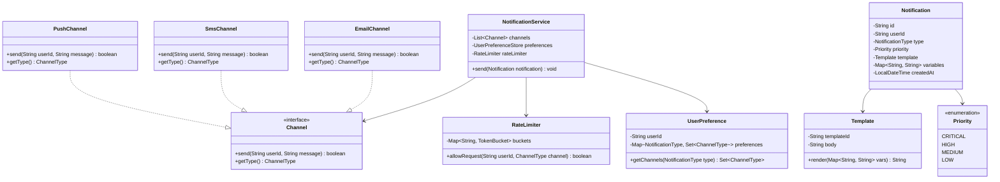

# Design a Notification Service

!!! tip "Interview Context"
    **Asked at:** Meta, Amazon, Uber, Netflix | **Level:** L4-L6 | **Time:** 45 minutes | **Type:** LLD/OOP Design

---

## Requirements

### Functional

- Send notifications via multiple channels: Email, SMS, Push
- Users configure channel preferences (opt-in/opt-out per type)
- Template-based messages with variable substitution
- Priority levels: critical (immediate), high, medium, low (batched)
- Rate limiting per user per channel (e.g., max 3 SMS/hour)
- Notification history and read/unread status

### Non-Functional

- At-least-once delivery guarantee
- Rate limiting prevents user fatigue
- Channel failures should not block other channels
- Extensible to new channels (Slack, WhatsApp) without core changes

---

## Class Diagram



---

## Key Design Decisions

| Decision | Choice | Why |
|---|---|---|
| Multi-channel dispatch | Strategy Pattern | Each channel has its own send logic |
| Template rendering | Template Method | Common render logic, channel-specific formatting |
| Rate limiting | Token Bucket per user-channel | Simple, allows bursts, configurable rate |
| User preferences | Preference store lookup | Respects opt-outs before sending |
| Notification building | Builder Pattern | Many optional fields (priority, template, vars) |

---

## Java Implementation

=== "Core Models & Builder"

    ```java
    public enum ChannelType { EMAIL, SMS, PUSH }
    public enum Priority { CRITICAL, HIGH, MEDIUM, LOW }
    public enum NotificationType { ORDER_UPDATE, PROMOTION, SECURITY_ALERT, SOCIAL }

    public class Notification {
        private final String id;
        private final String userId;
        private final NotificationType type;
        private final Priority priority;
        private final Template template;
        private final Map<String, String> variables;

        private Notification(Builder builder) {
            this.id = UUID.randomUUID().toString();
            this.userId = builder.userId;
            this.type = builder.type;
            this.priority = builder.priority;
            this.template = builder.template;
            this.variables = Map.copyOf(builder.variables);
        }

        public String renderMessage() { return template.render(variables); }

        public static class Builder {
            private String userId;
            private NotificationType type;
            private Priority priority = Priority.MEDIUM;
            private Template template;
            private Map<String, String> variables = new HashMap<>();

            public Builder userId(String id) { this.userId = id; return this; }
            public Builder type(NotificationType t) { this.type = t; return this; }
            public Builder priority(Priority p) { this.priority = p; return this; }
            public Builder template(Template t) { this.template = t; return this; }
            public Builder variable(String key, String val) { variables.put(key, val); return this; }
            public Notification build() { return new Notification(this); }
        }
    }

    public class Template {
        private final String templateId;
        private final String body; // "Hello {{name}}, your order {{orderId}} is {{status}}"

        public String render(Map<String, String> variables) {
            String result = body;
            for (var entry : variables.entrySet()) {
                result = result.replace("{{" + entry.getKey() + "}}", entry.getValue());
            }
            return result;
        }
    }
    ```

=== "Channel & Service"

    ```java
    public interface Channel {
        boolean send(String userId, String renderedMessage);
        ChannelType getType();
    }

    public class EmailChannel implements Channel {
        private final EmailClient emailClient;

        @Override
        public boolean send(String userId, String message) {
            String email = lookupEmail(userId);
            return emailClient.send(email, "Notification", message);
        }

        @Override
        public ChannelType getType() { return ChannelType.EMAIL; }
    }

    public class NotificationService {
        private final Map<ChannelType, Channel> channels;
        private final UserPreferenceStore preferenceStore;
        private final RateLimiter rateLimiter;

        public void send(Notification notification) {
            String userId = notification.getUserId();
            Set<ChannelType> userChannels = preferenceStore
                .getPreference(userId)
                .getChannels(notification.getType());

            String message = notification.renderMessage();

            for (ChannelType channelType : userChannels) {
                // Skip if rate limited (unless CRITICAL)
                if (notification.getPriority() != Priority.CRITICAL
                        && !rateLimiter.allowRequest(userId, channelType)) {
                    continue;
                }

                Channel channel = channels.get(channelType);
                if (channel != null) {
                    // Fire-and-forget per channel — one failure doesn't block others
                    CompletableFuture.runAsync(() -> channel.send(userId, message));
                }
            }
        }
    }
    ```

=== "Rate Limiter (Token Bucket)"

    ```java
    public class RateLimiter {
        private final Map<String, TokenBucket> buckets = new ConcurrentHashMap<>();
        private final int maxTokens;
        private final Duration refillInterval;

        public RateLimiter(int maxTokens, Duration refillInterval) {
            this.maxTokens = maxTokens;
            this.refillInterval = refillInterval;
        }

        public boolean allowRequest(String userId, ChannelType channel) {
            String key = userId + ":" + channel.name();
            TokenBucket bucket = buckets.computeIfAbsent(key,
                k -> new TokenBucket(maxTokens, refillInterval));
            return bucket.tryConsume();
        }
    }

    public class TokenBucket {
        private final int maxTokens;
        private final Duration refillInterval;
        private int tokens;
        private Instant lastRefill;

        public TokenBucket(int maxTokens, Duration refillInterval) {
            this.maxTokens = maxTokens;
            this.refillInterval = refillInterval;
            this.tokens = maxTokens;
            this.lastRefill = Instant.now();
        }

        public synchronized boolean tryConsume() {
            refill();
            if (tokens > 0) { tokens--; return true; }
            return false;
        }

        private void refill() {
            Instant now = Instant.now();
            long elapsed = Duration.between(lastRefill, now).toMillis();
            long intervalsElapsed = elapsed / refillInterval.toMillis();
            if (intervalsElapsed > 0) {
                tokens = (int) Math.min(maxTokens, tokens + intervalsElapsed);
                lastRefill = now;
            }
        }
    }
    ```

---

## SOLID Principles Applied

| Principle | How Applied |
|---|---|
| **S** — Single Responsibility | `Channel` sends messages; `RateLimiter` controls rate; `Template` renders text |
| **O** — Open/Closed | New channels (Slack, WhatsApp) added by implementing `Channel` interface |
| **L** — Liskov Substitution | Any `Channel` impl works in the dispatch loop |
| **I** — Interface Segregation | `Channel` has one method; rate limiter is separate from delivery |
| **D** — Dependency Inversion | `NotificationService` depends on `Channel` interface, not concrete Email/SMS classes |

---

## Interview Walkthrough (45 minutes)

| Time | What to Do |
|---|---|
| 0-5 min | Clarify: channels supported, priority levels, rate limits, delivery guarantees |
| 5-15 min | Draw class diagram — Notification (Builder), Channel, RateLimiter, UserPreference |
| 15-25 min | Explain: channel dispatch, rate limiting (token bucket), preference filtering |
| 25-35 min | Code: Notification.Builder, NotificationService.send(), TokenBucket |
| 35-45 min | Discuss: retry with backoff, dead letter queue, batch delivery for LOW priority |
