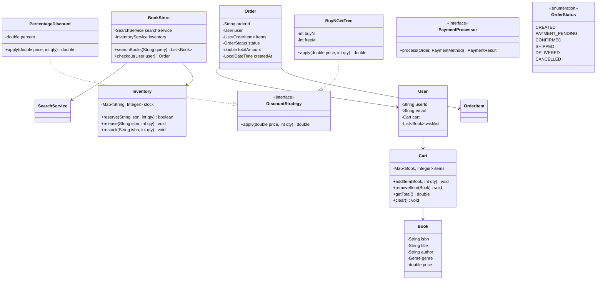

# Design an Online Bookstore

!!! tip "Interview Context"
    **Asked at:** Amazon, Flipkart, Walmart | **Level:** L4-L6 | **Time:** 45 minutes | **Type:** LLD/OOP Design

---

## Requirements

### Functional

- Users can search books by title, author, genre, ISBN
- Add/remove books from shopping cart with quantity management
- Checkout flow: cart → order → payment → confirmation
- Inventory tracking — prevent overselling
- Price alerts: notify users when wishlisted book price drops
- Apply discount strategies (percentage, flat, buy-2-get-1)

### Non-Functional

- Handle concurrent purchases of same book (inventory race condition)
- Cart persists across sessions
- Payment failures should not corrupt order state
- Search results in < 200ms

---

## Class Diagram



---

## Key Design Decisions

| Decision | Choice | Why |
|---|---|---|
| Search | Repository + Service layer | Separates data access from business logic |
| Discounts | Strategy Pattern | Flat, percentage, seasonal — swappable |
| Inventory | Reserve-then-confirm | Prevents overselling during payment |
| Price alerts | Observer Pattern | Users subscribe to book price changes |
| Cart persistence | User-owned entity | Survives sessions, simplifies checkout |

---

## Java Implementation

=== "Cart & Inventory"

    ```java
    public class Cart {
        private final Map<Book, Integer> items = new LinkedHashMap<>();

        public void addItem(Book book, int quantity) {
            items.merge(book, quantity, Integer::sum);
        }

        public void removeItem(Book book) {
            items.remove(book);
        }

        public double getTotal(DiscountStrategy discount) {
            return items.entrySet().stream()
                .mapToDouble(e -> discount.apply(e.getKey().getPrice(), e.getValue()))
                .sum();
        }

        public void clear() { items.clear(); }
        public Map<Book, Integer> getItems() { return Collections.unmodifiableMap(items); }
    }

    public class Inventory {
        private final ConcurrentHashMap<String, AtomicInteger> stock = new ConcurrentHashMap<>();

        public boolean reserve(String isbn, int quantity) {
            AtomicInteger available = stock.get(isbn);
            if (available == null) return false;
            // CAS loop to atomically decrement
            int current;
            do {
                current = available.get();
                if (current < quantity) return false;
            } while (!available.compareAndSet(current, current - quantity));
            return true;
        }

        public void release(String isbn, int quantity) {
            stock.computeIfAbsent(isbn, k -> new AtomicInteger(0)).addAndGet(quantity);
        }

        public void restock(String isbn, int quantity) {
            stock.computeIfAbsent(isbn, k -> new AtomicInteger(0)).addAndGet(quantity);
        }
    }
    ```

=== "Checkout Flow"

    ```java
    public class CheckoutService {
        private final Inventory inventory;
        private final PaymentProcessor paymentProcessor;
        private final DiscountStrategy discountStrategy;

        public Order checkout(User user, PaymentMethod paymentMethod) {
            Cart cart = user.getCart();
            if (cart.getItems().isEmpty()) throw new EmptyCartException();

            // Step 1: Reserve inventory for all items
            List<ReservedItem> reserved = new ArrayList<>();
            try {
                for (var entry : cart.getItems().entrySet()) {
                    boolean success = inventory.reserve(entry.getKey().getIsbn(), entry.getValue());
                    if (!success) throw new OutOfStockException(entry.getKey());
                    reserved.add(new ReservedItem(entry.getKey().getIsbn(), entry.getValue()));
                }

                // Step 2: Create order
                Order order = Order.from(user, cart, discountStrategy);

                // Step 3: Process payment
                PaymentResult result = paymentProcessor.process(order, paymentMethod);
                if (!result.isSuccess()) {
                    releaseAll(reserved);
                    throw new PaymentFailedException(result.getReason());
                }

                // Step 4: Confirm order, clear cart
                order.setStatus(OrderStatus.CONFIRMED);
                cart.clear();
                return order;
            } catch (OutOfStockException e) {
                releaseAll(reserved);
                throw e;
            }
        }

        private void releaseAll(List<ReservedItem> reserved) {
            reserved.forEach(r -> inventory.release(r.isbn(), r.quantity()));
        }
    }
    ```

=== "Discount Strategy"

    ```java
    public interface DiscountStrategy {
        double apply(double unitPrice, int quantity);
    }

    public class PercentageDiscount implements DiscountStrategy {
        private final double percent; // 0.1 = 10% off

        public PercentageDiscount(double percent) { this.percent = percent; }

        @Override
        public double apply(double unitPrice, int quantity) {
            return unitPrice * quantity * (1 - percent);
        }
    }

    public class BuyNGetFreeStrategy implements DiscountStrategy {
        private final int buyN;
        private final int freeM;

        public BuyNGetFreeStrategy(int buyN, int freeM) {
            this.buyN = buyN;
            this.freeM = freeM;
        }

        @Override
        public double apply(double unitPrice, int quantity) {
            int groups = quantity / (buyN + freeM);
            int remainder = quantity % (buyN + freeM);
            int chargeableInRemainder = Math.min(remainder, buyN);
            int totalChargeable = groups * buyN + chargeableInRemainder;
            return unitPrice * totalChargeable;
        }
    }

    // No discount — null object pattern
    public class NoDiscount implements DiscountStrategy {
        @Override
        public double apply(double unitPrice, int quantity) {
            return unitPrice * quantity;
        }
    }
    ```

---

## SOLID Principles Applied

| Principle | How Applied |
|---|---|
| **S** — Single Responsibility | `Cart` manages items; `Inventory` manages stock; `CheckoutService` orchestrates flow |
| **O** — Open/Closed | New discount types added without modifying checkout logic |
| **L** — Liskov Substitution | Any `DiscountStrategy` impl works transparently |
| **I** — Interface Segregation | `PaymentProcessor` and `DiscountStrategy` are minimal interfaces |
| **D** — Dependency Inversion | `CheckoutService` depends on interfaces, not concrete payment/discount impls |

---

## Interview Walkthrough (45 minutes)

| Time | What to Do |
|---|---|
| 0-5 min | Clarify: book types, user auth scope, payment providers, discount rules |
| 5-15 min | Draw class diagram — Book, Cart, Order, Inventory, DiscountStrategy |
| 15-25 min | Explain checkout flow: reserve → pay → confirm (compensating on failure) |
| 25-35 min | Code: Cart, Inventory (CAS), CheckoutService |
| 35-45 min | Discuss: race conditions, payment timeout, wishlists/price alerts, search indexing |
