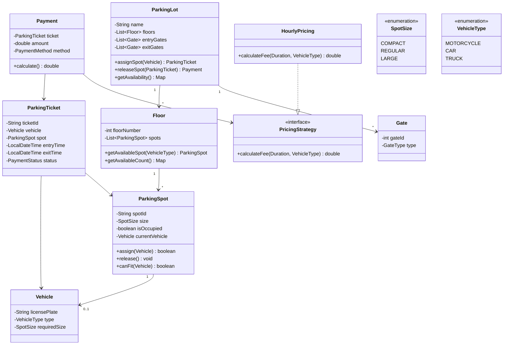

# Design a Parking Lot System

!!! tip "Interview Context"
    **Asked at:** Amazon, Google, Microsoft, Walmart, Uber | **Level:** L4-L6 | **Time:** 45 minutes | **Type:** LLD/OOP Design

---

## Requirements

### Functional

- Multiple floors, each with parking spots of different sizes (compact, regular, large)
- Support vehicle types: motorcycle, car, truck/bus
- Assign nearest available spot matching vehicle size
- Track entry/exit times and calculate fees
- Display real-time availability per floor
- Support multiple entry/exit gates

### Non-Functional

- Handle concurrent entry at multiple gates (no double-assignment)
- Low latency for spot assignment (< 100ms)
- Accurate billing (no missed charges)

---

## Class Diagram



---

## Key Design Decisions

| Decision | Choice | Why |
|---|---|---|
| Spot assignment | Strategy Pattern | Different algorithms (nearest, floor-preference) swappable |
| Pricing | Strategy Pattern | Hourly, flat-rate, dynamic pricing swappable |
| Concurrency | Optimistic locking | Multiple gates assigning simultaneously |
| Availability display | Observer Pattern | Gates/displays subscribe to spot state changes |
| Vehicle-to-spot mapping | Enum-based sizing | Simple, extensible |

---

## Java Implementation

=== "Core Models"

    ```java
    public enum SpotSize { COMPACT, REGULAR, LARGE }
    public enum VehicleType { MOTORCYCLE, CAR, TRUCK }

    public class Vehicle {
        private final String licensePlate;
        private final VehicleType type;

        public SpotSize getRequiredSize() {
            return switch (type) {
                case MOTORCYCLE -> SpotSize.COMPACT;
                case CAR -> SpotSize.REGULAR;
                case TRUCK -> SpotSize.LARGE;
            };
        }
    }

    public class ParkingSpot {
        private final String spotId;
        private final int floor;
        private final SpotSize size;
        private volatile boolean occupied;
        private Vehicle currentVehicle;
        private int version; // for optimistic locking

        public synchronized boolean assign(Vehicle vehicle) {
            if (occupied || !canFit(vehicle)) return false;
            this.occupied = true;
            this.currentVehicle = vehicle;
            this.version++;
            return true;
        }

        public synchronized void release() {
            this.occupied = false;
            this.currentVehicle = null;
            this.version++;
        }

        public boolean canFit(Vehicle vehicle) {
            return vehicle.getRequiredSize().ordinal() <= this.size.ordinal();
        }
    }
    ```

=== "Parking Lot Service"

    ```java
    public class ParkingLotService {
        private final List<Floor> floors;
        private final PricingStrategy pricingStrategy;
        private final Map<String, ParkingTicket> activeTickets = new ConcurrentHashMap<>();

        public ParkingTicket entry(Vehicle vehicle) {
            ParkingSpot spot = findAndAssignSpot(vehicle);
            if (spot == null) throw new ParkingFullException("No spots available");

            ParkingTicket ticket = new ParkingTicket(
                UUID.randomUUID().toString(), vehicle, spot, LocalDateTime.now()
            );
            activeTickets.put(ticket.getTicketId(), ticket);
            notifyDisplays(); // Observer pattern
            return ticket;
        }

        public Payment exit(String ticketId) {
            ParkingTicket ticket = activeTickets.remove(ticketId);
            if (ticket == null) throw new InvalidTicketException(ticketId);

            ticket.setExitTime(LocalDateTime.now());
            Duration parked = Duration.between(ticket.getEntryTime(), ticket.getExitTime());
            double fee = pricingStrategy.calculateFee(parked, ticket.getVehicle().getType());

            ticket.getSpot().release();
            notifyDisplays();
            return new Payment(ticket, fee);
        }

        private ParkingSpot findAndAssignSpot(Vehicle vehicle) {
            // Nearest spot: iterate floors bottom-up, spots left-to-right
            for (Floor floor : floors) {
                ParkingSpot spot = floor.getAvailableSpot(vehicle.getType());
                if (spot != null && spot.assign(vehicle)) {
                    return spot;
                }
            }
            return null;
        }
    }
    ```

=== "Pricing Strategy"

    ```java
    public interface PricingStrategy {
        double calculateFee(Duration duration, VehicleType type);
    }

    public class HourlyPricingStrategy implements PricingStrategy {
        private static final Map<VehicleType, Double> HOURLY_RATES = Map.of(
            VehicleType.MOTORCYCLE, 1.0,
            VehicleType.CAR, 2.0,
            VehicleType.TRUCK, 4.0
        );

        @Override
        public double calculateFee(Duration duration, VehicleType type) {
            long hours = Math.max(1, (long) Math.ceil(duration.toMinutes() / 60.0));
            return hours * HOURLY_RATES.get(type);
        }
    }

    // Easy to swap: FlatRatePricing, DynamicSurgePricing, WeekendPricing
    public class DynamicPricingStrategy implements PricingStrategy {
        @Override
        public double calculateFee(Duration duration, VehicleType type) {
            double baseRate = HourlyPricingStrategy.HOURLY_RATES.get(type);
            double occupancy = getCurrentOccupancyRatio();
            double multiplier = occupancy > 0.8 ? 1.5 : 1.0; // surge pricing
            long hours = Math.max(1, (long) Math.ceil(duration.toMinutes() / 60.0));
            return hours * baseRate * multiplier;
        }
    }
    ```

=== "Concurrency Handling"

    ```java
    // Problem: Two gates try to assign the same spot simultaneously
    // Solution: Optimistic locking with retry

    public class Floor {
        private final List<ParkingSpot> spots;
        private final ReentrantLock assignLock = new ReentrantLock();

        public ParkingSpot getAvailableSpot(VehicleType vehicleType) {
            // Lock-free read: find candidates
            List<ParkingSpot> candidates = spots.stream()
                .filter(s -> !s.isOccupied() && s.canFit(vehicleType))
                .sorted(Comparator.comparing(ParkingSpot::getSpotId))
                .toList();

            // Try to assign with optimistic lock
            for (ParkingSpot spot : candidates) {
                if (spot.assign(vehicleType)) { // synchronized internally
                    return spot;
                }
                // If assign fails, another gate took it — try next candidate
            }
            return null; // Floor full for this vehicle type
        }
    }
    ```

---

## SOLID Principles Applied

| Principle | How Applied |
|---|---|
| **S** — Single Responsibility | `ParkingSpot` manages spot state only; `PricingStrategy` handles pricing only; `ParkingLotService` orchestrates |
| **O** — Open/Closed | New pricing strategies without modifying existing code (Strategy pattern) |
| **L** — Liskov Substitution | Any `PricingStrategy` impl works without caller changes |
| **I** — Interface Segregation | `PricingStrategy` has one method; `DisplayObserver` has one method |
| **D** — Dependency Inversion | `ParkingLotService` depends on `PricingStrategy` interface, not concrete class |

---

## Scaling Considerations (If Interviewer Asks)

| "What if..." | Answer |
|---|---|
| Multiple parking lots (chain) | Central service coordinates, per-lot local state |
| 10,000 spots | In-memory is fine (10K objects ≈ 1MB). No need for distributed DB |
| Real-time display | Observer pattern → push updates to LED signs via WebSocket |
| License plate recognition | Entry gate camera → OCR → auto-lookup vehicle |
| Reservation system | Add `RESERVED` state to `ParkingSpot`, timeout after 15 min |

---

## Common Interview Mistakes

| Mistake | Why It's Wrong |
|---|---|
| Over-engineering with Kafka/microservices | A single parking lot is NOT a distributed system |
| No concurrency handling | Two cars at two gates WILL race for the same spot |
| Hardcoding pricing | Violates Open/Closed — what about weekends, holidays, surge? |
| No vehicle-to-spot size mapping | A motorcycle shouldn't take a truck spot |
| Forgetting the exit flow | Billing logic is half the design |

---

## Interview Walkthrough (45 minutes)

| Time | What to Do |
|---|---|
| 0-5 min | Clarify: # floors, spot types, vehicle types, gates, pricing model |
| 5-15 min | Draw class diagram (entities + relationships) |
| 15-25 min | Core algorithms: spot assignment, concurrency, pricing |
| 25-35 min | Code: ParkingSpot, ParkingLotService, PricingStrategy |
| 35-45 min | Discuss: edge cases, SOLID, extensibility |
