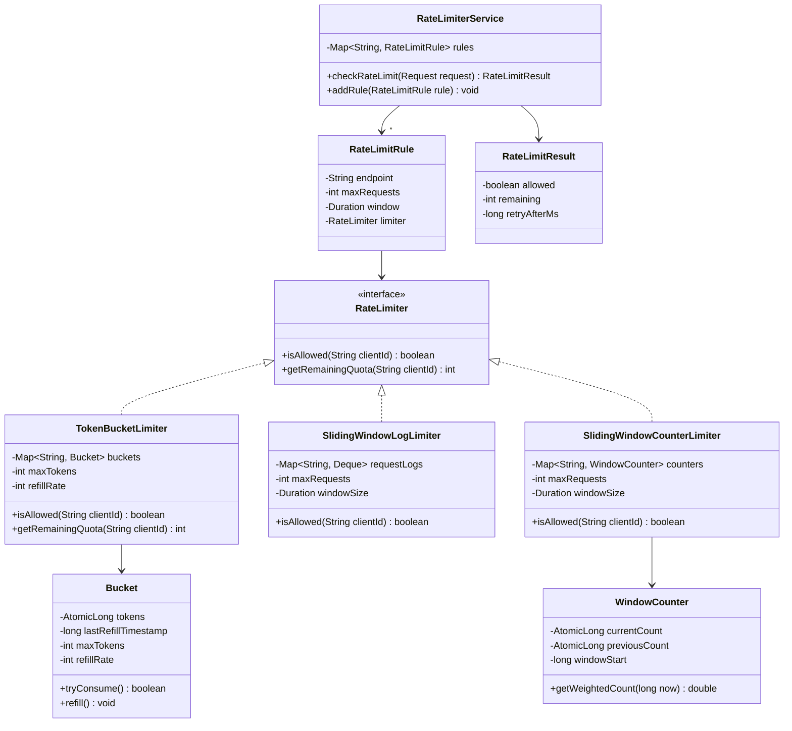

# Design a Rate Limiter

!!! tip "Interview Context"
    **Asked at:** Stripe, Amazon, Google, Cloudflare | **Level:** L4-L6 | **Time:** 45 minutes | **Type:** LLD/OOP Design | **Difficulty:** Medium

---

## Requirements

### Functional

- Limit number of requests per client (by user ID, IP, or API key)
- Support multiple rate-limiting algorithms (Token Bucket, Sliding Window, etc.)
- Configure different limits per endpoint (e.g., `/login` = 5/min, `/search` = 100/min)
- Return clear rejection response with retry-after header when limit exceeded
- Support burst traffic within configured bounds

### Non-Functional

- Thread-safe: handle concurrent requests without race conditions
- Low latency: decision must complete in < 1ms (on hot path for every request)
- Memory efficient: support millions of clients without OOM
- Accurate: no significant over-allowing or over-throttling

---

## Class Diagram



---

## Key Design Decisions

| Decision | Choice | Why |
|---|---|---|
| Algorithm selection | Strategy Pattern | Swap Token Bucket, Sliding Window, Leaky Bucket without changing client code |
| Per-client state | ConcurrentHashMap | O(1) lookup, thread-safe for concurrent requests |
| Token counting | AtomicLong | Lock-free CAS operations for high throughput |
| Rule configuration | Per-endpoint map | Different APIs have different sensitivity (login vs. search) |
| Time source | System.nanoTime() | Monotonic clock avoids issues with wall-clock adjustments |
| Eviction | Lazy cleanup + scheduled sweep | Don't hold memory for inactive clients forever |

---

## Java Implementation

=== "Core Models / Interfaces"

    ```java
    public interface RateLimiter {
        boolean isAllowed(String clientId);
        int getRemainingQuota(String clientId);
    }

    public record RateLimitRule(
        String endpoint,
        int maxRequests,
        Duration window,
        RateLimiter limiter
    ) {}

    public record RateLimitResult(
        boolean allowed,
        int remaining,
        long retryAfterMs
    ) {}

    public class RateLimiterService {
        private final Map<String, RateLimitRule> rules = new ConcurrentHashMap<>();

        public void addRule(String endpoint, RateLimitRule rule) {
            rules.put(endpoint, rule);
        }

        public RateLimitResult checkRateLimit(String endpoint, String clientId) {
            RateLimitRule rule = rules.get(endpoint);
            if (rule == null) return new RateLimitResult(true, -1, 0);

            boolean allowed = rule.limiter().isAllowed(clientId);
            int remaining = rule.limiter().getRemainingQuota(clientId);
            long retryAfter = allowed ? 0 : rule.window().toMillis();

            return new RateLimitResult(allowed, remaining, retryAfter);
        }
    }
    ```

=== "Token Bucket"

    ```java
    public class TokenBucketLimiter implements RateLimiter {
        private final int maxTokens;
        private final double refillRatePerMs;  // tokens added per millisecond
        private final ConcurrentHashMap<String, Bucket> buckets = new ConcurrentHashMap<>();

        public TokenBucketLimiter(int maxTokens, int refillPerSecond) {
            this.maxTokens = maxTokens;
            this.refillRatePerMs = refillPerSecond / 1000.0;
        }

        @Override
        public boolean isAllowed(String clientId) {
            Bucket bucket = buckets.computeIfAbsent(clientId,
                k -> new Bucket(maxTokens, refillRatePerMs));
            return bucket.tryConsume();
        }

        @Override
        public int getRemainingQuota(String clientId) {
            Bucket bucket = buckets.get(clientId);
            return bucket == null ? maxTokens : bucket.getTokens();
        }
    }

    class Bucket {
        private final int maxTokens;
        private final double refillRatePerMs;
        private double tokens;
        private long lastRefillTime;

        Bucket(int maxTokens, double refillRatePerMs) {
            this.maxTokens = maxTokens;
            this.refillRatePerMs = refillRatePerMs;
            this.tokens = maxTokens;  // start full
            this.lastRefillTime = System.currentTimeMillis();
        }

        synchronized boolean tryConsume() {
            refill();
            if (tokens >= 1.0) {
                tokens -= 1.0;
                return true;
            }
            return false;
        }

        synchronized int getTokens() {
            refill();
            return (int) tokens;
        }

        private void refill() {
            long now = System.currentTimeMillis();
            long elapsed = now - lastRefillTime;
            if (elapsed > 0) {
                tokens = Math.min(maxTokens, tokens + elapsed * refillRatePerMs);
                lastRefillTime = now;
            }
        }
    }
    // Usage: new TokenBucketLimiter(10, 10) → max 10 tokens, refill 10/sec
    // Allows bursts up to 10 requests, then smooths to 10 req/sec
    ```

=== "Sliding Window Log"

    ```java
    public class SlidingWindowLogLimiter implements RateLimiter {
        private final int maxRequests;
        private final long windowSizeMs;
        private final ConcurrentHashMap<String, Deque<Long>> requestLogs =
            new ConcurrentHashMap<>();

        public SlidingWindowLogLimiter(int maxRequests, Duration windowSize) {
            this.maxRequests = maxRequests;
            this.windowSizeMs = windowSize.toMillis();
        }

        @Override
        public boolean isAllowed(String clientId) {
            long now = System.currentTimeMillis();
            Deque<Long> log = requestLogs.computeIfAbsent(clientId,
                k -> new ConcurrentLinkedDeque<>());

            // Remove expired timestamps
            long cutoff = now - windowSizeMs;
            while (!log.isEmpty() && log.peekFirst() <= cutoff) {
                log.pollFirst();
            }

            if (log.size() < maxRequests) {
                log.addLast(now);
                return true;
            }
            return false;
        }

        @Override
        public int getRemainingQuota(String clientId) {
            Deque<Long> log = requestLogs.get(clientId);
            if (log == null) return maxRequests;
            long cutoff = System.currentTimeMillis() - windowSizeMs;
            long active = log.stream().filter(t -> t > cutoff).count();
            return Math.max(0, maxRequests - (int) active);
        }
    }
    // Precise but memory-heavy: stores every timestamp
    // 1M users × 100 requests = 100M Long objects (~800MB)
    ```

=== "Sliding Window Counter"

    ```java
    public class SlidingWindowCounterLimiter implements RateLimiter {
        private final int maxRequests;
        private final long windowSizeMs;
        private final ConcurrentHashMap<String, WindowCounter> counters =
            new ConcurrentHashMap<>();

        public SlidingWindowCounterLimiter(int maxRequests, Duration windowSize) {
            this.maxRequests = maxRequests;
            this.windowSizeMs = windowSize.toMillis();
        }

        @Override
        public boolean isAllowed(String clientId) {
            WindowCounter counter = counters.computeIfAbsent(clientId,
                k -> new WindowCounter(windowSizeMs));
            return counter.tryIncrement(maxRequests);
        }

        @Override
        public int getRemainingQuota(String clientId) {
            WindowCounter counter = counters.get(clientId);
            if (counter == null) return maxRequests;
            return Math.max(0, maxRequests - (int) counter.getWeightedCount());
        }
    }

    class WindowCounter {
        private final long windowSizeMs;
        private long currentWindowStart;
        private long currentCount;
        private long previousCount;

        WindowCounter(long windowSizeMs) {
            this.windowSizeMs = windowSizeMs;
            this.currentWindowStart = System.currentTimeMillis();
        }

        synchronized boolean tryIncrement(int maxRequests) {
            advanceWindow();
            double weighted = getWeightedCount();
            if (weighted < maxRequests) {
                currentCount++;
                return true;
            }
            return false;
        }

        synchronized double getWeightedCount() {
            advanceWindow();
            long now = System.currentTimeMillis();
            double elapsedRatio = (now - currentWindowStart) / (double) windowSizeMs;
            double previousWeight = 1.0 - elapsedRatio;
            // KEY FORMULA: weighted = prev * (1 - elapsed%) + current
            return previousCount * previousWeight + currentCount;
        }

        private void advanceWindow() {
            long now = System.currentTimeMillis();
            long elapsed = now - currentWindowStart;
            if (elapsed >= windowSizeMs) {
                long windowsElapsed = elapsed / windowSizeMs;
                if (windowsElapsed == 1) {
                    previousCount = currentCount;
                } else {
                    previousCount = 0; // more than 1 window passed
                }
                currentCount = 0;
                currentWindowStart += windowsElapsed * windowSizeMs;
            }
        }
    }
    // WHY this approximation works:
    // Assume requests in previous window were uniformly distributed.
    // If window = 60s, we're 20s into current window:
    //   weighted = prevCount * 0.67 + currentCount
    // Error margin is typically < 1% under uniform traffic.
    // Memory: 2 longs per client vs. N timestamps per client.
    ```

---

## Algorithm Comparison

| Aspect | Token Bucket | Leaky Bucket | Fixed Window | Sliding Window Log | Sliding Window Counter |
|---|---|---|---|---|---|
| **Concept** | Fill tokens at fixed rate; consume 1 per request | Queue requests; process at fixed rate | Count requests in fixed time intervals | Track exact timestamp of each request | Weighted count across current + previous window |
| **Burst handling** | Allows bursts up to bucket capacity | No bursts — strictly smooth output | Allows 2x burst at window boundary | No boundary issues — precise | Minimal boundary error (~1%) |
| **Memory per client** | 2 fields (tokens + timestamp) | Queue of pending requests | 1 counter + window start | List of all timestamps in window | 2 counters + window start |
| **Memory at scale** (1M users) | ~16MB | Unbounded (queue depth) | ~12MB | **800MB+** (100 req/user) | ~20MB |
| **Accuracy** | Approximate (refill timing) | Exact output rate | Boundary problem: 2x spike | Exact | ~99% accurate (uniform assumption) |
| **Time complexity** | O(1) | O(1) dequeue | O(1) | O(N) cleanup per check | O(1) |
| **Best for** | APIs with burst tolerance (Stripe, AWS) | Smoothing traffic (network queues) | Simple use cases, acceptable boundary spikes | Audit-critical systems, small scale | **Production rate limiters** (best tradeoff) |
| **Boundary problem?** | No | No | YES: 100 req at 0:59 + 100 at 1:01 = 200 in 2s | No | Negligible |
| **Used by** | AWS, Stripe, NGINX | Network traffic shaping | Simple counters | Small-scale APIs | Cloudflare, Redis-based limiters |

!!! warning "The Fixed Window Boundary Problem"
    With a limit of 100 req/min: a client sends 100 requests at **0:59** and 100 more at **1:01**. Both pass because they fall in different windows — but that is **200 requests in 2 seconds**. This is why production systems use sliding window or token bucket.

!!! info "Why Sliding Window Counter Wins in Interviews"
    It combines O(1) time, O(1) space per client, and ~99% accuracy. The weighted formula `prev * (1 - elapsed%) + current` is simple to explain and implement. Interviewers love hearing you derive the math.

---

## SOLID Principles Applied

| Principle | How Applied |
|---|---|
| **S** — Single Responsibility | `Bucket` manages token state; `RateLimiterService` orchestrates rules; `RateLimitRule` holds config |
| **O** — Open/Closed | Add new algorithms (Leaky Bucket, Adaptive) by implementing `RateLimiter` interface — no existing code changes |
| **L** — Liskov Substitution | Any `RateLimiter` implementation is interchangeable — `TokenBucketLimiter` and `SlidingWindowCounterLimiter` are both valid |
| **I** — Interface Segregation | `RateLimiter` has only 2 methods: `isAllowed()` and `getRemainingQuota()` — no fat interface |
| **D** — Dependency Inversion | `RateLimiterService` depends on `RateLimiter` interface, not on any specific algorithm implementation |

---

## Scaling Considerations (If Interviewer Asks)

| "What if..." | Answer |
|---|---|
| Distributed system (multiple servers) | Use Redis with Lua scripts for atomic check-and-increment; or centralized rate-limit service |
| Millions of unique clients | Sliding Window Counter uses ~20 bytes/client; 10M clients = 200MB — fits in memory. Evict inactive entries via TTL |
| Client spoofing IPs | Layer rate limiting: per-IP + per-user + per-API-key. Use fingerprinting for anonymous abuse |
| Different limits per user tier | Map user tier to `RateLimitRule`; premium users get higher limits |
| Graceful degradation | Return `Retry-After` header; use `429 Too Many Requests`; optionally queue instead of reject |
| Global vs. per-node limiting | Per-node is simpler (no network hop); global requires coordination but is more accurate with sticky sessions |
| Redis failure | Fall back to local in-memory rate limiter; accept slight over-allowing during failover |

---

## Common Interview Mistakes

| Mistake | Why It's Wrong |
|---|---|
| Only implementing Token Bucket | Shows no awareness of tradeoffs — always discuss at least 2 algorithms |
| Ignoring thread safety | Rate limiters sit on the hot path — concurrent requests WILL race |
| Using `synchronized` on the entire map | Locks all clients when only one client's counter needs updating — use per-key locking |
| Not explaining the math for Sliding Window | The weighted formula is the core insight — interviewers want to hear you derive it |
| Choosing Fixed Window without discussing boundary problem | Shows incomplete understanding of rate limiting fundamentals |
| Over-engineering with message queues | A rate limiter is a fast in-memory check, not an async pipeline |
| Forgetting about memory cleanup | Without eviction, the client map grows unbounded over time |

---

## Interview Walkthrough (45 minutes)

| Time | What to Do |
|---|---|
| 0-5 min | Clarify: what entity to limit (user/IP/API key)? per-endpoint rules? distributed or single-node? burst tolerance? |
| 5-10 min | Discuss algorithm tradeoffs — recommend Sliding Window Counter, explain why |
| 10-20 min | Draw class diagram: `RateLimiter` interface, concrete algorithms, `RateLimiterService`, `RateLimitRule` |
| 20-35 min | Code: implement Token Bucket + Sliding Window Counter with thread safety |
| 35-40 min | Walk through the Sliding Window math: `prev * (1 - elapsed%) + current` |
| 40-45 min | Discuss: scaling to distributed, Redis Lua scripts, memory management, SOLID principles |
