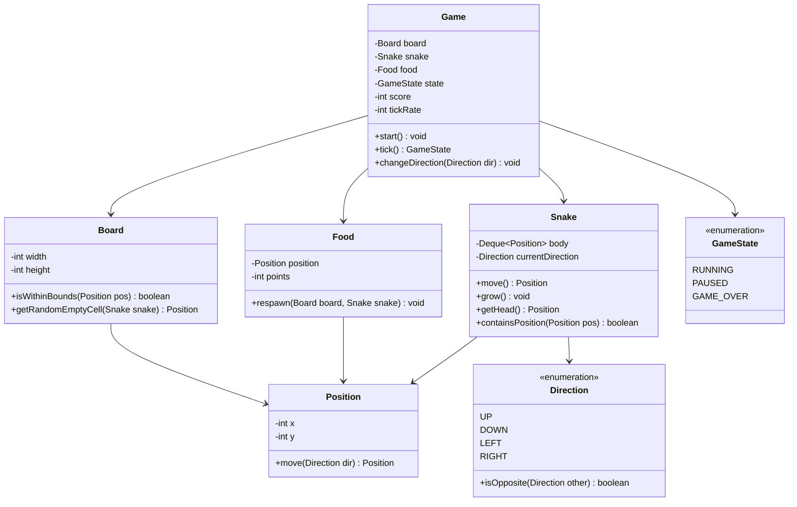

# Design the Snake Game

!!! tip "Interview Context"
    **Asked at:** Google, Amazon, Apple | **Level:** L4-L6 | **Time:** 45 minutes | **Type:** LLD/OOP Design

---

## Requirements

### Functional

- Snake moves continuously in current direction on a grid board
- Player changes direction via keyboard input (up/down/left/right)
- Snake grows by one unit when it eats food
- Game ends when snake hits wall or its own body
- Food spawns randomly on unoccupied cells
- Score increases with each food eaten

### Non-Functional

- Smooth movement at configurable tick rate
- O(1) collision detection for self-hit
- No food spawns on snake body
- Game state easily serializable (for replay/save)

---

## Class Diagram



---

## Key Design Decisions

| Decision | Choice | Why |
|---|---|---|
| Snake body | Deque (LinkedList) | O(1) add head, O(1) remove tail for movement |
| Self-collision check | HashSet of positions | O(1) lookup instead of O(n) list scan |
| Direction change | Ignore opposite | Prevents instant self-collision (can't reverse) |
| Food placement | Random with rejection | Simple; board is sparse enough for fast retry |
| Game loop | Tick-based | Decouples rendering from logic; testable |

---

## Java Implementation

=== "Core Models"

    ```java
    public enum Direction {
        UP(0, -1), DOWN(0, 1), LEFT(-1, 0), RIGHT(1, 0);

        private final int dx, dy;
        Direction(int dx, int dy) { this.dx = dx; this.dy = dy; }

        public boolean isOpposite(Direction other) {
            return this.dx + other.dx == 0 && this.dy + other.dy == 0;
        }
        public int getDx() { return dx; }
        public int getDy() { return dy; }
    }

    public enum GameState { RUNNING, PAUSED, GAME_OVER }

    public record Position(int x, int y) {
        public Position move(Direction dir) {
            return new Position(x + dir.getDx(), y + dir.getDy());
        }
    }

    public class Snake {
        private final Deque<Position> body = new ArrayDeque<>();
        private final Set<Position> bodySet = new HashSet<>(); // O(1) collision
        private Direction currentDirection;
        private boolean shouldGrow = false;

        public Snake(Position start) {
            body.addFirst(start);
            bodySet.add(start);
            currentDirection = Direction.RIGHT;
        }

        public void setDirection(Direction dir) {
            // Prevent 180-degree reversal
            if (!dir.isOpposite(currentDirection)) {
                this.currentDirection = dir;
            }
        }

        public Position move() {
            Position newHead = body.peekFirst().move(currentDirection);
            body.addFirst(newHead);
            bodySet.add(newHead);

            if (shouldGrow) {
                shouldGrow = false; // tail stays — snake grows
            } else {
                Position tail = body.removeLast();
                bodySet.remove(tail);
            }
            return newHead;
        }

        public void grow() { shouldGrow = true; }
        public Position getHead() { return body.peekFirst(); }
        public boolean containsPosition(Position pos) { return bodySet.contains(pos); }
        public int length() { return body.size(); }
    }
    ```

=== "Game Controller"

    ```java
    public class Game {
        private final Board board;
        private final Snake snake;
        private Food food;
        private GameState state;
        private int score;

        public Game(int width, int height) {
            this.board = new Board(width, height);
            Position center = new Position(width / 2, height / 2);
            this.snake = new Snake(center);
            this.food = new Food(board.getRandomEmptyCell(snake));
            this.state = GameState.RUNNING;
            this.score = 0;
        }

        public void changeDirection(Direction dir) {
            if (state == GameState.RUNNING) {
                snake.setDirection(dir);
            }
        }

        // Called every game tick (e.g., 100ms intervals)
        public GameState tick() {
            if (state != GameState.RUNNING) return state;

            Position newHead = snake.move();

            // Check wall collision
            if (!board.isWithinBounds(newHead)) {
                state = GameState.GAME_OVER;
                return state;
            }

            // Check self collision (head is already in bodySet after move)
            // If body contains newHead at more than one position, it's a hit
            if (Collections.frequency(List.copyOf(snake.getBody()), newHead) > 1) {
                state = GameState.GAME_OVER;
                return state;
            }

            // Check food collision
            if (newHead.equals(food.getPosition())) {
                snake.grow();
                score += food.getPoints();
                food = new Food(board.getRandomEmptyCell(snake));
            }

            return state;
        }

        public int getScore() { return score; }
    }

    public class Board {
        private final int width, height;
        private final Random random = new Random();

        public Board(int width, int height) {
            this.width = width;
            this.height = height;
        }

        public boolean isWithinBounds(Position pos) {
            return pos.x() >= 0 && pos.x() < width && pos.y() >= 0 && pos.y() < height;
        }

        public Position getRandomEmptyCell(Snake snake) {
            Position pos;
            do {
                pos = new Position(random.nextInt(width), random.nextInt(height));
            } while (snake.containsPosition(pos));
            return pos;
        }
    }

    public class Food {
        private final Position position;
        private final int points;

        public Food(Position position) {
            this.position = position;
            this.points = 10;
        }

        public Position getPosition() { return position; }
        public int getPoints() { return points; }
    }
    ```

=== "Game Loop (Thread)"

    ```java
    public class GameLoop implements Runnable {
        private final Game game;
        private final int tickRateMs;
        private final Consumer<GameSnapshot> renderer;

        public GameLoop(Game game, int tickRateMs, Consumer<GameSnapshot> renderer) {
            this.game = game;
            this.tickRateMs = tickRateMs;
            this.renderer = renderer;
        }

        @Override
        public void run() {
            while (game.tick() != GameState.GAME_OVER) {
                renderer.accept(game.snapshot());
                try { Thread.sleep(tickRateMs); }
                catch (InterruptedException e) { Thread.currentThread().interrupt(); break; }
            }
            renderer.accept(game.snapshot()); // final frame
        }
    }

    // Snapshot for rendering — immutable view of game state
    public record GameSnapshot(
        List<Position> snakeBody,
        Position food,
        int score,
        GameState state
    ) {}
    ```

---

## SOLID Principles Applied

| Principle | How Applied |
|---|---|
| **S** — Single Responsibility | `Snake` manages body movement; `Board` handles bounds; `Game` orchestrates |
| **O** — Open/Closed | New food types (bonus, poison) extend `Food` without changing `Game` |
| **L** — Liskov Substitution | Any renderer (`Consumer<GameSnapshot>`) works — console, GUI, network |
| **I** — Interface Segregation | `Consumer<GameSnapshot>` is minimal; game logic has no UI dependency |
| **D** — Dependency Inversion | `GameLoop` depends on `Consumer` interface for rendering, not concrete UI |

---

## Interview Walkthrough (45 minutes)

| Time | What to Do |
|---|---|
| 0-5 min | Clarify: board size, wrapping walls vs. death, food types, multiplayer? |
| 5-15 min | Draw class diagram — Snake (Deque), Board, Food, Game, Direction |
| 15-25 min | Explain: Deque for O(1) move, HashSet for O(1) collision, direction reversal guard |
| 25-35 min | Code: Snake.move(), Game.tick(), Board.getRandomEmptyCell() |
| 35-45 min | Discuss: special food types, increasing speed, replay system, multiplayer extension |
