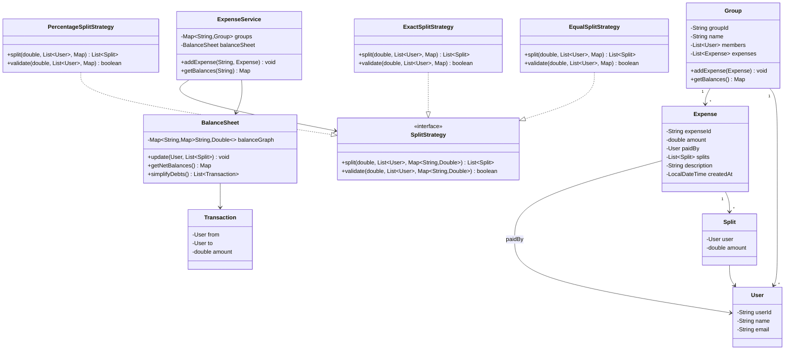
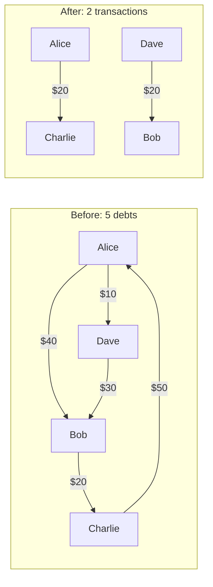

# Design Splitwise (Expense Sharing)

!!! tip "Interview Context"
    **Asked at:** Google, Amazon, Uber, Flipkart | **Level:** L4-L6 | **Time:** 45 minutes | **Type:** LLD/OOP Design | **Difficulty:** Medium-Hard

---

## Requirements

### Functional

- Users can create groups and add members
- Add expenses with multiple participants and a payer
- Support split types: Equal, Exact amount, Percentage
- Track balances between every pair of users
- Simplify debts — minimize the number of transactions needed to settle
- Show per-user balance summary (total owed, total owing)

### Non-Functional

- Accurate to the cent (no rounding drift)
- Handle concurrent expense additions within the same group
- Low latency balance queries (precomputed net balances)
- Extensible to new split types without modifying existing code

---

## Class Diagram



---

## Balance Graph Simplification



**Net calculation:** Alice: -40+50-10 = 0 (net zero after simplification reveals she owes Charlie $20). Bob: +40-20+30 = +50 (owed $50 total). Charlie: +20-50 = -30 (owes $30). Dave: +10-30 = -20 (owes $20). The greedy algorithm settles max creditor with max debtor iteratively, reducing 5 debts to 2 transactions.

---

## Key Design Decisions

| Decision | Choice | Why |
|---|---|---|
| Split calculation | Strategy Pattern | Equal, Exact, Percentage — new types added without modifying core |
| Balance tracking | Adjacency map (graph) | O(1) lookup for any user-pair balance |
| Debt simplification | Greedy algorithm | Minimizes transactions; optimal for interviews |
| Rounding | Assign remainder to first user | Prevents penny-loss drift on equal splits |
| Expense immutability | Immutable after creation | Simplifies concurrency, audit trail |

---

## Java Implementation

=== "Core Models"

    ```java
    public class User {
        private final String userId;
        private final String name;
        private final String email;

        public User(String userId, String name, String email) {
            this.userId = userId;
            this.name = name;
            this.email = email;
        }
        // getters
    }

    public class Split {
        private final User user;
        private final double amount;

        public Split(User user, double amount) {
            this.user = user;
            this.amount = amount;
        }
        // getters
    }

    public class Expense {
        private final String expenseId;
        private final double amount;
        private final User paidBy;
        private final List<Split> splits;
        private final String description;
        private final LocalDateTime createdAt;

        public Expense(String id, double amount, User paidBy,
                       List<Split> splits, String description) {
            this.expenseId = id;
            this.amount = amount;
            this.paidBy = paidBy;
            this.splits = List.copyOf(splits); // immutable
            this.description = description;
            this.createdAt = LocalDateTime.now();
        }
    }

    public class Transaction {
        private final User from;
        private final User to;
        private final double amount;

        public Transaction(User from, User to, double amount) {
            this.from = from;
            this.to = to;
            this.amount = amount;
        }
    }
    ```

=== "Expense Service"

    ```java
    public class ExpenseService {
        private final Map<String, Group> groups = new ConcurrentHashMap<>();
        private final BalanceSheet balanceSheet = new BalanceSheet();
        private final Map<SplitType, SplitStrategy> strategies;

        public ExpenseService() {
            strategies = Map.of(
                SplitType.EQUAL, new EqualSplitStrategy(),
                SplitType.EXACT, new ExactSplitStrategy(),
                SplitType.PERCENTAGE, new PercentageSplitStrategy()
            );
        }

        public void addExpense(String groupId, User paidBy, double amount,
                               SplitType type, List<User> participants,
                               Map<String, Double> params) {
            SplitStrategy strategy = strategies.get(type);
            if (!strategy.validate(amount, participants, params)) {
                throw new IllegalArgumentException("Invalid split parameters");
            }

            List<Split> splits = strategy.split(amount, participants, params);
            Expense expense = new Expense(
                UUID.randomUUID().toString(), amount, paidBy, splits, "Expense"
            );

            groups.get(groupId).addExpense(expense);
            balanceSheet.update(paidBy, splits);
        }

        public Map<String, Double> getUserBalances(String userId) {
            return balanceSheet.getBalancesForUser(userId);
        }

        public List<Transaction> settleUp(String groupId) {
            return balanceSheet.simplifyDebts(
                groups.get(groupId).getMembers()
            );
        }
    }
    ```

=== "Split Strategies"

    ```java
    public enum SplitType { EQUAL, EXACT, PERCENTAGE }

    public interface SplitStrategy {
        List<Split> split(double amount, List<User> participants,
                          Map<String, Double> params);
        boolean validate(double amount, List<User> participants,
                         Map<String, Double> params);
    }

    public class EqualSplitStrategy implements SplitStrategy {
        @Override
        public List<Split> split(double amount, List<User> participants,
                                 Map<String, Double> params) {
            int n = participants.size();
            double each = Math.floor(amount * 100 / n) / 100.0;
            double remainder = amount - (each * n);

            List<Split> splits = new ArrayList<>();
            for (int i = 0; i < n; i++) {
                double share = (i == 0) ? each + remainder : each;
                splits.add(new Split(participants.get(i), share));
            }
            return splits;
        }

        @Override
        public boolean validate(double amount, List<User> participants,
                                Map<String, Double> params) {
            return amount > 0 && participants.size() > 0;
        }
    }

    public class ExactSplitStrategy implements SplitStrategy {
        @Override
        public List<Split> split(double amount, List<User> participants,
                                 Map<String, Double> params) {
            return participants.stream()
                .map(u -> new Split(u, params.get(u.getUserId())))
                .toList();
        }

        @Override
        public boolean validate(double amount, List<User> participants,
                                Map<String, Double> params) {
            double sum = participants.stream()
                .mapToDouble(u -> params.getOrDefault(u.getUserId(), 0.0))
                .sum();
            return Math.abs(sum - amount) < 0.01;
        }
    }

    public class PercentageSplitStrategy implements SplitStrategy {
        @Override
        public List<Split> split(double amount, List<User> participants,
                                 Map<String, Double> params) {
            return participants.stream()
                .map(u -> new Split(u,
                    amount * params.get(u.getUserId()) / 100.0))
                .toList();
        }

        @Override
        public boolean validate(double amount, List<User> participants,
                                Map<String, Double> params) {
            double totalPercent = participants.stream()
                .mapToDouble(u -> params.getOrDefault(u.getUserId(), 0.0))
                .sum();
            return Math.abs(totalPercent - 100.0) < 0.01;
        }
    }
    ```

=== "Balance & Settlement Engine"

    ```java
    public class BalanceSheet {
        // balanceGraph[A][B] > 0 means A owes B that amount
        private final Map<String, Map<String, Double>> balanceGraph =
            new ConcurrentHashMap<>();

        public void update(User paidBy, List<Split> splits) {
            for (Split split : splits) {
                if (split.getUser().equals(paidBy)) continue;

                String payerId = paidBy.getUserId();
                String owerId = split.getUser().getUserId();

                // owerId owes payerId
                addBalance(owerId, payerId, split.getAmount());
                // net off: reduce reverse direction
                addBalance(payerId, owerId, -split.getAmount());
            }
        }

        private synchronized void addBalance(String from, String to, double amount) {
            balanceGraph
                .computeIfAbsent(from, k -> new ConcurrentHashMap<>())
                .merge(to, amount, Double::sum);
        }

        public Map<String, Double> getBalancesForUser(String userId) {
            Map<String, Double> result = new HashMap<>();
            Map<String, Double> owes = balanceGraph.getOrDefault(userId, Map.of());
            owes.forEach((other, amt) -> {
                if (Math.abs(amt) > 0.01) result.put(other, amt);
            });
            return result;
        }

        /**
         * Greedy settlement: minimize number of transactions.
         * 1. Compute net balance for each user
         * 2. Repeatedly settle max creditor with max debtor
         */
        public List<Transaction> simplifyDebts(List<User> members) {
            // Step 1: compute net amounts
            Map<String, Double> netBalance = new HashMap<>();
            Map<String, User> userMap = new HashMap<>();
            for (User u : members) {
                userMap.put(u.getUserId(), u);
                netBalance.put(u.getUserId(), 0.0);
            }

            for (var entry : balanceGraph.entrySet()) {
                String from = entry.getKey();
                for (var inner : entry.getValue().entrySet()) {
                    String to = inner.getKey();
                    double amt = inner.getValue();
                    if (members.stream().anyMatch(m ->
                            m.getUserId().equals(from))) {
                        netBalance.merge(from, -amt, Double::sum);
                        netBalance.merge(to, amt, Double::sum);
                    }
                }
            }

            // Step 2: greedy matching
            List<Transaction> transactions = new ArrayList<>();
            PriorityQueue<Map.Entry<String, Double>> creditors =
                new PriorityQueue<>((a, b) ->
                    Double.compare(b.getValue(), a.getValue()));
            PriorityQueue<Map.Entry<String, Double>> debtors =
                new PriorityQueue<>(Comparator.comparingDouble(
                    Map.Entry::getValue));

            netBalance.forEach((uid, amt) -> {
                if (amt > 0.01) creditors.offer(Map.entry(uid, amt));
                else if (amt < -0.01) debtors.offer(Map.entry(uid, amt));
            });

            while (!creditors.isEmpty() && !debtors.isEmpty()) {
                var creditor = creditors.poll();
                var debtor = debtors.poll();

                double settled = Math.min(
                    creditor.getValue(), -debtor.getValue());
                transactions.add(new Transaction(
                    userMap.get(debtor.getKey()),
                    userMap.get(creditor.getKey()),
                    settled
                ));

                double credRem = creditor.getValue() - settled;
                double debtRem = debtor.getValue() + settled;

                if (credRem > 0.01)
                    creditors.offer(Map.entry(creditor.getKey(), credRem));
                if (debtRem < -0.01)
                    debtors.offer(Map.entry(debtor.getKey(), debtRem));
            }
            return transactions;
        }
    }
    ```

---

## SOLID Principles Applied

| Principle | How Applied |
|---|---|
| **S** — Single Responsibility | `BalanceSheet` handles balances only; `SplitStrategy` handles split math only; `ExpenseService` orchestrates |
| **O** — Open/Closed | New split types (e.g., `ShareBasedSplit`) added by implementing `SplitStrategy` — zero changes to existing code |
| **L** — Liskov Substitution | Any `SplitStrategy` impl substitutes without caller knowing the concrete type |
| **I** — Interface Segregation | `SplitStrategy` has only `split()` + `validate()` — no bloated interface |
| **D** — Dependency Inversion | `ExpenseService` depends on `SplitStrategy` interface, injected via map — not hardcoded |

---

## Scaling Considerations (If Interviewer Asks)

| "What if..." | Answer |
|---|---|
| Millions of users | Shard balance graph by group; each group is independent |
| Real-time notifications | Publish expense events to message queue, push via WebSocket |
| Currency conversion | Add `Currency` field to Expense, convert at settlement time |
| Recurring expenses | Scheduler creates expense copies on cron (decorator around ExpenseService) |
| Audit trail | Event sourcing — store all expense events, recompute balances from log |
| Concurrent edits | Optimistic locking on group version; retry on conflict |

---

## Common Interview Mistakes

| Mistake | Why It's Wrong |
|---|---|
| Not simplifying debts | The entire point of Splitwise — 5 debts between 4 people must reduce to 2 |
| Hardcoding split logic with if/else | Violates OCP — use Strategy pattern for split types |
| Storing only pairwise debts without netting | Leads to circular debts (A owes B, B owes A) — always net off |
| Ignoring rounding on equal splits | $100 / 3 = 33.33 x 3 = 99.99 — one penny vanishes |
| Over-engineering with microservices | This is an in-process OOP design, not a system design question |
| Forgetting validation in split strategies | Exact amounts must sum to total; percentages must sum to 100 |

---

## Interview Walkthrough (45 minutes)

| Time | What to Do |
|---|---|
| 0-5 min | Clarify: split types needed, group support, settlement algorithm expectations |
| 5-12 min | Draw class diagram — User, Group, Expense, Split, SplitStrategy, BalanceSheet |
| 12-20 min | Explain balance graph and simplification algorithm with a 4-person example |
| 20-32 min | Code: SplitStrategy implementations, BalanceSheet with greedy settlement |
| 32-40 min | Walk through an example: 3 expenses, show how balances update, then simplify |
| 40-45 min | Discuss: SOLID adherence, extensibility (new split types), edge cases (rounding) |
