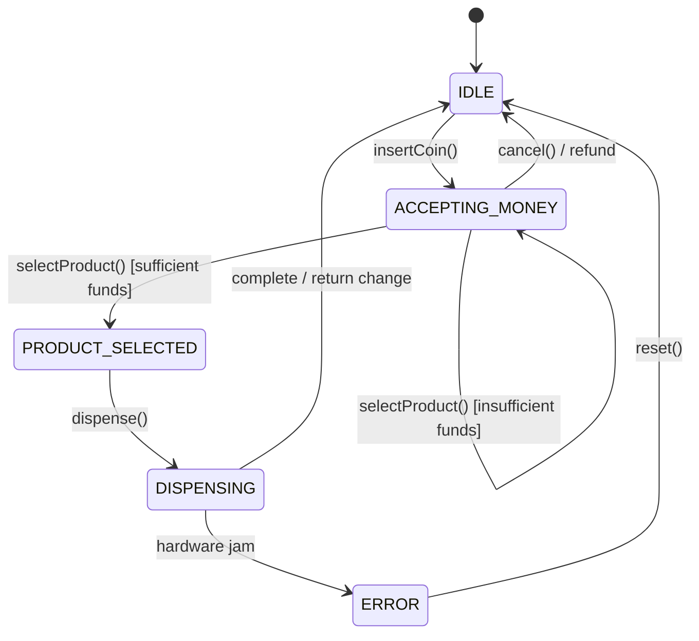
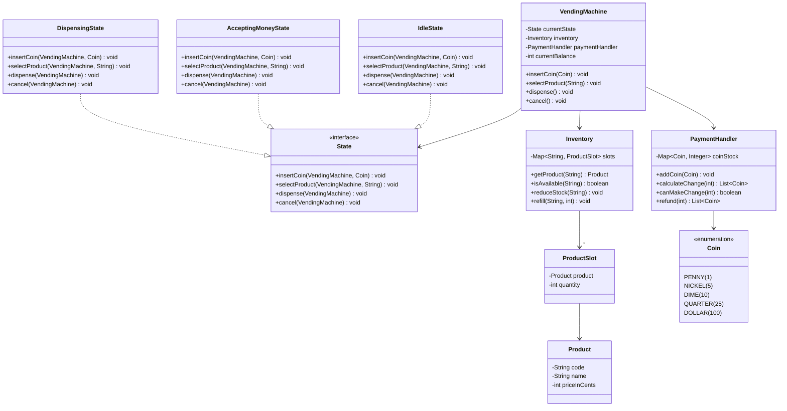

# Design a Vending Machine

!!! tip "Interview Context"
    **Asked at:** Amazon, Google, Microsoft | **Level:** L4-L5 | **Time:** 45 minutes | **Type:** LLD/OOP Design (State Pattern mastery)

---

## Requirements

### Functional

- Accept coins and notes (penny, nickel, dime, quarter, dollar)
- Display available products with prices
- Allow product selection after sufficient payment
- Dispense selected product and return change
- Cancel transaction and refund inserted money at any time
- Admin can refill products and collect cash

### Non-Functional

- Thread-safe for concurrent button presses
- Graceful error handling (out of stock, insufficient funds, cannot make change)
- Extensible for new payment methods (card, NFC)

---

## State Machine Diagram



---

## Class Diagram



---

## Key Design Decisions

| Decision | Choice | Why |
|---|---|---|
| State management | State Pattern | Each state encapsulates its own transition logic — eliminates large if/else blocks |
| Change calculation | Greedy algorithm | Standard approach for standard coin denominations (provably optimal) |
| Coin storage | Map of denomination to count | Tracks available coins for making change |
| Product lookup | Slot code mapping (A1, B2) | Mirrors real vending machine UX |
| Error handling | State-specific exceptions | Invalid actions throw meaningful errors per state |

---

## Java Implementation

=== "Core Models / States"

    ```java
    public enum Coin {
        PENNY(1), NICKEL(5), DIME(10), QUARTER(25), DOLLAR(100);

        private final int valueInCents;
        Coin(int value) { this.valueInCents = value; }
        public int getValue() { return valueInCents; }
    }

    public class Product {
        private final String code;
        private final String name;
        private final int priceInCents;

        public Product(String code, String name, int priceInCents) {
            this.code = code;
            this.name = name;
            this.priceInCents = priceInCents;
        }
        // getters omitted for brevity
    }

    public interface State {
        void insertCoin(VendingMachine machine, Coin coin);
        void selectProduct(VendingMachine machine, String productCode);
        void dispense(VendingMachine machine);
        void cancel(VendingMachine machine);
    }
    ```

=== "Vending Machine (State Pattern)"

    ```java
    public class VendingMachine {
        private State currentState;
        private final Inventory inventory;
        private final PaymentHandler paymentHandler;
        private int currentBalance;  // cents inserted this transaction
        private String selectedProduct;

        // Pre-created state singletons (Flyweight)
        private final State idleState = new IdleState();
        private final State acceptingMoneyState = new AcceptingMoneyState();
        private final State dispensingState = new DispensingState();

        public VendingMachine(Inventory inventory, PaymentHandler paymentHandler) {
            this.inventory = inventory;
            this.paymentHandler = paymentHandler;
            this.currentState = idleState;
        }

        // Delegates to current state — no conditionals here
        public synchronized void insertCoin(Coin coin) {
            currentState.insertCoin(this, coin);
        }

        public synchronized void selectProduct(String code) {
            currentState.selectProduct(this, code);
        }

        public synchronized void dispense() {
            currentState.dispense(this);
        }

        public synchronized void cancel() {
            currentState.cancel(this);
        }

        // --- State transition helpers (package-private) ---
        void setState(State state) { this.currentState = state; }
        void addBalance(int cents) { this.currentBalance += cents; }
        void resetTransaction() {
            this.currentBalance = 0;
            this.selectedProduct = null;
        }

        // Getters for states and fields
        State getIdleState() { return idleState; }
        State getAcceptingMoneyState() { return acceptingMoneyState; }
        State getDispensingState() { return dispensingState; }
        int getCurrentBalance() { return currentBalance; }
        String getSelectedProduct() { return selectedProduct; }
        void setSelectedProduct(String code) { this.selectedProduct = code; }
        Inventory getInventory() { return inventory; }
        PaymentHandler getPaymentHandler() { return paymentHandler; }
    }

    // --- Concrete States ---
    public class IdleState implements State {
        @Override
        public void insertCoin(VendingMachine machine, Coin coin) {
            machine.addBalance(coin.getValue());
            machine.getPaymentHandler().addCoin(coin);
            machine.setState(machine.getAcceptingMoneyState());
        }

        @Override
        public void selectProduct(VendingMachine machine, String code) {
            throw new IllegalStateException("Insert coins first");
        }

        @Override
        public void dispense(VendingMachine machine) {
            throw new IllegalStateException("No product selected");
        }

        @Override
        public void cancel(VendingMachine machine) { /* no-op, nothing to refund */ }
    }

    public class AcceptingMoneyState implements State {
        @Override
        public void insertCoin(VendingMachine machine, Coin coin) {
            machine.addBalance(coin.getValue());
            machine.getPaymentHandler().addCoin(coin);
        }

        @Override
        public void selectProduct(VendingMachine machine, String code) {
            Inventory inv = machine.getInventory();
            if (!inv.isAvailable(code)) {
                throw new OutOfStockException("Product " + code + " is out of stock");
            }
            int price = inv.getProduct(code).getPriceInCents();
            if (machine.getCurrentBalance() < price) {
                int needed = price - machine.getCurrentBalance();
                throw new InsufficientFundsException("Insert " + needed + " more cents");
            }
            int change = machine.getCurrentBalance() - price;
            if (change > 0 && !machine.getPaymentHandler().canMakeChange(change)) {
                throw new CannotMakeChangeException("Cannot make change, try exact amount");
            }
            machine.setSelectedProduct(code);
            machine.setState(machine.getDispensingState());
        }

        @Override
        public void dispense(VendingMachine machine) {
            throw new IllegalStateException("Select a product first");
        }

        @Override
        public void cancel(VendingMachine machine) {
            List<Coin> refund = machine.getPaymentHandler().refund(machine.getCurrentBalance());
            machine.resetTransaction();
            machine.setState(machine.getIdleState());
            // return refund coins to user
        }
    }

    public class DispensingState implements State {
        @Override
        public void insertCoin(VendingMachine machine, Coin coin) {
            throw new IllegalStateException("Dispensing in progress");
        }

        @Override
        public void selectProduct(VendingMachine machine, String code) {
            throw new IllegalStateException("Dispensing in progress");
        }

        @Override
        public void dispense(VendingMachine machine) {
            Inventory inv = machine.getInventory();
            Product product = inv.getProduct(machine.getSelectedProduct());
            int change = machine.getCurrentBalance() - product.getPriceInCents();

            inv.reduceStock(machine.getSelectedProduct());
            List<Coin> changeCoins = machine.getPaymentHandler().calculateChange(change);

            // Physical: dispense product + change coins
            machine.resetTransaction();
            machine.setState(machine.getIdleState());
        }

        @Override
        public void cancel(VendingMachine machine) {
            throw new IllegalStateException("Cannot cancel during dispensing");
        }
    }
    ```

=== "Inventory Management"

    ```java
    public class ProductSlot {
        private final Product product;
        private int quantity;

        public ProductSlot(Product product, int quantity) {
            this.product = product;
            this.quantity = quantity;
        }

        public boolean isAvailable() { return quantity > 0; }
        public void reduceStock() {
            if (quantity <= 0) throw new OutOfStockException("Slot empty");
            quantity--;
        }
        public void refill(int amount) { this.quantity += amount; }
        public Product getProduct() { return product; }
        public int getQuantity() { return quantity; }
    }

    public class Inventory {
        private final Map<String, ProductSlot> slots = new LinkedHashMap<>();

        public void addSlot(String code, Product product, int quantity) {
            slots.put(code, new ProductSlot(product, quantity));
        }

        public boolean isAvailable(String code) {
            ProductSlot slot = slots.get(code);
            return slot != null && slot.isAvailable();
        }

        public Product getProduct(String code) {
            ProductSlot slot = slots.get(code);
            if (slot == null) throw new IllegalArgumentException("Invalid code: " + code);
            return slot.getProduct();
        }

        public void reduceStock(String code) {
            slots.get(code).reduceStock();
        }

        public void refill(String code, int amount) {
            slots.get(code).refill(amount);
        }

        public Map<String, Integer> getStockLevels() {
            return slots.entrySet().stream()
                .collect(Collectors.toMap(Map.Entry::getKey, e -> e.getValue().getQuantity()));
        }
    }
    ```

=== "Payment Handler"

    ```java
    public class PaymentHandler {
        private final Map<Coin, Integer> coinStock = new EnumMap<>(Coin.class);

        public PaymentHandler() {
            for (Coin c : Coin.values()) coinStock.put(c, 0);
        }

        public void addCoin(Coin coin) {
            coinStock.merge(coin, 1, Integer::sum);
        }

        /** Greedy change calculation — works for standard US denominations */
        public List<Coin> calculateChange(int amount) {
            List<Coin> change = new ArrayList<>();
            // Process coins from largest to smallest
            Coin[] denominations = {Coin.DOLLAR, Coin.QUARTER, Coin.DIME, Coin.NICKEL, Coin.PENNY};

            Map<Coin, Integer> tempStock = new EnumMap<>(coinStock);
            for (Coin coin : denominations) {
                while (amount >= coin.getValue() && tempStock.get(coin) > 0) {
                    amount -= coin.getValue();
                    tempStock.merge(coin, -1, Integer::sum);
                    change.add(coin);
                }
            }
            if (amount > 0) throw new CannotMakeChangeException("Insufficient coins for change");

            // Commit: deduct from actual stock
            for (Coin coin : change) {
                coinStock.merge(coin, -1, Integer::sum);
            }
            return change;
        }

        public boolean canMakeChange(int amount) {
            Coin[] denominations = {Coin.DOLLAR, Coin.QUARTER, Coin.DIME, Coin.NICKEL, Coin.PENNY};
            Map<Coin, Integer> tempStock = new EnumMap<>(coinStock);
            for (Coin coin : denominations) {
                while (amount >= coin.getValue() && tempStock.get(coin) > 0) {
                    amount -= coin.getValue();
                    tempStock.merge(coin, -1, Integer::sum);
                }
            }
            return amount == 0;
        }

        public List<Coin> refund(int amount) {
            return calculateChange(amount);
        }

        public void loadCoins(Coin coin, int count) {
            coinStock.merge(coin, count, Integer::sum);
        }
    }
    ```

---

## SOLID Principles Applied

| Principle | How Applied |
|---|---|
| **S** — Single Responsibility | Each state class handles only its own transitions; `PaymentHandler` only manages coins; `Inventory` only tracks stock |
| **O** — Open/Closed | Add new states (e.g., `MaintenanceState`) without modifying existing state classes |
| **L** — Liskov Substitution | Any `State` implementation plugs into `VendingMachine` without breaking behavior |
| **I** — Interface Segregation | `State` interface is cohesive — all methods are relevant to every state (they throw if invalid) |
| **D** — Dependency Inversion | `VendingMachine` depends on `State` interface, not concrete `IdleState`/`DispensingState` |

---

## Common Interview Mistakes

| Mistake | Why It's Wrong |
|---|---|
| Giant if/else for states | Violates OCP — adding a state means modifying a monolithic method |
| No change calculation | Real machines must return exact change; interviewers will probe this |
| Ignoring "cannot make change" case | Machine may have coins but not the right denominations |
| Forgetting cancel/refund flow | Users can cancel mid-transaction; money must be returned |
| Not separating inventory from payment | Mixing concerns makes the design untestable |
| Mutable state without synchronization | Button presses can race in concurrent environments |

---

## Interview Walkthrough (45 minutes)

| Time | What to Do |
|---|---|
| 0-5 min | Clarify: coin types accepted, number of product slots, change-making requirements, cancel behavior |
| 5-12 min | Draw state machine diagram — show IDLE, ACCEPTING_MONEY, PRODUCT_SELECTED, DISPENSING, ERROR transitions |
| 12-20 min | Draw class diagram — VendingMachine, State interface, concrete states, Inventory, PaymentHandler |
| 20-32 min | Code: State interface + AcceptingMoneyState (most complex), PaymentHandler with greedy change |
| 32-40 min | Walk through a full transaction: insert coins, select product, dispense, return change |
| 40-45 min | Discuss: error states, SOLID adherence, extensibility (add card payment, add maintenance mode) |
